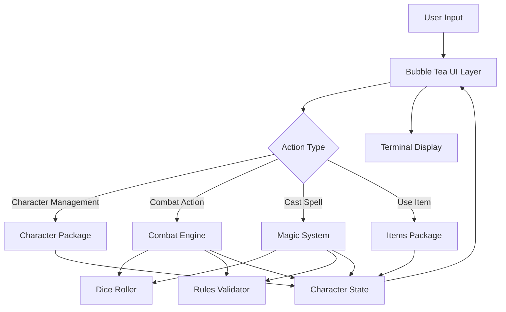
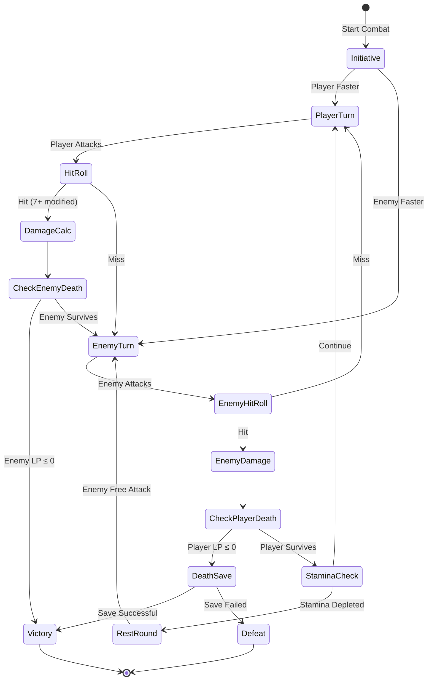
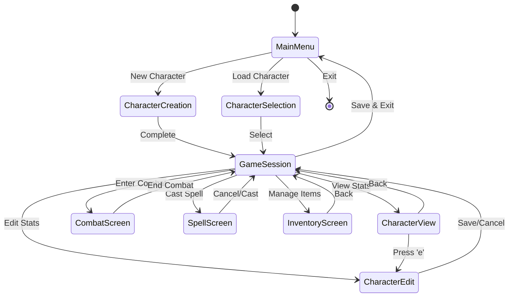

# Design Document: Sagas of the Demonspawn - Go Rules Engine

## 1. Project Overview

### 1.1 Purpose
Create a command-line application that serves as a companion tool for playing the "Sagas of the Demonspawn" gamebook. The application manages character state, automates combat calculations, and provides an intuitive interface for game mechanics while the player reads the physical or digital book.

### 1.2 Dual Objectives
- **Functional Goal:** Provide a practical, easy-to-use CLI tool for managing character stats, combat, magic, and inventory during gameplay
- **Educational Goal:** Serve as a structured learning vehicle for Go development, demonstrating idiomatic patterns, proper project organization, and progressive complexity

### 1.3 Technology Foundation
- **Language:** Go (latest stable version)
- **UI Framework:** Bubble Tea (charmbracelet/bubbletea) - a Go framework for building terminal UIs based on The Elm Architecture
- **Additional Libraries:** Potentially Lip Gloss (styling), Bubbles (pre-built components)

---

## 2. Core Domain Model

### 2.1 Character State Entity

The central data structure representing Fire*Wolf's current state throughout the adventure.

| Attribute | Type | Description | Constraints |
|-----------|------|-------------|-------------|
| Strength (STR) | Integer (0-100) | Physical power, affects damage dealt | Percentage value, rolled at start |
| Speed (SPD) | Integer (0-100) | Agility and reaction time, affects initiative | Percentage value, rolled at start |
| Stamina (STA) | Integer (0-100) | Endurance, determines combat rounds before rest | Percentage value, rolled at start |
| Courage (CRG) | Integer (0-100) | Bravery, affects initiative | Percentage value, rolled at start |
| Luck (LCK) | Integer (0-100) | Fortune, affects hit chance and death saves | Percentage value, rolled at start |
| Charm (CHM) | Integer (0-100) | Charisma and persuasiveness | Percentage value, rolled at start |
| Attraction (ATT) | Integer (0-100) | Personal magnetism | Percentage value, rolled at start |
| Life Points (LP) | Integer | Current health | Derived: Sum of all characteristics + Skill |
| Maximum LP | Integer | Starting/full health value | Fixed after character creation |
| Skill (SKL) | Integer | Combat proficiency | Starts at 0, +1 per enemy killed |
| Power (POW) | Integer | Magical energy reserve | Acquired during adventure, initially 0, spent on spells |
| Maximum POW | Integer | Original Power capacity | Set when POW first acquired, can be increased |
| Current Weapon | Weapon reference | Equipped weapon | Single weapon slot |
| Current Armor | Armor reference | Equipped armor | Single armor slot |
| Has Shield | Boolean | Shield equipped status | Cannot use two-handed weapons with shield |
| Inventory | Collection of Items | Possessions and special items | Variable capacity |
| Sections Visited | Collection of Integers | Book sections already explored | Used for RETRACE spell |
| Death Save Used | Boolean | Whether the one-time death save has been consumed | Resets per combat encounter |

### 2.2 Enemy Entity

Represents adversaries encountered during the adventure.

| Attribute | Type | Description |
|-----------|------|-------------|
| Name | String | Enemy identifier |
| Life Points | Integer | Current health |
| Maximum LP | Integer | Starting health |
| Strength | Integer | Affects damage dealt |
| Speed | Integer | Affects initiative |
| Courage | Integer | Affects initiative |
| Luck | Integer | Affects hit chance |
| Is Demonspawn | Boolean | Vulnerable to Orb, affected by special rules |
| Armor Value | Integer | Damage reduction |
| Attack Bonus | Integer | Additional damage per hit |

### 2.3 Item Types

#### 2.3.1 Weapon Items

| Weapon | Damage Bonus | Special Properties |
|--------|--------------|-------------------|
| Arrow | +10 | Ranged, single use |
| Axe | +15 | Standard melee |
| Club | +8 | Standard melee |
| Dagger | +5 | Light, concealable |
| Flail | +7 | Standard melee |
| Halberd | +12 | Two-handed |
| Lance | +12 | Mounted/charge weapon |
| Mace | +14 | Standard melee |
| Spear | +12 | Can be thrown |
| Sword | +10 | Standard melee |
| Doombringer | +20 | Cursed: -10 LP per attack, heal on hit |

#### 2.3.2 Armor Items

| Armor | Protection Value | Movement Penalty |
|-------|------------------|------------------|
| Leather Armor | -5 damage | None |
| Chain Mail | -8 damage | None |
| Plate Mail | -12 damage | None |
| Shield | -7 damage (alone) | None |
| Shield with Armor | -5 damage (total) | Slower weapon changes |

#### 2.3.3 Special Items

| Item | Capacity/Charges | Effect |
|------|------------------|--------|
| Healing Stone | 50 LP total | Restore 1d6 × 10 LP once per combat, recharges in 48 hours |
| The Orb | Single use (thrown) | Held: 2× damage to Demonspawn; Thrown: instant kill on 4+, else 200 damage |

### 2.4 Spell System

| Spell | Power Cost | Effect Category | Success Requirement |
|-------|------------|-----------------|---------------------|
| ARMOUR | 25 | Defensive buff | -10 damage reduction for section |
| CRYPT | 150 | Power restoration | Return to Crypts for power tests |
| FIREBALL | 15 | Direct damage | 50 LP to enemy |
| INVISIBILITY | 30 | Combat avoidance | Skip combat, proceed as if won |
| PARALYSIS | 30 | Escape | Freeze enemy, escape to next section |
| POISON NEEDLE | 25 | Instant kill | 50% chance (4-6 on d6) if not immune |
| RESURRECTION | 50 | Death recovery | Reroll character, return to section start |
| RETRACE | 20 | Navigation | Return to previous section |
| TIMEWARP | 10 | Combat reset | Restore both combatants to section-start LP |
| XENOPHOBIA | 15 | Enemy debuff | -5 to enemy damage |

---

## 3. Application Architecture

### 3.1 High-Level Structure

The application follows a layered architecture with clear separation of concerns, organized into Go packages:

```
saga-demonspawn/
├── cmd/
│   └── saga/           # Application entry point
├── internal/
│   ├── character/      # Character state and operations
│   ├── combat/         # Combat resolution engine
│   ├── magic/          # Spell casting system
│   ├── items/          # Inventory and equipment
│   ├── dice/           # Random number generation
│   └── rules/          # Game rules constants and validators
├── pkg/
│   └── ui/             # Bubble Tea UI components
└── data/               # Game data (enemies, items, sections)
```

### 3.2 Package Responsibilities

| Package | Responsibility | Key Types |
|---------|---------------|-----------|
| cmd/saga | Main function, dependency wiring, app initialization | main() |
| internal/character | Character creation, stat management, persistence | Character, Stats |
| internal/combat | Combat flow, damage calculation, initiative | CombatEngine, Round, Attack |
| internal/magic | Spell validation, power management, effects | SpellCaster, Spell, Effect |
| internal/items | Item definitions, inventory operations, equipment | Item, Inventory, Equipment |
| internal/dice | Dice rolling with configurable randomness | Dice, Roll |
| internal/rules | Game constants, validation rules | Constants, Validators |
| pkg/ui | Bubble Tea models, views, user interaction | Model, View, Update |

### 3.3 Component Interaction Flow



---

## 4. User Interface Design

### 4.1 Navigation Structure

The application uses a hierarchical menu system with the following screens:

**Main Menu** (Entry point)
- New Character
- Load Character
- Exit

**Game Session Menu** (After character loaded)
- View Character
- Edit Character Stats
- Combat
- Cast Spell (only visible if POW > 0)
- Manage Inventory
- Save & Exit

**Design Rationale:**
- Navigation structure focuses on core gameplay loops: character management, combat, magic, and inventory
- Section/travel tracking removed from initial scope as it's not essential for the companion tool's primary purpose
- Player can manually track their position in the physical/digital book
- Edit Character Stats enables direct stat modifications as instructed by book events

### 4.2 Screen Specifications

#### 4.2.1 Character Creation Flow

**Step 1: Roll Characteristics**
- Display: Seven characteristics with roll buttons
- Action: Roll 2d6 × 10 for each stat (range 20-120, typically 40-90)
- Option: Reroll all or accept
- Validation: Must roll all seven before proceeding

**Step 2: Calculate Derived Values**
- Display: Automatically calculate and show LP (sum of all characteristics)
- Display: Show SKL starting at 0, POW starting at 0 (not yet acquired)
- Display: Show final character summary

**Step 3: Starting Equipment**
- Selection: Choose starting weapon from basic set (Sword, Dagger, Club)
- Selection: Choose starting armor (None, Leather Armor)
- Confirmation: Review complete character sheet

#### 4.2.2 Character View Screen

Display all character information in organized sections:

| Section | Information Displayed |
|---------|----------------------|
| Core Stats | STR, SPD, STA, CRG, LCK, CHM, ATT (current values) |
| Resources | LP (current/max), SKL, POW (current/max) only if POW acquired |
| Equipment | Weapon, Armor, Shield status |
| Status Effects | Active spells, buffs, debuffs (only if magic available) |
| Progress | Enemies defeated |

**Navigation:**
- Action: Press 'e' to enter Edit mode
- Action: Press 'b' to return to main menu

#### 4.2.3 Character Edit Screen

Allows manual modification of character stats as instructed by the book.

**Purpose:** The gamebook may instruct players to modify stats directly (e.g., "Increase your STRENGTH by 10", "Reduce your maximum LP by 5", "Add 20 to your POWER"). This screen provides a straightforward interface for these adjustments.

**Layout:**

| Field Category | Editable Fields | Input Type |
|----------------|-----------------|------------|
| Characteristics | STR, SPD, STA, CRG, LCK, CHM, ATT | Numeric input (0-999) |
| Life Points | Current LP, Maximum LP | Numeric input (0-999) |
| Skill | SKL | Numeric input (0-999) |
| Power | Current POW, Maximum POW (if unlocked) | Numeric input (0-999) |

**Interface Flow:**
1. Display current values for all editable fields
2. Highlight selected field
3. Allow direct numeric entry to modify value
4. Show real-time preview of changes
5. Provide increment/decrement buttons (+1, -1, +10, -10) for fine adjustments
6. Validation: Warn if current value exceeds maximum (e.g., LP > Max LP)
7. Confirmation prompt before saving changes
8. Option to cancel and revert all changes

**Validation Rules:**
- All values must be non-negative
- Warning (not block) if current LP/POW exceeds maximum
- No upper limit enforced (book may grant extraordinary values)

**Use Cases:**
- Book says "Add 15 to your STRENGTH": Navigate to STR, add 15
- Book says "Your maximum Life Points are now 500": Edit Max LP to 500
- Book says "Lose 20 Life Points": Navigate to Current LP, subtract 20
- Book says "Gain 1 SKL point": Navigate to SKL, increment by 1

#### 4.2.4 Combat Interface

**Pre-Combat Setup**
- Input: Enemy stats (manual entry or selection from predefined list)
- Display: Enemy summary
- Option: Flee (if rules permit)
- Action: Begin combat or cancel

**Combat Round View**



**Round Display Elements:**
- Turn indicator (Your Turn / Enemy Turn)
- Current LP for both combatants
- Last action result (hit/miss, damage dealt/taken)
- Active effects (ARMOUR, XENOPHOBIA, etc.)
- Actions available: Attack, Use Item, Cast Spell (only if POW > 0), Flee

**Combat Log:**
- Scrollable history of all rolls and results
- Color-coded (green for player hits, red for damage taken)

#### 4.2.5 Magic System Interface

**Important:** This entire interface is hidden until the character acquires POW during the adventure (POW > 0).

**Spell Selection Screen**
- List all available spells with: Name, POW cost, Current POW, Effect description
- Highlight spells already cast this section (greyed out, cannot recast)
- Validation: Block spells if insufficient POW

**Casting Sequence Display**
1. Natural Inclination Check: Show 2d6 roll, require 4+ on first spell of section
2. Power Deduction: Show current POW, cost, resulting POW
3. Fundamental Failure Rate: Show 2d6 roll, require 6+
4. Result: Display success/failure message and effect

**LP-to-POW Conversion Option**
- Slider or input: How many LP to sacrifice
- Display: Current LP/POW, ratio (1:1), new values
- Confirmation: Accept or cancel

#### 4.2.6 Inventory Management Screen

**Layout:**
- **Equipped:** Display current weapon, armor, shield (highlighted)
- **Backpack:** Scrollable list of all items
- **Actions per item:** Use, Equip, Drop, Examine

**Item Examination Modal:**
- Item name and type
- Stats (damage bonus, protection, charges)
- Special rules description
- Equipped status

---

## 5. Core Gameplay Mechanics

### 5.1 Combat Resolution Process

The combat engine orchestrates the following sequence each round:

#### 5.1.1 Initiative Determination (First Round Only)

**Calculation:**
- Player score = 2d6 + (SPD + CRG + LCK)
- Enemy score = 2d6 + (enemy SPD + CRG + LCK)
- Higher score attacks first
- After first round, combatants alternate

**Edge Case:**
- Tie: Player wins initiative

#### 5.1.2 Attack Resolution

**To-Hit Calculation:**
- Base requirement: 7 on 2d6
- Skill modifier: For every 10 full SKL points, reduce requirement by 1
- Luck modifier: If LCK ≥ 72, reduce requirement by 1
- Minimum requirement: 2 (always a chance to miss)

**Example:**
- Player has SKL 25, LCK 80
- Skill modifier: -2 (25 ÷ 10 = 2 full increments)
- Luck modifier: -1 (LCK ≥ 72)
- Final requirement: 7 - 2 - 1 = 4

#### 5.1.3 Damage Calculation

**Formula:**
1. Base damage = (2d6 hit roll) × 5
2. Strength bonus = (STR ÷ 10, rounded down) × 5
3. Weapon bonus = weapon damage value
4. Total damage = Base + STR bonus + Weapon bonus
5. Apply defender's armor reduction

**Example:**
- Player rolls 9 to hit (2d6)
- Player has STR 65, wielding Sword (+10)
- Base: 9 × 5 = 45
- STR bonus: (65 ÷ 10 = 6) × 5 = 30
- Weapon: +10
- Total: 45 + 30 + 10 = 85
- Enemy has Leather Armor (-5)
- Final damage: 85 - 5 = 80 LP

#### 5.1.4 Special Combat Rules

**Stamina and Endurance:**
- Combat rounds before rest = STA ÷ 20 (rounded down)
- When limit reached: Player must rest one round (skip turn, enemy gets free attack)
- Counter resets after rest

**Death Save Mechanism:**
- Trigger: Player LP drops to 0 or below
- Roll: 2d6 × 10
- Success condition: Result ≤ LCK
- Effect if successful: Restore LP to maximum, restart combat from beginning with fresh enemy
- Limitation: Once per combat encounter only

**Doombringer Special Mechanics:**
- Before each attack attempt:
  - Deduct 10 LP from player immediately
  - If this kills player (LP ≤ 0), attack fails and player dies
- On successful hit:
  - Calculate total damage dealt to enemy (after armor)
  - Heal player for exact damage amount
  - Cannot exceed maximum LP

**The Orb Usage:**
- **Held mode:** Must be in left hand (cannot use shield), doubles all damage to Demonspawn after all calculations
- **Thrown mode:** Separate attack action
  - Roll 2d6, hit on 4+
  - If hit: Instant kill (Demonspawn only)
  - If miss: Deal 200 damage (Demonspawn only)
  - Orb destroyed after use
- No effect on non-Demonspawn enemies

### 5.2 Magic System Workflow

**Availability:** The entire magic system is unavailable at the start of the game. It only becomes accessible once the player acquires POW during the adventure (typically through story events or finding magical items). Until POW is acquired and set to a value greater than 0, all magic-related UI elements and options remain hidden.

#### 5.2.1 Casting Prerequisites

**Natural Inclination Check (Section-Wide):**
- Required: First spell cast in any new section
- Roll: 2d6
- Success: 4 or higher allows magic use for entire section
- Failure: No magic allowed in this section, regardless of danger

**Power Availability:**
- Must have POW ≥ spell cost
- Option: Sacrifice LP for POW at 1:1 ratio before casting

#### 5.2.2 Casting Sequence

1. **Verify Spell Availability:** Check if spell already cast this section (forbidden to repeat)
2. **Natural Inclination (if first spell):** Perform check as above
3. **Deduct POW:** Subtract cost immediately (spent even if spell fails)
4. **Fundamental Failure Rate (FFR):** Roll 2d6, require 6+ to succeed
5. **Apply Effect:** If successful, execute spell effect immediately

#### 5.2.3 Spell Effect Resolution

| Spell | Timing | Duration | Effect Details |
|-------|--------|----------|----------------|
| ARMOUR | Pre-combat or in-combat | Rest of section | Apply -10 to all incoming damage |
| CRYPT | Out of combat | Instant | Transport to Crypt location, enable power restoration tests |
| FIREBALL | In combat, on player turn | Instant | Deal 50 LP to enemy (ignores armor) |
| INVISIBILITY | Pre-combat or in-combat | Rest of section | Skip all combat, proceed as if victorious, cannot attack |
| PARALYSIS | In combat | Instant | End combat, escape to next section |
| POISON NEEDLE | In combat, on player turn | Instant | Roll 1d6: 1-3 immune (no effect), 4-6 instant death |
| RESURRECTION | Only when dead | Instant | Reroll all character stats, return to section start, enemy retains current LP |
| RETRACE | Out of combat | Instant | Select from visited sections list, travel there with current LP/POW |
| TIMEWARP | In combat | Instant | Reset player and enemy LP to section-start values |
| XENOPHOBIA | In combat | Rest of combat | Reduce enemy damage by 5 per hit |

### 5.3 Healing Stone Mechanics

**Usage Constraints:**
- Can be used once per combat encounter
- Must be used between rounds (not during an attack)
- Has 48-hour recharge period (real-time or game-time, to be decided)

**Effect:**
- Roll 1d6
- Multiply result by 10
- Restore that many LP to player
- Cannot exceed maximum LP
- Deduct healed amount from stone's 50 LP capacity

**Capacity Management:**
- Starts at 50 LP
- Recharges to 50 LP after 48 hours from last combat use
- Display remaining capacity and recharge timer

### 5.4 Power Restoration

**Exploration Restoration:**
- Trigger: Entering a new section (not previously visited)
- Effect: Gain 1 POW automatically
- Limitation: Cannot exceed original maximum POW

**CRYPT Spell Restoration:**
- Transport to Crypts
- Present tests/challenges (specific mechanics to be defined based on book content)
- Potential to restore full POW or increase maximum POW

**Initial POW Acquisition:**
- Trigger: Story event or item discovery (manual activation by player when prompted by book)
- Action: Player sets initial POW value when first acquired
- Effect: Magic system becomes available, spell menu appears, maximum POW is recorded

---

## 6. Data Management

### 6.1 Character Persistence Strategy

**Save File Format:**
- Format: JSON (human-readable, easy debugging for learning)
- Location: User's home directory or XDG config directory
- Filename pattern: `character_[name]_[timestamp].json`

**Save File Structure:**

| Section | Data Included |
|---------|---------------|
| Character Stats | All seven characteristics, current and max LP, SKL, current and max POW (if acquired) |
| Equipment State | Weapon, armor, shield equipped |
| Inventory | List of all items with quantities and charges |
| Game Progress | Enemies defeated, magic unlocked flag |
| Spell Tracking | Spells cast recently (to prevent duplicate casting in same section - implementation TBD) |
| Status Flags | Death save used this combat, Healing Stone recharge time |

**Save Triggers:**
- Manual save from menu
- Auto-save after combat victory
- Auto-save after section change
- Auto-save before spell casting

### 6.2 Enemy Database

**Storage Format:**
- Predefined enemies in JSON or YAML files
- Location: `data/enemies/` directory
- One file per enemy type or grouped by section

**Enemy Definition Template:**

| Field | Type | Purpose |
|-------|------|---------|
| ID | String | Unique identifier |
| Name | String | Display name |
| Description | String | Flavor text |
| Base LP | Integer | Starting health |
| STR | Integer | Damage modifier |
| SPD | Integer | Initiative modifier |
| CRG | Integer | Initiative modifier |
| LCK | Integer | Hit modifier |
| Armor | Integer | Damage reduction |
| Attack Bonus | Integer | Extra damage per hit |
| Is Demonspawn | Boolean | Orb vulnerability |
| Special Abilities | List of strings | Custom mechanics (future expansion) |

**Manual Entry Option:**
- For unique enemies not in database
- Form-based input of all enemy stats
- Option to save custom enemy to personal database

### 6.3 Configuration Management

**Application Settings:**
- Dice roll animation speed
- Color scheme preference
- Combat log verbosity
- Auto-save frequency
- File save location

**Storage:**
- Format: YAML or TOML
- Location: XDG config directory
- File: `config.yaml`

---

## 7. Technical Design Patterns

### 7.1 Bubble Tea Architecture Integration

Bubble Tea follows The Elm Architecture with three core concepts:

**Model:**
- Represents the complete application state
- Single source of truth for UI rendering
- Immutable updates (return new model, don't mutate)

**View:**
- Pure function: Model → String
- Renders current state to terminal
- No side effects

**Update:**
- Processes messages (user input, timers, etc.)
- Returns new model and optional commands
- Orchestrates state transitions

**Application Structure:**

| Component | Responsibility |
|-----------|---------------|
| Main Model | Root state containing current screen, character, combat state |
| Screen Models | Sub-models for each UI screen (menu, combat, inventory) |
| Messages | Events like KeyPress, CombatResult, SpellCast |
| Commands | Side effects like SaveFile, LoadCharacter, RollDice |

### 7.2 State Management Strategy

**Approach:** Hierarchical state with screen-specific models

**Root Model Structure:**
- CurrentScreen (enum: MainMenu, CharacterView, Combat, etc.)
- Character (current character state)
- MenuModel (menu-specific state)
- CombatModel (combat-specific state)
- InventoryModel (inventory-specific state)
- SpellModel (spell-specific state)

**State Transition Flow:**


### 7.3 Combat Engine Design

**Engine Responsibilities:**
- Orchestrate combat flow from start to finish
- Maintain combat state (rounds, turn order, stamina tracking)
- Apply rules and calculate outcomes
- Coordinate with dice roller and rules validator

**Combat State Model:**

| Field | Purpose |
|-------|---------|
| PlayerCombatant | Current player stats snapshot |
| EnemyCombatant | Enemy stats snapshot |
| CurrentRound | Round counter |
| PlayerTurn | Whose turn it is |
| CombatLog | History of all actions |
| PlayerStaminaRounds | Rounds until rest needed |
| ActiveEffects | Spells/buffs currently applied |
| DeathSaveAvailable | Whether player can still death save |

**Combat Command Pattern:**
- Each action (Attack, UseItem, CastSpell, Flee) returns a CombatResult
- CombatResult contains: Success/Failure, Damage dealt, New state, Log messages
- Update function applies CombatResult to model

### 7.4 Dice Rolling Abstraction

**Purpose:**
- Centralize all randomness for testability
- Enable deterministic testing with seeded RNG
- Support future features (roll history, statistics)

**Interface Design:**

| Method | Parameters | Returns | Purpose |
|--------|-----------|---------|---------|
| Roll2D6 | None | Integer (2-12) | Standard two-die roll |
| RollPercentage | None | Integer (0-100) | For stat generation variant |
| RollWithAdvantage | DieType, Count | Integer | Future expansion |
| SetSeed | Seed value | None | For testing |

**Implementation Strategy:**
- Use Go's math/rand with custom seed
- Wrapper interface allows mock implementations in tests
- Display rolls in UI with animation option

---

## 8. Development Phases

This project is structured as a learning journey with incremental complexity.

### Phase 1: Foundation & Character Management

**Goal:** Establish project structure and implement character creation

**Learning Objectives:**
- Go module initialization and dependency management
- Package organization and internal vs. pkg directories
- Struct design and methods
- JSON marshaling/unmarshaling
- Basic Bubble Tea model/update/view pattern

**Deliverables:**
- Project scaffold with all package directories
- Character struct with validation
- Character creation UI with stat rolling (7 characteristics only, POW not included)
- Character edit UI with direct stat modification
- Save/load character to JSON
- Simple main menu navigation

**Technical Focus:**
- Proper error handling patterns
- Table-driven tests for character validation
- Clean separation of concerns
- Feature flags for progressive unlocking (magic system)
- Input validation and sanitization for user-entered values

### Phase 2: Combat System Core

**Goal:** Implement complete combat mechanics without magic

**Learning Objectives:**
- Complex state management in Bubble Tea
- Interface design for combat actions
- Calculation engine with modifier chains
- Dice abstraction and testing

**Deliverables:**
- Combat engine with initiative, hit calculation, damage
- Combat UI with turn-based flow
- Enemy database loading
- Combat log display
- Stamina and death save mechanics

**Technical Focus:**
- Stateful combat model
- Immutable state updates
- Test coverage for all combat calculations
- Table-driven combat scenario tests

### Phase 3: Items & Inventory

**Goal:** Add full inventory and equipment system

**Learning Objectives:**
- Collection management in Go (slices, maps)
- Polymorphic item behaviors (interfaces)
- Equipment slot validation

**Deliverables:**
- Inventory UI with scrolling list
- Equipment system (weapon, armor, shield)
- Item usage in combat (Healing Stone)
- Special item mechanics (Doombringer, Orb)

**Technical Focus:**
- Item interface with different implementations
- Inventory constraints and validation
- Integration with combat system

### Phase 4: Magic System

**Goal:** Implement complete spell casting with all rules

**Learning Objectives:**
- Complex multi-step processes
- State guards and validation chains
- Effect application patterns
- Conditional feature visibility

**Deliverables:**
- POW acquisition mechanism (manual unlock when player finds magic in book)
- Spell casting UI (hidden until POW acquired)
- All 10 spells implemented
- Natural inclination and FFR checks
- LP-to-POW conversion
- Section-based spell tracking

**Technical Focus:**
- Feature toggle pattern for magic system
- Spell effect composition
- Power management
- Integration with combat and navigation
- UI state management for conditional features

### Phase 5: Polish & Advanced Features

**Goal:** Enhance UX and add quality-of-life features

**Learning Objectives:**
- Advanced Bubble Tea components (Lip Gloss styling)
- Configuration management
- Performance optimization

**Deliverables:**
- Color themes and styling
- Combat animations
- Statistics tracking (enemies defeated, sections visited)
- Help system and rule reference
- Configuration file management

**Technical Focus:**
- UI/UX refinement
- Code refactoring and DRY principles
- Performance profiling

---

## 9. Testing Strategy

### 9.1 Testing Approach per Phase

**Unit Testing Focus:**
- All calculation functions (damage, hit chance, modifiers)
- Character validation rules
- Item effect application
- Spell power/cost validation

**Test Data Strategy:**
- Table-driven tests for combat scenarios
- Golden files for JSON save/load
- Mock dice roller for deterministic tests

**Integration Testing:**
- Full combat scenarios from start to finish
- Character creation → save → load → combat flow
- Spell casting with effect persistence

**Example Test Scenarios:**

| Scenario | Input | Expected Output |
|----------|-------|-----------------|
| Basic hit calculation | SKL 0, LCK 50, roll 7 | Hit successful |
| Modified hit calculation | SKL 25, LCK 80, roll 4 | Hit successful (requirement reduced to 4) |
| Damage calculation | Roll 9, STR 65, Sword | 45 + 30 + 10 = 85 damage |
| Doombringer LP drain | LP 100, attack with Doombringer | LP immediately becomes 90 before hit roll |
| Death save success | LP -5, LCK 75, roll 70 | Survive, LP restored to max |
| Stamina depletion | STA 40, round 3 | Must rest after round 2 (40÷20=2) |

### 9.2 Go Testing Best Practices to Learn

**Concepts to Cover:**
- `testing` package basics
- Table-driven tests with subtests
- Test fixtures and golden files
- Mocking with interfaces
- Benchmarking combat calculations
- Code coverage analysis

---

## 10. User Experience Considerations

### 10.1 Usability Principles

**Ease of Use:**
- Clear keyboard shortcuts displayed on every screen
- Confirmation prompts for destructive actions (delete character, spend LP for POW)
- Default selections for common choices
- Back/cancel option on every screen

**Feedback:**
- Immediate visual feedback for every action
- Success/error messages with clear language
- Color coding (green = success, red = danger/damage, yellow = warning)
- Progress indicators for multi-step processes

**Accessibility:**
- High contrast color schemes
- Option to disable animations
- Verbose mode with detailed explanations
- Keyboard-only navigation (no mouse required)

### 10.2 Error Handling & Validation

**User Input Validation:**
- Validate all manual entries (enemy stats, section numbers)
- Range checking (LP can't go below 0, stats must be 0-100)
- Clear error messages explaining what went wrong and how to fix it

**Graceful Degradation:**
- If save file corrupted, offer to start new character
- If enemy database missing, allow manual entry
- If config invalid, use sensible defaults

**Error Message Quality:**

| Error Situation | Poor Message | Good Message |
|-----------------|--------------|--------------|
| Insufficient POW | "Cannot cast" | "Insufficient Power: Need 25 POW, have 15. Sacrifice 10 LP to proceed?" |
| Spell already cast | "Invalid" | "FIREBALL already cast this section (Section 127). Cannot cast same spell twice." |
| Death save failed | "You died" | "Death save failed (rolled 85, needed ≤75 Luck). Combat lost." |

### 10.3 Learning Curve for New Players

**First-Time Experience:**
- Tutorial mode option that explains each screen
- Rule references accessible via help key (F1 or ?)
- Example calculations shown during character creation
- Tooltips for complex mechanics (Doombringer curse, Orb usage)

**Progressive Disclosure:**
- Show basic stats first, advanced stats (modifiers, derived values) on demand
- Simple mode vs. detailed mode for combat log
- Abbreviated vs. full spell descriptions

---

## 11. Open Design Questions

These questions should be resolved before or during implementation:

### 11.1 Scope Clarifications

**Question 1: Spell Section Tracking**
- Since we removed section navigation, how should we prevent casting the same spell twice in a section?
- Options: a) Remove restriction entirely, b) Track spell cooldowns by time or combat count, c) Manual reset button "New Section" that clears spell history
- Recommended: Option (c) - Add "New Section" button in main menu that resets spell-cast-this-section flags and natural inclination check

**Question 2: Healing Stone Recharge Timer**
- Should the 48-hour recharge be real-world time or game time?
- Decision impact: Real-time requires persistent timestamp storage
- Recommended: Game time (48 section changes or combat encounters) for simplicity

**Question 2b: POW Acquisition Method**
- How should the player indicate they've acquired POW from the book?
- Options: a) Manual menu option "Unlock Magic" with input prompt, b) Special item that triggers it, c) Section-based automatic unlock
- Recommended: Manual menu option for flexibility, player enters initial POW value when story dictates

**Question 3: Stat Edit Limits**
- Should there be upper limits on edited stats (e.g., max 999) or allow any value?
- Decision impact: Validation complexity vs. flexibility
- Recommended: Soft limits with warnings, allow overrides since book may have exceptional cases

**Question 4: Enemy Database Completeness**
- Should we pre-populate all enemies from the book, or start with manual entry only?
- Decision impact: Pre-populated requires book content extraction
- Recommended: Start with manual entry, add common enemies later based on feedback

### 11.2 Technical Decisions

**Question 5: Dice Roll Visibility**
- Should all dice rolls be visible to player, or hide some for suspense?
- Decision impact: Transparency vs. dramatic tension
- Recommended: All visible by default, option to hide enemy rolls

**Question 6: Auto-Save Strategy**
- How aggressive should auto-saving be?
- Decision impact: Data safety vs. potential for save-scumming
- Recommended: Auto-save after major events (combat end, section change), manual save anytime

**Question 7: State Recovery**
- What happens if player closes app mid-combat?
- Decision impact: Combat state persistence complexity
- Recommended: Phase 1-4 lose mid-combat state, Phase 5 add combat state saving

### 11.3 Future Expansion Considerations

**Potential Features Beyond Initial Scope:**
- Multiple character slots with quick switching
- Combat replay/simulation mode for testing builds
- Statistics dashboard (damage dealt, accuracy rate, spells cast)
- Export character sheet to printable format
- Section tracking and navigation (if needed later)
- Full game history log (all stat changes, combats, decisions)
- Undo/redo for stat edits

---

## 12. Success Criteria

### 12.1 Functional Completeness

The application is considered functionally complete when:
- User can create, save, and load characters with seven characteristics only (POW not rolled at creation)
- User can manually edit all character stats (characteristics, LP, max LP, SKL, POW) as directed by the book
- Combat system correctly implements all rules: initiative, hit calculation, damage, stamina, death saves
- Magic system can be unlocked during play when player acquires POW in the story
- All 10 spells are implemented with correct power costs, checks, and effects
- Inventory system supports all weapon and armor types, plus special items
- Doombringer and Orb special mechanics work as specified
- Healing Stone usage and recharge function correctly
- UI correctly hides magic features until POW is acquired
- Stat editing has appropriate validation and confirmation

### 12.2 Usability Standards

The application meets usability standards when:
- A new user can create a character and start combat within 2 minutes without external help
- All screens have clear navigation instructions
- Error messages are helpful and guide user to resolution
- No more than 3 key presses needed for common actions
- Application responds to input within 100ms (no perceived lag)

### 12.3 Code Quality (Learning Objectives)

The codebase demonstrates Go proficiency when:
- All packages follow single responsibility principle
- Test coverage exceeds 80% for business logic
- No public API functions lack documentation comments
- Code passes `go vet` and `golint` without warnings
- Follows standard Go project layout (golang-standards/project-layout)

### 12.4 Educational Value

The project successfully serves as a learning tool when:
- Each phase introduces new Go concepts without overwhelming complexity
- Code comments explain "why" not just "what"
- README includes lessons learned and Go patterns demonstrated
- Project can serve as a reference for future Go CLI applications

---

## 13. Delivery Approach

### 13.1 Recommended Implementation Order

1. **Week 1-2:** Phase 1 (Foundation & Character Management)
   - Set up Go module and project structure
   - Implement Character struct and validation (7 characteristics, POW defaults to 0)
   - Create basic Bubble Tea app with main menu
   - Build character creation UI with dice rolling (7 stats only)
   - Build character edit UI with direct stat modification
   - Implement JSON save/load with magic unlocked flag

2. **Week 3-4:** Phase 2 (Combat System Core)
   - Design Combat engine architecture
   - Implement dice abstraction
   - Build combat UI with turn-based flow
   - Add hit calculation and damage formulas
   - Implement stamina and death save mechanics

3. **Week 5:** Phase 3 (Items & Inventory)
   - Create Item interface and implementations
   - Build inventory UI
   - Implement equipment system
   - Add Healing Stone mechanics
   - Integrate items with combat

4. **Week 6:** Phase 4 (Magic System)
   - Design Spell system architecture with feature toggle
   - Implement POW acquisition/unlock mechanism
   - Implement power management
   - Build spell casting UI (conditionally displayed)
   - Add all spell effects
   - Integrate spells with combat and navigation
   - Test UI state with magic locked and unlocked

5. **Week 7+:** Phase 5 (Polish & Advanced Features)
   - Add Lip Gloss styling
   - Implement configuration system
   - Create help and tutorial system
   - Performance optimization
   - Final testing and bug fixes

### 13.2 Checkpoints

At the end of each phase:
- **Code Review:** Ensure patterns are idiomatic and maintainable
- **Test Review:** Verify coverage and quality
- **User Testing:** Try the application from a player's perspective
- **Reflection:** Document what was learned and what could be improved

---

## 14. Risk Assessment

| Risk | Probability | Impact | Mitigation Strategy |
|------|-------------|--------|---------------------|
| Bubble Tea learning curve too steep | Medium | High | Start with official examples, build simple screens first |
| Combat rules misinterpretation | Medium | High | Create test scenarios from book examples, validate calculations |
| Scope creep (adding features beyond core rules) | High | Medium | Stick to five phases, defer extras to "future" list |
| State management complexity in Bubble Tea | Medium | Medium | Use hierarchical models, keep screen states independent |
| JSON save file corruption | Low | Medium | Add validation on load, backup before overwrite |
| Performance issues with complex UI | Low | Low | Profile early, optimize only if needed |

---

## 15. Confidence Assessment

**Confidence Level: High**

**Confidence Basis:**
- Requirements are well-defined with complete ruleset provided
- Technology choice (Bubble Tea) is appropriate for CLI with active community support
- Phased approach allows incremental learning and validation
- Core mechanics (combat, magic) are deterministic with clear formulas
- No external dependencies or integrations required
- Similar projects exist as reference (roguelikes in Go, gamebook engines)

**Potential Uncertainties:**
- User's Go experience level (assumed beginner-intermediate)
- Time availability for 7+ week timeline
- Preference for certain UI/UX details not specified

**Recommendation:**
Proceed with Phase 1 implementation. The foundation phase is low-risk and will validate both the technical approach and the learning pace before committing to more complex phases.
