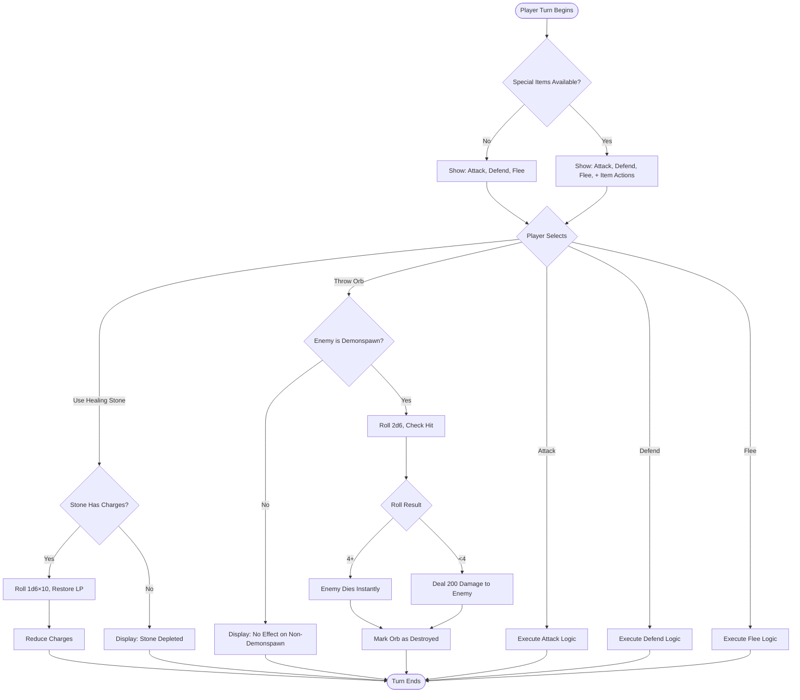

# Phase 3: Items & Inventory System - Design Document

## Overview

Phase 3 introduces a comprehensive inventory management system that enables Fire*Wolf to acquire, manage, and use items during the adventure. The system integrates three special items with unique mechanics (Healing Stone, Doombringer, The Orb) and provides a flexible inventory UI for equipment management both in and out of combat.

## Design Goals

1. **Equipment Management**: Allow players to change weapons, armor, and shields outside of combat
2. **Strategic Resource Management**: Enable meaningful choices about item usage, especially for limited-use items like Healing Stone
3. **Seamless Combat Integration**: Allow item actions during combat turns without disrupting the existing combat flow
4. **Special Item Mechanics**: Implement complex item behaviors (life drain, healing, instant-kill) accurately per ruleset
5. **Extensibility**: Design the system to accommodate future item additions beyond Phase 3

## System Scope

### In Scope

- Full inventory management UI accessible from Game Session menu
- Equipment management: change weapons, armor, and shield outside combat
- "None" weapon option to fight unarmed (nil EquippedWeapon)
- Three special items with complete ruleset mechanics
- Equipment swapping between standard and special items
- Item usage during combat turns
- Healing Stone charge tracking and manual recharge
- Doombringer life drain and soul thirst mechanics
- The Orb held/thrown modes with Demonspawn detection
- Visual inventory display with item descriptions and stats
- Item acquisition workflow
- Equipment browsing and comparison

### Out of Scope

- Shop or trading system (deferred to potential Phase 6)
- Item crafting or upgrading
- Consumable items beyond Healing Stone
- Equipment durability or degradation
- Item weight or encumbrance limits
- Enemy item drops during combat

## Data Model Design

### Inventory Structure

The Character struct already includes basic equipment fields (EquippedWeapon, EquippedArmor, HasShield). Phase 3 extends this with special items and available equipment tracking.

**Existing Equipment Fields** (from Phase 1):
| Field | Type | Purpose |
|-------|------|---------|
| EquippedWeapon | Pointer to items.Weapon | Currently equipped weapon (can be nil for no weapon) |
| EquippedArmor | Pointer to items.Armor | Currently equipped armor |
| HasShield | Boolean | Whether shield is equipped |

**New Special Items Fields** (Phase 3):
| Field | Type | Purpose |
|-------|------|---------|
| SpecialItems | Map of item name to SpecialItem | Special items with unique mechanics |
| AvailableWeapons | Slice of items.Weapon | All weapons player has found (for future use) |
| AvailableArmor | Slice of items.Armor | All armor player has acquired (for future use) |

**Note**: For Phase 3, all standard weapons and armor from the items package are always available for equipment changes. The AvailableWeapons and AvailableArmor fields are included in the design for potential future phases where equipment must be found.

### SpecialItem Structure

Special items require state tracking beyond simple possession. Each special item maintains its own state and usage constraints.

| Field | Type | Purpose | Example Values |
|-------|------|---------|----------------|
| Name | String | Display name and identifier | "Healing Stone", "Doombringer", "The Orb" |
| Description | String | Detailed usage explanation | "Restores 1d6×10 LP once between combat rounds" |
| Possessed | Boolean | Whether character owns this item | true, false |
| UsableInCombat | Boolean | Can be used during combat turns | true for Healing Stone |
| SingleUse | Boolean | Destroyed on use | true for The Orb (thrown mode) |
| StateData | Map of string to interface | Item-specific state | charges, equipped status |

### Healing Stone State

The Healing Stone requires tracking of charge availability. Recharging is done manually through the inventory interface as the player progresses through the gamebook.

| State Field | Type | Purpose |
|------------|------|---------|
| CurrentCharges | Integer | LP remaining in stone (max 50) |
| MaxCharges | Integer | Total capacity (always 50) |

Recharge Logic: Player can manually recharge the stone to full (50 LP) through inventory management when instructed by the gamebook. There is no automatic timer-based recharge.

### The Orb State

The Orb has two distinct usage modes that alter its availability and effects.

| State Field | Type | Purpose |
|------------|------|---------|
| IsEquipped | Boolean | True when held in left hand |
| IsDestroyed | Boolean | True after being thrown |
| ThrowAttempted | Boolean | Tracks if throw has been attempted this combat |

The Orb modes are mutually exclusive during a single combat encounter.

## UI Architecture

### Inventory Management Screen

A new Bubble Tea screen model accessible from the Game Session menu with dedicated navigation and interaction patterns.

#### Screen Layout

```
╔══════════════════════════════════════════════════════════╗
║                   INVENTORY MANAGEMENT                    ║
╠══════════════════════════════════════════════════════════╣
║                                                           ║
║  CURRENTLY EQUIPPED                                       ║
║  ┌─────────────────────────────────────────────────────┐ ║
║  │ Weapon:  None               (0 damage bonus)        │ ║
║  │ Armor:   Leather Armor      (5 protection)          │ ║
║  │ Shield:  Equipped           (5 protection w/armor)  │ ║
║  │                                                      │ ║
║  │ Total Protection: 10                                │ ║
║  └─────────────────────────────────────────────────────┘ ║
║                                                           ║
║  AVAILABLE EQUIPMENT                                      ║
║  ┌─────────────────────────────────────────────────────┐ ║
║  │ WEAPONS                                              │ ║
║  │ > None                      No weapon [EQUIPPED]    │ ║
║  │   Sword                     +10 damage              │ ║
║  │   Dagger                    +5 damage               │ ║
║  │   Axe                       +15 damage              │ ║
║  │   Mace                      +14 damage              │ ║
║  │   Spear                     +12 damage              │ ║
║  │                                                      │ ║
║  │ ARMOR                                                │ ║
║  │   None                      0 protection            │ ║
║  │   Leather Armor             5 protection [EQUIPPED] │ ║
║  │   Chain Mail                8 protection            │ ║
║  │   Plate Mail                12 protection           │ ║
║  │                                                      │ ║
║  │ SHIELD                                               │ ║
║  │   Shield                    7/-5 protection [EQUIPPED]│ ║
║  └─────────────────────────────────────────────────────┘ ║
║                                                           ║
║  SPECIAL ITEMS                                            ║
║  ┌─────────────────────────────────────────────────────┐ ║
║  │   Healing Stone             [AVAILABLE]             │ ║
║  │   Charges: 50/50                                    │ ║
║  │                                                      │ ║
║  │   Doombringer               [NOT POSSESSED]         │ ║
║  │   +20 damage, cursed weapon                         │ ║
║  │                                                      │ ║
║  │   The Orb                   [NOT POSSESSED]         │ ║
║  │   Anti-Demonspawn weapon                            │ ║
║  └─────────────────────────────────────────────────────┘ ║
║                                                           ║
║  ACTIONS                                                  ║
║  [Enter] Equip  [U] Use  [R] Recharge  [I] Info          ║
║  [Q/Esc] Back to Game Session                            ║
╚══════════════════════════════════════════════════════════╝
```

#### Navigation Controls

| Key | Action | Context |
|-----|--------|---------|
| ↑/k | Move cursor up | Navigate all items (weapons, armor, shield, special) |
| ↓/j | Move cursor down | Navigate all items (weapons, armor, shield, special) |
| Enter | Equip/Unequip | Change equipment or toggle shield |
| u | Use item | Healing Stone outside combat (if not depleted) |
| r | Recharge item | Healing Stone recharge to full (when allowed by gamebook) |
| i | Item info | Show detailed description modal |
| q/Esc | Exit | Return to Game Session menu |

#### Equipment Categories Navigation

The inventory screen organizes items into logical categories that the cursor navigates sequentially:

1. **Weapons Section**: "None" option + all available weapons from items package + Doombringer if possessed
2. **Armor Section**: All armor types (None, Leather, Chain, Plate)
3. **Shield Section**: Single toggle for shield equipped/not equipped
4. **Special Items Section**: Healing Stone, Doombringer (if not equipped as weapon), The Orb

Selected equipment is marked with `[EQUIPPED]` indicator. The Currently Equipped panel at the top updates in real-time as selections change.

#### Equipment Management Workflow

When a player selects a weapon or armor piece and presses Enter:
1. The currently equipped item in that category is unequipped
2. The selected item becomes equipped (for weapons, selecting "None" sets EquippedWeapon to nil)
3. The Currently Equipped panel updates immediately
4. Total protection recalculates if armor or shield changed
5. Character struct is updated with new equipment references

For the shield:
- Pressing Enter on the shield line toggles HasShield boolean
- Protection adjusts based on whether armor is equipped (7 solo, 5 with armor)
- Display shows current shield state (Equipped/Not Equipped)

For special items used as weapons (Doombringer):
- Doombringer appears in both Weapons section and Special Items section when possessed
- Equipping it from either location updates the same EquippedWeapon field
- When equipped as weapon, it shows [EQUIPPED] in Weapons section
- When not equipped as weapon, it appears in Special Items section

For "None" weapon:
- Selecting "None" sets EquippedWeapon pointer to nil
- Combat damage calculations use only STR bonus with no weapon bonus
- Displays as "None (0 damage bonus)" in Currently Equipped panel

### Equipment Change Restrictions

Equipment can only be changed outside of combat to maintain tactical realism and prevent mid-combat exploitation.

**Allowed During Combat**:
- View inventory (read-only)
- Use Healing Stone (if available)
- Throw The Orb (if possessed)

**Not Allowed During Combat**:
- Changing weapons
- Changing armor
- Equipping/unequipping shield
- Equipping The Orb to held mode
- Equipping Doombringer as weapon

**UI Behavior**: When accessed during combat, the inventory screen displays "[LOCKED IN COMBAT]" next to equipment sections and Enter key only works for item actions, not equipment changes.

### Combat Integration

During combat, item actions are presented as additional combat action choices alongside Attack, Defend, Flee. Equipment stats are locked to what was equipped when combat began.

#### Combat Action Menu Extension

When special items are available, the combat action menu dynamically expands:

| Combat State | Available Actions |
|-------------|-------------------|
| No special items | Attack, Defend, Flee |
| Healing Stone available | Attack, Defend, Flee, Use Healing Stone |
| The Orb possessed | Attack, Defend, Flee, Throw Orb (if not equipped) |
| Doombringer equipped | Attack (with life drain effect), Defend, Flee |

#### Combat Action Flow



## Special Item Mechanics

### Healing Stone

**Purpose**: Restore LP during extended combat encounters

**Usage Constraints**:
- Can only be used between combat rounds (player's turn)
- Cannot be used if depleted (0 charges remaining)
- Cannot exceed maximum LP from healing
- Must be manually recharged through inventory management when gamebook allows

**Effect Calculation**:
1. Roll 1d6
2. Multiply result by 10
3. Add rolled amount to CurrentLP (capped at MaximumLP)
4. Subtract rolled amount from stone's CurrentCharges
5. If charges reach 0, stone is depleted until manually recharged
6. Display healing amount in combat log

**Recharge Behavior**:
- Player accesses inventory management screen
- Selects Healing Stone and presses 'r' key to recharge
- Confirmation prompt: "Recharge Healing Stone to full? (50 LP)"
- On confirmation, CurrentCharges reset to 50
- This action is only performed when the gamebook instructs (e.g., after resting at an inn, after 48 hours game time, etc.)
- No automatic timer-based recharge

**Edge Cases**:
- If stone would heal beyond MaximumLP, excess is wasted
- If stone has fewer than 10 charges but roll is 1 (10 LP), only remaining charges heal
- Stone cannot be used if character is at MaximumLP
- Stone cannot be recharged if already at full charges (50 LP)
- Recharging is a manual player action based on gamebook progression, not automatic

### Doombringer

**Purpose**: High-risk, high-reward weapon for desperate situations

**Acquisition**: Doombringer must be found during the adventure; not available at character creation

**Equipping Behavior**:
- Can be equipped like any weapon through inventory management
- Replaces currently equipped weapon
- +20 damage bonus (highest in game)
- Special flag indicates life drain mechanics apply

**Combat Mechanics**:

**Blood Price** (Pre-Attack):
1. When player selects Attack action with Doombringer equipped
2. BEFORE to-hit roll is executed
3. Deduct 10 LP from player's CurrentLP immediately
4. If this reduces CurrentLP to 0 or below, player dies before attack resolves
5. Display in combat log: "Doombringer thirsts for blood... -10 LP"

**Soul Thirst** (On Hit):
1. After successful hit and damage calculation
2. Calculate total damage dealt to enemy (including armor reduction)
3. Add that damage amount to player's CurrentLP
4. Healing cannot exceed MaximumLP
5. Display in combat log: "Doombringer feeds on pain... +X LP healed"

**Miss Scenario**:
- Blood Price is still paid (10 LP lost)
- No healing occurs since no damage was dealt
- This creates high risk for low-skill characters

**Example Combat Sequence**:
- Player CurrentLP: 150, Enemy LP: 200
- Player selects Attack with Doombringer
- Blood Price: Player CurrentLP → 140
- To-hit roll: Success
- Damage calculation: 80 damage dealt to enemy
- Soul Thirst: Player CurrentLP → 140 + 80 = 220 (capped at MaximumLP if applicable)
- Enemy LP → 120

### The Orb

**Purpose**: Ultimate weapon against Demonspawn enemies

**Demonspawn Detection**:
The system must identify when an enemy is a Demonspawn. Enemy data structure should include an `IsDemonspawn` boolean field.

**Mode 1: Held (Equipped)**

**Equipping**:
- Selected through inventory management screen
- Equips to left hand (occupies special item slot, not weapon slot)
- Cannot equip shield while Orb is held
- Remains equipped until combat ends or player unequips

**Effect**:
- When player deals damage to a Demonspawn enemy
- After normal damage calculation (including armor reduction)
- Double the final damage amount
- Display in combat log: "The Orb amplifies your strike! Damage doubled!"
- No effect against non-Demonspawn enemies

**Mode 2: Thrown (Single Use)**

**Activation**:
- Available as combat action when Orb is possessed but not equipped
- Can only be thrown once (destroys the Orb)
- Player must confirm throw action due to permanent destruction

**To-Hit Roll**:
- Roll 2d6
- Hit on 4 or higher (easier than normal attack)
- No skill or luck modifiers apply

**Effects**:

Against Demonspawn:
- **Hit (roll 4+)**: Enemy dies instantly regardless of remaining LP
- **Miss (roll 2-3)**: Deal 200 damage to enemy (often fatal anyway)
- Display: "The Orb explodes in brilliant light!"

Against Non-Demonspawn:
- No damage dealt
- Orb is still destroyed
- Display: "The Orb has no effect on this creature!"

**Destruction**:
- After thrown, mark Orb as destroyed
- Remove from inventory permanently
- Cannot be recovered or recharged

## State Management

### Item Acquisition Flow

Items can be acquired during the adventure through story events. The system provides a flexible acquisition mechanism.

**Acquisition Method**:
Through character editing screen or special acquisition UI:
1. Player accesses inventory management
2. Special items show acquisition option if not possessed
3. Confirmation prompt: "Acquire [Item Name]?"
4. On confirmation, set Possessed flag to true
5. Initialize item state (charges, etc.)

**Initial State**:
- Healing Stone: CurrentCharges = 50
- Doombringer: Not equipped, no special state
- The Orb: IsEquipped = false, IsDestroyed = false

### Persistence

All inventory state must persist across save/load operations.

**Character JSON Extension**:

The Character struct will include new inventory fields that serialize to JSON:

| JSON Field | Type | Purpose |
|-----------|------|---------|
| special_items | Array of objects | Each special item with full state |
| healing_stone_charges | Integer | Current Healing Stone charges |
| doombringer_possessed | Boolean | Ownership flag |
| orb_possessed | Boolean | Ownership flag |
| orb_equipped | Boolean | Whether Orb is held |
| orb_destroyed | Boolean | Whether Orb has been thrown |

**Load Behavior**:
- Validate item states on load
- Validate Healing Stone charges are within 0-50 range
- Ensure Orb cannot be both equipped and destroyed simultaneously
- Validate EquippedWeapon pointer (can be nil for no weapon)

### Combat State Integration

The combat system must be aware of equipped special items to modify action availability and damage calculations.

**Combat Model Extension**:

| New Field | Type | Purpose |
|-----------|------|---------|
| healingStoneAvailable | Boolean | Cached availability for quick action menu rendering |
| orbAvailable | Boolean | Whether Orb can be thrown this combat |
| doombringerEquipped | Boolean | Flag to apply life drain mechanics |

These flags are set when combat begins by inspecting the character's inventory state.

## Error Handling and Validation

### Item Usage Validation

Before executing any item action, the system must validate preconditions:

| Item Action | Preconditions | Error Message |
|------------|---------------|---------------|
| Use Healing Stone | Charges > 0, In combat | "The Healing Stone is depleted" |
| Use Healing Stone | CurrentLP < MaximumLP | "You are already at full health" |
| Recharge Healing Stone | Charges < 50 | "The Healing Stone is already fully charged" |
| Equip Doombringer | Not already equipped | "Doombringer is already equipped" |
| Throw Orb | Not already thrown | "The Orb has been destroyed" |
| Throw Orb | Not currently equipped | "Unequip The Orb before throwing" |
| Equip Orb | Not destroyed | "The Orb has been destroyed" |

### State Consistency

The system must prevent invalid state combinations:

**Invariants**:
1. Healing Stone charges cannot exceed 50
2. Healing Stone charges cannot be negative
3. The Orb cannot be both equipped and destroyed
4. Doombringer cannot be equipped if not possessed
5. Only one weapon can be equipped at a time (or none)
6. EquippedWeapon pointer can be nil (represents unarmed)

**Validation Strategy**:
- Check invariants before persisting character state
- Check preconditions before executing item actions
- Display clear error messages when actions are invalid
- Log validation failures for debugging

## Integration Points

### Game Session Menu

The Game Session menu will include a new "Manage Inventory" option positioned between "Combat" and existing options.

**Updated Menu Structure**:
1. View Character
2. Edit Character Stats
3. Combat
4. **Manage Inventory** (NEW)
5. Cast Spell (when magic unlocked)
6. Save & Exit

### Combat Setup Screen

When initiating combat, the system must:
1. Check for equipped special items
2. Cache item availability flags
3. Initialize combat-specific item state (Orb throw attempted, etc.)
4. Handle nil EquippedWeapon for unarmed combat

### Character View Screen

The character view screen should display a summary of possessed special items:

**Display Section**:
```
SPECIAL ITEMS:
  Healing Stone    [AVAILABLE] 50/50 charges
  Doombringer      [EQUIPPED] +20 damage
  The Orb          [POSSESSED] Not equipped
```

This provides at-a-glance awareness without entering inventory management.

## Testing Strategy

### Unit Testing

Test coverage must include:

**Equipment Management Tests**:
- Equipping weapons updates EquippedWeapon pointer
- Selecting "None" weapon sets EquippedWeapon to nil
- Combat with nil weapon uses base damage (no weapon bonus)
- Equipping armor updates EquippedArmor pointer
- Toggling shield updates HasShield boolean
- Total protection calculation with various armor/shield combinations
- Equipping weapon during combat is prevented
- Viewing inventory during combat is allowed

**Healing Stone Tests**:
- Healing calculation with various dice rolls
- Charge depletion behavior
- Manual recharge restores to 50 LP
- Recharge blocked when already at full charges
- Validation when depleted
- Capping healing at MaximumLP

**Doombringer Tests**:
- Blood price deduction before attack
- Death when blood price kills player
- Soul thirst healing calculation
- Healing cap at MaximumLP
- Damage bonus application

**The Orb Tests**:
- Damage doubling when held against Demonspawn
- No effect when held against non-Demonspawn
- Throw to-hit calculation (4+ threshold)
- Instant kill on hit vs. Demonspawn
- 200 damage on miss vs. Demonspawn
- No effect when thrown at non-Demonspawn
- Destruction after throw

### Integration Testing

Test scenarios combining multiple systems:

**Scenario 1: Equipment Changes Between Combats**
1. Start with Sword equipped
2. Open inventory, switch to Axe
3. Verify EquippedWeapon updated
4. Enter combat
5. Verify damage bonus uses Axe (+15)
6. Exit combat
7. Switch to "None" weapon
8. Enter combat with nil weapon
9. Verify only STR bonus applies
10. Verify change persists

**Scenario 2: Healing Stone During Long Combat**
1. Start combat with full Healing Stone (50 charges)
2. Take damage over multiple rounds
3. Use Healing Stone
4. Verify LP restoration
5. Verify charge depletion
6. Continue combat until charges depleted
7. Attempt use when depleted (should fail)
8. Exit combat
9. Manually recharge stone through inventory
10. Verify charges restored to 50

**Scenario 3: Doombringer Risk/Reward**
1. Equip Doombringer via inventory
2. Enter combat at low LP (15 LP)
3. Attack and verify blood price kills player
4. Restart with higher LP (100 LP)
5. Attack, hit, verify healing occurs
6. Attack, miss, verify no healing but blood price paid

**Scenario 4: The Orb vs. Demonspawn**
1. Possess The Orb
2. Enter combat with Demonspawn enemy
3. Hold Orb, attack, verify doubled damage
4. Unequip Orb
5. Throw Orb, hit, verify instant kill
6. Verify Orb is destroyed

**Scenario 5: Save/Load with Items**
1. Acquire all special items
2. Use Healing Stone to deplete charges
3. Equip Doombringer
4. Save character
5. Load character
6. Verify all item states restored correctly

## User Experience Considerations

### Visual Feedback

Item actions must provide clear, immediate feedback:

**Combat Log Messages**:
- Healing Stone: "You invoke the Healing Stone... +40 LP restored! (Charges: 10/50)"
- Doombringer Blood Price: "Doombringer drinks your blood... -10 LP"
- Doombringer Soul Thirst: "Your wound closes as Doombringer feeds... +65 LP healed!"
- Orb Held: "The Orb pulses with power! Damage doubled: 120 → 240"
- Orb Thrown Hit: "The Orb strikes true! The Demonspawn is annihilated!"
- Orb Thrown Miss: "The Orb's light sears the Demonspawn! 200 damage dealt!"

### Item Descriptions

All items should have detailed descriptions visible in the inventory screen:

**Healing Stone**:
"A mystical gem that channels life energy. Use between combat rounds to restore 1d6×10 LP. The stone holds 50 LP total. Recharge manually through inventory when instructed by the gamebook."

**Doombringer**:
"The cursed black axe of legend. Grants +20 damage but drinks 10 LP with every swing. On a successful hit, you absorb LP equal to the damage dealt. Wield with caution - it may kill you before your enemy."

**The Orb**:
"An ancient weapon forged to destroy Demonspawn. When held, doubles all damage against Demonspawn. Can be thrown to instantly kill a Demonspawn (4+ to hit) or deal 200 damage on a miss. Has no effect on mortals. Destroyed when thrown."

### Tutorial Hints

When acquiring each item for the first time, display a brief tutorial:

**First Acquisition Prompts**:
- Healing Stone: "You can use this item during combat from the action menu. Press 'r' in inventory to recharge when the gamebook allows."
- Doombringer: "Warning: This weapon will drain your life with every attack!"
- The Orb: "This weapon is most effective against Demonspawn enemies."

## Implementation Phases

The Phase 3 implementation should follow a structured approach:

### Phase 3.1: Inventory UI and Equipment Management
- Create InventoryManagementModel with Bubble Tea
- Implement screen layout and rendering
- Add navigation for weapons, armor, shield sections
- Include "None" weapon option
- Implement equipment change logic (update EquippedWeapon, EquippedArmor, HasShield)
- Handle nil EquippedWeapon for unarmed combat
- Integrate with Game Session menu
- Add visual feedback for equipped items
- Test equipment changes persist to Character struct

### Phase 3.2: Special Items Data Model
- Extend Character struct with special item fields
- Implement SpecialItem structures
- Add item state management methods
- Add special items to inventory display
- Implement item acquisition workflow
- Write unit tests for item state

### Phase 3.3: Healing Stone
- Implement Healing Stone mechanics
- Add charge tracking and display
- Implement combat usage from action menu
- Add manual recharge command (r key)
- Add recharge confirmation and validation
- Write unit tests for healing calculations

### Phase 3.4: Doombringer
- Implement Doombringer as equippable weapon
- Add blood price pre-attack logic
- Add soul thirst healing on hit
- Add combat log messages
- Write unit tests for life drain mechanics

### Phase 3.5: The Orb
- Implement The Orb held mode
- Add damage doubling for Demonspawn
- Implement throw action with instant kill
- Add Demonspawn detection to enemy data
- Add combat log messages
- Write unit tests for both modes

### Phase 3.6: Persistence and Polish
- Update JSON serialization for inventory
- Add Character View item summary
- Implement save/load validation
- Add visual polish and error messages
- Write integration tests
- Update README with Phase 3 features
- Create PHASE3_COMPLETE.md

## Acceptance Criteria

Phase 3 is complete when:

1. Players can change weapons, armor, and shields through inventory management UI
2. Players can equip "None" as a weapon (nil EquippedWeapon)
3. Equipment changes persist to Character struct and save files
4. Combat with nil weapon uses base damage (no weapon bonus)
5. All three special items are fully implemented with accurate ruleset mechanics
6. Items can be acquired, equipped, and used correctly
7. Combat actions include item usage with proper validation
8. Healing Stone charge tracking and manual recharge work correctly
9. Doombringer blood price and soul thirst mechanics function as specified
10. The Orb held and thrown modes work correctly with Demonspawn detection
11. All item state persists across save/load operations
12. Unit tests achieve 100% coverage of item mechanics
13. Integration tests pass for all item interaction scenarios
14. User documentation is updated to reflect new features
15. No regression in existing Phase 1 and Phase 2 functionality

## Future Enhancements

Potential extensions beyond Phase 3 scope:

- Additional special items from the gamebook
- General inventory for consumables and quest items
- Item discovery system (find items during adventure)
- Item weight and carrying capacity
- Item trading or shops
- Item durability and repair
- Item combinations or crafting
- Visual item icons in UI
- Item effects outside combat (stat boosts, etc.)

These enhancements would be addressed in potential Phase 6 or later iterations.
