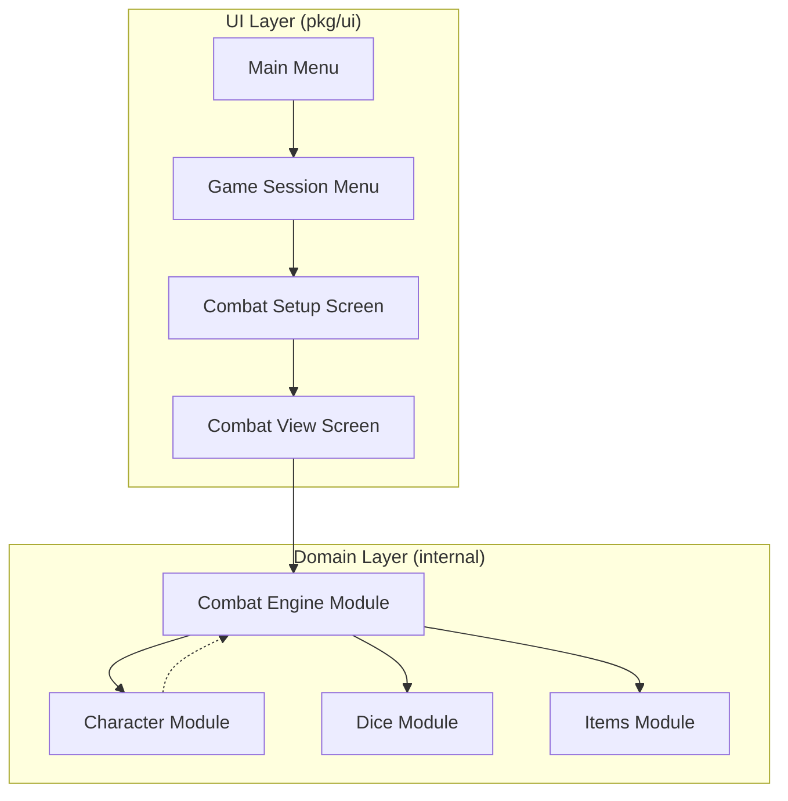
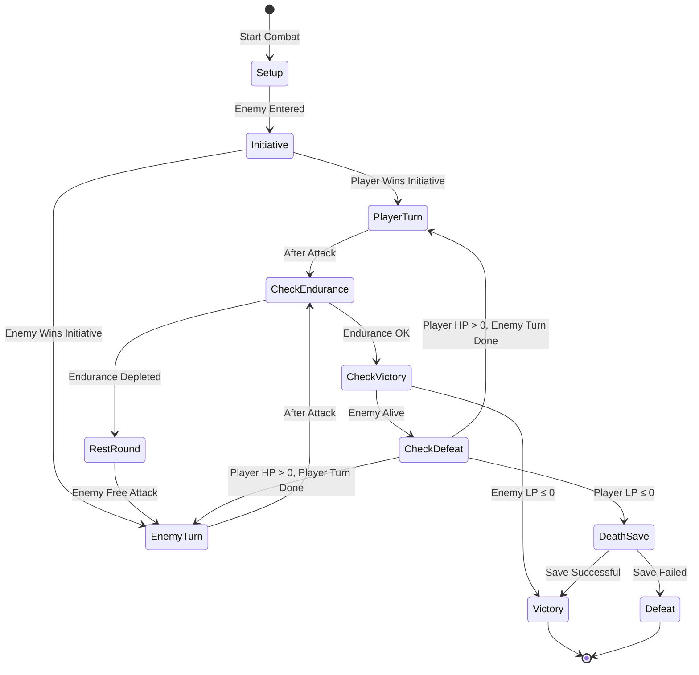
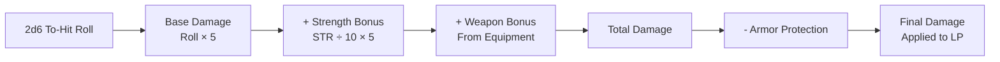

# Phase 2: Combat System Implementation

## Overview

This design document defines the strategic architecture for implementing the combat system in the Sagas of the Demonspawn companion application. This phase builds upon the character management foundation from Phase 1 and introduces turn-based combat mechanics, enemy management, and combat-related special rules.

## Objectives

Transform the application from a character management tool into an interactive combat companion that:
- Automates initiative determination and turn order management
- Calculates hit chances with skill and luck modifiers
- Computes damage based on character stats, weapons, and armor
- Tracks stamina-based endurance limits
- Implements death save mechanics
- Provides clear combat state visualization and logging

## System Scope

### In Scope
- Combat engine with turn-based mechanics
- Enemy data structures and manual enemy entry
- Initiative calculation system
- To-hit roll system with modifiers
- Damage calculation engine
- Stamina endurance tracking
- Death save mechanics
- Combat UI screens and combat log
- Combat state persistence

### Out of Scope (Future Phases)
- Enemy database file loading (deferred to allow manual entry first)
- Special items (Healing Stone, Doombringer, The Orb) - Phase 3
- Magic system integration - Phase 4
- Character loading UI improvements (noted as limitation in Phase 1)

## Strategic Design

### High-Level Architecture

The combat system introduces a new domain module and extends the UI layer with combat-specific screens:



### Combat System Components

#### Combat Engine (internal/combat)

The combat engine serves as the central calculation and state management component responsible for:

**Core Responsibilities:**
- Managing combat state (current turn, round counter, active combatant)
- Calculating initiative scores for both player and enemy
- Determining to-hit requirements based on skill and luck modifiers
- Computing damage totals from roll results, strength, and equipment
- Tracking stamina-based endurance limits
- Executing death save rolls
- Maintaining combat history log

**State Management:**
- Combat begins in setup state where enemy stats are entered
- Transitions to initiative determination
- Proceeds through alternating turn phases
- Concludes in victory, defeat, or death save states

#### Enemy Data Structure (internal/combat)

Enemy representation must capture all characteristics necessary for combat calculation:

| Field | Type | Purpose |
|-------|------|---------|
| Name | String | Enemy identifier for display |
| Strength | Integer | Damage calculation |
| Speed | Integer | Initiative calculation |
| Courage | Integer | Initiative calculation |
| Luck | Integer | Initiative and to-hit modifiers |
| Skill | Integer | To-hit modifier |
| CurrentLP | Integer | Enemy health tracking |
| MaximumLP | Integer | Reference for health percentage |
| WeaponBonus | Integer | Damage bonus from weapon |
| ArmorProtection | Integer | Damage reduction |
| IsDemonspawn | Boolean | For special item interactions (Phase 3) |

### Combat Flow State Machine



### Initiative Determination

Initiative is calculated once at combat start using the formula:

**Initiative Score = 2d6 + SPD + CRG + LCK**

**Decision Logic:**
- If player score > enemy score: Player attacks first in round 1
- If enemy score > player score: Enemy attacks first in round 1
- If scores tied: Random determination or re-roll
- After round 1: Turns alternate regardless of initiative

**Implementation Strategy:**
The combat engine calculates both scores simultaneously, stores the first striker, and manages turn alternation thereafter.

### To-Hit Calculation System

The to-hit system determines whether an attack succeeds based on a 2d6 roll and modifiers:

**Base Requirement:** 7 or higher on 2d6

**Modifiers (Cumulative):**
| Modifier Type | Condition | Effect |
|---------------|-----------|--------|
| Skill | Every 10 full SKL points | -1 to requirement |
| Luck | LCK ≥ 72 | -1 to requirement |

**Minimum Requirement:** Always 2 (never less)

**Examples:**
- SKL 25, LCK 65: Requirement = 7 - 2 = 5
- SKL 30, LCK 80: Requirement = 7 - 3 - 1 = 3
- SKL 60, LCK 90: Requirement = 7 - 6 - 1 = 2 (capped at minimum)

**Application:**
Both player and enemy use identical to-hit logic. The combat engine exposes a function that accepts characteristics and returns the required roll threshold.

### Damage Calculation System

Damage calculation follows a multi-stage formula:



**Calculation Stages:**

1. **Base Damage:** The to-hit roll (2d6 result) multiplied by 5
2. **Strength Bonus:** (STR ÷ 10, floor division) × 5
3. **Weapon Bonus:** Equipment damage bonus value
4. **Subtotal:** Base + Strength Bonus + Weapon Bonus
5. **Armor Reduction:** Subtract target's armor protection
6. **Final Damage:** Applied to target's current LP (minimum 0)

**Example Calculation:**
- Roll: 9
- STR: 64 → bonus = (64 ÷ 10) × 5 = 6 × 5 = 30
- Weapon: Sword = +10
- Subtotal: (9 × 5) + 30 + 10 = 45 + 30 + 10 = 85
- Enemy Armor: Chain Mail = -8
- Final: 85 - 8 = 77 damage

### Stamina Endurance System

The endurance mechanic limits continuous combat duration based on stamina:

**Endurance Calculation:** STA ÷ 20 (floor division) = Maximum Continuous Rounds

**Behavioral Rules:**
- Combat round counter increments after each full turn cycle (player + enemy)
- When rounds exceed endurance limit, player must rest for one round
- During rest round: Enemy receives a free attack, player cannot attack
- After rest round: Round counter resets, endurance limit refreshed

**Examples:**
| Stamina | Endurance Rounds | Rest Frequency |
|---------|------------------|----------------|
| 19 | 0 | Rest every round |
| 25 | 1 | Rest after round 1 |
| 45 | 2 | Rest after round 2 |
| 72 | 3 | Rest after round 3 |

**State Tracking:**
The combat engine maintains:
- Current round number
- Endurance limit (calculated at combat start)
- Rest state flag

### Death Save Mechanism

When player LP drops to 0 or below:

**Trigger Condition:** Player CurrentLP ≤ 0

**Death Save Process:**
1. Check if death save already used this combat (one attempt per fight limit)
2. If available, execute death save roll: 2d6 × 10
3. Compare result to player's current LCK value
4. Success: Result ≤ LCK
5. Failure: Result > LCK

**Success Outcome:**
- Restore player CurrentLP to MaximumLP
- Reset combat state to beginning (round 1, recalculate initiative)
- Enemy HP remains at current value (not restored)
- Mark death save as used for this combat

**Failure Outcome:**
- Combat ends in defeat
- Return player to game session menu

**Important Constraint:**
Death save can only be attempted once per combat encounter. If player LP drops to 0 again after a successful save, combat immediately ends in defeat.

### Combat State Persistence

Combat state must be preserved across application sessions:

**Persistent Combat Data:**
- Enemy complete statistics
- Current round number
- Turn order and active combatant
- Player and enemy current LP
- Death save used flag
- Combat log history
- Endurance tracking state

**Persistence Strategy:**
Extend the existing character save file JSON structure to include an optional combat state object. When combat is active and user exits the application, serialize the complete combat state. On load, detect active combat and offer to resume or abandon.

## User Interface Design

### Combat Setup Screen

**Purpose:** Allow manual enemy entry before combat begins

**Screen Elements:**
- Input fields for enemy characteristics (Name, STR, SPD, STA, CRG, LCK, CHM, ATT)
- Input field for enemy current/maximum LP
- Input field for enemy skill level
- Input field for weapon damage bonus
- Input field for armor protection
- Checkbox or toggle for Demonspawn designation
- Validation feedback for numeric ranges
- Action buttons: Start Combat, Cancel

**Navigation:**
- Tab or arrow keys to move between fields
- Enter to confirm and proceed to combat
- Escape to cancel and return to game session menu

**Validation Rules:**
- All characteristics must be non-negative integers
- LP values must be positive
- Skill must be non-negative
- Equipment bonuses can be zero or positive

### Combat View Screen

**Purpose:** Display ongoing combat state and present action choices

**Screen Layout:**

```
========================================
           COMBAT: Round 3
========================================

FIRE*WOLF                      ENEMY
LP: 245/390 (63%)             LP: 120/200 (60%)
STR: 64  SPD: 56  STA: 72    STR: 50  SPD: 45  STA: 40
Skill: 2                      Skill: 1
Weapon: Sword (+10)           Weapon: Axe (+15)
Armor: Leather (-5)           Armor: Chain (-8)

Endurance: Round 3 of 3 (Rest next round!)

----------------------------------------
COMBAT LOG
----------------------------------------
[R3] Your turn - Roll to hit
[R3] You rolled 9 - HIT! (need 6+)
[R3] Damage: 45 + 30 + 10 - 8 = 77
[R3] Enemy takes 77 damage (120 LP remaining)
[R2] Enemy rolled 6 - HIT!
[R2] Enemy deals 42 damage (245 LP remaining)
...

========================================
Your Turn
========================================
> Attack
  Rest (voluntary)
  Use Item (disabled - Phase 3)
  Cast Spell (disabled - Phase 4)
  Flee Combat

[Enter: Confirm | ↑/↓: Select | Esc: Menu]
```

**Dynamic Elements:**
- Turn indicator (Your Turn / Enemy Turn)
- Health bars or percentage indicators
- Endurance warning when approaching rest requirement
- Combat log with scrollable history
- Action menu context-sensitive to turn state
- Status indicators (death save available/used)

**Combat Log Format:**
Each entry prefixed with round number and actor:
- [R#] Player action: Description
- [R#] Enemy action: Description
- Color coding: Player actions in one color, enemy in another, special events highlighted

### Combat Action Flow

**Player Turn Sequence:**
1. Display "Your Turn" and available actions
2. Player selects Attack (primary action for Phase 2)
3. System rolls 2d6 for to-hit
4. Display roll result and requirement comparison
5. If hit: Calculate and display damage breakdown
6. If miss: Display miss message
7. Update LP and combat log
8. Check enemy defeat condition
9. If enemy alive: Transition to enemy turn
10. If enemy defeated: Transition to victory

**Enemy Turn Sequence:**
1. Display "Enemy Turn"
2. System rolls 2d6 for enemy to-hit
3. Display enemy roll result
4. If hit: Calculate and apply damage to player
5. If miss: Display enemy miss message
6. Update LP and combat log
7. Check player defeat condition
8. If player LP ≤ 0: Trigger death save or defeat
9. If player alive: Transition to player turn

**Automated Turn Execution:**
For Phase 2, enemy turns execute automatically without player input. Future phases may introduce decision points for item or spell usage during player turns.

## Data Models

### Combat State Structure

The combat state encapsulates all information necessary to manage and persist combat:

| Field | Type | Description |
|-------|------|-------------|
| IsActive | Boolean | Whether combat is currently ongoing |
| CurrentRound | Integer | Round counter (starts at 1) |
| PlayerTurn | Boolean | True if player turn, false if enemy turn |
| PlayerFirstStrike | Boolean | Tracks who won initiative |
| DeathSaveUsed | Boolean | Prevents multiple death saves |
| EnduranceLimit | Integer | Calculated max rounds (STA ÷ 20) |
| RoundsSinceLast Rest | Integer | Endurance tracking |
| Enemy | Enemy struct | Complete enemy data |
| CombatLog | Array of strings | Historical combat messages |

### Enemy Structure

| Field | Type | Validation |
|-------|------|------------|
| Name | String | Non-empty |
| Strength | Integer | ≥ 0 |
| Speed | Integer | ≥ 0 |
| Stamina | Integer | ≥ 0 |
| Courage | Integer | ≥ 0 |
| Luck | Integer | ≥ 0 |
| Skill | Integer | ≥ 0 |
| CurrentLP | Integer | ≥ 0 |
| MaximumLP | Integer | > 0 |
| WeaponBonus | Integer | ≥ 0 |
| ArmorProtection | Integer | ≥ 0 |
| IsDemonspawn | Boolean | Default false |

## Combat Engine Functions

The combat engine exposes the following strategic functions:

### Initialization Functions

**StartCombat(player, enemy)**
- Validates both combatants have valid stats
- Calculates endurance limit from player stamina
- Initializes combat state
- Returns initialized combat state or error

**CalculateInitiative(player, enemy, diceRoller)**
- Rolls 2d6 for both combatants
- Adds SPD + CRG + LCK to each roll
- Compares totals
- Returns first striker designation

### Turn Execution Functions

**ExecutePlayerAttack(combatState, diceRoller)**
- Calculates to-hit requirement for player
- Rolls 2d6 for to-hit attempt
- If hit: Calculates damage and applies to enemy
- Updates combat state and log
- Returns updated combat state and result summary

**ExecuteEnemyAttack(combatState, diceRoller)**
- Calculates to-hit requirement for enemy
- Rolls 2d6 for to-hit attempt
- If hit: Calculates damage and applies to player
- Updates combat state and log
- Returns updated combat state and result summary

### Calculation Helper Functions

**CalculateToHitRequirement(skill, luck)**
- Starts with base requirement of 7
- Subtracts skill ÷ 10 (floor division)
- Subtracts 1 if luck ≥ 72
- Returns requirement (minimum 2)

**CalculateDamage(rollResult, strength, weaponBonus)**
- Base = rollResult × 5
- StrengthBonus = (strength ÷ 10) × 5
- Total = Base + StrengthBonus + weaponBonus
- Returns total damage before armor reduction

**ApplyArmorReduction(damage, armorProtection)**
- Returns max(0, damage - armorProtection)

**CheckEndurance(combatState)**
- Compares rounds since rest to endurance limit
- Returns true if rest required, false otherwise

**ExecuteDeathSave(player, diceRoller)**
- Rolls 2d6 × 10
- Compares to player LCK
- Returns success or failure

### Victory/Defeat Functions

**CheckVictoryCondition(combatState)**
- Returns true if enemy CurrentLP ≤ 0

**CheckDefeatCondition(combatState)**
- Returns true if player CurrentLP ≤ 0 and death save unavailable or failed

**ResolveCombatVictory(player)**
- Increments player EnemiesDefeated counter
- Increments player Skill by 1
- Returns updated player character

## Integration Points

### Existing System Modifications

**Character Module:**
No structural changes required. Combat engine reads character data but does not modify structure.

**Dice Module:**
No changes required. Combat engine uses existing Roll2D6 function.

**Items Module:**
No changes required for Phase 2. Future phases will integrate special item effects.

**UI Model (pkg/ui/model.go):**
Add new screen state for combat:
- CombatSetup state
- CombatActive state

**UI Update (pkg/ui/update.go):**
Add message handlers for:
- Combat setup input events
- Combat action selection
- Combat turn progression

### New Module Dependencies

The combat module imports:
- internal/character (for Character struct)
- internal/dice (for Roller interface)
- internal/items (for Weapon and Armor structs)

The UI combat screens import:
- internal/combat (for combat state and engine functions)
- internal/character (for player data)
- internal/dice (for roller)

## Testing Strategy

### Unit Test Coverage

**Combat Engine Functions:**
- Initiative calculation with various stat combinations
- To-hit requirement calculation with edge cases (very high skill, luck threshold)
- Damage calculation with different roll results, strength, and equipment
- Armor reduction including cases where damage reduces to zero
- Endurance threshold detection
- Death save success and failure scenarios
- Victory and defeat condition detection

**Test Data Sets:**
Create table-driven tests with:
- Minimum stat values (edge case: 0 skill, 0 luck)
- Threshold values (exactly 10 skill, exactly 72 luck)
- High values (60+ skill, 90+ luck)
- Typical combat scenarios from ruleset examples

### Integration Test Scenarios

**Full Combat Flow:**
1. Create player and enemy with known stats
2. Execute complete combat from setup to victory
3. Verify state transitions occur correctly
4. Validate LP changes match expected calculations

**Death Save Flow:**
1. Set player LP to 1
2. Execute enemy attack that reduces to 0 or below
3. Verify death save triggers
4. Test both success and failure paths

**Endurance Flow:**
1. Create player with low stamina (e.g., 20)
2. Execute combat for multiple rounds
3. Verify rest round triggers at correct point
4. Confirm enemy free attack during rest

## User Experience Considerations

### Clarity and Feedback

**Transparent Calculations:**
All dice rolls and calculation steps should be visible in the combat log. When damage is dealt, show the formula breakdown: "Damage: (9 × 5) + 30 + 10 - 8 = 77"

**Status Awareness:**
Player should always see:
- Current LP for both combatants
- Current round number
- Endurance status (rounds remaining before rest)
- Whether death save is still available

**Turn Indicators:**
Clearly distinguish whose turn it is through visual emphasis (color, headers, or separators).

### Pacing and Control

**Player Agency:**
In Phase 2, combat is largely automated after action selection. Player chooses to attack, system resolves. Future phases will add item and spell choices for more strategic depth.

**Combat Speed:**
Consider whether to auto-advance after displaying results or require player acknowledgment (Enter to continue). Recommend player acknowledgment to allow reading combat log before screen updates.

### Error Handling

**Invalid Enemy Data:**
Validate all enemy inputs before starting combat. Provide clear error messages: "Life Points must be greater than 0" rather than generic validation failure.

**Combat State Corruption:**
If loaded combat state is invalid or incompatible, offer to abandon combat and return to game session menu rather than crashing.

## Implementation Phases

### Phase 2.1: Core Combat Engine
- Create internal/combat package structure
- Implement Enemy struct and validation
- Implement CombatState struct
- Implement initiative calculation
- Implement to-hit calculation
- Implement damage calculation
- Write comprehensive unit tests

### Phase 2.2: Combat Flow State Machine
- Implement combat state transitions
- Implement turn alternation logic
- Implement endurance tracking
- Implement death save mechanism
- Implement victory/defeat detection
- Write integration tests for full combat flow

### Phase 2.3: Combat UI Components
- Create Combat Setup screen component
- Create Combat View screen component
- Implement combat log rendering
- Implement action selection menu
- Wire up input handling in update.go

### Phase 2.4: Integration and Persistence
- Integrate combat screens into main UI model
- Add combat state to character save file structure
- Implement combat state serialization
- Implement combat resume on load
- Test save/load during active combat

### Phase 2.5: Testing and Refinement
- Execute full integration test suite
- Perform manual playthrough testing with ruleset examples
- Verify calculation accuracy against ruleset
- Refine UI feedback and pacing
- Document combat system in README

## Success Criteria

The Phase 2 combat system implementation is complete when:

1. **Functional Completeness:**
   - Player can manually enter enemy stats
   - Initiative determines first striker correctly
   - To-hit rolls apply skill and luck modifiers accurately
   - Damage calculations match ruleset formula exactly
   - Stamina endurance forces rest at correct intervals
   - Death saves trigger and function per rules
   - Combat concludes in victory or defeat appropriately

2. **State Management:**
   - Combat state persists across application restarts
   - Turn order and round tracking work correctly
   - Death save one-per-combat limit enforced

3. **User Experience:**
   - Combat log provides clear visibility into all actions
   - Turn indicators make current state obvious
   - LP changes are immediately visible
   - Error messages are helpful and specific

4. **Code Quality:**
   - Unit test coverage ≥ 80% for combat engine functions
   - Integration tests validate complete combat flows
   - Code follows project conventions and patterns
   - Documentation explains combat engine architecture

5. **Ruleset Compliance:**
   - All calculations match saga_demonspawn_ruleset.md exactly
   - Edge cases (minimum to-hit, armor reducing damage to 0) handled correctly
   - Special rules (death save, endurance) function as specified

## Future Considerations

### Phase 3 Preparation

The combat system should be designed with extension points for:
- Item usage during combat (Healing Stone, Doombringer, The Orb)
- Special weapon effects (Doombringer life drain, Orb double damage)
- Inventory access during player turns

**Design Strategy:**
Create an action interface or enum that can be extended. Phase 2 implements only "Attack" action, but structure allows adding "Use Item" and "Cast Spell" actions later.

### Phase 4 Preparation

Magic system integration will require:
- Spell casting as a combat action option
- POW tracking during combat
- Spell effect application (damage, paralysis, escape)
- Natural inclination check before combat begins

**Design Strategy:**
Combat state can include a "spells cast this section" tracker to enforce the one-spell-per-section limit. Spell effects can be modeled as special attack types with unique damage/effect calculations.

### Performance Considerations

Combat engine calculations are lightweight (simple arithmetic). No performance concerns anticipated. If combat log grows very large over extended fights, consider limiting displayed history to most recent N entries while preserving full log in save file.

### Accessibility

Ensure combat UI is readable with:
- Clear contrast for turn indicators
- Consistent formatting for combat log entries
- Keyboard-only navigation (already project standard)
- Optional verbose mode that explains calculations in natural language

## Confidence Assessment

**Confidence Level: High**

**Confidence Basis:**
- **Clear Requirements:** The ruleset provides exact formulas and mechanics with no ambiguity
- **Proven Foundation:** Phase 1 established solid character management and dice rolling
- **Straightforward Implementation:** Combat calculations are deterministic arithmetic with well-defined state transitions
- **Low Risk:** No external dependencies, file I/O, or complex concurrency concerns
- **Testable:** All combat logic can be validated with table-driven tests using known inputs/outputs

**Key Success Factors:**
- Adherence to ruleset formulas ensures correctness
- State machine pattern matches combat flow naturally
- Extension points prepare for Phases 3 and 4 without requiring rework
- Bubble Tea framework handles UI state management effectively (proven in Phase 1)
