# Character System

<cite>
**Referenced Files in This Document**
- [internal/character/character.go](file://internal/character/character.go)
- [pkg/ui/model.go](file://pkg/ui/model.go)
- [pkg/ui/character_creation.go](file://pkg/ui/character_creation.go)
- [pkg/ui/character_edit.go](file://pkg/ui/character_edit.go)
- [pkg/ui/character_view.go](file://pkg/ui/character_view.go)
- [internal/dice/dice.go](file://internal/dice/dice.go)
- [internal/items/items.go](file://internal/items/items.go)
- [BUGFIX_CHARACTER_EDIT.md](file://BUGFIX_CHARACTER_EDIT.md)
- [README.md](file://README.md)
</cite>

## Table of Contents
1. [Introduction](#introduction)
2. [Character Entity Architecture](#character-entity-architecture)
3. [Core Characteristics System](#core-characteristics-system)
4. [Derived Values and Progression](#derived-values-and-progression)
5. [Equipment Management](#equipment-management)
6. [Character Creation Workflow](#character-creation-workflow)
7. [Character Editing System](#character-editing-system)
8. [Persistence and Serialization](#persistence-and-serialization)
9. [UI Integration Layer](#ui-integration-layer)
10. [Validation and Business Rules](#validation-and-business-rules)
11. [Common Issues and Edge Cases](#common-issues-and-edge-cases)
12. [Practical Implementation Examples](#practical-implementation-examples)

## Introduction

The Character System in the Saga of the Demonspawn application provides comprehensive character management capabilities for the gamebook simulation. Built around a robust data model, it handles everything from initial character creation with dice rolls to ongoing stat modifications and equipment management. The system follows the original gamebook rules while providing modern persistence and UI capabilities.

The character system operates on a foundation of seven core characteristics (STR, SPD, STA, CRG, LCK, CHM, ATT) that determine all aspects of character performance, from combat effectiveness to magical abilities. These characteristics form the basis for derived values like Life Points, Skill levels, and Power reserves, creating a dynamic progression system that evolves throughout gameplay.

## Character Entity Architecture

The Character struct serves as the central data model for all character-related information in the application. It encapsulates both static attributes established during creation and dynamic state that changes throughout gameplay.

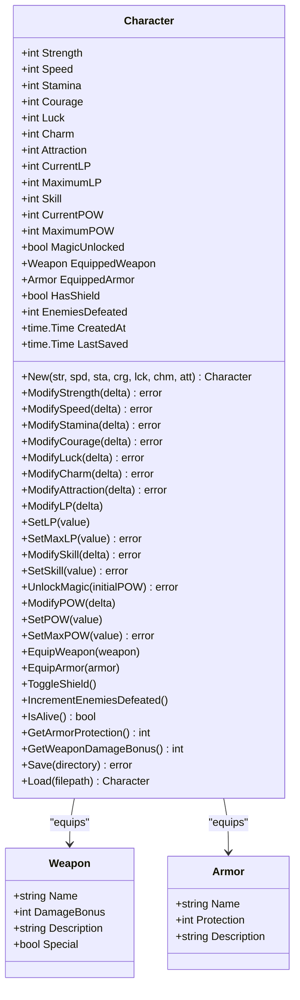

**Diagram sources**
- [internal/character/character.go](file://internal/character/character.go#L14-L44)
- [internal/items/items.go](file://internal/items/items.go#L20-L41)

**Section sources**
- [internal/character/character.go](file://internal/character/character.go#L14-L44)

## Core Characteristics System

The seven core characteristics represent fundamental aspects of a character's personality and physical abilities. Each characteristic is rolled independently using the gamebook's standard mechanic of rolling 2d6 and multiplying by 8, producing values in the range of 16-96.

### Characteristic Definitions

| Characteristic | Abbreviation | Purpose | Range (0-999) |
|----------------|--------------|---------|----------------|
| Strength | STR | Physical power and melee damage | 16-96 (gamebook), 0-999 (validation) |
| Speed | SPD | Agility, reaction time, initiative | 16-96 (gamebook), 0-999 (validation) |
| Stamina | STA | Endurance and hit points | 16-96 (gamebook), 0-999 (validation) |
| Courage | CRG | Mental fortitude and morale | 16-96 (gamebook), 0-999 (validation) |
| Luck | LCK | Fortune and chance encounters | 16-96 (gamebook), 0-999 (validation) |
| Charm | CHM | Social influence and charisma | 16-96 (gamebook), 0-999 (validation) |
| Attraction | ATT | Personal magnetism and appeal | 16-96 (gamebook), 0-999 (validation) |

### Life Points Calculation

Life Points (LP) are calculated as the mathematical sum of all seven characteristics at character creation. This fundamental mechanic ensures that characters with higher base stats have greater durability and resilience.

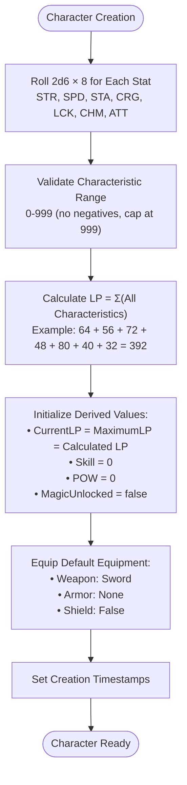

**Diagram sources**
- [internal/character/character.go](file://internal/character/character.go#L47-L96)
- [internal/dice/dice.go](file://internal/dice/dice.go#L60-L63)

**Section sources**
- [internal/character/character.go](file://internal/character/character.go#L47-L96)
- [internal/dice/dice.go](file://internal/dice/dice.go#L60-L63)

## Derived Values and Progression

The character system implements several derived values that evolve throughout gameplay, providing meaningful progression mechanics and strategic depth.

### Life Points (LP) System

Life Points serve as the primary measure of a character's health and survivability. Unlike traditional RPG systems, LP in this implementation can go negative, representing critical injuries or death conditions.

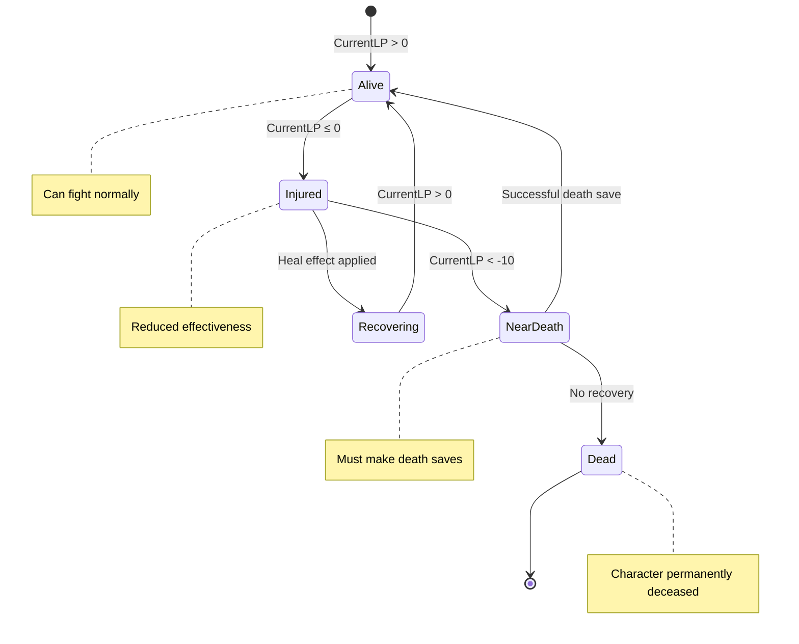

### Skill Progression System

Skill represents a character's combat proficiency and tactical acumen. It starts at zero and increases by one point for each enemy defeated, affecting hit chances and combat effectiveness.

### Magic System Unlocking

The magic system becomes available during gameplay when the character unlocks magical abilities. This introduces a significant shift in gameplay dynamics, requiring careful resource management of Power (POW) reserves.

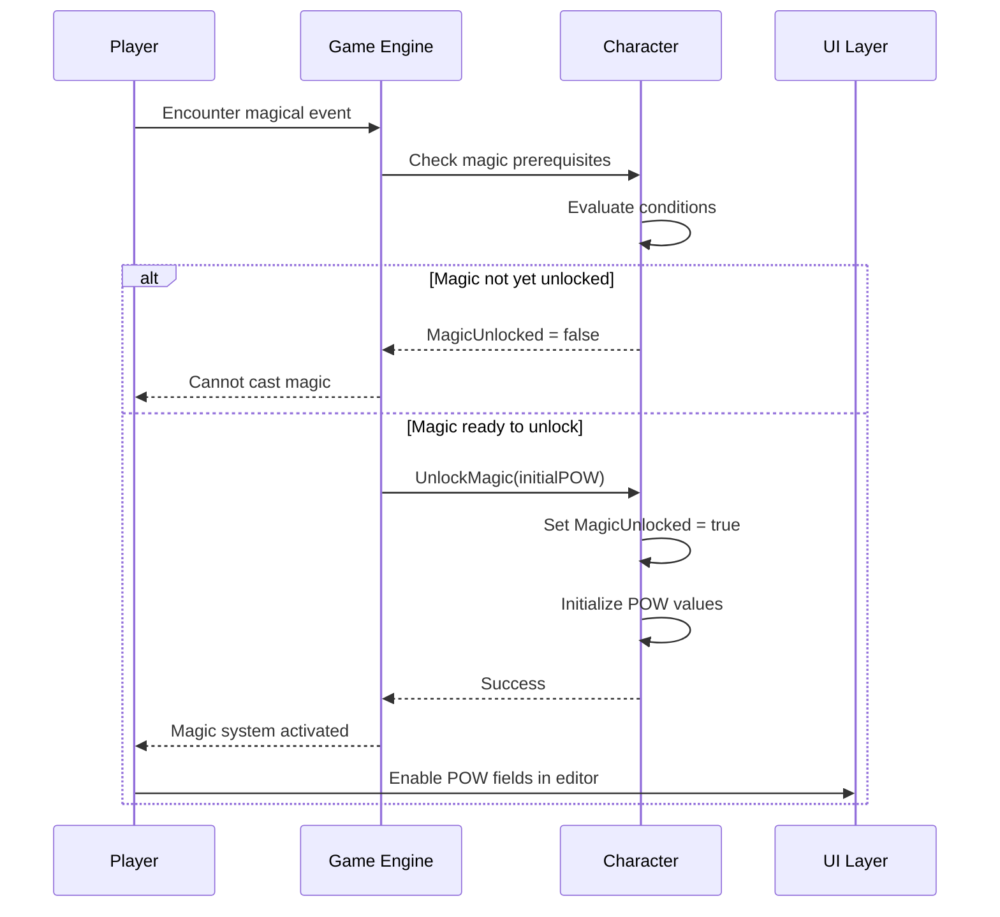

**Diagram sources**
- [internal/character/character.go](file://internal/character/character.go#L222-L231)

**Section sources**
- [internal/character/character.go](file://internal/character/character.go#L26-L33)
- [internal/character/character.go](file://internal/character/character.go#L222-L231)

## Equipment Management

The equipment system provides comprehensive item management with realistic damage reduction calculations and special item handling.

### Weapon System

Weapons provide damage bonuses and can have special properties that affect combat outcomes. The system supports both standard melee weapons and special items like the cursed Doombringer.

| Weapon | Damage Bonus | Special Properties | Description |
|--------|-------------|-------------------|-------------|
| Sword | 10 | None | Standard melee weapon |
| Dagger | 5 | None | Light, concealable |
| Axe | 15 | None | Standard melee weapon |
| Mace | 14 | None | Heavy melee weapon |
| Doombringer | 20 | Cursed | -10 LP per attack, heals on hit |

### Armor and Protection System

Armor provides damage reduction with sophisticated interaction mechanics. Shields offer additional protection that varies depending on whether armor is worn.

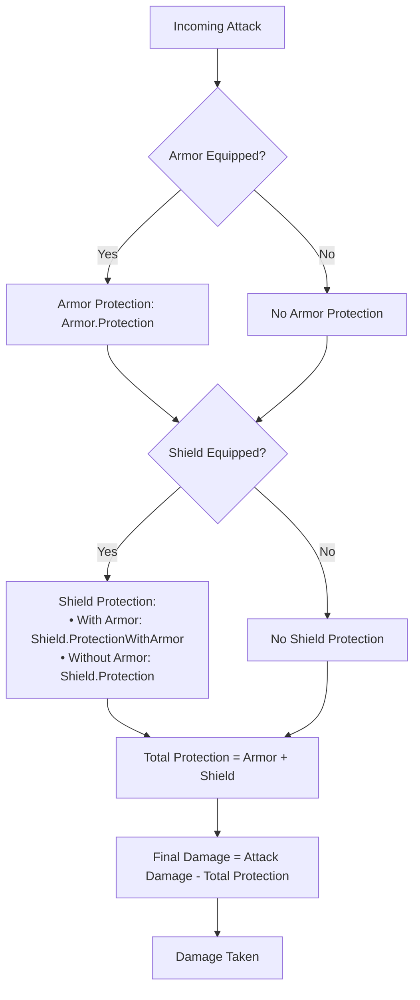

**Diagram sources**
- [internal/character/character.go](file://internal/character/character.go#L284-L302)
- [internal/items/items.go](file://internal/items/items.go#L183-L192)

### Equipment Interaction Rules

The system implements realistic equipment interaction rules:
- Shields provide full protection when worn alone
- When combined with armor, shield protection is reduced
- Different armor types offer varying protection levels
- Special weapons like Doombringer have unique combat mechanics

**Section sources**
- [internal/character/character.go](file://internal/character/character.go#L258-L277)
- [internal/items/items.go](file://internal/items/items.go#L20-L41)

## Character Creation Workflow

The character creation process follows a structured three-step workflow that mirrors the original gamebook experience while adding digital convenience.

### Creation Step 1: Characteristic Rolling

Players roll characteristics individually or simultaneously using the gamebook's standard mechanic. The system provides both manual and automatic rolling capabilities.

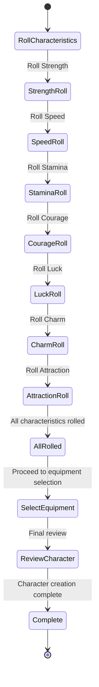

### Creation Step 2: Equipment Selection

Players choose starting equipment from predefined options. The system provides cursor-based navigation and immediate preview of equipment effects.

### Creation Step 3: Character Review and Confirmation

The final step allows players to review all character attributes before committing to the creation process.

**Section sources**
- [pkg/ui/character_creation.go](file://pkg/ui/character_creation.go#L12-L20)
- [pkg/ui/character_creation.go](file://pkg/ui/character_creation.go#L229-L257)

## Character Editing System

The character editing system provides comprehensive stat modification capabilities with real-time validation and undo functionality.

### Edit Field Categories

The editing interface organizes character attributes into logical categories for intuitive navigation and modification.

| Category | Fields | Purpose |
|----------|--------|---------|
| Basic Stats | Strength, Speed, Stamina, Courage, Luck, Charm, Attraction | Core physical and mental attributes |
| Health | Current LP, Maximum LP | Life points management |
| Combat | Skill | Combat proficiency and tactics |
| Magic | Current POW, Maximum POW | Magical ability and resources |

### Input Mode Management

The editing system supports both direct value modification and text-based input modes, accommodating different user preferences and accessibility needs.

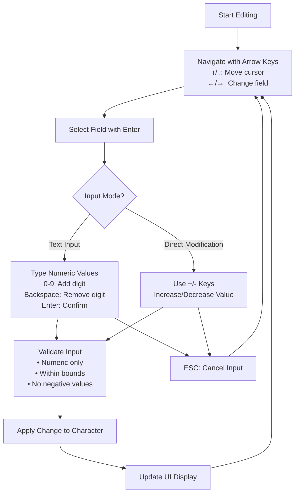

**Diagram sources**
- [pkg/ui/character_edit.go](file://pkg/ui/character_edit.go#L110-L136)

**Section sources**
- [pkg/ui/character_edit.go](file://pkg/ui/character_edit.go#L8-L21)
- [pkg/ui/character_edit.go](file://pkg/ui/character_edit.go#L23-L56)

## Persistence and Serialization

The character system implements robust persistence using JSON serialization with timestamped filenames for version control and backup capabilities.

### Save File Structure

Character data is serialized to JSON format with comprehensive metadata for tracking creation and modification history.

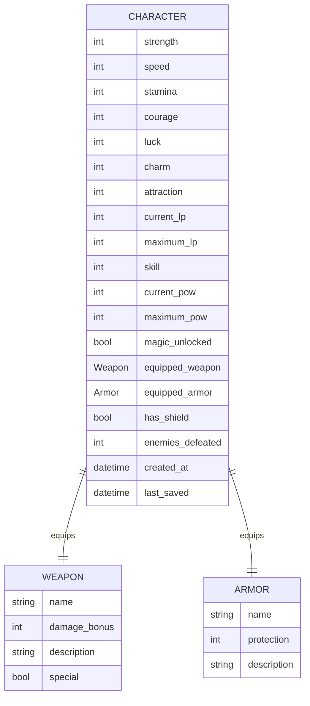

**Diagram sources**
- [internal/character/character.go](file://internal/character/character.go#L14-L44)

### Filename Convention

Save files use timestamped filenames in the format `character_YYYYMMDD-HHMMSS.json`, enabling automatic versioning and easy identification of save slots.

### Load/Save Workflow

The persistence system handles both saving and loading with comprehensive error handling and validation.

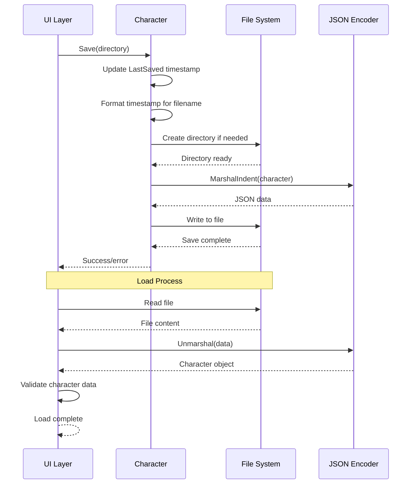

**Diagram sources**
- [internal/character/character.go](file://internal/character/character.go#L312-L339)

**Section sources**
- [internal/character/character.go](file://internal/character/character.go#L312-L355)

## UI Integration Layer

The character system integrates seamlessly with the Bubble Tea UI framework through specialized model components that handle state management and user interaction.

### Model Architecture

The UI layer consists of three primary models that work together to provide comprehensive character management functionality.

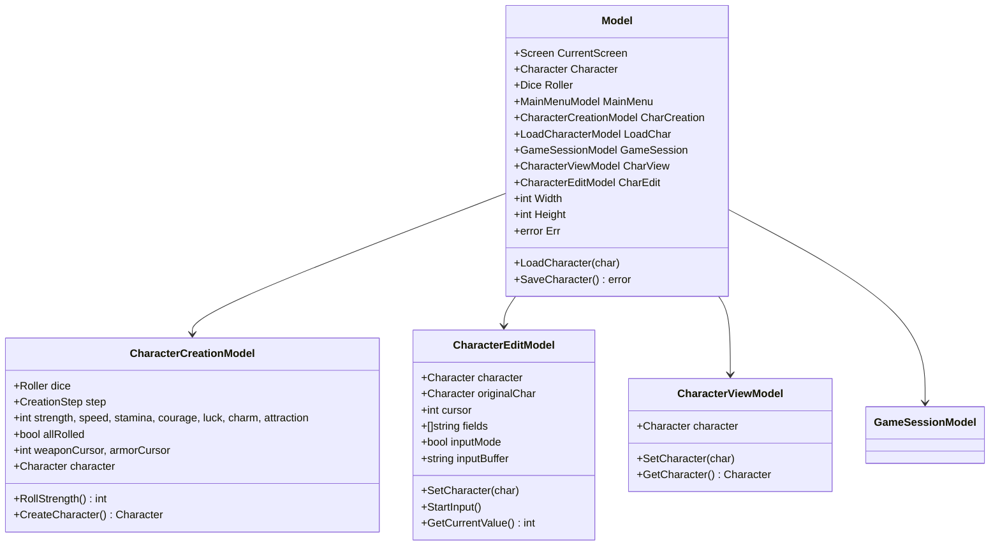

**Diagram sources**
- [pkg/ui/model.go](file://pkg/ui/model.go#L33-L50)
- [pkg/ui/character_creation.go](file://pkg/ui/character_creation.go#L21-L44)
- [pkg/ui/character_edit.go](file://pkg/ui/character_edit.go#L23-L31)
- [pkg/ui/character_view.go](file://pkg/ui/character_view.go#L6-L8)

### Screen Navigation

The UI system supports seamless navigation between character management screens with proper state synchronization.

**Section sources**
- [pkg/ui/model.go](file://pkg/ui/model.go#L33-L95)
- [pkg/ui/character_creation.go](file://pkg/ui/character_creation.go#L21-L44)
- [pkg/ui/character_edit.go](file://pkg/ui/character_edit.go#L23-L31)

## Validation and Business Rules

The character system implements comprehensive validation rules to maintain game balance and prevent invalid states.

### Characteristic Validation

All characteristic values must adhere to strict validation rules to ensure game balance and prevent exploitation.

| Rule | Constraint | Error Message |
|------|------------|---------------|
| Minimum Value | ≥ 0 | "{Characteristic} cannot be negative: {value}" |
| Maximum Value | ≤ 999 | "{Characteristic} exceeds maximum (999): {value}" |
| Negative Modifications | Not allowed for characteristics | "Cannot modify below zero" |
| LP Management | Can be negative (death condition) | N/A |

### Modification Constraints

Stat modifications follow specific rules to maintain game balance and prevent abuse of the system.

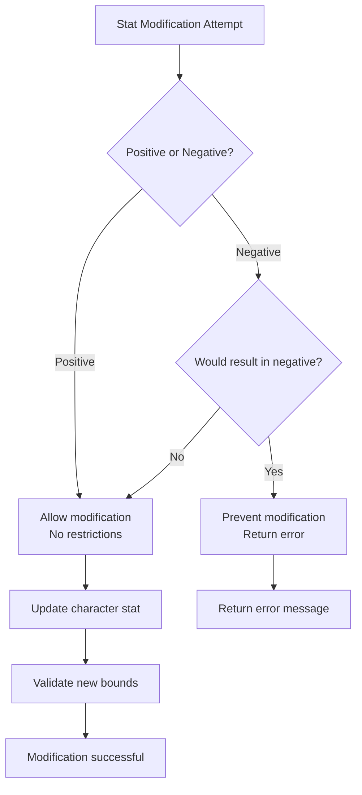

### Magic System Constraints

The magic system introduces additional validation requirements for power management and unlocking mechanics.

**Section sources**
- [internal/character/character.go](file://internal/character/character.go#L101-L111)
- [internal/character/character.go](file://internal/character/character.go#L223-L231)

## Common Issues and Edge Cases

The character system addresses several common issues and edge cases that can arise during gameplay and character management.

### Character Edit Screen Bug Fix

A significant UI bug was identified where all character edit fields displayed the same value as the currently selected field. This was caused by incorrect value retrieval logic in the display function.

**Root Cause Analysis:**
The bug occurred because the display function was retrieving the cursor position value for all fields instead of fetching each field's actual value. This resulted in all non-selected fields displaying the same incorrect value.

**Fix Implementation:**
The solution involved moving the value retrieval logic to execute for every field in the loop, ensuring each field displays its correct value regardless of cursor position.

### Equipment Management Edge Cases

Several edge cases exist in equipment management that require careful handling:

- **Shield-Armor Interaction:** Shield protection varies depending on whether armor is worn
- **Special Weapon Effects:** Weapons like Doombringer have unique combat mechanics
- **Equipment Conflicts:** Certain combinations may have unexpected effects
- **Resource Limits:** Power and life point limits must be respected

### Input Validation Issues

The character editing system must handle various input scenarios gracefully:

- **Invalid Characters:** Non-numeric input during text editing mode
- **Boundary Conditions:** Maximum and minimum value limits
- **Empty Input:** Handling of empty input buffers
- **Cancel Operations:** Proper restoration of previous values

**Section sources**
- [BUGFIX_CHARACTER_EDIT.md](file://BUGFIX_CHARACTER_EDIT.md#L1-L122)

## Practical Implementation Examples

The character system provides numerous practical examples of Go programming patterns and game development concepts.

### Dice Rolling Integration

The character creation system demonstrates proper integration between the dice rolling subsystem and character generation, showcasing dependency injection and modular design.

### JSON Serialization Patterns

Character persistence demonstrates idiomatic Go JSON handling with proper error management and file I/O operations.

### State Management Examples

The UI integration showcases effective state management patterns using the Bubble Tea framework's immutable state approach.

### Error Handling Strategies

The system demonstrates comprehensive error handling with meaningful error messages and graceful degradation.

### Equipment Calculation Examples

The armor protection calculation system shows practical implementation of game mechanics with proper mathematical formulas and edge case handling.

**Section sources**
- [internal/character/character.go](file://internal/character/character.go#L47-L96)
- [internal/dice/dice.go](file://internal/dice/dice.go#L60-L63)
- [internal/character/character.go](file://internal/character/character.go#L312-L355)