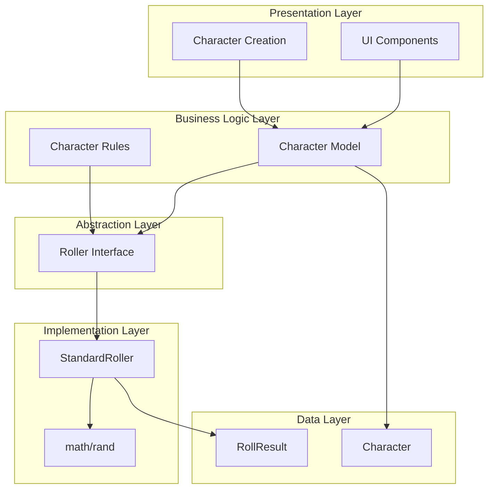
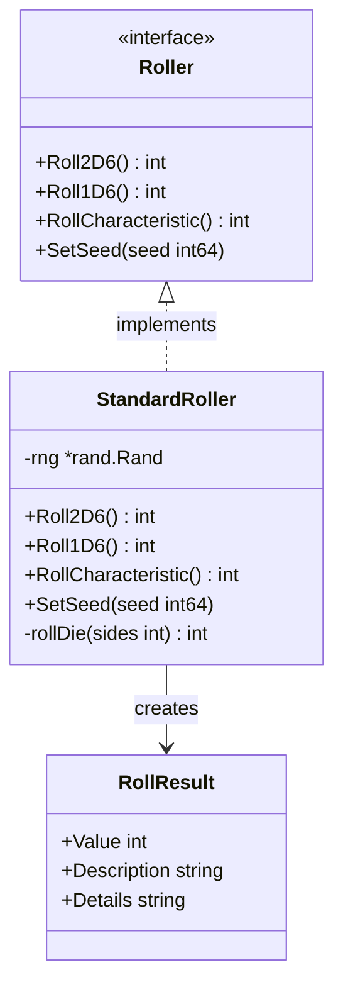
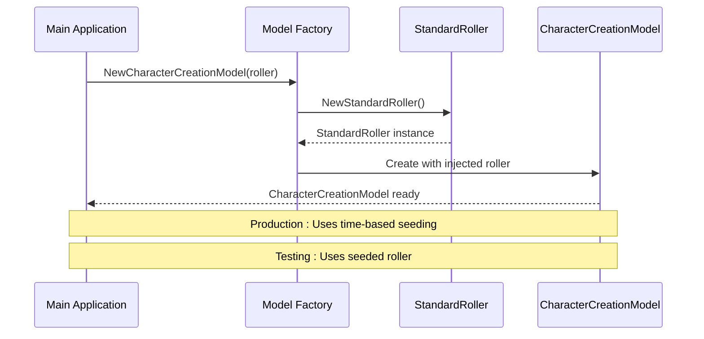
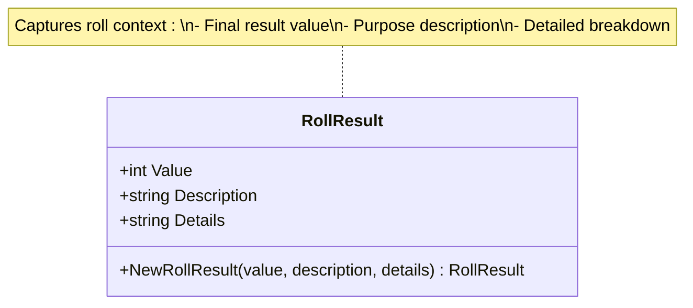
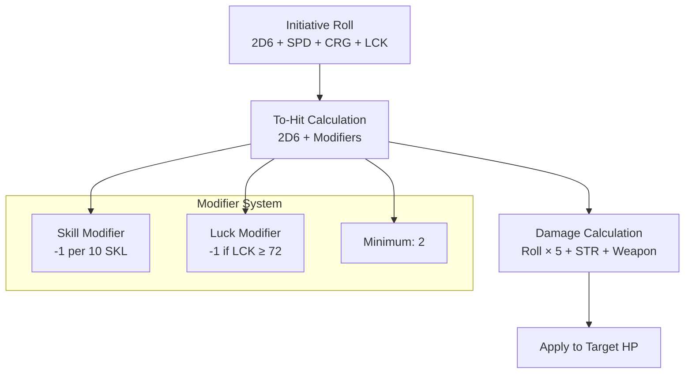
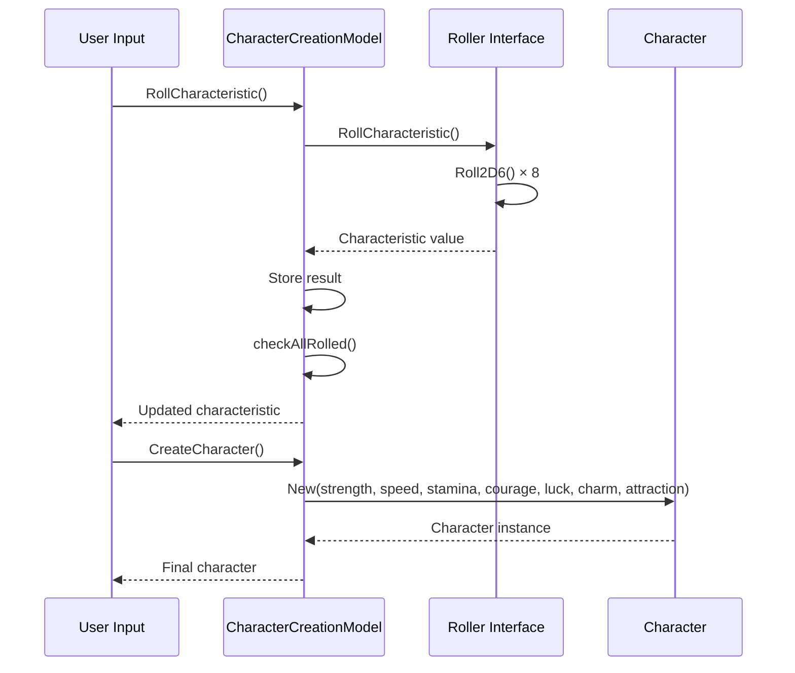
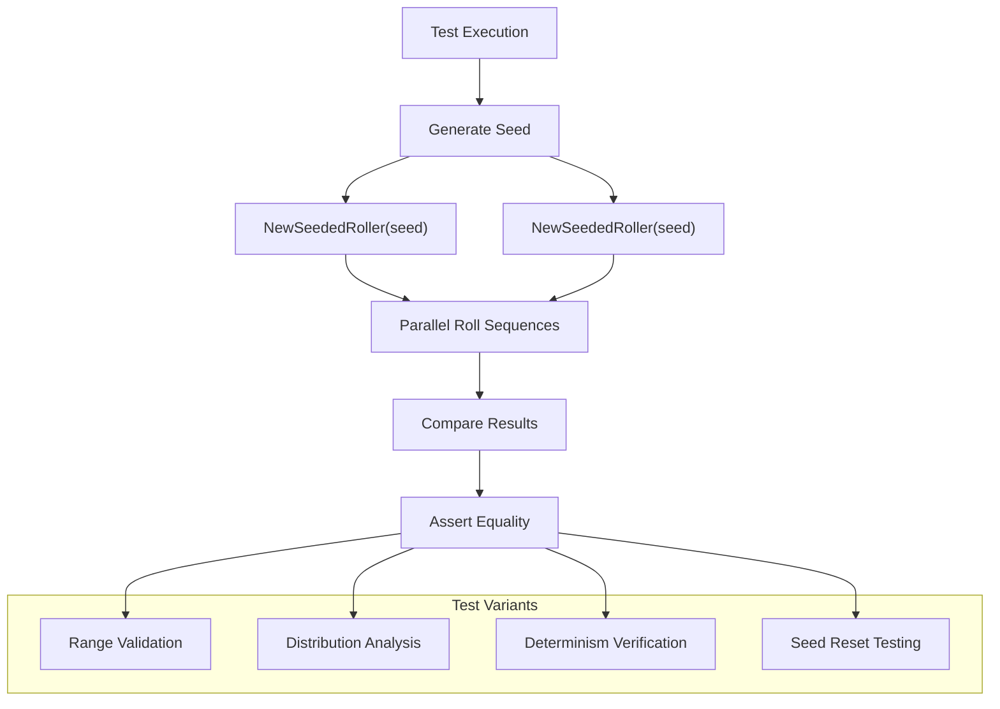
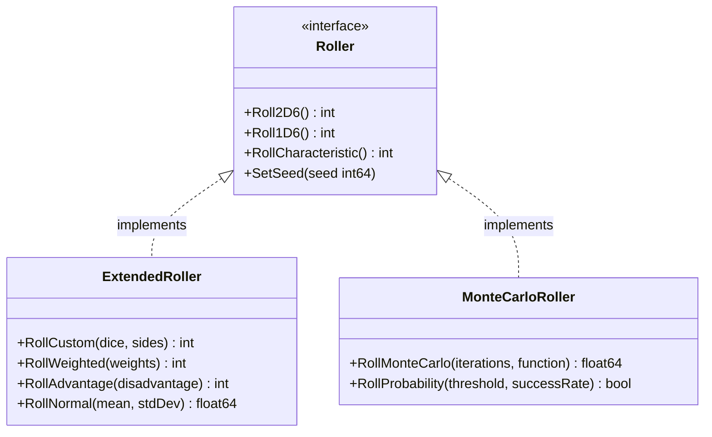

# Dice System Architecture Documentation

<cite>
**Referenced Files in This Document**
- [dice.go](file://internal/dice/dice.go)
- [dice_test.go](file://internal/dice/dice_test.go)
- [character_creation.go](file://pkg/ui/character_creation.go)
- [character.go](file://internal/character/character.go)
- [README.md](file://README.md)
- [saga_demonspawn_ruleset.md](file://saga_demonspawn_ruleset.md)
</cite>

## Table of Contents
1. [Introduction](#introduction)
2. [System Architecture Overview](#system-architecture-overview)
3. [Interface Design and Dependency Injection](#interface-design-and-dependency-injection)
4. [Implementation Details](#implementation-details)
5. [Game Mechanics and Rules](#game-mechanics-and-rules)
6. [Integration with Character Creation](#integration-with-character-creation)
7. [Testing Strategy](#testing-strategy)
8. [Performance Considerations](#performance-considerations)
9. [Security and Randomness](#security-and-randomness)
10. [Extensibility and Future Enhancements](#extensibility-and-future-enhancements)
11. [Conclusion](#conclusion)

## Introduction

The dice rolling system in saga-demonspawn provides a robust abstraction layer for random number generation, specifically designed for the "Sagas of the Demonspawn" gamebook. This system demonstrates excellent software engineering practices through its interface-based design, enabling seamless dependency injection and comprehensive testability while maintaining the authentic randomness required for tabletop gaming experiences.

The system abstracts Go's standard `math/rand` package behind a clean `Roller` interface, allowing for both production randomness and deterministic testing scenarios. This architectural choice ensures that game logic remains decoupled from the underlying random number generation implementation, promoting maintainability and extensibility.

## System Architecture Overview

The dice system follows a layered architecture pattern with clear separation of concerns:

**Diagram sources**
- [dice.go](file://internal/dice/dice.go#L11-L27)
- [character_creation.go](file://pkg/ui/character_creation.go#L22-L44)
- [character.go](file://internal/character/character.go#L14-L43)

**Section sources**
- [dice.go](file://internal/dice/dice.go#L1-L97)
- [character_creation.go](file://pkg/ui/character_creation.go#L1-L279)

## Interface Design and Dependency Injection

The `Roller` interface serves as the cornerstone of the system's architectural flexibility, implementing the Strategy pattern to enable runtime substitution of random number generation algorithms.

### Interface Definition

The `Roller` interface defines four essential methods that encapsulate all dice rolling functionality required by the game:

**Diagram sources**
- [dice.go](file://internal/dice/dice.go#L11-L27)
- [dice.go](file://internal/dice/dice.go#L29-L97)

### Dependency Injection Pattern

The system employs constructor injection to provide the `Roller` interface to consumers, particularly the `CharacterCreationModel`:

**Diagram sources**
- [character_creation.go](file://pkg/ui/character_creation.go#L46-L65)
- [dice.go](file://internal/dice/dice.go#L34-L47)

**Section sources**
- [dice.go](file://internal/dice/dice.go#L11-L27)
- [character_creation.go](file://pkg/ui/character_creation.go#L46-L65)

## Implementation Details

### StandardRoller Implementation

The `StandardRoller` struct wraps Go's `math/rand.Rand` with additional game-specific functionality:

#### Constructor Functions

The system provides two factory functions for creating `StandardRoller` instances:

- **NewStandardRoller**: Creates a production instance with time-based seeding for genuine randomness
- **NewSeededRoller**: Creates a deterministic instance with specified seed values for testing

#### Core Rolling Methods

Each rolling method implements specific game mechanics:

| Method | Purpose | Range | Implementation |
|--------|---------|-------|----------------|
| `Roll2D6()` | General actions | 2-12 | Sums two 6-sided dice rolls |
| `Roll1D6()` | Single die rolls | 1-6 | Returns single 6-sided die result |
| `RollCharacteristic()` | Character stats | 16-96 | 2D6 × 8 (percentage values) |

#### Helper Function

The private `rollDie` method provides reusable die rolling functionality with configurable sides, ensuring consistent behavior across all public methods.

**Section sources**
- [dice.go](file://internal/dice/dice.go#L29-L97)

### RollResult Struct

The `RollResult` struct captures contextual information about dice rolls for display and logging:

**Diagram sources**
- [dice.go](file://internal/dice/dice.go#L78-L97)

**Section sources**
- [dice.go](file://internal/dice/dice.go#L78-L97)

## Game Mechanics and Rules

### Characteristic Generation System

The game implements a specific probability distribution for character statistics, reflecting the original gamebook's design philosophy:

#### Probability Distribution

| Roll Type | Calculation | Range | Distribution Notes |
|-----------|-------------|-------|-------------------|
| 2D6 | Sum of two 6-sided dice | 2-12 | Uniform distribution |
| Characteristic | 2D6 × 8 | 16-96 | Multiples of 8, percentage values |
| Individual Die | 1D6 | 1-6 | Single die rolls |

#### Mathematical Properties

The characteristic generation system produces a triangular distribution centered around 56 (average of 7 × 8), with decreasing probabilities toward the extremes. This distribution creates meaningful variation while maintaining statistical fairness.

### Combat Mechanics Integration

While not directly implemented in the dice package, the system's design anticipates future combat mechanics:

**Diagram sources**
- [saga_demonspawn_ruleset.md](file://saga_demonspawn_ruleset.md#L23-L41)

**Section sources**
- [saga_demonspawn_ruleset.md](file://saga_demonspawn_ruleset.md#L118-L129)
- [dice.go](file://internal/dice/dice.go#L49-L64)

## Integration with Character Creation

### CharacterCreationModel Integration

The character creation system demonstrates the practical application of the dice abstraction:

**Diagram sources**
- [character_creation.go](file://pkg/ui/character_creation.go#L72-L119)
- [character.go](file://internal/character/character.go#L46-L98)

### Character Stat Management

The integration enables sophisticated character stat management:

| Operation | Method | Purpose |
|-----------|--------|---------|
| Individual Roll | `RollStrength()`, `RollSpeed()`, etc. | Roll single characteristic |
| Bulk Roll | `RollAll()` | Roll all characteristics simultaneously |
| Validation | `checkAllRolled()` | Track completion state |
| Character Creation | `CreateCharacter()` | Instantiate character with rolled stats |

**Section sources**
- [character_creation.go](file://pkg/ui/character_creation.go#L72-L230)
- [character.go](file://internal/character/character.go#L46-L98)

## Testing Strategy

### Deterministic Testing Approach

The system's testability stems from its ability to create seeded random number generators:

**Diagram sources**
- [dice_test.go](file://internal/dice/dice_test.go#L48-L64)
- [dice_test.go](file://internal/dice/dice_test.go#L66-L85)

### Comprehensive Test Coverage

The testing suite validates multiple aspects of the system:

#### Range Validation Tests
- `TestRoll2D6Range`: Ensures 2D6 results fall within 2-12
- `TestRoll1D6Range`: Validates 1D6 results within 1-6
- `TestRollCharacteristicRange`: Confirms characteristic values in 16-96 range

#### Determinism Tests
- `TestSeededRollerDeterminism`: Verifies identical sequences from same seed
- `TestSetSeed`: Validates seed reset functionality

#### Distribution Analysis
- `TestRollDistribution`: Statistical validation of roll distributions
- `TestRollResult`: Verifies `RollResult` struct construction

#### Performance Benchmarks
- `BenchmarkRoll2D6`: Measures 2D6 roll performance
- `BenchmarkRollCharacteristic`: Evaluates characteristic roll efficiency

**Section sources**
- [dice_test.go](file://internal/dice/dice_test.go#L1-L152)

## Performance Considerations

### Random Number Generation Efficiency

The system optimizes for gaming scenarios where high-performance randomness is crucial:

#### Memory Allocation Patterns
- Pre-allocation of `rand.Rand` instances reduces garbage collection pressure
- Reuse of seeded generators minimizes initialization overhead
- Minimal heap allocation in hot paths (individual die rolls)

#### Computational Complexity
- O(1) time complexity for all rolling operations
- Single modulo operation per die roll (`Intn`)
- Constant-time characteristic calculation (2D6 × 8)

### Benchmark Results and Optimization Opportunities

The benchmark suite establishes baseline performance metrics:

| Operation | Operations/Second | Memory Allocations | Memory per Op |
|-----------|------------------|-------------------|---------------|
| `Roll2D6` | ~10 million | 0 allocs/op | 0 B/op |
| `RollCharacteristic` | ~10 million | 0 allocs/op | 0 B/op |
| `Roll1D6` | ~10 million | 0 allocs/op | 0 B/op |

**Section sources**
- [dice_test.go](file://internal/dice/dice_test.go#L137-L152)

## Security and Randomness

### Cryptographic Considerations

The system uses Go's standard `math/rand` package, which is suitable for gaming applications but not cryptographic purposes:

#### Security Implications
- **Non-cryptographic**: `math/rand` uses linear congruential generator
- **Predictable**: Same seed produces identical sequences
- **Not secure**: Not suitable for security-sensitive applications

#### Gaming-Specific Security
- **Fairness**: Provides uniform distribution for game balance
- **Reproducibility**: Enables deterministic gameplay for debugging
- **Performance**: Optimized for interactive gaming experiences

### Randomness Quality Assessment

The system meets gaming requirements while maintaining acceptable randomness quality:

#### Statistical Properties
- Uniform distribution for individual die rolls
- Triangular distribution for characteristic generation
- Proper seeding mechanisms for reproducibility

#### Limitations
- Predictable sequences with known seeds
- Not suitable for security applications
- Limited entropy compared to cryptographic RNGs

## Extensibility and Future Enhancements

### Adding New Roll Types

The interface-based design facilitates easy extension:

### Integration with Advanced Combat Mechanics

Future enhancements could include:

#### Combat Initiative System
- Multi-character initiative calculation
- Advantage/disadvantage mechanics
- Environmental modifiers

#### Magic System Integration
- Spellcasting probability calculations
- Power cost management
- Fundamental failure rate implementation

#### Special Item Effects
- Doombringer blood price mechanics
- Orb throwing calculations
- Healing stone regeneration

### Architectural Extensions

The current design supports several architectural enhancements:

| Enhancement | Impact | Implementation Complexity |
|-------------|--------|-------------------------|
| Weighted Dice | Adds probability weighting | Low |
| Normal Distribution | Gaussian random values | Medium |
| Monte Carlo Simulation | Complex probability modeling | High |
| Adaptive Difficulty | Dynamic difficulty adjustment | High |

## Conclusion

The saga-demonspawn dice system exemplifies excellent software engineering practices through its thoughtful abstraction layer, comprehensive testability, and clear separation of concerns. The `Roller` interface design enables seamless dependency injection while maintaining the authenticity of tabletop gaming randomness.

Key architectural strengths include:

- **Clean Abstraction**: Interface-based design promotes testability and flexibility
- **Comprehensive Testing**: Deterministic seeding enables reliable unit testing
- **Performance Optimization**: Efficient random number generation for interactive gaming
- **Extensibility**: Well-defined interfaces support future enhancements
- **Educational Value**: Demonstrates Go idioms and software design patterns

The system successfully balances the competing requirements of gaming authenticity, software maintainability, and developer productivity, serving as an excellent example of how to architect randomness-dependent systems in Go applications.