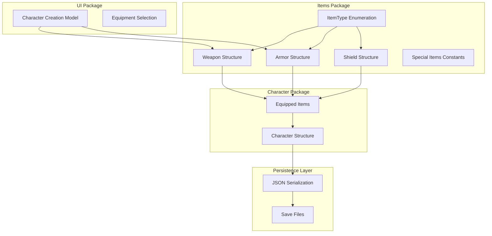
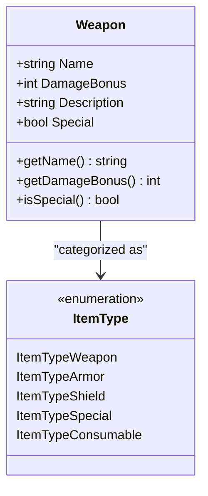
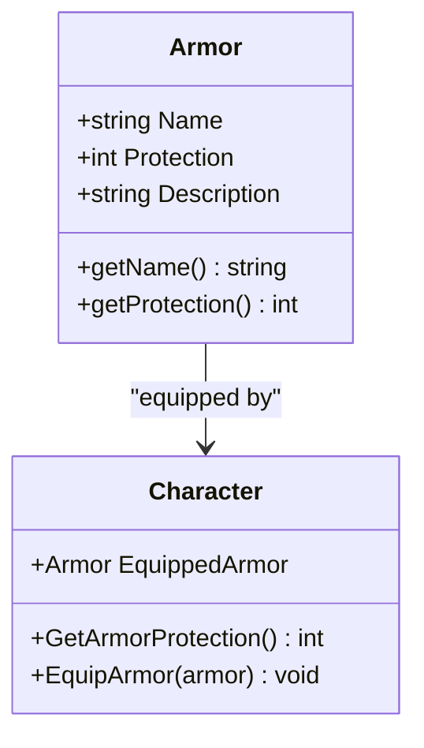
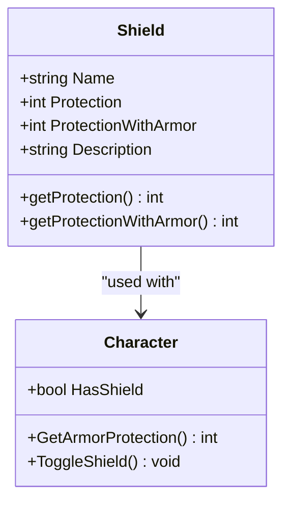
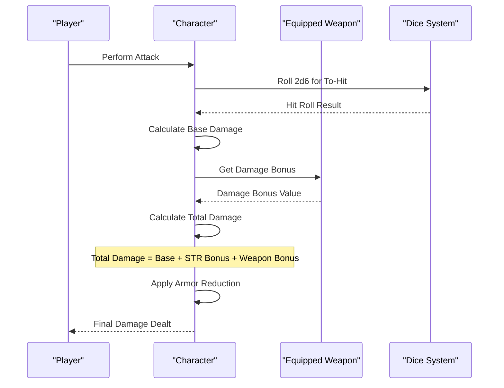
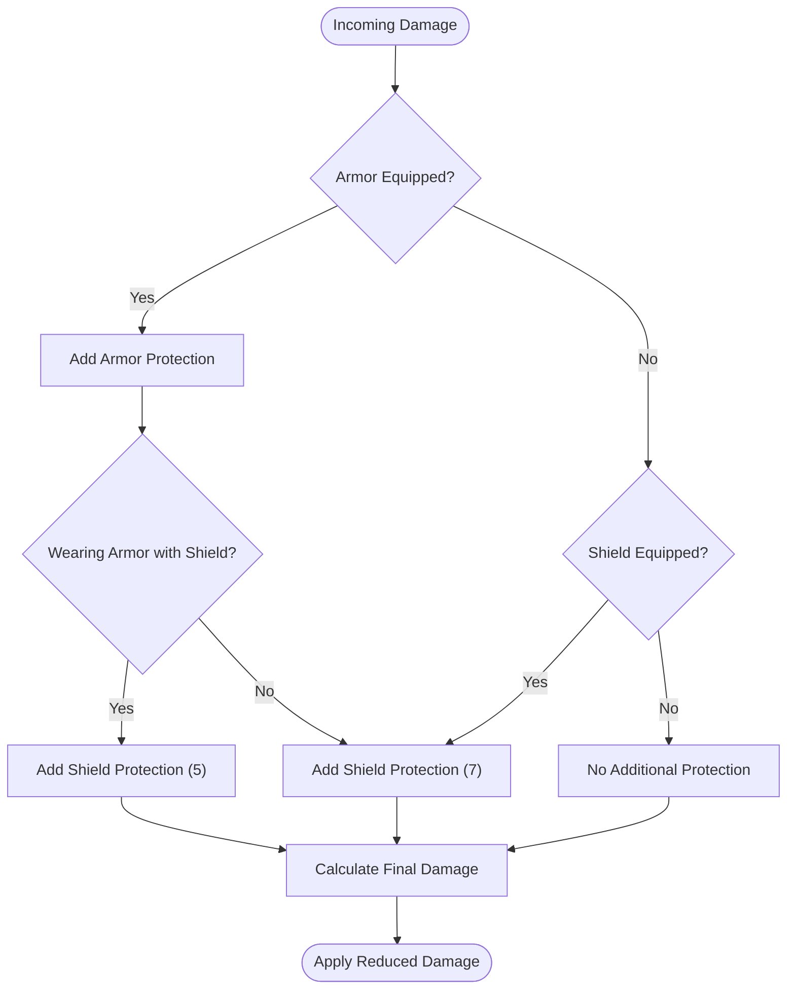
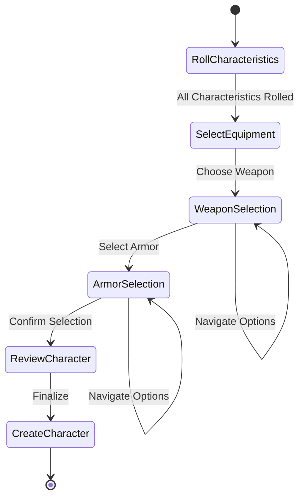
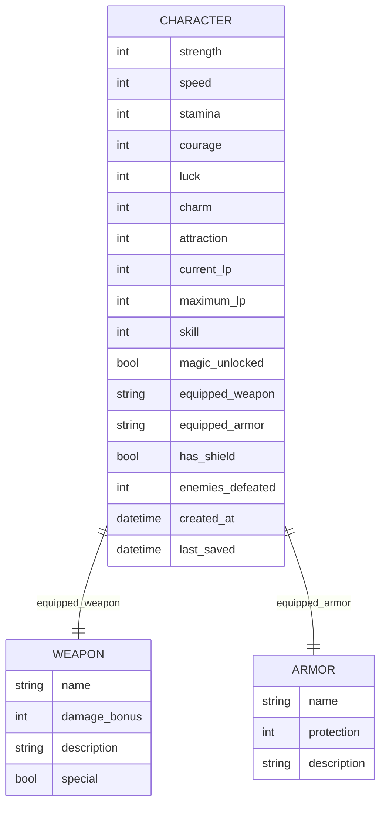
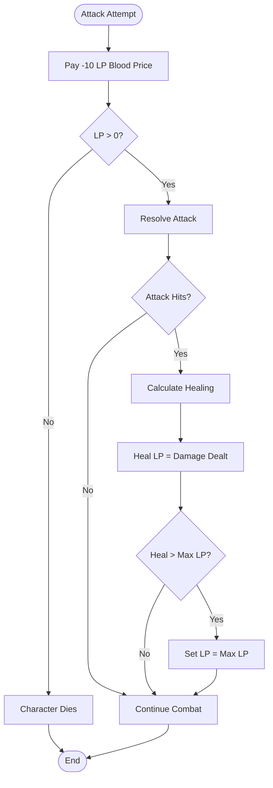

# Items System

<cite>
**Referenced Files in This Document**
- [internal/items/items.go](file://internal/items/items.go)
- [internal/character/character.go](file://internal/character/character.go)
- [pkg/ui/character_creation.go](file://pkg/ui/character_creation.go)
- [internal/dice/dice.go](file://internal/dice/dice.go)
- [saga_demonspawn_ruleset.md](file://saga_demonspawn_ruleset.md)
- [README.md](file://README.md)
</cite>

## Table of Contents
1. [Introduction](#introduction)
2. [System Architecture](#system-architecture)
3. [Item Types and Categories](#item-types-and-categories)
4. [Core Item Structures](#core-item-structures)
5. [Predefined Items](#predefined-items)
6. [Equipment Mechanics](#equipment-mechanics)
7. [Character Creation Integration](#character-creation-integration)
8. [Persistence and Serialization](#persistence-and-serialization)
9. [Special Items](#special-items)
10. [Future Expansion](#future-expansion)
11. [Gameplay Impact](#gameplay-impact)

## Introduction

The Items System in Saga-Demonspawn provides a comprehensive framework for managing character equipment, including weapons, armor, shields, and special items. This system forms the foundation of character customization and combat effectiveness, offering players meaningful choices that impact their gameplay experience.

The system is designed around four core item categories: weapons for dealing damage, armor for protection, shields for additional defense, and special items with unique mechanics. Each item type contributes distinct benefits and strategic considerations to character builds.

## System Architecture

The items system follows a modular architecture with clear separation of concerns:

**Diagram sources**
- [internal/items/items.go](file://internal/items/items.go#L1-L52)
- [internal/character/character.go](file://internal/character/character.go#L14-L45)
- [pkg/ui/character_creation.go](file://pkg/ui/character_creation.go#L21-L45)

**Section sources**
- [internal/items/items.go](file://internal/items/items.go#L1-L257)
- [internal/character/character.go](file://internal/character/character.go#L1-L355)

## Item Types and Categories

The ItemType enumeration defines the fundamental categories that organize all items in the system:

| ItemType | Purpose | Example Items |
|----------|---------|---------------|
| `ItemTypeWeapon` | Melee and ranged weapons for damage | Sword, Axe, Dagger, Doombringer |
| `ItemTypeArmor` | Protective gear reducing incoming damage | Leather Armor, Chain Mail, Plate Mail |
| `ItemTypeShield` | Additional defensive barrier | Standard Shield |
| `ItemTypeSpecial` | Unique items with custom mechanics | Healing Stone, Doombringer, The Orb |
| `ItemTypeConsumable` | Items that can be used and consumed | Healing Stone, Potions |

Each item type serves specific gameplay purposes and integrates with the character's combat mechanics in distinct ways.

**Section sources**
- [internal/items/items.go](file://internal/items/items.go#L5-L18)

## Core Item Structures

### Weapon Structure

Weapons represent offensive equipment that enhances damage output during combat:

**Diagram sources**
- [internal/items/items.go](file://internal/items/items.go#L20-L30)

**Key Fields:**
- **Name**: Display identifier for the weapon
- **DamageBonus**: Integer value added to damage calculations
- **Description**: Flavor text providing context and usage notes
- **Special**: Boolean flag indicating unique mechanics

### Armor Structure

Armor provides passive damage reduction, protecting characters from enemy attacks:

**Diagram sources**
- [internal/items/items.go](file://internal/items/items.go#L32-L41)
- [internal/character/character.go](file://internal/character/character.go#L284-L302)

**Key Fields:**
- **Name**: Display identifier for the armor
- **Protection**: Integer damage reduction value
- **Description**: Flavor text providing context

### Shield Structure

Shields offer additional defensive capabilities with conditional protection values:

**Diagram sources**
- [internal/items/items.go](file://internal/items/items.go#L42-L52)

**Key Fields:**
- **Name**: Display identifier
- **Protection**: Full protection value
- **ProtectionWithArmor**: Reduced protection when worn with armor
- **Description**: Flavor text

**Section sources**
- [internal/items/items.go](file://internal/items/items.go#L20-L52)

## Predefined Items

The system includes comprehensive predefined items organized by category:

### Standard Weapons

| Weapon | Damage Bonus | Description | Special |
|--------|--------------|-------------|---------|
| Sword | 10 | Standard melee weapon | No |
| Dagger | 5 | Light, concealable | No |
| Club | 8 | Basic melee weapon | No |
| Axe | 15 | Standard melee weapon | No |
| Mace | 14 | Heavy melee weapon | No |
| Flail | 7 | Standard melee weapon | No |
| Spear | 12 | Can be thrown | No |
| Halberd | 12 | Two-handed weapon | No |
| Lance | 12 | Mounted/charge weapon | No |
| Arrow | 10 | Ranged, single use | No |

### Special Weapon - Doombringer

The Doombringer represents the pinnacle of power with significant risks:

- **Damage Bonus**: +20 (10 points above a normal sword)
- **Blood Price**: -10 LP per attack (paid regardless of hit/miss)
- **Soul Thirst**: Heal LP equal to total damage dealt (after armor/shield reduction)
- **Maximum LP Limit**: Cannot exceed starting LP total

### Standard Armor

| Armor | Protection | Description |
|-------|------------|-------------|
| None | 0 | No armor equipped |
| Leather Armor | 5 | Light armor, no movement penalty |
| Chain Mail | 8 | Medium armor, no movement penalty |
| Plate Mail | 12 | Heavy armor, no movement penalty |

### Shield

| Shield | Protection | ProtectionWithArmor | Description |
|--------|------------|---------------------|-------------|
| Standard Shield | 7 | 5 | Protection varies if worn with armor |

**Section sources**
- [internal/items/items.go](file://internal/items/items.go#L61-L192)

## Equipment Mechanics

### Damage Calculation Integration

The character system integrates equipped weapons seamlessly into combat calculations:

**Diagram sources**
- [internal/character/character.go](file://internal/character/character.go#L304-L310)
- [internal/dice/dice.go](file://internal/dice/dice.go#L11-L27)

### Protection Calculation

Armor and shield protection works synergistically to reduce incoming damage:

**Diagram sources**
- [internal/character/character.go](file://internal/character/character.go#L284-L302)

### Equipment Limitations

The system enforces logical equipment combinations:

- **Shield Usage**: Cannot be combined with two-handed weapons
- **Armor Penalties**: Heavy armor may impose movement restrictions
- **Special Items**: Certain items have exclusive usage conditions

**Section sources**
- [internal/character/character.go](file://internal/character/character.go#L284-L310)

## Character Creation Integration

### Starting Equipment Selection

Character creation limits initial equipment choices to establish baseline gameplay:

**Diagram sources**
- [pkg/ui/character_creation.go](file://pkg/ui/character_creation.go#L12-L19)

### Equipment Selection Functions

The system provides specialized functions for equipment availability:

| Function | Purpose | Available Items |
|----------|---------|-----------------|
| `StartingWeapons()` | Initial weapon choices | Sword, Dagger, Club |
| `StartingArmor()` | Initial armor choices | None, Leather Armor |
| `AllWeapons()` | Complete weapon list | All predefined weapons |
| `AllArmor()` | Complete armor list | All predefined armor |

### Lookup Functions

Efficient item retrieval enables persistent character state:

- **`GetWeaponByName(name)`**: Returns pointer to weapon or nil if not found
- **`GetArmorByName(name)`**: Returns pointer to armor or nil if not found

**Section sources**
- [pkg/ui/character_creation.go](file://pkg/ui/character_creation.go#L1-L279)
- [internal/items/items.go](file://internal/items/items.go#L238-L256)

## Persistence and Serialization

### JSON Serialization

Characters are persisted as JSON documents, with equipped items serialized as references:

**Diagram sources**
- [internal/character/character.go](file://internal/character/character.go#L14-L45)

### Save/Load Operations

The character system handles complete state persistence:

- **Save Operation**: Serializes character data with timestamped filenames
- **Load Operation**: Deserializes JSON data maintaining equipment references
- **Timestamp Tracking**: Automatic timestamp updates for save versioning

**Section sources**
- [internal/character/character.go](file://internal/character/character.go#L312-L354)

## Special Items

### Doombringer Mechanics

The Doombringer exemplifies the system's risk-reward design:

**Diagram sources**
- [saga_demonspawn_ruleset.md](file://saga_demonspawn_ruleset.md#L77-L82)

### Healing Stone

Provides emergency healing capability:

- **Usage**: Once per combat round
- **Effect**: Restores 1d6 × 10 LP
- **Limitation**: 50 LP total capacity
- **Recharge**: 48 hours after last use

### The Orb

Dual-purpose artifact with strategic combat applications:

- **Held**: Doubles damage against Demonspawn
- **Thrown**: Instant kill (4+ on 2d6) or 200 damage (miss)
- **Limitation**: Destroyed upon use

**Section sources**
- [saga_demonspawn_ruleset.md](file://saga_demonspawn_ruleset.md#L74-L89)

## Future Expansion

The system architecture supports extensive future enhancements:

### Planned Additions

| Category | Implementation Plan |
|----------|-------------------|
| Consumables | Healing potions, mana potions, utility items |
| Magic Items | Enchanted weapons, mystical armor, artifacts |
| Ranged Weapons | Bows, crossbows, throwing weapons |
| Accessory Items | Rings, amulets, talismans with unique effects |
| Quest Items | Story-relevant items with narrative significance |

### Design Principles for Expansion

- **Interface-Based Design**: Extensible item types through interfaces
- **Modular Structure**: Clear separation allowing independent development
- **Backward Compatibility**: Existing items remain functional with new additions
- **Balanced Integration**: New items integrate seamlessly with existing mechanics

### Scalability Considerations

The system's design accommodates growth while maintaining performance:

- **Lookup Efficiency**: O(1) item retrieval through name-based indexing
- **Memory Management**: Lightweight item structures with minimal overhead
- **Serialization Efficiency**: Compact JSON representation for save files
- **Extensibility**: New item types can be added without breaking existing functionality

**Section sources**
- [README.md](file://README.md#L28-L32)

## Gameplay Impact

### Strategic Decision-Making

The items system creates meaningful gameplay decisions:

**Weapon Selection**: Players must balance damage potential with risk tolerance, particularly when choosing between powerful but dangerous weapons like Doombringer and safer alternatives.

**Armor Choices**: The progression from leather to plate mail represents increasing protection at the cost of mobility and weight considerations.

**Special Item Usage**: Limited-use items like Healing Stones and The Orb require careful timing and strategic placement during combat scenarios.

### Risk-Reward Dynamics

Different items present varying risk profiles:

| Item Category | Risk Level | Reward Level | Strategic Considerations |
|---------------|------------|--------------|-------------------------|
| Standard Weapons | Low | Moderate | Reliable damage output |
| Doombringer | High | Very High | Extreme damage with life cost |
| Healing Stone | Low | High | Emergency healing with cooldown |
| The Orb | Medium | Very High | High-risk, high-reward combat tool |

### Character Build Optimization

Players can optimize their characters through strategic equipment choices:

- **Damage Dealers**: Focus on high-damage weapons with appropriate armor
- **Tank Builds**: Prioritize heavy armor and defensive shields
- **Hybrid Approaches**: Balance offense and defense through strategic item selection
- **Specialized Roles**: Leverage unique items for specific combat situations

The system encourages experimentation and adaptation, allowing players to develop preferred playstyles through equipment customization.