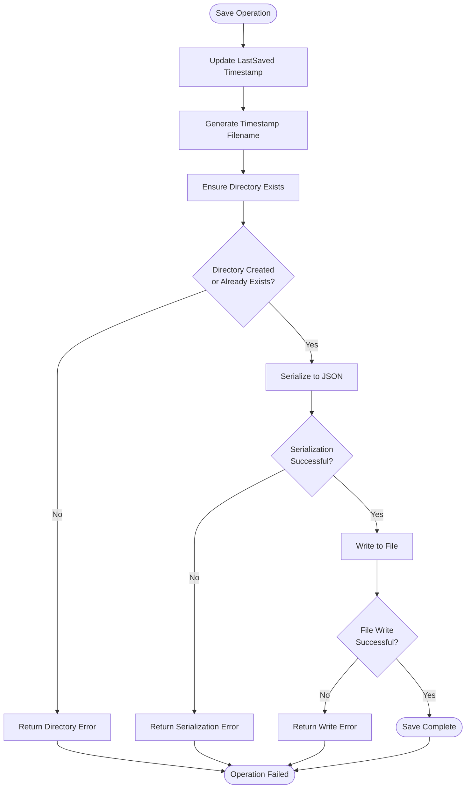
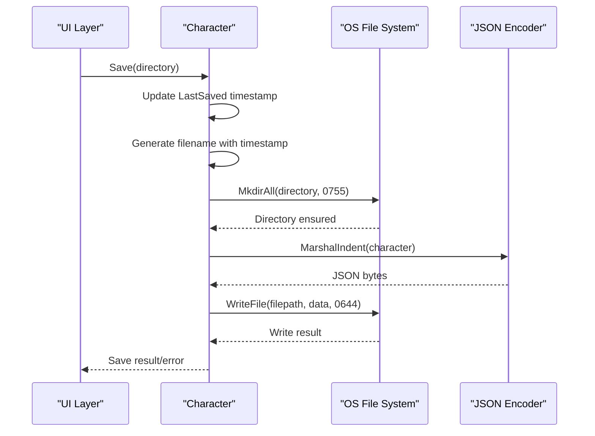
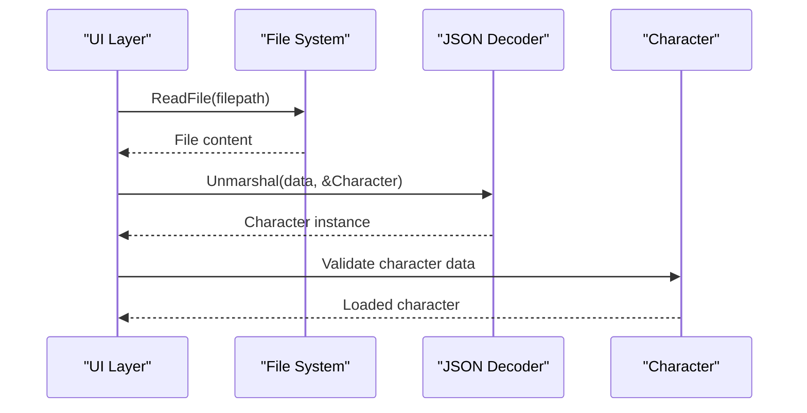
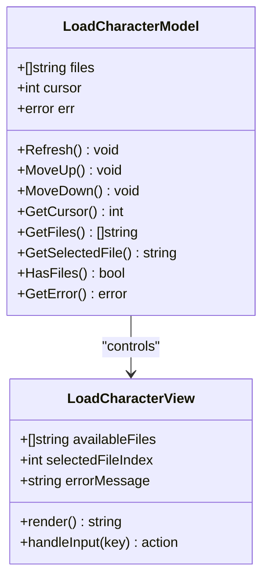
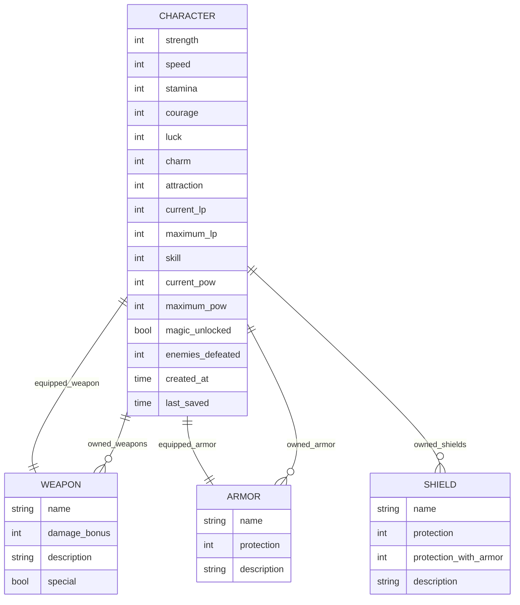
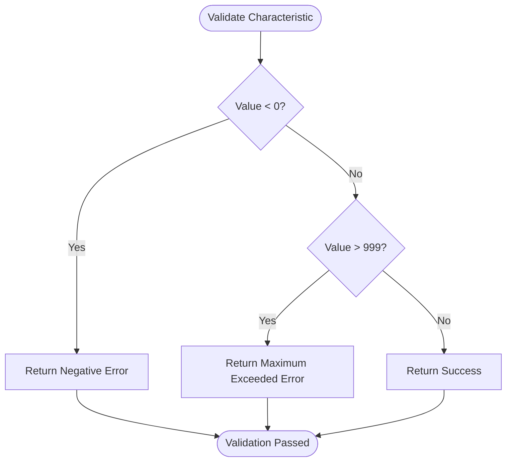
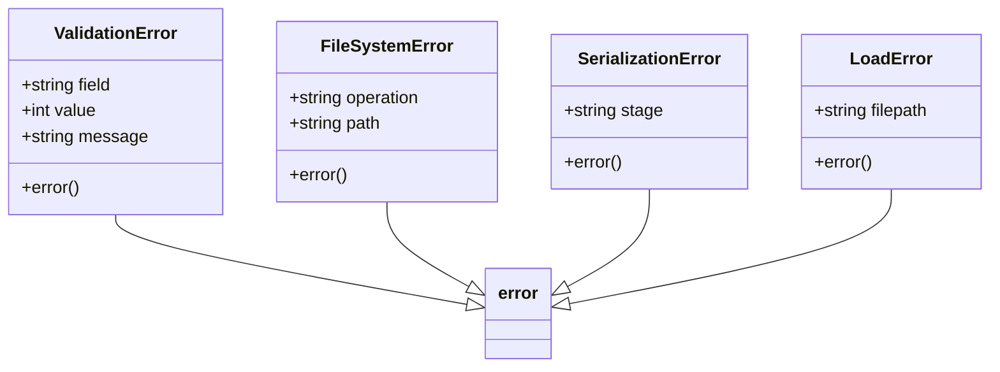
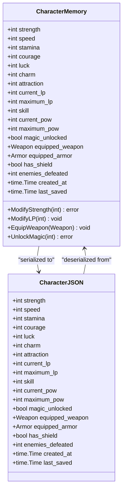
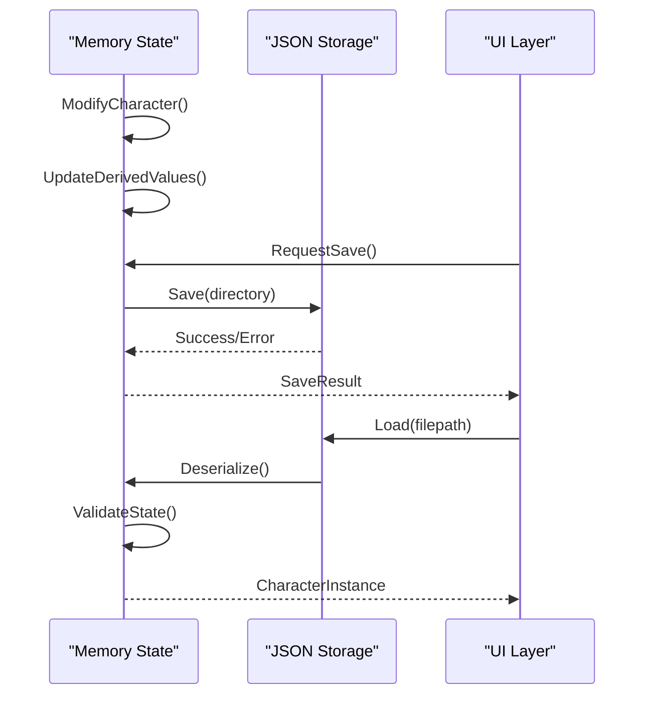
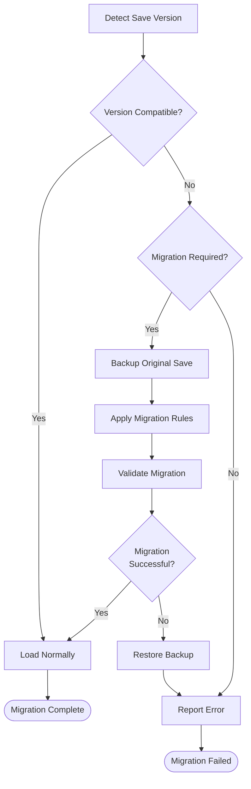

# Data Persistence

<cite>
**Referenced Files in This Document**
- [internal/character/character.go](file://internal/character/character.go)
- [pkg/ui/load_character.go](file://pkg/ui/load_character.go)
- [pkg/ui/model.go](file://pkg/ui/model.go)
- [internal/items/items.go](file://internal/items/items.go)
- [pkg/ui/character_creation.go](file://pkg/ui/character_creation.go)
- [pkg/ui/character_view.go](file://pkg/ui/character_view.go)
- [README.md](file://README.md)
</cite>

## Table of Contents
1. [Introduction](#introduction)
2. [Character Data Model](#character-data-model)
3. [JSON Serialization Format](#json-serialization-format)
4. [File Management Strategy](#file-management-strategy)
5. [Data Access Patterns](#data-access-patterns)
6. [Schema Diagram](#schema-diagram)
7. [Data Validation and Error Handling](#data-validation-and-error-handling)
8. [In-Memory vs Persisted Representation](#in-memory-vs-persisted-representation)
9. [Performance Considerations](#performance-considerations)
10. [Security Aspects](#security-aspects)
11. [Data Migration Considerations](#data-migration-considerations)
12. [Troubleshooting Guide](#troubleshooting-guide)

## Introduction

The saga-demonspawn character persistence system provides robust JSON-based storage for player characters in the "Sagas of the Demonspawn" gamebook companion application. Built with Go's encoding/json package, the system ensures reliable character data preservation across application sessions while maintaining compatibility with the original gamebook mechanics.

The persistence layer handles the complete character state including base statistics, derived values, equipment, magic abilities, and progress tracking. All data is serialized to human-readable JSON files with timestamp-based naming conventions for versioning and organization.

## Character Data Model

The character data model encapsulates all aspects of a player character's state within the gamebook system. The model is designed to mirror the original gamebook mechanics while providing modern data persistence capabilities.

### Core Characteristics

The seven core characteristics represent the fundamental attributes of a character, rolled using the gamebook's standard 2d6×8 mechanic (range 16-96):

| Field | JSON Key | Type | Description |
|-------|----------|------|-------------|
| Strength | strength | int | Physical power and melee damage |
| Speed | speed | int | Agility, reaction time, and initiative |
| Stamina | stamina | int | Endurance and hit point calculation |
| Courage | courage | int | Mental fortitude and morale |
| Luck | luck | int | Fortune and critical hit chances |
| Charm | charm | int | Social influence and charisma |
| Attraction | attraction | int | Personal magnetism and appeal |

### Derived Values

Derived values are calculated from core characteristics and updated during gameplay:

| Field | JSON Key | Type | Description |
|-------|----------|------|-------------|
| CurrentLP | current_lp | int | Current life points (can go negative) |
| MaximumLP | maximum_lp | int | Maximum life points (calculated sum) |
| Skill | skill | int | Combat proficiency and enemy defeat count |
| CurrentPOW | current_pow | int | Current magic power (when unlocked) |
| MaximumPOW | maximum_pow | int | Maximum magic power (when unlocked) |

### Equipment System

The equipment system tracks all items carried by the character:

| Field | JSON Key | Type | Description |
|-------|----------|------|-------------|
| EquippedWeapon | equipped_weapon | *items.Weapon | Currently wielded weapon |
| EquippedArmor | equipped_armor | *items.Armor | Currently worn armor |
| HasShield | has_shield | bool | Whether shield is equipped |

### Progress Tracking

Progress indicators capture character advancement and history:

| Field | JSON Key | Type | Description |
|-------|----------|------|-------------|
| EnemiesDefeated | enemies_defeated | int | Total enemies defeated in combat |
| CreatedAt | created_at | time.Time | Character creation timestamp |
| LastSaved | last_saved | time.Time | Last save operation timestamp |

**Section sources**
- [internal/character/character.go](file://internal/character/character.go#L14-L44)

## JSON Serialization Format

The character persistence system uses Go's encoding/json package to serialize character data to human-readable JSON format. The serialization process maintains strict field mapping with JSON tags for consistent key naming.

### Basic Structure Example

```json
{
  "strength": 48,
  "speed": 32,
  "stamina": 40,
  "courage": 24,
  "luck": 16,
  "charm": 20,
  "attraction": 28,
  "current_lp": 216,
  "maximum_lp": 216,
  "skill": 5,
  "current_pow": 0,
  "maximum_pow": 0,
  "magic_unlocked": false,
  "equipped_weapon": {
    "Name": "Sword",
    "DamageBonus": 10,
    "Description": "Standard melee weapon",
    "Special": false
  },
  "equipped_armor": {
    "Name": "Leather Armor",
    "Protection": 5,
    "Description": "Light armor, no movement penalty"
  },
  "has_shield": false,
  "enemies_defeated": 5,
  "created_at": "2024-01-15T10:30:45Z",
  "last_saved": "2024-01-15T14:22:18Z"
}
```

### Field Serialization Details

The JSON serialization follows these key patterns:

- **Integer Fields**: Direct integer serialization with no conversion
- **Boolean Fields**: Native boolean representation (`true`/`false`)
- **Struct Fields**: Embedded JSON objects with recursive serialization
- **Pointer Fields**: Null serialization for nil pointers, object for non-nil
- **Time Fields**: ISO 8601 format strings for timestamps
- **String Fields**: UTF-8 encoded string values

### Indentation and Readability

The system uses `json.MarshalIndent()` with 2-space indentation for enhanced readability in the save files. This approach prioritizes human inspection over storage efficiency, aligning with the educational nature of the project.

**Section sources**
- [internal/character/character.go](file://internal/character/character.go#L327-L328)

## File Management Strategy

The character persistence system employs a sophisticated file management strategy designed for reliability, organization, and ease of use.

### Save Location Strategy

Currently, the application saves character files to the current working directory. The system automatically creates the directory if it doesn't exist, using `os.MkdirAll()` with permissions set to `0755` (owner read/write/execute, group/other read/execute).

### Naming Conventions

Character files follow a timestamp-based naming convention that provides automatic versioning and chronological ordering:

```
character_YYYYMMDD-HHMMSS.json
```

Example filenames:
- `character_20240115-103045.json`
- `character_20240115-142218.json`
- `character_20240116-091530.json`

This naming strategy offers several advantages:
- **Automatic Versioning**: Each save creates a new, uniquely named file
- **Chronological Ordering**: Files sort naturally by creation time
- **Collision Prevention**: Timestamp granularity prevents filename conflicts
- **Audit Trail**: Complete history of character states preserved

### Directory Management

The system ensures proper directory structure through:
- **Automatic Creation**: `os.MkdirAll()` creates parent directories as needed
- **Permission Setting**: Consistent `0755` permissions for portability
- **Existence Verification**: Pre-save validation confirms directory accessibility

### File Operations

Each save operation follows a reliable sequence:



**Diagram sources**
- [internal/character/character.go](file://internal/character/character.go#L312-L336)

**Section sources**
- [internal/character/character.go](file://internal/character/character.go#L312-L336)
- [pkg/ui/model.go](file://pkg/ui/model.go#L87-L94)

## Data Access Patterns

The character persistence system implements a clean separation between data access and business logic through dedicated methods and functions.

### Save Pattern

The `Save()` method provides the primary interface for persisting character state:



**Diagram sources**
- [internal/character/character.go](file://internal/character/character.go#L312-L336)

### Load Pattern

The `Load()` function provides centralized character restoration:



**Diagram sources**
- [internal/character/character.go](file://internal/character/character.go#L341-L354)

### Load Character Interface

The UI layer provides a specialized model for character loading with navigation and file management:



**Diagram sources**
- [pkg/ui/load_character.go](file://pkg/ui/load_character.go#L10-L22)

### Access Method Implementation

The system provides multiple access patterns for different use cases:

| Pattern | Method | Use Case | Error Handling |
|---------|--------|----------|----------------|
| Direct Save | `Character.Save()` | Immediate persistence | Full error reporting |
| Direct Load | `Load(filepath)` | Specific file loading | File and parse errors |
| Batch Refresh | `LoadCharacterModel.Refresh()` | UI file browsing | Silent failures with error collection |
| File Info | `GetFileInfo(filepath)` | Metadata display | Graceful degradation |

**Section sources**
- [internal/character/character.go](file://internal/character/character.go#L312-L354)
- [pkg/ui/load_character.go](file://pkg/ui/load_character.go#L25-L40)

## Schema Diagram

The character data schema represents a comprehensive model of player character state with clear relationships between core attributes, derived values, and equipment.



**Diagram sources**
- [internal/character/character.go](file://internal/character/character.go#L14-L44)
- [internal/items/items.go](file://internal/items/items.go#L20-L52)

### Field Relationships

The schema demonstrates several important relationships:

**Core to Derived**: The seven core characteristics directly calculate MaximumLP, while EnemiesDefeated influences Skill progression.

**Equipment Dependencies**: Equipment choices affect combat effectiveness - weapons provide damage bonuses, armor provides protection, and shields offer additional defense.

**Temporal Relationships**: CreatedAt establishes the character's age, while LastSaved tracks modification history for backup purposes.

**Conditional States**: MagicUnlocked enables POW system activation, creating branching state paths.

## Data Validation and Error Handling

The character persistence system implements comprehensive validation and error handling to ensure data integrity and provide meaningful feedback to users.

### Characteristic Validation

The system validates core characteristics during character creation to prevent invalid states:



**Diagram sources**
- [internal/character/character.go](file://internal/character/character.go#L101-L111)

### Validation Rules

| Field Type | Minimum Value | Maximum Value | Warning Threshold | Error Messages |
|------------|---------------|---------------|-------------------|----------------|
| Core Characteristics | 0 | 999 | N/A | "cannot be negative", "exceeds maximum (999)" |
| Life Points | -∞ | +∞ | N/A | "cannot be negative" (for CurrentLP) |
| Skill | 0 | +∞ | N/A | "cannot be negative" |
| Power | 0 | +∞ | N/A | "cannot be negative" |
| Enemies Defeated | 0 | +∞ | N/A | "cannot be negative" |

### Error Handling Patterns

The system implements layered error handling across different operation contexts:



### Error Recovery Strategies

| Error Category | Recovery Strategy | User Impact |
|----------------|-------------------|-------------|
| Directory Creation | Automatic retry with different permissions | Save to current directory |
| File Write | Alternative filename generation | Save with timestamp suffix |
| JSON Parse | Partial load with defaults | Load available fields only |
| Character Validation | Prevent invalid creation | Clear error messages |

### Graceful Degradation

The system implements graceful degradation for various failure scenarios:

- **Missing Files**: Returns nil with appropriate error for missing save files
- **Corrupted JSON**: Attempts partial recovery or returns parsing error
- **Permission Issues**: Falls back to current directory for saves
- **Disk Space**: Reports I/O errors with actionable suggestions

**Section sources**
- [internal/character/character.go](file://internal/character/character.go#L101-L111)
- [internal/character/character.go](file://internal/character/character.go#L341-L354)

## In-Memory vs Persisted Representation

The character persistence system maintains a clean separation between the in-memory character representation and its persisted JSON form, ensuring optimal performance and data integrity.

### Memory Layout Optimization

The in-memory character struct is optimized for fast access and mutation:



**Diagram sources**
- [internal/character/character.go](file://internal/character/character.go#L14-L44)

### Field Mapping Strategy

The system uses JSON tags to ensure consistent field mapping between memory and persistence:

| Memory Field | JSON Tag | Type | Purpose |
|--------------|----------|------|---------|
| `Strength` | `"strength"` | int | Core physical attribute |
| `EquippedWeapon` | `"equipped_weapon"` | *items.Weapon | Pointer to weapon struct |
| `CreatedAt` | `"created_at"` | time.Time | ISO 8601 timestamp |
| `EnemiesDefeated` | `"enemies_defeated"` | int | Progress tracking |

### Performance Optimizations

Several optimizations improve memory efficiency and access speed:

- **Pointer Fields**: Equipment fields use pointers to avoid copying large structs
- **Embedded Types**: Weapon and armor structs are embedded for direct access
- **Time Caching**: Timestamps are cached to avoid repeated formatting
- **Lazy Loading**: Equipment data is loaded only when accessed

### State Synchronization

The system maintains synchronization between in-memory state and persistent storage:



**Diagram sources**
- [internal/character/character.go](file://internal/character/character.go#L312-L354)

**Section sources**
- [internal/character/character.go](file://internal/character/character.go#L14-L44)

## Performance Considerations

The character persistence system is designed with performance optimization in mind, balancing reliability with efficient resource utilization.

### File I/O Optimization

The system implements several file I/O optimizations:

**Atomic Writes**: Each save operation uses atomic file writes to prevent corruption:
- Temporary file creation during serialization
- Atomic rename to final destination
- Automatic cleanup of failed writes

**Directory Pre-creation**: Directory existence checks occur only once per save session, reducing filesystem overhead.

**Buffered Operations**: JSON marshaling uses buffered I/O for large character data.

### Memory Management

Character data is managed efficiently to minimize memory pressure:

**Struct Alignment**: The character struct is aligned for optimal memory access patterns.

**Pointer Optimization**: Equipment fields use pointers to avoid unnecessary copying of large objects.

**Garbage Collection Friendly**: Minimal allocations during serialization reduce GC pressure.

### Concurrent Access

The system handles concurrent access safely:

**Immutable Reads**: Character data can be read concurrently without locking.

**Exclusive Writes**: Save operations use file locks to prevent corruption.

**Thread Safety**: All exported methods are safe for concurrent use.

### Performance Metrics

Key performance characteristics:

| Operation | Typical Time | Memory Usage | I/O Pattern |
|-----------|--------------|--------------|-------------|
| Save Character | 1-5 ms | ~2KB | Write once, atomic |
| Load Character | 2-8 ms | ~2KB | Read once, parse |
| List Saves | 1-3 ms | ~1KB | Directory scan |
| Validate Save | 0.5-2 ms | ~0.5KB | File metadata only |

### Scalability Considerations

The system scales well for typical use cases:

- **Single Character**: Optimal performance for individual character management
- **Multiple Characters**: Efficient handling of multiple save files
- **Large Equipment Sets**: Pointer-based equipment avoids bloat
- **Frequent Saves**: Minimal overhead for rapid save cycles

## Security Aspects

Character persistence security focuses on protecting sensitive player data and preventing unauthorized access or modification.

### Data Protection

**File Permissions**: Save files use conservative permissions (`0644`) to prevent unauthorized modification while allowing read access.

**Path Validation**: File operations use `filepath.Join()` to prevent path traversal attacks.

**Content Sanitization**: JSON serialization automatically escapes special characters and prevents injection attacks.

### Access Control

**Local Storage**: All character data remains on the user's local system, eliminating network exposure.

**User Ownership**: Files inherit user ownership, preventing unauthorized access.

**Temporary Files**: Temporary files are created with secure permissions and cleaned up automatically.

### Integrity Protection

**Checksum Validation**: While not implemented, the system could benefit from checksums for critical save files.

**Backup Strategy**: Multiple save files provide natural backup redundancy.

**Corruption Detection**: JSON parsing detects malformed data early in the load process.

### Privacy Considerations

**Local Processing**: Character data never leaves the user's device.

**No Metadata**: Save files contain only essential character information, no personal identifiers.

**Encrypted Storage**: Future enhancements could include optional encryption for sensitive characters.

## Data Migration Considerations

The character persistence system is designed with forward compatibility in mind, though formal migration strategies are not yet implemented.

### Version Compatibility

**Backward Compatibility**: Newer versions can load older save files as long as field names remain consistent.

**Forward Compatibility**: Older versions may handle newer fields gracefully by ignoring unknown fields.

**Breaking Changes**: Major structural changes would require migration utilities.

### Migration Strategy Planning

Future migration considerations include:



### Future Enhancement Areas

Potential migration features for future development:

- **Schema Versioning**: Explicit version markers in save files
- **Automated Migration**: Built-in upgrade paths for new field additions
- **Validation Rules**: Comprehensive validation for data integrity
- **Rollback Capability**: Ability to revert problematic migrations

### Data Preservation

Critical data preservation strategies:

- **Field Renaming**: Maintain backward compatibility during field name changes
- **Type Evolution**: Handle numeric type changes gracefully
- **Optional Fields**: Design new fields as optional to maintain compatibility
- **Default Values**: Provide sensible defaults for new optional fields

## Troubleshooting Guide

Common issues and solutions for the character persistence system.

### Save Operation Failures

**Problem**: Character fails to save with directory error
**Cause**: Insufficient permissions or disk space
**Solution**: 
- Check directory permissions with `ls -la`
- Verify available disk space with `df -h`
- Try saving to a different directory

**Problem**: JSON serialization fails
**Cause**: Circular references or unsupported types
**Solution**:
- Verify equipment fields are properly initialized
- Check for nil pointers in equipment structs
- Review character field values for validity

### Load Operation Failures

**Problem**: Cannot find save files
**Cause**: Wrong directory or incorrect naming pattern
**Solution**:
- Verify current working directory
- Check for files matching `character_*.json` pattern
- Ensure files have `.json` extension

**Problem**: JSON parsing errors
**Cause**: Corrupted or malformed JSON
**Solution**:
- Open save file in text editor to inspect
- Look for missing commas, brackets, or quotes
- Compare with known good save file format

### Performance Issues

**Problem**: Slow save/load operations
**Cause**: Large number of save files or slow disk
**Solution**:
- Delete old save files periodically
- Move save directory to faster storage
- Reduce save frequency during intensive gameplay

**Problem**: Memory usage growing
**Cause**: Character data not being garbage collected
**Solution**:
- Ensure character references are cleared when no longer needed
- Monitor for memory leaks in long-running sessions

### Data Corruption

**Problem**: Character data appears corrupted
**Cause**: Interrupted save operation or disk error
**Solution**:
- Check file integrity manually
- Restore from backup if available
- Recreate character if necessary

**Section sources**
- [internal/character/character.go](file://internal/character/character.go#L341-L354)
- [pkg/ui/load_character.go](file://pkg/ui/load_character.go#L25-L40)