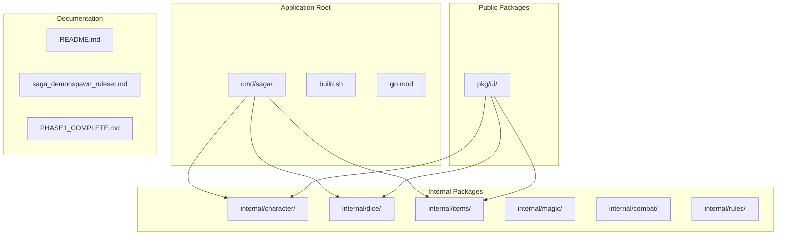
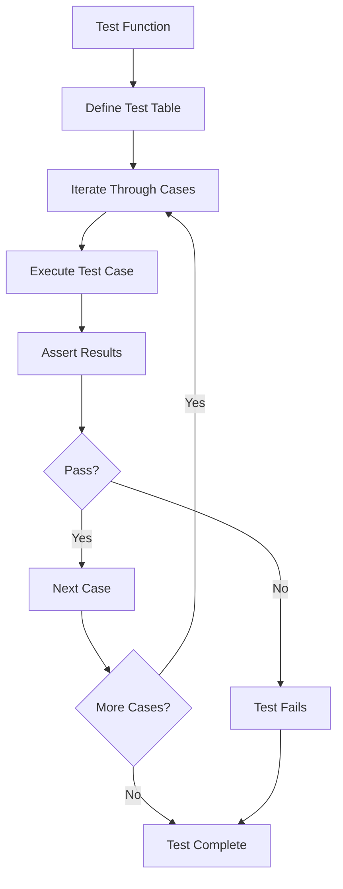
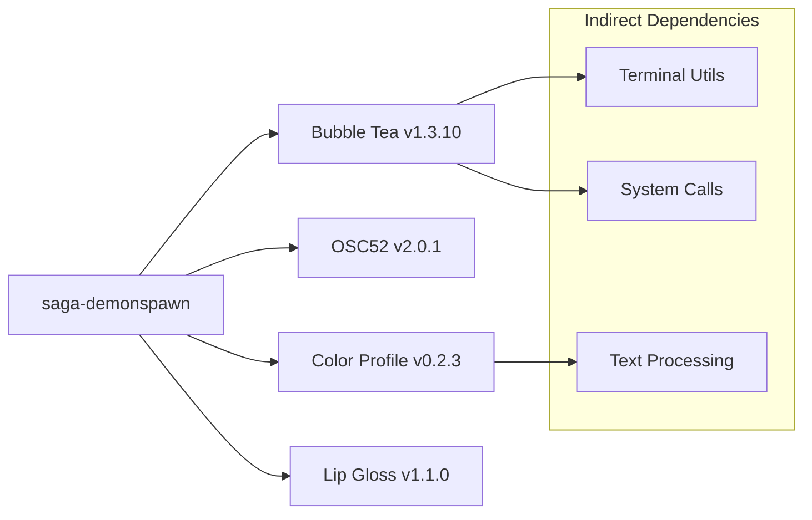
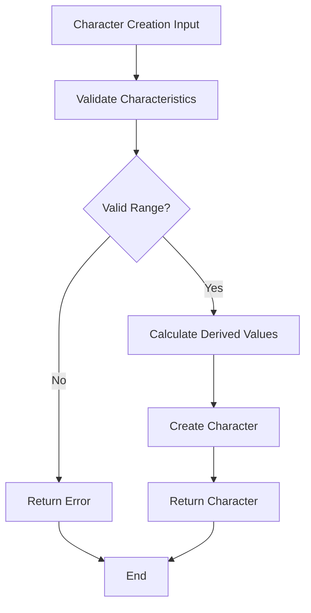
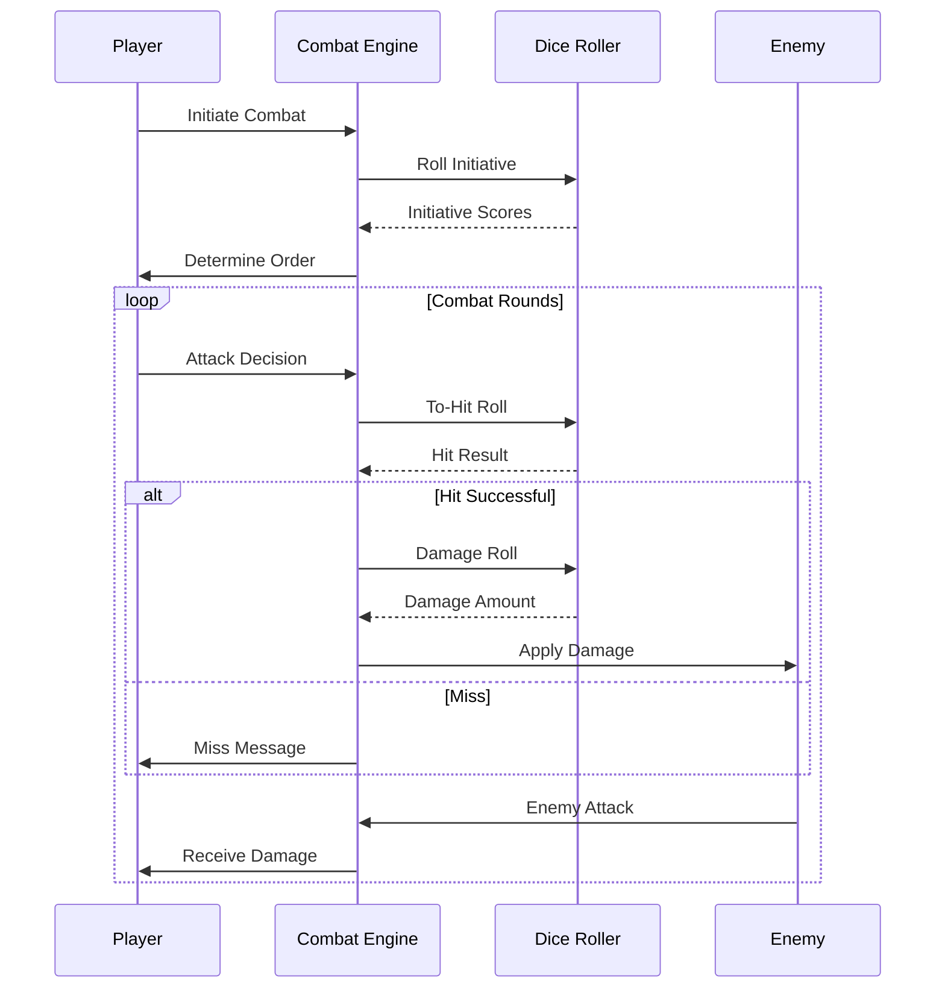
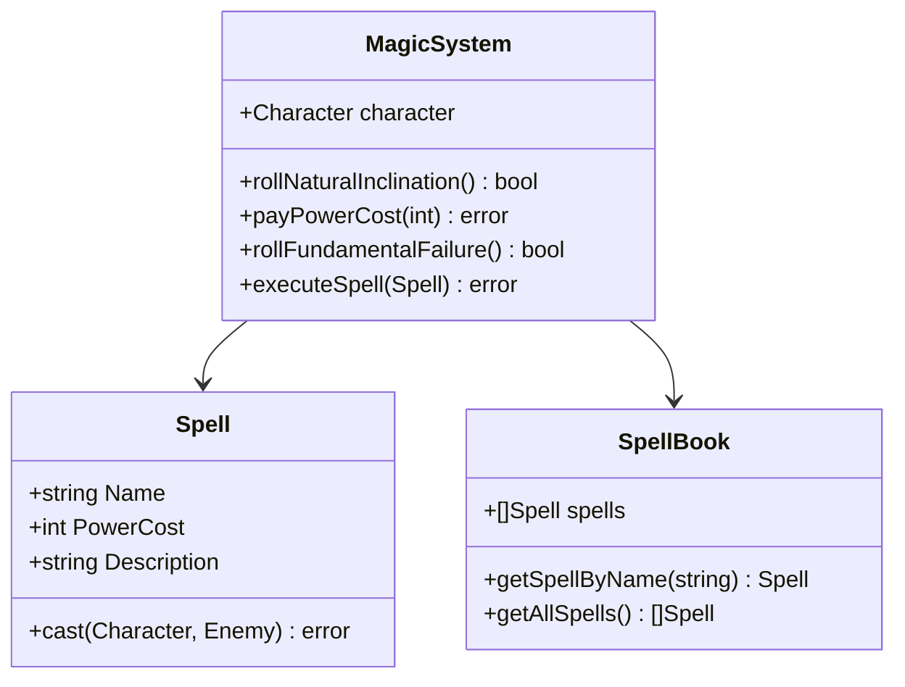
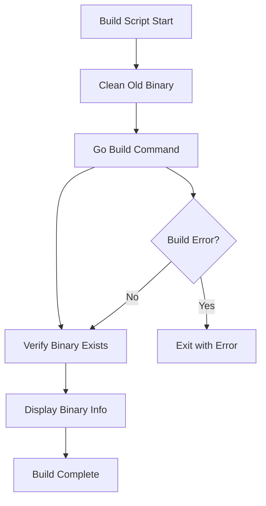

# Development Guide

<cite>
**Referenced Files in This Document**
- [README.md](file://README.md)
- [go.mod](file://go.mod)
- [build.sh](file://build.sh)
- [internal/dice/dice.go](file://internal/dice/dice.go)
- [internal/dice/dice_test.go](file://internal/dice/dice_test.go)
- [internal/character/character.go](file://internal/character/character.go)
- [internal/items/items.go](file://internal/items/items.go)
- [pkg/ui/model.go](file://pkg/ui/model.go)
- [pkg/ui/main_menu.go](file://pkg/ui/main_menu.go)
- [pkg/ui/character_creation.go](file://pkg/ui/character_creation.go)
- [pkg/ui/update.go](file://pkg/ui/update.go)
- [saga_demonspawn_ruleset.md](file://saga_demonspawn_ruleset.md)
</cite>

## Table of Contents
1. [Introduction](#introduction)
2. [Project Structure](#project-structure)
3. [Testing Strategy](#testing-strategy)
4. [Dependency Management](#dependency-management)
5. [Coding Standards and Best Practices](#coding-standards-and-best-practices)
6. [Extending the Application](#extending-the-application)
7. [Build Process and CI](#build-process-and-ci)
8. [Contributing Guidelines](#contributing-guidelines)
9. [Troubleshooting](#troubleshooting)

## Introduction

The saga-demonspawn project is a command-line companion application for the "Sagas of the Demonspawn" gamebook, built with Go and the Bubble Tea framework. This development guide provides comprehensive instructions for contributing to the project, covering everything from setting up your development environment to extending the application with new features.

The project follows Go best practices and demonstrates modern Go development patterns including proper package organization, testing strategies, and idiomatic code structure. It serves as both a functional game companion and an educational resource for Go developers.

## Project Structure

The saga-demonspawn project follows a well-defined structure that separates internal implementation details from public APIs, promoting clean architecture and maintainability.



**Diagram sources**
- [go.mod](file://go.mod#L1-L28)
- [README.md](file://README.md#L71-L85)

### Directory Conventions

The project strictly adheres to Go's package organization conventions:

#### Internal Packages (`internal/`)
Internal packages contain private implementation details that should not be exposed to external consumers. These packages form the core business logic:

- **`internal/character/`**: Character state management, stat calculations, and persistence
- **`internal/dice/`**: Random number generation with deterministic seeding for testing
- **`internal/items/`**: Item system including weapons, armor, and special items
- **`internal/magic/`**: Spell casting system and magic mechanics (Phase 4)
- **`internal/combat/`**: Combat resolution engine (Phase 2)
- **`internal/rules/`**: Game rules constants and configurations

#### Public Packages (`pkg/`)
Public packages provide reusable components that could potentially be used by external projects:

- **`pkg/ui/`**: Bubble Tea UI components implementing the Elm Architecture pattern

#### Documentation Files
- **`README.md`**: Project overview and usage instructions
- **`saga_demonspawn_ruleset.md`**: Complete game rules documentation
- **Phase completion files**: Development milestones and learning highlights

**Section sources**
- [README.md](file://README.md#L71-L85)
- [go.mod](file://go.mod#L1-L28)

## Testing Strategy

The saga-demonspawn project employs comprehensive testing strategies that demonstrate Go testing best practices and ensure code reliability.

### Table-Driven Tests

The project extensively uses table-driven tests, particularly in the dice package, to verify complex functionality efficiently:



**Diagram sources**
- [internal/dice/dice_test.go](file://internal/dice/dice_test.go#L102-L151)

Key testing patterns demonstrated in the codebase:

#### Interface-Based Mocking
The dice package uses interfaces to enable testable code with deterministic behavior:

- **`Roller` interface**: Abstracts random number generation
- **`StandardRoller` implementation**: Production random number generation
- **`NewSeededRoller()`**: Deterministic testing with fixed seeds

#### Comprehensive Coverage
Tests verify multiple aspects of functionality:

- **Range validation**: Ensures dice rolls produce expected value ranges
- **Determinism**: Verifies seeded rollers produce consistent results
- **Distribution**: Validates statistical distributions over large samples
- **Edge cases**: Tests boundary conditions and error scenarios

#### Benchmarking
Performance testing ensures critical functions maintain acceptable speed:

- **BenchmarkRoll2D6**: Measures dice roll performance
- **BenchmarkRollCharacteristic**: Tests characteristic roll efficiency

**Section sources**
- [internal/dice/dice_test.go](file://internal/dice/dice_test.go#L1-L152)
- [internal/dice/dice.go](file://internal/dice/dice.go#L11-L26)

### Running Tests

The project provides multiple testing approaches:

#### Basic Test Execution
```bash
# Run all tests in the project
go test ./...

# Run tests with coverage reporting
go test -cover ./...

# Run tests for specific packages
go test ./internal/character
```

#### Advanced Testing Options
```bash
# Run tests with verbose output
go test -v ./...

# Run specific test functions
go test -run TestRoll2D6Range ./internal/dice

# Generate coverage report
go test -coverprofile=coverage.out ./...
go tool cover -html=coverage.out
```

## Dependency Management

The project uses Go modules for dependency management, ensuring reproducible builds and clear dependency tracking.

### Go Modules Configuration

The project maintains a clean dependency tree with minimal external requirements:



**Diagram sources**
- [go.mod](file://go.mod#L7-L27)

### Dependency Management Best Practices

#### Version Pinning
Dependencies are pinned to specific versions to ensure reproducible builds across environments.

#### Minimal Dependencies
The project maintains a lean dependency graph, focusing on essential functionality:
- **Bubble Tea**: Terminal UI framework
- **Standard Library**: Core Go functionality
- **Minimal third-party**: Only essential utilities

#### Regular Updates
Dependency updates are managed systematically to maintain security and compatibility.

**Section sources**
- [go.mod](file://go.mod#L1-L28)

## Coding Standards and Best Practices

The saga-demonspawn project demonstrates several Go coding standards and best practices that contribute to maintainable, readable, and efficient code.

### Error Handling Patterns

The project consistently uses Go's error handling patterns:

#### Validation and Early Returns
Character creation demonstrates robust input validation:



**Diagram sources**
- [internal/character/character.go](file://internal/character/character.go#L46-L99)

#### Error Wrapping
Errors are wrapped with context for better debugging:

```go
// Example from character saving
return fmt.Errorf("failed to write save file: %w", err)
```

### Documentation Comments

The project maintains comprehensive documentation using Go's comment conventions:

#### Package Documentation
Each package includes descriptive comments explaining its purpose and usage.

#### Function Documentation
Functions are documented with clear descriptions of parameters, return values, and behavior.

#### Example Usage
Test files often include examples demonstrating proper usage patterns.

### Struct Design and Methods

Character structs demonstrate effective Go struct design:

#### Embedded Types
Related functionality is grouped into logical units.

#### Method Receivers
Methods operate on receivers that match their intended usage patterns.

#### Zero Values
Structs are designed to have sensible zero values for easy initialization.

### Interface-Based Polymorphism

The dice package exemplifies interface-based design:

#### Abstraction
Interfaces define behavior without exposing implementation details.

#### Testability
Mock implementations enable comprehensive testing of dependent code.

#### Flexibility
Multiple implementations can coexist, enabling runtime switching.

**Section sources**
- [internal/character/character.go](file://internal/character/character.go#L14-L355)
- [internal/dice/dice.go](file://internal/dice/dice.go#L1-L97)

## Extending the Application

The saga-demonspawn project is designed for extensibility, with clear pathways for adding new features while maintaining code quality and architectural integrity.

### Adding New Features

#### Combat System (Phase 2)
The combat system is planned for Phase 2 development:



**Diagram sources**
- [saga_demonspawn_ruleset.md](file://saga_demonspawn_ruleset.md#L19-L63)
- [pkg/ui/update.go](file://pkg/ui/update.go#L197-L199)

#### Magic System (Phase 4)
The magic system introduces complex spellcasting mechanics:

##### Spell Implementation Pattern


**Diagram sources**
- [saga_demonspawn_ruleset.md](file://saga_demonspawn_ruleset.md#L90-L131)

#### Inventory System (Phase 3)
The inventory system will manage equipment and consumables:

##### Item Categories
- **Weapons**: Melee and ranged weapons with damage bonuses
- **Armor**: Protection against physical damage
- **Shields**: Additional defensive capabilities
- **Special Items**: Unique items with custom mechanics (Healing Stone, Doombringer, The Orb)

### Extension Guidelines

#### Maintain Package Boundaries
- Use internal packages for core game logic
- Expose UI components through public packages
- Preserve encapsulation of internal implementations

#### Follow Established Patterns
- Use interfaces for testable abstractions
- Implement comprehensive validation
- Provide clear error messages
- Document public APIs thoroughly

#### Ensure Test Coverage
- Write unit tests for new functionality
- Use table-driven tests for complex logic
- Implement integration tests for user workflows
- Maintain high coverage percentages

**Section sources**
- [saga_demonspawn_ruleset.md](file://saga_demonspawn_ruleset.md#L1-L170)
- [internal/items/items.go](file://internal/items/items.go#L1-L257)

## Build Process and CI

The project includes automated build processes and continuous integration considerations to ensure reliable development workflows.

### Build Script

The project provides a simple yet effective build script:



**Diagram sources**
- [build.sh](file://build.sh#L1-L15)

### Build Commands

#### Standard Build
```bash
# Build for current platform
go build -o saga ./cmd/saga

# Build with optimizations
go build -ldflags="-s -w" -o saga ./cmd/saga
```

#### Cross-Platform Builds
```bash
# Build for Windows
GOOS=windows GOARCH=amd64 go build -o saga.exe ./cmd/saga

# Build for Linux ARM
GOOS=linux GOARCH=arm64 go build -o saga-linux-arm64 ./cmd/saga
```

### Continuous Integration Considerations

#### Automated Testing
CI systems should run:
- Full test suite with coverage reporting
- Linting with golangci-lint
- Security scanning with gosec
- Dependency vulnerability checking

#### Build Verification
CI should verify:
- Successful compilation across target platforms
- Binary size optimization
- Proper dependency locking

#### Quality Gates
Automated quality gates should prevent:
- Code with failing tests
- Insufficient coverage
- Security vulnerabilities
- Breaking changes to public APIs

**Section sources**
- [build.sh](file://build.sh#L1-L15)

## Contributing Guidelines

Contributing to saga-demonspawn requires understanding both the technical architecture and the project's educational goals.

### Getting Started

#### Development Environment Setup
1. Clone the repository
2. Install Go 1.24.0 or later
3. Verify dependencies with `go mod tidy`
4. Run tests to ensure proper setup

#### Code Review Process
All contributions should:
- Pass existing tests
- Maintain or improve code coverage
- Follow established coding standards
- Include appropriate documentation
- Add tests for new functionality

### Contribution Types

#### Bug Fixes
- Reproduce the issue with tests
- Provide minimal, focused fixes
- Update documentation if affected

#### Feature Additions
- Discuss proposed features in issues first
- Follow established architectural patterns
- Provide comprehensive testing
- Update relevant documentation

#### Documentation Improvements
- Clarify complex concepts
- Update outdated information
- Add examples and tutorials
- Improve accessibility

### Code Quality Standards

#### Testing Requirements
- All new code must include tests
- Test coverage should remain high
- Edge cases must be considered
- Performance implications evaluated

#### Documentation Standards
- Public APIs must be documented
- Complex algorithms require explanations
- Usage examples helpful for users
- Architecture decisions explained

#### Performance Considerations
- Avoid unnecessary allocations
- Consider memory usage patterns
- Benchmark critical paths
- Optimize hot code paths

**Section sources**
- [README.md](file://README.md#L143-L179)

## Troubleshooting

Common issues and their solutions when working with the saga-demonspawn project.

### Build Issues

#### Go Version Compatibility
Ensure you're using Go 1.24.0 or later as specified in go.mod.

#### Dependency Problems
```bash
# Clean and reinstall dependencies
go clean -modcache
go mod tidy
go mod download
```

#### Platform-Specific Issues
Some terminal features may not work on all platforms. Test on multiple systems if possible.

### Testing Problems

#### Test Failures
- Check test output for specific error messages
- Verify input data ranges and constraints
- Ensure deterministic seeding for seeded tests

#### Coverage Issues
- Review uncovered code paths
- Add tests for edge cases
- Consider integration test scenarios

### Runtime Issues

#### Character Loading Problems
- Verify JSON file format and permissions
- Check file paths and directory structure
- Ensure proper character data validation

#### UI Navigation Issues
- Test keyboard input handling
- Verify terminal size detection
- Check screen transitions and state management

### Performance Issues

#### Slow Dice Rolls
- Profile critical paths with benchmarks
- Consider algorithmic improvements
- Evaluate memory allocation patterns

#### Memory Usage
- Monitor garbage collection impact
- Optimize data structures
- Reduce allocations in hot paths

**Section sources**
- [internal/dice/dice_test.go](file://internal/dice/dice_test.go#L1-L152)
- [pkg/ui/update.go](file://pkg/ui/update.go#L1-L329)