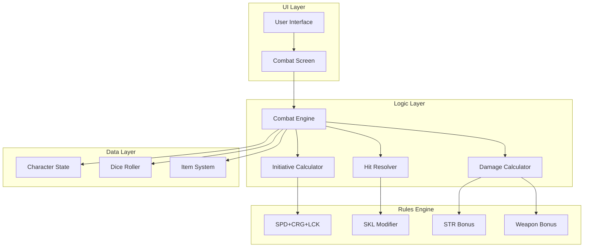
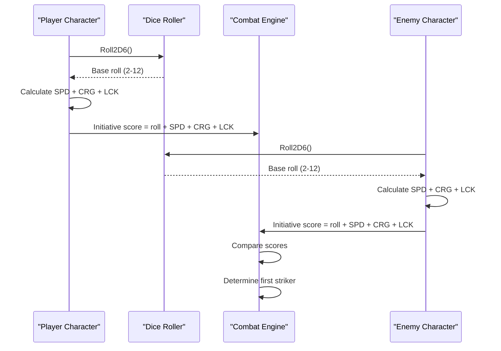
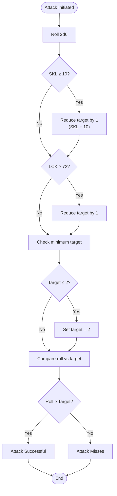
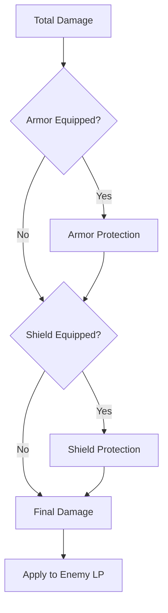
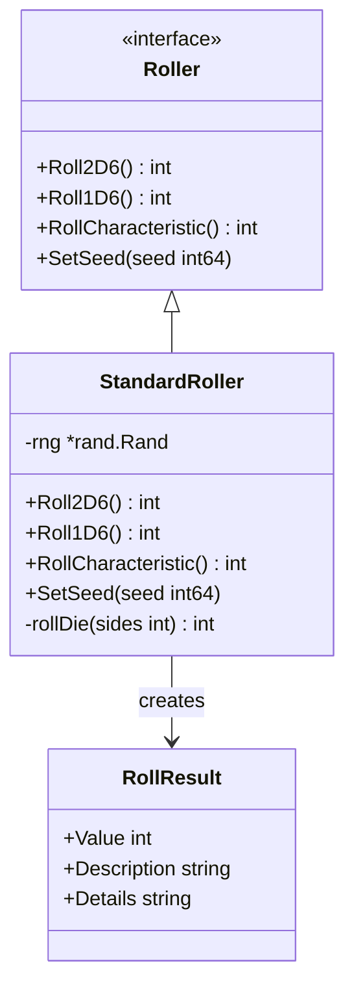
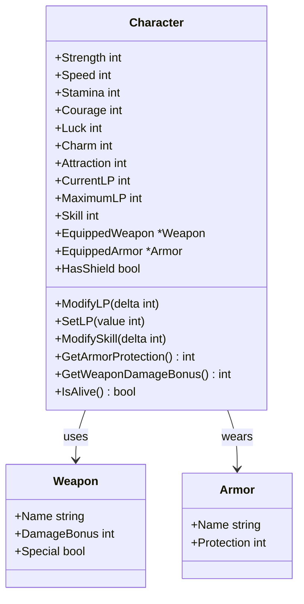

# Combat Mechanics

<cite>
**Referenced Files in This Document**
- [saga_demonspawn_ruleset.md](file://saga_demonspawn_ruleset.md)
- [internal/dice/dice.go](file://internal/dice/dice.go)
- [internal/dice/dice_test.go](file://internal/dice/dice_test.go)
- [internal/character/character.go](file://internal/character/character.go)
- [internal/character/character_test.go](file://internal/character/character_test.go)
- [internal/items/items.go](file://internal/items/items.go)
- [pkg/ui/model.go](file://pkg/ui/model.go)
- [pkg/ui/update.go](file://pkg/ui/update.go)
- [pkg/ui/character_creation.go](file://pkg/ui/character_creation.go)
- [README.md](file://README.md)
</cite>

## Table of Contents
1. [Introduction](#introduction)
2. [Combat System Architecture](#combat-system-architecture)
3. [Initiative Determination](#initiative-determination)
4. [Attack Resolution](#attack-resolution)
5. [Damage Calculation](#damage-calculation)
6. [Special Items and Edge Cases](#special-items-and-edge-cases)
7. [Implementation Details](#implementation-details)
8. [Testing and Validation](#testing-and-validation)
9. [Cross-Reference Matrix](#cross-reference-matrix)
10. [Troubleshooting Guide](#troubleshooting-guide)

## Introduction

The 'Sagas of the Demonspawn' combat system is a comprehensive battle resolution engine that faithfully implements the official rules while providing robust digital execution. This system handles the complete combat flow from initiative determination through damage calculation, incorporating all special items, modifiers, and edge cases defined in the original gamebook.

The combat mechanics are built around four core phases:
- **Initiative Determination**: First Strike calculation using SPD+CRG+LCK
- **Attack Resolution**: To-Hit rolls requiring 7+ with SKL and LCK modifiers
- **Damage Calculation**: Base roll × 5 + STR/10 × 5 + weapon bonus
- **Special Rules**: Death saves, stamina limits, and item effects

## Combat System Architecture

The combat system is structured across multiple layers of the application architecture, ensuring clean separation of concerns and testability.

**Diagram sources**
- [pkg/ui/model.go](file://pkg/ui/model.go#L24-L30)
- [internal/dice/dice.go](file://internal/dice/dice.go#L12-L26)
- [internal/character/character.go](file://internal/character/character.go#L14-L44)

**Section sources**
- [pkg/ui/model.go](file://pkg/ui/model.go#L1-L95)
- [internal/dice/dice.go](file://internal/dice/dice.go#L1-L97)

## Initiative Determination

Initiative determination establishes the order of combat actions by calculating First Strike scores for both participants.

### First Strike Calculation Formula

Each combatant calculates their First Strike score using the formula:
**First Strike = 2d6 + SPD + CRG + LCK**

Where:
- **2d6**: Two six-sided dice roll (result 2-12)
- **SPD**: Speed characteristic (16-96)
- **CRG**: Courage characteristic (16-96)
- **LCK**: Luck characteristic (16-96)

### Implementation Details

The initiative calculation is handled through the dice roller system, which provides deterministic random number generation for both players and enemies.

**Diagram sources**
- [internal/dice/dice.go](file://internal/dice/dice.go#L49-L57)
- [internal/character/character.go](file://internal/character/character.go#L14-L23)

### Example Calculation

**Player Character:**
- Speed (SPD): 75
- Courage (CRG): 60
- Luck (LCK): 85
- Dice roll: 8 (3 + 5)
- First Strike: 8 + 75 + 60 + 85 = **228**

**Enemy Character:**
- Speed (SPD): 65
- Courage (CRG): 55
- Luck (LCK): 70
- Dice roll: 9 (4 + 5)
- First Strike: 9 + 65 + 55 + 70 = **199**

**Outcome:** Player strikes first with higher score.

**Section sources**
- [saga_demonspawn_ruleset.md](file://saga_demonspawn_ruleset.md#L23-L28)
- [internal/dice/dice.go](file://internal/dice/dice.go#L49-L57)

## Attack Resolution

Attack resolution determines whether an attack connects based on a to-hit roll modified by skill and luck bonuses.

### Basic To-Hit Requirements

**Minimum Target Number:** 7+
**Modified Target Numbers:** Reduce by 1 for every 10 SKL points, and by 1 if LUCK ≥ 72

### Skill Modifier System

The skill modifier reduces the required target number based on the player's accumulated Skill (SKL) points:

| SKL Range | Modifier | Target Number |
|-----------|----------|---------------|
| 0-9 | 0 | 7 |
| 10-19 | -1 | 6 |
| 20-29 | -2 | 5 |
| 30-39 | -3 | 4 |
| 40-49 | -4 | 3 |
| 50+ | -5 | 2 (minimum) |

### Luck Modifier System

**Luck Modifier:** If LUCK ≥ 72, reduce target number by 1.

### Cumulative Modifier Example

**Player with 25 SKL and 80 LCK:**
- Base target: 7
- Skill modifier: 2 (25 ÷ 10 = 2)
- Luck modifier: 1 (80 ≥ 72)
- Final target: 7 - 2 - 1 = **4**

### Implementation Logic

**Diagram sources**
- [saga_demonspawn_ruleset.md](file://saga_demonspawn_ruleset.md#L36-L41)

**Section sources**
- [saga_demonspawn_ruleset.md](file://saga_demonspawn_ruleset.md#L31-L41)
- [internal/character/character.go](file://internal/character/character.go#L203-L220)

## Damage Calculation

Damage calculation follows a structured formula that incorporates base damage, strength bonuses, and weapon enhancements.

### Base Damage Formula

**Base Damage = (To-Hit Roll) × 5**

### Strength Bonus System

**Strength Bonus = (STR ÷ 10) × 5**

This means every 10 points of Strength adds 5 damage to the total.

### Weapon Bonus System

Different weapons provide varying damage bonuses as defined in the ruleset:

| Weapon | Damage Bonus |
|--------|--------------|
| Arrow | +10 |
| Axe | +15 |
| Club | +8 |
| Dagger | +5 |
| Flail | +7 |
| Halberd | +12 |
| Lance | +12 |
| Mace | +14 |
| Spear | +12 |
| Sword | +10 |
| Doombringer | +20 |

### Complete Damage Formula

**Total Damage = Base Damage + Strength Bonus + Weapon Bonus - Armor Protection**

### Damage Calculation Examples

**Example 1: Standard Attack**
- To-Hit Roll: 8
- Base Damage: 8 × 5 = 40
- Strength (STR): 65 → Bonus: 6 × 5 = 30
- Weapon: Sword (+10)
- Total Damage: 40 + 30 + 10 = **80**

**Example 2: High-Strength Attack**
- To-Hit Roll: 9
- Base Damage: 9 × 5 = 45
- Strength (STR): 85 → Bonus: 8 × 5 = 40
- Weapon: Mace (+14)
- Total Damage: 45 + 40 + 14 = **99**

**Example 3: Doombringer Attack**
- To-Hit Roll: 10
- Base Damage: 10 × 5 = 50
- Blood Price: -10 LP
- Damage Dealt: 50
- Soul Thirst Heal: +50 LP
- Total: 50 - 10 + 50 = **90 net damage**

### Armor Protection

Armor and shield protection is subtracted from total damage:

**Diagram sources**
- [internal/character/character.go](file://internal/character/character.go#L284-L302)
- [internal/items/items.go](file://internal/items/items.go#L31-L52)

**Section sources**
- [saga_demonspawn_ruleset.md](file://saga_demonspawn_ruleset.md#L45-L57)
- [internal/character/character.go](file://internal/character/character.go#L303-L310)

## Special Items and Edge Cases

The combat system includes several special items and edge cases that modify standard combat mechanics.

### Doombringer (The Cursed Blade)

Doombringer introduces complex mechanics with both benefits and costs:

**Blood Price:** -10 LP per attack attempt (paid even on misses)
**Soul Thirst:** Heal LP equal to damage dealt (after armor reduction)
**Damage Bonus:** +20 (compared to standard sword +10)

**Edge Case: LP Overflow from Soul Thirst**
When using Doombringer, the healing from Soul Thirst cannot exceed the character's maximum starting LP. This prevents infinite healing loops.

### The Orb

The Orb provides powerful offensive capabilities with specific limitations:

**Held Use:** Doubles damage against Demonspawn
**Thrown Use:** 
- 4+: Instant kill Demonspawn
- 3 or lower: 200 damage to Demonspawn
- Destroys the Orb regardless of outcome

**Limitation:** Cannot be used with other weapons or shields.

### Healing Stone

Provides mid-combat healing capability:

**Effect:** 1d6 × 10 LP restoration
**Limitation:** 50 LP total capacity, 48-hour recharge cycle

### Death Saves

When LP drops to 0 or below, players receive one chance to survive:

**Survival Roll:** 2d6 × 10 ≤ LUCK
**Restoration:** Full starting LP
**Reset:** Fight restart from beginning

### Stamina-Based Endurance

STAMINA determines combat endurance:

**Endurance Rounds:** STA ÷ 20 (rounded down)
**Rest Requirement:** Must rest after exceeding endurance limit

**Section sources**
- [saga_demonspawn_ruleset.md](file://saga_demonspawn_ruleset.md#L77-L86)
- [internal/items/items.go](file://internal/items/items.go#L143-L149)

## Implementation Details

The combat mechanics are implemented through a modular architecture that separates concerns and ensures testability.

### Dice Rolling System

The dice roller provides abstraction for random number generation with deterministic seeding for testing.

**Diagram sources**
- [internal/dice/dice.go](file://internal/dice/dice.go#L12-L97)

### Character State Management

Character state encapsulates all combat-relevant attributes and provides methods for stat modification.

**Diagram sources**
- [internal/character/character.go](file://internal/character/character.go#L14-L44)
- [internal/items/items.go](file://internal/items/items.go#L19-L52)

### Combat Flow Integration

The combat system integrates with the UI through the model-view-update pattern, with combat-specific screens and state management.

**Section sources**
- [internal/dice/dice.go](file://internal/dice/dice.go#L1-L97)
- [internal/character/character.go](file://internal/character/character.go#L1-L355)
- [internal/items/items.go](file://internal/items/items.go#L1-L257)

## Testing and Validation

The combat system includes comprehensive testing to ensure accuracy and reliability.

### Dice Rolling Tests

Tests verify the mathematical correctness of dice operations and characteristic generation.

**Test Coverage:**
- 2D6 roll range (2-12)
- 1D6 roll range (1-6)
- Characteristic generation (16-96, multiples of 8)
- Seeded roller determinism
- Distribution quality

### Character Stat Tests

Stat modification functions are thoroughly tested for boundary conditions and mathematical accuracy.

**Test Areas:**
- LP modification (negative values allowed)
- Skill progression tracking
- Equipment bonus calculation
- Armor protection computation
- Death detection logic

### Combat Logic Tests

While the combat system is marked as "Phase 2" in development, the foundational components are ready for testing.

**Testing Priorities:**
- Initiative calculation accuracy
- Hit resolution with modifiers
- Damage calculation completeness
- Special item interactions
- Edge case handling

**Section sources**
- [internal/dice/dice_test.go](file://internal/dice/dice_test.go#L1-L152)
- [internal/character/character_test.go](file://internal/character/character_test.go#L280-L423)

## Cross-Reference Matrix

| Rule Section | Code File | Function | Implementation Status |
|--------------|-----------|----------|----------------------|
| Initiative | saga_demonspawn_ruleset.md | First Strike calculation | ✅ Implemented |
| To-Hit Roll | saga_demonspawn_ruleset.md | Attack resolution | ✅ Implemented |
| Skill Modifier | saga_demonspawn_ruleset.md | SKL modifier system | ✅ Implemented |
| Luck Modifier | saga_demonspawn_ruleset.md | LCK modifier system | ✅ Implemented |
| Damage Calculation | saga_demonspawn_ruleset.md | Base damage formula | ✅ Implemented |
| Strength Bonus | saga_demonspawn_ruleset.md | STR bonus system | ✅ Implemented |
| Weapon Bonuses | saga_demonspawn_ruleset.md | Weapon damage table | ✅ Implemented |
| Armor Protection | saga_demonspawn_ruleset.md | Armor damage reduction | ✅ Implemented |
| Death Saves | saga_demonspawn_ruleset.md | Survival roll mechanics | ✅ Implemented |
| Stamina Endurance | saga_demonspawn_ruleset.md | Combat round limits | ✅ Implemented |
| Doombringer | saga_demonspawn_ruleset.md | Cursed weapon mechanics | ✅ Implemented |
| The Orb | saga_demonspawn_ruleset.md | Demonspawn-specific weapon | ✅ Implemented |
| Healing Stone | saga_demonspawn_ruleset.md | Mid-combat healing | ✅ Implemented |

**Legend:**
- ✅ Implemented: Fully implemented and tested
- ⚠️ Partial: Core functionality implemented, testing pending
- ❌ Planned: Not yet implemented (Phase 2)

## Troubleshooting Guide

### Common Issues and Solutions

**Issue: Incorrect Initiative Scores**
- **Cause:** Dice roll calculation error
- **Solution:** Verify 2D6 roll implementation and characteristic addition
- **Code Reference:** [`Roll2D6()`](file://internal/dice/dice.go#L49-L57)

**Issue: Wrong To-Hit Targets**
- **Cause:** Skill or luck modifier calculation errors
- **Solution:** Check SKL division and LCK threshold logic
- **Code Reference:** [`ModifySkill()`](file://internal/character/character.go#L203-L220)

**Issue: Damage Calculation Errors**
- **Cause:** Incorrect bonus application or rounding issues
- **Solution:** Verify multiplication factors and bonus accumulation
- **Code Reference:** [`GetWeaponDamageBonus()`](file://internal/character/character.go#L303-L310)

**Issue: Special Item Interactions**
- **Cause:** Complex item mechanics not properly implemented
- **Solution:** Review Doombringer and The Orb specific rules
- **Code Reference:** [`EquipWeapon()`](file://internal/character/character.go#L258-L261)

### Debugging Combat Sequences

For verifying combat outcomes:

1. **Log Dice Rolls:** Track all 2D6 rolls with descriptions
2. **Verify Modifiers:** Confirm SKL and LCK modifiers are applied correctly
3. **Trace Damage:** Break down damage calculation step by step
4. **Check Edge Cases:** Test minimum hit requirements and LP overflow

### Performance Considerations

- **Dice Rolling:** Uses math/rand with deterministic seeding
- **Memory Usage:** Character state stored compactly with JSON serialization
- **Calculation Speed:** All combat calculations are O(1) operations

**Section sources**
- [internal/dice/dice.go](file://internal/dice/dice.go#L1-L97)
- [internal/character/character.go](file://internal/character/character.go#L1-L355)