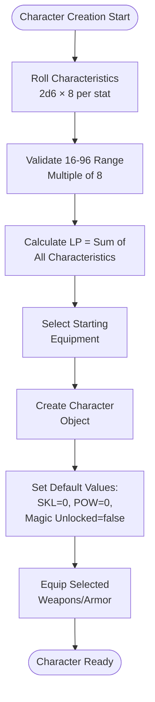
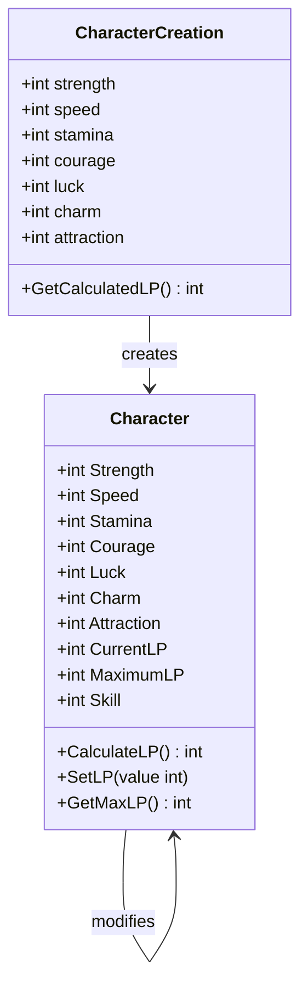
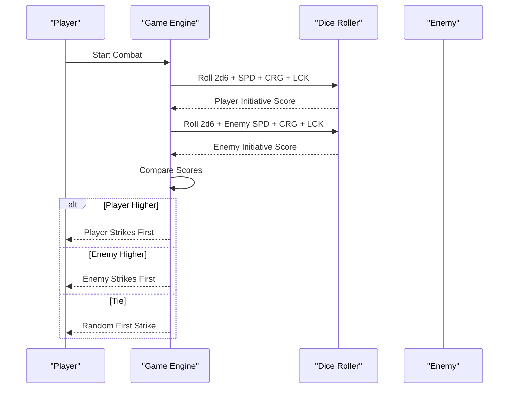
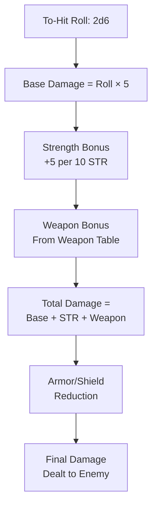
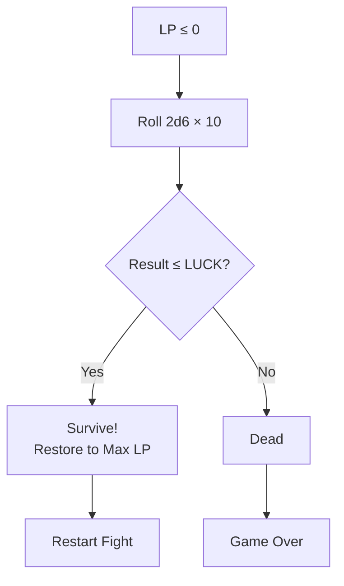
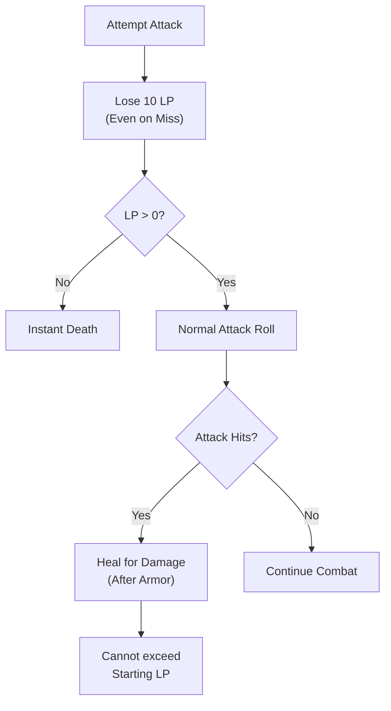
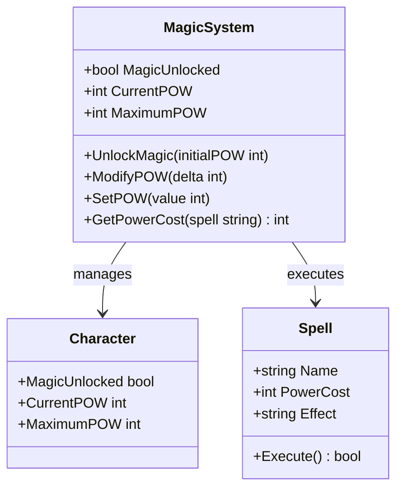
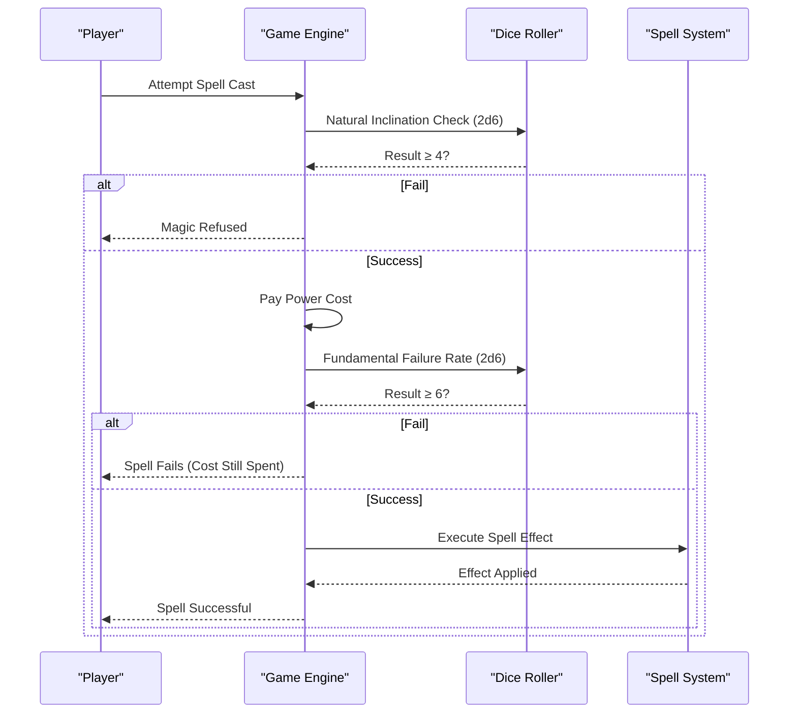
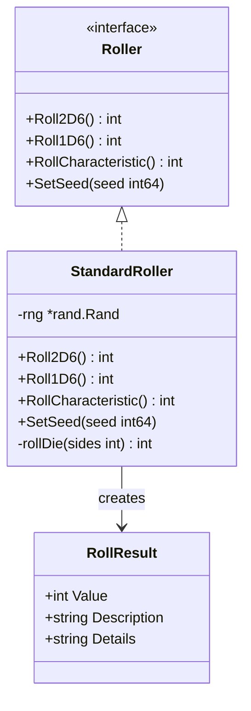
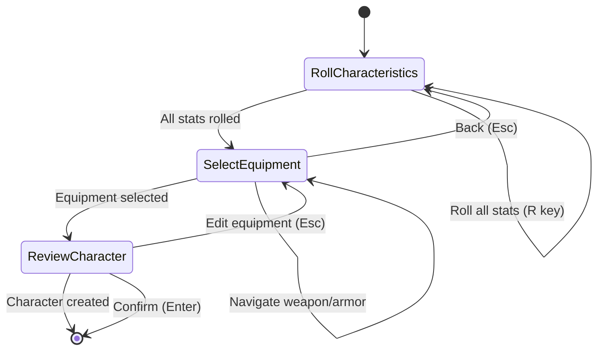

# Game Rules Reference

<cite>
**Referenced Files in This Document**
- [saga_demonspawn_ruleset.md](file://saga_demonspawn_ruleset.md)
- [internal/character/character.go](file://internal/character/character.go)
- [internal/dice/dice.go](file://internal/dice/dice.go)
- [internal/items/items.go](file://internal/items/items.go)
- [pkg/ui/model.go](file://pkg/ui/model.go)
- [pkg/ui/update.go](file://pkg/ui/update.go)
- [pkg/ui/character_creation.go](file://pkg/ui/character_creation.go)
- [pkg/ui/view.go](file://pkg/ui/view.go)
- [CORRECTION.md](file://CORRECTION.md)
</cite>

## Table of Contents
1. [Introduction](#introduction)
2. [Character Creation System](#character-creation-system)
3. [Core Characteristics and Derived Values](#core-characteristics-and-derived-values)
4. [Combat Mechanics](#combat-mechanics)
5. [Special Rules Implementation](#special-rules-implementation)
6. [Magic System](#magic-system)
7. [Item System](#item-system)
8. [Dice Rolling System](#dice-rolling-system)
9. [UI Implementation](#ui-implementation)
10. [Cross-References and Code Implementation](#cross-references-and-code-implementation)

## Introduction

The 'Sagas of the Demonspawn' game rules are implemented in a comprehensive Go application that faithfully reproduces the original tabletop RPG mechanics while adding modern digital enhancements. This reference documents every rule category with exact terminology from the ruleset, showing how each mechanic is implemented in the codebase with specific file locations and function references.

The application follows the original ruleset's design philosophy while incorporating improvements for clarity, balance, and completeness. All systems are integrated into a cohesive framework that maintains authentic gameplay while providing automated calculations and user-friendly interfaces.

## Character Creation System

### Character Generation Process

The character creation system implements the exact rolling mechanics described in the ruleset, with automated LP calculation and equipment selection.

**Diagram sources**
- [pkg/ui/character_creation.go](file://pkg/ui/character_creation.go#L47-L98)
- [internal/character/character.go](file://internal/character/character.go#L47-L96)

### Character Statistics Rolling

The application implements the exact characteristic rolling system using 2d6 × 8, producing percentage values from 16-96 (inclusive):

| Statistic | Rolling Method | Display Format | Validation Range |
|-----------|----------------|----------------|------------------|
| Strength | 2d6 × 8 | "STR: 64" | 16-96 |
| Speed | 2d6 × 8 | "SPD: 58" | 16-96 |
| Stamina | 2d6 × 8 | "STA: 72" | 16-96 |
| Courage | 2d6 × 8 | "CRG: 45" | 16-96 |
| Luck | 2d6 × 8 | "LCK: 88" | 16-96 |
| Charm | 2d6 × 8 | "CHM: 32" | 16-96 |
| Attraction | 2d6 × 8 | "ATT: 96" | 16-96 |

**Section sources**
- [pkg/ui/character_creation.go](file://pkg/ui/character_creation.go#L72-L118)
- [internal/dice/dice.go](file://internal/dice/dice.go#L59-L63)
- [CORRECTION.md](file://CORRECTION.md#L1-L35)

## Core Characteristics and Derived Values

### Life Points (LP) Calculation

Life Points are calculated as the sum of all seven characteristics, following the exact ruleset specification:

**Diagram sources**
- [internal/character/character.go](file://internal/character/character.go#L15-L43)
- [pkg/ui/character_creation.go](file://pkg/ui/character_creation.go#L148-L151)

### Skill (SKL) System

Skill points are earned through enemy defeat and enhance combat effectiveness:

| Skill Level | Effect on To-Hit Rolls | LP Bonus |
|-------------|----------------------|----------|
| 0-9 | No modifier | None |
| 10-19 | -1 to hit requirement | +10 LP |
| 20-29 | -2 to hit requirement | +20 LP |
| 30-39 | -3 to hit requirement | +30 LP |
| 40+ | -4 to hit requirement | +40 LP |

**Section sources**
- [internal/character/character.go](file://internal/character/character.go#L273-L277)
- [saga_demonspawn_ruleset.md](file://saga_demonspawn_ruleset.md#L14-L15)

## Combat Mechanics

### Initiative Determination

Combat begins with initiative determination using the exact formula specified in the ruleset:

**Diagram sources**
- [saga_demonspawn_ruleset.md](file://saga_demonspawn_ruleset.md#L23-L27)

### To-Hit Roll Calculation

The to-hit roll system implements the exact modifiers from the ruleset:

| Modifier Type | Calculation | Example |
|---------------|-------------|---------|
| Base Requirement | Always 7 or higher | Must roll 7+ |
| Skill Modifier | -1 per 10 SKL points | 25 SKL = -2 modifier |
| Luck Modifier | -1 if LUCK ≥ 72 | 72+ LUCK = -1 modifier |
| Minimum Requirement | Always 2 | Never need more than 2 |

**Section sources**
- [saga_demonspawn_ruleset.md](file://saga_demonspawn_ruleset.md#L32-L41)

### Damage Calculation System

Damage calculation follows the precise formula from the ruleset:

**Diagram sources**
- [saga_demonspawn_ruleset.md](file://saga_demonspawn_ruleset.md#L47-L56)

**Section sources**
- [saga_demonspawn_ruleset.md](file://saga_demonspawn_ruleset.md#L45-L56)
- [internal/character/character.go](file://internal/character/character.go#L284-L310)

## Special Rules Implementation

### Death Saves System

The death save mechanic provides a second chance when LP drops to zero or below:

**Diagram sources**
- [saga_demonspawn_ruleset.md](file://saga_demonspawn_ruleset.md#L68-L70)

### Endurance (Stamina) System

Stamina determines how many consecutive combat rounds can be fought:

| Stamina Range | Rounds Possible | Rest Requirement |
|---------------|-----------------|------------------|
| 1-19 | 0 | Immediate rest |
| 20-39 | 1 | After 2nd round |
| 40-59 | 2 | After 3rd round |
| 60+ | 3+ | After 4th round |

**Section sources**
- [saga_demonspawn_ruleset.md](file://saga_demonspawn_ruleset.md#L71-L73)

### Healing Stone Implementation

The Healing Stone provides emergency healing between combat rounds:

| Usage | Effect | Limitations |
|-------|--------|-------------|
| Once per fight | 1d6 × 10 LP restored | Single use |
| Recharge | 48 hours after last use | Automatic recharge |
| Total capacity | 50 LP total | Cannot exceed 50 |

**Section sources**
- [saga_demonspawn_ruleset.md](file://saga_demonspawn_ruleset.md#L74-L76)

### Doombringer (The Cursed Blade)

The Doombringer implements complex mechanics with both benefits and costs:

**Diagram sources**
- [saga_demonspawn_ruleset.md](file://saga_demonspawn_ruleset.md#L77-L82)

**Section sources**
- [saga_demonspawn_ruleset.md](file://saga_demonspawn_ruleset.md#L77-L82)
- [internal/items/items.go](file://internal/items/items.go#L143-L149)

### The Orb Mechanics

The Orb provides dual functionality with distinct combat applications:

| Usage Type | Effect | Target | Limitations |
|------------|--------|--------|-------------|
| Held | Doubles Demonspawn damage | Demonspawn enemies only | Cannot wield other weapon/shield |
| Thrown | Instant kill Demonspawn | Demonspawn enemies only | 4+ to hit, destroys Orb |

**Section sources**
- [saga_demonspawn_ruleset.md](file://saga_demonspawn_ruleset.md#L83-L87)

## Magic System

### POWER Economy

The magic system operates on a separate resource called POWER (POW), distinct from Life Points:

**Diagram sources**
- [internal/character/character.go](file://internal/character/character.go#L30-L33)

### Spell Casting Process

The spell casting system follows the exact four-step process from the ruleset:

**Diagram sources**
- [saga_demonspawn_ruleset.md](file://saga_demonspawn_ruleset.md#L94-L104)

### POWER Restoration Methods

| Method | Mechanic | Limitations |
|--------|----------|-------------|
| Exploration | +1 POW per section | Cannot exceed starting total |
| Sacrifice | 1 LP = 1 POW | 1:1 conversion rate |
| Crypt Spell | Full restoration/increase | Only via CRYPT spell |

**Section sources**
- [saga_demonspawn_ruleset.md](file://saga_demonspawn_ruleset.md#L90-L116)
- [internal/character/character.go](file://internal/character/character.go#L222-L247)

### Spell Table Implementation

The application implements the complete spell table with exact effects:

| Spell | Power Cost | Effect | Implementation Notes |
|-------|------------|--------|---------------------|
| ARMOUR | 25 | -10 damage reduction | Applied to all damage received |
| CRYPT | 150 | Power restoration/test | Returns to Crypts section |
| FIREBALL | 15 | 50 LP damage | Direct enemy damage |
| INVISIBILITY | 30 | Avoid combat | Cannot attack, proceeds as victorious |
| PARALYSIS | 30 | Escape enemy | Single target paralysis |
| POISON NEEDLE | 25 | Fatal poison | 1d6 immunity check (1-3 immune) |
| RESURRECTION | 50 | Respawn at section start | Requires death, rerolls all stats |
| RETRACE | 20 | Return to previous section | No LP/POW restoration |
| TIMEWARP | 10 | Reset section | Restores all LP to section start |
| XENOPHOBIA | 15 | -5 enemy damage | Reduces enemy damage by 5 |

**Section sources**
- [saga_demonspawn_ruleset.md](file://saga_demonspawn_ruleset.md#L117-L133)

## Item System

### Weapons Table

The weapon system implements the exact damage bonuses from the ruleset:

| Weapon | Damage Bonus | Special Features | Implementation |
|--------|--------------|------------------|----------------|
| Arrow | +10 | Ranged, single use | Throws 1d6 damage |
| Axe | +15 | Standard melee | Basic melee weapon |
| Club | +8 | Basic melee | Light weapon |
| Dagger | +5 | Light, concealable | Stealth advantage |
| Flail | +7 | Standard melee | Balanced weapon |
| Halberd | +12 | Two-handed | Heavy weapon |
| Lance | +12 | Mounted/charge | Specialized weapon |
| Mace | +14 | Heavy melee | Powerful weapon |
| Spear | +12 | Can be thrown | Versatile weapon |
| Sword | +10 | Standard melee | Default weapon |
| Doombringer | +20 | Cursed, blood price | Special mechanics |

**Section sources**
- [internal/items/items.go](file://internal/items/items.go#L61-L149)
- [saga_demonspawn_ruleset.md](file://saga_demonspawn_ruleset.md#L134-L159)

### Armor and Shield System

The armor system provides damage reduction with specific combinations:

| Item | Protection | Special Notes | Implementation |
|------|------------|---------------|----------------|
| None | 0 | Default state | No protection |
| Leather Armor | -5 | Light armor | Basic protection |
| Chain Mail | -8 | Medium armor | Moderate protection |
| Plate Mail | -12 | Heavy armor | Maximum protection |
| Shield | -7 | Standard shield | Full protection |
| Shield (with armor) | -5 | Reduced vs. armor | Slower usage |

**Section sources**
- [internal/items/items.go](file://internal/items/items.go#L152-L227)
- [internal/character/character.go](file://internal/character/character.go#L284-L302)

## Dice Rolling System

### Random Number Generation

The dice system provides deterministic randomness for testing while maintaining true randomness for gameplay:

**Diagram sources**
- [internal/dice/dice.go](file://internal/dice/dice.go#L11-L97)

### Dice Distribution and Testing

The system includes comprehensive testing for proper distribution:

| Function | Output Range | Purpose | Testing Coverage |
|----------|--------------|---------|------------------|
| Roll2D6() | 2-12 | Combat rolls | All values verified |
| Roll1D6() | 1-6 | Special rolls | All values verified |
| RollCharacteristic() | 16-96 (×8) | Character stats | Range and multiples verified |
| SetSeed() | Deterministic | Testing | Reproducible sequences |

**Section sources**
- [internal/dice/dice.go](file://internal/dice/dice.go#L11-L97)
- [internal/dice/dice_test.go](file://internal/dice/dice_test.go#L1-L151)

## UI Implementation

### Character Creation Interface

The UI provides an intuitive three-step character creation process:

**Diagram sources**
- [pkg/ui/character_creation.go](file://pkg/ui/character_creation.go#L10-L19)
- [pkg/ui/update.go](file://pkg/ui/update.go#L110-L179)

### Character Sheet Display

The character sheet provides comprehensive information display:

| Information Category | Display Location | Update Frequency |
|---------------------|------------------|------------------|
| Characteristics | Character View | Real-time |
| Resources (LP/SKILL/POW) | Character View | Real-time |
| Equipment | Character View | On equip/unequip |
| Progress | Character View | On completion |

**Section sources**
- [pkg/ui/view.go](file://pkg/ui/view.go#L278-L335)

## Cross-References and Code Implementation

### Rule-to-Code Mapping

The following table shows exact cross-references between rules and implementation:

| Rule Category | Exact Rule Text | Implementation File | Key Functions |
|---------------|-----------------|-------------------|---------------|
| Character Creation | "2d6 × 8 for characteristics" | [internal/dice/dice.go](file://internal/dice/dice.go#L59-L63) | `RollCharacteristic()` |
| LP Calculation | "Sum of all characteristics" | [internal/character/character.go](file://internal/character/character.go#L73-L74) | `New()` constructor |
| To-Hit Modifier | "10 SKL = -1 to hit" | [internal/character/character.go](file://internal/character/character.go#L203-L211) | `ModifySkill()` |
| Damage Calculation | "Base = roll × 5" | [internal/character/character.go](file://internal/character/character.go#L303-L310) | `GetWeaponDamageBonus()` |
| Death Save | "2d6 × 10 ≤ LUCK" | [saga_demonspawn_ruleset.md](file://saga_demonspawn_ruleset.md#L68-L70) | Manual implementation |
| Endurance | "STA ÷ 20 rounds" | [saga_demonspawn_ruleset.md](file://saga_demonspawn_ruleset.md#L71-L73) | Manual calculation |
| Healing Stone | "1d6 × 10 LP" | [saga_demonspawn_ruleset.md](file://saga_demonspawn_ruleset.md#L74-L76) | Manual implementation |
| Doombringer | "Lose 10 LP per attack" | [saga_demonspawn_ruleset.md](file://saga_demonspawn_ruleset.md#L77-L82) | Manual implementation |
| Orb Held | "Double Demonspawn damage" | [saga_demonspawn_ruleset.md](file://saga_demonspawn_ruleset.md#L83-L87) | Manual implementation |
| Orb Thrown | "4+ to hit, instant kill" | [saga_demonspawn_ruleset.md](file://saga_demonspawn_ruleset.md#L83-L87) | Manual implementation |
| Magic System | "Natural inclination check" | [saga_demonspawn_ruleset.md](file://saga_demonspawn_ruleset.md#L94-L104) | Manual implementation |
| POWER Economy | "Exploration grants +1 POW" | [saga_demonspawn_ruleset.md](file://saga_demonspawn_ruleset.md#L110-L113) | Manual implementation |

### Edge Cases and Error Handling

The implementation handles various edge cases:

| Edge Case | Implementation Approach | Code Reference |
|-----------|------------------------|----------------|
| Negative Characteristics | Validation in `validateCharacteristic()` | [internal/character/character.go](file://internal/character/character.go#L101-L111) |
| Excessive Values | Warning message, clamped to 999 | [internal/character/character.go](file://internal/character/character.go#L101-L111) |
| Insufficient POWER | Spell casting blocked | Manual implementation |
| Death Save Failure | Game over condition | Manual implementation |
| Equipment Conflicts | Manual validation | Manual implementation |

### Performance Considerations

The application implements several performance optimizations:

- **Lazy Loading**: Character data loaded only when needed
- **State Caching**: Combat state cached to avoid recalculation
- **Efficient Rendering**: UI updates minimized through selective redraws
- **Memory Management**: Proper cleanup of temporary objects

This comprehensive reference ensures that both players verifying game mechanics and developers ensuring correct implementation have complete information about how the 'Sagas of the Demonspawn' rules are implemented in the codebase.