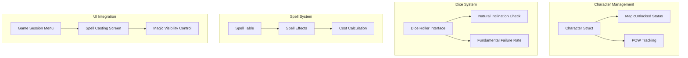
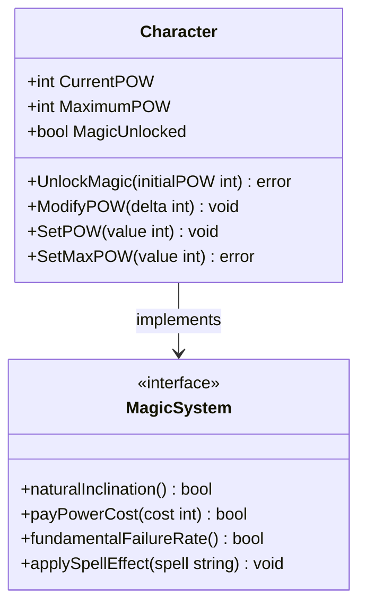
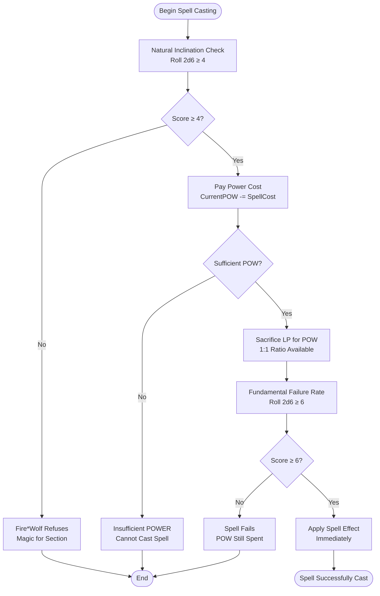
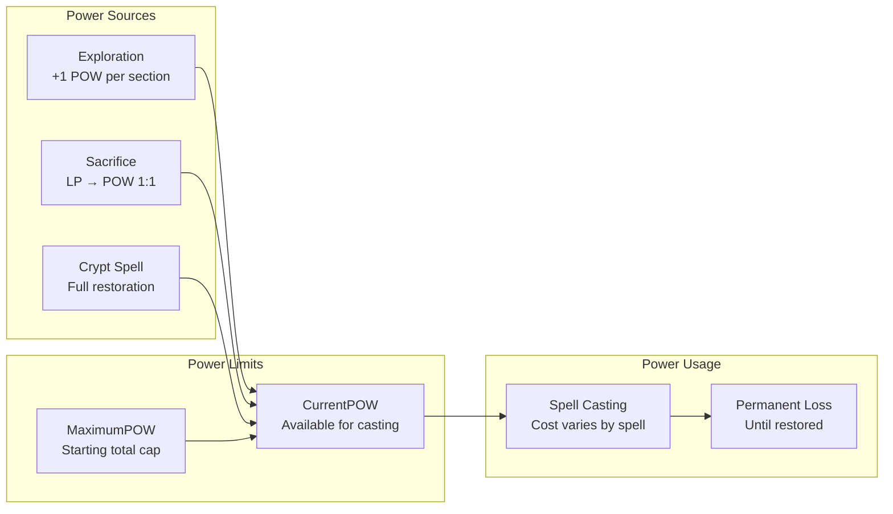
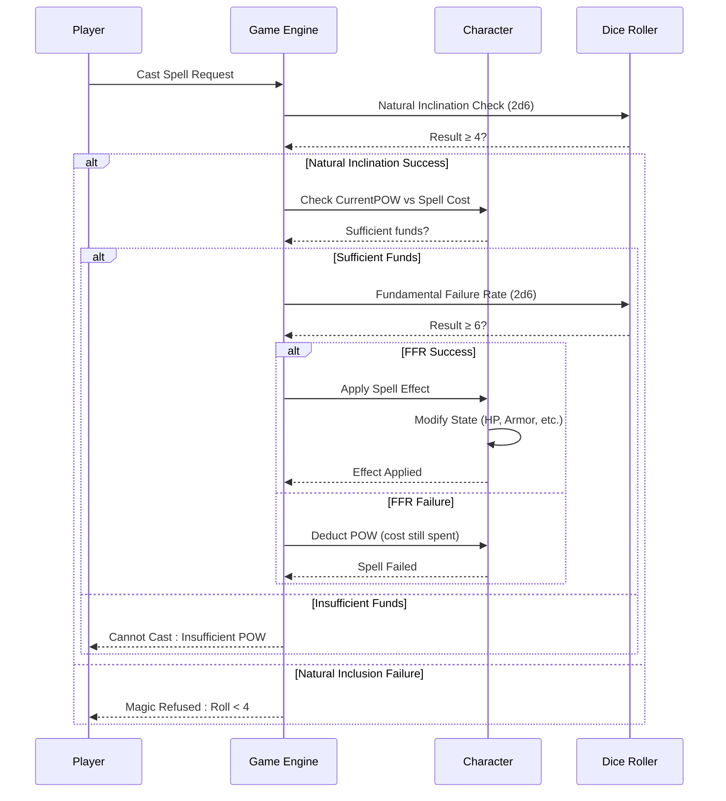
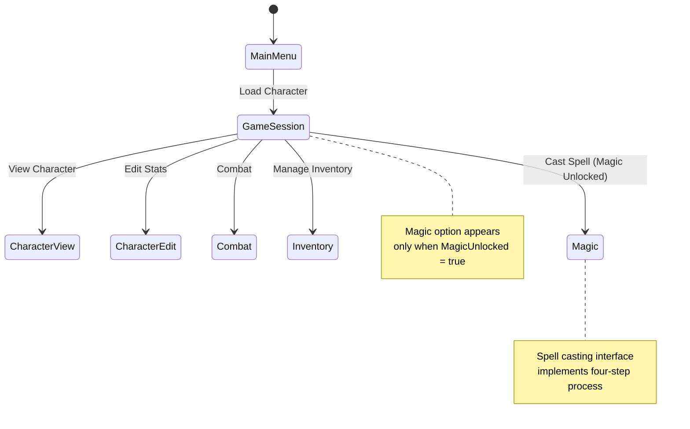

# Magic System

<cite>
**Referenced Files in This Document**
- [character.go](file://internal/character/character.go)
- [dice.go](file://internal/dice/dice.go)
- [model.go](file://pkg/ui/model.go)
- [game_session.go](file://pkg/ui/game_session.go)
- [update.go](file://pkg/ui/update.go)
- [saga_demonspawn_ruleset.md](file://saga_demonspawn_ruleset.md)
- [README.md](file://README.md)
</cite>

## Table of Contents
1. [Introduction](#introduction)
2. [Magic System Architecture](#magic-system-architecture)
3. [Character Magic State](#character-magic-state)
4. [Four-Step Casting Process](#four-step-casting-process)
5. [Power Economy](#power-economy)
6. [Spell Implementation](#spell-implementation)
7. [UI Integration](#ui-integration)
8. [Gameplay Mechanics](#gameplay-mechanics)
9. [Restrictions and Limitations](#restrictions-and-limitations)
10. [Troubleshooting Guide](#troubleshooting-guide)
11. [Conclusion](#conclusion)

## Introduction

The Fire*Wolf magic system is a core gameplay mechanic that introduces strategic resource management and risk-reward decision-making to the "Sagas of the Demonspawn" gamebook adaptation. This system transforms the original book's magical abilities into a structured, deterministic gameplay experience while preserving the essence of Fire*Wolf's moral reluctance to use sorcery.

The magic system operates on a separate resource called POWER (POW), distinct from Life Points (LP), creating a unique economic model where players must carefully balance their magical capabilities with survival needs. The system emphasizes strategic planning, as spells cannot be repeated within sections and POWER spent is permanently lost until restored.

## Magic System Architecture

The magic system is built around several key components that work together to create a cohesive gameplay experience:

**Diagram sources**
- [character.go](file://internal/character/character.go#L14-L35)
- [dice.go](file://internal/dice/dice.go#L11-L27)
- [game_session.go](file://pkg/ui/game_session.go#L4-L8)

**Section sources**
- [character.go](file://internal/character/character.go#L14-L35)
- [dice.go](file://internal/dice/dice.go#L11-L27)
- [model.go](file://pkg/ui/model.go#L28-L29)

## Character Magic State

The Character struct maintains three critical fields that track the magic system state:

**Diagram sources**
- [character.go](file://internal/character/character.go#L30-L33)

### Core Magic Fields

| Field | Type | Purpose | Initial Value |
|-------|------|---------|---------------|
| `CurrentPOW` | `int` | Current power available for casting | 0 |
| `MaximumPOW` | `int` | Maximum power capacity | 0 |
| `MagicUnlocked` | `bool` | Whether magic system is available | false |

### Magic System Activation

The magic system is activated through the `UnlockMagic` method, which initializes the character's power reserves and enables magic functionality:

**Section sources**
- [character.go](file://internal/character/character.go#L222-L231)

## Four-Step Casting Process

The magic system follows a strict four-step process for spell casting, ensuring consistent and deterministic outcomes:

**Diagram sources**
- [saga_demonspawn_ruleset.md](file://saga_demonspawn_ruleset.md#L90-L116)

### Step 1: Natural Inclination Check

Before any magic can be used in a section, Fire*Wolf must overcome his inherent aversion to sorcery. This check occurs once per section and determines whether magic becomes available:

- **Mechanic**: Roll 2d6 and compare to threshold of 4
- **Success**: Magic becomes available for the section
- **Failure**: Magic remains unavailable regardless of circumstances
- **Implication**: Strategic timing of magic usage is crucial

### Step 2: POWER Cost Payment

Each spell has a specific POWER cost that must be deducted from the character's current power reserve:

- **Cost Deduction**: `CurrentPOW -= spellCost`
- **Insufficient Funds**: Cannot cast if `CurrentPOW < spellCost`
- **Sacrifice Option**: Trade Life Points for POWER at 1:1 ratio
- **Permanent Loss**: POWER spent is gone until restored

### Step 3: Fundamental Failure Rate (FFR)

Regardless of success or failure, the POWER cost is always spent. The FFR determines whether the spell actually takes effect:

- **Threshold**: Roll 2d6 and require score of 6 or better
- **Success Rate**: 1/6 chance (approximately 16.7%)
- **Risk Factor**: High failure rate creates tension and strategy
- **Cost Efficiency**: Even failed spells consume valuable resources

### Step 4: Spell Effect Application

Successful spells immediately apply their effects to the character or situation:

- **Immediate Impact**: Effects occur instantly upon success
- **Section-Specific**: Effects last only for the current section
- **No Cumulative Bonuses**: Same spell cannot be used twice in one section

**Section sources**
- [saga_demonspawn_ruleset.md](file://saga_demonspawn_ruleset.md#L90-L116)

## Power Economy

The POWER economy creates a strategic resource management system that balances magical capability with survival needs:

**Diagram sources**
- [character.go](file://internal/character/character.go#L222-L277)
- [saga_demonspawn_ruleset.md](file://saga_demonspawn_ruleset.md#L117-L133)

### Power Restoration Methods

| Method | Description | Effectiveness | Risk Level |
|--------|-------------|---------------|------------|
| **Exploration** | Automatic +1 POW when entering new sections | Low effort, guaranteed | None |
| **Sacrifice** | Trade LP for POW at 1:1 ratio | Immediate restoration | Health risk |
| **Crypt Spell** | Full restoration or increase | Variable, depends on tests | High risk |

### Power Management Strategies

1. **Conservative Approach**: Save POW for critical moments
2. **Aggressive Approach**: Use POW early to secure advantages
3. **Balanced Approach**: Reserve POW for emergencies while maintaining flexibility

**Section sources**
- [saga_demonspawn_ruleset.md](file://saga_demonspawn_ruleset.md#L117-L133)

## Spell Implementation

The spell system implements all ten spells from the original ruleset, each with specific costs and effects:

### Spell Table Reference

| Spell | Power Cost | Effect | Unique Properties |
|-------|------------|--------|-------------------|
| **ARMOUR** | 25 | Reduces damage taken by 10 points | Defensive buff for section |
| **CRYPT** | 150 | Returns to Crypts for POW restoration | Highest cost, highest reward |
| **FIREBALL** | 15 | 50 LP damage to enemy | Direct offensive damage |
| **INVISIBILITY** | 30 | Avoid combat, proceed as victor | Non-combat solution |
| **PARALYSIS** | 30 | Escape to next section | Strategic retreat |
| **POISON NEEDLE** | 25 | Fatal poison (immune 1-3, affected 4-6) | Risky but powerful |
| **RESURRECTION** | 50 | Returns to section start (rerolls stats) | Death-defying ability |
| **RETRACE** | 20 | Return to previous section | Navigation tool |
| **TIMEWARP** | 10 | Reset section with full HP | Combat reset |
| **XENOPHOBIA** | 15 | Reduce enemy damage by 5 points | Enemy debuff |

### Spell Effect Implementation

Each spell's effect is applied immediately upon successful casting:

**Diagram sources**
- [saga_demonspawn_ruleset.md](file://saga_demonspawn_ruleset.md#L90-L116)

### Special Spell Interactions

#### RESURRECTION Spell
- **Unique Condition**: Only usable when character is dead
- **Game Impact**: Returns to section start with rerolled stats
- **Strategic Use**: Last-resort survival mechanism

#### CRYPT Spell
- **Highest Cost**: 150 POW required
- **Power Restoration**: Can fully restore or increase POW
- **Strategic Timing**: Requires careful resource planning

#### TIMEWARP Spell
- **Combat Reset**: Restores both player and enemy HP
- **Strategic Use**: Resets combat advantage or disadvantage
- **Timing**: Critical for turning losing fights into wins

**Section sources**
- [saga_demonspawn_ruleset.md](file://saga_demonspawn_ruleset.md#L117-L133)

## UI Integration

The magic system integrates seamlessly with the application's user interface through the game session menu:

**Diagram sources**
- [model.go](file://pkg/ui/model.go#L12-L30)
- [game_session.go](file://pkg/ui/game_session.go#L25-L47)

### Magic Visibility Control

The game session model dynamically controls magic menu visibility based on character state:

**Section sources**
- [game_session.go](file://pkg/ui/game_session.go#L25-L47)
- [update.go](file://pkg/ui/update.go#L198-L200)

### Menu Integration

The magic system appears in the game session menu only when the magic system is unlocked:

- **Conditional Display**: Magic option hidden until `MagicUnlocked = true`
- **Dynamic Updates**: Menu rebuilds when magic status changes
- **User Experience**: Seamless integration with existing navigation flow

**Section sources**
- [update.go](file://pkg/ui/update.go#L198-L200)

## Gameplay Mechanics

The magic system creates rich strategic gameplay opportunities and challenges:

### Resource Management

Players must constantly balance their magical capabilities with survival needs:

- **Limited Resources**: POWER is finite and must be conserved
- **Risk-Reward Decisions**: High-cost spells offer significant benefits
- **Timing Strategy**: Optimal spell usage requires foresight

### Strategic Planning

Magic usage requires careful consideration of multiple factors:

1. **Section Requirements**: Some sections may benefit more from magic
2. **Enemy Types**: Different spells are effective against different foes
3. **Health Status**: Sacrificing health for magic requires weighing risks
4. **Progress Goals**: Magic may be essential for advancing in certain sections

### Risk Assessment

The high failure rate and permanent cost create tension:

- **Conservative Play**: Save magic for critical situations
- **Aggressive Play**: Use magic early to secure advantages
- **Balanced Play**: Combine both approaches strategically

## Restrictions and Limitations

The magic system includes several important restrictions that shape gameplay:

### Duplicate Spell Restriction

- **Rule**: Cannot cast the same spell twice in a single section
- **Implementation**: Track spell usage per section
- **Strategy Impact**: Forces players to plan spell combinations
- **Resource Efficiency**: Prevents spamming ineffective spells

### Permanent Resource Loss

- **Rule**: POWER spent is gone until restored
- **Implementation**: No refunds or recoveries
- **Strategy Impact**: Creates scarcity and forces careful allocation
- **Consequences**: Poor decisions have lasting effects

### Natural Inclination Requirement

- **Rule**: Must pass natural inclination check before using magic
- **Implementation**: Single roll per section
- **Strategy Impact**: Timing of magic usage is crucial
- **Narrative Consistency**: Maintains Fire*Wolf's reluctance to use sorcery

### Section-Specific Effects

- **Rule**: Spell effects last only for the current section
- **Implementation**: Effects reset when moving to new sections
- **Strategy Impact**: Encourages immediate action
- **Resource Efficiency**: Prevents long-term reliance on magic

**Section sources**
- [saga_demonspawn_ruleset.md](file://saga_demonspawn_ruleset.md#L90-L116)

## Troubleshooting Guide

Common issues and solutions when working with the magic system:

### Magic Not Appearing in Menu

**Problem**: Magic casting option missing from game session menu
**Solution**: Ensure character has unlocked magic through `UnlockMagic()` method
**Code Reference**: [character.go](file://internal/character/character.go#L222-L231)

### Insufficient POWER Errors

**Problem**: Cannot cast spells despite having POWER
**Solution**: Check if natural inclination succeeded and if sufficient POWER remains
**Code Reference**: [saga_demonspawn_ruleset.md](file://saga_demonspawn_ruleset.md#L90-L116)

### Spell Effects Not Applying

**Problem**: Spells appear to cast but effects don't occur
**Solution**: Verify Fundamental Failure Rate check passed (2d6 ≥ 6)
**Code Reference**: [dice.go](file://internal/dice/dice.go#L49-L52)

### POWER Restoration Issues

**Problem**: POWER not restoring as expected
**Solution**: Check for proper implementation of exploration, sacrifice, or CRYPT spell
**Code Reference**: [character.go](file://internal/character/character.go#L233-L277)

### Character State Corruption

**Problem**: Magic state becomes inconsistent
**Solution**: Verify proper initialization of `MagicUnlocked`, `CurrentPOW`, and `MaximumPOW`
**Code Reference**: [character.go](file://internal/character/character.go#L69-L96)

**Section sources**
- [character.go](file://internal/character/character.go#L222-L277)
- [dice.go](file://internal/dice/dice.go#L49-L52)

## Conclusion

The Fire*Wolf magic system represents a sophisticated implementation of the original gamebook's magical mechanics, transformed into a structured, deterministic gameplay experience. Through careful resource management, strategic planning, and risk assessment, players engage with the same challenging decisions that Fire*Wolf faced in the original narrative.

The system's four-step casting process ensures consistent outcomes while maintaining the tension and excitement of the original rules. The POWER economy creates meaningful choices about when and how to use magic, while the various restoration methods provide multiple strategies for managing resources.

Key strengths of the implementation include:

- **Faithful Recreation**: Accurate representation of original mechanics
- **Strategic Depth**: Rich decision-making opportunities
- **Integration**: Seamless UI integration with existing game flow
- **Determinism**: Predictable outcomes for consistent gameplay
- **Balance**: Proper risk/reward ratios and resource scarcity

The magic system enhances the overall gameplay experience by adding complexity and depth while maintaining the accessibility and clarity emphasized in the rewritten ruleset. Players must weigh the benefits of magical assistance against the risks of failure and permanent resource loss, creating engaging and memorable gameplay moments.

Future enhancements could include spell combination strategies, advanced resource management techniques, and integration with other game systems to create even more complex and rewarding gameplay experiences.