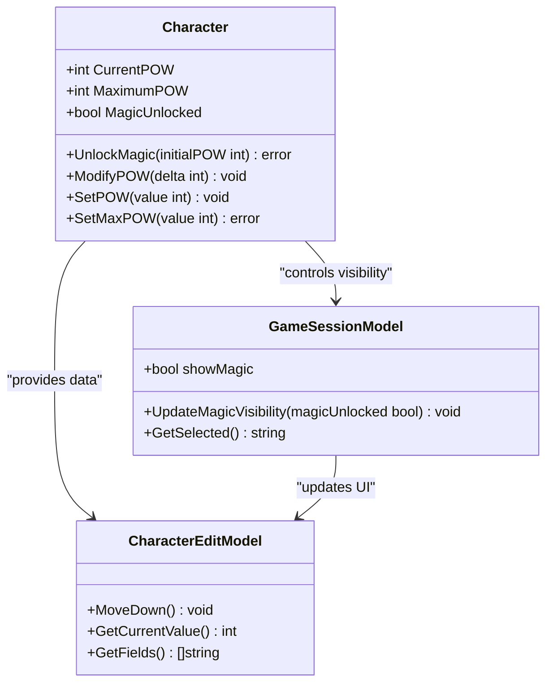
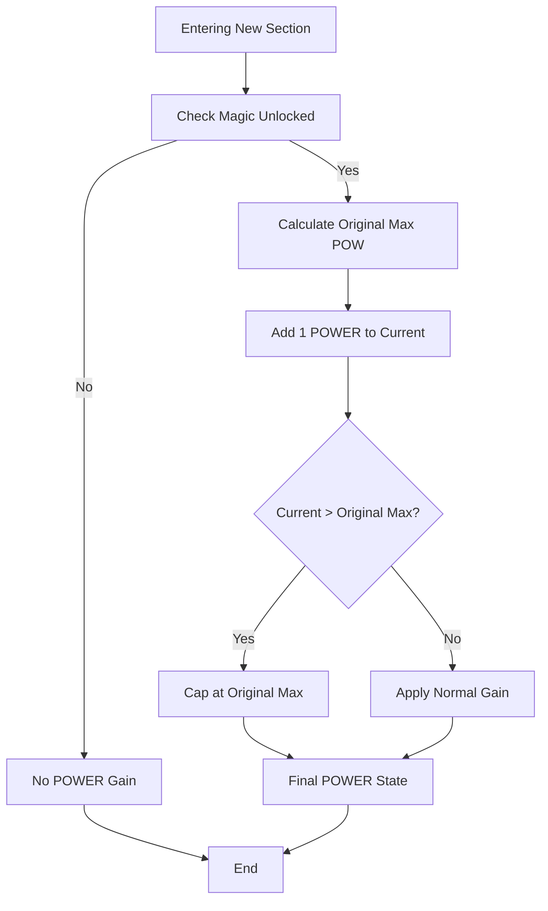
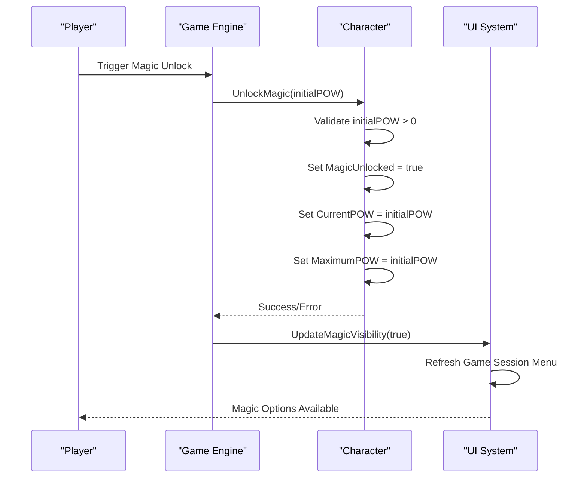
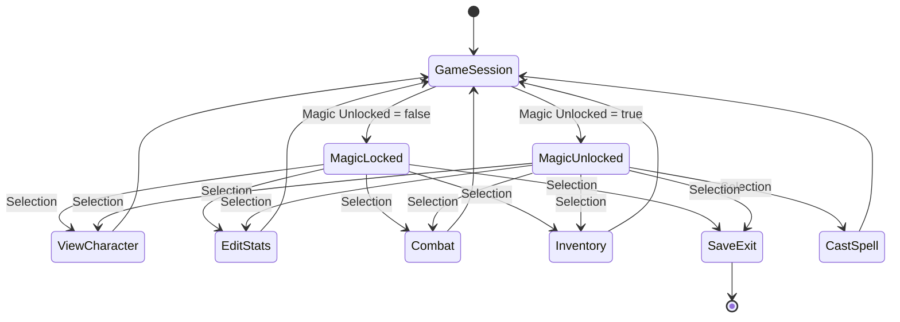
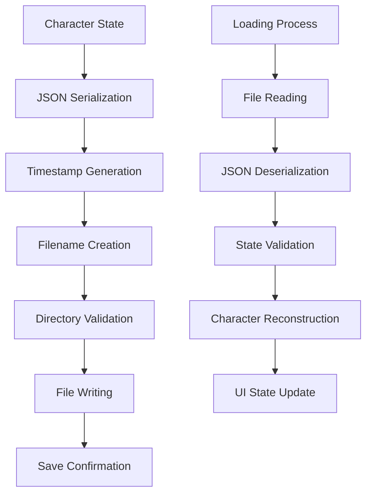

# POWER Economy and Management

<cite>
**Referenced Files in This Document**
- [internal/character/character.go](file://internal/character/character.go)
- [pkg/ui/model.go](file://pkg/ui/model.go)
- [pkg/ui/game_session.go](file://pkg/ui/game_session.go)
- [pkg/ui/update.go](file://pkg/ui/update.go)
- [pkg/ui/character_edit.go](file://pkg/ui/character_edit.go)
- [pkg/ui/character_view.go](file://pkg/ui/character_view.go)
- [saga_demonspawn_ruleset.md](file://saga_demonspawn_ruleset.md)
</cite>

## Table of Contents
1. [Introduction](#introduction)
2. [POWER System Architecture](#power-system-architecture)
3. [Core POWER Mechanics](#core-power-mechanics)
4. [Renewal Mechanisms](#renewal-mechanisms)
5. [Magic System Initialization](#magic-system-initialization)
6. [UI Integration and State Management](#ui-integration-and-state-management)
7. [Persistence and Validation](#persistence-and-validation)
8. [Gameplay Decision Making](#gameplay-decision-making)
9. [Performance Considerations](#performance-considerations)
10. [Troubleshooting Guide](#troubleshooting-guide)

## Introduction

The POWER economy system in Fire*Wolf is a sophisticated resource management mechanic that governs the use of magic in the game. POWER (POW) serves as a distinct resource separate from LIFE POINTS (LP), creating strategic tension between physical combat capabilities and magical abilities. This system introduces meaningful gameplay decisions where players must balance conservation of POWER for critical moments versus immediate needs.

The POWER economy operates on three fundamental principles: scarcity (limited POWER reserves), strategic timing (when to use magic), and risk management (balancing LP sacrifices). Players must carefully manage their POWER resources while navigating encounters that may require either brute force or cunning magic solutions.

## POWER System Architecture

The POWER system is built around two primary attributes stored within the Character struct, forming the foundation of the magic economy:

**Diagram sources**
- [internal/character/character.go](file://internal/character/character.go#L30-L33)
- [pkg/ui/game_session.go](file://pkg/ui/game_session.go#L4-L8)
- [pkg/ui/character_edit.go](file://pkg/ui/character_edit.go#L65-L124)

**Section sources**
- [internal/character/character.go](file://internal/character/character.go#L14-L33)
- [pkg/ui/game_session.go](file://pkg/ui/game_session.go#L1-L77)

## Core POWER Mechanics

### Character Structure Implementation

The POWER system is implemented through three key fields in the Character struct:

| Field | Type | Purpose | Initial Value |
|-------|------|---------|---------------|
| CurrentPOW | int | Current available POWER for casting spells | 0 |
| MaximumPOW | int | Maximum POWER capacity | 0 |
| MagicUnlocked | bool | Whether magic system is activated | false |

### POWER Modification Methods

The system provides four primary methods for managing POWER values:

#### SetPOW Method
Sets the current POWER to an exact value with automatic validation:
- Negative values are clamped to 0
- Preserves MaximumPOW relationship
- Used for direct POWER manipulation

#### ModifyPOW Method  
Changes POWER by a delta value with safety checks:
- Automatically prevents negative values
- Maintains POWER within bounds
- Supports both positive and negative adjustments

#### SetMaxPOW Method
Sets the maximum POWER capacity with validation:
- Prevents negative maximum values
- Validates against current POWER state
- Used for POWER upgrades and enhancements

#### UnlockMagic Method
Initializes the magic system and establishes baseline POWER:
- Sets MagicUnlocked flag to true
- Establishes initial POWER as both current and maximum
- Cannot accept negative initial values

**Section sources**
- [internal/character/character.go](file://internal/character/character.go#L222-L277)

## Renewal Mechanisms

The POWER economy features three distinct renewal mechanisms that provide strategic depth to resource management:

### Automatic Exploration Gain

**Diagram sources**
- [internal/character/character.go](file://internal/character/character.go#L222-L277)

The exploration mechanism provides automatic POWER regeneration when entering new sections:
- **Trigger Condition**: Entering a new section of the game
- **Gain Amount**: +1 POWER per section entrance
- **Capacity Limit**: Cannot exceed original maximum POWER
- **Activation**: Requires magic system to be unlocked
- **Purpose**: Encourages exploration while maintaining scarcity

### LIFE POINT Sacrifice Mechanism

The LIFE POINT sacrifice system enables direct conversion between resources:

| Conversion Ratio | Benefit | Risk Level | Strategic Use Cases |
|------------------|---------|------------|-------------------|
| 1:1 | Immediate POWER gain | Medium | Critical spell casting, emergency situations |
| LP Loss | POWER gain | High | High-cost spells when LP is abundant |
| POWER Gain | LP loss | Low | Resource optimization, strategic positioning |

**Key Features**:
- **Immediate Conversion**: No delay or cooldown period
- **Flexible Application**: Can be used at any time during gameplay
- **Strategic Depth**: Balances short-term LP loss vs. long-term POWER gain
- **Risk Management**: Forces players to weigh immediate needs against future capabilities

### CRYPT Spell Restoration

The CRYPT spell represents the most powerful POWER renewal mechanism:

**Mechanics**:
- **Cost**: 150 POWER points
- **Effect**: Complete POWER restoration
- **Enhancement**: May increase maximum POWER capacity
- **Trigger**: Specific game conditions or NPC interactions
- **Limitations**: High cost makes it a strategic choice rather than routine use

**Strategic Implications**:
- **High Risk, High Reward**: Significant POWER investment for substantial returns
- **Resource Planning**: Requires careful timing and preparation
- **Long-term Benefits**: Enhanced maximum POWER capacity for sustained magic use
- **Critical Moments**: Ideal for boss fights or challenging encounters requiring extensive magic

**Section sources**
- [saga_demonspawn_ruleset.md](file://saga_demonspawn_ruleset.md#L90-L116)

## Magic System Initialization

The UnlockMagic method serves as the gateway to the POWER economy system:

**Diagram sources**
- [internal/character/character.go](file://internal/character/character.go#L222-L231)
- [pkg/ui/game_session.go](file://pkg/ui/game_session.go#L25-L47)

### Initialization Process

The magic system activation follows a structured process:

1. **Validation Phase**: Ensures initial POWER value is non-negative
2. **Flag Setting**: MagicUnlocked flag becomes true
3. **State Establishment**: Both current and maximum POWER are set
4. **UI Synchronization**: Game session menu updates to show magic options
5. **System Activation**: All magic-related functionality becomes available

### Integration Points

The magic system integrates with multiple subsystems:

- **Game Session**: Updates menu choices to include "Cast Spell" option
- **Character Editing**: Enables POWER field editing in character management
- **Combat System**: Provides magic casting capabilities during encounters
- **Inventory Management**: Links to spell books and magical items

**Section sources**
- [internal/character/character.go](file://internal/character/character.go#L222-L231)
- [pkg/ui/game_session.go](file://pkg/ui/game_session.go#L25-L47)

## UI Integration and State Management

The POWER economy integrates seamlessly with the user interface through multiple layers of state management:

### Game Session Menu Integration

**Diagram sources**
- [pkg/ui/game_session.go](file://pkg/ui/game_session.go#L1-L77)
- [pkg/ui/update.go](file://pkg/ui/update.go#L183-L232)

### Character Editing Integration

The character editing system provides direct POWER manipulation capabilities:

| Field | Editable When | Validation | Impact |
|-------|---------------|------------|--------|
| CurrentPOW | Magic Unlocked | Non-negative | Immediate POWER change |
| MaximumPOW | Magic Unlocked | Non-negative | Capacity adjustment | 
| All Characteristics | Always | Range 0-999 | Indirect POWER influence |

### State Synchronization

The UI maintains synchronization between character state and display:

- **Real-time Updates**: POWER changes immediately reflect in menus
- **Conditional Visibility**: POWER fields appear only when magic is unlocked
- **Input Validation**: All POWER modifications validate against negative values
- **Consistency Checks**: UI ensures POWER values remain within logical bounds

**Section sources**
- [pkg/ui/game_session.go](file://pkg/ui/game_session.go#L25-L47)
- [pkg/ui/character_edit.go](file://pkg/ui/character_edit.go#L65-L124)
- [pkg/ui/update.go](file://pkg/ui/update.go#L161-L181)

## Persistence and Validation

### Save System Implementation

The character persistence system ensures POWER state survives game sessions:

**Diagram sources**
- [internal/character/character.go](file://internal/character/character.go#L312-L354)

### Validation Mechanisms

The system implements multiple validation layers:

#### Character-Level Validation
- **Negative Prevention**: All POWER setters clamp negative values to zero
- **Range Checking**: Maximum POWER cannot be negative
- **Consistency Maintenance**: Current POWER never exceeds Maximum POWER

#### UI-Level Validation
- **Input Filtering**: Numeric input only for POWER fields
- **Real-time Feedback**: Immediate validation of POWER changes
- **Boundary Enforcement**: Prevents invalid POWER states through UI controls

#### Persistence-Level Validation
- **JSON Schema**: Structured data format ensures consistency
- **Timestamp Tracking**: Last saved timestamp for version control
- **Atomic Operations**: Complete state writes prevent corruption

### Error Handling

The system provides comprehensive error handling:

- **Initialization Errors**: Clear messaging for invalid POWER values
- **Persistence Failures**: Graceful handling of save/load errors
- **Validation Failures**: User-friendly error messages for invalid operations
- **Recovery Mechanisms**: Automatic correction of invalid states

**Section sources**
- [internal/character/character.go](file://internal/character/character.go#L222-L277)
- [internal/character/character.go](file://internal/character/character.go#L312-L354)

## Gameplay Decision Making

### Strategic POWER Management

The POWER economy creates several strategic decision points:

#### Conservation vs. Aggression
Players must decide between:
- **Conservative Approach**: Preserve POWER for critical moments
- **Aggressive Approach**: Use POWER liberally for immediate advantages
- **Balanced Approach**: Strategic allocation based on encounter difficulty

#### Resource Allocation
Key decisions include:
- **Early Game**: When to unlock magic and establish POWER base
- **Mid Game**: How to balance LP sacrifices for POWER gains
- **Late Game**: When to invest in CRYPT spell for maximum enhancement

#### Risk Assessment
Players evaluate:
- **Short-term Needs**: Immediate POWER requirements vs. long-term preservation
- **Encounter Difficulty**: Whether magic is essential for victory
- **Resource Availability**: Current LP levels affecting sacrifice decisions

### Example Scenarios

#### Scenario 1: Critical Encounter
**Situation**: Facing a powerful enemy requiring magic to defeat
**Options**:
- Use ARMOUR spell (25 POW): Protects against damage
- Attempt FIREBALL (15 POW): High damage potential
- Conserve POWER: Prepare for next encounter

#### Scenario 2: Resource Optimization
**Situation**: Abundant LP but limited POWER
**Options**:
- Sacrifice LP for POWER: 1:1 conversion for immediate needs
- Wait for exploration gain: Slow but safe accumulation
- Use CRYPT spell: High risk, high reward enhancement

#### Scenario 3: Strategic Positioning
**Situation**: Need to navigate dangerous terrain
**Options**:
- Use INVISIBILITY (30 POW): Avoid combat entirely
- Use XENOPHOBIA (15 POW): Reduce enemy effectiveness
- Engage physically: Rely on combat skills instead

### Decision Framework

Players develop strategies based on:
- **Probability Assessment**: Success rates of magic spells
- **Resource Timing**: When to allocate POWER for maximum impact
- **Risk Tolerance**: Comfort level with LP sacrifices vs. POWER conservation
- **Game Progression**: Current stage influencing strategic priorities

**Section sources**
- [saga_demonspawn_ruleset.md](file://saga_demonspawn_ruleset.md#L90-L116)

## Performance Considerations

### State Update Efficiency

The POWER system implements several performance optimizations:

#### Minimal Computational Overhead
- **Direct Assignment**: POWER modifications use simple arithmetic operations
- **Cached Calculations**: Maximum POWER values cached to avoid recalculation
- **Efficient Validation**: Single-pass validation prevents unnecessary computations

#### Memory Management
- **Compact Storage**: POWER values stored as integers minimize memory usage
- **Lazy Loading**: Magic system only initialized when unlocked
- **Garbage Collection**: Efficient cleanup of temporary POWER calculations

### UI Rendering Performance

The user interface optimizes POWER-related rendering:

#### Conditional Rendering
- **Dynamic Menus**: Magic options appear/disappear based on POWER state
- **Field Visibility**: POWER fields hidden when magic is locked
- **Real-time Updates**: Efficient DOM updates for POWER changes

#### Input Processing
- **Event Debouncing**: Prevents excessive POWER modification events
- **Batch Updates**: Multiple POWER changes processed in single UI refresh
- **Validation Caching**: Input validation results cached for repeated operations

### Scalability Considerations

The system scales efficiently across:
- **Large Character Lists**: POWER state doesn't impact character management performance
- **Frequent Saves**: Lightweight serialization minimizes save operation overhead
- **Concurrent Access**: Thread-safe POWER modifications prevent race conditions

## Troubleshooting Guide

### Common Issues and Solutions

#### POWER Values Not Persisting
**Symptoms**: POWER resets between game sessions
**Causes**: 
- Save file corruption
- Invalid POWER values during save
- Directory permission issues

**Solutions**:
1. Verify save directory permissions
2. Check for corrupted save files
3. Validate POWER values before saving
4. Reset to known good state if necessary

#### Magic System Not Unlocking
**Symptoms**: "Cast Spell" option missing from menu
**Causes**:
- UnlockMagic method not called
- Invalid initial POWER value
- UI state out of sync

**Solutions**:
1. Verify UnlockMagic method call with valid parameters
2. Check UI state synchronization
3. Force UI refresh if needed
4. Debug magic system initialization

#### POWER Validation Errors
**Symptoms**: Error messages when modifying POWER
**Causes**:
- Negative POWER values attempted
- Maximum POWER exceeded
- Invalid input format

**Solutions**:
1. Implement input validation
2. Add boundary checking
3. Provide clear error messages
4. Enable automatic correction

### Debugging Tools

#### State Inspection
- **Character Dump**: Examine complete character state including POWER
- **UI State**: Verify menu visibility matches POWER state
- **Save File**: Inspect JSON structure for POWER values

#### Performance Monitoring
- **Update Frequency**: Monitor UI update rates for POWER changes
- **Memory Usage**: Track POWER-related memory consumption
- **Save Performance**: Measure save/load operation timing

### Recovery Procedures

#### Corrupted Save Recovery
1. Locate backup save files
2. Extract POWER values manually
3. Create new character with recovered values
4. Verify all POWER mechanics function correctly

#### UI State Recovery
1. Force UI refresh
2. Reinitialize magic system
3. Resync character state
4. Test all POWER-related functionality

**Section sources**
- [internal/character/character.go](file://internal/character/character.go#L222-L277)
- [pkg/ui/update.go](file://pkg/ui/update.go#L161-L181)