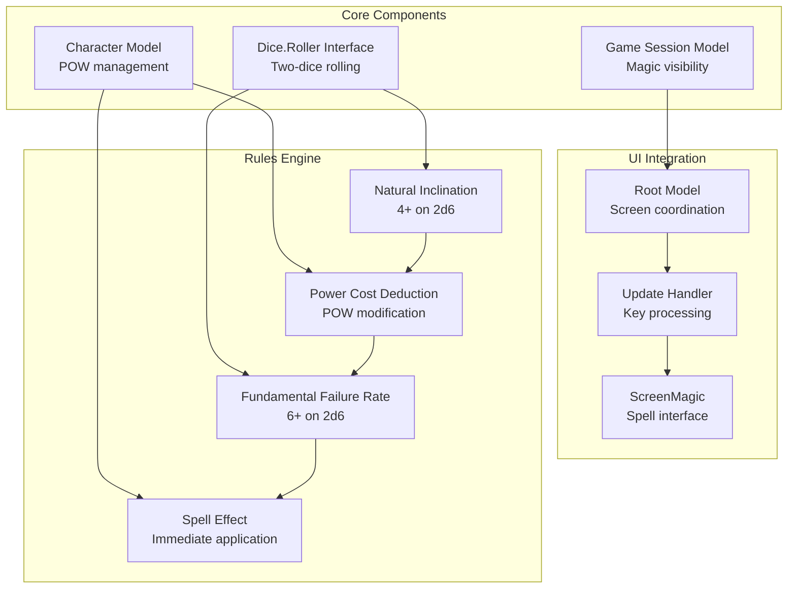
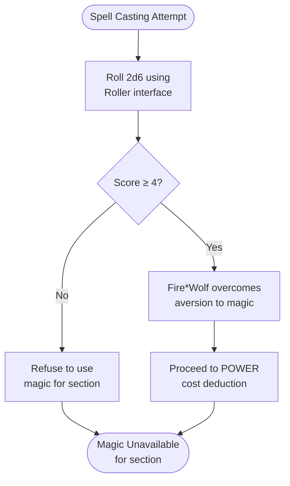
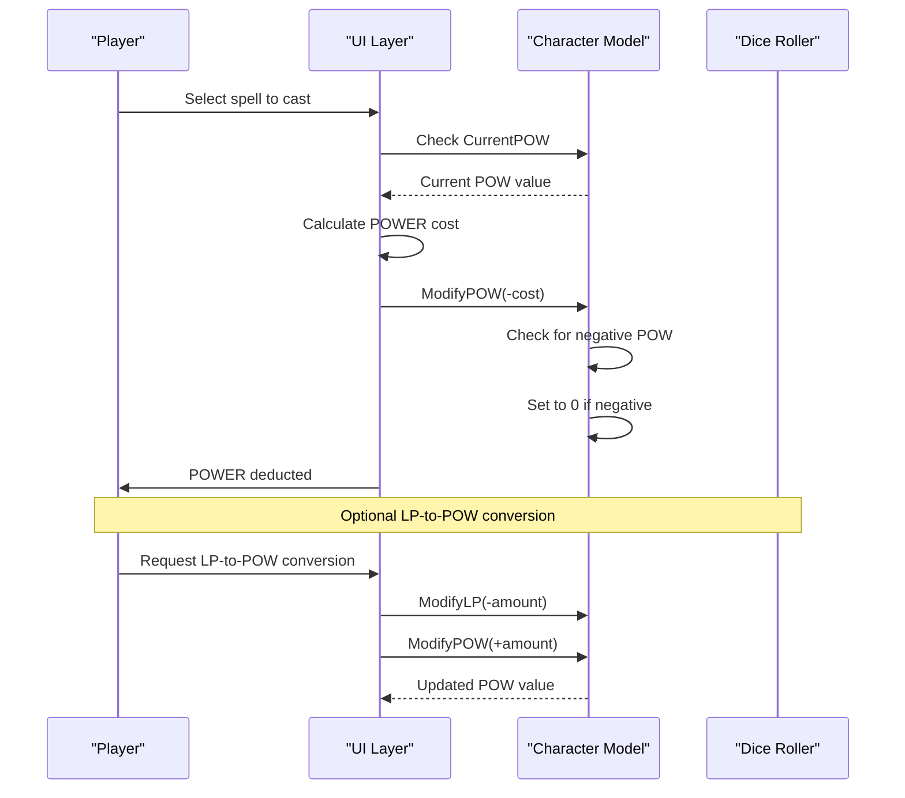
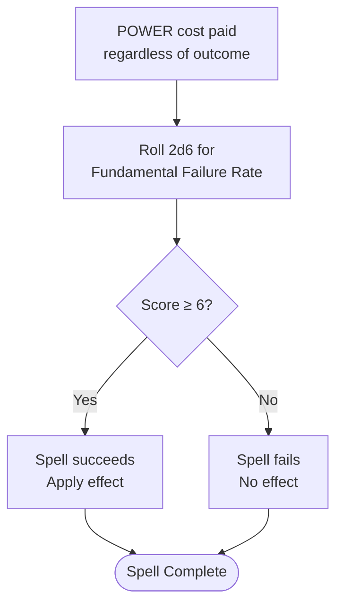
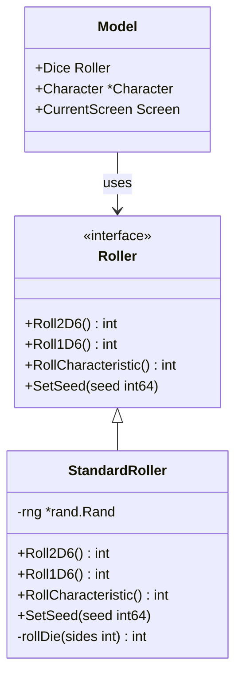
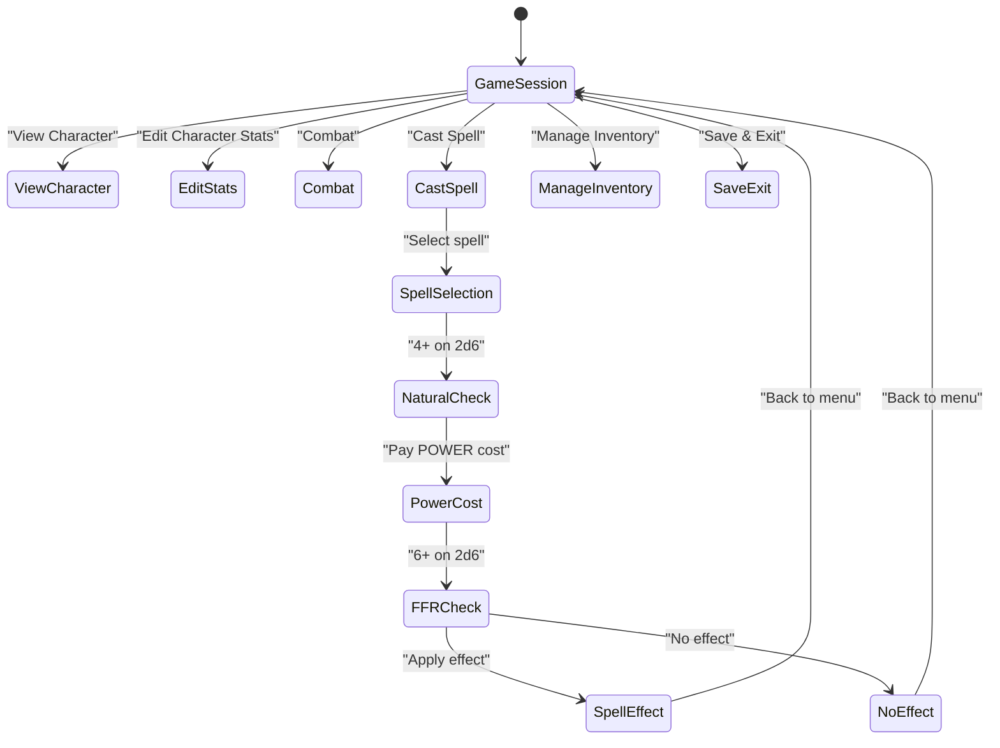
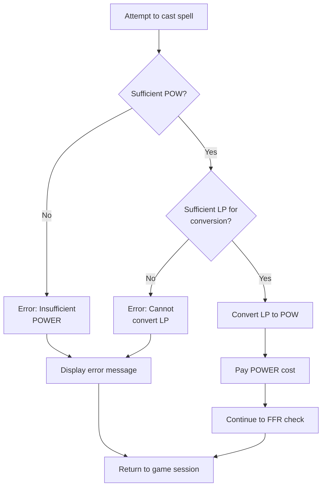

# Spell Casting Process

<cite>
**Referenced Files in This Document**
- [dice.go](file://internal/dice/dice.go)
- [character.go](file://internal/character/character.go)
- [game_session.go](file://pkg/ui/game_session.go)
- [model.go](file://pkg/ui/model.go)
- [update.go](file://pkg/ui/update.go)
- [saga_demonspawn_ruleset.md](file://saga_demonspawn_ruleset.md)
</cite>

## Table of Contents
1. [Introduction](#introduction)
2. [Spell Casting System Architecture](#spell-casting-system-architecture)
3. [Four-Step Spell Casting Process](#four-step-spell-casting-process)
4. [Implementation Context](#implementation-context)
5. [UI Flow Integration](#ui-flow-integration)
6. [Error Handling](#error-handling)
7. [State Tracking and Restrictions](#state-tracking-and-restrictions)
8. [Troubleshooting Guide](#troubleshooting-guide)
9. [Future Implementation Notes](#future-implementation-notes)

## Introduction

The spell casting system in Saga of the Demonspawn implements a sophisticated magic mechanism that balances risk and reward while maintaining the authentic feel of the original gamebook. This system introduces a four-step process that mirrors the classic "natural inclination" and "fundamental failure rate" mechanics, creating tense decision-making moments for players.

The magic system operates independently from life points, using a dedicated resource called POWER (POW) that players must manage strategically. Spells cannot be cast twice per section, adding another layer of tactical consideration to spell selection and timing.

## Spell Casting System Architecture

The spell casting system is built on several key architectural components that work together to provide a comprehensive magic experience:

**Diagram sources**
- [dice.go](file://internal/dice/dice.go#L12-L26)
- [character.go](file://internal/character/character.go#L14-L44)
- [game_session.go](file://pkg/ui/game_session.go#L4-L8)
- [model.go](file://pkg/ui/model.go#L34-L56)

**Section sources**
- [dice.go](file://internal/dice/dice.go#L1-L97)
- [character.go](file://internal/character/character.go#L1-L355)
- [game_session.go](file://pkg/ui/game_session.go#L1-L77)

## Four-Step Spell Casting Process

The spell casting process follows a carefully structured four-step sequence that maintains the tension and challenge of the original gamebook mechanics.

### Step 1: Natural Inclination Check (4+ on 2d6)

The natural inclination check determines whether Fire*Wolf is willing to use magic in the current section. This mechanic reflects the character's inherent aversion to sorcery.

**Diagram sources**
- [dice.go](file://internal/dice/dice.go#L50-L52)
- [update.go](file://pkg/ui/update.go#L183-L209)

The implementation uses the [`Roll2D6()`](file://internal/dice/dice.go#L50-L52) method from the `Roller` interface, which returns a value between 2 and 12. Players must achieve a score of 4 or higher to overcome their natural reluctance to use magic.

### Step 2: POWER Cost Deduction and LP-to-POW Conversion

Once the natural inclination check passes, the system deducts the spell's POWER cost from the character's current POW total. Players have the option to convert LIFE POINTS to POWER at a 1:1 ratio if they lack sufficient POW.

**Diagram sources**
- [character.go](file://internal/character/character.go#L232-L239)
- [update.go](file://pkg/ui/update.go#L183-L209)

The [`ModifyPOW()`](file://internal/character/character.go#L232-L239) method handles POWER adjustments, automatically clamping negative values to zero to prevent underflow.

### Step 3: Fundamental Failure Rate Check (6+ on 2d6)

The fundamental failure rate represents the inherent risk of magic failing despite successful casting attempts. This step occurs regardless of whether the spell succeeds or fails.

**Diagram sources**
- [dice.go](file://internal/dice/dice.go#L50-L52)
- [update.go](file://pkg/ui/update.go#L183-L209)

The FFR check uses the same [`Roll2D6()`](file://internal/dice/dice.go#L50-L52) method, requiring a score of 6 or higher for success. This creates a 50% chance of success, reflecting the dangerous nature of magic in the gamebook.

### Step 4: Spell Effect Application

Only successful spells receive their intended effects. The system applies the spell's specific mechanics immediately upon successful casting.

**Section sources**
- [saga_demonspawn_ruleset.md](file://saga_demonspawn_ruleset.md#L90-L116)

## Implementation Context

The spell casting system is designed to integrate seamlessly with the existing UI architecture while maintaining the integrity of the original gamebook mechanics.

### Dice Rolling Infrastructure

The [`Roller`](file://internal/dice/dice.go#L12-L26) interface provides a clean abstraction for random number generation, enabling deterministic testing and consistent behavior across the application.

**Diagram sources**
- [dice.go](file://internal/dice/dice.go#L12-L76)
- [model.go](file://pkg/ui/model.go#L42-L56)

### Character Model Integration

The [`Character`](file://internal/character/character.go#L14-L44) struct contains all magic-related state and provides methods for POWER management.

| Field | Type | Purpose |
|-------|------|---------|
| `CurrentPOW` | `int` | Current POWER resource level |
| `MaximumPOW` | `int` | Maximum POWER capacity |
| `MagicUnlocked` | `bool` | Whether magic system is available |

| Method | Purpose | Implementation |
|--------|---------|----------------|
| [`UnlockMagic(initialPOW int)`](file://internal/character/character.go#L222-L231) | Activate magic system | Sets `MagicUnlocked` to true and initializes POW |
| [`ModifyPOW(delta int)`](file://internal/character/character.go#L232-L239) | Adjust POWER balance | Handles positive/negative adjustments with clamping |
| [`SetPOW(value int)`](file://internal/character/character.go#L241-L247) | Set specific POWER value | Direct assignment with negative value handling |

**Section sources**
- [dice.go](file://internal/dice/dice.go#L1-L97)
- [character.go](file://internal/character/character.go#L1-L355)

## UI Flow Integration

The spell casting process integrates with the main game session through a series of coordinated UI components that guide players through the casting sequence.

### Game Session Navigation

The [`GameSessionModel`](file://pkg/ui/game_session.go#L4-L8) manages menu visibility and navigation, dynamically showing the "Cast Spell" option when magic is unlocked.

**Diagram sources**
- [game_session.go](file://pkg/ui/game_session.go#L1-L77)
- [update.go](file://pkg/ui/update.go#L183-L209)

### Screen Coordination

The [`Model`](file://pkg/ui/model.go#L34-L56) coordinates between different screens, maintaining state continuity as players navigate from the main menu to character management and finally to spell casting.

**Section sources**
- [game_session.go](file://pkg/ui/game_session.go#L1-L77)
- [model.go](file://pkg/ui/model.go#L1-L95)
- [update.go](file://pkg/ui/update.go#L183-L209)

## Error Handling

The spell casting system implements comprehensive error handling to manage various failure scenarios gracefully.

### Insufficient POWER Handling

When players attempt to cast spells without sufficient POWER, the system prevents invalid operations and provides clear feedback.

**Diagram sources**
- [character.go](file://internal/character/character.go#L232-L239)
- [update.go](file://pkg/ui/update.go#L183-L209)

### Duplicate Spell Prevention

The system prevents players from casting the same spell twice in a single section by tracking spell usage through the character model's state management.

### Natural Inclination Failure

When the natural inclination check fails, the system permanently disables magic for the current section, preventing further attempts until the section ends.

**Section sources**
- [character.go](file://internal/character/character.go#L232-L239)
- [update.go](file://pkg/ui/update.go#L183-L209)

## State Tracking and Restrictions

The spell casting system enforces several key restrictions that mirror the original gamebook mechanics.

### Magic System Activation

Magic becomes available when the [`UnlockMagic()`](file://internal/character/character.go#L222-L231) method is called, typically during gameplay progression. The system tracks this state through the `MagicUnlocked` boolean field.

### POWER Resource Management

POWER resources are consumed immediately upon casting, with no refunds for failed spells. The [`ModifyPOW()`](file://internal/character/character.go#L232-L239) method ensures proper resource accounting.

### Section-Based Spell Limitations

Spells cannot be cast twice within the same section, creating strategic depth and forcing players to consider their spell choices carefully.

**Section sources**
- [character.go](file://internal/character/character.go#L222-L231)
- [character.go](file://internal/character/character.go#L232-L239)

## Troubleshooting Guide

Common issues and their solutions for players attempting to cast spells.

### Attempting Duplicate Spells

**Problem**: Players try to cast the same spell multiple times in a single section.

**Solution**: The system prevents duplicate spell casting by tracking spell usage internally. Players should select different spells for subsequent attempts.

**Error Message**: "Cannot cast the same spell twice in a section."

### Insufficient POWER

**Problem**: Players lack enough POWER to cast a desired spell.

**Solution**: Players can convert LIFE POINTS to POWER at a 1:1 ratio. The system will prompt for conversion if sufficient LP is available.

**Error Message**: "Insufficient POWER. Convert LP to POW or choose a different spell."

### Natural Inclination Failure

**Problem**: The natural inclination check fails, preventing magic usage for the entire section.

**Solution**: Once the natural inclination check fails, magic remains unavailable until the section ends. Players should consider this risk when deciding to attempt magic.

**Error Message**: "Fire*Wolf refuses to use magic for this section."

### Understanding LP-to-POW Conversion

**Problem**: Players misunderstand the LP-to-POW conversion mechanics.

**Solution**: Explain that LP-to-POW conversion occurs at a 1:1 ratio, meaning 1 LP equals 1 POW. This conversion happens after the natural inclination check but before the FFR check.

**Best Practice**: Players should evaluate their current situation before converting LP to POW, as this reduces their life reserve.

**Section sources**
- [character.go](file://internal/character/character.go#L232-L239)
- [update.go](file://pkg/ui/update.go#L183-L209)

## Future Implementation Notes

The spell casting system is designed with extensibility in mind, allowing for future enhancements and additional spells.

### Planned Enhancements

- **Spell Selection Interface**: A dedicated screen for choosing spells from the available spell table
- **Spell Effect Implementation**: Specific mechanics for each of the 10 spells
- **Visual Feedback**: Enhanced UI elements showing spell costs, success rates, and effects
- **History Tracking**: Logging of spell attempts and outcomes for player reference

### Extension Points

The current architecture provides several extension points for adding new spells and mechanics:

- **Spell Registry**: Centralized management of spell properties and effects
- **Effect Application**: Modular system for applying different spell effects
- **Failure Consequences**: Mechanisms for handling failed spell attempts

### Testing Considerations

The interface-based design enables comprehensive testing through mock implementations, particularly for the dice rolling and character state management components.

**Section sources**
- [dice.go](file://internal/dice/dice.go#L1-L97)
- [character.go](file://internal/character/character.go#L1-L355)
- [update.go](file://pkg/ui/update.go#L183-L209)