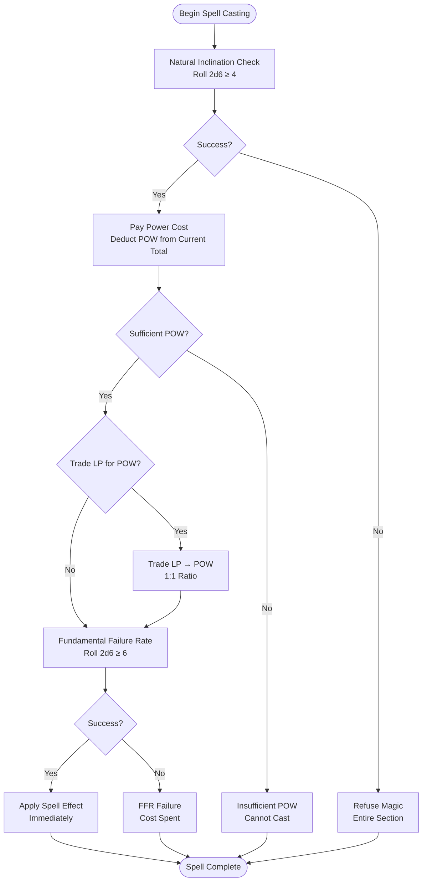
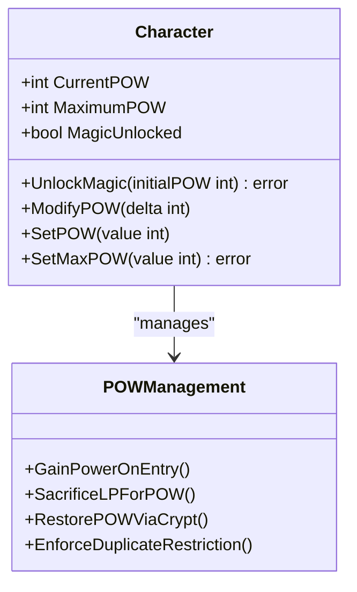
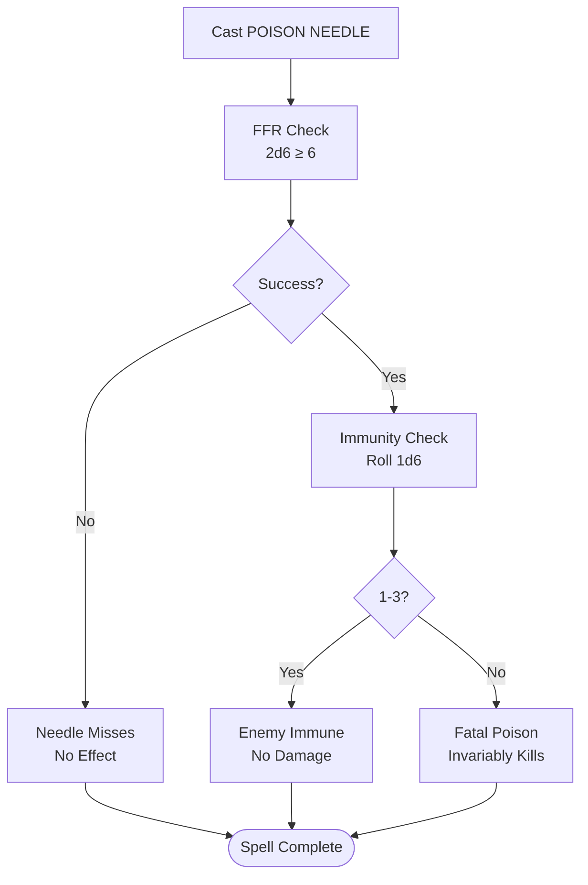
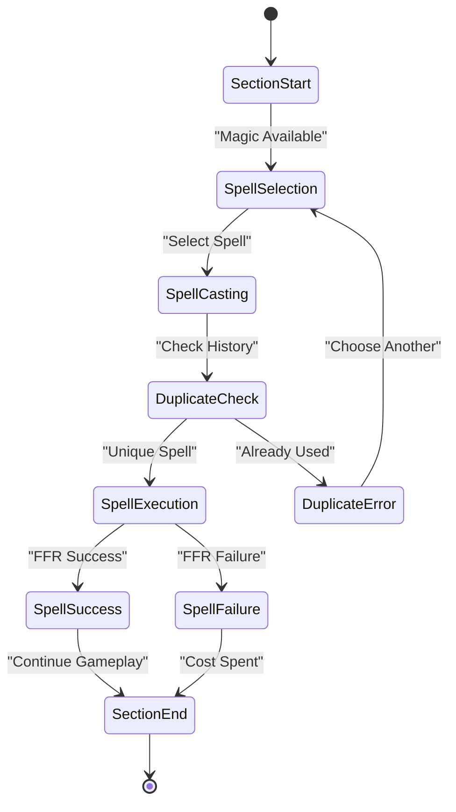

# Spell Table and Effects

<cite>
**Referenced Files in This Document**
- [saga_demonspawn_ruleset.md](file://saga_demonspawn_ruleset.md)
- [internal/character/character.go](file://internal/character/character.go)
- [internal/dice/dice.go](file://internal/dice/dice.go)
- [internal/items/items.go](file://internal/items/items.go)
- [pkg/ui/model.go](file://pkg/ui/model.go)
- [pkg/ui/game_session.go](file://pkg/ui/game_session.go)
- [pkg/ui/update.go](file://pkg/ui/update.go)
- [internal/character/character_test.go](file://internal/character/character_test.go)
</cite>

## Table of Contents
1. [Introduction](#introduction)
2. [Magic System Overview](#magic-system-overview)
3. [Spell Table Reference](#spell-table-reference)
4. [Power Management System](#power-management-system)
5. [Spell Implementation Analysis](#spell-implementation-analysis)
6. [Game State Mechanics](#game-state-mechanics)
7. [Interaction Patterns](#interaction-patterns)
8. [Troubleshooting Guide](#troubleshooting-guide)
9. [Conclusion](#conclusion)

## Introduction

The magic system in Saga of the Demonspawn operates on a sophisticated POWER resource management framework that mirrors the original gamebook's strategic depth. Fire*Wolf's inherent aversion to sorcery creates a compelling tension between survival necessity and personal morality. This document provides comprehensive coverage of all ten spells, their implementation mechanics, and their effects on game state.

## Magic System Overview

The magic system follows a four-step casting process that emphasizes risk management and strategic decision-making:

**Diagram sources**
- [saga_demonspawn_ruleset.md](file://saga_demonspawn_ruleset.md#L94-L116)

**Section sources**
- [saga_demonspawn_ruleset.md](file://saga_demonspawn_ruleset.md#L90-L116)

## Spell Table Reference

| Spell | Power Cost | Effect | Implementation Notes |
|-------|------------|--------|---------------------|
| **ARMOUR** | 25 | Creates magical armor reducing damage by 10 points | Reduces incoming damage in combat calculations |
| **CRYPT** | 150 | Returns to Crypts for POW restoration/increase | Enables POW progression testing |
| **FIREBALL** | 15 | Hurls flame causing 50 LP damage | Direct damage to single enemy |
| **INVISIBILITY** | 30 | Renders invisible, avoiding combat | Prevents attacks, enables escape |
| **PARALYSIS** | 30 | Paralyzes enemy for escape | Single-target paralysis effect |
| **POISON NEEDLE** | 25 | Shoots fatal poison (1d6: 1-3 immune, 4-6 affected) | Immunity-based damage mechanism |
| **RESURRECTION** | 50 | Only usable when killed, rerolls stats | Death recovery with stat reset |
| **RETRACE** | 20 | Returns to previous section | Non-restoring teleportation |
| **TIMEWARP** | 10 | Resets section with LP restoration | Full section restart with healing |
| **XENOPHOBIA** | 15 | Reduces enemy damage by 5 points | Defensive damage mitigation |

**Section sources**
- [saga_demonspawn_ruleset.md](file://saga_demonspawn_ruleset.md#L117-L133)

## Power Management System

The POWER system operates independently from LIFE POINTS and follows strict economic principles:

**Diagram sources**
- [internal/character/character.go](file://internal/character/character.go#L222-L277)

### Power Renewal Mechanisms

1. **Exploration Gain**: Automatic 1 POW per new section (cap: starting total)
2. **Sacrifice System**: 1:1 LP-to-POW conversion
3. **Crypt Restoration**: Full POW restoration or increase through testing

**Section sources**
- [saga_demonspawn_ruleset.md](file://saga_demonspawn_ruleset.md#L109-L116)
- [internal/character/character.go](file://internal/character/character.go#L222-L277)

## Spell Implementation Analysis

### ARMOUR - Damage Reduction Spell

**POWER Cost**: 25
**Implementation**: Reduces incoming damage by 10 points in combat calculations

The ARMOUR spell modifies the damage calculation process by applying a flat reduction to all incoming damage. This effect would be implemented in the combat damage calculation logic, potentially modifying the `GetArmorProtection()` method or adding a separate damage reduction modifier.

**Section sources**
- [saga_demonspawn_ruleset.md](file://saga_demonspawn_ruleset.md#L117-L118)

### CRYPT - POW Restoration Spell

**POWER Cost**: 150
**Implementation**: Returns to Crypts for POW restoration or increase

The CRYPT spell enables POW progression testing, allowing players to attempt various tests to restore or increase their POWER. This would involve a specialized game state transition that temporarily suspends normal gameplay while presenting crypt-based challenges.

**Section sources**
- [saga_demonspawn_ruleset.md](file://saga_demonspawn_ruleset.md#L117-L119)

### FIREBALL - Direct Damage Spell

**POWER Cost**: 15
**Implementation**: Hurls flame causing 50 LP damage to single enemy

The FIREBALL spell implements a straightforward damage mechanism requiring successful FFR execution. The spell would target a single enemy and apply 50 LP damage directly, bypassing normal combat resolution.

**Section sources**
- [saga_demonspawn_ruleset.md](file://saga_demonspawn_ruleset.md#L117-L120)

### INVISIBILITY - Combat Avoidance Spell

**POWER Cost**: 30
**Implementation**: Renders invisible, preventing attacks and enabling escape

INVISIBILITY creates a defensive state where the player cannot attack but avoids combat entirely. This would require modifications to the combat initiation logic to recognize invisible states and prevent enemy attacks.

**Section sources**
- [saga_demonspawn_ruleset.md](file://saga_demonspawn_ruleset.md#L117-L121)

### PARALYSIS - Escape Spell

**POWER Cost**: 30
**Implementation**: Paralyzes single enemy for escape opportunity

PARALYSIS creates a temporary incapacitation effect that allows the player to escape to the next section. This would involve setting a temporary state flag that prevents enemy attacks for the remainder of the section.

**Section sources**
- [saga_demonspawn_ruleset.md](file://saga_demonspawn_ruleset.md#L117-L122)

### POISON NEEDLE - Immunity-Based Damage

**POWER Cost**: 25
**Implementation**: Shoots poisoned needle with 1d6 immunity check (1-3 immune, 4-6 affected)

The POISON NEEDLE spell implements a probabilistic damage mechanism using a 1d6 roll to determine immunity. Successful hits result in invariably fatal poison damage, requiring careful balance between success probability and risk.

**Diagram sources**
- [saga_demonspawn_ruleset.md](file://saga_demonspawn_ruleset.md#L117-L123)

**Section sources**
- [saga_demonspawn_ruleset.md](file://saga_demonspawn_ruleset.md#L117-L124)

### RESURRECTION - Death Recovery Spell

**POWER Cost**: 50
**Implementation**: Only usable when killed, rerolls all stats including LP and POW

RESURRECTION provides a dramatic death recovery mechanism that completely resets the player's character state. This would involve character state serialization, random stat rerolling, and game state restoration to the beginning of the current section.

**Section sources**
- [saga_demonspawn_ruleset.md](file://saga_demonspawn_ruleset.md#L117-L125)

### RETRACE - Teleportation Spell

**POWER Cost**: 20
**Implementation**: Returns to any previously visited section without LP or POW restoration

RETRACE enables strategic section hopping without the benefits of healing or power restoration. This would require maintaining a history of visited sections and implementing a safe return mechanism.

**Section sources**
- [saga_demonspawn_ruleset.md](file://saga_demonspawn_ruleset.md#L117-L126)

### TIMEWARP - Section Reset Spell

**POWER Cost**: 10
**Implementation**: Resets time to section beginning with full LP restoration

TIMEWARP provides a powerful reset mechanism that restores both player and enemy LP to starting values. This would involve complete section state restoration and potential enemy stat reset mechanisms.

**Section sources**
- [saga_demonspawn_ruleset.md](file://saga_demonspawn_ruleset.md#L117-L127)

### XENOPHOBIA - Defensive Damage Reduction

**POWER Cost**: 15
**Implementation**: Causes single opponent to fear, reducing their damage by 5 points

XENOPHOBIA creates a psychological advantage by reducing enemy offensive capabilities. This would modify enemy damage calculations by applying a flat 5-point reduction to all enemy attacks.

**Section sources**
- [saga_demonspawn_ruleset.md](file://saga_demonspawn_ruleset.md#L117-L128)

## Game State Mechanics

### No-Duplicate-Spell Per-Section Rule

The game enforces a strict restriction preventing the same spell from being cast twice in a single section. This mechanic encourages strategic spell selection and forces players to adapt their magic usage throughout gameplay.

**Diagram sources**
- [saga_demonspawn_ruleset.md](file://saga_demonspawn_ruleset.md#L105-L107)

### Magic System Activation

The magic system becomes available through the `UnlockMagic()` method, which initializes POWER resources and enables spell casting capabilities.

**Section sources**
- [internal/character/character.go](file://internal/character/character.go#L222-L227)
- [pkg/ui/game_session.go](file://pkg/ui/game_session.go#L30-L45)

## Interaction Patterns

### Spell Combination Strategies

Players can combine spells for enhanced effectiveness:

1. **INVISIBILITY + PARALYSIS**: Use invisibility to avoid detection, then paralyze for escape
2. **ARMOUR + XENOPHOBIA**: Stack defensive bonuses for maximum protection
3. **TIMEWARP + RETRACE**: Combine section resets with strategic positioning
4. **RESURRECTION + CRYPT**: Use resurrection to recover from critical situations

### Edge Case Interactions

1. **RESURRECTION Timing**: Must be used immediately upon death, before permanent consequences
2. **POW Overflow**: CRYPT testing may result in increased maximum POW
3. **Section Transitions**: Spells affecting section progression (RETRACE, TIMEWARP)
4. **Combat States**: Spells altering attack/defense dynamics (INVISIBILITY, ARMOUR)

## Troubleshooting Guide

### Common Issues and Solutions

#### POW Management Problems

**Issue**: Insufficient POW for desired spells
**Solution**: 
- Use exploration gain (1 POW per section)
- Sacrifice LP for POW (1:1 ratio)
- Utilize CRYPT spell for restoration

**Issue**: POW overflow after CRYPT use
**Solution**: Monitor maximum POW limits and manage growth carefully

#### Spell Usage Conflicts

**Issue**: Attempting duplicate spell casting
**Solution**: Track spell usage per section and plan accordingly

**Issue**: FFR consistently failing
**Solution**: Manage POW costs carefully and consider LP sacrifices

#### Death Recovery Issues

**Issue**: RESURRECTION unavailable after permanent death
**Solution**: Use RESURRECTION immediately upon taking lethal damage

**Issue**: Stat reroll disadvantages
**Solution**: Plan character builds around potential reroll outcomes

#### Combat State Problems

**Issue**: INVISIBILITY not preventing attacks
**Solution**: Verify combat initiation logic recognizes invisible state

**Issue**: ARMOUR damage reduction inconsistent
**Solution**: Check damage calculation implementation for modifier application

### Debugging Tips

1. **Verify Magic Unlocked**: Ensure `MagicUnlocked` flag is set
2. **Check POW Levels**: Monitor current and maximum POW values
3. **Validate FFR**: Confirm Fundamental Failure Rate calculations
4. **Trace Spell History**: Track which spells have been used in current section

**Section sources**
- [internal/character/character.go](file://internal/character/character.go#L222-L277)
- [pkg/ui/update.go](file://pkg/ui/update.go#L183-L200)

## Conclusion

The spell system in Saga of the Demonspawn demonstrates sophisticated game mechanics that balance strategic depth with accessibility. Each spell offers unique advantages while requiring careful resource management and timing. The POWER economy creates meaningful choices about when to use magic versus relying on physical abilities, while the no-duplicate restriction encourages creative problem-solving.

The implementation framework provides solid foundations for all ten spells, with clear pathways for expanding the magic system. Future development should focus on completing the magic UI, implementing spell effects, and ensuring proper integration with combat and game state management systems.

Understanding these mechanics enables players to develop effective strategies, manage resources efficiently, and navigate the challenging world of Saga of the Demonspawn with greater confidence and tactical awareness.