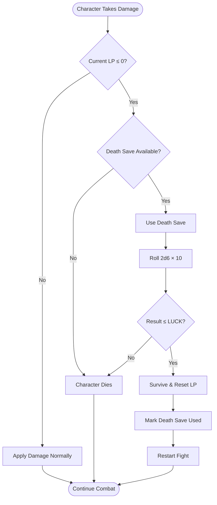
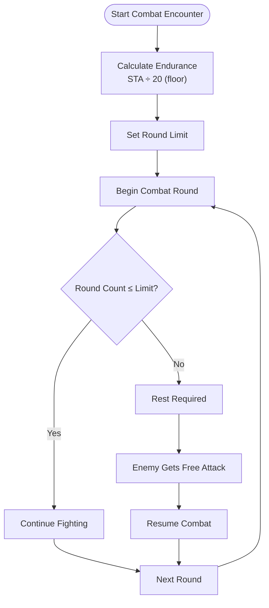
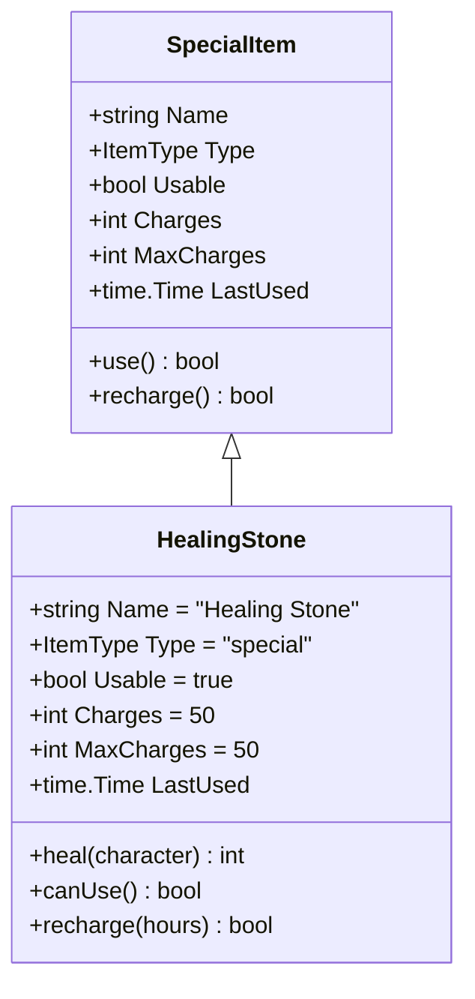
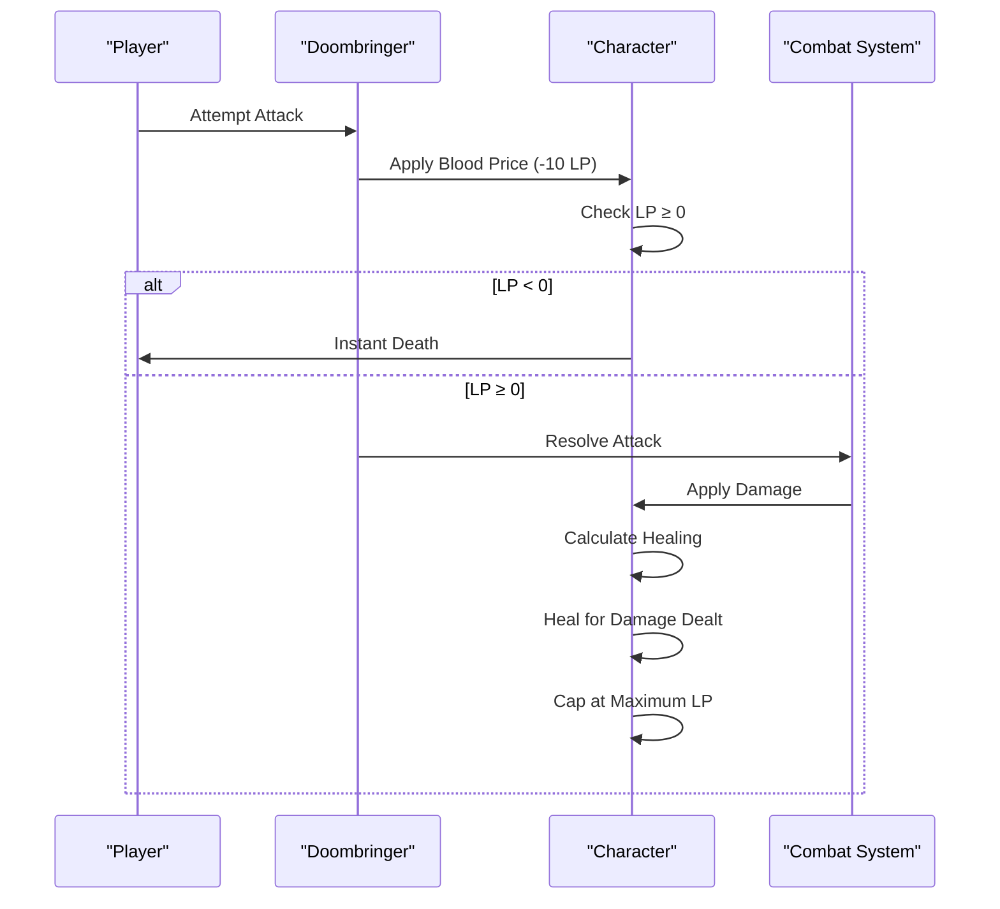
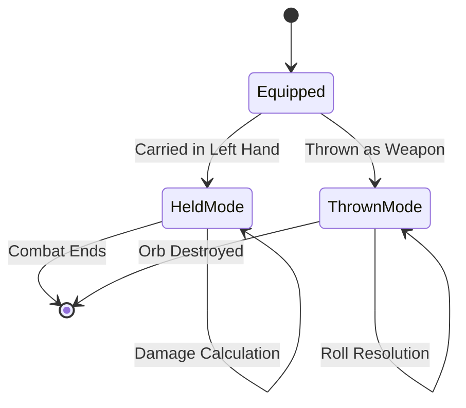
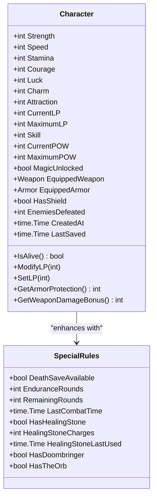
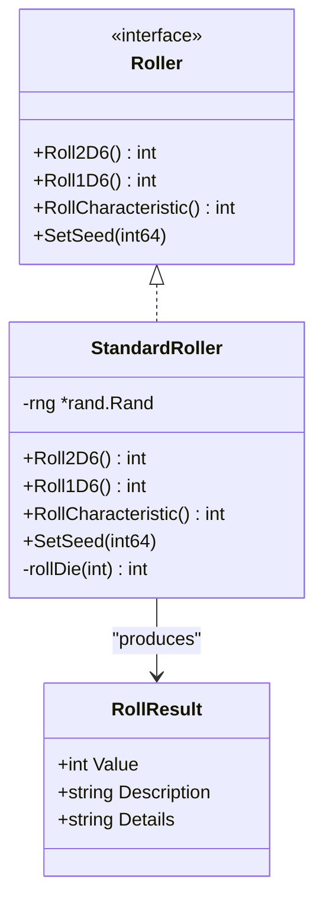
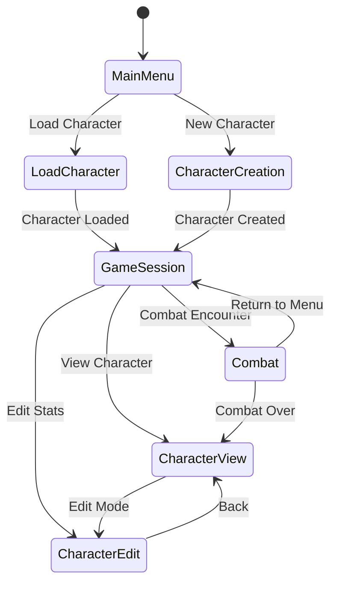

# Special Rules

<cite>
**Referenced Files in This Document**
- [internal/character/character.go](file://internal/character/character.go)
- [internal/items/items.go](file://internal/items/items.go)
- [internal/dice/dice.go](file://internal/dice/dice.go)
- [pkg/ui/model.go](file://pkg/ui/model.go)
- [pkg/ui/update.go](file://pkg/ui/update.go)
- [saga_demonspawn_ruleset.md](file://saga_demonspawn_ruleset.md)
- [README.md](file://README.md)
</cite>

## Table of Contents
1. [Introduction](#introduction)
2. [Death Save Mechanic](#death-save-mechanic)
3. [Endurance System](#endurance-system)
4. [Special Items](#special-items)
5. [Implementation Architecture](#implementation-architecture)
6. [UI Integration](#ui-integration)
7. [Edge Cases and Error Handling](#edge-cases-and-error-handling)
8. [Gameplay Examples](#gameplay-examples)
9. [Developer Reference](#developer-reference)

## Introduction

The Special Rules sub-feature encompasses three critical game mechanics that define the perilous world of Fire*Wolf: the death save system, endurance mechanics, and unique special items. These systems introduce tension, risk management, and strategic decision-making into combat encounters while maintaining the authentic feel of the "Sagas of the Demonspawn" gamebook.

This documentation covers the implementation details, gameplay mechanics, and UI integration for death saves, endurance tracking, and special items like the Healing Stone and Doombringer. The systems are designed to work seamlessly together, providing players with meaningful choices and consequences during their adventures.

## Death Save Mechanic

### Core Mechanics

The death save mechanic provides characters with a single chance to survive when their Life Points (LP) reach zero or below. This system introduces dramatic tension and forces players to weigh risks during combat.

**Diagram sources**
- [internal/character/character.go](file://internal/character/character.go#L184-L192)
- [saga_demonspawn_ruleset.md](file://saga_demonspawn_ruleset.md#L68-L70)

### Implementation Details

The death save system is implemented through several key components in the Character struct and associated methods:

#### Character State Tracking

The Character struct maintains essential state for death save mechanics:

| Field | Type | Purpose | Default Value |
|-------|------|---------|---------------|
| `CurrentLP` | `int` | Current life points | Calculated from characteristics |
| `MaximumLP` | `int` | Original starting LP | Fixed at creation |
| `IsAlive()` | `bool` | Survival status check | Derived from CurrentLP |

#### Death Save Validation

The system validates death save eligibility through multiple checks:

1. **LP Threshold Check**: Characters must have 0 or negative LP
2. **Availability Check**: Death saves can only be attempted once per combat
3. **Luck Comparison**: Rolls 2d6×10 and compares to LUCK characteristic

**Section sources**
- [internal/character/character.go](file://internal/character/character.go#L278-L282)
- [saga_demonspawn_ruleset.md](file://saga_demonspawn_ruleset.md#L68-L70)

### Edge Cases

Several edge cases require careful handling:

#### Death Save Failure Consequences
- Immediate character elimination
- No possibility of resurrection within the current encounter
- Loss of accumulated progress in the current section

#### Death Save Success Recovery
- Restoration to original MaximumLP
- Reset of all combat state
- Opportunity to restart the encounter with full resources

#### Multiple Death Attempts
- Single-use limitation per combat encounter
- Prevention of infinite retry loops
- Fairness in challenge difficulty

## Endurance System

### Stamina-Based Combat Duration

The endurance system determines how long characters can fight without rest, based on their Stamina (STA) characteristic. This mechanic introduces strategic depth to combat planning and resource management.

**Diagram sources**
- [saga_demonspawn_ruleset.md](file://saga_demonspawn_ruleset.md#L71-L72)
- [internal/character/character.go](file://internal/character/character.go#L18-L19)

### Endurance Calculation Formula

The endurance system uses a straightforward mathematical formula to determine combat duration limits:

**Endurance Rounds = ⌊STA ÷ 20⌋**

Where:
- ⌊x⌋ represents floor division (rounding down to nearest integer)
- STA is the character's Stamina characteristic
- Result indicates maximum continuous fighting rounds

### Practical Examples

| Stamina Value | Endurance Rounds | Combat Strategy Implications |
|---------------|------------------|------------------------------|
| 20-39 | 1 round | Must rest after first round |
| 40-59 | 2 rounds | Plan for one rest period |
| 60-79 | 3 rounds | Can fight three rounds |
| 80+ | 4+ rounds | Extended combat capability |

**Section sources**
- [saga_demonspawn_ruleset.md](file://saga_demonspawn_ruleset.md#L71-L72)

### UI Integration

The UI displays endurance information prominently during combat encounters:

- **Status Display**: Shows remaining endurance rounds
- **Visual Indicators**: Color-coded warnings as rounds approach limit
- **Strategy Guidance**: Suggests optimal rest timing

## Special Items

### Healing Stone

The Healing Stone provides temporary life restoration between combat rounds, offering crucial support during extended encounters.

#### Technical Specifications

| Parameter | Value | Description |
|-----------|-------|-------------|
| Healing Amount | 1d6 × 10 | Variable restoration (10-60 LP) |
| Recharge Time | 48 hours | After last use in combat |
| Total Capacity | 50 LP | Maximum healing available |
| Usage Limit | Once per combat | Single use per encounter |

#### Implementation Details

The Healing Stone is modeled as a consumable item with specific usage mechanics:

**Diagram sources**
- [internal/items/items.go](file://internal/items/items.go#L56-L57)
- [internal/items/items.go](file://internal/items/items.go#L20-L30)

#### Usage Mechanics

1. **Activation**: Player selects Healing Stone from inventory
2. **Roll Calculation**: 1d6 × 10 for healing amount
3. **Application**: Adds rolled amount to CurrentLP
4. **Recharge Initiation**: Sets LastUsed timestamp
5. **Charge Depletion**: Reduces available charges

**Section sources**
- [internal/items/items.go](file://internal/items/items.go#L56-L57)
- [saga_demonspawn_ruleset.md](file://saga_demonspawn_ruleset.md#L74-L76)

### Doombringer (The Cursed Blade)

Doombringer represents the ultimate high-risk, high-reward weapon in the game, embodying the dangerous allure of powerful artifacts.

#### Technical Specifications

| Parameter | Value | Description |
|-----------|-------|-------------|
| Damage Bonus | +20 | Above normal sword damage |
| Blood Price | -10 LP | Per attack attempt |
| Soul Thirst | Heal = Damage Dealt | Post-combat healing |
| Maximum Damage | 100 LP | With full bonuses |
| Critical Failure | Instant Death | If LP drops to 0 |

#### Implementation Architecture

**Diagram sources**
- [internal/items/items.go](file://internal/items/items.go#L143-L149)
- [saga_demonspawn_ruleset.md](file://saga_demonspawn_ruleset.md#L78-L81)

#### Doombringer Mechanics

The Doombringer implements complex interaction logic:

1. **Blood Price Payment**: Automatic -10 LP before attack resolution
2. **Critical Failure Check**: If LP reaches 0, immediate death
3. **Damage Calculation**: Standard combat damage formula
4. **Soul Thirst Healing**: LP restored equal to damage dealt (after armor)
5. **Maximum LP Cap**: Cannot exceed original MaximumLP

#### Edge Cases

Several scenarios require special handling:

**Self-Inflicted Fatalities**:
- Attacking with 10 or fewer LP triggers instant death
- Prevents impossible healing situations
- Maintains game balance

**Partial Damage Scenarios**:
- Armor/shield reductions apply before healing calculation
- Ensures fair damage distribution
- Prevents exploitation of healing mechanics

**Section sources**
- [internal/items/items.go](file://internal/items/items.go#L143-L149)
- [saga_demonspawn_ruleset.md](file://saga_demonspawn_ruleset.md#L78-L81)

### The Orb

The Orb represents ancient technology with dual functionality, offering both offensive and defensive capabilities against Demonspawn threats.

#### Technical Specifications

| Parameter | Value | Description |
|-----------|-------|-------------|
| Held Mode | Double Damage | Against Demonspawn only |
| Thrown Mode | Instant Kill | On 4+ roll, 200 damage on miss |
| Effectiveness | Demonspawn only | No impact on other creatures |
| Destruction | Always | Both successful and failed throws destroy the Orb |

#### Implementation Details

The Orb operates through two distinct modes with different mechanics:

**Diagram sources**
- [saga_demonspawn_ruleset.md](file://saga_demonspawn_ruleset.md#L83-L89)

## Implementation Architecture

### Character Struct Enhancement

The Character struct has been enhanced to support special rules functionality:

**Diagram sources**
- [internal/character/character.go](file://internal/character/character.go#L14-L44)

### Dice System Integration

The dice system provides the foundation for random element generation:

**Diagram sources**
- [internal/dice/dice.go](file://internal/dice/dice.go#L11-L27)
- [internal/dice/dice.go](file://internal/dice/dice.go#L78-L97)

**Section sources**
- [internal/character/character.go](file://internal/character/character.go#L14-L44)
- [internal/dice/dice.go](file://internal/dice/dice.go#L11-L97)

## UI Integration

### Screen Navigation

The UI integrates special rules through dedicated screens and navigation:

**Diagram sources**
- [pkg/ui/model.go](file://pkg/ui/model.go#L10-L31)
- [pkg/ui/update.go](file://pkg/ui/update.go#L32-L56)

### Combat Interface

During combat, the UI displays special rules information:

- **Endurance Tracker**: Shows remaining rounds before mandatory rest
- **Death Save Status**: Indicates availability of death save opportunity
- **Item Usage Prompts**: Alerts for special item availability
- **Risk Indicators**: Visual warnings for high-risk situations

### Character Management

Character editing screens provide access to special rules:

- **Stat Modification**: Direct editing of characteristics affecting special rules
- **Equipment Management**: Selection of special items and their effects
- **Progress Tracking**: Monitoring of special item usage and recharge cycles

**Section sources**
- [pkg/ui/model.go](file://pkg/ui/model.go#L34-L95)
- [pkg/ui/update.go](file://pkg/ui/update.go#L32-L329)

## Edge Cases and Error Handling

### Death Save Edge Cases

The system handles several critical edge cases:

#### Multiple Death Attempts Prevention
- Single-use limitation enforced through state tracking
- Clear messaging when attempting second death save
- Prevention of infinite retry exploits

#### Luck-Based Survival Probability
- Mathematical fairness ensured through random number generation
- Statistical balancing through characteristic distribution
- Consistent probability across different LUCK values

### Endurance System Edge Cases

#### Stamina Value Impact
- Minimum stamina (≤19) results in 0 endurance rounds
- Maximum stamina (≥200) provides unlimited endurance
- Gradual scaling for intermediate values

#### Combat Duration Tracking
- Accurate round counting during extended fights
- Proper handling of rest periods and free attacks
- Integration with initiative and turn order systems

### Special Item Edge Cases

#### Healing Stone Recharge
- Timestamp-based recharge calculation
- Grace period handling for partial hours
- Visual indicators for recharge completion

#### Doombringer Critical Failures
- Automatic death prevention at low LP values
- Clear messaging for self-inflicted fatalities
- Balance maintenance through risk/reward mechanics

**Section sources**
- [internal/character/character.go](file://internal/character/character.go#L278-L282)
- [saga_demonspawn_ruleset.md](file://saga_demonspawn_ruleset.md#L68-L89)

## Gameplay Examples

### Example 1: Death Save Scenario

**Character Profile**:
- CurrentLP: -5 (5 points below zero)
- Luck: 72
- MaximumLP: 320

**Combat Situation**:
- Enemy attack reduces LP to -5
- Death save opportunity triggered
- Player chooses to attempt survival

**Execution**:
1. Roll 2d6: 3 + 4 = 7
2. Calculate: 7 × 10 = 70
3. Compare: 70 > 72 (Luck)
4. Result: Death save fails
5. Outcome: Character eliminated from combat

### Example 2: Endurance Management

**Character Profile**:
- Stamina: 65
- CurrentLP: 280
- EnemiesDefeated: 3

**Combat Scenario**:
- Extended battle requiring multiple rounds
- Strategic planning for rest periods
- Resource management during prolonged engagement

**Calculation**:
- Endurance: ⌊65 ÷ 20⌋ = 3 rounds
- Strategy: Plan for 3 consecutive rounds of fighting
- Rest timing: Optimal rest after 3rd round to avoid enemy free attack

### Example 3: Doombringer Usage

**Character Profile**:
- CurrentLP: 45
- MaximumLP: 320
- Equipped: Doombringer (+20 damage bonus)

**Combat Situation**:
- Facing powerful Demonspawn enemy
- Risk assessment for high-damage potential
- Decision to use Doombringer despite risk

**Execution**:
1. Attack attempt: -10 LP (Blood Price)
2. New LP: 35
3. Damage roll: 8 × 5 = 40 base + 20 (bonus) = 60 total
4. Enemy armor: -12 reduction
5. Actual damage: 48
6. Healing: +48 LP (Soul Thirst)
7. Final LP: 83 (cannot exceed 320)

**Section sources**
- [saga_demonspawn_ruleset.md](file://saga_demonspawn_ruleset.md#L68-L89)

## Developer Reference

### Core Methods

#### Character State Management
- `IsAlive() bool`: Returns true if CurrentLP > 0
- `ModifyLP(delta int)`: Adjusts CurrentLP by specified amount
- `SetLP(value int)`: Sets CurrentLP to specific value

#### Special Rules Integration
- Death save mechanics handled through CurrentLP state
- Endurance calculated using Stamina characteristic
- Special items managed through equipment and inventory systems

### Extension Points

#### Adding New Special Items
1. Define item structure in `internal/items/items.go`
2. Add item to appropriate item lists
3. Implement usage mechanics in combat system
4. Update UI for item display and interaction

#### Enhancing Death Save Mechanics
1. Modify `IsAlive()` method for additional conditions
2. Add death save state tracking
3. Implement recovery mechanics
4. Update UI for death save prompts

#### Expanding Endurance System
1. Add new endurance calculation methods
2. Implement fatigue mechanics
3. Create endurance training system
4. Extend UI for endurance tracking

### Testing Considerations

#### Unit Testing
- Character state validation
- Dice roll probability testing
- Edge case scenario testing
- Special item usage mechanics

#### Integration Testing
- Combat system integration
- UI interaction testing
- State persistence verification
- Multi-character coordination

**Section sources**
- [internal/character/character.go](file://internal/character/character.go#L184-L355)
- [internal/items/items.go](file://internal/items/items.go#L1-L257)
- [internal/dice/dice.go](file://internal/dice/dice.go#L1-L97)