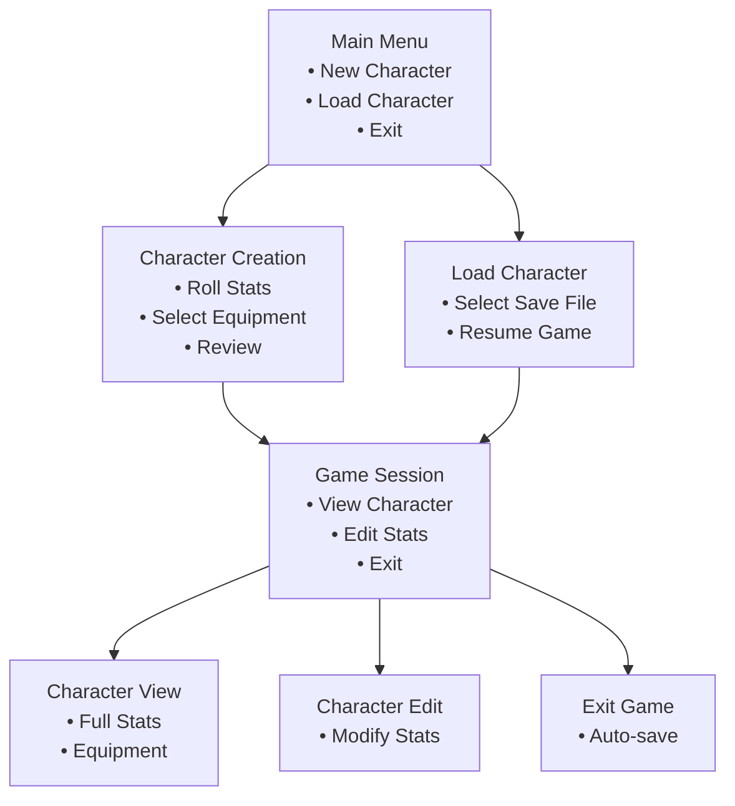
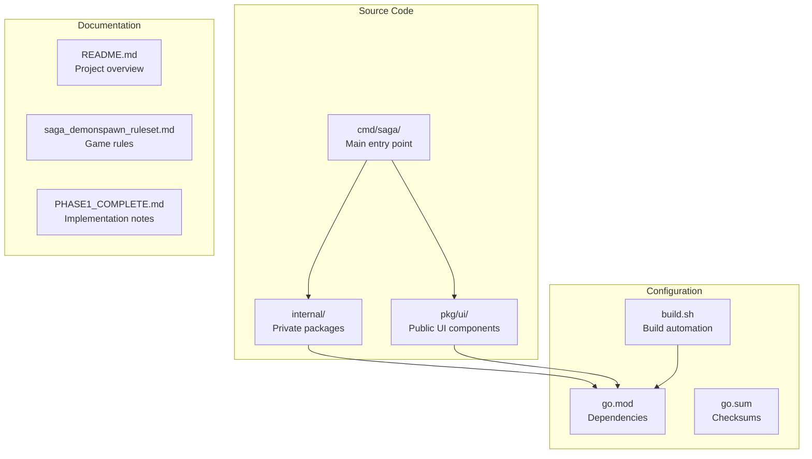

# Installation and Setup

<cite>
**Referenced Files in This Document**
- [README.md](file://README.md)
- [go.mod](file://go.mod)
- [go.sum](file://go.sum)
- [build.sh](file://build.sh)
- [cmd/saga/main.go](file://cmd/saga/main.go)
- [pkg/ui/model.go](file://pkg/ui/model.go)
- [saga_demonspawn_ruleset.md](file://saga_demonspawn_ruleset.md)
- [BUGFIX_CHARACTER_EDIT.md](file://BUGFIX_CHARACTER_EDIT.md)
- [PHASE1_COMPLETE.md](file://PHASE1_COMPLETE.md)
</cite>

## Table of Contents
1. [Introduction](#introduction)
2. [Prerequisites](#prerequisites)
3. [System Requirements](#system-requirements)
4. [Installation Steps](#installation-steps)
5. [Build Process](#build-process)
6. [Running the Application](#running-the-application)
7. [Environment Considerations](#environment-considerations)
8. [Troubleshooting](#troubleshooting)
9. [Advanced Options](#advanced-options)
10. [Project Structure Overview](#project-structure-overview)

## Introduction

The Saga of the Demonspawn is a command-line companion application built with Go and the Bubble Tea framework. This application serves as a rules engine and character management tool for players of the "Sagas of the Demonspawn" gamebook, providing automated calculations for combat, character stats, and game mechanics.

This installation guide will walk you through setting up the development environment, building the application from source, and running it on various platforms. Whether you're a beginner wanting to learn Go development or an experienced developer looking to contribute to the project, this guide provides comprehensive instructions.

## Prerequisites

### Go Programming Language (Version 1.24 or Higher)

The saga-demonspawn application requires Go 1.24 or later. This version requirement ensures compatibility with modern Go features and optimizations.

**Why Go 1.24+?**
- Modern Go features and performance improvements
- Enhanced module system capabilities
- Better cross-platform support
- Improved tooling and debugging features

**Installation Methods:**
- Download from [golang.org](https://golang.org/dl/)
- Use package managers (apt, brew, chocolatey)
- Use version managers (gvm, asdf)

### Basic Command-Line Proficiency

You should be comfortable with:
- Navigating directories using `cd`
- Running executables
- Using command-line arguments
- Understanding environment variables
- Basic file operations

### Terminal Compatibility

The application requires a terminal that supports:
- ANSI color codes
- Unicode characters
- Keyboard input handling
- Screen resizing capabilities

**Recommended Terminals:**
- macOS: Terminal.app or iTerm2
- Linux: GNOME Terminal, Konsole, or xterm
- Windows: Windows Terminal, PowerShell, or Git Bash

## System Requirements

### Operating System Support

The saga-demonspawn application is cross-platform and supports:
- **Windows**: Windows 10/11 (64-bit)
- **macOS**: macOS 10.14+ (Intel and Apple Silicon)
- **Linux**: Most modern distributions

### Hardware Requirements

Minimum system requirements:
- **Memory**: 512 MB RAM
- **Storage**: 100 MB free disk space
- **Processor**: Any modern CPU (Go applications are compiled binaries)

### Dependencies

The project manages all dependencies through Go modules. The primary external dependency is the Bubble Tea framework, which provides the terminal UI capabilities.

**Key Dependencies:**
- `github.com/charmbracelet/bubbletea` (UI framework)
- Various utility libraries for terminal handling
- Standard Go libraries

## Installation Steps

### Step 1: Clone the Repository

Begin by obtaining the source code from the GitHub repository:

```bash
# Clone the repository
git clone https://github.com/benoit/saga-demonspawn.git

# Change to the project directory
cd saga-demonspawn
```

**Verification:**
```bash
# Check the project structure
ls -la
```

Expected output should show the main directories and files:
```
drwxr-xr-x  12 user  staff   384 Oct 15 10:30 .
drwxr-xr-x   8 user  staff   256 Oct 15 10:30 ..
-rw-r--r--   1 user  staff  1800 Oct 15 10:30 README.md
-rw-r--r--   1 user  staff    28 Oct 15 10:30 go.mod
-rw-r--r--   1 user  staff   460 Oct 15 10:30 go.sum
-rwxr-xr-x   1 user  staff   150 Oct 15 10:30 build.sh
drwxr-xr-x   8 user  staff   256 Oct 15 10:30 cmd
drwxr-xr-x   4 user  staff   128 Oct 15 10:30 internal
drwxr-xr-x   9 user  staff   288 Oct 15 10:30 pkg
```

### Step 2: Verify Go Environment

Ensure your Go environment is properly configured:

```bash
# Check Go version
go version

# Verify GOPATH is set (modern Go uses module mode by default)
go env GOPATH
```

**Expected Output:**
```
go version go1.24.0
GOPATH=""
```

### Step 3: Initialize Go Modules

The project uses Go modules for dependency management. Initialize the module if needed:

```bash
# Initialize module (should already be done in cloned repo)
go mod init github.com/benoit/saga-demonspawn

# Download dependencies
go mod download
```

**Note:** The project already includes `go.mod` and `go.sum` files, so dependencies are pre-configured.

## Build Process

### Basic Build Command

The simplest way to build the application is using the standard Go build command:

```bash
# Build the application
go build -o saga ./cmd/saga
```

**Command Breakdown:**
- `go build`: The Go build tool
- `-o saga`: Output filename (creates `saga` executable)
- `./cmd/saga`: Target package (main application entry point)

### Using the Build Script

For convenience, the project includes a build script that automates the build process:

```bash
# Make the build script executable
chmod +x build.sh

# Run the build script
./build.sh
```

**Build Script Features:**
- Cleans old binary if present
- Builds the application with Go build
- Verifies the binary creation
- Provides helpful feedback

**Script Output Example:**
```
Cleaning old binary...
Building saga...
Verifying binary exists...
-rwxr-xr-x  1 user  staff  1234567 Oct 15 10:30 saga

✅ Build complete! Run with: ./saga
```

### Build Directory Structure

After successful compilation, the project structure will include:

```
saga-demonspawn/
├── cmd/saga/
│   └── main.go
├── internal/
│   ├── character/
│   ├── dice/
│   └── items/
├── pkg/ui/
├── saga          # <-- Binary executable
├── build.sh
├── go.mod
└── go.sum
```

## Running the Application

### Executable Permissions

Ensure the binary has execute permissions:

```bash
# On Unix-like systems
chmod +x saga

# On Windows, the executable should be executable by default
```

### Launching the Application

Run the application from the project root:

```bash
# Run the application
./saga
```

**First Launch Experience:**
1. The application starts with a main menu
2. Navigate using arrow keys or WASD controls
3. Select options with Enter
4. Exit with Escape or Q

### Application Interface

The application features a full-screen terminal interface built with the Bubble Tea framework:



**Diagram sources**
- [pkg/ui/model.go](file://pkg/ui/model.go#L9-L31)
- [cmd/saga/main.go](file://cmd/saga/main.go#L12-L24)

## Environment Considerations

### Terminal Requirements

The application relies on specific terminal capabilities:

**Required Features:**
- ANSI color support for visual feedback
- Unicode character rendering for icons and symbols
- Keyboard input detection for navigation
- Screen resize handling for responsive layouts

**Terminal Compatibility Matrix:**

| Feature | Windows | macOS | Linux |
|---------|---------|-------|-------|
| ANSI Colors | Windows Terminal, PowerShell | Terminal.app, iTerm2 | GNOME Terminal, Konsole |
| Unicode Support | Windows Terminal | Terminal.app, iTerm2 | Most terminals |
| Keyboard Input | Windows Terminal | Terminal.app | Most terminals |
| Screen Resizing | Windows Terminal | Terminal.app | Most terminals |

### Bubble Tea Framework Dependencies

The Bubble Tea framework requires several underlying libraries:

**Core Dependencies:**
- Terminal input/output handling
- Color and styling support
- Unicode text processing
- Cross-platform compatibility

**Optional Dependencies:**
- Clipboard integration (for copy/paste)
- Mouse support (enhanced navigation)
- Advanced terminal features

### Environment Variables

The application respects standard Go environment variables:

```bash
# GOPATH: Go workspace location
export GOPATH=/path/to/go

# GOBIN: Directory for installed binaries
export GOBIN=$GOPATH/bin

# PATH: Ensure GOBIN is in your PATH
export PATH=$PATH:$GOBIN
```

## Troubleshooting

### Common Build Issues

#### Issue 1: Go Version Too Old

**Symptoms:**
```
go: module requires Go 1.24 or later
```

**Solution:**
1. Download and install Go 1.24 or later
2. Update your PATH to use the new version
3. Verify with `go version`

#### Issue 2: Missing Dependencies

**Symptoms:**
```
cannot find package "github.com/charmbracelet/bubbletea"
```

**Solution:**
```bash
# Download and install dependencies
go mod download

# Alternatively, clean and reinstall
go clean -modcache
go mod tidy
```

#### Issue 3: Permission Denied

**Symptoms:**
```
permission denied: saga
```

**Solution:**
```bash
# Fix executable permissions
chmod +x saga

# Or rebuild with proper permissions
go build -o saga ./cmd/saga
```

### Runtime Issues

#### Issue 1: Terminal Not Supported

**Symptoms:**
- Garbled text or missing colors
- Keyboard input not recognized
- Screen artifacts

**Solution:**
1. Try a different terminal emulator
2. Enable ANSI support in your terminal
3. Check terminal compatibility settings

#### Issue 2: Character Display Problems

**Symptoms:**
- Question marks or boxes instead of characters
- Incorrect spacing or alignment

**Solution:**
1. Ensure your terminal supports UTF-8
2. Set appropriate locale variables:
   ```bash
   export LANG=en_US.UTF-8
   export LC_ALL=en_US.UTF-8
   ```
3. Use a font that supports Unicode characters

#### Issue 3: Application Crashes Immediately

**Symptoms:**
- Application exits without displaying anything
- Error messages appear briefly

**Solution:**
1. Run with verbose output:
   ```bash
   ./saga --verbose
   ```
2. Check system resources (memory, disk space)
3. Verify terminal capabilities

### Debugging Tips

#### Enable Debug Logging

For development builds, you can enable debug logging:

```bash
# Build with debug symbols
go build -gcflags="all=-N -l" -o saga-debug ./cmd/saga

# Run with debug output
./saga-debug
```

#### Check Dependencies

Verify all dependencies are properly installed:

```bash
# Show dependency tree
go list -m all

# Verify specific dependency
go list -f '{{.Dir}}' github.com/charmbracelet/bubbletea
```

## Advanced Options

### Optimized Builds

For production deployments, use build optimizations:

```bash
# Strip debug symbols and optimize
go build -ldflags="-s -w" -o saga-opt ./cmd/saga

# Static linking (single executable)
CGO_ENABLED=0 go build -ldflags="-s -w" -o saga-static ./cmd/saga
```

**Optimization Flags:**
- `-s`: Omit the symbol table and debug information
- `-w`: Omit the DWARF symbol table
- `-trimpath`: Remove local path prefixes

### Cross-Platform Builds

Build for different operating systems:

```bash
# Build for Windows
GOOS=windows GOARCH=amd64 go build -o saga.exe ./cmd/saga

# Build for macOS ARM64
GOOS=darwin GOARCH=arm64 go build -o saga-macos-arm64 ./cmd/saga

# Build for Linux ARM
GOOS=linux GOARCH=arm64 go build -o saga-linux-arm64 ./cmd/saga
```

### Custom Build Tags

Use build tags for specialized builds:

```bash
# Build with experimental features
go build -tags experimental -o saga-experimental ./cmd/saga

# Build without certain features
go build -tags no_magic -o saga-minimal ./cmd/saga
```

### Build Configuration

Create a custom build configuration:

```bash
# Set build variables
go build -ldflags="-X main.version=1.0.0 -X main.commit=$(git rev-parse HEAD)" \
         -o saga-versioned ./cmd/saga
```

## Project Structure Overview

Understanding the project structure helps with installation and customization:



**Diagram sources**
- [cmd/saga/main.go](file://cmd/saga/main.go#L1-L25)
- [pkg/ui/model.go](file://pkg/ui/model.go#L1-L95)
- [go.mod](file://go.mod#L1-L28)

### Key Directories

**`cmd/saga/`**: Contains the main application entry point and initialization logic.

**`internal/`**: Private packages containing core business logic:
- `character/`: Character creation, management, and persistence
- `dice/`: Random number generation and probability calculations
- `items/`: Equipment and inventory management

**`pkg/ui/`**: Public UI components built with Bubble Tea:
- `model.go`: Application state and screen management
- `update.go`: Event handling and state updates
- `view.go`: Rendering logic and UI composition

**`go.mod` and `go.sum`**: Go module configuration and dependency checksums.

**Section sources**
- [README.md](file://README.md#L71-L85)
- [cmd/saga/main.go](file://cmd/saga/main.go#L1-L25)
- [pkg/ui/model.go](file://pkg/ui/model.go#L1-L95)

### Dependency Management

The project uses Go modules for dependency management:

**go.mod Analysis:**
- Specifies Go version 1.24.0 requirement
- Lists all external dependencies with versions
- Uses indirect dependencies for transitive packages
- Includes toolchain specification for reproducible builds

**go.sum Verification:**
- Contains cryptographic checksums for all dependencies
- Ensures dependency integrity and security
- Prevents supply chain attacks

**Section sources**
- [go.mod](file://go.mod#L1-L28)
- [go.sum](file://go.sum#L1-L46)

## Conclusion

This installation and setup guide provides comprehensive instructions for getting the saga-demonspawn application running on your system. The application demonstrates modern Go development practices while serving as a practical tool for the "Sagas of the Demonspawn" gamebook.

Key takeaways:
- The project requires Go 1.24+ and basic command-line skills
- Multiple installation methods are available (direct build or build script)
- Terminal compatibility is crucial for the Bubble Tea UI
- Dependency management is handled automatically through Go modules
- Several troubleshooting options are available for common issues

For continued learning and contribution, refer to the project's README and implementation documentation. The application serves as an excellent example of Go best practices, including proper package organization, testing strategies, and UI development with Bubble Tea.