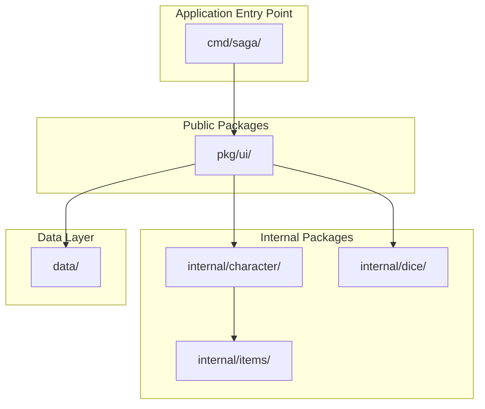

# Introduction

<cite>
**Referenced Files in This Document**
- [README.md](file://README.md)
- [go.mod](file://go.mod)
- [pkg/ui/model.go](file://pkg/ui/model.go)
- [internal/character/character.go](file://internal/character/character.go)
- [saga_demonspawn_ruleset.md](file://saga_demonspawn_ruleset.md)
- [pkg/ui/main_menu.go](file://pkg/ui/main_menu.go)
- [pkg/ui/character_creation.go](file://pkg/ui/character_creation.go)
- [internal/dice/dice.go](file://internal/dice/dice.go)
- [PHASE1_COMPLETE.md](file://PHASE1_COMPLETE.md)
- [CORRECTION.md](file://CORRECTION.md)
</cite>

## Table of Contents
1. [Project Overview](#project-overview)
2. [Target Audience](#target-audience)
3. [Core Value Proposition](#core-value-proposition)
4. [Educational Goals](#educational-goals)
5. [Key Features](#key-features)
6. [Game Mechanics Integration](#game-mechanics-integration)
7. [Technical Architecture](#technical-architecture)
8. [Development Philosophy](#development-philosophy)
9. [Future Roadmap](#future-roadmap)
10. [Getting Started](#getting-started)

## Project Overview

Sagas of the Demonspawn is a command-line companion application designed specifically for fans of the classic "Sagas of the Demonspawn" gamebook. Built with Go and the powerful Bubble Tea framework, this application serves as a comprehensive rules engine and character management tool that automates the complex calculations and mechanics of the original tabletop-style adventure game.

The project represents a modern digital interpretation of the gamebook experience, transforming manual calculations into automated, accurate gameplay while preserving the essence and challenge of the original ruleset. As a CLI application, it provides players with immediate access to character creation, stat management, and streamlined combat resolution without requiring internet connectivity or complex setup procedures.

**Section sources**
- [README.md](file://README.md#L1-L10)
- [go.mod](file://go.mod#L1-L10)

## Target Audience

### Primary Audience: Players and Gamemasters

The application is designed for two distinct groups within the gaming community:

**Players Seeking Enhanced Gameplay Experience**
- Fans of the "Sagas of the Demonspawn" gamebook who want to streamline their gameplay experience
- Those who appreciate the challenge of the original gamebook but desire automated calculation support
- Players who enjoy the strategic depth of the gamebook's mechanics but find manual calculations time-consuming
- Gamers who want to maintain the authenticity of the original rules while benefiting from technological assistance

**Gamemasters and Storytellers**
- Dungeon masters who want to focus on storytelling rather than mathematical computations
- Educators using the gamebook as a teaching tool for narrative design and probability
- Community organizers hosting gamebook events who need reliable calculation support
- Anyone interested in the mechanics of interactive fiction and branching narrative design

### Secondary Audience: Developers and Learners

**Go Programming Enthusiasts**
- Developers learning Go through practical application development
- Students studying software architecture and design patterns
- Contributors interested in open-source game development projects
- Professionals seeking examples of Bubble Tea framework implementation

**Game Development Practitioners**
- Indie game developers exploring text-based adventure mechanics
- Educational institutions teaching game design and implementation
- Hobbyists interested in retro gaming and gamebook preservation
- Software engineers wanting to understand procedural content generation

## Core Value Proposition

### Automated Game Mechanics

The application eliminates the tedium of manual calculations while maintaining the integrity of the original gamebook mechanics. Key automated systems include:

**Character Creation and Management**
- Automatic characteristic generation using 2d6 × 8 formula (16-96 range)
- Real-time Life Points (LP) calculation as sum of all characteristics
- Skill progression tracking with automatic modifier calculations
- Equipment management with protection value calculations

**Combat Resolution Engine**
- Initiative determination using SPD + CRG + LCK modifiers
- To-hit calculation with cumulative SKL and LUCK bonuses
- Damage calculation incorporating base rolls, STR bonuses, and weapon enhancements
- Death save mechanics with LUCK-based survival chances

**Magic System Integration**
- Power (POW) resource management with automatic regeneration
- Spell casting with natural inclination and fundamental failure rates
- Magic unlock progression during gameplay adventures
- Resource trading between LP and POW for strategic flexibility

### Accuracy and Consistency

The application ensures mathematical accuracy through:
- Deterministic random number generation for reproducible gameplay
- Strict adherence to original gamebook formulas and thresholds
- Comprehensive validation of input parameters and boundary conditions
- Error handling that prevents invalid game states

**Section sources**
- [README.md](file://README.md#L7-L12)
- [saga_demonspawn_ruleset.md](file://saga_demonspawn_ruleset.md#L1-L50)

## Educational Goals

### Go Development Mastery

The project serves as a comprehensive learning resource for Go programming, demonstrating industry-standard practices and architectural patterns:

**Core Go Concepts**
- Module initialization and dependency management with proper versioning
- Package organization principles with clear separation between internal and public packages
- Struct design patterns with embedded methods and receiver functions
- Interface-based polymorphism for testability and extensibility
- Robust error handling with explicit error returns and context preservation

**Testing Excellence**
- Table-driven test patterns for comprehensive coverage
- Test fixtures and golden files for regression testing
- Mock implementations using interfaces for deterministic testing
- Code coverage analysis and benchmark testing for performance validation

**Modern Development Practices**
- Clean code principles with separation of concerns
- Documentation comments following Go standards
- Idiomatic Go patterns for readability and maintainability
- Configuration management and environment-aware behavior

### Bubble Tea Framework Education

The application showcases advanced Bubble Tea framework concepts:

**Elm Architecture Implementation**
- Immutable state management with pure update functions
- Message passing system for event handling and state transitions
- Screen navigation with proper state isolation
- Keyboard-only navigation with accessibility considerations

**Terminal UI Development**
- Responsive layout management with dynamic terminal sizing
- Interactive form handling with real-time validation
- Multi-screen application architecture with state persistence
- User experience design principles for CLI applications

**Section sources**
- [README.md](file://README.md#L88-L115)
- [PHASE1_COMPLETE.md](file://PHASE1_COMPLETE.md#L149-L220)

## Key Features

### Phase 1: Foundation & Character Management (Complete)

**Character Creation System**
- Seven-characteristic generation using 2d6 × 8 formula (STR, SPD, STA, CRG, LCK, CHM, ATT)
- Equipment selection from predefined weapon and armor sets
- Automatic LP calculation as sum of all characteristics
- Three-step creation flow with review and confirmation
- Real-time stat modification with validation

**Character Management Interface**
- Comprehensive character sheet display showing all attributes
- Equipment visualization with protection calculations
- Progress tracking including enemies defeated and skill levels
- Magic system activation and power management
- Automatic saving with timestamped JSON files

**Save/Load System**
- Human-readable JSON format with proper struct tags
- Timestamped filenames for version control and backup
- Automatic saving on application exit
- Complete state preservation including equipment and progress

### Planned Phase 2: Combat System

**Advanced Combat Mechanics**
- Initiative determination with SPD + CRG + LCK modifiers
- To-hit calculation with cumulative SKL and LUCK bonuses (minimum 2)
- Damage calculation incorporating base rolls, STR bonuses, and weapon enhancements
- Stamina-based endurance with round limitations
- Death save mechanics with LUCK-based survival chances

**Enemy Management**
- Enemy database with configurable stats and abilities
- Manual entry system for custom encounters
- Combat log with turn-by-turn resolution
- Turn-based UI with clear visual feedback

### Planned Phase 3: Items & Inventory

**Equipment System**
- Comprehensive weapon collection with damage bonuses
- Armor and shield system with protection calculations
- Special item management (Healing Stone, Doombringer, The Orb)
- Inventory organization and weight management

**Item Effects**
- Healing Stone restoration mechanics (1d6 × 10 LP)
- Doombringer cursed blade with blood price and soul thirst
- The Orb dual-use functionality (held for damage doubling, thrown for instant kills)
- Item rarity and availability tracking

### Planned Phase 4: Magic System

**Spell Casting Mechanics**
- Power (POW) resource management with automatic regeneration
- Natural inclination checks before spellcasting
- Fundamental failure rate (FFR) with 6+ requirement
- Spell effect application with immediate resolution

**Magic Spells**
- Ten canonical spells with unique effects and power costs
- Strategic power economy with resource management
- Magic unlock progression during gameplay
- Spell restriction system preventing repetition

**Section sources**
- [README.md](file://README.md#L13-L55)
- [PHASE1_COMPLETE.md](file://PHASE1_COMPLETE.md#L8-L58)

## Game Mechanics Integration

### Character Statistics System

The application implements the original gamebook's characteristic system with precision:

**Core Characteristics (7 Attributes)**
- **Strength (STR)**: Physical power affecting damage calculations and carrying capacity
- **Speed (SPD)**: Agility and reaction speed influencing initiative and evasion
- **Stamina (STA)**: Endurance determining combat duration limits
- **Courage (CRG)**: Bravery affecting morale and resistance to fear
- **Luck (LCK)**: Fortune and chance modifiers affecting hit rolls and survival
- **Charm (CHM)**: Charisma and social influence capabilities
- **Attraction (ATT)**: Personal magnetism affecting social encounters

**Derived Values**
- **Life Points (LP)**: Health calculated as sum of all characteristics
- **Skill (SKL)**: Combat proficiency gained through enemy defeat
- **Power (POW)**: Magical energy acquired during adventure progression

### Combat Resolution System

**Initiative Calculation**
- Formula: 2d6 + SPD + CRG + LCK
- Determines first strike order in combat encounters
- Cumulative modifiers from multiple characteristics
- Automatic tie-breaking mechanisms

**To-Hit Mechanics**
- Base requirement: 7+ on 2d6 roll
- Skill modifier: 1 point reduction per 10 SKL points
- Luck modifier: 1 point reduction if LUCK ≥ 72
- Minimum hit threshold: 2 (absolute cap)
- Cumulative modifier application

**Damage Calculation**
- Base damage: (2d6 roll) × 5
- Strength bonus: +5 per 10 STR points
- Weapon bonus: Additional damage from equipped weapon
- Armor reduction: Protection from equipped armor and shield
- Final damage: Base + STR bonus + Weapon bonus - Armor

### Special Item Mechanics

**Doombringer (Cursed Blade)**
- Damage bonus: +20 (10 points above standard sword)
- Blood price: -10 LP per attack attempt
- Soul thirst: Heal LP equal to damage dealt (after reductions)
- Risk/reward balance with immediate consequences

**The Orb (Ancient Weapon)**
- Held effect: Double damage against Demonspawn
- Thrown effect: Instant kill (4+) or 200 damage (miss)
- Destruction upon use
- Strategic timing considerations

**Healing Stone**
- Restoration: 1d6 × 10 LP per use
- Limited uses between combat rounds
- Recharge: 48 hours cooldown
- Emergency healing resource

**Section sources**
- [saga_demonspawn_ruleset.md](file://saga_demonspawn_ruleset.md#L120-L170)
- [internal/character/character.go](file://internal/character/character.go#L15-L44)

## Technical Architecture

### Project Structure and Organization

The application follows Go's recommended project structure with clear separation of concerns:

**Diagram sources**
- [README.md](file://README.md#L71-L85)
- [pkg/ui/model.go](file://pkg/ui/model.go#L1-L30)

### Bubble Tea Framework Implementation

The UI architecture follows the Elm Architecture pattern with clear separation between model, view, and update logic:

**Model Structure**
- Centralized state management with immutable updates
- Screen-based state isolation for navigation
- Character data persistence across application lifecycle
- Dice roller integration for random events

**Screen Management**
- Main menu with New/Load/Exit options
- Character creation flow with three-step progression
- Game session interface for ongoing gameplay
- Character view and edit interfaces
- Future screens for combat, inventory, and magic

**Update System**
- Message-based event handling
- Keyboard navigation with arrow keys and shortcuts
- State transitions with proper validation
- Error handling with user-friendly feedback

### Dice Rolling System

The dice system provides abstraction for random number generation:

**Interface-Based Design**
- `Roller` interface enabling testable implementations
- Standard random generation for production use
- Seeded generation for deterministic testing
- Characteristic-specific rolling with 2d6 × 8 formula

**Random Number Generation**
- Math/rand package integration with proper seeding
- Deterministic sequences for testing and replay
- Performance optimization for frequent operations
- Boundary condition handling and validation

**Section sources**
- [pkg/ui/model.go](file://pkg/ui/model.go#L33-L95)
- [internal/dice/dice.go](file://internal/dice/dice.go#L11-L70)

## Development Philosophy

### Quality Assurance and Testing

The project emphasizes comprehensive testing and quality assurance:

**Testing Strategy**
- 80%+ code coverage for business logic
- Table-driven tests for exhaustive parameter validation
- Benchmark tests for performance monitoring
- Integration tests for UI workflows

**Error Handling**
- Explicit error returns with contextual information
- Validation before state modifications
- Graceful degradation for edge cases
- User-friendly error messages with recovery guidance

### Code Quality Standards

**Go Best Practices**
- Idiomatic Go naming conventions and package organization
- Proper struct embedding and method receiver usage
- Interface segregation for testability
- Defensive programming with input validation

**Documentation Excellence**
- Comprehensive inline documentation with godoc format
- README.md with installation, usage, and contribution guidelines
- Code comments explaining complex algorithms and business rules
- Architecture diagrams and flow charts for complex systems

### User Experience Design

**Accessibility and Usability**
- Keyboard-only navigation with clear visual feedback
- Responsive terminal adaptation with dynamic sizing
- Consistent navigation patterns across all screens
- Error prevention with real-time validation

**Learning Curve Management**
- Progressive feature introduction with clear tutorials
- Context-sensitive help and guidance
- Familiar gamebook terminology with clear explanations
- Gradual complexity increase with optional advanced features

**Section sources**
- [PHASE1_COMPLETE.md](file://PHASE1_COMPLETE.md#L149-L220)
- [CORRECTION.md](file://CORRECTION.md#L1-L71)

## Future Roadmap

### Phase 2: Combat System Implementation

**Combat Engine Development**
- Initiative calculation with SPD + CRG + LCK modifiers
- Hit determination with cumulative SKL and LUCK bonuses
- Damage calculation incorporating base rolls, STR bonuses, and weapon enhancements
- Stamina mechanics with endurance limits and rest requirements
- Death save system with LUCK-based survival probabilities

**Enemy Management System**
- Database of standard enemies with predefined stats
- Custom enemy creation with manual entry capabilities
- Encounter difficulty balancing and scaling
- Combat scenario scripting and automation

### Phase 3: Inventory and Equipment Management

**Equipment System Enhancement**
- Expanded weapon collection with rare and legendary items
- Advanced armor and shield system with weight and mobility penalties
- Item rarity and availability tracking
- Equipment upgrade and enhancement mechanics

**Resource Management**
- Inventory organization with categorization and sorting
- Weight and capacity management for backpack systems
- Item durability and repair mechanics
- Trading and bartering systems with NPC interactions

### Phase 4: Magic System Expansion

**Spell Casting Mechanics**
- Complete spell library with ten canonical spells
- Power economy management with strategic resource allocation
- Magic unlock progression tied to gameplay achievements
- Spell restriction system preventing repetition

**Advanced Magic Features**
- Spell research and discovery mechanics
- Magic item creation and enhancement
- Summoning and conjuration effects
- Area-of-effect and crowd-control spells

### Phase 5: Polish and Enhancement

**User Interface Refinement**
- Visual styling and theming system
- Help system with contextual guidance
- Configuration management for user preferences
- Accessibility improvements and internationalization

**Performance and Reliability**
- Memory optimization for large character databases
- Network connectivity for cloud saves and multiplayer features
- Backup and restore system for character data
- Analytics and usage tracking for feature improvement

## Getting Started

### Prerequisites and Installation

**System Requirements**
- Go 1.24.0 or later with proper GOPATH configuration
- Modern terminal emulator with Unicode support
- 80×24 character display minimum (recommended: 120×40)
- Internet connection for initial dependency downloads

**Installation Steps**
1. Clone the repository from GitHub
2. Navigate to the project directory
3. Build the application using Go build system
4. Execute the compiled binary for immediate use

### Basic Usage Patterns

**Character Creation Workflow**
1. Launch application and select "New Character"
2. Roll characteristics using 'r' key or individual rolls
3. Select starting equipment from weapon and armor options
4. Review character sheet and confirm creation
5. Begin gameplay with automatic character saving

**Ongoing Game Management**
1. Load existing characters from main menu
2. Edit stats using 'e' key from character view
3. Navigate between different game screens
4. Use keyboard shortcuts for efficient operation
5. Save progress automatically on exit

**Navigation and Controls**
- Arrow keys or vim-style hjkl for movement
- Enter key for selection and confirmation
- Escape key for cancellation and navigation back
- Ctrl+C for emergency exit and program termination

**Section sources**
- [README.md](file://README.md#L43-L70)
- [PHASE1_COMPLETE.md](file://PHASE1_COMPLETE.md#L69-L114)