# Component Orchestration

<cite>
**Referenced Files in This Document**
- [pkg/ui/model.go](file://pkg/ui/model.go)
- [pkg/ui/update.go](file://pkg/ui/update.go)
- [pkg/ui/main_menu.go](file://pkg/ui/main_menu.go)
- [pkg/ui/character_creation.go](file://pkg/ui/character_creation.go)
- [pkg/ui/game_session.go](file://pkg/ui/game_session.go)
- [pkg/ui/load_character.go](file://pkg/ui/load_character.go)
- [pkg/ui/character_view.go](file://pkg/ui/character_view.go)
- [pkg/ui/character_edit.go](file://pkg/ui/character_edit.go)
- [internal/dice/dice.go](file://internal/dice/dice.go)
- [internal/character/character.go](file://internal/character/character.go)
- [internal/items/items.go](file://internal/items/items.go)
- [README.md](file://README.md)
</cite>

## Table of Contents
1. [Introduction](#introduction)
2. [System Architecture Overview](#system-architecture-overview)
3. [Root Model Orchestration](#root-model-orchestration)
4. [Screen-Specific Component Architecture](#screen-specific-component-architecture)
5. [State Delegation Patterns](#state-delegation-patterns)
6. [Dependency Injection Mechanism](#dependency-injection-mechanism)
7. [Integration Patterns](#integration-patterns)
8. [Architectural Trade-offs](#architectural-trade-offs)
9. [Scalability Considerations](#scalability-considerations)
10. [Testing and Testability](#testing-and-testability)
11. [Conclusion](#conclusion)

## Introduction

The saga-demonspawn application implements a sophisticated component orchestration system built around the Bubble Tea framework's Elm Architecture pattern. The system demonstrates a monolithic Model approach that coordinates multiple screen-specific components while maintaining clear separation of concerns between navigation, data, and presentation layers.

The architecture centers around a root `Model` struct that embeds screen-specific models and delegates state management responsibilities, creating a cohesive yet modular UI system that handles character management, dice rolling, and game progression through a unified state coordination mechanism.

## System Architecture Overview

The saga-demonspawn architecture follows a layered approach with clear boundaries between presentation, business logic, and data persistence layers:

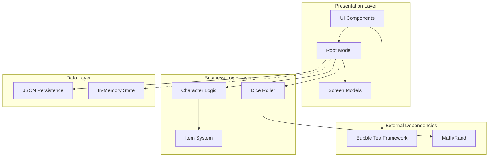

**Diagram sources**
- [pkg/ui/model.go](file://pkg/ui/model.go#L33-L95)
- [internal/character/character.go](file://internal/character/character.go#L14-L355)
- [internal/dice/dice.go](file://internal/dice/dice.go#L11-L27)

The system implements a hub-and-spoke architecture where the root Model acts as the central coordinator, while specialized screen models handle specific UI concerns. This design enables clear separation of responsibilities while maintaining tight integration between components.

**Section sources**
- [pkg/ui/model.go](file://pkg/ui/model.go#L1-L95)
- [README.md](file://README.md#L72-L85)

## Root Model Orchestration

The root `Model` struct serves as the central orchestrator for the entire application, embedding all screen-specific models and coordinating state transitions across the UI:

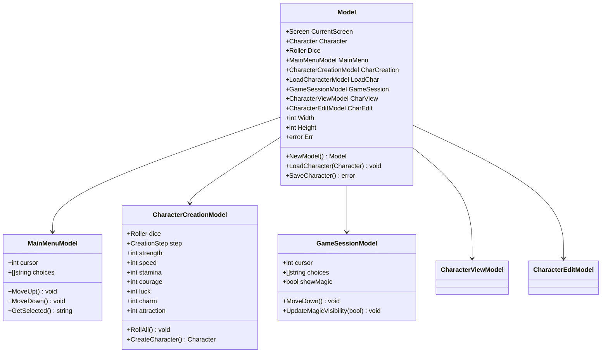

**Diagram sources**
- [pkg/ui/model.go](file://pkg/ui/model.go#L33-L95)
- [pkg/ui/main_menu.go](file://pkg/ui/main_menu.go#L4-L49)
- [pkg/ui/character_creation.go](file://pkg/ui/character_creation.go#L21-L279)
- [pkg/ui/game_session.go](file://pkg/ui/game_session.go#L3-L77)

The root Model implements several key orchestration responsibilities:

### Screen Navigation Coordination
The Model maintains a `CurrentScreen` field that determines which screen-specific model receives user input and renders the current view. The `Update` method delegates keypress handling to the appropriate screen handler based on the current screen state.

### State Synchronization
The Model ensures consistency across screen-specific models by synchronizing shared state. For example, when a character is loaded, the Model updates both the `CharView` and `CharEdit` models to reflect the new character state.

### Resource Management
The Model manages shared resources like the dice roller, which is injected into multiple screen models to ensure consistent random number generation across the application.

**Section sources**
- [pkg/ui/model.go](file://pkg/ui/model.go#L33-L95)
- [pkg/ui/update.go](file://pkg/ui/update.go#L16-L329)

## Screen-Specific Component Architecture

Each screen in the application implements its own dedicated model with specialized state management:

### Main Menu Architecture
The `MainMenuModel` manages the primary navigation interface with cursor-based selection:

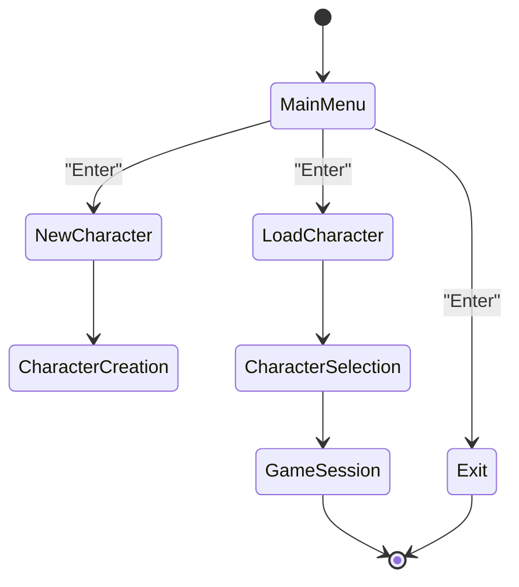

**Diagram sources**
- [pkg/ui/main_menu.go](file://pkg/ui/main_menu.go#L10-L49)
- [pkg/ui/update.go](file://pkg/ui/update.go#L58-L81)

### Character Creation Flow
The `CharacterCreationModel` implements a multi-step workflow with state validation:

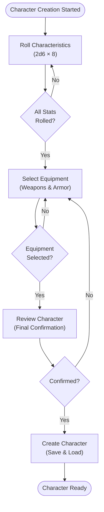

**Diagram sources**
- [pkg/ui/character_creation.go](file://pkg/ui/character_creation.go#L12-L19)
- [pkg/ui/character_creation.go](file://pkg/ui/character_creation.go#L121-L130)

### Character Editing System
The `CharacterEditModel` provides granular character modification with input validation:

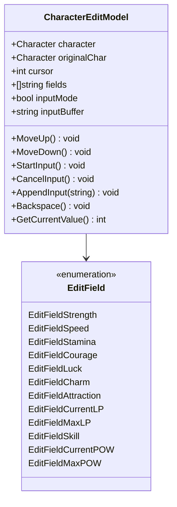

**Diagram sources**
- [pkg/ui/character_edit.go](file://pkg/ui/character_edit.go#L5-L21)
- [pkg/ui/character_edit.go](file://pkg/ui/character_edit.go#L23-L173)

**Section sources**
- [pkg/ui/main_menu.go](file://pkg/ui/main_menu.go#L1-L49)
- [pkg/ui/character_creation.go](file://pkg/ui/character_creation.go#L1-L279)
- [pkg/ui/character_edit.go](file://pkg/ui/character_edit.go#L1-L173)

## State Delegation Patterns

The application implements several state delegation patterns that distribute responsibility across the component hierarchy:

### Hierarchical State Management
State flows from the root Model to screen-specific models, with bidirectional communication for user actions:

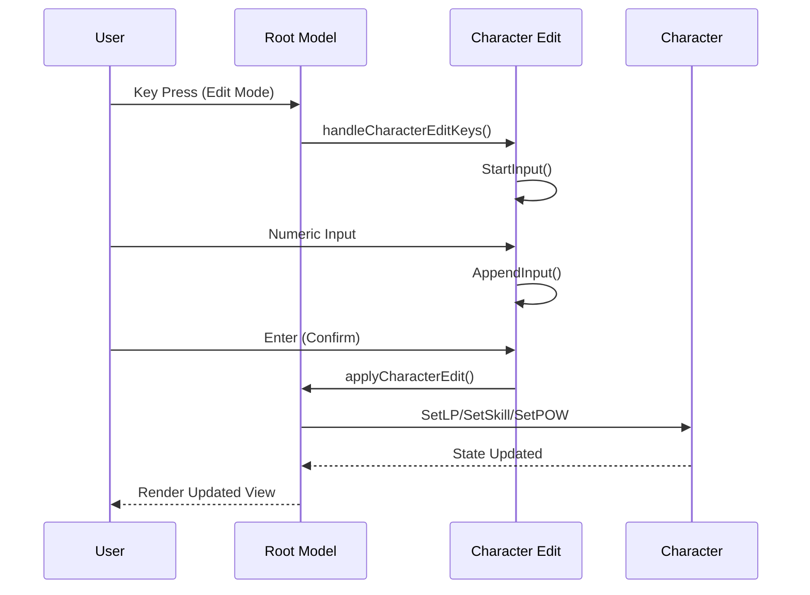

**Diagram sources**
- [pkg/ui/update.go](file://pkg/ui/update.go#L234-L278)
- [pkg/ui/update.go](file://pkg/ui/update.go#L280-L329)

### Shared State Synchronization
The Model ensures that character state changes are propagated to all relevant screen models:

| Operation | Source Model | Target Models | Purpose |
|-----------|--------------|---------------|---------|
| Character Load | Model.LoadCharacter | CharView, CharEdit | Sync character display |
| Stat Modification | CharEdit | Model, CharView | Update derived values |
| Magic Unlocked | GameSession | GameSession, CharEdit | Enable/disable POW fields |
| Save Operation | Model.SaveCharacter | Character | Persist state changes |

### Event-Driven Communication
Screen models communicate through the root Model's event system, which routes messages based on the current screen context:

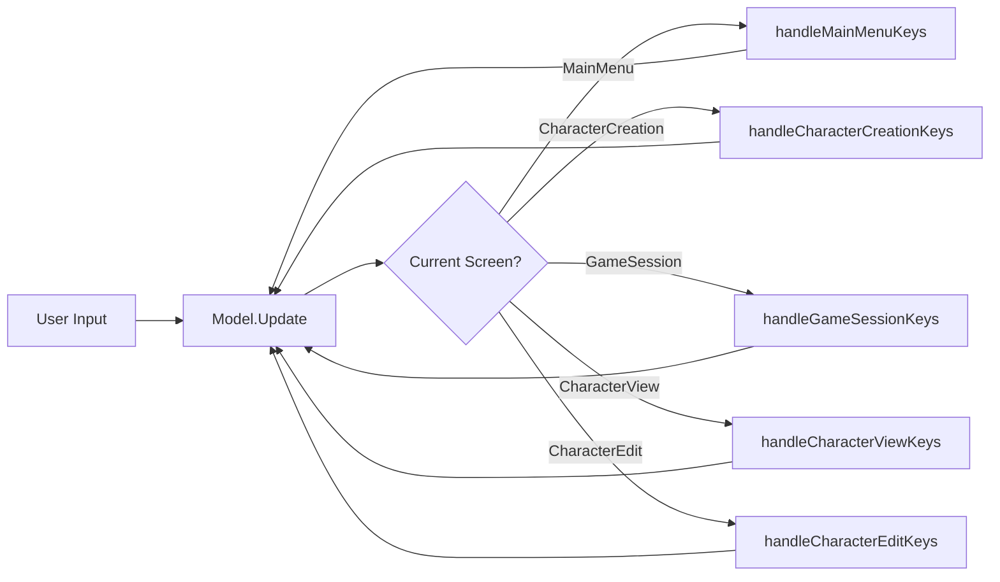

**Diagram sources**
- [pkg/ui/update.go](file://pkg/ui/update.go#L32-L56)

**Section sources**
- [pkg/ui/update.go](file://pkg/ui/update.go#L32-L329)
- [pkg/ui/model.go](file://pkg/ui/model.go#L78-L95)

## Dependency Injection Mechanism

The application implements a clean dependency injection pattern through the `dice.Roller` interface, enabling testability and flexibility:

### Interface-Based Design
The `Roller` interface abstracts random number generation, allowing for different implementations:

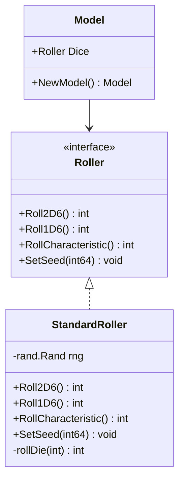

**Diagram sources**
- [internal/dice/dice.go](file://internal/dice/dice.go#L11-L27)
- [internal/dice/dice.go](file://internal/dice/dice.go#L29-L76)
- [pkg/ui/model.go](file://pkg/ui/model.go#L41-L42)

### Constructor Injection Pattern
Dependencies are injected through constructor functions, ensuring proper initialization:

| Component | Dependency | Injection Method | Purpose |
|-----------|------------|------------------|---------|
| Model | StandardRoller | NewModel() | Central dice management |
| CharacterCreationModel | Roller | NewCharacterCreationModel(Roller) | Character stat rolling |
| StandardRoller | rand.Rand | NewStandardRoller() | Production randomization |
| StandardRoller | rand.Rand | NewSeededRoller(int64) | Deterministic testing |

### Testability Benefits
The interface-based design enables comprehensive testing through mock implementations:

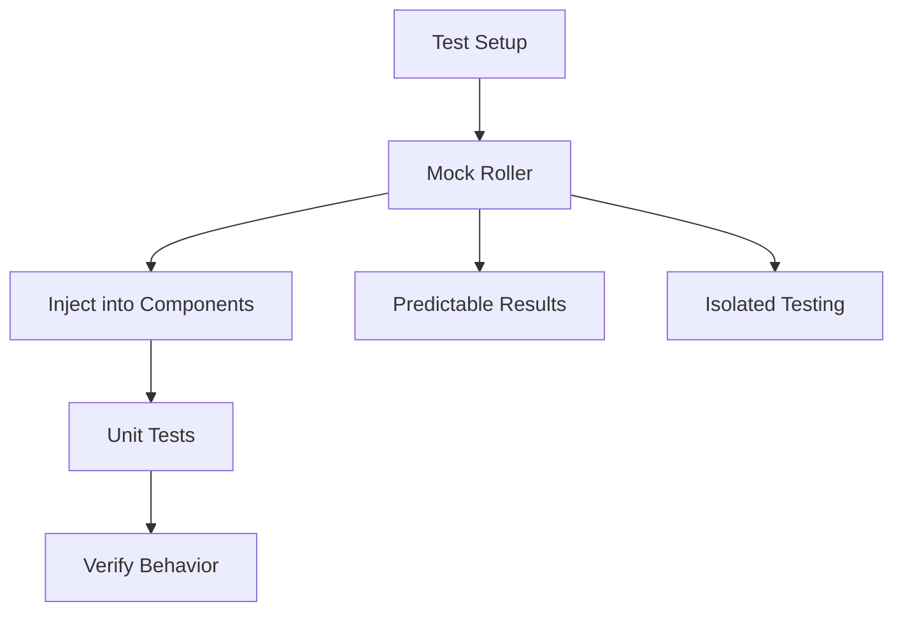

**Diagram sources**
- [internal/dice/dice.go](file://internal/dice/dice.go#L41-L47)

**Section sources**
- [internal/dice/dice.go](file://internal/dice/dice.go#L1-L97)
- [pkg/ui/model.go](file://pkg/ui/model.go#L58-L76)

## Integration Patterns

The application demonstrates several integration patterns that connect UI components with business logic:

### Character State Integration
Character state changes are synchronized across all views through the root Model:

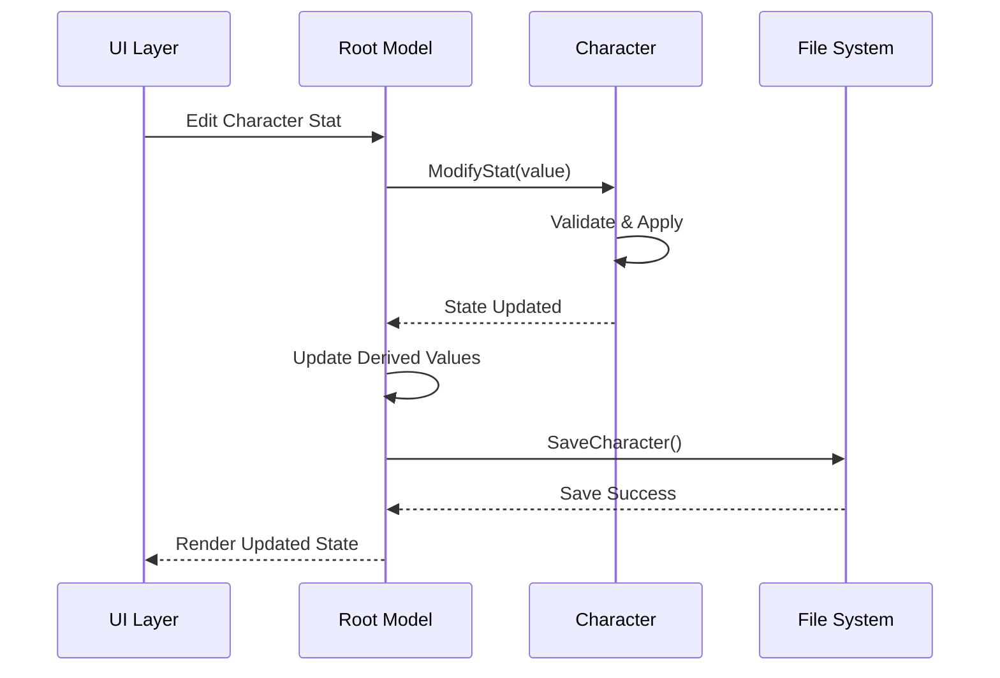

**Diagram sources**
- [pkg/ui/update.go](file://pkg/ui/update.go#L280-L329)
- [internal/character/character.go](file://internal/character/character.go#L113-L182)

### Dice Rolling Integration
The dice system integrates with character creation and potential future combat systems:

| Integration Point | Component | Purpose | Implementation |
|-------------------|-----------|---------|----------------|
| Character Creation | CharacterCreationModel | Stat generation | RollCharacteristic() |
| Future Combat | Combat System | Initiative & Damage | Roll2D6(), Roll1D6() |
| Magic System | Magic System | Spellcasting | Roll2D6() with modifiers |
| Random Events | Game Session | Encounter resolution | Roll2D6() with context |

### Item System Integration
The item system integrates with character equipment management:

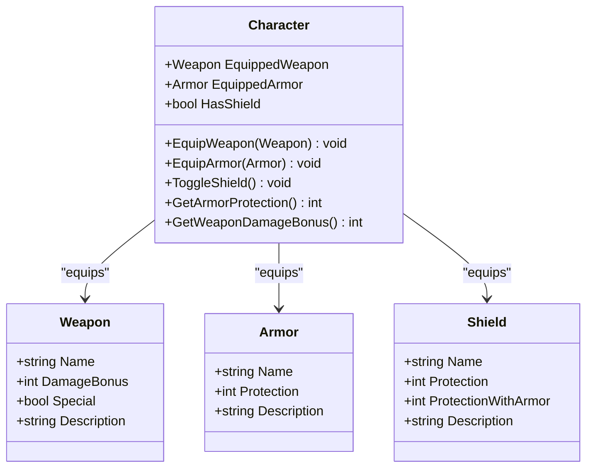

**Diagram sources**
- [internal/character/character.go](file://internal/character/character.go#L35-L39)
- [internal/items/items.go](file://internal/items/items.go#L20-L52)

**Section sources**
- [internal/character/character.go](file://internal/character/character.go#L1-L355)
- [internal/items/items.go](file://internal/items/items.go#L1-L257)
- [pkg/ui/update.go](file://pkg/ui/update.go#L280-L329)

## Architectural Trade-offs

The monolithic Model approach presents several architectural trade-offs that impact system design and future extensibility:

### Monolithic vs. Decentralized State Management

| Aspect | Monolithic Model Approach | Decentralized State Management |
|--------|---------------------------|--------------------------------|
| **Pros** | Single source of truth, consistent state | Modular independence, loose coupling |
| **Cons** | Potential for bloated root model | Risk of inconsistent state, complex coordination |
| **Maintainability** | Easier to track state flow | Harder to trace state changes |
| **Performance** | Centralized updates, potential bottlenecks | Distributed updates, better scalability |
| **Testing** | Easier to test complete workflows | Harder to isolate components |

### Benefits of Monolithic Approach
- **Centralized State Management**: All application state resides in one place, making it easier to track changes and debug state-related issues.
- **Consistent User Experience**: Screen transitions and state synchronization are handled uniformly through the root Model.
- **Simplified Navigation**: The CurrentScreen field provides clear control flow for routing user interactions.

### Drawbacks of Monolithic Approach
- **Potential Bloat**: As the application grows, the root Model may become unwieldy with increasing complexity.
- **Tight Coupling**: Screen models remain tightly coupled to the root Model, limiting independent development.
- **Testing Complexity**: Comprehensive testing requires mocking the entire Model hierarchy.

### Alternative Approaches Considered
A decentralized state management approach could distribute responsibilities across specialized models, potentially improving modularity but at the cost of increased complexity in state coordination.

**Section sources**
- [pkg/ui/model.go](file://pkg/ui/model.go#L33-L95)

## Scalability Considerations

The current architecture provides a solid foundation for future feature additions, particularly for the planned combat and inventory systems:

### Combat System Integration
Future combat functionality would integrate with the existing dice system and character state:

```mermaid
flowchart TD
CombatStart[Combat Initiated] --> InitiativeRoll[Roll Initiative<br/>2d6 + SPD + CRG + LCK]
InitiativeRoll --> OrderCombatants[Order Combatants]
OrderCombatants --> TurnLoop{Turn Loop}
TurnLoop --> PlayerTurn[Player Turn]
PlayerTurn --> AttackChoice[Choose Attack]
AttackChoice --> HitRoll[To-Hit Roll<br/>7+ on 2d6 + SKL/LCK]
HitRoll --> HitSuccess{Hit?}
HitSuccess --> |No| NextTurn[Next Turn]
HitSuccess --> |Yes| DamageCalc[Calculate Damage<br/>(Roll × 5) + STR + Weapon - Armor]
DamageCalc --> ApplyDamage[Apply Damage]
ApplyDamage --> CheckDeath[Check Death Status]
CheckDeath --> NextTurn
TurnLoop --> EnemyTurn[Enemy Turn]
EnemyTurn --> NextTurn
NextTurn --> TurnLoop
```

### Inventory System Architecture
The inventory system would extend the item system with additional state management:

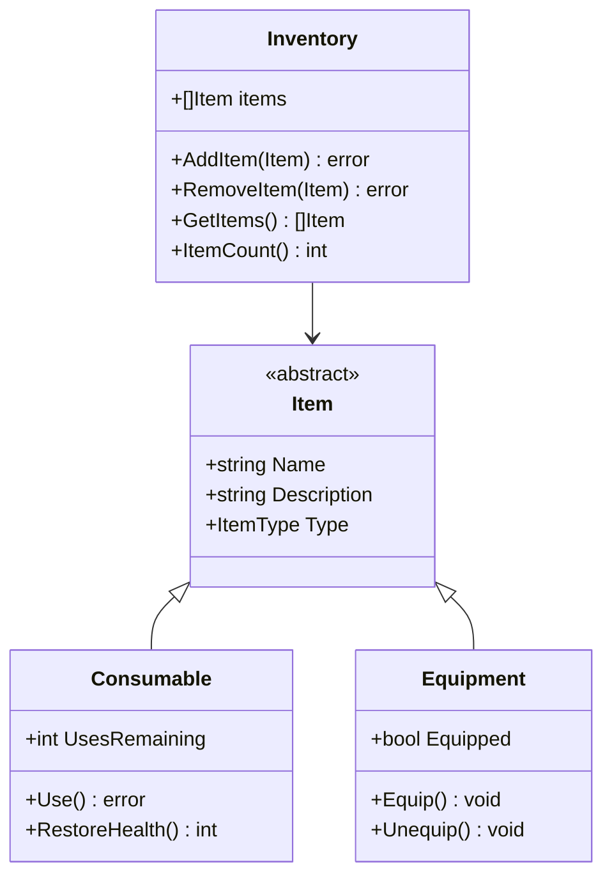

### Future Feature Extensions
The architecture supports incremental feature development through well-defined extension points:

| Feature | Extension Point | Integration Pattern | Complexity Impact |
|---------|-----------------|-------------------|-------------------|
| Combat System | Dice.Roller interface | Existing randomization | Medium - modifies state flow |
| Inventory Management | Character.Items field | Extends item system | Low - additive functionality |
| Magic System | Character.MagicUnlocked | Conditional visibility | Low - UI-only changes |
| Save/Load Enhancement | JSON serialization | Extends current persistence | Medium - data migration |

### Performance Considerations
As the application scales, several performance factors become important:

- **State Serialization**: Character state grows with feature additions, impacting save/load performance
- **Memory Usage**: Screen models accumulate state, requiring careful memory management
- **Rendering Performance**: Complex character sheets may require optimization for large datasets

**Section sources**
- [README.md](file://README.md#L22-L56)
- [internal/character/character.go](file://internal/character/character.go#L35-L39)

## Testing and Testability

The architecture's interface-based design significantly enhances testability through dependency injection and abstraction:

### Mock Implementation Strategy
The `Roller` interface enables comprehensive testing through mock implementations:

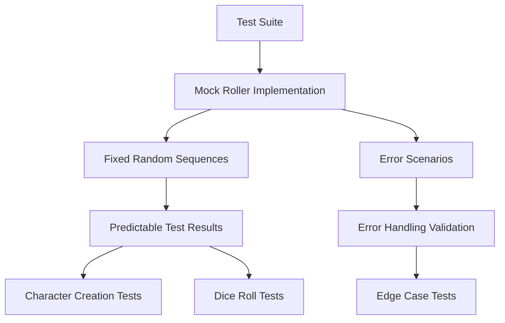

### Test Coverage Areas
The architecture supports testing across multiple layers:

| Test Level | Coverage Area | Implementation Strategy |
|------------|---------------|------------------------|
| **Unit Tests** | Individual functions, methods | Mock dependencies, isolated testing |
| **Integration Tests** | Component interactions | Real dependencies, realistic scenarios |
| **UI Tests** | Screen transitions, user flows | End-to-end testing with simulated input |
| **State Tests** | State consistency, synchronization | Comprehensive state validation |

### Testing Benefits
The interface-based architecture provides several testing advantages:

- **Deterministic Testing**: Mock implementations enable predictable test outcomes
- **Isolation**: Components can be tested independently of external dependencies
- **Comprehensive Coverage**: All code paths can be exercised through controlled inputs
- **Regression Prevention**: Automated tests catch breaking changes early

**Section sources**
- [internal/dice/dice.go](file://internal/dice/dice.go#L1-L97)

## Conclusion

The saga-demonspawn component orchestration system demonstrates a well-designed approach to building complex terminal applications with clear architectural principles. The monolithic Model approach, combined with strategic dependency injection and state delegation patterns, creates a maintainable and extensible foundation for the application.

Key architectural strengths include:

- **Clear Separation of Concerns**: Distinct layers for presentation, business logic, and data management
- **Interface-Based Design**: Enables testability and future extensibility through abstraction
- **Event-Driven Communication**: Maintains loose coupling between components while ensuring coordination
- **State Synchronization**: Ensures consistency across screen-specific models through centralized coordination

The architecture successfully balances simplicity with functionality, providing a solid foundation for the planned combat, inventory, and magic systems. While the monolithic approach may present challenges as the application grows, the current design demonstrates excellent engineering practices and thoughtful consideration of long-term maintainability.

The system's modular structure and well-defined extension points position it well for future feature development, while the comprehensive testing strategy ensures reliability and stability as new functionality is added. This architectural approach serves as an excellent example of applying modern Go development practices to create robust, maintainable terminal applications.