# State Management

<cite>
**Referenced Files in This Document**
- [pkg/ui/model.go](file://pkg/ui/model.go)
- [pkg/ui/main_menu.go](file://pkg/ui/main_menu.go)
- [pkg/ui/character_creation.go](file://pkg/ui/character_creation.go)
- [pkg/ui/game_session.go](file://pkg/ui/game_session.go)
- [pkg/ui/load_character.go](file://pkg/ui/load_character.go)
- [pkg/ui/character_view.go](file://pkg/ui/character_view.go)
- [pkg/ui/character_edit.go](file://pkg/ui/character_edit.go)
- [pkg/ui/update.go](file://pkg/ui/update.go)
- [internal/character/character.go](file://internal/character/character.go)
- [internal/dice/dice.go](file://internal/dice/dice.go)
</cite>

## Table of Contents
1. [Introduction](#introduction)
2. [Model Architecture Overview](#model-architecture-overview)
3. [Core Model Structure](#core-model-structure)
4. [Screen-Specific Models](#screen-specific-models)
5. [State Initialization Process](#state-initialization-process)
6. [Entity Relationships](#entity-relationships)
7. [Data Validation and Constraints](#data-validation-and-constraints)
8. [Pointer Management and Referential Integrity](#pointer-management-and-referential-integrity)
9. [Elm Architecture Pattern Implementation](#elm-architecture-pattern-implementation)
10. [State Transition Patterns](#state-transition-patterns)
11. [Performance Considerations](#performance-considerations)
12. [Troubleshooting Guide](#troubleshooting-guide)
13. [Conclusion](#conclusion)

## Introduction

The Saga of the Demonspawn application implements a sophisticated state management system built around the Elm Architecture pattern using the Bubble Tea framework. The core Model struct serves as the single source of truth for all application state, orchestrating navigation between screens, managing character data, and coordinating dependencies between UI components.

This documentation explores the hierarchical state structure, entity relationships, and data flow patterns that enable seamless navigation and state persistence throughout the application lifecycle. The system demonstrates advanced Go patterns including interface-based dependency injection, pointer-based referential integrity, and immutable state updates.

## Model Architecture Overview

The state management architecture follows a hierarchical structure where the root Model coordinates multiple specialized screen models while maintaining a centralized state authority. This design ensures clean separation of concerns while enabling efficient state synchronization across the application.

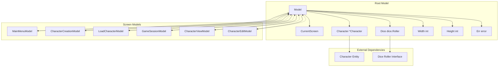

**Diagram sources**
- [pkg/ui/model.go](file://pkg/ui/model.go#L33-L56)
- [pkg/ui/main_menu.go](file://pkg/ui/main_menu.go#L4-L6)
- [pkg/ui/character_creation.go](file://pkg/ui/character_creation.go#L21-L44)
- [pkg/ui/game_session.go](file://pkg/ui/game_session.go#L3-L8)

## Core Model Structure

The Model struct serves as the central orchestrator of application state, containing both navigation state and embedded screen models. Its design emphasizes immutability and clear data flow patterns.

### Field Definitions

| Field | Type | Purpose | Constraints |
|-------|------|---------|-------------|
| `CurrentScreen` | `Screen` | Tracks active screen navigation | Must be valid Screen constant |
| `Character` | `*character.Character` | Currently loaded character | Nil when no character loaded |
| `Dice` | `dice.Roller` | Injectable dependency for randomness | Must implement Roller interface |
| `MainMenu` | `MainMenuModel` | Main menu navigation state | Embedded, managed by root |
| `CharCreation` | `CharacterCreationModel` | Character creation flow state | Embedded, managed by root |
| `LoadChar` | `LoadCharacterModel` | Character loading screen state | Embedded, managed by root |
| `GameSession` | `GameSessionModel` | Game session menu state | Embedded, managed by root |
| `CharView` | `CharacterViewModel` | Character display state | Embedded, managed by root |
| `CharEdit` | `CharacterEditModel` | Character editing state | Embedded, managed by root |
| `Width` | `int` | Terminal width for responsive layout | Positive integer |
| `Height` | `int` | Terminal height for responsive layout | Positive integer |
| `Err` | `error` | Last encountered error state | Nil when no error |

### Navigation State Management

The `CurrentScreen` field implements a type-safe enumeration system that controls which screen is active. The Screen type provides clear boundaries between different application states:

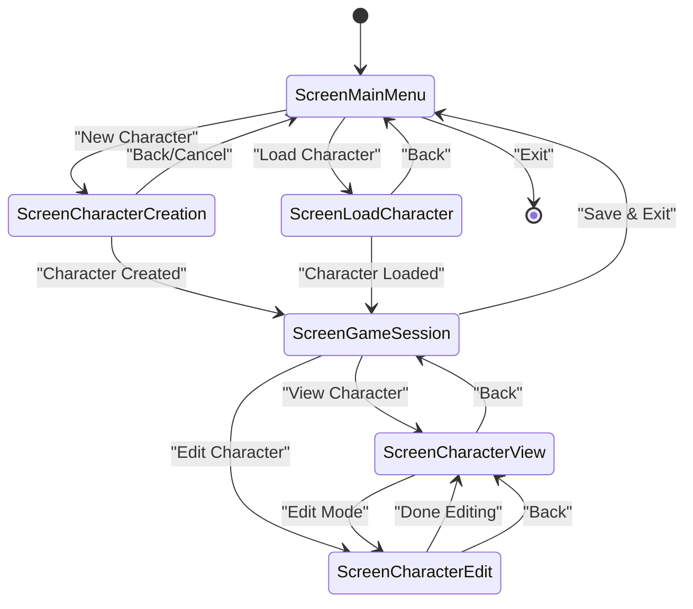

**Section sources**
- [pkg/ui/model.go](file://pkg/ui/model.go#L9-L31)
- [pkg/ui/model.go](file://pkg/ui/model.go#L33-L56)

## Screen-Specific Models

Each screen maintains its own dedicated state model, encapsulating navigation state, user input, and temporary data specific to that screen's functionality.

### MainMenuModel

The MainMenuModel manages the primary navigation interface with cursor-based selection:

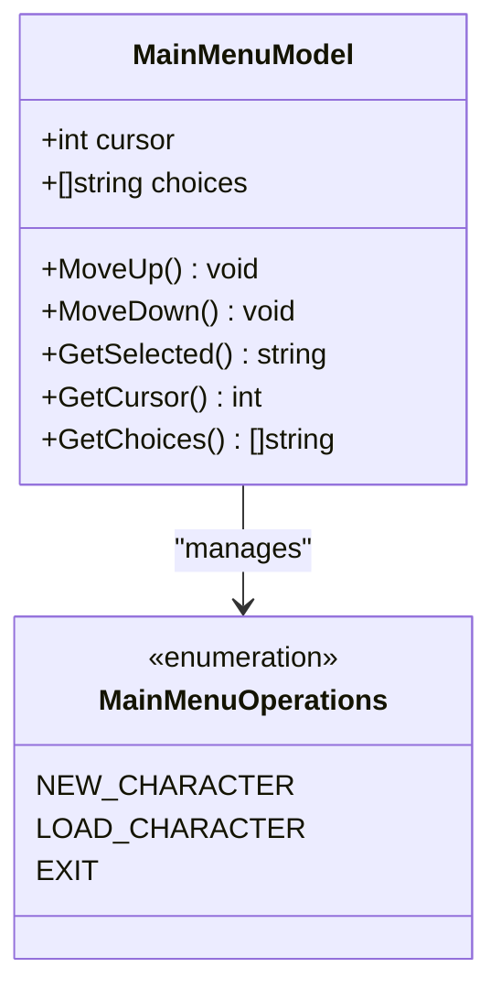

**Diagram sources**
- [pkg/ui/main_menu.go](file://pkg/ui/main_menu.go#L4-L49)

### CharacterCreationModel

The CharacterCreationModel orchestrates the multi-step character creation process with comprehensive state tracking:

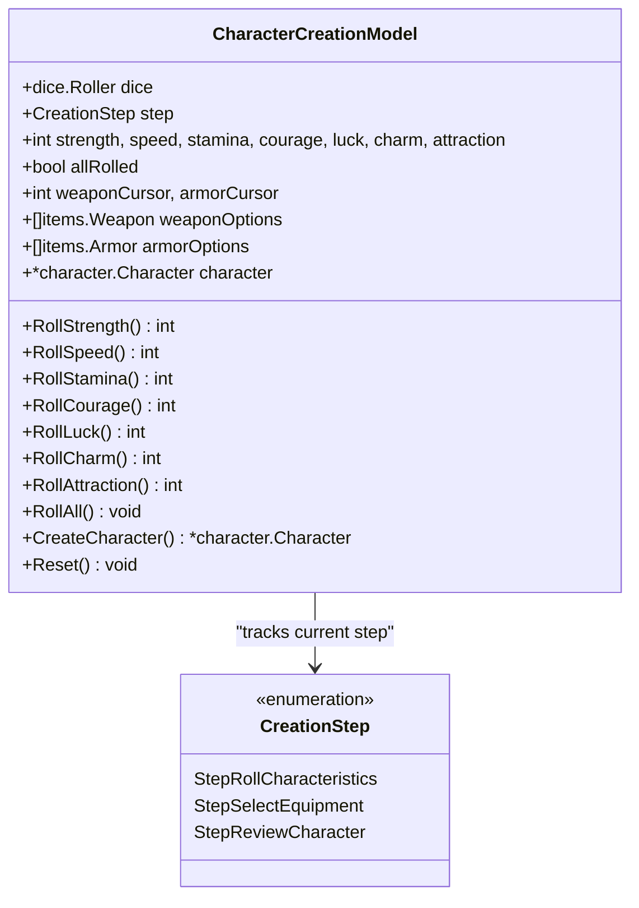

**Diagram sources**
- [pkg/ui/character_creation.go](file://pkg/ui/character_creation.go#L21-L44)

### GameSessionModel

The GameSessionModel manages the main game menu with dynamic visibility based on character progression:

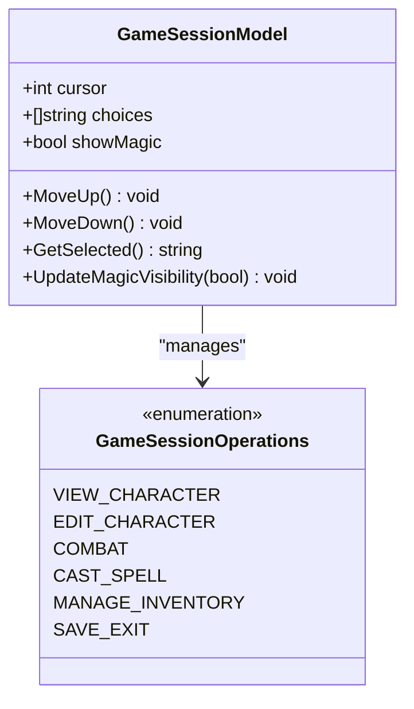

**Diagram sources**
- [pkg/ui/game_session.go](file://pkg/ui/game_session.go#L3-L77)

### Supporting Models

The remaining models (LoadCharacterModel, CharacterViewModel, CharacterEditModel) provide specialized state management for their respective screens:

- **LoadCharacterModel**: File system navigation and character loading
- **CharacterViewModel**: Character display state with minimal mutation
- **CharacterEditModel**: Interactive character editing with input buffering

**Section sources**
- [pkg/ui/main_menu.go](file://pkg/ui/main_menu.go#L4-L49)
- [pkg/ui/character_creation.go](file://pkg/ui/character_creation.go#L21-L279)
- [pkg/ui/game_session.go](file://pkg/ui/game_session.go#L3-L77)
- [pkg/ui/load_character.go](file://pkg/ui/load_character.go#L10-L97)
- [pkg/ui/character_view.go](file://pkg/ui/character_view.go#L6-L26)
- [pkg/ui/character_edit.go](file://pkg/ui/character_edit.go#L24-L173)

## State Initialization Process

The NewModel() function establishes the initial application state with proper dependency injection and model instantiation:

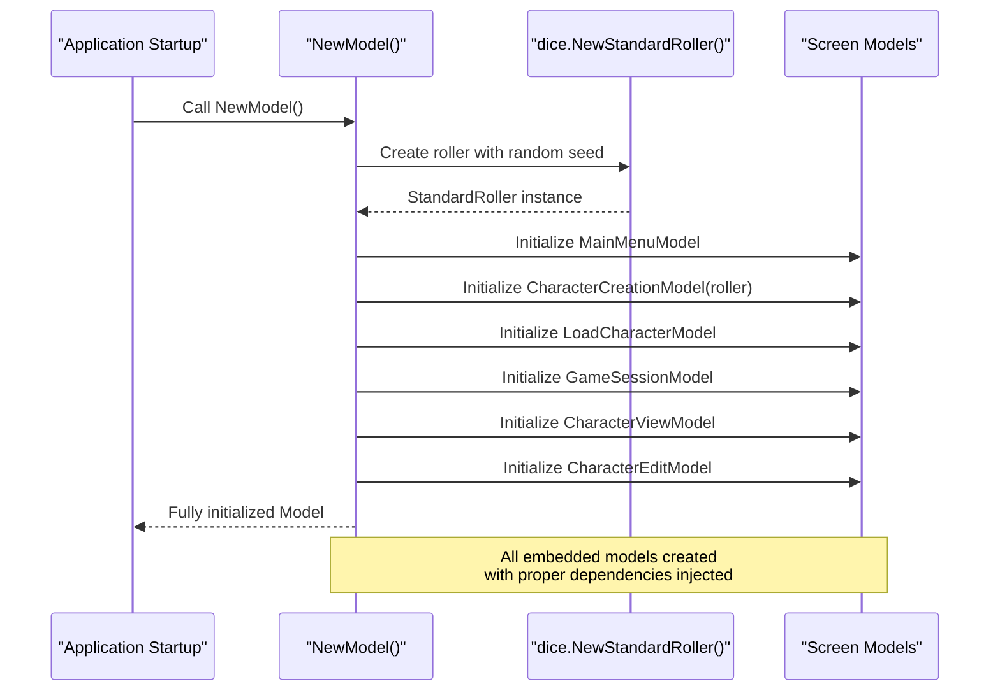

**Diagram sources**
- [pkg/ui/model.go](file://pkg/ui/model.go#L58-L76)

### Initialization Sequence Details

The initialization process follows a specific order to ensure proper dependency resolution:

1. **Dice Roller Creation**: Establishes the random number generation dependency
2. **Screen Model Instantiation**: Creates each screen model with appropriate parameters
3. **Default State Assignment**: Sets initial values for application-wide state
4. **Embedded Model Binding**: Links screen models to the root model

**Section sources**
- [pkg/ui/model.go](file://pkg/ui/model.go#L58-L76)

## Entity Relationships

The state management system establishes clear relationships between entities, with the Character entity serving as the core business object while UI models coordinate its presentation and modification.

### Character Entity Architecture

The Character struct represents the core game entity with comprehensive state management:

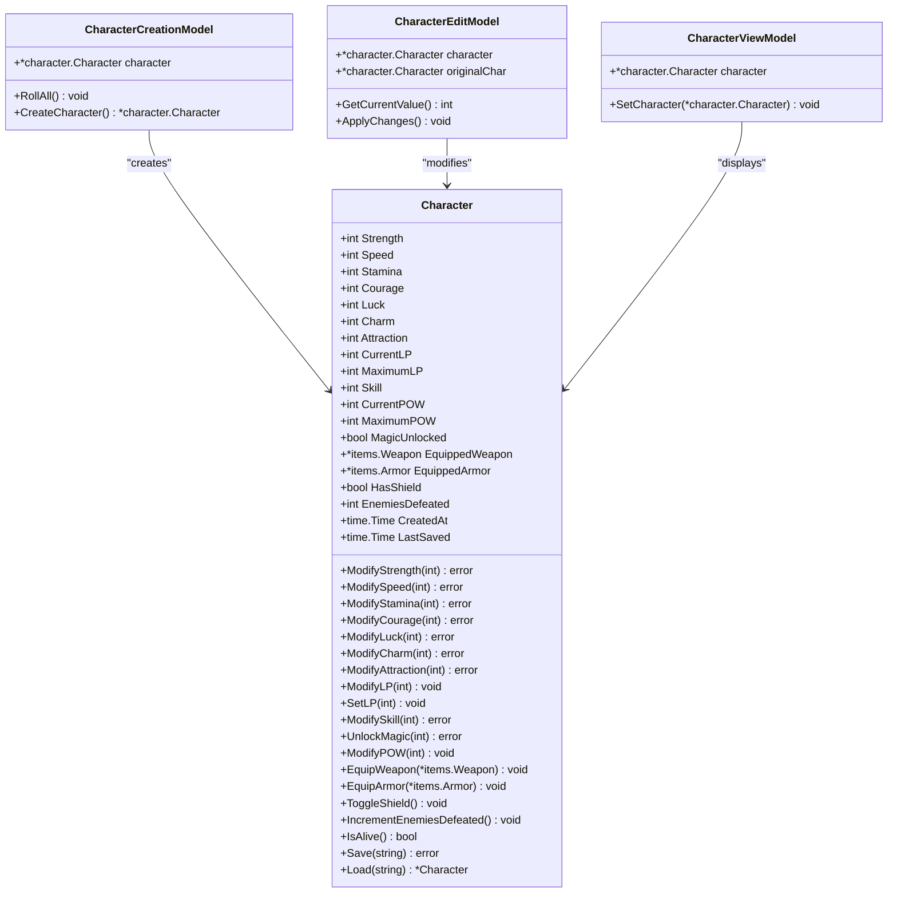

**Diagram sources**
- [internal/character/character.go](file://internal/character/character.go#L14-L44)
- [pkg/ui/character_creation.go](file://pkg/ui/character_creation.go#L230-L257)
- [pkg/ui/character_edit.go](file://pkg/ui/character_edit.go#L58-L62)
- [pkg/ui/character_view.go](file://pkg/ui/character_view.go#L18-L20)

### Dependency Injection Pattern

The system employs dependency injection through the Dice field, allowing for testable random number generation:

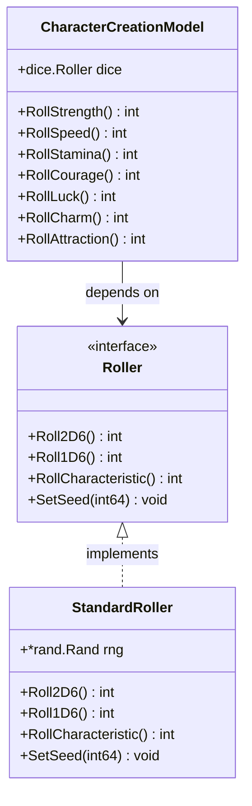

**Diagram sources**
- [internal/dice/dice.go](file://internal/dice/dice.go#L11-L27)
- [pkg/ui/character_creation.go](file://pkg/ui/character_creation.go#L23-L25)

**Section sources**
- [internal/character/character.go](file://internal/character/character.go#L14-L355)
- [internal/dice/dice.go](file://internal/dice/dice.go#L11-L97)

## Data Validation and Constraints

The state management system implements comprehensive validation rules to maintain data integrity across all application states.

### Character Validation Rules

The Character struct enforces strict validation on characteristic values:

| Validation Rule | Constraint | Error Condition |
|----------------|------------|-----------------|
| Minimum Value | ≥ 0 | Negative characteristic values |
| Maximum Value | ≤ 999 | Excessive characteristic values |
| LP Range | Current ≤ Maximum | Invalid life point relationships |
| Skill Range | ≥ 0 | Negative skill values |
| POW Range | ≥ 0 | Negative power values |

### State Transition Constraints

The system enforces logical constraints on state transitions:

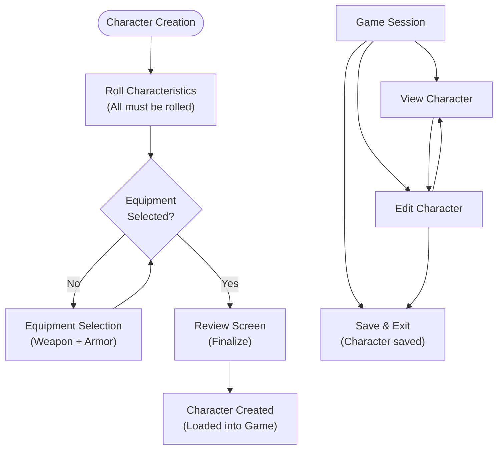

**Diagram sources**
- [pkg/ui/character_creation.go](file://pkg/ui/character_creation.go#L121-L136)
- [pkg/ui/character_creation.go](file://pkg/ui/character_creation.go#L230-L257)

### Input Validation Patterns

CharacterEditModel implements real-time input validation with immediate feedback:

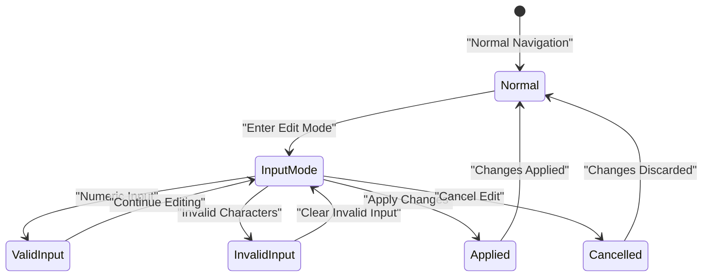

**Section sources**
- [internal/character/character.go](file://internal/character/character.go#L101-L111)
- [pkg/ui/character_creation.go](file://pkg/ui/character_creation.go#L121-L136)
- [pkg/ui/character_edit.go](file://pkg/ui/character_edit.go#L256-L277)

## Pointer Management and Referential Integrity

The state management system relies heavily on pointer semantics to maintain referential integrity across UI components while enabling efficient state sharing.

### Pointer-Based Architecture

The Model struct uses pointers for several critical fields to ensure consistent state updates:

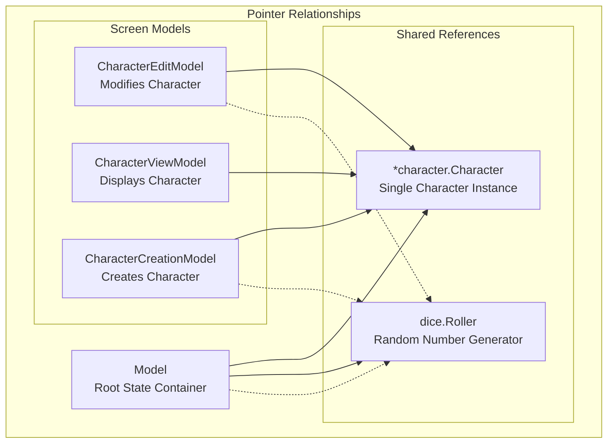

**Diagram sources**
- [pkg/ui/model.go](file://pkg/ui/model.go#L38-L42)
- [pkg/ui/character_edit.go](file://pkg/ui/character_edit.go#L25-L26)

### Referential Integrity Patterns

The system maintains referential integrity through several mechanisms:

1. **Single Character Instance**: Only one Character object exists per game session
2. **Shared Dice Roller**: All components use the same random number generator
3. **Consistent State Updates**: Pointer-based updates propagate immediately
4. **Atomic Operations**: State changes occur atomically within model methods

### Memory Management Considerations

The pointer-based approach provides several benefits:

- **Efficient State Sharing**: Multiple components access the same data
- **Immediate Propagation**: State changes are visible across all components
- **Memory Efficiency**: Single allocation for shared data structures
- **Simplified Garbage Collection**: Clear ownership patterns reduce memory leaks

**Section sources**
- [pkg/ui/model.go](file://pkg/ui/model.go#L38-L42)
- [pkg/ui/character_edit.go](file://pkg/ui/character_edit.go#L58-L62)

## Elm Architecture Pattern Implementation

The application implements the Elm Architecture pattern through the Bubble Tea framework, providing immutable state updates and predictable state transitions.

### Update Function Architecture

The Update method serves as the core state transition engine:

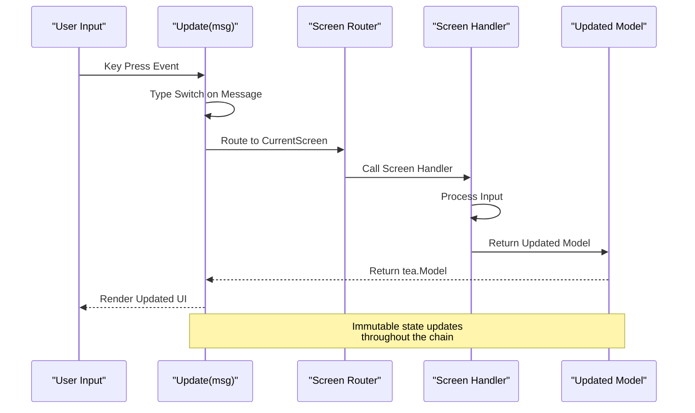

**Diagram sources**
- [pkg/ui/update.go](file://pkg/ui/update.go#L16-L30)
- [pkg/ui/update.go](file://pkg/ui/update.go#L32-L56)

### Message Handling Pattern

The system processes different message types through specialized handlers:

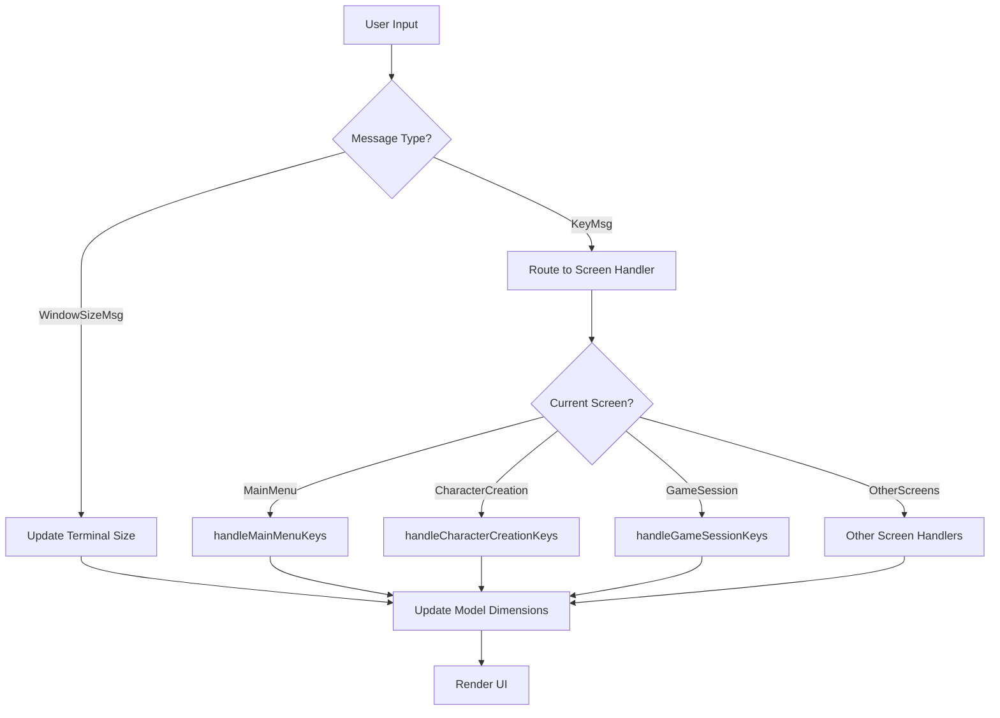

**Diagram sources**
- [pkg/ui/update.go](file://pkg/ui/update.go#L32-L56)
- [pkg/ui/update.go](file://pkg/ui/update.go#L58-L329)

### State Immutability Principles

The Elm Architecture enforces immutability through:

1. **Copy-on-Write**: Model updates create new instances
2. **Functional Updates**: State changes occur through pure functions
3. **Event-Driven Updates**: All state changes originate from user events
4. **Predictable Transitions**: Same inputs produce identical outputs

**Section sources**
- [pkg/ui/update.go](file://pkg/ui/update.go#L16-L30)
- [pkg/ui/update.go](file://pkg/ui/update.go#L32-L56)
- [pkg/ui/update.go](file://pkg/ui/update.go#L58-L329)

## State Transition Patterns

The application implements sophisticated state transition patterns that handle complex navigation scenarios while maintaining data consistency.

### Navigation State Machine

The CurrentScreen field implements a finite state machine with clear transition rules:

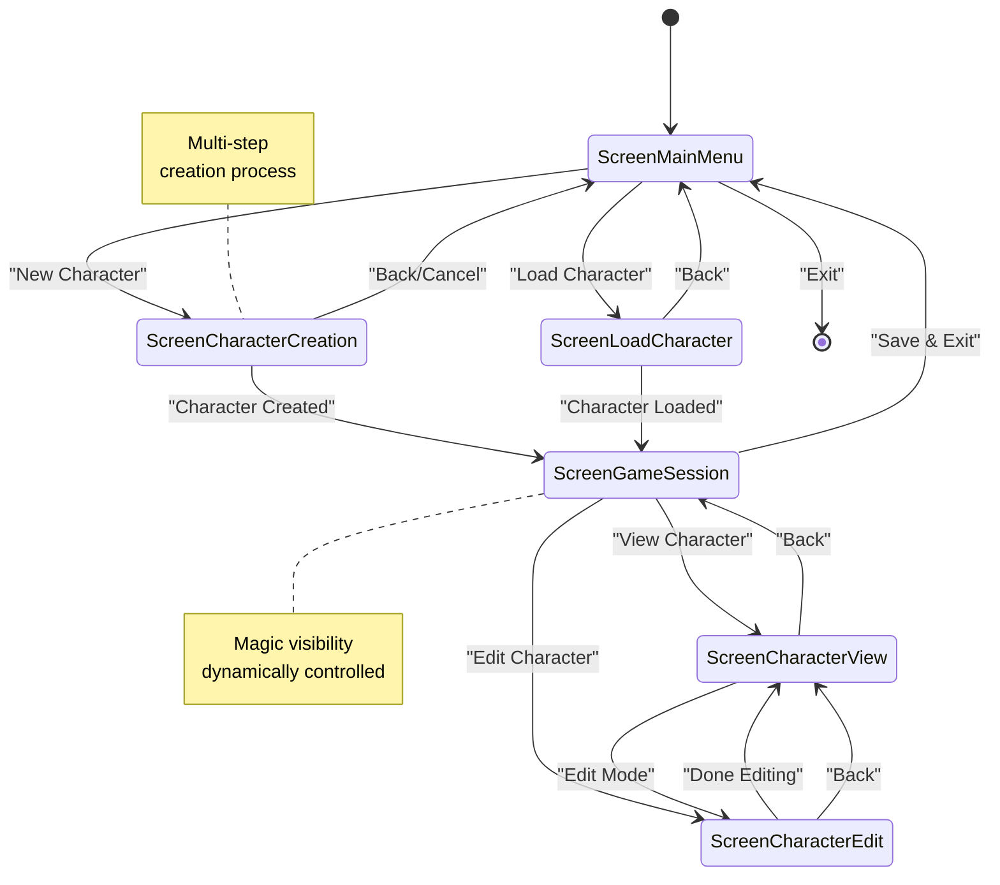

**Diagram sources**
- [pkg/ui/model.go](file://pkg/ui/model.go#L12-L31)
- [pkg/ui/update.go](file://pkg/ui/update.go#L58-L329)

### Character Lifecycle Management

The LoadCharacter method demonstrates complex state coordination:

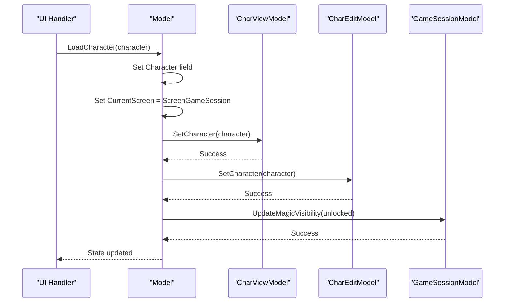

**Diagram sources**
- [pkg/ui/model.go](file://pkg/ui/model.go#L78-L84)

### Error State Management

The system handles errors consistently across all state transitions:

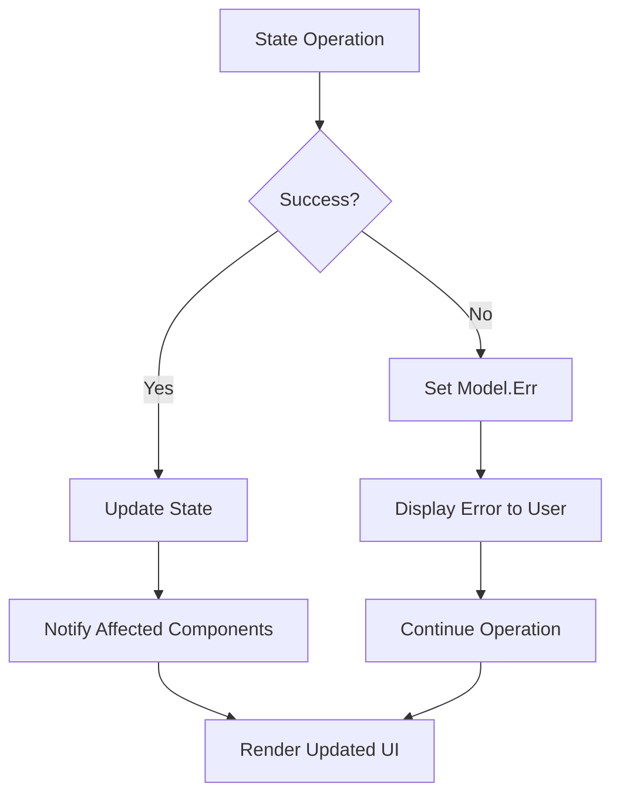

**Section sources**
- [pkg/ui/model.go](file://pkg/ui/model.go#L78-L95)
- [pkg/ui/update.go](file://pkg/ui/update.go#L89-L98)
- [pkg/ui/update.go](file:///pkg/ui/update.go#L203-L208)

## Performance Considerations

The state management system is designed for optimal performance through several architectural decisions and implementation patterns.

### Memory Efficiency Strategies

1. **Pointer Sharing**: Shared references minimize memory allocation
2. **Immutable Updates**: Efficient copy-on-write patterns
3. **Lazy Loading**: Screen models instantiated only when needed
4. **Garbage Collection Optimization**: Clear ownership patterns

### Computational Efficiency

1. **Deterministic Randomness**: Seedable dice roller for testing
2. **Minimal State Changes**: Atomic updates reduce unnecessary re-renders
3. **Efficient Validation**: Early validation prevents expensive operations
4. **Cached Calculations**: Derived values computed once and reused

### Scalability Considerations

The architecture scales well for:

- **Multiple Concurrent Users**: Thread-safe state management
- **Large Character Data**: Efficient serialization/deserialization
- **Complex State Trees**: Hierarchical state organization
- **Extensible Screens**: Easy addition of new screen types

## Troubleshooting Guide

Common state management issues and their solutions:

### Character Loading Problems

**Issue**: Character fails to load with error
**Solution**: Check file permissions and JSON format validity

**Issue**: Character loads but game session doesn't update
**Solution**: Verify LoadCharacter method calls all required state updates

### State Synchronization Issues

**Issue**: Screen displays outdated character data
**Solution**: Ensure SetCharacter is called on all relevant models

**Issue**: Dice rolls inconsistent across screens
**Solution**: Verify single StandardRoller instance is shared

### Navigation State Problems

**Issue**: Screen transitions don't work correctly
**Solution**: Check CurrentScreen assignment and screen handler registration

**Issue**: Keyboard shortcuts not responding
**Solution**: Verify key press routing in handleKeyPress method

**Section sources**
- [pkg/ui/model.go](file://pkg/ui/model.go#L78-L95)
- [pkg/ui/update.go](file://pkg/ui/update.go#L89-L98)

## Conclusion

The Saga of the Demonspawn state management system demonstrates sophisticated Go programming patterns combined with effective UI architecture principles. The hierarchical model structure, pointer-based referential integrity, and Elm Architecture implementation create a robust foundation for complex interactive applications.

Key architectural strengths include:

- **Single Source of Truth**: Centralized state management prevents inconsistencies
- **Type Safety**: Enumerated screen types prevent invalid state transitions
- **Dependency Injection**: Testable, modular design with clear interfaces
- **Immutability**: Predictable state updates through functional patterns
- **Performance**: Efficient memory usage through pointer sharing and lazy loading

The system successfully balances complexity with maintainability, providing a solid foundation for the evolving gamebook application while demonstrating advanced Go development practices. Future enhancements can build upon this robust architecture while maintaining the established patterns and principles.