# Technical Architecture

<cite>
**Referenced Files in This Document**
- [pkg/ui/model.go](file://pkg/ui/model.go)
- [pkg/ui/update.go](file://pkg/ui/update.go)
- [pkg/ui/main_menu.go](file://pkg/ui/main_menu.go)
- [pkg/ui/game_session.go](file://pkg/ui/game_session.go)
- [pkg/ui/character_creation.go](file://pkg/ui/character_creation.go)
- [pkg/ui/load_character.go](file://pkg/ui/load_character.go)
- [pkg/ui/character_view.go](file://pkg/ui/character_view.go)
- [pkg/ui/character_edit.go](file://pkg/ui/character_edit.go)
- [internal/character/character.go](file://internal/character/character.go)
- [go.mod](file://go.mod)
- [README.md](file://README.md)
</cite>

## Table of Contents
1. [Introduction](#introduction)
2. [Architecture Overview](#architecture-overview)
3. [Elm Architecture Implementation](#elm-architecture-implementation)
4. [Core Model Structure](#core-model-structure)
5. [Screen Navigation System](#screen-navigation-system)
6. [Component Hierarchy](#component-hierarchy)
7. [Data Flow and Unidirectional Architecture](#data-flow-and-unidirectional-architecture)
8. [Package Organization](#package-organization)
9. [System Context](#system-context)
10. [Architectural Benefits](#architectural-benefits)
11. [Trade-offs and Constraints](#trade-offs-and-constraints)
12. [Infrastructure Requirements](#infrastructure-requirements)
13. [Scalability Considerations](#scalability-considerations)
14. [Conclusion](#conclusion)

## Introduction

Saga-Demonspawn is a command-line application built with Go and the Bubble Tea framework, serving as a rules engine and character management companion for the "Sagas of the Demonspawn" gamebook. The application implements a sophisticated Elm Architecture pattern using the Model-View-Update paradigm, providing a robust foundation for managing character creation, stat management, and game progression through a terminal-based interface.

The architecture demonstrates modern Go development practices while maintaining simplicity and maintainability through careful package organization and clear separation of concerns. The application follows a single-user CLI design pattern optimized for terminal environments, with scalable components that can accommodate future phase-based feature additions.

## Architecture Overview

The saga-demonspawn application follows a layered architecture with clear separation between presentation, business logic, and data persistence layers. The core architecture is built around the Bubble Tea framework's Elm Architecture pattern, which enforces unidirectional data flow and immutable state management.

**Diagram sources**
- [pkg/ui/model.go](file://pkg/ui/model.go#L33-L95)
- [internal/character/character.go](file://internal/character/character.go#L14-L355)

The architecture emphasizes modularity through Go's package system, with clear boundaries between internal/private packages and public/reusable components. This design enables maintainable code while preserving encapsulation of sensitive business logic.

**Section sources**
- [pkg/ui/model.go](file://pkg/ui/model.go#L1-L95)
- [README.md](file://README.md#L72-L85)

## Elm Architecture Implementation

The application implements the Elm Architecture pattern through the Bubble Tea framework, establishing a predictable and testable state management system. The core implementation follows the Model-View-Update cycle with immutable state updates and explicit message handling.

**Diagram sources**
- [pkg/ui/update.go](file://pkg/ui/update.go#L16-L329)

The Update function serves as the central orchestrator, routing messages to appropriate handlers based on the current screen and state. This centralized approach ensures consistent state transitions while maintaining screen-specific logic encapsulation.

**Section sources**
- [pkg/ui/update.go](file://pkg/ui/update.go#L16-L329)

## Core Model Structure

The Model struct in [`pkg/ui/model.go`](file://pkg/ui/model.go#L33-L95) serves as the root state container, implementing the central hub pattern for the Elm Architecture. The model maintains application-wide state while delegating screen-specific responsibilities to dedicated sub-models.

**Diagram sources**
- [pkg/ui/model.go](file://pkg/ui/model.go#L33-L95)
- [pkg/ui/main_menu.go](file://pkg/ui/main_menu.go#L4-L49)
- [pkg/ui/character_creation.go](file://pkg/ui/character_creation.go#L22-L279)
- [pkg/ui/game_session.go](file://pkg/ui/game_session.go#L4-L77)

The model initialization in [`NewModel()`](file://pkg/ui/model.go#L58-L76) establishes the initial application state with all sub-models properly configured. This factory pattern ensures consistent initialization across the application lifecycle.

**Section sources**
- [pkg/ui/model.go](file://pkg/ui/model.go#L33-L95)

## Screen Navigation System

The application implements a comprehensive screen navigation system using enumerated screen types and centralized routing. Each screen maintains its own state while participating in the global state management system.

```mermaid
stateDiagram-v2
[*] --> ScreenMainMenu
ScreenMainMenu --> ScreenCharacterCreation : New Character
ScreenMainMenu --> ScreenLoadCharacter : Load Character
ScreenMainMenu --> [*] : Exit
ScreenCharacterCreation --> ScreenMainMenu : Cancel
ScreenCharacterCreation --> ScreenLoadCharacter : Review → Load
ScreenLoadCharacter --> ScreenGameSession : Load Success
ScreenLoadCharacter --> ScreenMainMenu : Back
ScreenGameSession --> ScreenCharacterView : View Character
ScreenGameSession --> ScreenCharacterEdit : Edit Stats
ScreenGameSession --> ScreenMainMenu : Save & Exit
ScreenCharacterView --> ScreenGameSession : Back
ScreenCharacterView --> ScreenCharacterEdit : Edit Mode
ScreenCharacterEdit --> ScreenCharacterView : Complete
ScreenCharacterEdit --> ScreenCharacterView : Cancel
```

**Diagram sources**
- [pkg/ui/model.go](file://pkg/ui/model.go#L12-L31)
- [pkg/ui/update.go](file://pkg/ui/update.go#L39-L56)

The navigation system uses the [`handleKeyPress`](file://pkg/ui/update.go#L32-L56) function to route user input to the appropriate screen handler, ensuring consistent behavior across all screens while maintaining screen-specific functionality.

**Section sources**
- [pkg/ui/update.go](file://pkg/ui/update.go#L32-L56)

## Component Hierarchy

The application follows a hierarchical component structure where the main model coordinates multiple specialized sub-models, each responsible for distinct aspects of the user interface and business logic.

**Diagram sources**
- [pkg/ui/model.go](file://pkg/ui/model.go#L44-L51)
- [internal/character/character.go](file://internal/character/character.go#L14-L355)

Each component maintains clear responsibilities: screen models handle user interaction and display logic, business logic components manage domain-specific operations, and data layer components handle persistence and retrieval.

**Section sources**
- [pkg/ui/model.go](file://pkg/ui/model.go#L44-L51)

## Data Flow and Unidirectional Architecture

The application implements strict unidirectional data flow, ensuring predictable state management and easier debugging. All user interactions flow through the Update function, which produces new immutable state objects.

**Diagram sources**
- [pkg/ui/update.go](file://pkg/ui/update.go#L16-L329)

The [`Update`](file://pkg/ui/update.go#L16-L329) function serves as the single point of state mutation, accepting messages and returning new model instances with updated state. This approach eliminates side effects and makes the application highly testable.

**Section sources**
- [pkg/ui/update.go](file://pkg/ui/update.go#L16-L329)

## Package Organization

The application employs Go's package organization conventions effectively, using `internal/` for private packages and `pkg/` for reusable components. This separation enforces clear boundaries between core business logic and presentation layer components.

| Package Path | Purpose | Visibility | Responsibility |
|--------------|---------|------------|----------------|
| `internal/character/` | Character domain logic | Private | Character state, validation, persistence |
| `internal/dice/` | Random number generation | Private | Dice rolling mechanics |
| `internal/items/` | Equipment and inventory | Private | Item definitions and management |
| `pkg/ui/` | User interface components | Public | Bubble Tea models, views, navigation |
| `cmd/saga/` | Application entry point | Public | Main function and CLI interface |

The [`internal/`](file://internal/character/character.go#L1-L355) packages contain the core business logic and domain models, protected from external access while providing clean interfaces to the UI layer. The [`pkg/ui/`](file://pkg/ui/model.go#L1-L95) packages expose only the necessary components for building the user interface.

**Section sources**
- [README.md](file://README.md#L72-L85)
- [go.mod](file://go.mod#L1-L28)

## System Context

The application operates within a terminal environment, interacting with the operating system for file operations and user input. The system context defines clear boundaries between the application and external systems.

**Diagram sources**
- [internal/character/character.go](file://internal/character/character.go#L312-L355)
- [pkg/ui/load_character.go](file://pkg/ui/load_character.go#L25-L40)

The application maintains minimal external dependencies, relying primarily on Go's standard library and the Bubble Tea framework for terminal interaction. File operations use the local filesystem for character persistence, with JSON format for cross-platform compatibility.

**Section sources**
- [internal/character/character.go](file://internal/character/character.go#L312-L355)
- [pkg/ui/load_character.go](file://pkg/ui/load_character.go#L25-L40)

## Architectural Benefits

The Elm Architecture implementation with Bubble Tea provides several significant advantages for maintainability and testability:

### Predictable State Management
- Immutable state updates prevent unexpected side effects
- Centralized state mutations through the Update function
- Clear audit trail of state transitions

### Enhanced Testability
- Pure functions for state transformations
- Easy mocking of dependencies through interfaces
- Deterministic behavior for testing scenarios

### Improved Debugging
- Time-travel debugging capabilities through state snapshots
- Clear separation of concerns reduces debugging complexity
- Explicit message passing makes tracing easier

### Better Code Organization
- Clear separation between presentation and business logic
- Modular components that can be developed independently
- Consistent patterns across all screens and features

The architecture's emphasis on immutability and pure functions makes it particularly suitable for terminal applications where state consistency is crucial for user experience.

**Section sources**
- [pkg/ui/update.go](file://pkg/ui/update.go#L16-L329)
- [pkg/ui/model.go](file://pkg/ui/model.go#L33-L95)

## Trade-offs and Constraints

While the Elm Architecture provides numerous benefits, it also introduces specific challenges and constraints for terminal UI development:

### Complexity for Simple Interactions
The message-passing architecture can introduce overhead for straightforward user interactions, requiring more boilerplate code compared to imperative UI frameworks.

### Memory Usage Patterns
Immutable state updates create temporary objects that may increase memory pressure, though this is generally acceptable for CLI applications with limited concurrent users.

### Learning Curve
Developers unfamiliar with functional reactive programming paradigms may require time to adapt to the Elm Architecture pattern.

### Terminal Environment Limitations
The terminal UI platform imposes constraints on visual feedback and interaction patterns, requiring creative solutions for complex user experiences.

### Single-Threaded Nature
The synchronous nature of terminal applications limits the ability to perform background processing without blocking the UI, requiring careful timing considerations.

Despite these challenges, the benefits of predictability and maintainability outweigh the drawbacks for this type of application, particularly given its educational and learning-focused nature.

## Infrastructure Requirements

The application has minimal infrastructure requirements suitable for a single-user CLI application:

### Runtime Environment
- Go 1.24.0 or higher
- Terminal emulator with UTF-8 support
- Standard file system permissions

### Deployment Considerations
- Static binary compilation for easy distribution
- No server infrastructure required
- Local file storage for character persistence

### Resource Usage
- Low memory footprint (< 50MB typical)
- Minimal CPU usage during idle periods
- Disk space for character saves (typically < 1KB per character)

The application's lightweight requirements make it suitable for deployment on various platforms without complex infrastructure dependencies.

**Section sources**
- [go.mod](file://go.mod#L1-L28)

## Scalability Considerations

For a single-user CLI application, scalability focuses on user experience and feature extensibility rather than system capacity:

### Feature Extensibility
The modular architecture allows for phase-based feature development without disrupting existing functionality. Each new feature can be implemented as a separate screen or component while maintaining compatibility with existing code.

### Performance Scaling
The application's performance scales linearly with the number of characters saved, with file I/O becoming the primary bottleneck rather than computational complexity.

### Maintenance Scalability
The clear separation of concerns and consistent architectural patterns enable efficient maintenance and enhancement as new features are added according to the planned phases.

### Future Enhancement Paths
The architecture supports incremental development with clear migration paths for adding combat mechanics, inventory management, and magic systems without major architectural changes.

The current implementation demonstrates good architectural hygiene that supports future growth while maintaining the simplicity required for a focused learning project.

## Conclusion

The saga-demonspawn application exemplifies effective implementation of the Elm Architecture pattern using the Bubble Tea framework. The architecture successfully balances functional programming principles with practical UI development requirements, creating a maintainable and testable codebase suitable for educational purposes and real-world use.

Key architectural strengths include predictable state management through immutable updates, clear separation of concerns between presentation and business logic, and modular component design that supports future feature development. The use of Go's package system with `internal/` and `pkg/` directories demonstrates best practices for organizing larger applications while maintaining appropriate encapsulation.

While the architecture introduces some complexity for terminal UI development, the benefits of predictability, testability, and maintainability justify the investment for this type of application. The single-user CLI nature of the application aligns well with the architectural approach, providing an excellent foundation for learning modern Go development patterns while delivering functional game support tools.

The architecture's emphasis on functional programming principles and immutable state management positions it well for future enhancements while maintaining the simplicity and clarity required for educational demonstration purposes. This balance makes saga-demonspawn an excellent example of how modern architectural patterns can be applied effectively in Go applications.