# Update Cycle

<cite>
**Referenced Files in This Document**
- [update.go](file://pkg/ui/update.go)
- [model.go](file://pkg/ui/model.go)
- [main_menu.go](file://pkg/ui/main_menu.go)
- [character_creation.go](file://pkg/ui/character_creation.go)
- [load_character.go](file://pkg/ui/load_character.go)
- [game_session.go](file://pkg/ui/game_session.go)
- [character_view.go](file://pkg/ui/character_view.go)
- [character_edit.go](file://pkg/ui/character_edit.go)
- [README.md](file://README.md)
</cite>

## Table of Contents
1. [Introduction](#introduction)
2. [Architecture Overview](#architecture-overview)
3. [Update Method Implementation](#update-method-implementation)
4. [Message Routing Mechanism](#message-routing-mechanism)
5. [Screen-Specific Handlers](#screen-specific-handlers)
6. [Command Pattern Implementation](#command-pattern-implementation)
7. [State Management and Immutability](#state-management-and-immutability)
8. [Event Propagation and Error Handling](#event-propagation-and-error-handling)
9. [Performance Optimization](#performance-optimization)
10. [Common Issues and Solutions](#common-issues-and-solutions)
11. [Best Practices](#best-practices)

## Introduction

The update cycle in the Saga of the Demonspawn application is the core mechanism that processes user interactions and maintains the unidirectional data flow following the Elm Architecture pattern. Built on top of the Bubble Tea framework, this system handles key press events, window resize messages, and other user inputs while ensuring immutable state management and clean separation of concerns.

The update cycle operates as a central dispatcher that routes messages to appropriate screen handlers, manages state transitions, and coordinates side effects through the command pattern. This architecture enables responsive terminal applications while maintaining predictable behavior and easy testing capabilities.

## Architecture Overview

The update cycle follows a hierarchical message routing system that ensures proper event handling and state management across different application screens.

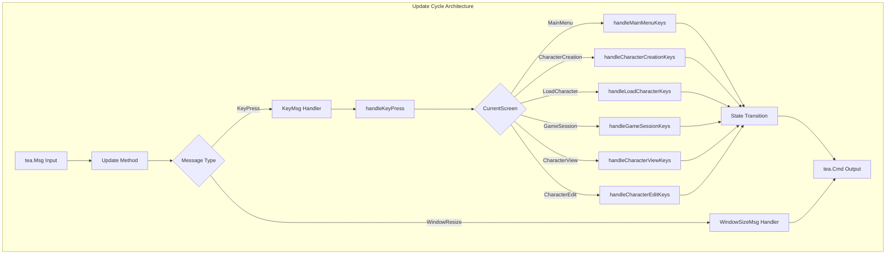

**Diagram sources**
- [update.go](file://pkg/ui/update.go#L16-L29)
- [update.go](file://pkg/ui/update.go#L32-L55)

**Section sources**
- [update.go](file://pkg/ui/update.go#L16-L29)
- [model.go](file://pkg/ui/model.go#L33-L55)

## Update Method Implementation

The `Update` method serves as the primary entry point for all message processing in the application. It implements the core Elm Architecture pattern by accepting messages and returning updated models along with optional commands for side effects.

### Core Update Logic

The update method employs a type-switch pattern to handle different message types efficiently:

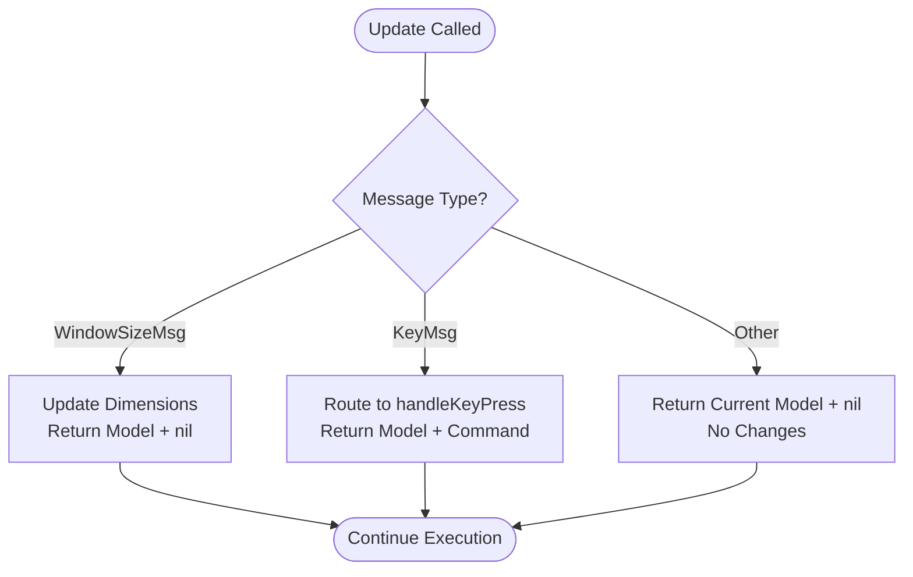

**Diagram sources**
- [update.go](file://pkg/ui/update.go#L18-L29)

### Message Type Handling

The update method processes two primary message types:

1. **Window Size Messages**: Updates terminal dimensions for responsive layout
2. **Key Press Messages**: Routes to specialized key handlers based on current screen

**Section sources**
- [update.go](file://pkg/ui/update.go#L18-L29)

## Message Routing Mechanism

The message routing system implements a sophisticated dispatch pattern that ensures messages reach the appropriate handlers based on the current application state.

### Global Key Handling

The `handleKeyPress` method implements global key bindings that work regardless of the current screen:

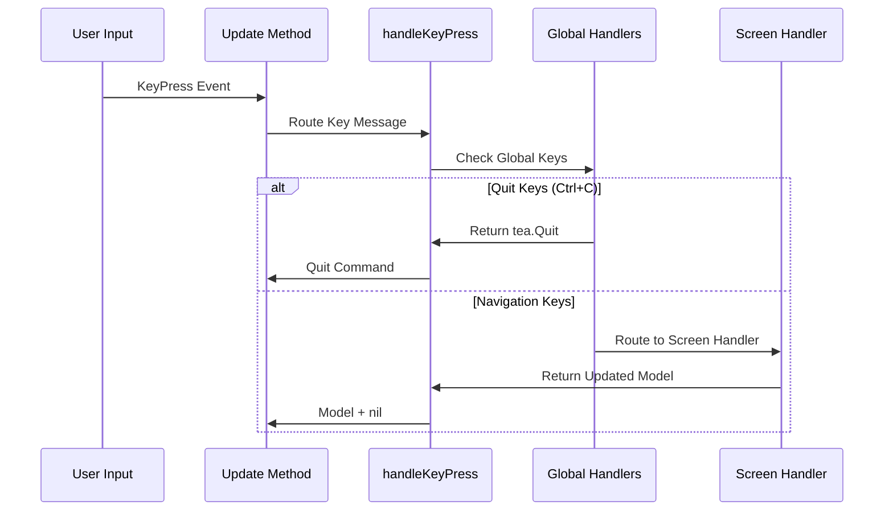

**Diagram sources**
- [update.go](file://pkg/ui/update.go#L32-L55)

### Screen-Based Routing

The routing mechanism uses a switch statement to direct messages to the appropriate screen handler based on the `CurrentScreen` field:

| Screen Type | Handler Method | Purpose |
|-------------|----------------|---------|
| `ScreenMainMenu` | `handleMainMenuKeys` | Main menu navigation and selection |
| `ScreenCharacterCreation` | `handleCharacterCreationKeys` | Character creation flow control |
| `ScreenLoadCharacter` | `handleLoadCharacterKeys` | Character loading and selection |
| `ScreenGameSession` | `handleGameSessionKeys` | Game session menu operations |
| `ScreenCharacterView` | `handleCharacterViewKeys` | Character display navigation |
| `ScreenCharacterEdit` | `handleCharacterEditKeys` | Character stat editing |

**Section sources**
- [update.go](file://pkg/ui/update.go#L32-L55)

## Screen-Specific Handlers

Each screen implements specialized key handling logic tailored to its specific functionality and user interaction patterns.

### Main Menu Handler

The main menu handler manages basic navigation and selection operations:

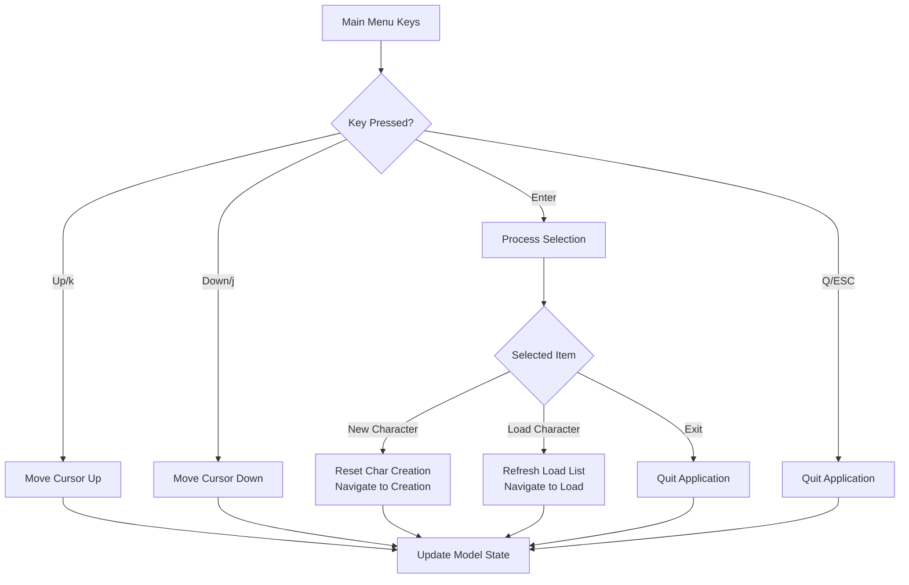

**Diagram sources**
- [update.go](file://pkg/ui/update.go#L58-L80)
- [main_menu.go](file://pkg/ui/main_menu.go#L21-L32)

### Character Creation Handler

The character creation handler manages a multi-step process with different key bindings for each phase:

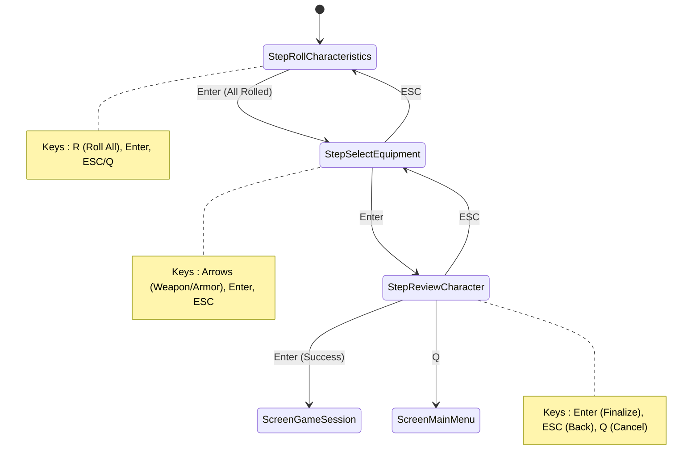

**Diagram sources**
- [update.go](file://pkg/ui/update.go#L109-L179)
- [character_creation.go](file://pkg/ui/character_creation.go#L111-L118)

### Character Editing Handler

The character editing handler implements dual-mode operation with navigation and input modes:

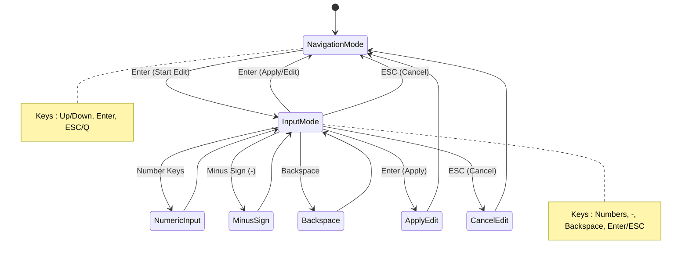

**Diagram sources**
- [update.go](file://pkg/ui/update.go#L234-L278)
- [character_edit.go](file://pkg/ui/character_edit.go#L109-L118)

**Section sources**
- [update.go](file://pkg/ui/update.go#L58-L278)

## Command Pattern Implementation

The application leverages Bubble Tea's command pattern to handle side effects and asynchronous operations cleanly within the immutable update cycle.

### Command Types and Usage

Commands are returned from update handlers to perform side effects:

| Command Type | Purpose | Example Usage |
|--------------|---------|---------------|
| `tea.Quit` | Terminate application | Global quit keys, exit confirmations |
| `nil` | No side effect | Normal state transitions |
| Custom Commands | Asynchronous operations | File operations, network requests |

### Quit Command Implementation

The quit command is implemented globally for immediate application termination:

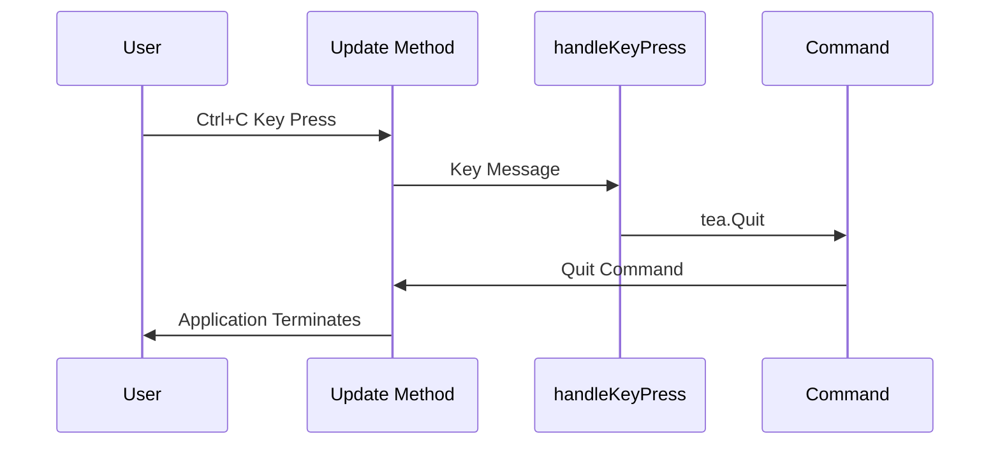

**Diagram sources**
- [update.go](file://pkg/ui/update.go#L35-L37)

### Error Handling Through Commands

Errors are propagated through the command system rather than being thrown:

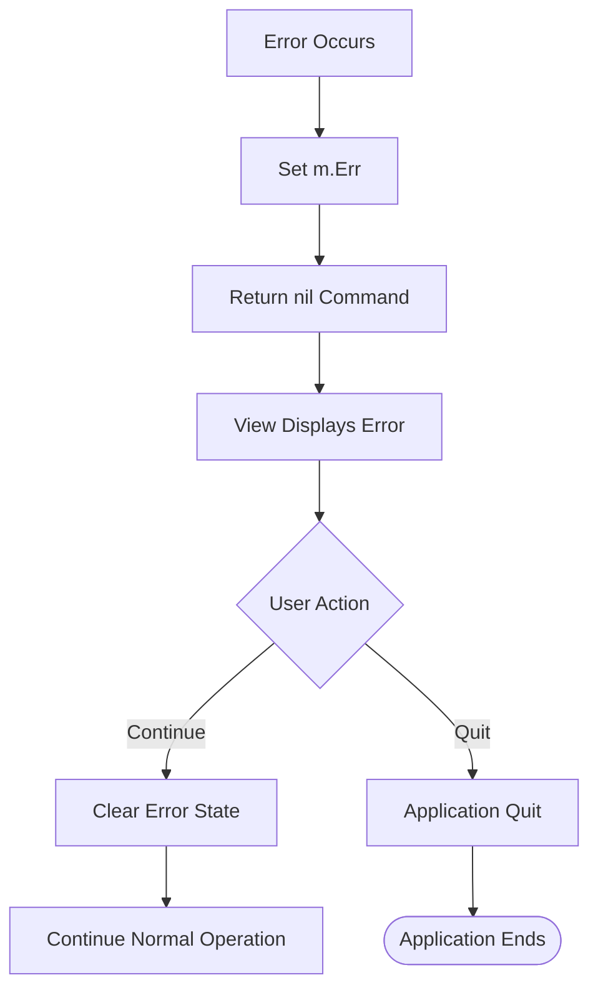

**Diagram sources**
- [update.go](file://pkg/ui/update.go#L95-L97)
- [update.go](file://pkg/ui/update.go#L167-L169)

**Section sources**
- [update.go](file://pkg/ui/update.go#L35-L37)
- [update.go](file://pkg/ui/update.go#L95-L97)
- [update.go](file://pkg/ui/update.go#L167-L169)

## State Management and Immutability

The update cycle enforces strict immutability by creating new model instances rather than modifying existing ones, ensuring predictable state transitions and easier debugging.

### Immutable State Pattern

Each update operation returns a completely new model instance:

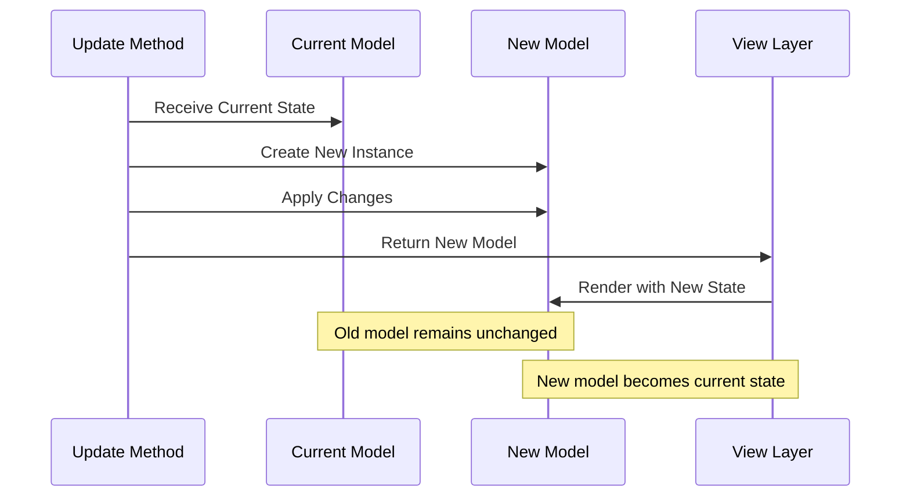

**Diagram sources**
- [model.go](file://pkg/ui/model.go#L33-L55)

### State Mutation Strategies

Different screens employ various state mutation strategies:

| Strategy | Use Case | Example |
|----------|----------|---------|
| Field Updates | Simple state changes | Cursor positions, selection indices |
| Complete Replacements | Major state changes | Screen transitions, character loading |
| Incremental Changes | Complex operations | Stat modifications, equipment changes |

### Memory Efficiency Considerations

While immutability creates new objects, the application maintains memory efficiency through:

- Shallow copying of unchanged fields
- Efficient string and slice operations
- Minimal object allocation in hot paths

**Section sources**
- [model.go](file://pkg/ui/model.go#L33-L55)

## Event Propagation and Error Handling

The update cycle implements robust event propagation and error handling mechanisms to ensure reliable application behavior under various conditions.

### Event Propagation Flow

Events propagate through multiple layers with proper error containment:

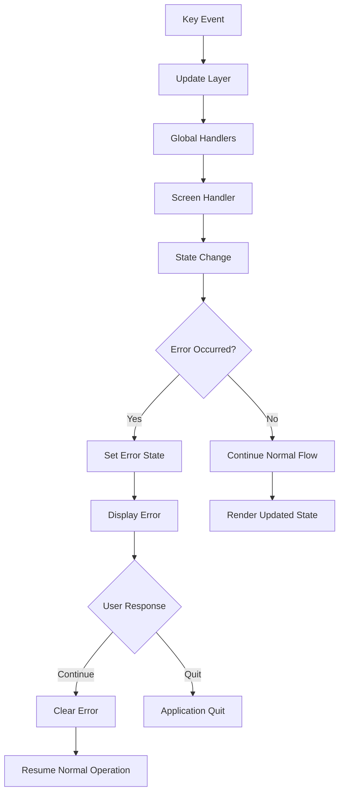

**Diagram sources**
- [update.go](file://pkg/ui/update.go#L95-L97)
- [update.go](file://pkg/ui/update.go#L167-L169)

### Error Handling Patterns

The application employs several error handling patterns:

1. **Graceful Degradation**: Non-critical errors don't crash the application
2. **User Feedback**: Errors are displayed in the UI rather than logged
3. **Recovery Options**: Users can continue operation after encountering errors
4. **State Preservation**: Error states are preserved until user action

### Edge Case Handling

Common edge cases are handled systematically:

- **Empty Lists**: Navigation bounds checking prevents out-of-bounds access
- **Missing Files**: Graceful handling of missing save files
- **Invalid Input**: Input validation prevents malformed data
- **System Errors**: File system and network errors are caught and reported

**Section sources**
- [update.go](file://pkg/ui/update.go#L95-L97)
- [update.go](file://pkg/ui/update.go#L167-L169)

## Performance Optimization

The update cycle implements several performance optimization techniques to ensure responsive terminal applications even with complex state management.

### Hot Path Optimization

Critical update paths are optimized for speed:

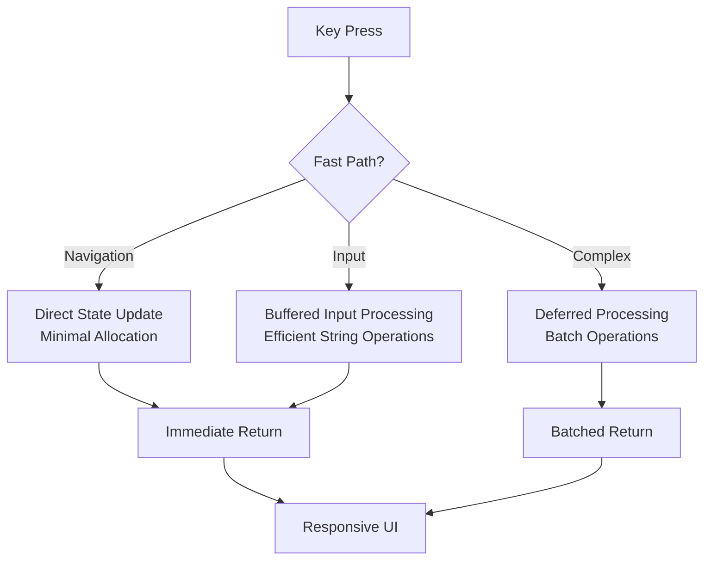

### Memory Allocation Reduction

Strategies to minimize garbage collection pressure:

1. **Object Pooling**: Reuse of frequently allocated objects
2. **String Interning**: Shared string constants
3. **Slice Reuse**: Pre-allocated slices for temporary storage
4. **Lazy Evaluation**: Deferred computation until needed

### Update Frequency Management

The application manages update frequency to balance responsiveness with performance:

- **Debounced Events**: Prevent rapid consecutive updates
- **Batch Processing**: Group related operations
- **Conditional Rendering**: Skip unnecessary UI updates

### Profiling and Monitoring

Performance monitoring techniques:

- **Update Timing**: Track update cycle duration
- **Memory Usage**: Monitor allocation patterns
- **Event Rate**: Measure input processing throughput

## Common Issues and Solutions

This section addresses frequently encountered problems in the update cycle implementation and provides practical solutions.

### Issue: State Mutation vs. Immutability Conflicts

**Problem**: Accidental modification of shared state leading to unpredictable behavior.

**Solution**: Strict adherence to immutable patterns:
- Always create new model instances
- Use pointer receivers only when necessary
- Avoid sharing mutable state between handlers

### Issue: Event Propagation Failures

**Problem**: Key events not reaching intended handlers.

**Solution**: Comprehensive event routing verification:
- Verify screen state consistency
- Check key binding mappings
- Validate handler registration

### Issue: Memory Leaks in Long-Running Sessions

**Problem**: Gradual memory increase during extended use.

**Solution**: Memory management strategies:
- Profile allocation patterns
- Implement object pooling
- Monitor garbage collection impact

### Issue: Performance Degradation Over Time

**Problem**: Application becomes slower with extended use.

**Solution**: Performance optimization techniques:
- Identify hot update paths
- Optimize string operations
- Reduce unnecessary allocations

### Issue: Error Recovery Complexity

**Problem**: Difficulties recovering from error states.

**Solution**: Robust error recovery mechanisms:
- Implement error state isolation
- Provide clear recovery pathways
- Maintain user context during errors

## Best Practices

Based on the implementation analysis, several best practices emerge for effective update cycle design.

### Design Principles

1. **Single Responsibility**: Each handler focuses on a specific aspect of functionality
2. **Immutability**: State changes occur through new model creation
3. **Predictability**: Same inputs produce consistent outputs
4. **Testability**: Handlers are easily unit testable

### Code Organization

- **Separation of Concerns**: UI logic separated from business logic
- **Consistent Naming**: Clear, descriptive method and variable names
- **Documentation**: Comprehensive inline documentation
- **Error Handling**: Consistent error reporting and recovery

### Testing Strategies

- **Unit Testing**: Individual handler testing
- **Integration Testing**: Cross-handler communication
- **Performance Testing**: Update cycle benchmarking
- **User Scenario Testing**: End-to-end user workflows

### Maintenance Guidelines

- **Refactoring Safety**: Immutable design supports safe refactoring
- **Feature Extension**: Easy addition of new screens and handlers
- **Bug Fixing**: Isolated problem areas reduce risk
- **Performance Monitoring**: Regular profiling and optimization

**Section sources**
- [update.go](file://pkg/ui/update.go#L16-L29)
- [model.go](file://pkg/ui/model.go#L33-L55)