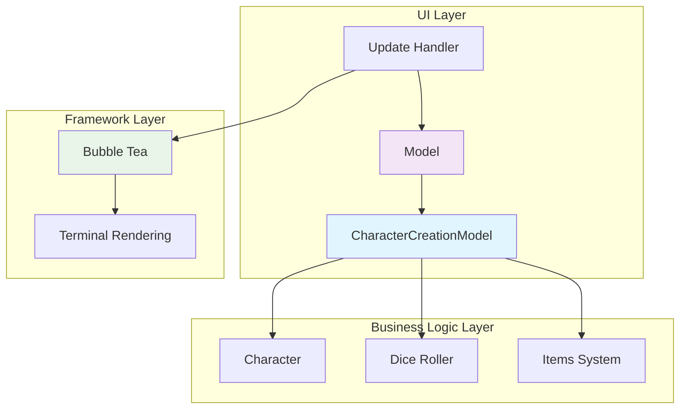
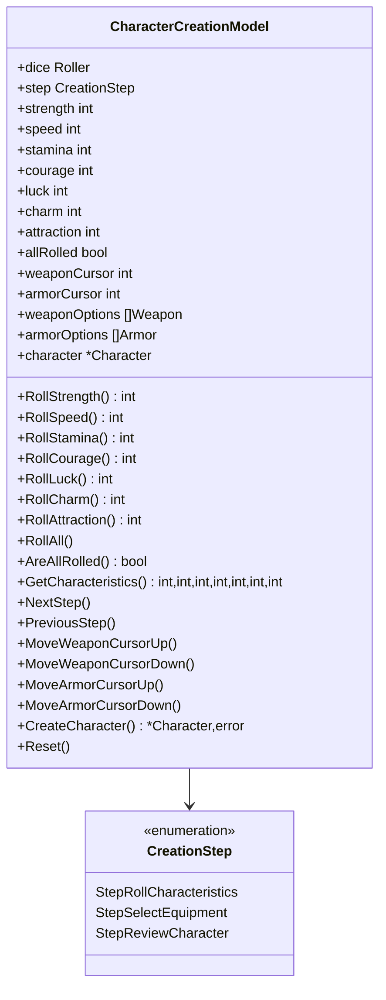
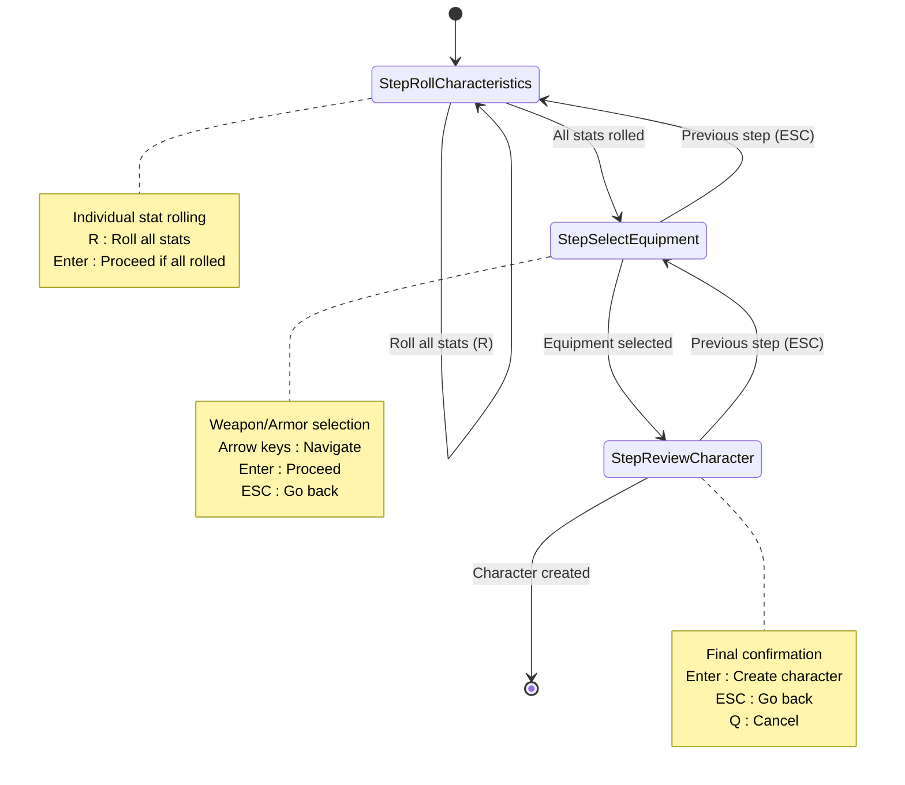
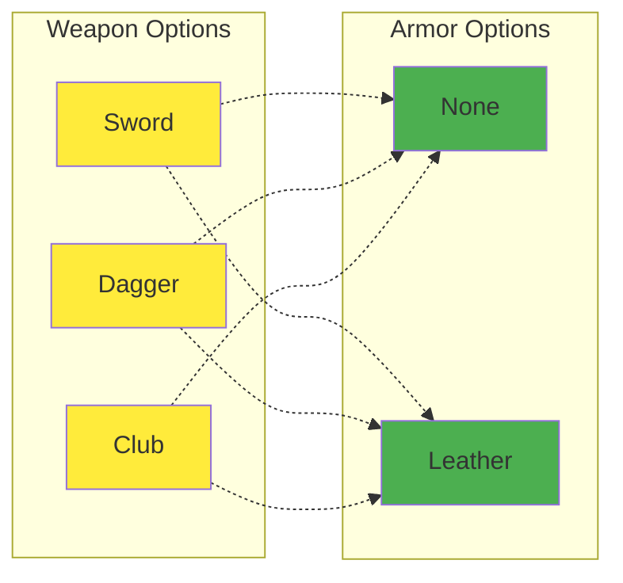
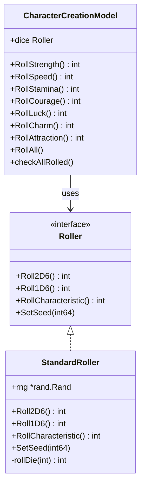
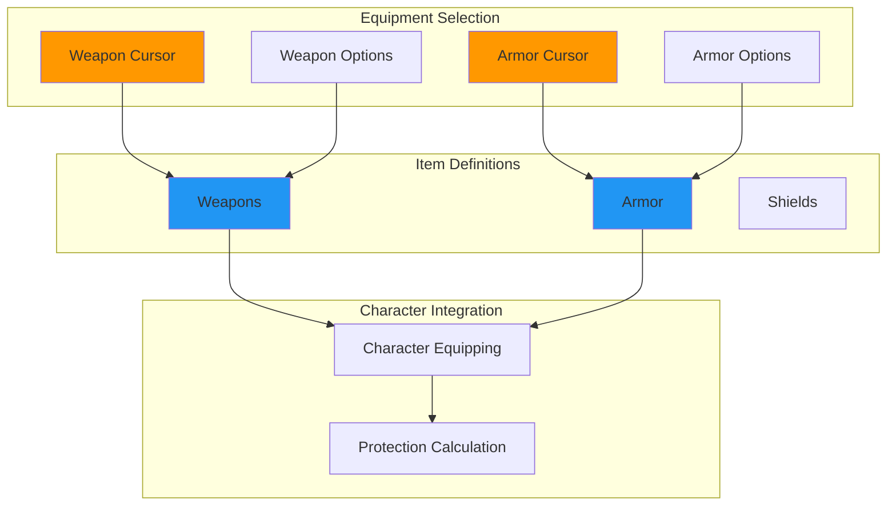
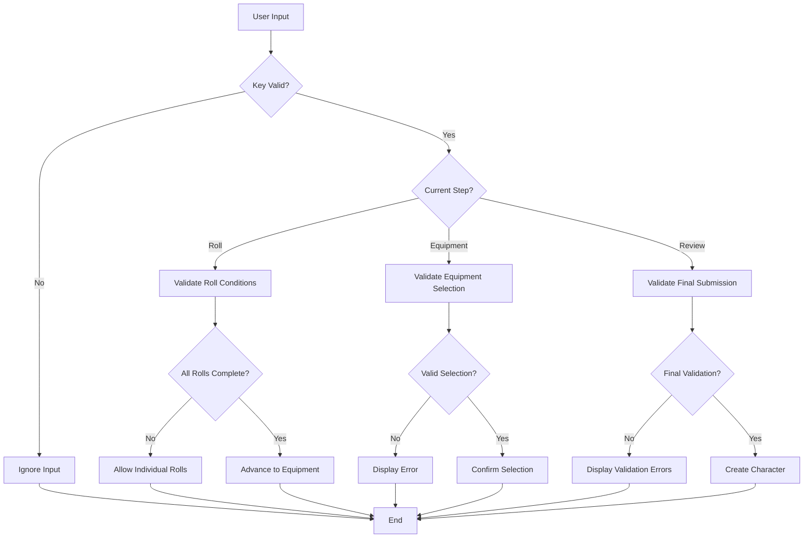
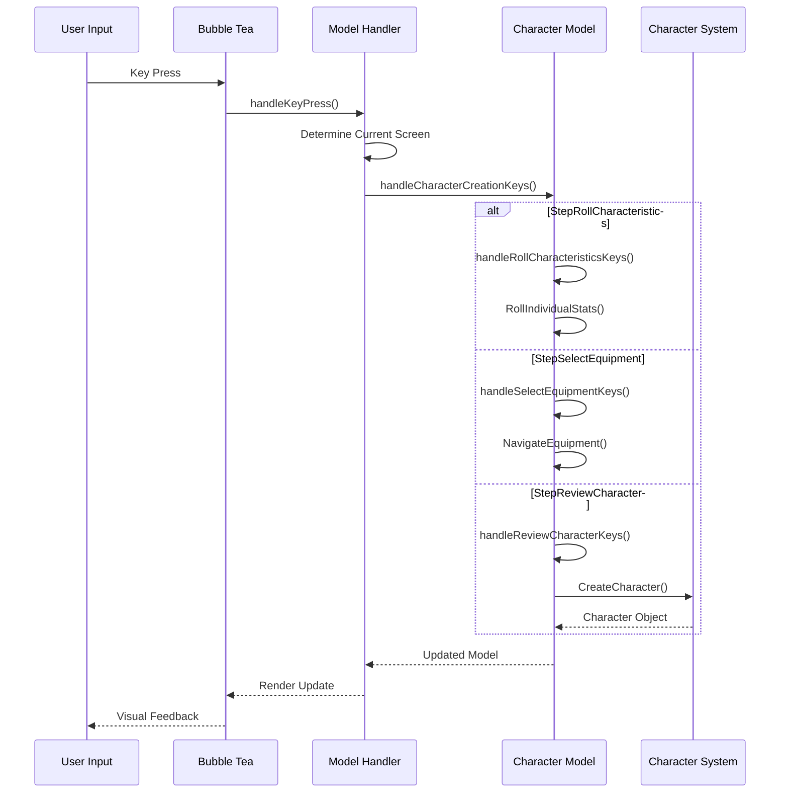

# Character Creation UI Component

<cite>
**Referenced Files in This Document**
- [pkg/ui/character_creation.go](file://pkg/ui/character_creation.go)
- [internal/character/character.go](file://internal/character/character.go)
- [internal/dice/dice.go](file://internal/dice/dice.go)
- [pkg/ui/model.go](file://pkg/ui/model.go)
- [pkg/ui/update.go](file://pkg/ui/update.go)
- [internal/items/items.go](file://internal/items/items.go)
- [cmd/saga/main.go](file://cmd/saga/main.go)
</cite>

## Table of Contents
1. [Introduction](#introduction)
2. [Architecture Overview](#architecture-overview)
3. [Core Components](#core-components)
4. [Step-by-Step Workflow](#step-by-step-workflow)
5. [State Management](#state-management)
6. [Dice Rolling System](#dice-rolling-system)
7. [Equipment Selection](#equipment-selection)
8. [Validation and Error Handling](#validation-and-error-handling)
9. [Bubble Tea Integration](#bubble-tea-integration)
10. [Performance Considerations](#performance-considerations)
11. [Extension Guidelines](#extension-guidelines)
12. [Best Practices](#best-practices)

## Introduction

The Character Creation UI component is a sophisticated terminal-based interface built using the Bubble Tea framework that guides players through the complete character creation process for the "Sagas of the Demonspawn" gamebook. This component implements a multi-step workflow with robust state management, statistical validation, and equipment selection capabilities, all rendered in a responsive terminal environment.

The component follows the Elm Architecture pattern, featuring immutable state updates, centralized message handling, and a clean separation of concerns between presentation and business logic. It integrates seamlessly with the internal character management system while providing an intuitive user experience through keyboard navigation and real-time feedback.

## Architecture Overview

The Character Creation UI component is structured as a cohesive system with clear boundaries between different concerns:



**Diagram sources**
- [pkg/ui/character_creation.go](file://pkg/ui/character_creation.go#L21-L44)
- [pkg/ui/model.go](file://pkg/ui/model.go#L34-L56)
- [pkg/ui/update.go](file://pkg/ui/update.go#L16-L32)

The architecture demonstrates a layered approach where the UI layer handles presentation and user interaction, the business logic layer manages game mechanics and validation, and the framework layer provides the terminal rendering infrastructure.

**Section sources**
- [pkg/ui/character_creation.go](file://pkg/ui/character_creation.go#L1-L44)
- [pkg/ui/model.go](file://pkg/ui/model.go#L1-L56)

## Core Components

### CharacterCreationModel Structure

The `CharacterCreationModel` serves as the central state container for the character creation process, encapsulating all necessary data and providing methods for state manipulation:



**Diagram sources**
- [pkg/ui/character_creation.go](file://pkg/ui/character_creation.go#L21-L44)
- [pkg/ui/character_creation.go](file://pkg/ui/character_creation.go#L9-L19)

### State Management Architecture

The component maintains state through a carefully designed structure that separates concerns and ensures data integrity:

| State Category | Purpose | Persistence | Validation |
|----------------|---------|-------------|------------|
| **Stat Rolling** | Characteristic values (STR, SPD, STA, CRG, LCK, CHM, ATT) | Per-session | Range 16-96, positive integers |
| **Equipment Selection** | Weapon and armor cursors, options arrays | Per-session | Index bounds checking |
| **Creation Flow** | Current step, completion flags | Per-session | Step progression validation |
| **Final Character** | Complete character object | Transient | Full validation before creation |

**Section sources**
- [pkg/ui/character_creation.go](file://pkg/ui/character_creation.go#L21-L44)
- [internal/character/character.go](file://internal/character/character.go#L14-L44)

## Step-by-Step Workflow

The character creation process follows a structured three-step workflow that guides users through the complete character generation process:



**Diagram sources**
- [pkg/ui/character_creation.go](file://pkg/ui/character_creation.go#L12-L19)
- [pkg/ui/update.go](file://pkg/ui/update.go#L110-L179)

### Step 1: Stat Rolling (StepRollCharacteristics)

The first step involves rolling seven core characteristics using the 2D6 × 8 mechanic. Each characteristic represents a fundamental aspect of the character's abilities:

- **Strength (STR)**: Physical power and carrying capacity
- **Speed (SPD)**: Agility, reflexes, and movement speed  
- **Stamina (STA)**: Endurance and health regeneration
- **Courage (CRG)**: Mental fortitude and fear resistance
- **Luck (LCK)**: Chance encounters and favorable outcomes
- **Charm (CHM)**: Social influence and persuasion ability
- **Attraction (ATT)**: Personal magnetism and leadership qualities

Users can roll individual characteristics using dedicated methods or roll all characteristics simultaneously with the 'R' key. The system automatically validates that all rolls are complete before allowing progression to the next step.

**Section sources**
- [pkg/ui/character_creation.go](file://pkg/ui/character_creation.go#L72-L119)
- [internal/dice/dice.go](file://internal/dice/dice.go#L59-L64)

### Step 2: Equipment Selection (StepSelectEquipment)

After completing stat rolling, users proceed to select starting equipment from predefined options:



**Diagram sources**
- [internal/items/items.go](file://internal/items/items.go#L211-L218)
- [internal/items/items.go](file://internal/items/items.go#L230-L236)

The equipment selection interface provides intuitive navigation using arrow keys and allows users to preview equipment details before making selections. The system maintains cursor positions for both weapons and armor independently.

**Section sources**
- [pkg/ui/character_creation.go](file://pkg/ui/character_creation.go#L165-L207)
- [internal/items/items.go](file://internal/items/items.go#L194-L236)

### Step 3: Character Review (StepReviewCharacter)

The final step presents a comprehensive summary of the created character, allowing users to confirm their choices before finalizing the creation process. This step includes:

- Complete characteristic values
- Selected weapon and armor details
- Calculated derived values (LP, skill potential)
- Final confirmation prompt

**Section sources**
- [pkg/ui/character_creation.go](file://pkg/ui/character_creation.go#L229-L257)
- [internal/character/character.go](file://internal/character/character.go#L46-L98)

## State Management

### Internal State Structure

The CharacterCreationModel maintains comprehensive state through several key categories:

```mermaid
erDiagram
CharacterCreationModel {
Roller dice
CreationStep step
int strength
int speed
int stamina
int courage
int luck
int charm
int attraction
bool allRolled
int weaponCursor
int armorCursor
[]Weapon weaponOptions
[]Armor armorOptions
Character character
}
CreationStep {
int value
}
Character {
int strength
int speed
int stamina
int courage
int luck
int charm
int attraction
int currentLP
int maximumLP
int skill
int currentPOW
int maximumPOW
bool magicUnlocked
Weapon equippedWeapon
Armor equippedArmor
bool hasShield
int enemiesDefeated
time createdAt
time lastSaved
}
CharacterCreationModel ||--|| CreationStep : uses
CharacterCreationModel ||--o{ Character : creates
```

**Diagram sources**
- [pkg/ui/character_creation.go](file://pkg/ui/character_creation.go#L21-L44)
- [internal/character/character.go](file://internal/character/character.go#L14-L44)

### State Transition Logic

The component implements strict state transitions to ensure logical progression through the creation workflow:

| Current Step | Valid Actions | Next State | Validation Requirements |
|--------------|---------------|------------|------------------------|
| **StepRollCharacteristics** | Roll individual stats, Roll all, Navigate | StepSelectEquipment | All 7 characteristics > 0 |
| **StepSelectEquipment** | Navigate weapons/armors, Confirm selection | StepReviewCharacter | Valid equipment selections |
| **StepReviewCharacter** | Confirm creation, Go back | None | Final validation passed |

**Section sources**
- [pkg/ui/character_creation.go](file://pkg/ui/character_creation.go#L132-L141)
- [pkg/ui/character_creation.go](file://pkg/ui/character_creation.go#L154-L162)

## Dice Rolling System

### Dice Roller Interface

The component integrates with a sophisticated dice rolling system that provides both randomness and testability:



**Diagram sources**
- [internal/dice/dice.go](file://internal/dice/dice.go#L11-L27)
- [pkg/ui/character_creation.go](file://pkg/ui/character_creation.go#L22-L23)

### Statistical Generation Mechanics

The dice rolling system implements the game's characteristic generation rules:

- **Roll Method**: 2D6 (two six-sided dice) + 2
- **Scaling Factor**: Multiply by 8 to produce values in range 16-96
- **Distribution**: Bell curve centered around 50-60
- **Impossibility**: 100% perfection is unattainable (no 12 on 2D6 × 8)

This approach ensures statistically balanced characters while maintaining the game's challenge and unpredictability.

**Section sources**
- [internal/dice/dice.go](file://internal/dice/dice.go#L59-L64)
- [internal/character/character.go](file://internal/character/character.go#L46-L98)

## Equipment Selection

### Equipment System Integration

The character creation component seamlessly integrates with the broader equipment system:



**Diagram sources**
- [internal/items/items.go](file://internal/items/items.go#L20-L52)
- [pkg/ui/character_creation.go](file://pkg/ui/character_creation.go#L193-L207)

### Equipment Validation

The system implements comprehensive validation for equipment selection:

- **Index Bounds Checking**: Ensures cursor positions remain within valid ranges
- **Null Safety**: Prevents null pointer dereferences when accessing equipment
- **Consistency Validation**: Maintains logical equipment combinations

**Section sources**
- [pkg/ui/character_creation.go](file://pkg/ui/character_creation.go#L165-L207)
- [internal/items/items.go](file://internal/items/items.go#L194-L236)

## Validation and Error Handling

### Input Validation Strategies

The component implements multi-layered validation to ensure data integrity:



**Diagram sources**
- [pkg/ui/update.go](file://pkg/ui/update.go#L110-L179)
- [internal/character/character.go](file://internal/character/character.go#L101-L111)

### Error Display Mechanisms

The system provides clear error communication through the main model's error field:

- **Real-time Feedback**: Immediate validation errors during input
- **Context-Specific Messages**: Step-appropriate error descriptions
- **Recovery Guidance**: Clear instructions for correcting invalid inputs

**Section sources**
- [pkg/ui/update.go](file://pkg/ui/update.go#L165-L169)
- [internal/character/character.go](file://internal/character/character.go#L101-L111)

## Bubble Tea Integration

### Update Loop Implementation

The Character Creation component integrates seamlessly with the Bubble Tea framework through a centralized update handler:



**Diagram sources**
- [pkg/ui/update.go](file://pkg/ui/update.go#L32-L56)
- [pkg/ui/update.go](file://pkg/ui/update.go#L109-L179)

### Message Handling Architecture

The update system implements a hierarchical message routing mechanism:

| Message Type | Handler Priority | Processing Logic |
|--------------|------------------|------------------|
| **Window Resize** | Global | Update terminal dimensions |
| **Key Press** | Screen-specific | Route to appropriate handler |
| **Global Commands** | Highest | Quit, help, configuration |

**Section sources**
- [pkg/ui/update.go](file://pkg/ui/update.go#L32-L56)
- [pkg/ui/update.go](file://pkg/ui/update.go#L109-L179)

## Performance Considerations

### Dynamic Stat Updates

The component optimizes rendering performance through efficient state management:

- **Minimal Re-rendering**: Only affected UI regions update on state changes
- **Lazy Evaluation**: Equipment calculations occur only when needed
- **Memory Efficiency**: Character objects are created and managed efficiently

### Terminal Environment Optimization

Special considerations for terminal rendering:

- **Responsive Layout**: Adapts to terminal size changes
- **Efficient Clearing**: Minimizes screen clearing operations
- **Smooth Navigation**: Optimized cursor movement for large option lists

**Section sources**
- [pkg/ui/model.go](file://pkg/ui/model.go#L52-L56)
- [pkg/ui/update.go](file://pkg/ui/update.go#L19-L23)

## Extension Guidelines

### Adding New Creation Steps

To extend the character creation workflow with additional steps:

1. **Define New Step Constant**: Add to `CreationStep` enumeration
2. **Update Step Logic**: Implement step-specific handling in update handlers
3. **Add Navigation Methods**: Create NextStep/PreviousStep logic
4. **Extend Validation**: Implement step-specific validation requirements

### Custom Equipment Options

To add new equipment types:

1. **Define Item Structure**: Extend `Weapon` or `Armor` types as needed
2. **Update Option Arrays**: Add new items to `StartingWeapons()` or `StartingArmor()`
3. **Implement Cursor Logic**: Add navigation methods for new equipment types
4. **Integrate Character System**: Ensure proper integration with character equipping

**Section sources**
- [pkg/ui/character_creation.go](file://pkg/ui/character_creation.go#L12-L19)
- [internal/items/items.go](file://internal/items/items.go#L194-L236)

## Best Practices

### Usability Guidelines

- **Clear Progress Indicators**: Always show current step and completion status
- **Intuitive Navigation**: Use familiar keyboard shortcuts (arrow keys, enter, esc)
- **Immediate Feedback**: Provide instant visual confirmation of actions
- **Graceful Error Recovery**: Allow users to correct mistakes easily

### Code Organization Principles

- **Single Responsibility**: Each method has a clear, focused purpose
- **Immutable State**: Prefer immutability in state updates
- **Interface Abstraction**: Use interfaces for testability and flexibility
- **Comprehensive Validation**: Validate all inputs at multiple levels

### Testing Strategies

- **Unit Testing**: Test individual methods in isolation
- **Integration Testing**: Verify component interactions
- **Mock Dependencies**: Use mock implementations for external systems
- **State Testing**: Validate state transitions and invariants

**Section sources**
- [pkg/ui/character_creation.go](file://pkg/ui/character_creation.go#L1-L279)
- [internal/character/character.go](file://internal/character/character.go#L1-L355)