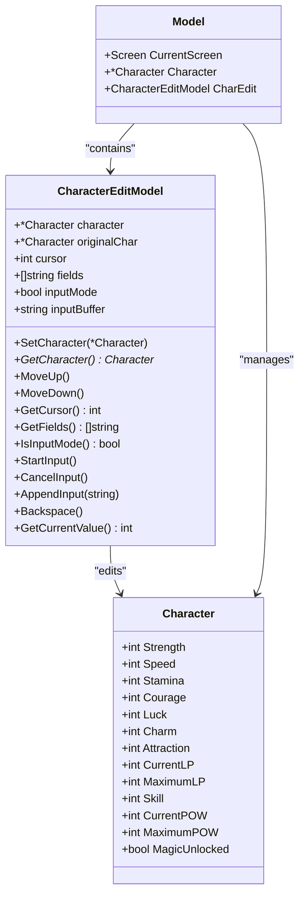
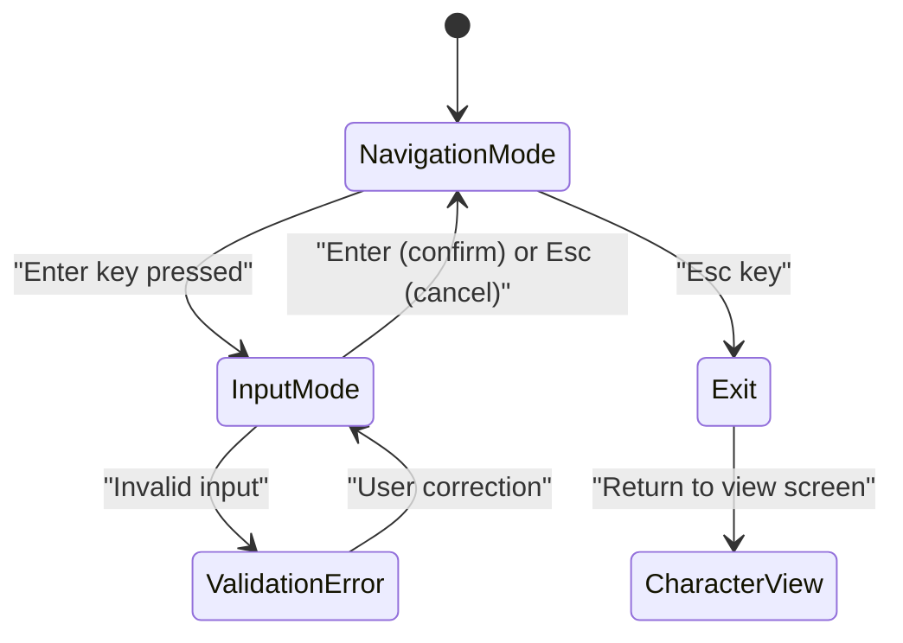
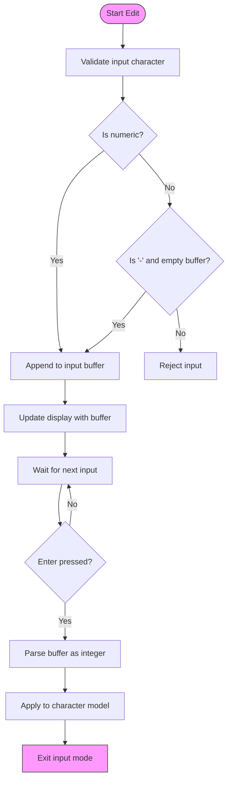
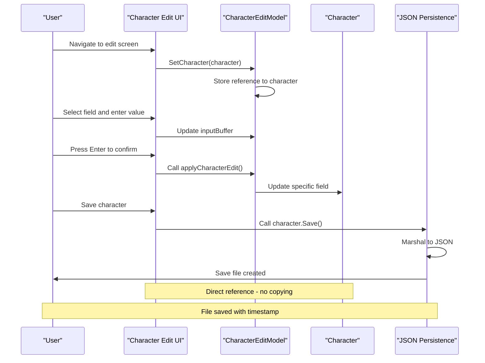
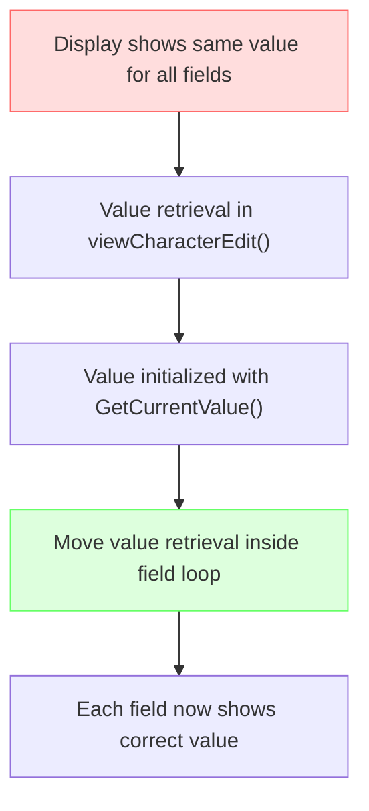

# Character Edit

<cite>
**Referenced Files in This Document**   
- [character_edit.go](file://pkg/ui/character_edit.go)
- [character.go](file://internal/character/character.go)
- [model.go](file://pkg/ui/model.go)
- [view.go](file://pkg/ui/view.go)
- [update.go](file://pkg/ui/update.go)
- [BUGFIX_CHARACTER_EDIT.md](file://BUGFIX_CHARACTER_EDIT.md)
</cite>

## Table of Contents
1. [Introduction](#introduction)
2. [Core Components](#core-components)
3. [State Management](#state-management)
4. [Data Binding and Validation](#data-binding-and-validation)
5. [Integration with Persistence Layer](#integration-with-persistence-layer)
6. [Troubleshooting Guide](#troubleshooting-guide)
7. [Best Practices for Extension](#best-practices-for-extension)

## Introduction
The Character Edit UI component provides a terminal-based interface for modifying character attributes in the Saga Demonspawn application. This documentation details the implementation of the character editing functionality, focusing on state management, data validation, and integration with the underlying character model. The component allows users to modify core characteristics, resources, and skills through a navigable form interface.

**Section sources**
- [character_edit.go](file://pkg/ui/character_edit.go#L1-L173)
- [character.go](file://internal/character/character.go#L1-L355)

## Core Components

The Character Edit functionality is implemented through several interconnected components that manage state, handle user input, and render the interface. The primary components include the `CharacterEditModel` which maintains the editing state, and the associated view and update functions that handle rendering and input processing.

**Diagram sources**
- [character_edit.go](file://pkg/ui/character_edit.go#L24-L55)
- [model.go](file://pkg/ui/model.go#L34-L56)
- [character.go](file://internal/character/character.go#L15-L44)

## State Management

The Character Edit component implements a comprehensive state management system that tracks both navigation state and input state. The `CharacterEditModel` struct maintains the current editing context, including cursor position, input mode status, and temporary input values.

The state transitions follow a clear pattern:
- **Navigation Mode**: User moves cursor up/down to select a field to edit
- **Input Mode**: User enters a new value for the selected field
- **Commit/Cancel**: User confirms or cancels the edit operation

**Diagram sources**
- [character_edit.go](file://pkg/ui/character_edit.go#L24-L173)
- [update.go](file://pkg/ui/update.go#L234-L329)

**Section sources**
- [character_edit.go](file://pkg/ui/character_edit.go#L24-L173)
- [update.go](file://pkg/ui/update.go#L234-L329)

## Data Binding and Validation

The Character Edit component implements two-way data binding between the UI fields and the underlying character model. When a user selects a field for editing, the current value is retrieved from the character model and displayed. During input, the component maintains a temporary buffer that is only applied to the model upon confirmation.

### Field Validation Rules
The component enforces validation rules at multiple levels:

1. **Input Validation**: Only numeric characters and minus sign (at start) are accepted
2. **Range Validation**: Values are checked against minimum/maximum constraints
3. **Type-Specific Validation**: Different fields have different validation requirements

**Diagram sources**
- [character_edit.go](file://pkg/ui/character_edit.go#L126-L136)
- [update.go](file://pkg/ui/update.go#L255-L277)
- [character.go](file://internal/character/character.go#L100-L256)

**Section sources**
- [character_edit.go](file://pkg/ui/character_edit.go#L126-L136)
- [update.go](file://pkg/ui/update.go#L255-L277)
- [character.go](file://internal/character/character.go#L100-L256)

## Integration with Persistence Layer

The Character Edit component integrates with the JSON persistence layer through the character model's save functionality. While the edit component itself doesn't handle persistence directly, it modifies the character model which can then be saved.

### Data Flow Sequence

**Diagram sources**
- [character_edit.go](file://pkg/ui/character_edit.go#L58-L63)
- [update.go](file://pkg/ui/update.go#L280-L328)
- [character.go](file://internal/character/character.go#L312-L339)

**Section sources**
- [character_edit.go](file://pkg/ui/character_edit.go#L58-L63)
- [update.go](file://pkg/ui/update.go#L280-L328)
- [character.go](file://internal/character/character.go#L312-L339)

## Troubleshooting Guide

This section addresses common issues encountered with the Character Edit component and provides solutions.

### Input Lag Issues
If users experience input lag or unresponsive controls:

1. **Check terminal performance**: Ensure the terminal emulator is not resource-constrained
2. **Verify event handling**: Confirm that key events are being processed promptly
3. **Review input buffering**: Check that input events are not being queued excessively

**Solution**: The component uses Bubble Tea's event-driven architecture, which should provide responsive input handling. If lag persists, check system resources and terminal configuration.

### State Desynchronization
If the displayed values don't match the actual character state:

1. **Verify field mapping**: Ensure the `EditField` enum values correctly correspond to field indices
2. **Check value retrieval**: Confirm that values are being read from the correct character fields
3. **Review display logic**: Validate that the view function retrieves values for each field independently

**Known Issue Resolution**: A display bug was previously fixed where all fields showed the cursor's value instead of their own values. This was resolved by ensuring each field's value is retrieved independently in the view function.

**Diagram sources**
- [BUGFIX_CHARACTER_EDIT.md](file://BUGFIX_CHARACTER_EDIT.md#L1-L122)
- [view.go](file://pkg/ui/view.go#L337-L405)

**Section sources**
- [BUGFIX_CHARACTER_EDIT.md](file://BUGFIX_CHARACTER_EDIT.md#L1-L122)
- [view.go](file://pkg/ui/view.go#L337-L405)

## Best Practices for Extension

When extending the Character Edit component with new fields or validation rules, follow these best practices to maintain terminal usability and code quality.

### Adding New Editable Fields
To add a new editable field:

1. **Extend the EditField enum** with a new constant
2. **Add the field name** to the fields slice in `NewCharacterEditModel`
3. **Implement value retrieval** in `GetCurrentValue()`
4. **Add field handling** in `applyCharacterEdit()`
5. **Update validation** as needed in the character model

### Adding Validation Rules
For new validation requirements:

1. **Implement validation in the character model** rather than the UI
2. **Use existing pattern** of returning errors for invalid values
3. **Provide clear error messages** that explain the validation failure
4. **Handle errors gracefully** in the UI without crashing

### Maintaining Terminal Usability
To ensure the component remains usable in terminal environments:

1. **Keep the interface simple** with clear visual hierarchy
2. **Use consistent navigation** patterns (arrow keys, Enter, Esc)
3. **Provide clear feedback** for all user actions
4. **Maintain reasonable field limits** to prevent scrolling
5. **Consider screen size constraints** in layout decisions

**Section sources**
- [character_edit.go](file://pkg/ui/character_edit.go#L8-L21)
- [character.go](file://internal/character/character.go#L100-L256)
- [update.go](file://pkg/ui/update.go#L280-L328)