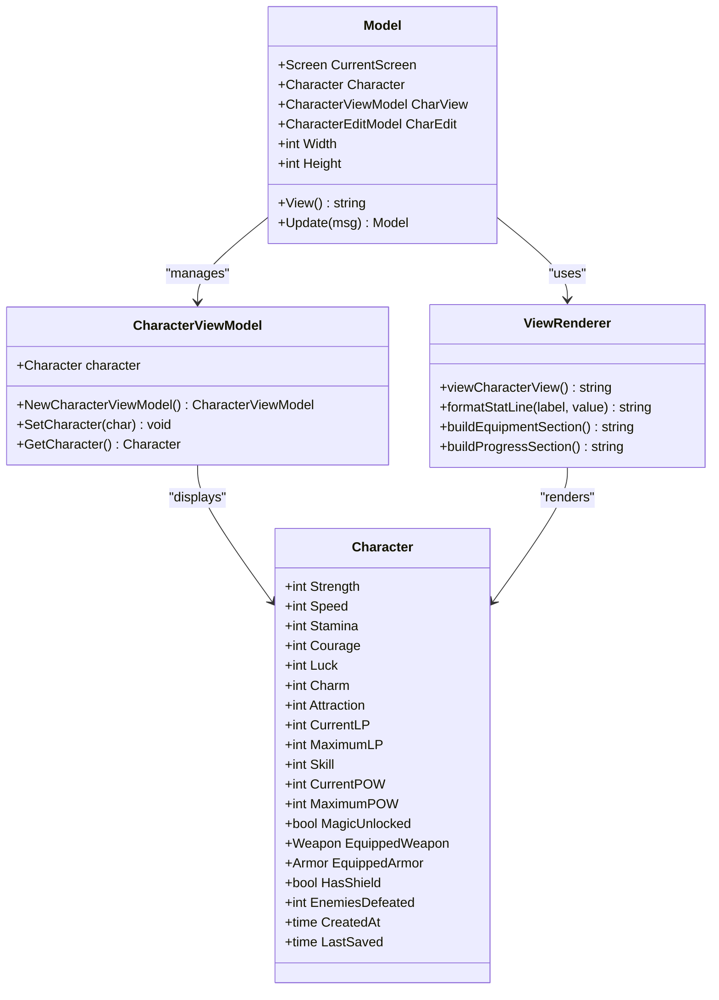
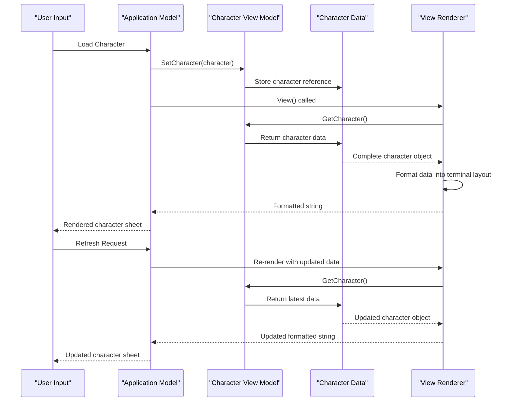
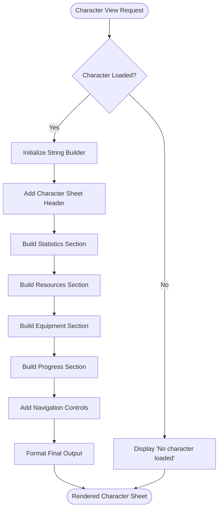
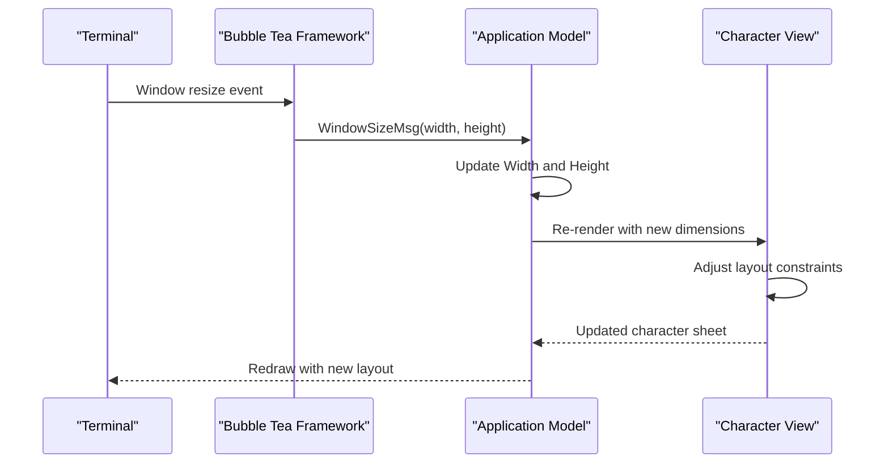
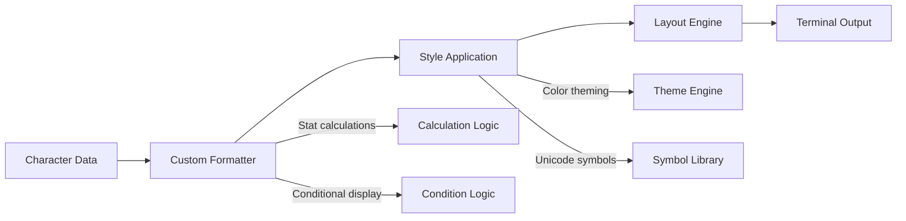
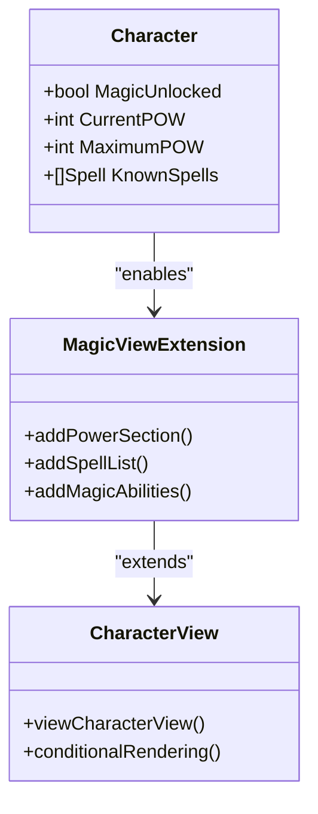

# Character View UI Component

<cite>
**Referenced Files in This Document**
- [pkg/ui/character_view.go](file://pkg/ui/character_view.go)
- [pkg/ui/view.go](file://pkg/ui/view.go)
- [pkg/ui/model.go](file://pkg/ui/model.go)
- [pkg/ui/update.go](file://pkg/ui/update.go)
- [internal/character/character.go](file://internal/character/character.go)
- [internal/items/items.go](file://internal/items/items.go)
- [README.md](file://README.md)
</cite>

## Table of Contents
1. [Introduction](#introduction)
2. [Component Architecture](#component-architecture)
3. [Data Flow and State Management](#data-flow-and-state-management)
4. [Character Sheet Layout Structure](#character-sheet-layout-structure)
5. [Rendering Implementation](#rendering-implementation)
6. [Dynamic Content Sizing](#dynamic-content-sizing)
7. [Accessibility Features](#accessibility-features)
8. [Developer Customization Guide](#developer-customization-guide)
9. [Integration with Future Game Mechanics](#integration-with-future-game-mechanics)
10. [Best Practices and Troubleshooting](#best-practices-and-troubleshooting)

## Introduction

The Character View UI component serves as the primary interface for displaying a complete character sheet within the terminal-based RPG application. Built using the Bubble Tea framework, it provides an immersive terminal experience that presents character statistics, equipment, and progress information in a structured, readable format. The component acts as the bridge between the internal character data model and the user's visual representation, handling complex data formatting while maintaining accessibility and responsiveness across different terminal dimensions.

The character view is designed to be the central hub for character information display, offering both static presentation capabilities and interactive editing functionality. It seamlessly integrates with the broader application architecture, responding to refresh commands and adapting to dynamic content changes as characters evolve through gameplay.

## Component Architecture

The Character View UI follows a layered architecture pattern that separates concerns between data management, presentation logic, and user interaction:

**Diagram sources**
- [pkg/ui/character_view.go](file://pkg/ui/character_view.go#L5-L25)
- [pkg/ui/model.go](file://pkg/ui/model.go#L33-L56)
- [internal/character/character.go](file://internal/character/character.go#L14-L44)

The architecture ensures clean separation between the view model that holds character data and the rendering logic that formats this data for terminal display. The Model coordinates between these components, managing screen state and routing user interactions.

**Section sources**
- [pkg/ui/character_view.go](file://pkg/ui/character_view.go#L1-L26)
- [pkg/ui/model.go](file://pkg/ui/model.go#L33-L56)

## Data Flow and State Management

The character view implements a unidirectional data flow pattern that ensures predictable state management and easy debugging:

**Diagram sources**
- [pkg/ui/model.go](file://pkg/ui/model.go#L78-L84)
- [pkg/ui/character_view.go](file://pkg/ui/character_view.go#L17-L25)
- [pkg/ui/view.go](file://pkg/ui/view.go#L278-L335)

The data flow maintains immutability at the core level, with the character model holding all state and the view model serving as a display wrapper. Updates propagate through the system via the Bubble Tea message-passing mechanism, ensuring that all components remain synchronized.

**Section sources**
- [pkg/ui/model.go](file://pkg/ui/model.go#L78-L84)
- [pkg/ui/update.go](file://pkg/ui/update.go#L221-L231)

## Character Sheet Layout Structure

The character sheet employs a segmented layout approach that organizes information into logical sections, each serving a specific purpose in the player's understanding of their character:

### Core Statistics Section

The statistics section presents the seven core characteristics that define the character's fundamental abilities:

| Statistic | Abbreviation | Purpose | Range |
|-----------|--------------|---------|-------|
| Strength | STR | Physical power and damage | 0-999 |
| Speed | SPD | Agility, reaction speed | 0-999 |
| Stamina | STA | Endurance and health | 0-999 |
| Courage | CRG | Mental resilience | 0-999 |
| Luck | LCK | Fortune and critical hits | 0-999 |
| Charm | CHM | Social influence | 0-999 |
| Attraction | ATT | Personal magnetism | 0-999 |

### Resource Management Section

This section tracks the character's vital resources that enable survival and progression:

| Resource | Current Value | Maximum Value | Purpose |
|----------|---------------|---------------|---------|
| Life Points | Current LP | Maximum LP | Health and survival |
| Skill | Skill Level | N/A | Combat proficiency |
| Power | Current POW | Maximum POW | Magic ability (when unlocked) |

### Equipment Inventory Section

The equipment section provides comprehensive information about the character's gear and protective measures:

| Item Type | Information Provided | Calculation Method |
|-----------|---------------------|-------------------|
| Weapon | Name and damage bonus | EquippedWeapon.DamageBonus |
| Armor | Name and protection value | EquippedArmor.Protection |
| Shield | Status and combined protection | Shield status + armor interaction |
| Total Protection | Combined damage reduction | Armor + Shield calculations |

### Progress Tracking Section

This section showcases the character's journey and achievements:

| Metric | Description | Update Trigger |
|--------|-------------|----------------|
| Enemies Defeated | Total combat victories | IncrementEnemiesDefeated() |
| Creation Date | Character birth timestamp | Character creation |
| Last Saved | Latest save operation | SaveCharacter() |

**Section sources**
- [pkg/ui/view.go](file://pkg/ui/view.go#L294-L330)
- [internal/character/character.go](file://internal/character/character.go#L16-L44)

## Rendering Implementation

The character view rendering process utilizes a sophisticated string building approach that creates visually appealing terminal layouts using Unicode box-drawing characters and consistent formatting:

**Diagram sources**
- [pkg/ui/view.go](file://pkg/ui/view.go#L278-L335)

The rendering process employs several key techniques:

### Unicode Box-Drawing Integration

The component uses Unicode box-drawing characters to create professional-looking borders around sections:

- Top border: `╔════════╗`
- Side borders: `║` (pipe characters)
- Bottom border: `╚════════╝`
- Internal dividers: `─` (horizontal line)

### Consistent Formatting Patterns

All data fields follow standardized formatting rules:

- Labels are left-aligned with consistent spacing
- Values are right-aligned for numerical data
- Units and descriptions are clearly separated
- Empty states are handled gracefully with placeholder text

### Dynamic Content Adaptation

The renderer automatically adapts to different character states:

- Magic-unlocked characters display POW resources
- Characters with equipment show protection calculations
- Empty equipment slots are omitted for clarity

**Section sources**
- [pkg/ui/view.go](file://pkg/ui/view.go#L278-L335)

## Dynamic Content Sizing

The character view implements responsive design principles that adapt to various terminal dimensions while maintaining readability and usability:

### Terminal Dimension Awareness

The application continuously monitors terminal size through Bubble Tea's WindowSizeMsg mechanism:

**Diagram sources**
- [pkg/ui/update.go](file://pkg/ui/update.go#L19-L24)
- [pkg/ui/model.go](file://pkg/ui/model.go#L52-L55)

### Responsive Layout Adaptations

The character view adjusts its presentation based on available space:

| Terminal Size | Adaptation Strategy | Impact |
|---------------|--------------------|---------|
| Small (< 80 cols) | Compact formatting | Reduced padding, condensed sections |
| Medium (80-120 cols) | Standard formatting | Balanced readability and space |
| Large (> 120 cols) | Expanded formatting | Enhanced visual hierarchy |

### Content Overflow Management

When terminal space becomes constrained, the system implements graceful degradation:

- Truncation of long field descriptions
- Simplified equipment listings
- Collapsed empty sections
- Priority-based content retention

**Section sources**
- [pkg/ui/update.go](file://pkg/ui/update.go#L19-L24)
- [pkg/ui/model.go](file://pkg/ui/model.go#L52-L55)

## Accessibility Features

The character view incorporates several accessibility enhancements to ensure usability across diverse user needs and environments:

### Color Contrast Optimization

While the current implementation focuses on monochrome terminal display, the design maintains high contrast through:

- Bold Unicode borders for clear section separation
- Consistent spacing for visual grouping
- Hierarchical font weight through bold Unicode characters
- Clear label-value pair associations

### Text Scaling and Readability

The component implements several text scaling strategies:

- Fixed-width formatting ensures consistent alignment
- Proportional spacing maintains visual balance
- Hierarchical section headers provide clear organization
- Numeric values are consistently formatted for quick scanning

### Keyboard Navigation Support

Full keyboard accessibility is maintained through:

- Arrow key navigation for section browsing
- Enter key activation for actions
- Escape key for cancellation and navigation
- Tab order preservation within sections

### Alternative Input Methods

The view supports various input methods:

- Direct numeric input for stat editing
- Cursor-based selection for navigation
- Quick action shortcuts (e.g., 'e' for edit)
- Context-sensitive help displays

**Section sources**
- [pkg/ui/view.go](file://pkg/ui/view.go#L332-L333)
- [pkg/ui/update.go](file://pkg/ui/update.go#L223-L230)

## Developer Customization Guide

The character view provides multiple extension points for developers to customize and enhance the display functionality:

### Adding New Stat Visualizations

To incorporate new statistics into the character sheet:

1. **Extend the Character Model**: Add new fields to the internal character structure
2. **Update the View Logic**: Modify the viewCharacterView() function to include new sections
3. **Handle Conditional Display**: Implement logic for magic-unlocked or equipment-dependent stats
4. **Maintain Layout Consistency**: Ensure new content fits within existing formatting patterns

### Customizing Display Formats

Several formatting customization options are available:

**Diagram sources**
- [pkg/ui/view.go](file://pkg/ui/view.go#L278-L335)

### Integration Points for Extensions

The architecture provides several key integration points:

| Extension Point | Purpose | Implementation Approach |
|----------------|---------|------------------------|
| New Stat Sections | Add custom statistics | Extend viewCharacterView() |
| Equipment Categories | Different item types | Modify equipment rendering |
| Progress Metrics | Additional tracking | Add new progress sections |
| Visual Themes | Styling variations | Implement theme interface |

### Validation and Error Handling

When extending the character view, implement robust validation:

- Input sanitization for custom fields
- Boundary checking for numeric values
- Graceful handling of missing data
- Error message formatting for display

**Section sources**
- [pkg/ui/view.go](file://pkg/ui/view.go#L278-L335)
- [internal/character/character.go](file://internal/character/character.go#L101-L111)

## Integration with Future Game Mechanics

The character view is designed with extensibility in mind, supporting seamless integration of upcoming game mechanics:

### Magic System Integration

Future magic system implementation will extend the character view through:

**Diagram sources**
- [internal/character/character.go](file://internal/character/character.go#L30-L34)
- [pkg/ui/view.go](file://pkg/ui/view.go#L304-L306)

### Combat System Enhancements

As combat mechanics are implemented, the character view will expand to include:

- Initiative calculation displays
- Combat modifier indicators
- Status effect tracking
- Damage resistance information

### Inventory Management Integration

Future inventory systems will integrate through:

- Equipment slot visualization
- Item count displays
- Weight and capacity indicators
- Special item identification

### Progression Tracking Enhancement

The progress section will accommodate:

- Experience point tracking
- Level advancement indicators
- Achievement completion status
- Quest progress displays

**Section sources**
- [README.md](file://README.md#L22-L37)
- [internal/character/character.go](file://internal/character/character.go#L30-L34)

## Best Practices and Troubleshooting

### Performance Optimization

To maintain optimal performance in the character view:

- Minimize string concatenation in hot paths
- Cache frequently accessed character data
- Implement lazy loading for expensive calculations
- Use efficient string builder patterns

### Common Issues and Solutions

| Issue | Symptoms | Solution |
|-------|----------|----------|
| Outdated Display | Stale character information | Implement proper refresh triggers |
| Layout Corruption | Misaligned sections | Validate terminal dimensions |
| Missing Data | Empty or incorrect fields | Add null checks and defaults |
| Performance Issues | Slow rendering | Optimize string operations |

### Debugging Strategies

Effective debugging approaches for the character view:

1. **State Inspection**: Verify character data integrity
2. **Layout Validation**: Check section boundaries and alignment
3. **Content Verification**: Ensure all fields are populated correctly
4. **Performance Monitoring**: Track rendering times and memory usage

### Maintenance Guidelines

For long-term maintenance of the character view:

- Document all formatting patterns and their purposes
- Maintain consistent coding standards across sections
- Implement comprehensive unit tests for rendering logic
- Regular accessibility audits for terminal compatibility

**Section sources**
- [pkg/ui/view.go](file://pkg/ui/view.go#L278-L335)
- [pkg/ui/update.go](file://pkg/ui/update.go#L221-L231)