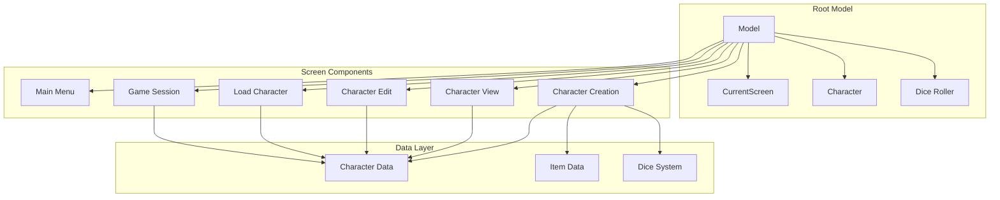
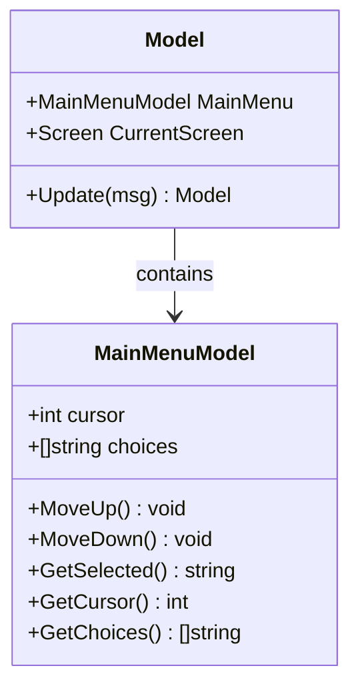
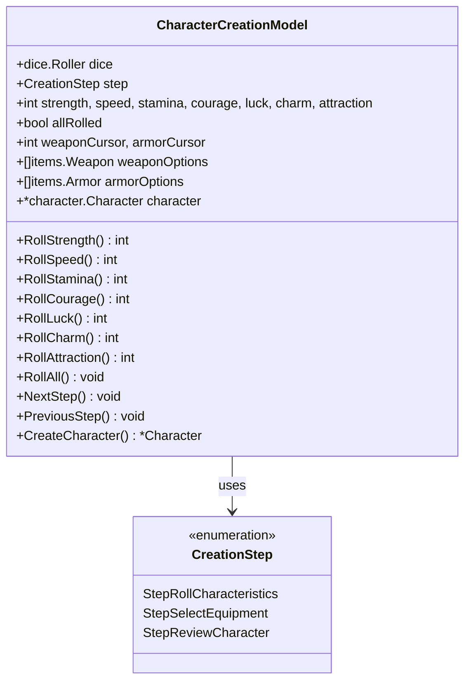
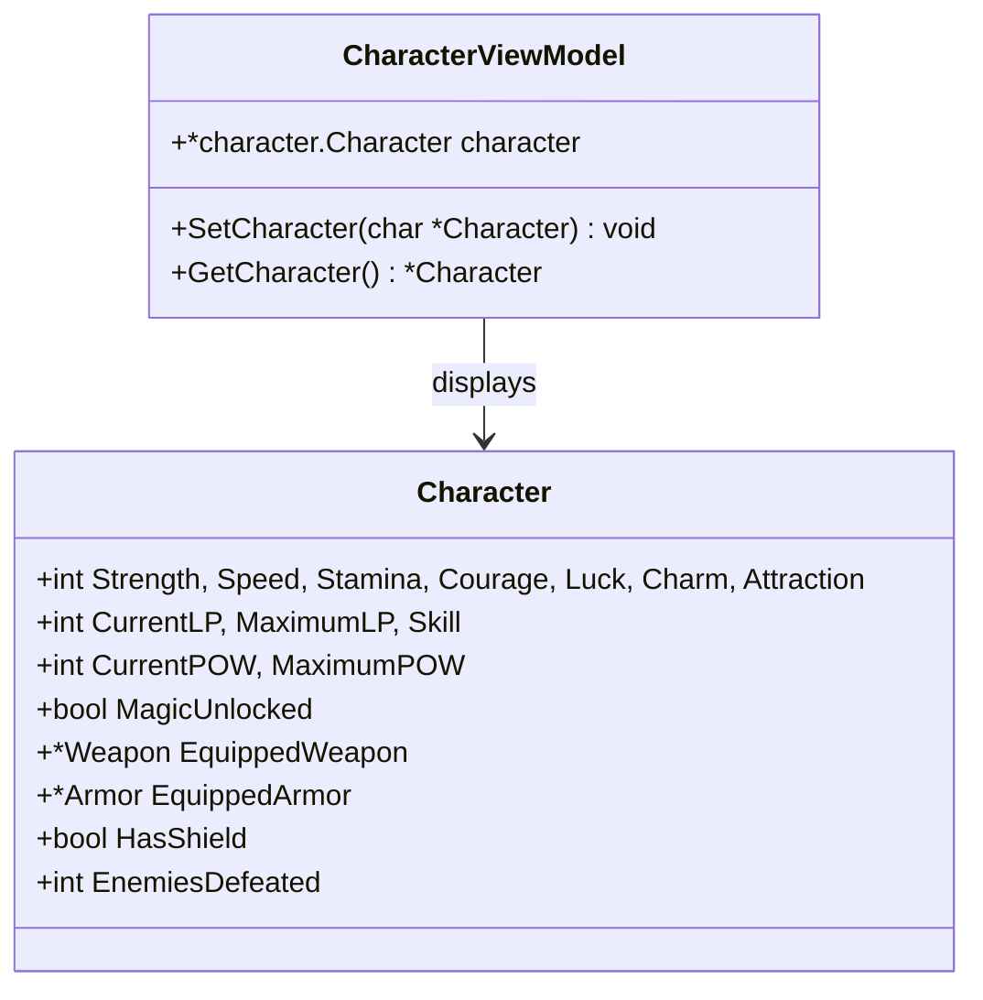
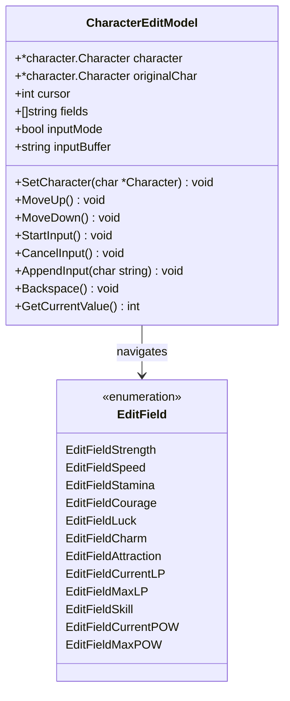
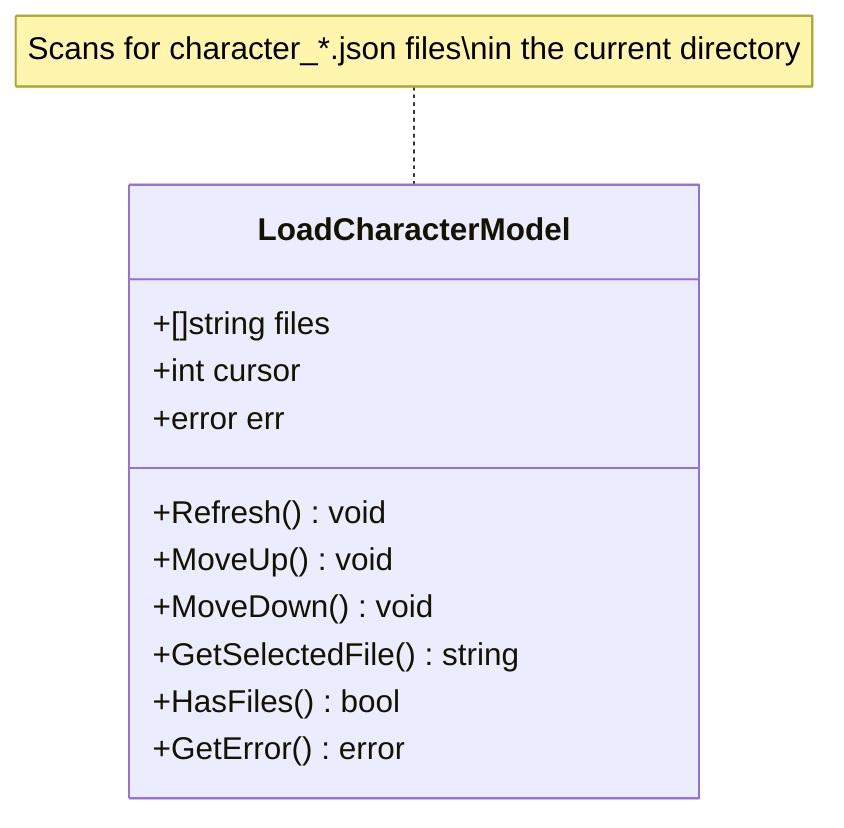
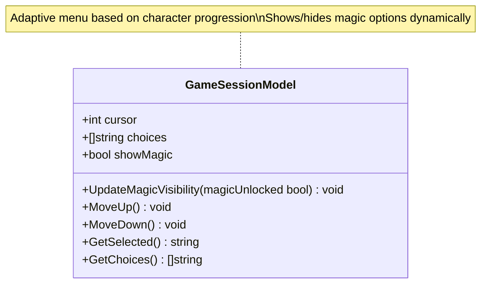
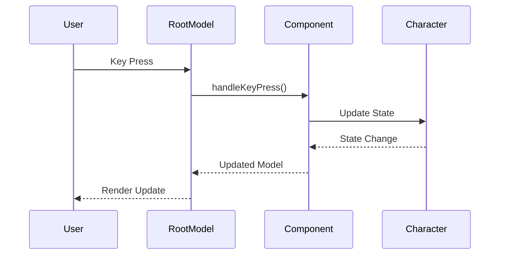

# Component Reference

<cite>
**Referenced Files in This Document**
- [model.go](file://pkg/ui/model.go)
- [main_menu.go](file://pkg/ui/main_menu.go)
- [character_creation.go](file://pkg/ui/character_creation.go)
- [character_view.go](file://pkg/ui/character_view.go)
- [character_edit.go](file://pkg/ui/character_edit.go)
- [load_character.go](file://pkg/ui/load_character.go)
- [game_session.go](file://pkg/ui/game_session.go)
- [update.go](file://pkg/ui/update.go)
- [character.go](file://internal/character/character.go)
- [items.go](file://internal/items/items.go)
</cite>

## Table of Contents
1. [Introduction](#introduction)
2. [Application Architecture](#application-architecture)
3. [Main Menu Component](#main-menu-component)
4. [Character Creation Component](#character-creation-component)
5. [Character View Component](#character-view-component)
6. [Character Edit Component](#character-edit-component)
7. [Load Character Component](#load-character-component)
8. [Game Session Component](#game-session-component)
9. [Component Integration](#component-integration)
10. [Development Guidelines](#development-guidelines)

## Introduction

The saga-demonspawn application is a command-line interface built with the Bubble Tea framework, providing a comprehensive character management system for the "Sagas of the Demonspawn" gamebook. The UI consists of six primary components, each implementing the Elm Architecture pattern with immutable state management and message-driven updates.

Each component serves a specific purpose in the player's journey through character creation, management, and gameplay. The components are designed to work seamlessly together while maintaining clear separation of concerns and consistent user experience patterns.

## Application Architecture

The application follows a hierarchical architecture where the root `Model` orchestrates all screen components. Each screen maintains its own state and responds to user input through a centralized update mechanism.



**Diagram sources**
- [model.go](file://pkg/ui/model.go#L33-L76)
- [update.go](file://pkg/ui/update.go#L16-L30)

**Section sources**
- [model.go](file://pkg/ui/model.go#L1-L95)
- [update.go](file://pkg/ui/update.go#L1-L329)

## Main Menu Component

The Main Menu component serves as the application's entry point, providing navigation to all major features through a simple keyboard-driven interface.

### Purpose and Functionality

The Main Menu establishes the foundation for user interaction, offering three primary options:
- **New Character**: Initiates the character creation flow
- **Load Character**: Opens the character loading interface
- **Exit**: Terminates the application

### Internal State Structure



**Diagram sources**
- [main_menu.go](file://pkg/ui/main_menu.go#L4-L49)
- [model.go](file://pkg/ui/model.go#L45-L46)

### Rendering Behavior

The menu displays as a vertical list with cursor highlighting. Navigation uses arrow keys or vim-style hjkl controls, with immediate visual feedback for selection changes.

### Input Handling

| Key Binding | Action | Transition |
|-------------|--------|------------|
| `↑`, `k` | Move cursor up | Update cursor position |
| `↓`, `j` | Move cursor down | Update cursor position |
| `Enter` | Select option | Navigate to target screen |
| `q`, `Esc` | Exit application | Quit command |

### Integration Points

The Main Menu integrates with the root model through the `handleMainMenuKeys` function, which routes keypresses to appropriate menu actions and manages screen transitions.

**Section sources**
- [main_menu.go](file://pkg/ui/main_menu.go#L1-L49)
- [update.go](file://pkg/ui/update.go#L58-L81)

## Character Creation Component

The Character Creation component implements a multi-step process for building player characters, including characteristic rolling, equipment selection, and final review.

### Purpose and Functionality

This component guides users through three distinct phases:
1. **Roll Characteristics**: Generates seven core attributes using dice mechanics
2. **Select Equipment**: Chooses starting weapons and armor from predefined options
3. **Review Character**: Finalizes character creation with confirmation

### Internal State Structure



**Diagram sources**
- [character_creation.go](file://pkg/ui/character_creation.go#L21-L44)
- [character_creation.go](file://pkg/ui/character_creation.go#L9-L19)

### Rendering Behavior

The component adapts its display based on the current creation step:
- **Roll Characteristics**: Shows individual characteristic buttons with roll results
- **Select Equipment**: Presents dual-column layout for weapons and armor selection
- **Review Character**: Displays complete character sheet with confirmation options

### Input Handling and Validation

| Step | Input Keys | Actions | Validation Rules |
|------|------------|---------|------------------|
| Roll | `r` | Roll all characteristics | Automatic completion check |
| Roll | `Enter` | Advance to equipment | Must roll all characteristics |
| Equipment | `←`, `→`, `↑`, `↓` | Navigate selections | Bounds checking |
| Equipment | `Enter` | Advance to review | Equipment selection required |
| Review | `Enter` | Create character | Final confirmation |
| Review | `Esc` | Return to equipment | Step navigation |

### Dice Rolling Integration

The character creation process utilizes the shared dice roller system, ensuring consistent randomization across the application. Each characteristic is rolled using the game's standard 2d6×8 formula.

**Section sources**
- [character_creation.go](file://pkg/ui/character_creation.go#L1-L279)
- [update.go](file://pkg/ui/update.go#L109-L181)

## Character View Component

The Character View component provides a comprehensive display of character statistics and equipment, serving as the primary character information screen.

### Purpose and Functionality

This component offers a read-only view of all character attributes, including:
- Core characteristics (STR, SPD, STA, CRG, LCK, CHM, ATT)
- Derived values (LP, Max LP, Skill, POW)
- Equipment status (weapon, armor, shield)
- Progress indicators (enemies defeated)

### Internal State Structure



**Diagram sources**
- [character_view.go](file://pkg/ui/character_view.go#L5-L26)
- [character.go](file://internal/character/character.go#L15-L44)

### Rendering Behavior

The view presents character data in a structured layout with clear visual hierarchy. Equipment status is prominently displayed, and derived values are calculated and formatted appropriately.

### Integration Points

The Character View receives character data from the root model and maintains a reference to the current character. It supports seamless transitions to the edit mode for modifications.

**Section sources**
- [character_view.go](file://pkg/ui/character_view.go#L1-L26)
- [update.go](file://pkg/ui/update.go#L221-L232)

## Character Edit Component

The Character Edit component enables fine-tuning of character attributes through an interactive editing interface.

### Purpose and Functionality

This component provides granular control over character statistics, allowing players to adjust values precisely. It supports both characteristic modification and derived value adjustments.

### Internal State Structure



**Diagram sources**
- [character_edit.go](file://pkg/ui/character_edit.go#L23-L31)
- [character_edit.go](file://pkg/ui/character_edit.go#L5-L21)

### Rendering Behavior

The editor displays fields in a list format with cursor highlighting. When in input mode, it shows the current value and input buffer for real-time editing feedback.

### Input Handling and Validation

| Key Binding | Mode | Action | Validation |
|-------------|------|--------|------------|
| `↑`, `k` | Normal | Move cursor up | Bounds checking |
| `↓`, `j` | Normal | Move cursor down | Magic unlock check |
| `Enter` | Normal | Start input | Field-specific |
| `Enter` | Input | Apply changes | Numeric parsing |
| `Esc` | Input | Cancel input | Reset buffer |
| `Backspace` | Input | Remove character | Buffer manipulation |
| `0-9` | Input | Add digit | Numeric input |
| `-` | Input | Add minus | Negative values |

### Field-Specific Behavior

The edit component adapts its behavior based on the selected field:
- **Characteristics**: Direct assignment with validation
- **LP Values**: Special handling for life point calculations
- **POW Values**: Magic system integration with unlock conditions

**Section sources**
- [character_edit.go](file://pkg/ui/character_edit.go#L1-L173)
- [update.go](file://pkg/ui/update.go#L234-L278)

## Load Character Component

The Load Character component provides character file management through a filesystem-based interface.

### Purpose and Functionality

This component scans the current directory for saved character files and enables selection and loading of existing characters.

### Internal State Structure



**Diagram sources**
- [load_character.go](file://pkg/ui/load_character.go#L9-L14)

### Rendering Behavior

The component displays a list of available save files with cursor navigation. File information includes modification timestamps extracted from filenames.

### File Discovery and Management

The load process automatically discovers character files using a glob pattern (`character_*.json`). Each file is validated and presented with metadata extraction for user-friendly display.

### Integration Points

Successful character loading triggers the root model's `LoadCharacter` method, which transitions to the game session and updates all relevant component states.

**Section sources**
- [load_character.go](file://pkg/ui/load_character.go#L1-L97)
- [update.go](file://pkg/ui/update.go#L83-L106)

## Game Session Component

The Game Session component serves as the central hub for ongoing character management and progression activities.

### Purpose and Functionality

This component provides access to all major game features, including character viewing, editing, combat preparation, and inventory management. It dynamically adjusts available options based on character progression.

### Internal State Structure



**Diagram sources**
- [game_session.go](file://pkg/ui/game_session.go#L3-L8)

### Dynamic Menu Adaptation

The game session menu adapts based on character progression:
- **Base Options**: Character view, edit, combat, inventory, save & exit
- **Magic Unlocked**: Adds "Cast Spell" option to the menu

### Rendering Behavior

The component maintains a consistent layout with cursor highlighting and immediate visual feedback for selection changes.

### Navigation Matrix

| Selection | Target Screen | Condition |
|-----------|---------------|-----------|
| View Character | Character View | Always available |
| Edit Character Stats | Character Edit | Always available |
| Combat | Combat (Phase 2) | Future implementation |
| Cast Spell | Magic (Phase 4) | Magic unlocked |
| Manage Inventory | Inventory (Phase 3) | Future implementation |
| Save & Exit | Main Menu | Always available |

**Section sources**
- [game_session.go](file://pkg/ui/game_session.go#L1-L77)
- [update.go](file://pkg/ui/update.go#L183-L219)

## Component Integration

The UI components work together through a coordinated state management system that ensures data consistency and smooth transitions.

### State Synchronization



**Diagram sources**
- [model.go](file://pkg/ui/model.go#L33-L76)
- [update.go](file://pkg/ui/update.go#L16-L30)

### Data Flow Patterns

1. **Initialization**: Root model creates all component instances with initial state
2. **Updates**: Key presses route through centralized handlers to appropriate components
3. **State Changes**: Component updates trigger root model re-rendering
4. **Transitions**: Screen changes coordinate with component state resets

### Shared Resources

Components share several resources:
- **Dice Roller**: Consistent randomization across character creation
- **Character Data**: Persistent state managed by root model
- **Terminal Dimensions**: Responsive layout adaptation

**Section sources**
- [model.go](file://pkg/ui/model.go#L78-L95)
- [update.go](file://pkg/ui/update.go#L32-L57)

## Development Guidelines

### Extending Components

When adding new UI components or modifying existing ones, follow these guidelines:

#### State Management
- Maintain immutability in state updates
- Use dedicated methods for state transitions
- Implement proper validation for all input

#### Input Handling
- Support both arrow keys and vim-style navigation
- Provide consistent key binding patterns
- Handle edge cases gracefully (bounds checking, validation)

#### Integration Patterns
- Follow the established messaging patterns
- Coordinate with the root model for state synchronization
- Implement proper cleanup and reset mechanisms

### Styling with Lipgloss

While the current implementation focuses on functionality, future enhancements could incorporate lipgloss for improved visual presentation:

```go
// Example styling pattern (future enhancement)
import "github.com/charmbracelet/lipgloss"

var (
    titleStyle = lipgloss.NewStyle().
        Bold(true).
        Foreground(lipgloss.Color("#FF69B4"))
    highlightStyle = lipgloss.NewStyle().
        Underline(true).
        Foreground(lipgloss.Color("#87CEEB"))
)
```

### Testing Strategies

Implement comprehensive testing for each component:

1. **Unit Tests**: Test individual component methods and state transitions
2. **Integration Tests**: Verify component coordination and data flow
3. **UI Tests**: Automated testing of user interactions and rendering

### Performance Considerations

- Minimize allocations in hot paths
- Cache expensive computations when appropriate
- Optimize rendering for terminal responsiveness

### Accessibility

Ensure keyboard navigation is intuitive and comprehensive:
- Provide clear visual feedback for all states
- Support screen readers through semantic markup
- Maintain logical tab order for navigation