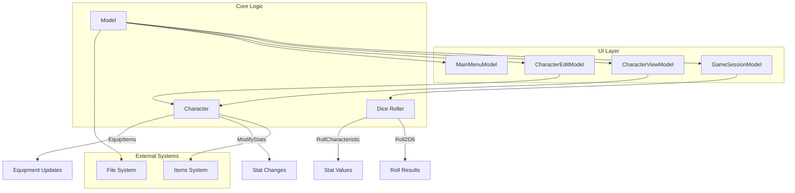
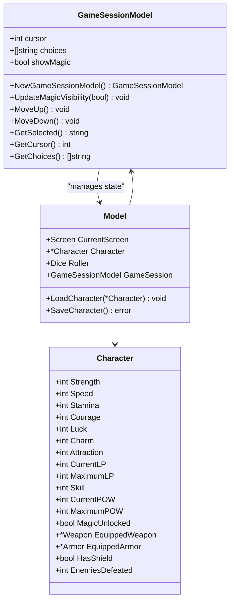
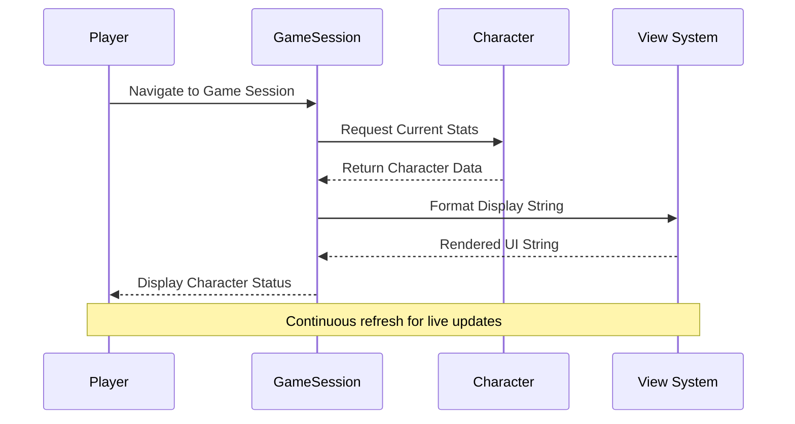
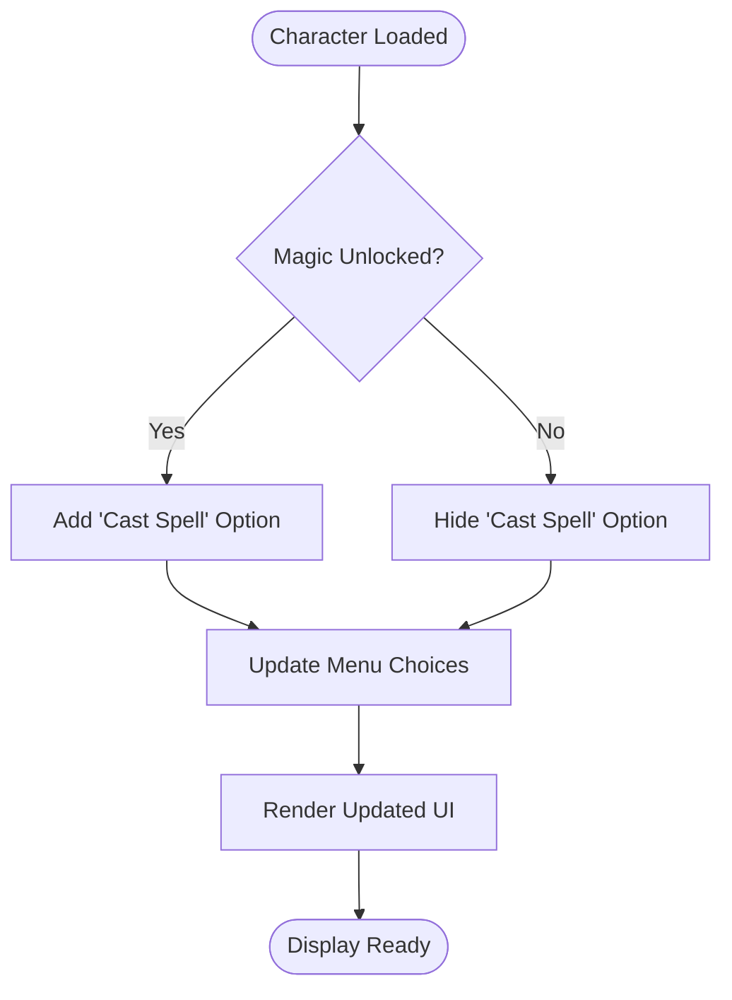
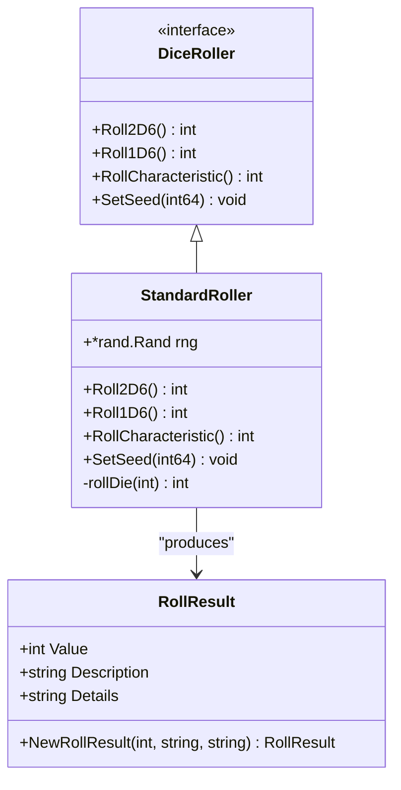
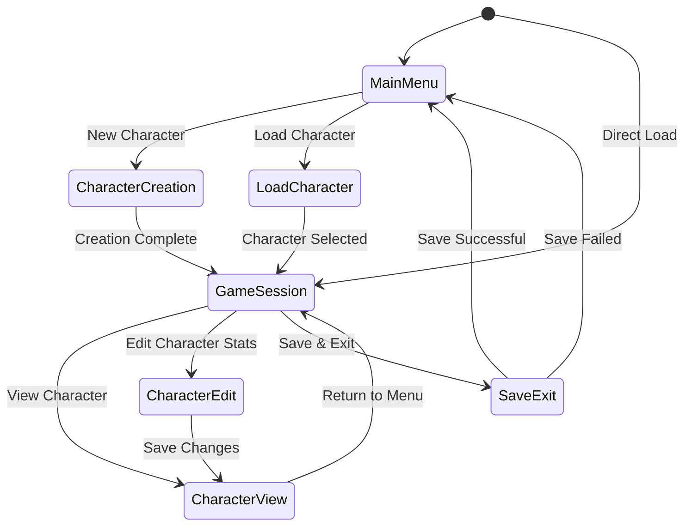
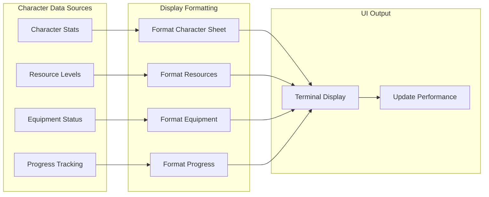
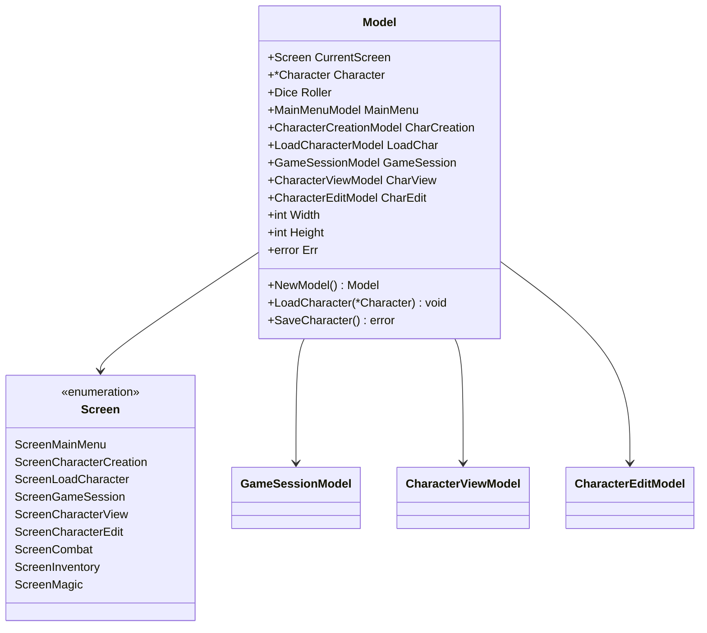

# Game Session UI Component

<cite>
**Referenced Files in This Document**
- [game_session.go](file://pkg/ui/game_session.go)
- [model.go](file://pkg/ui/model.go)
- [update.go](file://pkg/ui/update.go)
- [view.go](file://pkg/ui/view.go)
- [character_edit.go](file://pkg/ui/character_edit.go)
- [character_view.go](file://pkg/ui/character_view.go)
- [dice.go](file://internal/dice/dice.go)
- [character.go](file://internal/character/character.go)
- [items.go](file://internal/items/items.go)
- [main_menu.go](file://pkg/ui/main_menu.go)
</cite>

## Table of Contents
1. [Introduction](#introduction)
2. [Architecture Overview](#architecture-overview)
3. [Core Components](#core-components)
4. [Character Data Management](#character-data-management)
5. [Dice Rolling Integration](#dice-rolling-integration)
6. [Navigation and Keyboard Shortcuts](#navigation-and-keyboard-shortcuts)
7. [Real-Time Display System](#real-time-display-system)
8. [State Management](#state-management)
9. [Performance Optimization](#performance-optimization)
10. [Extension Guidelines](#extension-guidelines)
11. [Usability Considerations](#usability-considerations)
12. [Troubleshooting Guide](#troubleshooting-guide)

## Introduction

The Game Session UI component serves as the central interface during active gameplay in the Saga Demonspawn application. Built using the Bubble Tea framework, it provides players with comprehensive access to character statistics, dice rolling capabilities, and seamless navigation to various gameplay features including character editing, combat preparation, inventory management, and magic system integration.

This component maintains situational awareness through real-time character data display while offering efficient keyboard-driven navigation for quick actions. The implementation emphasizes performance optimization for frequent screen refreshes and provides extensible architecture for future gameplay enhancements.

## Architecture Overview

The Game Session UI follows the Model-View-Update (MVU) architecture pattern, with clear separation of concerns between state management, rendering logic, and user input handling.

**Diagram sources**
- [model.go](file://pkg/ui/model.go#L33-L75)
- [game_session.go](file://pkg/ui/game_session.go#L4-L22)
- [character.go](file://internal/character/character.go#L14-L44)

**Section sources**
- [model.go](file://pkg/ui/model.go#L33-L75)
- [game_session.go](file://pkg/ui/game_session.go#L4-L22)

## Core Components

### GameSessionModel Structure

The GameSessionModel represents the primary state container for the game session interface, managing menu navigation and dynamic content display.

**Diagram sources**
- [game_session.go](file://pkg/ui/game_session.go#L4-L77)
- [model.go](file://pkg/ui/model.go#L33-L75)
- [character.go](file://internal/character/character.go#L14-L44)

### Menu System Implementation

The game session presents a hierarchical menu system with dynamic content based on character progression and feature availability.

| Menu Option | Purpose | Availability | Keyboard Shortcut |
|-------------|---------|--------------|-------------------|
| View Character | Display full character sheet | Always available | - |
| Edit Character Stats | Modify character attributes | Always available | - |
| Combat | Access combat interface | Phase 2 feature | - |
| Cast Spell | Magic system activation | Requires magic unlock | - |
| Manage Inventory | Item management | Phase 3 feature | - |
| Save & Exit | Persist character and return | Always available | - |

**Section sources**
- [game_session.go](file://pkg/ui/game_session.go#L11-L46)
- [update.go](file://pkg/ui/update.go#L183-L217)

## Character Data Management

### Real-Time Character Display

The game session maintains real-time display of critical character statistics, providing immediate feedback on character status and capabilities.

**Diagram sources**
- [view.go](file://pkg/ui/view.go#L97-L131)
- [character.go](file://internal/character/character.go#L14-L44)

### Dynamic Magic System Integration

The game session dynamically adjusts menu options based on character progression, particularly the unlocking of magic abilities.

**Diagram sources**
- [game_session.go](file://pkg/ui/game_session.go#L25-L46)
- [update.go](file://pkg/ui/update.go#L99-L100)

**Section sources**
- [game_session.go](file://pkg/ui/game_session.go#L25-L46)
- [view.go](file://pkg/ui/view.go#L97-L131)

## Dice Rolling Integration

### Dice Module Integration

The game session seamlessly integrates with the internal/dice/dice.go module to provide in-session rolling capabilities and statistical analysis.

**Diagram sources**
- [dice.go](file://internal/dice/dice.go#L11-L97)

### Command Composition for Dice Operations

The dice system supports both interactive rolling and automated statistical generation, with results integrated into character creation and gameplay scenarios.

**Section sources**
- [dice.go](file://internal/dice/dice.go#L11-L97)
- [update.go](file://pkg/ui/update.go#L122-L137)

## Navigation and Keyboard Shortcuts

### Comprehensive Keyboard Interface

The game session provides extensive keyboard shortcut support for efficient navigation and action execution.

| Action Category | Keys | Function | Context |
|----------------|------|----------|---------|
| Navigation | ↑/↓, k/j | Move cursor through menu options | All menus |
| Selection | Enter | Execute selected action | All menus |
| Exit | q, Esc | Return to previous screen or save | All menus |
| Character Editing | e | Enter edit mode | Character view |
| Quick Actions | Various | Direct shortcuts to common functions | Game session |

### State Transition Logic

**Diagram sources**
- [update.go](file://pkg/ui/update.go#L183-L217)
- [model.go](file://pkg/ui/model.go#L12-L30)

**Section sources**
- [update.go](file://pkg/ui/update.go#L183-L217)
- [view.go](file://pkg/ui/view.go#L97-L131)

## Real-Time Display System

### Character Statistics Rendering

The game session continuously displays critical character information with real-time updates reflecting changes in stats, resources, and equipment.

**Diagram sources**
- [view.go](file://pkg/ui/view.go#L278-L404)
- [character.go](file://internal/character/character.go#L14-L44)

### Dynamic Content Updates

The display system automatically adapts to character progression, showing/hiding features like magic spells and power systems as they become available.

**Section sources**
- [view.go](file://pkg/ui/view.go#L97-L131)
- [character.go](file://internal/character/character.go#L14-L44)

## State Management

### Model Architecture

The Model structure serves as the central state container, coordinating between different UI components and maintaining application-wide consistency.

**Diagram sources**
- [model.go](file://pkg/ui/model.go#L33-L75)

### State Persistence

Character data is maintained across session transitions and automatically persisted to disk using JSON serialization with timestamp-based filenames.

**Section sources**
- [model.go](file://pkg/ui/model.go#L33-L95)
- [character.go](file://internal/character/character.go#L312-L338)

## Performance Optimization

### Efficient Screen Refreshing

The game session implements several optimization strategies to ensure smooth performance during frequent screen updates:

- **Selective Redrawing**: Only modified portions of the display are refreshed
- **Cached Calculations**: Character-derived values are cached until changed
- **Minimal String Operations**: Display formatting uses efficient string building
- **Lazy Loading**: Character data is loaded on-demand rather than pre-computed

### Memory Management

The system employs careful memory management to prevent accumulation of unused data during long gaming sessions.

**Section sources**
- [view.go](file://pkg/ui/view.go#L8-L404)
- [model.go](file://pkg/ui/model.go#L33-L95)

## Extension Guidelines

### Adding Combat Timers

To integrate combat timers within the session context:

1. **Extend GameSessionModel**: Add timer state variables
2. **Update Menu Options**: Include "Combat Timer" option when applicable
3. **Timer Logic**: Implement countdown functionality with pause/resume capability
4. **Display Integration**: Show timer status in character header display

### Initiative Tracking System

For implementing initiative tracking:

1. **Character Initiative**: Store initiative values alongside character data
2. **Turn Order Management**: Create turn order calculation and display logic
3. **Visual Indicators**: Add color-coding or markers for active turns
4. **Integration Points**: Connect with combat system for seamless transitions

### Magic System Enhancements

To expand the magic system integration:

1. **Spell Casting Interface**: Develop spell selection and targeting logic
2. **Power Resource Management**: Track and display current/maximum power levels
3. **Spell Effect Tracking**: Implement temporary effect duration management
4. **Magic Learning Progression**: Add spell acquisition and mastery systems

**Section sources**
- [game_session.go](file://pkg/ui/game_session.go#L25-L46)
- [character.go](file://internal/character/character.go#L222-L255)

## Usability Considerations

### Situational Awareness

The game session prioritizes maintaining player situational awareness through:

- **Clear Information Hierarchy**: Important stats prominently displayed
- **Consistent Layout**: Familiar navigation patterns across all screens
- **Visual Feedback**: Immediate response to user actions
- **Contextual Help**: Inline guidance for available actions

### Accessibility Features

The interface supports accessibility through:

- **Keyboard-Only Navigation**: Full functionality available without mouse
- **High Contrast Display**: Clear visual distinction between active and inactive elements
- **Descriptive Text**: Meaningful labels for all interactive elements
- **Error Handling**: Clear messaging for invalid operations

### Performance Considerations

- **Responsive Design**: Interface adapts to terminal size changes
- **Smooth Transitions**: Animated state changes for better user experience
- **Efficient Input Handling**: Minimal latency between keystrokes and visual feedback

**Section sources**
- [view.go](file://pkg/ui/view.go#L97-L131)
- [update.go](file://pkg/ui/update.go#L183-L217)

## Troubleshooting Guide

### Common Issues and Solutions

| Issue | Symptoms | Solution |
|-------|----------|----------|
| Menu Navigation Not Working | Cursor movement keys ineffective | Verify key binding configuration |
| Character Data Not Updating | Stats appear stale | Check character modification functions |
| Magic Option Missing | Cast Spell unavailable | Confirm character magic unlock status |
| Display Corruption | Garbled text or layout issues | Resize terminal window or reset display |
| Save Failures | Cannot persist character changes | Verify file permissions and disk space |

### Debugging Techniques

1. **State Inspection**: Use debug prints to monitor model state changes
2. **Event Tracing**: Log key press events to identify input routing issues
3. **Display Validation**: Verify string formatting logic for display corruption
4. **Character Validation**: Check data integrity during character modifications

### Performance Monitoring

Monitor system performance through:

- **Frame Rate**: Ensure smooth 30fps+ refresh rates
- **Memory Usage**: Track memory consumption during extended sessions
- **Input Latency**: Measure response time for user interactions
- **Rendering Efficiency**: Profile display update performance

**Section sources**
- [update.go](file://pkg/ui/update.go#L16-L30)
- [view.go](file://pkg/ui/view.go#L8-L404)