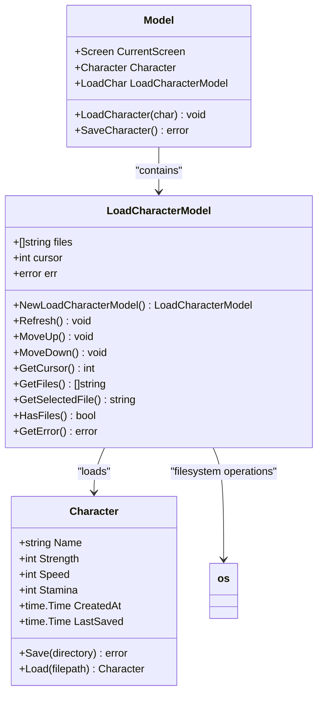
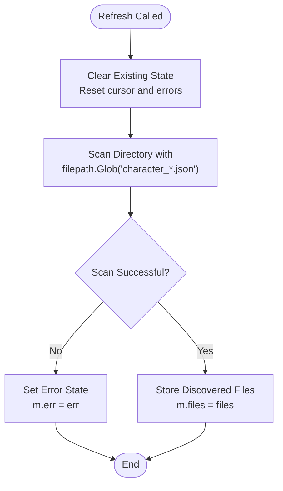
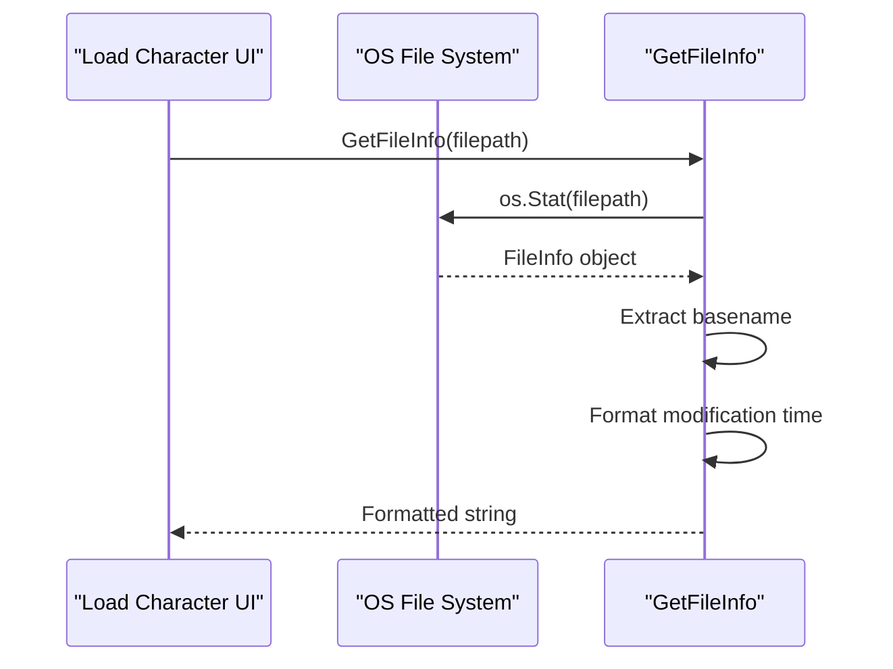
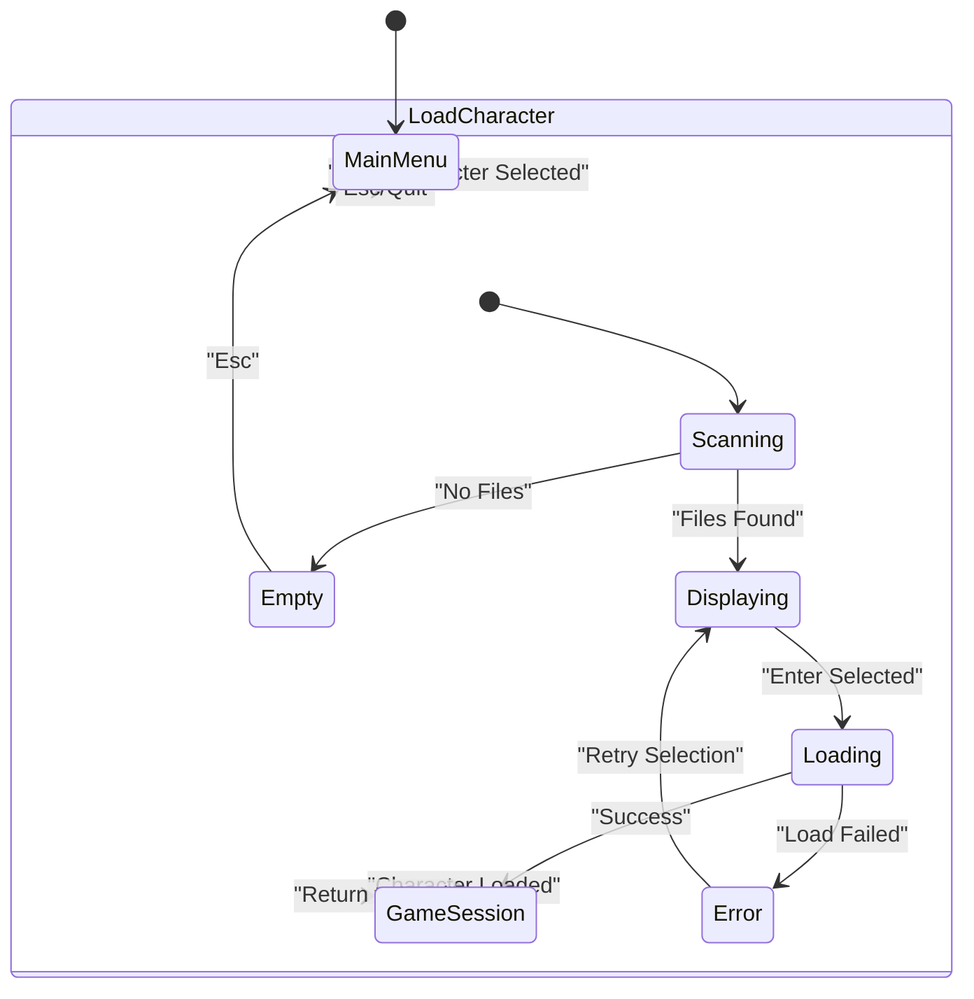

# Load Character UI Component

<cite>
**Referenced Files in This Document**
- [pkg/ui/load_character.go](file://pkg/ui/load_character.go)
- [internal/character/character.go](file://internal/character/character.go)
- [pkg/ui/model.go](file://pkg/ui/model.go)
- [pkg/ui/update.go](file://pkg/ui/update.go)
- [pkg/ui/view.go](file://pkg/ui/view.go)
- [README.md](file://README.md)
</cite>

## Table of Contents
1. [Introduction](#introduction)
2. [Component Architecture](#component-architecture)
3. [Core Data Structures](#core-data-structures)
4. [File System Operations](#file-system-operations)
5. [Error Handling and Security](#error-handling-and-security)
6. [UI Integration](#ui-integration)
7. [Performance Considerations](#performance-considerations)
8. [Extension Guidelines](#extension-guidelines)
9. [Best Practices](#best-practices)
10. [Troubleshooting](#troubleshooting)

## Introduction

The Load Character UI component is a critical part of the Saga of the Demonspawn application that enables users to select and load saved character files from the local filesystem. Built using the Bubble Tea framework, this component provides an intuitive keyboard-driven interface for navigating save files, displaying metadata, and securely loading character data.

The component serves as the bridge between the user's filesystem and the internal character management system, implementing robust file scanning, validation, and error handling mechanisms while maintaining a clean separation of concerns between UI presentation and business logic.

## Component Architecture

The Load Character component follows the Model-View-Update (MVU) architecture pattern typical of Bubble Tea applications, with clear separation between state management, user interface rendering, and event handling.



**Diagram sources**
- [pkg/ui/load_character.go](file://pkg/ui/load_character.go#L10-L14)
- [pkg/ui/model.go](file://pkg/ui/model.go#L34-L56)
- [internal/character/character.go](file://internal/character/character.go#L14-L44)

**Section sources**
- [pkg/ui/load_character.go](file://pkg/ui/load_character.go#L1-L97)
- [pkg/ui/model.go](file://pkg/ui/model.go#L34-L56)

## Core Data Structures

### LoadCharacterModel

The `LoadCharacterModel` struct encapsulates the state and behavior of the load character interface:

| Field | Type | Purpose | Default Value |
|-------|------|---------|---------------|
| `files` | `[]string` | List of discovered save file paths | `[]string{}` |
| `cursor` | `int` | Current selection index in file list | `0` |
| `err` | `error` | Last error encountered during operations | `nil` |

### Character File Structure

The system expects save files to follow a specific naming convention and structure:

- **Filename Pattern**: `character_*.json`
- **Timestamp Format**: `character_YYYYMMDD-HHMMSS.json`
- **JSON Structure**: Complete character object with all derived values and equipment

**Section sources**
- [pkg/ui/load_character.go](file://pkg/ui/load_character.go#L10-L14)
- [internal/character/character.go](file://internal/character/character.go#L312-L320)

## File System Operations

### Directory Scanning

The component uses Go's `filepath.Glob` function to efficiently discover save files matching the naming pattern:



**Diagram sources**
- [pkg/ui/load_character.go](file://pkg/ui/load_character.go#L25-L40)

### File Information Extraction

The `GetFileInfo` function extracts and formats metadata for display:



**Diagram sources**
- [pkg/ui/load_character.go](file://pkg/ui/load_character.go#L83-L96)

**Section sources**
- [pkg/ui/load_character.go](file://pkg/ui/load_character.go#L25-L40)
- [pkg/ui/load_character.go](file://pkg/ui/load_character.go#L83-L96)

## Error Handling and Security

### Graceful Error Recovery

The component implements comprehensive error handling for various failure scenarios:

| Error Type | Handling Strategy | User Feedback |
|------------|-------------------|---------------|
| File Not Found | Display friendly message | "No saved characters found" |
| Permission Denied | Capture and display error | Error details in UI |
| Corrupted JSON | Parse error detection | Error state with details |
| Invalid Filename | Validation skipped | File excluded from list |

### Security Considerations

While the current implementation focuses on basic file validation, several security measures are in place:

1. **Filename Pattern Matching**: Uses `character_*.json` pattern to prevent arbitrary file access
2. **Path Traversal Prevention**: Relies on `filepath.Glob` which sanitizes patterns
3. **Error Isolation**: File operation errors are captured and displayed without exposing system details
4. **Validation Pipeline**: JSON parsing validates structure before data extraction

**Section sources**
- [pkg/ui/load_character.go](file://pkg/ui/load_character.go#L25-L40)
- [pkg/ui/update.go](file://pkg/ui/update.go#L85-L101)
- [internal/character/character.go](file://internal/character/character.go#L341-L354)

## UI Integration

### Screen Navigation

The load character screen integrates seamlessly with the application's navigation system:



**Diagram sources**
- [pkg/ui/update.go](file://pkg/ui/update.go#L58-L107)
- [pkg/ui/model.go](file://pkg/ui/model.go#L12-L31)

### Keyboard Controls

The component supports standard terminal navigation patterns:

| Key Combination | Action | Effect |
|-----------------|--------|--------|
| `↑` / `k` | Move Up | Navigate to previous file |
| `↓` / `j` | Move Down | Navigate to next file |
| `Enter` | Select | Load selected character |
| `Esc` / `q` | Cancel | Return to main menu |

### Rendering Implementation

The view function generates a formatted display showing:

- Header with screen title
- Error messages (if present)
- File list with metadata
- Navigation instructions
- Cursor highlighting for selected item

**Section sources**
- [pkg/ui/update.go](file://pkg/ui/update.go#L83-L107)
- [pkg/ui/view.go](file://pkg/ui/view.go#L57-L95)

## Performance Considerations

### Large File Lists

When dealing with numerous save files, several performance factors come into play:

1. **Memory Usage**: File paths are stored in memory as strings
2. **Rendering Performance**: UI redraws occur on every key press
3. **File System Access**: Frequent directory scanning may impact responsiveness

### Optimization Strategies

For applications with many save files, consider these optimizations:

1. **Lazy Loading**: Load file metadata only when needed
2. **Pagination**: Limit displayed files to a manageable subset
3. **Caching**: Cache file information to avoid repeated filesystem access
4. **Async Operations**: Perform file scanning in background goroutines

### Current Limitations

The current implementation scans the filesystem on every refresh, which may become inefficient with hundreds of save files. For production use with large datasets, consider implementing caching mechanisms or pagination.

**Section sources**
- [pkg/ui/load_character.go](file://pkg/ui/load_character.go#L25-L40)
- [pkg/ui/view.go](file://pkg/ui/view.go#L77-L90)

## Extension Guidelines

### Save File Previews

To implement save file preview functionality:

1. **Enhance GetFileInfo**: Add preview content extraction
2. **Add Preview Mode**: Create separate UI state for preview display
3. **Optimize Rendering**: Implement lazy loading for preview content

### Filtering Capabilities

For filtering save files by criteria:

1. **Add Filter Logic**: Implement filename pattern matching
2. **Update UI**: Add filter controls and display filtered results
3. **Maintain State**: Preserve cursor position across filter changes

### Cloud Sync Integration

To support cloud-based save synchronization:

1. **Network Layer**: Add HTTP client for cloud storage
2. **Authentication**: Implement secure credential management
3. **Conflict Resolution**: Handle concurrent modifications
4. **Offline Support**: Maintain local cache for offline access

### Advanced Metadata Display

Enhance file information with additional details:

- Character name extraction from JSON content
- Playtime statistics
- Last played date
- Difficulty setting information

**Section sources**
- [pkg/ui/load_character.go](file://pkg/ui/load_character.go#L83-L96)
- [internal/character/character.go](file://internal/character/character.go#L341-L354)

## Best Practices

### File Path Validation

Always validate file paths before attempting operations:

```go
// Example validation pattern (not implemented in current code)
func isValidSavePath(path string) bool {
    // Check for path traversal attempts
    // Verify file extension
    // Validate filename format
    return true
}
```

### Error Message Formatting

Provide clear, actionable error messages to users:

- Specific error types (file not found, permission denied)
- Suggested actions when applicable
- Context about what operation failed

### Memory Management

Monitor memory usage when handling large numbers of save files:

- Track file count limits
- Implement cleanup for unused file lists
- Consider streaming approaches for very large datasets

### Testing Strategies

Implement comprehensive testing for:

- Normal file loading scenarios
- Error condition handling
- Edge cases (empty directories, permission issues)
- Performance under load

**Section sources**
- [pkg/ui/load_character.go](file://pkg/ui/load_character.go#L25-L40)
- [pkg/ui/update.go](file://pkg/ui/update.go#L85-L101)

## Troubleshooting

### Common Issues and Solutions

| Issue | Symptoms | Solution |
|-------|----------|----------|
| No files displayed | Empty list despite existing saves | Check current directory permissions |
| Load failures | Error messages during character load | Verify JSON file integrity |
| Navigation problems | Keys not responding | Confirm terminal key mapping |
| Performance issues | Slow response with many files | Consider pagination or caching |

### Debugging File Discovery

To diagnose file discovery issues:

1. **Verify Directory**: Ensure save files are in expected location
2. **Check Permissions**: Confirm read access to save directory
3. **Validate Patterns**: Verify filename matches expected pattern
4. **Test Globbing**: Try manual glob pattern matching

### Character Loading Failures

Common causes and solutions for character loading failures:

- **Corrupted JSON**: Validate file content manually
- **Version Mismatch**: Check character format compatibility
- **Missing Dependencies**: Ensure all required data is present
- **Permission Issues**: Verify file read permissions

**Section sources**
- [pkg/ui/load_character.go](file://pkg/ui/load_character.go#L25-L40)
- [pkg/ui/update.go](file://pkg/ui/update.go#L85-L101)
- [internal/character/character.go](file://internal/character/character.go#L341-L354)