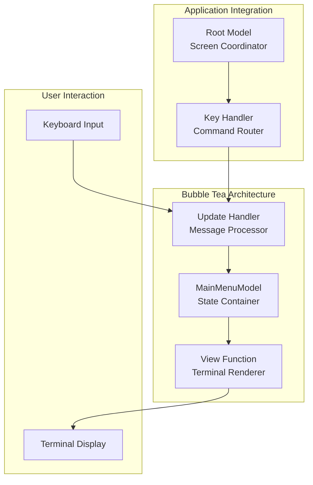
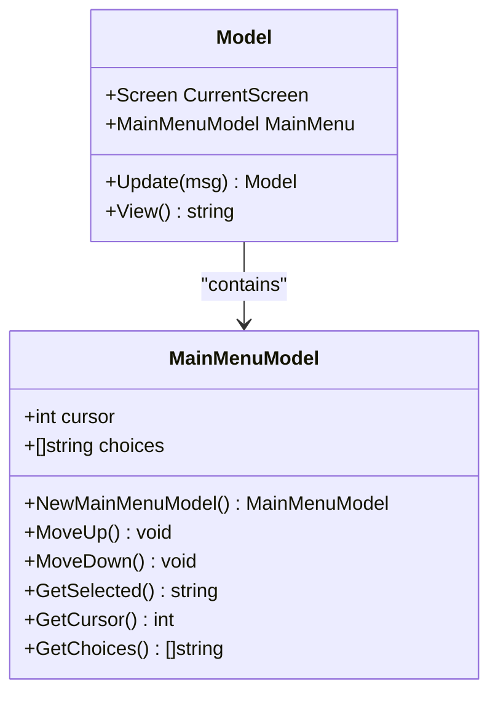
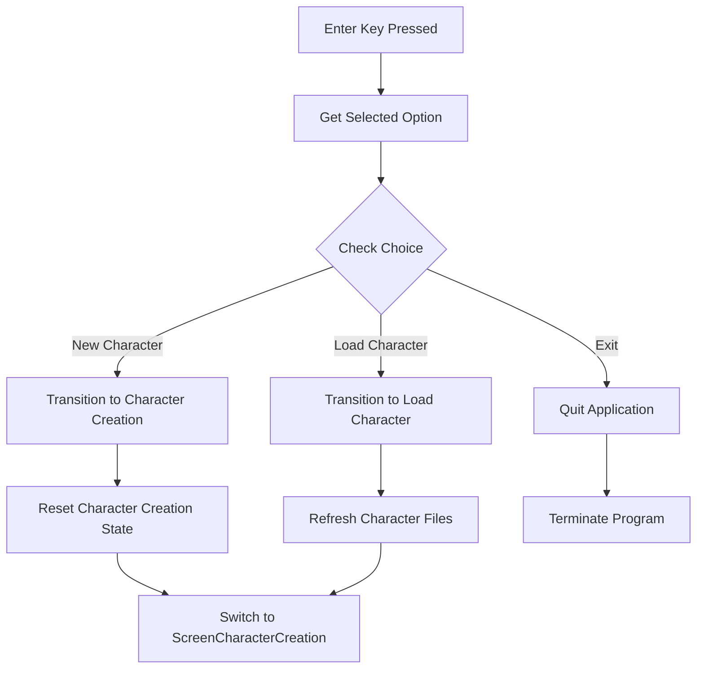
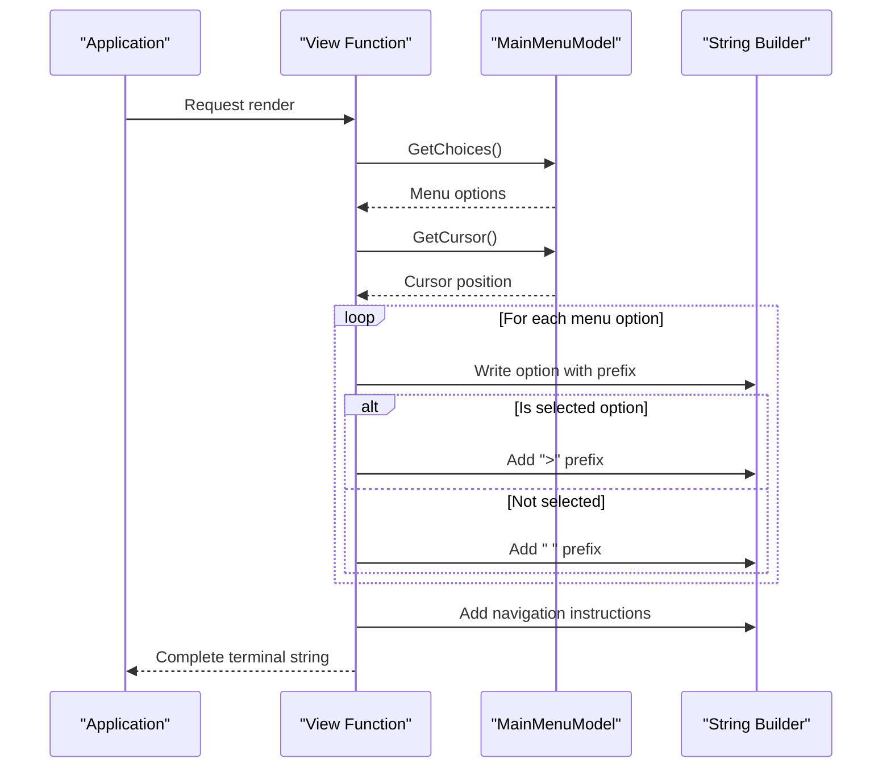
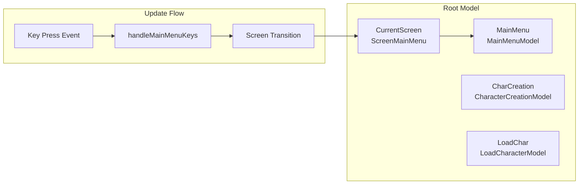

# Main Menu

<cite>
**Referenced Files in This Document**
- [main_menu.go](file://pkg/ui/main_menu.go)
- [model.go](file://pkg/ui/model.go)
- [update.go](file://pkg/ui/update.go)
- [view.go](file://pkg/ui/view.go)
- [main.go](file://cmd/saga/main.go)
- [character_creation.go](file://pkg/ui/character_creation.go)
- [load_character.go](file://pkg/ui/load_character.go)
- [game_session.go](file://pkg/ui/game_session.go)
- [README.md](file://README.md)
</cite>

## Table of Contents
1. [Introduction](#introduction)
2. [Architecture Overview](#architecture-overview)
3. [Core Components](#core-components)
4. [Internal Model Structure](#internal-model-structure)
5. [Keyboard Navigation System](#keyboard-navigation-system)
6. [Terminal Rendering](#terminal-rendering)
7. [Integration with Root Model](#integration-with-root-model)
8. [Usage Patterns and Best Practices](#usage-patterns-and-best-practices)
9. [Accessibility Considerations](#accessibility-considerations)
10. [Styling and Lipgloss Integration](#styling-and-lipgloss-integration)
11. [Developer Guidelines](#developer-guidelines)
12. [Troubleshooting](#troubleshooting)

## Introduction

The Main Menu UI component serves as the primary navigation hub for the Saga of the Demonspawn application, built using the Bubble Tea framework. It provides an intuitive keyboard-driven interface for users to navigate between different application screens including character creation, character loading, and application exit.

The main menu implements a classic terminal-style navigation system with visual highlighting of the currently selected option, supporting standard keyboard controls for movement and selection. It integrates seamlessly with the application's state management system while maintaining clean separation of concerns between presentation and business logic.

## Architecture Overview

The Main Menu follows the Model-View-Update (MVU) architecture pattern central to Bubble Tea applications. The component consists of three primary layers:



**Diagram sources**
- [main_menu.go](file://pkg/ui/main_menu.go#L1-L49)
- [model.go](file://pkg/ui/model.go#L33-L95)
- [update.go](file://pkg/ui/update.go#L16-L80)

**Section sources**
- [main_menu.go](file://pkg/ui/main_menu.go#L1-L49)
- [model.go](file://pkg/ui/model.go#L33-L95)

## Core Components

### MainMenuModel Structure

The `MainMenuModel` encapsulates all state related to the main menu functionality:



**Diagram sources**
- [main_menu.go](file://pkg/ui/main_menu.go#L4-L49)
- [model.go](file://pkg/ui/model.go#L34-L56)

### Initialization Process

The main menu is initialized automatically when the application starts, creating a default set of navigation options:

**Section sources**
- [main_menu.go](file://pkg/ui/main_menu.go#L10-L19)
- [model.go](file://pkg/ui/model.go#L58-L76)

## Internal Model Structure

### State Management

The main menu maintains minimal but essential state information:

| Field | Type | Purpose | Default Value |
|-------|------|---------|---------------|
| `cursor` | `int` | Tracks currently selected menu option | `0` |
| `choices` | `[]string` | Available menu options | `["New Character", "Load Character", "Exit"]` |

### Navigation State Tracking

The cursor position is managed internally to provide visual feedback and track user selections. The state structure ensures thread-safe access to navigation information through dedicated getter methods.

**Section sources**
- [main_menu.go](file://pkg/ui/main_menu.go#L4-L49)

## Keyboard Navigation System

### Movement Controls

The main menu supports standard terminal-style navigation:

| Key Combination | Action | Method | Boundary Behavior |
|----------------|--------|--------|-------------------|
| `↑` / `k` | Move cursor up | `MoveUp()` | Prevents negative indices |
| `↓` / `j` | Move cursor down | `MoveDown()` | Bounds checking against choice count |
| `Enter` | Select current option | `GetSelected()` | Triggers screen transitions |
| `q` / `Esc` | Quit application | N/A | Immediate termination |

### Selection Processing

When the user presses Enter, the main menu retrieves the currently selected option and triggers appropriate actions based on the choice:



**Diagram sources**
- [update.go](file://pkg/ui/update.go#L58-L80)

**Section sources**
- [update.go](file://pkg/ui/update.go#L58-L80)

## Terminal Rendering

### View Function Implementation

The main menu rendering is handled by the `viewMainMenu()` function, which constructs the terminal display using string building techniques:



**Diagram sources**
- [view.go](file://pkg/ui/view.go#L30-L54)

### Display Formatting

The main menu uses a bordered layout with ASCII art decorations to create a visually appealing interface:

**Section sources**
- [view.go](file://pkg/ui/view.go#L30-L54)

## Integration with Root Model

### Screen Coordination

The main menu integrates with the root `Model` structure through the `CurrentScreen` field and associated state management:



**Diagram sources**
- [model.go](file://pkg/ui/model.go#L34-L56)
- [update.go](file://pkg/ui/update.go#L32-L80)

### State Synchronization

The main menu coordinates with other application components through the root model's state management system, ensuring consistent navigation and state transitions across the entire application.

**Section sources**
- [model.go](file://pkg/ui/model.go#L34-L95)
- [update.go](file://pkg/ui/update.go#L32-L80)

## Usage Patterns and Best Practices

### Standard Navigation Workflow

Users interact with the main menu through a predictable pattern:

1. **Initial Display**: Application starts, main menu appears
2. **Navigation**: Use arrow keys or vim-style `j`/`k` to move cursor
3. **Selection**: Press Enter to activate current option
4. **Action**: Redirected to appropriate screen based on selection

### Error Handling Patterns

The main menu implements robust error handling for edge cases:

- **Boundary Checking**: Cursor movement prevents out-of-bounds access
- **Null Safety**: All methods safely handle empty or invalid states
- **Graceful Degradation**: Fallback behavior for unexpected conditions

### Extension Patterns

Adding new menu options follows established patterns:

**Section sources**
- [main_menu.go](file://pkg/ui/main_menu.go#L10-L19)

## Accessibility Considerations

### Keyboard-Only Navigation

The main menu is designed exclusively for keyboard navigation, making it accessible to users who rely on keyboard-only interfaces:

- **Standard Controls**: Uses familiar arrow keys and vim-style shortcuts
- **Visual Feedback**: Clear highlighting of selected options
- **Consistent Layout**: Predictable positioning of navigation elements

### Terminal Compatibility

The implementation uses basic ASCII characters and standard terminal sequences to ensure broad compatibility:

- **ASCII Art**: Simple border decorations using standard characters
- **Color Independence**: No color-dependent visual indicators
- **Font Independence**: Works with various monospace fonts

### Alternative Navigation

While primarily keyboard-driven, the menu supports vim-style navigation (`j` for down, `k` for up) for users familiar with vi/vim editor conventions.

## Styling and Lipgloss Integration

### Current Styling Approach

The main menu uses a minimalist ASCII art styling approach rather than relying on external styling libraries. This approach offers several advantages:

- **Portability**: No external dependencies required
- **Performance**: Minimal computational overhead
- **Compatibility**: Works across all terminal environments

### ASCII Art Design

The menu employs a bordered layout with decorative elements:

```
  ╔════════════════════════════════════════╗
  ║  SAGAS OF THE DEMONSPAWN - COMPANION  ║
  ╚════════════════════════════════════════╝
```

### Visual Hierarchy

The styling establishes clear visual hierarchy through:

- **Bordered Title**: Distinct header with decorative borders
- **Highlighted Selection**: ">" prefix for current selection
- **Consistent Indentation**: Uniform spacing for all options

**Section sources**
- [view.go](file://pkg/ui/view.go#L30-L54)

## Developer Guidelines

### Adding New Menu Options

To add new menu options, modify the `NewMainMenuModel` function:

```go
// Example modification path
// File: pkg/ui/main_menu.go
// Line: 13-18
```

### Customizing Navigation Behavior

For specialized navigation requirements, extend the `handleMainMenuKeys` function in the update handler:

```go
// Example extension path
// File: pkg/ui/update.go
// Line: 58-80
```

### Maintaining Consistency

When modifying the main menu, maintain consistency with:

- **Navigation Conventions**: Use standard key bindings
- **Visual Style**: Preserve ASCII art formatting
- **State Management**: Follow established patterns

### Testing Considerations

Ensure comprehensive testing of:

- **Boundary Conditions**: Edge cases for cursor movement
- **State Transitions**: Proper screen switching behavior
- **Error Scenarios**: Invalid input handling

**Section sources**
- [main_menu.go](file://pkg/ui/main_menu.go#L10-L19)
- [update.go](file://pkg/ui/update.go#L58-L80)

## Troubleshooting

### Common Issues

#### Menu Not Responding to Input

**Symptoms**: Cursor movement or selection doesn't work
**Causes**: 
- Incorrect key binding configuration
- State synchronization issues

**Solutions**:
- Verify key press routing in `handleKeyPress`
- Check cursor bounds checking logic
- Ensure proper state updates

#### Visual Display Problems

**Symptoms**: Menu appears corrupted or misaligned
**Causes**:
- Terminal width/height issues
- String formatting errors

**Solutions**:
- Implement proper string builder usage
- Add terminal size awareness
- Validate ASCII art formatting

#### State Synchronization Issues

**Symptoms**: Menu state doesn't match expected behavior
**Causes**:
- Race conditions in state updates
- Inconsistent state management

**Solutions**:
- Review state update patterns
- Implement proper locking mechanisms
- Add state validation checks

### Debugging Strategies

1. **Logging**: Add debug statements to track state changes
2. **Unit Testing**: Create focused tests for individual methods
3. **Integration Testing**: Test complete navigation flows
4. **Visual Inspection**: Manually verify display formatting

### Performance Considerations

The main menu is designed for optimal performance:

- **Minimal Memory Usage**: Lightweight state structure
- **Efficient Rendering**: Direct string building without complex formatting
- **Fast Response**: Immediate reaction to user input

**Section sources**
- [main_menu.go](file://pkg/ui/main_menu.go#L21-L49)
- [view.go](file://pkg/ui/view.go#L30-L54)