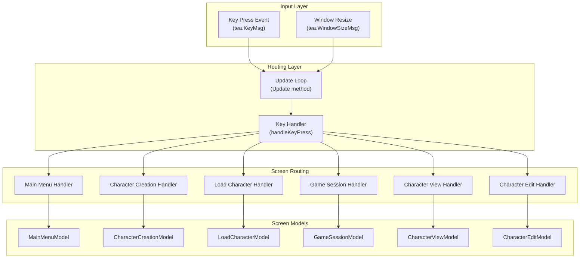
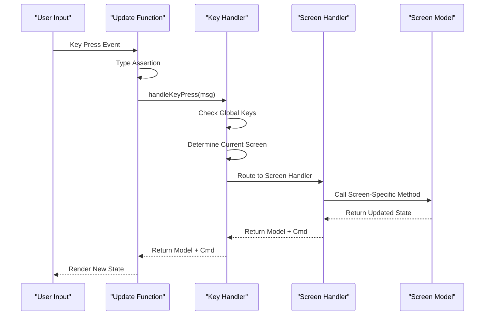
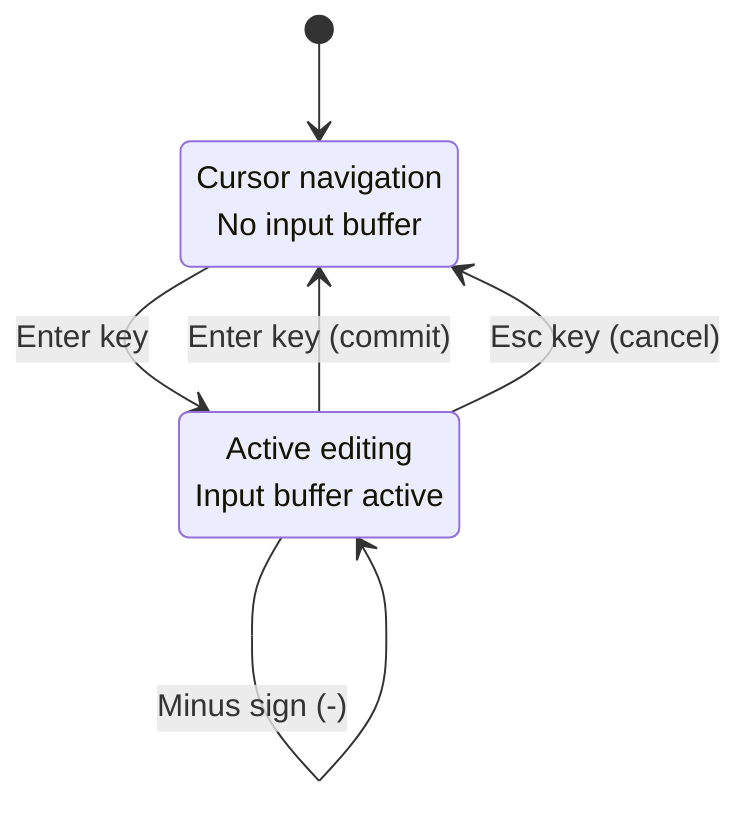
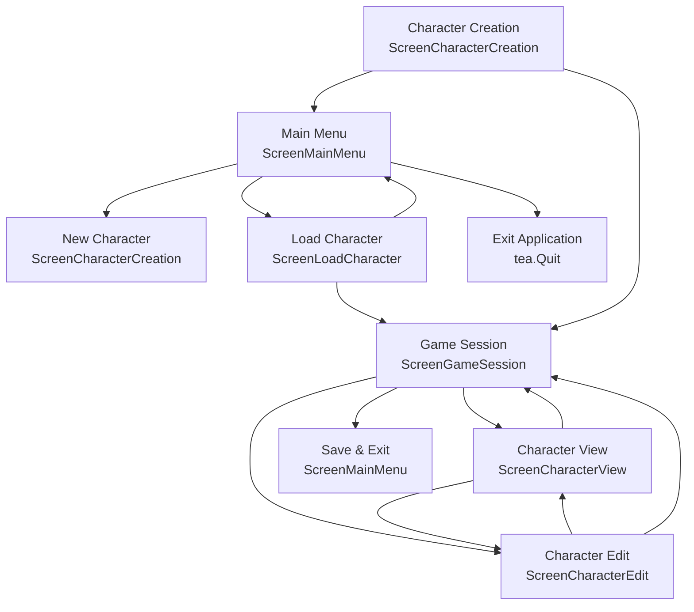

# Input Handling

<cite>
**Referenced Files in This Document**
- [update.go](file://pkg/ui/update.go)
- [model.go](file://pkg/ui/model.go)
- [main_menu.go](file://pkg/ui/main_menu.go)
- [character_creation.go](file://pkg/ui/character_creation.go)
- [load_character.go](file://pkg/ui/load_character.go)
- [game_session.go](file://pkg/ui/game_session.go)
- [character_view.go](file://pkg/ui/character_view.go)
- [character_edit.go](file://pkg/ui/character_edit.go)
- [README.md](file://README.md)
</cite>

## Table of Contents
1. [Introduction](#introduction)
2. [Architecture Overview](#architecture-overview)
3. [Bubble Tea Framework Integration](#bubble-tea-framework-integration)
4. [Message Processing Pipeline](#message-processing-pipeline)
5. [Screen-Specific Key Handlers](#screen-specific-key-handlers)
6. [Keyboard Shortcuts Reference](#keyboard-shortcuts-reference)
7. [Form Input Handling](#form-input-handling)
8. [Navigation Patterns](#navigation-patterns)
9. [State Transitions](#state-transitions)
10. [Best Practices](#best-practices)
11. [Debugging Techniques](#debugging-techniques)
12. [Extending the System](#extending-the-system)
13. [Accessibility Considerations](#accessibility-considerations)

## Introduction

The saga-demonspawn UI employs a sophisticated input handling system built on the Bubble Tea framework, implementing the Elm Architecture pattern. This system manages keyboard events through a centralized update loop that routes user input to appropriate screen-specific handlers based on the current application state and focus context.

The input handling system is designed around the principle of immutability and functional programming, where each key press generates a new model state while maintaining clean separation between presentation and business logic. The system supports complex navigation patterns, form input validation, and stateful editing modes across multiple distinct screens.

## Architecture Overview

The input handling architecture follows a hierarchical message routing pattern that ensures predictable and maintainable keyboard interaction across the application's various screens.

**Diagram sources**
- [update.go](file://pkg/ui/update.go#L16-L56)
- [model.go](file://pkg/ui/model.go#L33-L75)

**Section sources**
- [update.go](file://pkg/ui/update.go#L16-L56)
- [model.go](file://pkg/ui/model.go#L33-L75)

## Bubble Tea Framework Integration

The input handling system leverages Bubble Tea's message-passing architecture to process keyboard events through a centralized update function. The framework automatically captures key events and wraps them in `tea.KeyMsg` messages, which are then routed through the application's state management pipeline.

### Core Update Function

The primary update function serves as the central hub for all message processing, distinguishing between window resize events and keyboard input events. This design ensures that terminal size changes are handled separately from user interaction while maintaining the reactive nature of the Bubble Tea architecture.

### Message Type Handling

The system recognizes two primary message types:
- **tea.KeyMsg**: Captures all keyboard input events
- **tea.WindowSizeMsg**: Handles terminal resizing for responsive UI adaptation

### Global Quit Keys

The system implements global quit functionality that responds to `Ctrl+C` combinations across all screens, ensuring consistent exit behavior regardless of the current application state.

**Section sources**
- [update.go](file://pkg/ui/update.go#L16-L30)

## Message Processing Pipeline

The message processing pipeline implements a sophisticated routing mechanism that directs keyboard events to the appropriate screen handlers based on the current application state.

**Diagram sources**
- [update.go](file://pkg/ui/update.go#L32-L56)

### Routing Logic

The routing logic examines the `CurrentScreen` field of the main model to determine which screen-specific handler should process the key event. This approach ensures that keyboard shortcuts remain context-sensitive and screen-appropriate.

### Command Generation

Each screen handler can return a `tea.Cmd` alongside the updated model to trigger side effects such as quitting the application, saving data, or initiating asynchronous operations.

**Section sources**
- [update.go](file://pkg/ui/update.go#L32-L56)

## Screen-Specific Key Handlers

Each screen implements specialized key handling logic tailored to its specific interaction patterns and user workflows. The handlers follow consistent patterns while accommodating the unique requirements of each screen type.

### Main Menu Navigation

The main menu handler implements cursor-based navigation with support for both arrow keys and vi-style navigation (`j` for down, `k` for up). Selection triggers immediate state transitions to initiate character creation or loading workflows.

### Character Creation Workflow

Character creation involves multiple steps with distinct key bindings for each phase:
- **Roll Characteristics**: `r` key for rolling all stats, `Enter` to advance when all rolled
- **Select Equipment**: Arrow keys for weapon and armor selection, `Enter` to proceed
- **Review Character**: `Enter` to finalize, `Esc` to return to equipment selection

### Load Character Interface

The load character screen provides file browsing capabilities with automatic scanning of save files and selection-based loading mechanisms.

### Game Session Navigation

The game session menu adapts its options based on character progression, dynamically showing or hiding magic-related options when applicable.

### Character Editing Mode

Character editing implements a dual-mode system with navigation mode (arrow keys, `Enter`) and input mode (numeric input, `Backspace`, `Enter` for completion/cancellation).

**Section sources**
- [update.go](file://pkg/ui/update.go#L58-L329)

## Keyboard Shortcuts Reference

The input handling system implements a comprehensive set of keyboard shortcuts organized by functionality and screen context.

| Category | Key Combination | Action | Context |
|----------|----------------|--------|---------|
| **Global** | `Ctrl+C` | Quit application | All screens |
| **Navigation** | `↑`, `k` | Move cursor up | Menus, lists |
| **Navigation** | `↓`, `j` | Move cursor down | Menus, lists |
| **Navigation** | `←`, `h` | Move left | Equipment selection |
| **Navigation** | `→`, `l` | Move right | Equipment selection |
| **Selection** | `Enter` | Confirm/Select | All interactive elements |
| **Cancellation** | `Esc`, `q` | Cancel/Back | All screens |
| **Character Creation** | `r` | Roll all characteristics | Stat rolling screen |
| **Character Editing** | `e` | Enter edit mode | Character view screen |
| **Character Editing** | `-` | Negative value indicator | Numeric input mode |

### Vi-Style Navigation

The system incorporates vi-style navigation keys (`j`, `k`, `h`, `l`) alongside traditional arrow keys, providing familiar movement patterns for users accustomed to vim-like interfaces.

### Escape Sequences

Escape sequences are consistently mapped to cancellation actions, returning users to the previous logical screen or exiting the current operation.

**Section sources**
- [update.go](file://pkg/ui/update.go#L58-L329)

## Form Input Handling

The character editing system implements sophisticated form input handling with real-time validation and state management for numeric data entry.

**Diagram sources**
- [character_edit.go](file://pkg/ui/character_edit.go#L109-L136)
- [update.go](file://pkg/ui/update.go#L255-L278)

### Input Buffer Management

The input system maintains separate input buffers for each editable field, allowing users to modify values incrementally before committing changes. The buffer supports numeric input with validation and undo capabilities.

### Validation Logic

Input validation occurs during the commit phase, parsing the input buffer as an integer and applying the value to the appropriate character field. The system handles edge cases such as empty input and invalid numeric formats.

### Field-Specific Behavior

Different character fields accept different value ranges and have specific validation requirements. The system enforces these constraints at the application level while providing clear feedback for invalid input attempts.

**Section sources**
- [update.go](file://pkg/ui/update.go#L255-L278)
- [character_edit.go](file://pkg/ui/character_edit.go#L121-L172)

## Navigation Patterns

The input handling system implements consistent navigation patterns across all screens while accommodating the unique requirements of each interaction model.

### Hierarchical Navigation

Most screens implement hierarchical navigation where users move through options and sub-options in a tree-like structure. The system maintains cursor positions and provides intuitive back navigation.

### List-Based Navigation

File lists, menu selections, and equipment options use list-based navigation with boundary checking and wrap-around behavior where appropriate.

### Modal Interaction

Some screens implement modal interaction patterns where users enter temporary editing modes that can be exited at any time, maintaining the ability to return to the main workflow.

**Section sources**
- [main_menu.go](file://pkg/ui/main_menu.go#L21-L32)
- [load_character.go](file://pkg/ui/load_character.go#L41-L52)
- [game_session.go](file://pkg/ui/game_session.go#L49-L60)

## State Transitions

The input handling system orchestrates complex state transitions between screens while maintaining application consistency and user context awareness.

**Diagram sources**
- [update.go](file://pkg/ui/update.go#L58-L329)
- [model.go](file://pkg/ui/model.go#L12-L30)

### Transition Triggers

State transitions are triggered by user actions such as pressing `Enter` on menu options, completing workflows, or selecting exit/cancel operations. The system ensures that transitions occur only when appropriate conditions are met.

### Data Persistence

During transitions, the system handles data persistence appropriately, saving character state when exiting and loading state when entering new contexts.

### Error Handling

Transitions include error handling for cases such as failed character loading, save failures, or invalid state conditions, ensuring the application remains in a consistent state.

**Section sources**
- [update.go](file://pkg/ui/update.go#L58-L329)

## Best Practices

The input handling system demonstrates several best practices for building maintainable and user-friendly keyboard interfaces.

### Consistent Key Mappings

The system maintains consistent key mappings across similar functionality, reducing the learning curve and improving user efficiency. For example, `Enter` consistently confirms actions while `Esc` and `q` consistently cancel operations.

### Context-Sensitive Shortcuts

Shortcuts are context-sensitive, with different keys performing different actions depending on the current screen and focus state. This approach prevents key conflicts while providing powerful functionality.

### Clear Feedback

The system provides immediate visual feedback for all user actions, ensuring users understand the results of their input immediately.

### Graceful Degradation

Input handling gracefully degrades when operations fail, providing meaningful error messages and maintaining the ability to continue using the application.

### Modular Design

Each screen's input handling is encapsulated within its own model and handler, making the system modular and easy to extend or modify.

## Debugging Techniques

Effective debugging of input handling issues requires understanding the message flow and state management patterns.

### Message Tracing

To debug input issues, developers can add logging statements to track message flow through the update pipeline, identifying where unexpected behavior occurs.

### State Inspection

The immutable nature of the Bubble Tea model allows for easy state inspection at any point in the update cycle, helping to identify state inconsistencies or unexpected transitions.

### Key Binding Verification

Testing key bindings involves verifying that each expected key combination produces the desired action across all relevant screens and contexts.

### Edge Case Testing

Input handling systems should be tested with edge cases such as rapid key presses, invalid input combinations, and boundary conditions to ensure robustness.

## Extending the System

Adding new input handlers requires following established patterns and integrating with the existing routing infrastructure.

### Adding New Screens

New screens require extending the `Screen` enumeration, implementing the screen-specific model with navigation methods, and adding a handler to the `handleKeyPress` function.

### New Key Bindings

New key bindings should be added to existing handlers or new handlers following the established pattern of switch statements on `msg.String()` values.

### Input Modes

For screens requiring complex input modes (like character editing), implement state machines with clear transitions between modes, maintaining input buffers and validation logic.

### Accessibility Extensions

Consider implementing accessibility features such as screen reader support, high contrast modes, or alternative input methods when extending the system.

## Accessibility Considerations

The input handling system incorporates several accessibility considerations that improve usability for diverse user needs.

### Keyboard-Only Navigation

The entire interface is navigable using only the keyboard, with no mouse-dependent functionality. This design choice benefits users who rely on keyboard navigation or assistive technologies.

### Consistent Navigation Patterns

Consistent navigation patterns across screens reduce cognitive load and help users develop muscle memory for efficient interaction.

### Clear Visual Feedback

Immediate visual feedback for all actions ensures that users receive confirmation of their actions, which is particularly important for users with cognitive or motor impairments.

### Alternative Key Mappings

The inclusion of vi-style navigation keys provides alternatives for users who prefer or require different navigation paradigms.

### Error Communication

Clear error messaging and state feedback help users understand the system's current state and recover from mistakes efficiently.

**Section sources**
- [update.go](file://pkg/ui/update.go#L16-L56)
- [model.go](file://pkg/ui/model.go#L12-L30)