# Screen Navigation System

<cite>
**Referenced Files in This Document**
- [model.go](file://pkg/ui/model.go)
- [update.go](file://pkg/ui/update.go)
- [main_menu.go](file://pkg/ui/main_menu.go)
- [character_creation.go](file://pkg/ui/character_creation.go)
- [load_character.go](file://pkg/ui/load_character.go)
- [game_session.go](file://pkg/ui/game_session.go)
- [character_view.go](file://pkg/ui/character_view.go)
- [character_edit.go](file://pkg/ui/character_edit.go)
- [README.md](file://README.md)
</cite>

## Table of Contents
1. [Introduction](#introduction)
2. [System Architecture](#system-architecture)
3. [Screen Enumeration and State Management](#screen-enumeration-and-state-management)
4. [Root Model Structure](#root-model-structure)
5. [Navigation Flow Control](#navigation-flow-control)
6. [Screen-Specific Models](#screen-specific-models)
7. [Initialization and Teardown](#initialization-and-teardown)
8. [Common User Pathways](#common-user-pathways)
9. [Adding New Screens](#adding-new-screens)
10. [Edge Cases and Error Handling](#edge-cases-and-error-handling)
11. [Best Practices](#best-practices)

## Introduction

The saga-demonspawn application implements a sophisticated screen navigation system built on the Bubble Tea framework's Elm Architecture pattern. The navigation system manages state transitions between different UI components while maintaining clean separation of concerns and providing a responsive user experience.

The system supports nine distinct screens covering the complete player journey from initial character creation through ongoing gameplay sessions. Each screen maintains its own state and responds to user input through a centralized routing mechanism.

## System Architecture

The navigation system follows a hierarchical architecture with the root model serving as the central orchestrator:

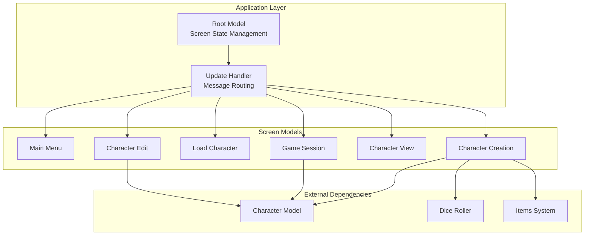

**Diagram sources**
- [model.go](file://pkg/ui/model.go#L33-L95)
- [update.go](file://pkg/ui/update.go#L16-L329)

**Section sources**
- [model.go](file://pkg/ui/model.go#L1-L95)
- [update.go](file://pkg/ui/update.go#L1-L329)

## Screen Enumeration and State Management

The navigation system uses a strongly-typed enumeration to represent all possible screens in the application:

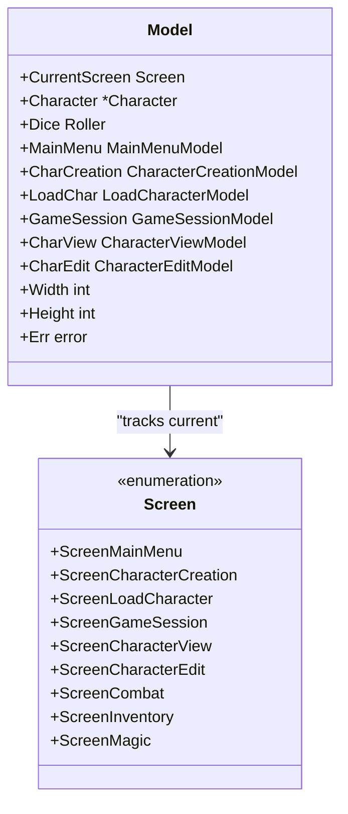

**Diagram sources**
- [model.go](file://pkg/ui/model.go#L9-L31)
- [model.go](file://pkg/ui/model.go#L33-L95)

The screen enumeration defines a clear progression path through the application's features:

| Screen | Purpose | Accessible From |
|--------|---------|----------------|
| `ScreenMainMenu` | Initial entry point with New/Load/Exit options | Application startup |
| `ScreenCharacterCreation` | Multi-step character creation process | Main Menu → New Character |
| `ScreenLoadCharacter` | Character file selection and loading | Main Menu → Load Character |
| `ScreenGameSession` | Main gameplay menu after character load | Load Character → Game Session |
| `ScreenCharacterView` | Full character sheet display | Game Session → View Character |
| `ScreenCharacterEdit` | Character stat editing interface | Character View → Edit Mode |
| `ScreenCombat` | Combat resolution interface | Game Session → Combat |
| `ScreenInventory` | Inventory management system | Game Session → Inventory |
| `ScreenMagic` | Spell casting interface | Game Session → Magic |

**Section sources**
- [model.go](file://pkg/ui/model.go#L9-L31)

## Root Model Structure

The root model serves as the central state container and navigation coordinator:

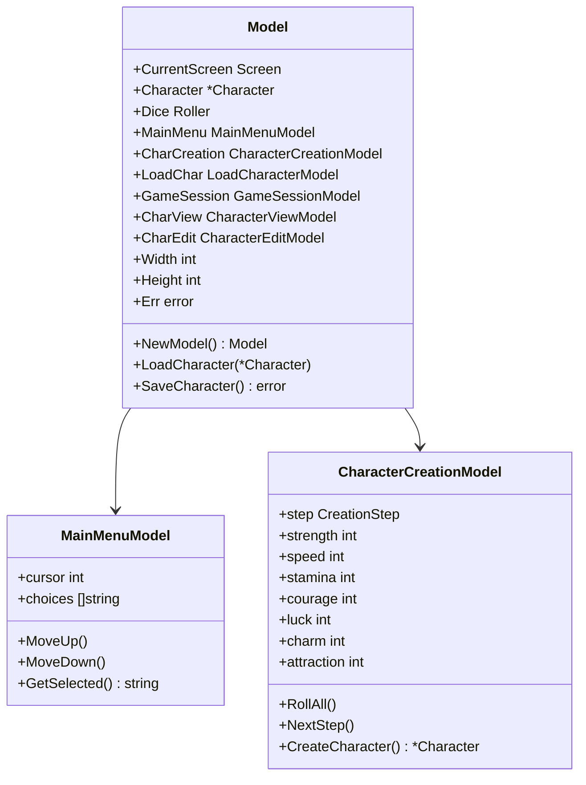

**Diagram sources**
- [model.go](file://pkg/ui/model.go#L33-L95)
- [main_menu.go](file://pkg/ui/main_menu.go#L4-L49)
- [character_creation.go](file://pkg/ui/character_creation.go#L21-L279)

The root model initialization establishes the default state and creates all screen-specific models:

**Section sources**
- [model.go](file://pkg/ui/model.go#L58-L95)

## Navigation Flow Control

The update function implements the core navigation logic through a centralized message routing system:

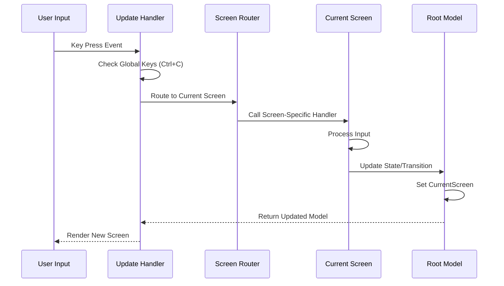

**Diagram sources**
- [update.go](file://pkg/ui/update.go#L32-L56)
- [update.go](file://pkg/ui/update.go#L16-L329)

The navigation flow follows a strict pattern:

1. **Global Key Handling**: Quit commands (Ctrl+C) are processed immediately
2. **Screen Routing**: The current screen is determined from `CurrentScreen` field
3. **Handler Delegation**: Input is routed to the appropriate screen-specific handler
4. **State Updates**: Handlers may modify the root model state or trigger transitions
5. **Screen Transitions**: New screens are activated by setting `CurrentScreen`

**Section sources**
- [update.go](file://pkg/ui/update.go#L32-L56)

## Screen-Specific Models

Each screen maintains its own specialized state and behavior:

### Main Menu Model

The main menu provides the primary entry point with three options:

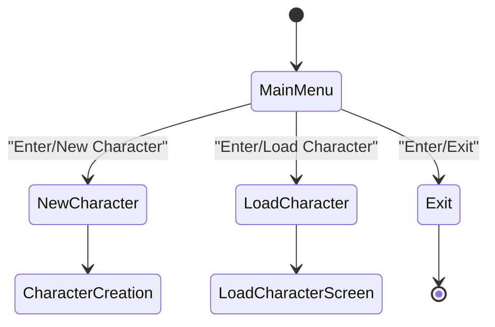

**Diagram sources**
- [main_menu.go](file://pkg/ui/main_menu.go#L10-L19)
- [update.go](file://pkg/ui/update.go#L58-L81)

### Character Creation Model

Character creation follows a multi-step process with three distinct phases:

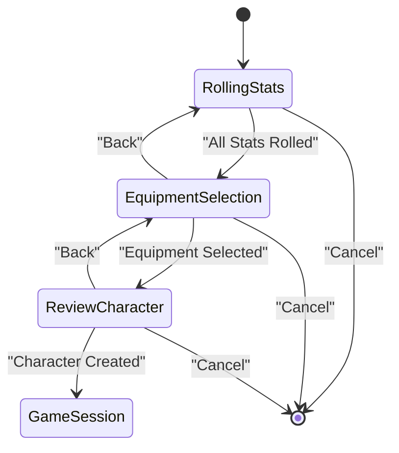

**Diagram sources**
- [character_creation.go](file://pkg/ui/character_creation.go#L9-L19)
- [update.go](file://pkg/ui/update.go#L109-L181)

### Load Character Model

The load character screen scans for saved characters and enables selection:

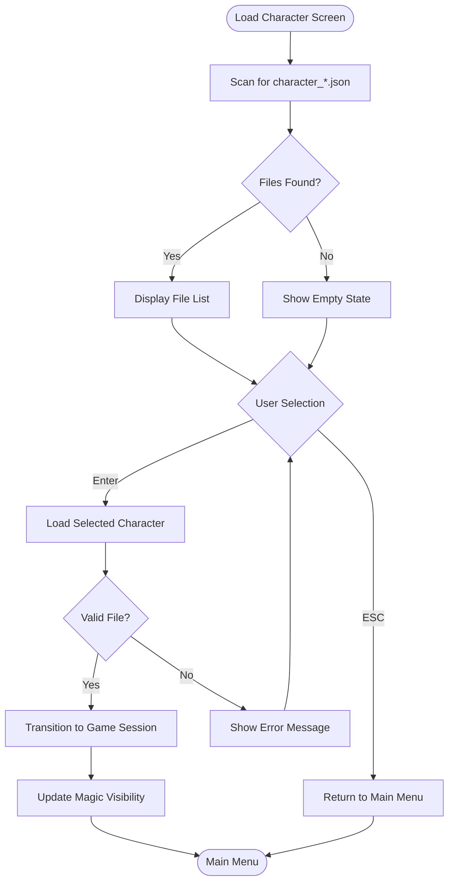

**Diagram sources**
- [load_character.go](file://pkg/ui/load_character.go#L25-L97)
- [update.go](file://pkg/ui/update.go#L83-L107)

**Section sources**
- [main_menu.go](file://pkg/ui/main_menu.go#L1-L49)
- [character_creation.go](file://pkg/ui/character_creation.go#L1-L279)
- [load_character.go](file://pkg/ui/load_character.go#L1-L97)

## Initialization and Teardown

### Model Initialization

The root model initialization establishes the foundation for all navigation:

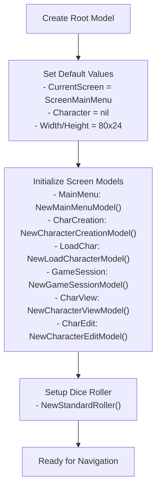

**Diagram sources**
- [model.go](file://pkg/ui/model.go#L58-L95)

### Screen Lifecycle Management

Each screen follows a consistent initialization pattern:

1. **Creation**: Screen-specific models are instantiated with appropriate parameters
2. **State Reset**: Internal state is cleared or reset to initial conditions
3. **Data Loading**: External data (files, configurations) is loaded
4. **Event Binding**: Keyboard event handlers are established
5. **Render Preparation**: Visual layout and formatting are configured

### Teardown and Cleanup

While the application runs continuously, individual screens undergo cleanup during transitions:

- **Character Creation**: Rolls and selections are preserved until finalized
- **Character Editing**: Changes are applied or discarded based on user action
- **Loading**: File handles and temporary data are released
- **Game Session**: Character state is saved before returning to main menu

**Section sources**
- [model.go](file://pkg/ui/model.go#L58-L95)

## Common User Pathways

### New Character Creation Flow

The most common pathway involves creating a new character from scratch:

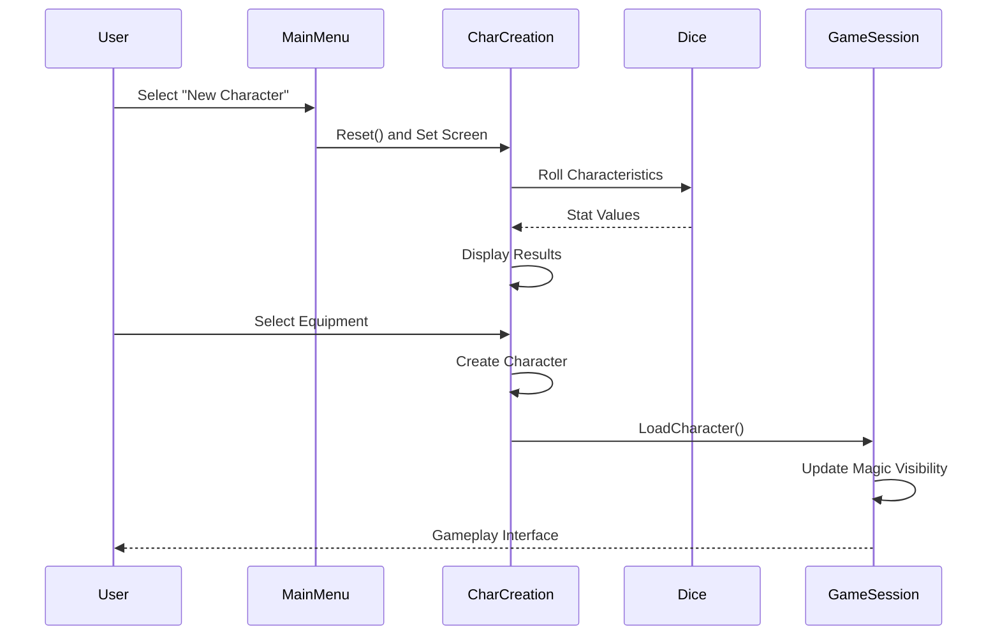

**Diagram sources**
- [update.go](file://pkg/ui/update.go#L68-L76)
- [update.go](file://pkg/ui/update.go#L165-L172)

### Load Existing Character

Players can resume previous adventures by loading saved characters:

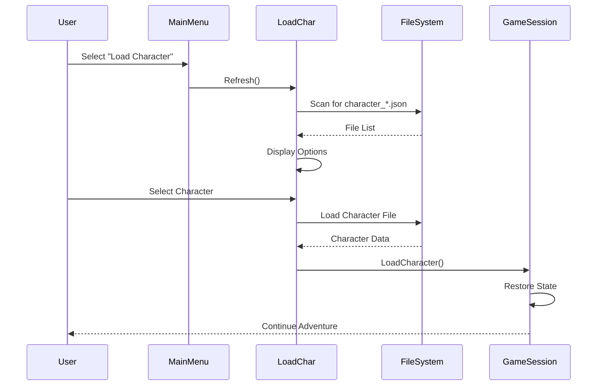

**Diagram sources**
- [update.go](file://pkg/ui/update.go#L71-L73)
- [update.go](file://pkg/ui/update.go#L91-L101)

**Section sources**
- [update.go](file://pkg/ui/update.go#L58-L107)

## Adding New Screens

### Implementation Steps

To add a new screen to the navigation system, follow these steps:

#### 1. Define the Screen Constant

Add a new screen constant to the `Screen` enumeration:

```go
// Add to pkg/ui/model.go
const (
    // ... existing screens ...
    ScreenNewFeature Screen = iota
)
```

#### 2. Create the Screen Model

Implement the screen-specific model with appropriate state:

```go
// Add to pkg/ui/new_feature.go
type NewFeatureModel struct {
    // Screen-specific state
    cursor int
    data []string
    // Additional fields as needed
}

func NewNewFeatureModel() NewFeatureModel {
    return NewFeatureModel{
        cursor: 0,
        data: []string{"Option 1", "Option 2"},
    }
}
```

#### 3. Add Screen-Specific Methods

Implement navigation and interaction methods:

```go
// Add to pkg/ui/new_feature.go
func (m *NewFeatureModel) MoveUp() {
    if m.cursor > 0 {
        m.cursor--
    }
}

func (m *NewFeatureModel) MoveDown() {
    if m.cursor < len(m.data)-1 {
        m.cursor++
    }
}
```

#### 4. Update the Root Model

Add the new model to the root model structure:

```go
// Add to pkg/ui/model.go
type Model struct {
    // ... existing fields ...
    NewFeature NewFeatureModel
}
```

#### 5. Initialize the New Screen

Update the `NewModel` function:

```go
// Update pkg/ui/model.go
func NewModel() Model {
    return Model{
        // ... existing initialization ...
        NewFeature: NewNewFeatureModel(),
    }
}
```

#### 6. Add Key Handler

Implement the key press handler:

```go
// Add to pkg/ui/update.go
func (m Model) handleNewFeatureKeys(msg tea.KeyMsg) (tea.Model, tea.Cmd) {
    switch msg.String() {
    case "up", "k":
        m.NewFeature.MoveUp()
    case "down", "j":
        m.NewFeature.MoveDown()
    case "enter":
        // Handle selection
        selected := m.NewFeature.GetSelected()
        // Perform action and potentially transition
    case "esc", "q":
        m.CurrentScreen = ScreenMainMenu
    }
    return m, nil
}
```

#### 7. Update Screen Router

Modify the screen routing function:

```go
// Update pkg/ui/update.go
func (m Model) handleKeyPress(msg tea.KeyMsg) (tea.Model, tea.Cmd) {
    switch m.CurrentScreen {
    // ... existing cases ...
    case ScreenNewFeature:
        return m.handleNewFeatureKeys(msg)
    }
}
```

#### 8. Add Navigation Logic

Integrate the new screen into existing navigation flows:

```go
// Example: Add to MainMenu handler
case "New Feature":
    m.CurrentScreen = ScreenNewFeature
```

### Integration Patterns

New screens should follow established patterns:

- **State Preservation**: Maintain relevant state across transitions
- **Error Handling**: Implement robust error handling for external operations
- **Keyboard Navigation**: Support standard navigation keys (arrow keys, enter, esc)
- **Visual Feedback**: Provide clear indication of current state and selections
- **Consistent Styling**: Follow the application's visual design guidelines

**Section sources**
- [model.go](file://pkg/ui/model.go#L9-L31)
- [update.go](file://pkg/ui/update.go#L32-L56)

## Edge Cases and Error Handling

### Invalid Transitions

The navigation system handles several edge cases gracefully:

#### Null Character States

During character creation, null character states are handled appropriately:

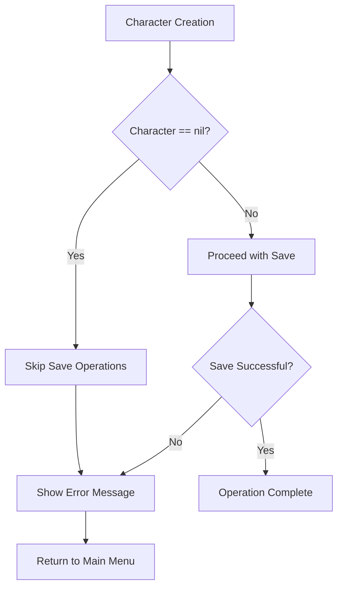

**Diagram sources**
- [model.go](file://pkg/ui/model.go#L86-L95)

#### File System Errors

Character loading includes comprehensive error handling:

- **Missing Files**: Graceful degradation when no save files exist
- **Corrupted Files**: Clear error messages for malformed character data
- **Permission Issues**: Appropriate error reporting for access problems
- **Validation Failures**: Robust validation of loaded character data

#### Memory Management

The system prevents memory leaks through careful resource management:

- **Model Cleanup**: Proper disposal of screen-specific resources
- **State Reset**: Comprehensive state clearing during transitions
- **Reference Management**: Careful handling of pointers and references

### Error Recovery Mechanisms

The navigation system implements several recovery strategies:

#### Automatic Recovery

- **Invalid Input**: Invalid key combinations are ignored
- **State Corruption**: Partial state corruption is detected and corrected
- **Network Failures**: External data loading failures are handled gracefully

#### Manual Recovery

- **User Intervention**: Clear error messages guide users to corrective actions
- **State Reset**: Ability to reset problematic states
- **Fallback Modes**: Alternative pathways when primary routes fail

**Section sources**
- [update.go](file://pkg/ui/update.go#L95-L101)
- [model.go](file://pkg/ui/model.go#L86-L95)

## Best Practices

### Navigation Design Principles

1. **Clear Progression**: Maintain logical flow between screens
2. **Consistent Patterns**: Use uniform navigation patterns across screens
3. **State Preservation**: Preserve relevant state during transitions
4. **Error Resilience**: Handle errors gracefully without crashing
5. **User Feedback**: Provide clear visual and textual feedback

### Code Organization

- **Separation of Concerns**: Keep navigation logic separate from business logic
- **Single Responsibility**: Each screen model handles one specific function
- **Interface Consistency**: Maintain consistent method signatures across screen models
- **Documentation**: Document navigation flows and state transitions

### Performance Considerations

- **Lazy Loading**: Load data only when needed
- **State Caching**: Cache frequently accessed data
- **Memory Efficiency**: Minimize memory usage in screen models
- **Responsive UI**: Ensure smooth transitions between screens

### Testing Strategies

- **Unit Tests**: Test individual screen models independently
- **Integration Tests**: Verify navigation flows between screens
- **State Tests**: Validate state preservation and restoration
- **Error Tests**: Test error handling and recovery mechanisms

The screen navigation system demonstrates effective implementation of the Elm Architecture pattern, providing a robust foundation for the saga-demonspawn application's user interface. Its modular design, comprehensive error handling, and clear state management make it an excellent example of modern terminal application development using the Bubble Tea framework.