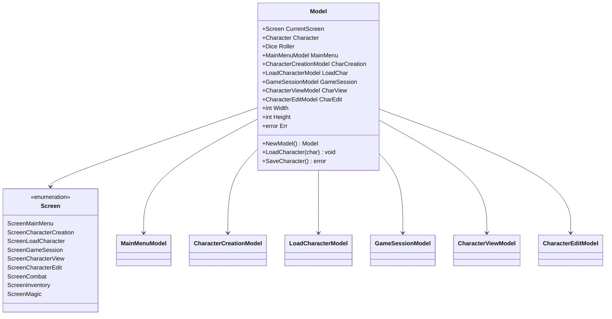

# UI Components

<cite>
**Referenced Files in This Document**
- [model.go](file://pkg/ui/model.go)
- [update.go](file://pkg/ui/update.go)
- [view.go](file://pkg/ui/view.go)
- [main_menu.go](file://pkg/ui/main_menu.go)
- [character_creation.go](file://pkg/ui/character_creation.go)
- [character_view.go](file://pkg/ui/character_view.go)
- [character_edit.go](file://pkg/ui/character_edit.go)
- [load_character.go](file://pkg/ui/load_character.go)
- [game_session.go](file://pkg/ui/game_session.go)
- [README.md](file://README.md)
- [go.mod](file://go.mod)
</cite>

## Table of Contents
1. [Introduction](#introduction)
2. [Architecture Overview](#architecture-overview)
3. [Core Model Structure](#core-model-structure)
4. [Screen Components](#screen-components)
5. [State Management](#state-management)
6. [Input Handling](#input-handling)
7. [Rendering System](#rendering-system)
8. [Styling and Theming](#styling-and-theming)
9. [Accessibility Considerations](#accessibility-considerations)
10. [Responsive Design](#responsive-design)
11. [Usage Examples](#usage-examples)
12. [Best Practices](#best-practices)

## Introduction

The saga-demonspawn application implements a sophisticated terminal-based user interface using the Bubble Tea framework, a powerful library for building interactive CLI applications in Go. The UI follows the Elm Architecture pattern, providing a clean separation between state management, user input handling, and rendering logic.

The application consists of multiple interconnected screens that guide users through character creation, management, and gameplay. Each screen maintains its own state while being orchestrated by a central model that manages screen transitions and global application state.

## Architecture Overview

The UI architecture is built around several key principles:


**Diagram sources**
- [model.go](file://pkg/ui/model.go#L33-L95)
- [update.go](file://pkg/ui/update.go#L16-L329)
- [view.go](file://pkg/ui/view.go#L8-L405)

**Section sources**
- [model.go](file://pkg/ui/model.go#L1-L95)
- [update.go](file://pkg/ui/update.go#L1-L329)

## Core Model Structure

The central `Model` struct serves as the root container for all application state and screen components:



**Diagram sources**
- [model.go](file://pkg/ui/model.go#L33-L95)

### Key Model Properties

| Property | Type | Purpose | Default Value |
|----------|------|---------|---------------|
| `CurrentScreen` | `Screen` | Tracks active screen | `ScreenMainMenu` |
| `Character` | `*character.Character` | Currently loaded character | `nil` |
| `Dice` | `dice.Roller` | Random number generator | Standard roller |
| `Width` | `int` | Terminal width | `80` |
| `Height` | `int` | Terminal height | `24` |
| `Err` | `error` | Last error encountered | `nil` |

**Section sources**
- [model.go](file://pkg/ui/model.go#L33-L95)

## Screen Components

The application implements seven primary screen components, each with distinct functionality and state management:

### Main Menu Screen

The entry point of the application, providing navigation to character creation, loading, and exit options.


**Diagram sources**
- [main_menu.go](file://pkg/ui/main_menu.go#L4-L49)

#### Main Menu Features:
- **Navigation**: Arrow keys (`↑`/`↓`) or `j`/`k` for movement
- **Selection**: `Enter` key to activate selected option
- **Exit**: `q` or `Esc` to quit application
- **Visual Indicators**: Cursor highlighting with `>` prefix

**Section sources**
- [main_menu.go](file://pkg/ui/main_menu.go#L1-L49)

### Character Creation Flow

A multi-step process for creating new characters with stat rolling, equipment selection, and final review.


**Diagram sources**
- [character_creation.go](file://pkg/ui/character_creation.go#L9-L28)

#### Character Creation Steps:

| Step | Purpose | Controls | Validation |
|------|---------|----------|------------|
| Roll Characteristics | Stat generation | `r` (roll all), `Esc` (cancel) | All 7 stats required |
| Select Equipment | Weapon/armor selection | `↑`/`↓` (weapons), `←`/`→` (armor) | Equipment selection |
| Review Character | Final confirmation | `Enter` (confirm), `Esc` (back) | None |

**Section sources**
- [character_creation.go](file://pkg/ui/character_creation.go#L1-L279)

### Load Character Screen

Manages character file discovery and loading from the local filesystem.


**Diagram sources**
- [load_character.go](file://pkg/ui/load_character.go#L10-L97)

#### Load Character Features:
- **File Discovery**: Automatic scanning of `character_*.json` files
- **Navigation**: Arrow keys or `j`/`k` for file selection
- **Loading**: `Enter` key to load selected character
- **Error Handling**: Comprehensive error reporting for file operations

**Section sources**
- [load_character.go](file://pkg/ui/load_character.go#L1-L97)

### Game Session Menu

Primary gameplay interface with character management and progression options.


**Diagram sources**
- [game_session.go](file://pkg/ui/game_session.go#L4-L77)

#### Dynamic Menu Options:
- **Standard Options**: View character, edit stats, combat, inventory
- **Magic Unlock**: "Cast Spell" option appears when magic is unlocked
- **Conditional Visibility**: Inventory management based on game progress

**Section sources**
- [game_session.go](file://pkg/ui/game_session.go#L1-L77)

### Character View Screen

Displays comprehensive character statistics and equipment information.


**Diagram sources**
- [character_view.go](file://pkg/ui/character_view.go#L6-L26)

#### Character View Layout:
- **Characteristics**: 7 core stats (STR, SPD, STA, CRG, LCK, CHM, ATT)
- **Resources**: LP, Skill, POW (when magic unlocked)
- **Equipment**: Weapons, armor, shields with protection values
- **Progress**: Enemies defeated count

**Section sources**
- [character_view.go](file://pkg/ui/character_view.go#L1-L26)

### Character Edit Screen

Interactive interface for modifying character statistics during gameplay.


**Diagram sources**
- [character_edit.go](file://pkg/ui/character_edit.go#L24-L173)

#### Edit Mode Features:
- **Field Navigation**: Arrow keys or `j`/`k` for field selection
- **Input Mode**: Numeric input with backspace support
- **Validation**: Minus sign allowed for negative values
- **Cancellation**: `Esc` key to cancel edits without saving

**Section sources**
- [character_edit.go](file://pkg/ui/character_edit.go#L1-L173)

## State Management

The application implements a hierarchical state management system where the root model coordinates between global application state and screen-specific state.


**Diagram sources**
- [model.go](file://pkg/ui/model.go#L33-L95)
- [update.go](file://pkg/ui/update.go#L32-L56)

### State Persistence Patterns

The application maintains state across screen transitions through several mechanisms:

1. **Character Preservation**: Loaded characters remain available across sessions
2. **Roll State**: Character creation rolls persist until confirmed
3. **Cursor Position**: Navigation positions are maintained within screens
4. **Input Buffers**: Active editing sessions preserve their state

**Section sources**
- [model.go](file://pkg/ui/model.go#L78-L95)

## Input Handling

The input system implements a centralized key routing mechanism that directs user input to appropriate screen handlers.


**Diagram sources**
- [update.go](file://pkg/ui/update.go#L32-L56)

### Global Key Bindings

| Key Combination | Action | Scope |
|----------------|--------|-------|
| `Ctrl+C` | Quit application | All screens |
| `q` | Quit/Cancel | All screens |
| `Esc` | Cancel/Back | All screens |
| `Enter` | Confirm/Select | All screens |

### Screen-Specific Key Mappings

Each screen implements its own key binding system:

#### Main Menu Navigation
- `↑`/`k`: Move up
- `↓`/`j`: Move down  
- `Enter`: Select option
- `q`/`Esc`: Quit application

#### Character Creation Flow
- **Roll Step**: `r` (roll all), `Esc` (cancel)
- **Equipment Step**: Arrow keys for selection, `Enter` (next), `Esc` (back)
- **Review Step**: `Enter` (confirm), `Esc`/`q` (cancel/back)

#### Character Editing
- `↑`/`k`: Move up field
- `↓`/`j`: Move down field
- `Enter`: Start editing
- `Esc`/`q`: Cancel/edit mode

**Section sources**
- [update.go](file://pkg/ui/update.go#L58-L329)

## Rendering System

The rendering system uses a functional approach where each screen component defines its own display logic through dedicated view functions.


**Diagram sources**
- [view.go](file://pkg/ui/view.go#L8-L405)

### View Function Architecture

Each view function follows a consistent pattern:

1. **Header Generation**: ASCII art borders and titles
2. **Content Assembly**: Dynamic content based on current state
3. **Navigation Instructions**: Screen-specific help text
4. **Footer Information**: Status indicators and controls

### Character Display Formatting

The application uses structured formatting for character statistics:

```go
// Example formatting pattern from viewCharacterView()
b.WriteString(fmt.Sprintf("  │ STR: %-3d  SPD: %-3d  STA: %-3d  CRG: %-3d │\n",
    char.Strength, char.Speed, char.Stamina, char.Courage))
```

This creates aligned columns that adapt to different terminal widths while maintaining readability.

**Section sources**
- [view.go](file://pkg/ui/view.go#L1-L405)

## Styling and Theming

The application leverages ASCII art and consistent formatting to create a cohesive visual appearance without external styling libraries.

### Visual Elements

| Element | Implementation | Purpose |
|---------|---------------|---------|
| Borders | ASCII box characters (`╔`, `╗`, `╚`, `╝`, `═`, `║`) | Screen boundaries |
| Headers | Centered text with border framing | Screen titles |
| Lists | Prefix indicators (`> `, `  `) | Selection highlighting |
| Tables | Aligned columns with padding | Statistical data |

### Color and Highlighting

While the current implementation focuses on ASCII art, the underlying Bubble Tea framework supports advanced styling through the Lip Gloss library. Future enhancements could include:

- **Color Themes**: Different color schemes for various game states
- **Status Indicators**: Color-coded health and resource bars
- **Interactive Feedback**: Highlighted selections and active elements

### Layout Consistency

All screens maintain consistent spacing and alignment:

- **Vertical Spacing**: 1 blank line between major sections
- **Horizontal Alignment**: 2-space indents for nested content
- **Text Justification**: Left-aligned with consistent padding

**Section sources**
- [view.go](file://pkg/ui/view.go#L30-L405)

## Accessibility Considerations

The terminal-based interface implements several accessibility-friendly patterns:

### Keyboard-Only Navigation

All functionality is accessible exclusively through keyboard input:
- No mouse-dependent interactions
- Consistent key bindings across screens
- Predictable navigation patterns

### Screen Reader Compatibility

The structured text format works well with screen readers:
- Logical content hierarchy
- Descriptive labels for all interactive elements
- Clear separation between static information and interactive controls

### Visual Accessibility

- **High Contrast**: Clear distinction between active and inactive elements
- **Readable Fonts**: Fixed-width characters for consistent spacing
- **Minimal Visual Clutter**: Focused content presentation

### Responsive Text Display

The application adapts to different terminal sizes:
- **Dynamic Width**: Content reflows based on terminal width
- **Flexible Layout**: Information stacks vertically when narrow
- **Truncation Handling**: Long text is appropriately truncated

**Section sources**
- [model.go](file://pkg/ui/model.go#L72-L74)

## Responsive Design

The UI implements adaptive behavior for different terminal dimensions:

### Terminal Size Awareness


**Diagram sources**
- [update.go](file://pkg/ui/update.go#L18-L22)

### Adaptive Layout Patterns

| Screen Type | Adaptation Strategy | Constraints |
|-------------|-------------------|-------------|
| Main Menu | Vertical stacking | Minimal width requirement |
| Character Creation | Multi-column layout | Space for equipment lists |
| Character View | Tabular display | Fixed column widths |
| Character Edit | List format | Single-column for simplicity |

### Content Prioritization

When terminal space is limited, the application prioritizes essential information:
- **Critical Stats**: Health, skill, and basic characteristics
- **Navigation**: Essential controls and help text
- **Status**: Current game state information

**Section sources**
- [model.go](file://pkg/ui/model.go#L72-L74)

## Usage Examples

### Basic Screen Navigation

```go
// Example: Transition from main menu to character creation
func navigateToCharacterCreation(model *Model) {
    model.CurrentScreen = ScreenCharacterCreation
    model.CharCreation.Reset()
}
```

### Character State Updates

```go
// Example: Loading a character and transitioning to game session
func loadCharacterAndUpdate(model *Model, character *character.Character) {
    model.LoadCharacter(character)
    model.GameSession.UpdateMagicVisibility(character.MagicUnlocked)
}
```

### Input Handling Patterns

```go
// Example: Processing numeric input during character editing
func handleNumericInput(model *Model, key string) {
    if len(key) == 1 && key[0] >= '0' && key[0] <= '9' {
        model.CharEdit.AppendInput(key)
    }
    if key == "-" && len(model.CharEdit.GetInputBuffer()) == 0 {
        model.CharEdit.AppendInput("-")
    }
}
```

### Error Handling Integration

```go
// Example: Managing errors during character loading
func handleCharacterLoadError(model *Model, err error) {
    model.Err = err
    // Error state persists until cleared by user action
}
```

**Section sources**
- [update.go](file://pkg/ui/update.go#L78-L98)
- [update.go](file://pkg/ui/update.go#L256-L277)

## Best Practices

### State Management Guidelines

1. **Immutable Updates**: Always return new model instances from update functions
2. **State Validation**: Validate state transitions before applying changes
3. **Error Propagation**: Handle and propagate errors consistently across screens
4. **Resource Cleanup**: Properly reset state when navigating between screens

### Input Handling Standards

1. **Consistent Key Bindings**: Maintain uniform navigation patterns across screens
2. **Immediate Feedback**: Provide visual feedback for all user actions
3. **Graceful Degradation**: Handle unexpected input gracefully
4. **Help Integration**: Include contextual help for complex operations

### Rendering Optimization

1. **Efficient String Building**: Use `strings.Builder` for complex text assembly
2. **Minimal Redraws**: Only update changed portions of the screen
3. **Layout Caching**: Cache computed layouts when dimensions haven't changed
4. **Memory Management**: Avoid unnecessary allocations in hot rendering paths

### Extensibility Patterns

1. **Interface Segregation**: Define focused interfaces for screen components
2. **Command Pattern**: Use commands for asynchronous operations
3. **Event System**: Implement event-driven communication between components
4. **Plugin Architecture**: Design components to be easily extended or replaced

### Testing Strategies

1. **Unit Testing**: Test individual screen components in isolation
2. **Integration Testing**: Verify screen transitions and state changes
3. **End-to-End Testing**: Simulate complete user workflows
4. **Accessibility Testing**: Validate keyboard navigation and screen reader compatibility

**Section sources**
- [model.go](file://pkg/ui/model.go#L58-L95)
- [update.go](file://pkg/ui/update.go#L16-L329)
- [view.go](file://pkg/ui/view.go#L8-L405)