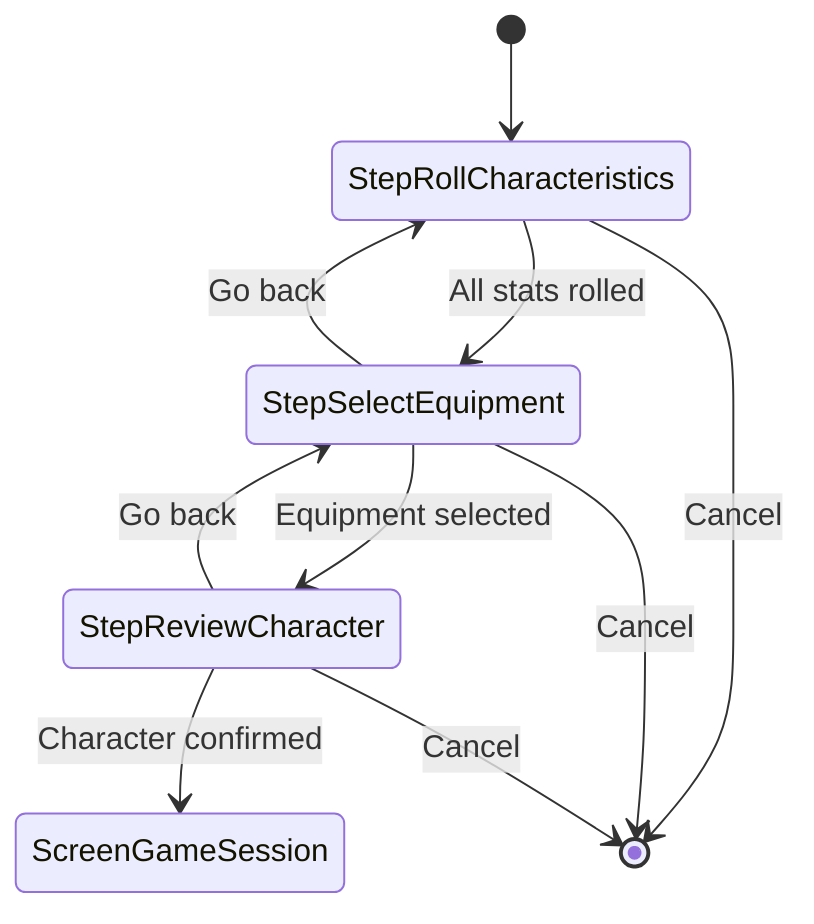
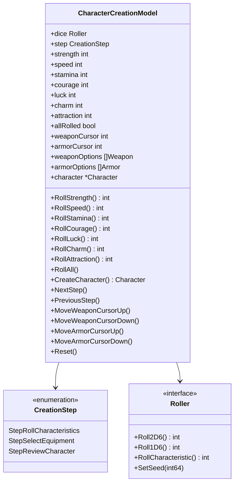
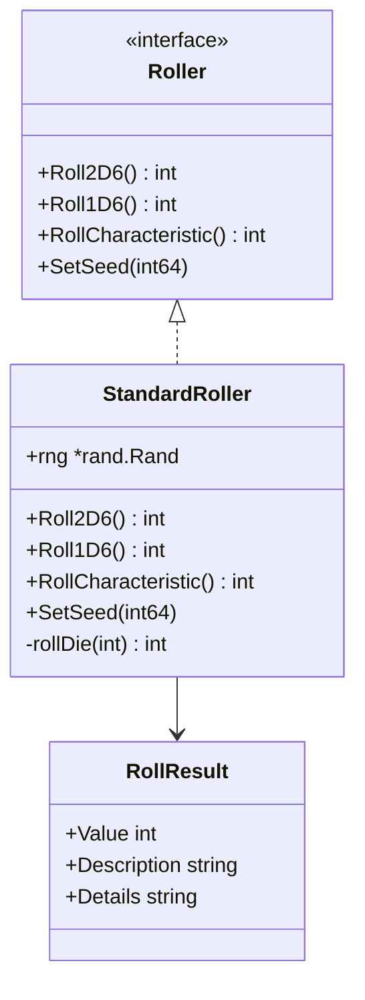
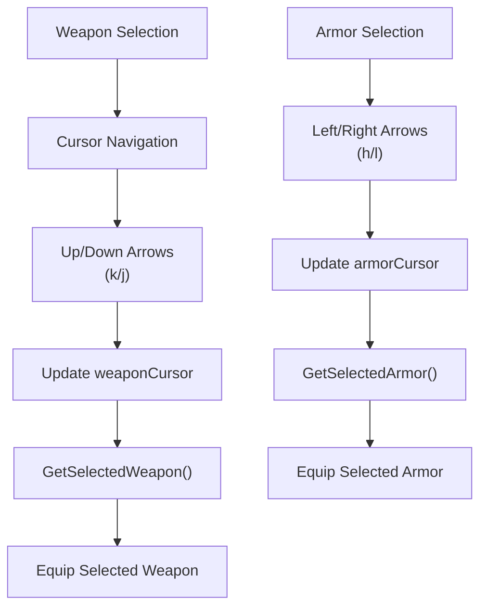

# Character Creation

<cite>
**Referenced Files in This Document**
- [internal/character/character.go](file://internal/character/character.go)
- [internal/dice/dice.go](file://internal/dice/dice.go)
- [internal/items/items.go](file://internal/items/items.go)
- [pkg/ui/character_creation.go](file://pkg/ui/character_creation.go)
- [pkg/ui/model.go](file://pkg/ui/model.go)
- [pkg/ui/update.go](file://pkg/ui/update.go)
- [README.md](file://README.md)
</cite>

## Table of Contents
1. [Introduction](#introduction)
2. [Character Creation Workflow](#character-creation-workflow)
3. [CharacterCreationModel Architecture](#charactercreationmodel-architecture)
4. [Dice Rolling System](#dice-rolling-system)
5. [Equipment Selection](#equipment-selection)
6. [Step-by-Step Implementation](#step-by-step-implementation)
7. [User Interaction Patterns](#user-interaction-patterns)
8. [Error Handling and Validation](#error-handling-and-validation)
9. [Testing and Testability](#testing-and-testability)
10. [Common Issues and Solutions](#common-issues-and-solutions)
11. [Technical Depth for Advanced Users](#technical-depth-for-advanced-users)

## Introduction

The character creation process in the saga-demonspawn application follows the classic tabletop RPG mechanics of the "Sagas of the Demonspawn" gamebook. Players roll seven core characteristics using 2D6×8 mechanics, select starting equipment from predefined options, and review their final character before entering the game world. This process is implemented through a sophisticated state machine with three distinct steps, providing both beginner-friendly simplicity and advanced control mechanisms.

The character creation system demonstrates excellent software engineering practices including interface-based design for testability, incremental state building, and comprehensive error handling. The application uses the Bubble Tea framework for terminal-based UI navigation while maintaining clean separation between business logic and presentation concerns.

## Character Creation Workflow

The character creation process follows a structured three-step workflow that guides players through the essential aspects of character development:



**Diagram sources**
- [pkg/ui/character_creation.go](file://pkg/ui/character_creation.go#L10-L19)
- [pkg/ui/update.go](file://pkg/ui/update.go#L109-L159)

### Step 1: Roll Characteristics (2D6×8 Mechanics)

The first step involves rolling seven core characteristics using the game's signature 2D6×8 mechanic. Each characteristic represents a fundamental aspect of the character's abilities:

- **Strength (STR)**: Physical power and carrying capacity
- **Speed (SPD)**: Agility, reflexes, and movement speed
- **Stamina (STA)**: Endurance and health regeneration
- **Courage (CRG)**: Mental fortitude and fear resistance
- **Luck (LCK)**: Chance encounters and survival odds
- **Charm (CHM)**: Social influence and persuasion ability
- **Attraction (ATT)**: Personal magnetism and charisma

Each roll produces a value between 16 and 96, representing percentage-based capabilities where 100% is theoretically unattainable to reflect the game's philosophy that "nobody is perfect."

### Step 2: Select Equipment

After rolling characteristics, players choose their starting equipment from predefined options. The system offers:

- **Weapons**: Swords, daggers, clubs, axes, and specialized weapons
- **Armor**: Leather, chain mail, plate mail, and no armor options
- **Shields**: Standard protection with varying effectiveness based on armor combination

### Step 3: Review and Confirmation

The final step allows players to review their complete character profile before committing to the game. This includes verifying rolled stats, selected equipment, and derived values like life points.

**Section sources**
- [pkg/ui/character_creation.go](file://pkg/ui/character_creation.go#L10-L19)
- [internal/dice/dice.go](file://internal/dice/dice.go#L12-L26)

## CharacterCreationModel Architecture

The `CharacterCreationModel` struct serves as the central state container for the character creation process, managing all aspects of character development across the three creation steps.



**Diagram sources**
- [pkg/ui/character_creation.go](file://pkg/ui/character_creation.go#L21-L44)
- [internal/dice/dice.go](file://internal/dice/dice.go#L11-L26)

### Core Fields and Their Purposes

The model maintains several categories of state:

**Step Tracking Fields:**
- `step CreationStep`: Tracks current position in the creation workflow
- `allRolled bool`: Indicates completion of characteristic rolling phase

**Characteristic Values:**
- Seven integer fields (`strength`, `speed`, `stamina`, `courage`, `luck`, `charm`, `attraction`) store rolled values
- These correspond directly to the game's seven core characteristics

**Equipment Selection Cursors:**
- `weaponCursor int`: Position in weapon selection list
- `armorCursor int`: Position in armor selection list
- `weaponOptions []items.Weapon`: Available weapon choices
- `armorOptions []items.Armor`: Available armor choices

**Final Character Object:**
- `character *character.Character`: Complete character after creation completion

**Dice Roller Injection:**
- `dice dice.Roller`: Interface for dice rolling operations, enabling testability

**Section sources**
- [pkg/ui/character_creation.go](file://pkg/ui/character_creation.go#L21-L44)

## Dice Rolling System

The dice rolling system implements the game's core mechanic of 2D6×8 for characteristic generation. This system demonstrates excellent testability through interface-based design and deterministic seeding capabilities.



**Diagram sources**
- [internal/dice/dice.go](file://internal/dice/dice.go#L11-L26)
- [internal/dice/dice.go](file://internal/dice/dice.go#L29-L76)

### Dice Mechanics Implementation

The `RollCharacteristic()` method implements the game's signature mechanic:

```go
// RollCharacteristic rolls 2d6 and multiplies by 8 for character statistics.
// This produces values in the range 16-96, representing percentage capabilities.
// Nobody is perfect, so 100% is impossible!
func (r *StandardRoller) RollCharacteristic() int {
    return r.Roll2D6() * 8
}
```

This implementation ensures:
- **Stat Range**: Values between 16 and 96 (2×8 to 12×8)
- **Probability Distribution**: Bell curve typical of 2D6 mechanics
- **Non-perfect Characters**: Maximum value is 96, never reaching 100%

### Testability Through Interface Injection

The dice roller is injected into the character creation model, enabling:

**Deterministic Testing:**
```go
// Create seeded roller for predictable results
roller := dice.NewSeededRoller(42)
model := NewCharacterCreationModel(roller)
```

**Mock Implementation:**
```go
// Test-specific roller for controlled scenarios
type TestRoller struct{}
func (r *TestRoller) RollCharacteristic() int { return 72 } // Consistent middle value
```

**Section sources**
- [internal/dice/dice.go](file://internal/dice/dice.go#L11-L26)
- [internal/dice/dice.go](file://internal/dice/dice.go#L59-L64)

## Equipment Selection

The equipment selection system provides players with meaningful choices while maintaining game balance through predefined options. The system supports both weapons and armor selection with intuitive cursor-based navigation.

### Equipment Categories

**Weapons:**
- **Sword**: Standard melee weapon (10 damage bonus)
- **Dagger**: Light, concealable weapon (5 damage bonus)
- **Club**: Basic melee weapon (8 damage bonus)
- **Axe**: Standard melee weapon (15 damage bonus)
- **Flail**: Standard melee weapon (7 damage bonus)
- **Halberd**: Two-handed weapon (12 damage bonus)
- **Lance**: Mounted/charge weapon (12 damage bonus)
- **Mace**: Heavy melee weapon (14 damage bonus)
- **Spear**: Can be thrown (12 damage bonus)
- **Arrow**: Ranged, single use (10 damage bonus)
- **Doombringer**: Cursed legendary axe (20 damage bonus, special effects)

**Armor:**
- **None**: No armor equipped (0 protection)
- **Leather Armor**: Light armor, no movement penalty (5 protection)
- **Chain Mail**: Medium armor, no movement penalty (8 protection)
- **Plate Mail**: Heavy armor, no movement penalty (12 protection)

**Shields:**
- **Shield**: Standard protection (7 protection, reduced with armor)

### Cursor-Based Navigation

The equipment selection uses cursor-based navigation with arrow key support:



**Diagram sources**
- [pkg/ui/character_creation.go](file://pkg/ui/character_creation.go#L165-L199)
- [pkg/ui/update.go](file://pkg/ui/update.go#L140-L159)

**Section sources**
- [internal/items/items.go](file://internal/items/items.go#L61-L236)
- [pkg/ui/character_creation.go](file://pkg/ui/character_creation.go#L165-L199)

## Step-by-Step Implementation

### Initialization and Setup

Character creation begins with model initialization:

```go
func NewCharacterCreationModel(roller dice.Roller) CharacterCreationModel {
    return CharacterCreationModel{
        dice:          roller,
        step:          StepRollCharacteristics,
        strength:      0,
        speed:         0,
        stamina:       0,
        courage:       0,
        luck:          0,
        charm:         0,
        attraction:    0,
        allRolled:     false,
        weaponCursor:  0,
        armorCursor:   0,
        weaponOptions: items.StartingWeapons(),
        armorOptions:  items.StartingArmor(),
        character:     nil,
    }
}
```

### Rolling Characteristics

Each characteristic is rolled independently through dedicated methods:

```go
func (m *CharacterCreationModel) RollStrength() int {
    m.strength = m.dice.RollCharacteristic()
    m.checkAllRolled()
    return m.strength
}
```

The `RollAll()` method executes all rolls simultaneously:

```go
func (m *CharacterCreationModel) RollAll() {
    m.RollStrength()
    m.RollSpeed()
    m.RollStamina()
    m.RollCourage()
    m.RollLuck()
    m.RollCharm()
    m.RollAttraction()
}
```

### State Validation and Transitions

The model maintains strict state validation to prevent invalid transitions:

```go
func (m *CharacterCreationModel) checkAllRolled() {
    m.allRolled = m.strength > 0 && m.speed > 0 && m.stamina > 0 &&
        m.courage > 0 && m.luck > 0 && m.charm > 0 && m.attraction > 0
}
```

Navigation between steps respects state boundaries:

```go
func (m *CharacterCreationModel) NextStep() {
    m.step++
}

func (m *CharacterCreationModel) PreviousStep() {
    if m.step > StepRollCharacteristics {
        m.step--
    }
}
```

### Character Finalization

The `CreateCharacter()` method combines rolled characteristics with selected equipment:

```go
func (m *CharacterCreationModel) CreateCharacter() (*character.Character, error) {
    char, err := character.New(
        m.strength, m.speed, m.stamina, m.courage, m.luck, m.charm, m.attraction,
    )
    if err != nil {
        return nil, err
    }

    // Equip selected items
    selectedWeapon := m.GetSelectedWeapon()
    if selectedWeapon != nil {
        char.EquipWeapon(selectedWeapon)
    }

    selectedArmor := m.GetSelectedArmor()
    if selectedArmor != nil {
        char.EquipArmor(selectedArmor)
    }

    m.character = char
    return char, nil
}
```

**Section sources**
- [pkg/ui/character_creation.go](file://pkg/ui/character_creation.go#L46-L98)
- [pkg/ui/character_creation.go](file://pkg/ui/character_creation.go#L121-L130)
- [pkg/ui/character_creation.go](file://pkg/ui/character_creation.go#L229-L257)

## User Interaction Patterns

The character creation interface responds to keyboard input according to established patterns that provide both accessibility and efficiency.

### Keyboard Navigation Patterns

**Global Navigation:**
- `Esc`/`Q`: Return to previous screen or cancel operation
- `Enter`: Confirm selection or proceed to next step
- Arrow keys: Navigate within current selection (up/down/left/right)

**Step-Specific Controls:**

**Roll Characteristics Step:**
- `R`: Roll all characteristics simultaneously
- `Enter`: Proceed to equipment selection (only when all rolled)
- `Esc`/`Q`: Return to main menu

**Select Equipment Step:**
- `Up`/`Down`/`K`/`J`: Navigate weapon selection
- `Left`/`Right`/`H`/`L`: Navigate armor selection
- `Enter`: Proceed to review screen
- `Esc`: Return to characteristic rolling

**Review Character Step:**
- `Enter`: Finalize character creation
- `Esc`: Return to equipment selection
- `Q`: Cancel and return to main menu

### Interactive Examples

**Example 1: Rolling All Characteristics**
1. Player presses `R` to roll all seven characteristics
2. System generates values: STR=72, SPD=64, STA=80, CRG=56, LCK=48, CHM=60, ATT=76
3. System automatically advances to equipment selection

**Example 2: Selecting Equipment**
1. Player navigates weapon options using arrow keys
2. Player selects Sword (cursor position 0)
3. Player navigates armor options using left/right arrows
4. Player selects Leather Armor (cursor position 1)
5. Player presses `Enter` to advance to review

**Example 3: Review and Confirmation**
1. Player reviews complete character profile
2. Player confirms character creation with `Enter`
3. System transitions to game session screen

**Section sources**
- [pkg/ui/update.go](file://pkg/ui/update.go#L122-L181)

## Error Handling and Validation

The character creation system implements comprehensive error handling and validation to ensure data integrity and provide meaningful feedback to users.

### Characteristic Validation

The `character.New()` constructor validates all rolled characteristics:

```go
func validateCharacteristic(name string, value int) error {
    if value < 0 {
        return fmt.Errorf("%s cannot be negative: %d", name, value)
    }
    if value > 999 {
        return fmt.Errorf("%s exceeds maximum (999): %d", name, value)
    }
    return nil
}
```

### Equipment Validation

Equipment selection includes bounds checking:

```go
func (m *CharacterCreationModel) GetSelectedWeapon() *items.Weapon {
    if m.weaponCursor < len(m.weaponOptions) {
        return &m.weaponOptions[m.weaponCursor]
    }
    return nil
}
```

### State Validation

The system prevents invalid state transitions:

```go
func (m *CharacterCreationModel) NextStep() {
    // Prevent advancing without completing prerequisite steps
    if m.step == StepRollCharacteristics && !m.allRolled {
        return
    }
    m.step++
}
```

### Error Propagation

Errors are propagated through the UI layer with appropriate user feedback:

```go
case "enter":
    // Proceed to equipment selection if all rolled
    if m.CharCreation.AreAllRolled() {
        m.CharCreation.NextStep()
    }
```

**Section sources**
- [internal/character/character.go](file://internal/character/character.go#L101-L111)
- [pkg/ui/character_creation.go](file://pkg/ui/character_creation.go#L193-L207)

## Testing and Testability

The character creation system is designed with extensive testability through interface-based architecture and dependency injection.

### Interface-Based Design Benefits

**Dice Roller Interface:**
```go
type Roller interface {
    Roll2D6() int
    Roll1D6() int
    RollCharacteristic() int
    SetSeed(int64)
}
```

This interface enables:
- **Deterministic Testing**: Seed-based rollers for predictable outcomes
- **Mock Implementations**: Test-specific rollers for controlled scenarios
- **Behavior Verification**: Testing of dice roll distributions and patterns

### Test Implementation Examples

**Unit Testing Character Creation:**
```go
func TestCharacterCreation(t *testing.T) {
    // Create test roller with known seed
    roller := dice.NewSeededRoller(12345)
    model := NewCharacterCreationModel(roller)
    
    // Roll characteristics
    model.RollAll()
    
    // Verify results
    str, spd, sta, crg, lck, chm, att := model.GetCharacteristics()
    assert.Equal(t, 72, str) // Expected from seed
    assert.True(t, model.AreAllRolled())
}
```

**Integration Testing UI Flow:**
```go
func TestCharacterCreationUIFlow(t *testing.T) {
    // Test keyboard navigation
    model := NewCharacterCreationModel(dice.NewStandardRoller())
    
    // Simulate user input
    model.HandleKeyPress("r") // Roll all
    model.HandleKeyPress("down") // Select second weapon
    model.HandleKeyPress("right") // Select second armor
    model.HandleKeyPress("enter") // Confirm
    
    // Verify final state
    assert.Equal(t, ScreenGameSession, model.CurrentScreen)
}
```

### Test Coverage Areas

The testing strategy covers:

**Core Functionality:**
- Character creation with various dice rolls
- Equipment selection and validation
- State transitions and navigation
- Error handling and edge cases

**Edge Cases:**
- Minimum and maximum characteristic values
- Empty equipment lists
- Invalid cursor positions
- Interrupted creation workflows

**Section sources**
- [internal/dice/dice.go](file://internal/dice/dice.go#L11-L26)
- [pkg/ui/character_creation.go](file://pkg/ui/character_creation.go#L46-L64)

## Common Issues and Solutions

Understanding common issues and their solutions helps both users and developers navigate the character creation process effectively.

### Incomplete Stat Rolls

**Problem:** Attempting to proceed without rolling all characteristics
**Symptoms:** "Proceed" button disabled or unavailable
**Solution:** Roll all seven characteristics using `R` key or individual roll buttons

**Prevention:**
```go
func (m *CharacterCreationModel) AreAllRolled() bool {
    return m.allRolled
}
```

### Invalid Equipment Selection

**Problem:** Selecting equipment before completing characteristic rolls
**Symptoms:** Equipment selection unavailable or incorrect defaults
**Solution:** Complete characteristic rolling before proceeding to equipment selection

**Validation:**
```go
func (m *CharacterCreationModel) NextStep() {
    if m.step == StepRollCharacteristics && !m.allRolled {
        return // Prevent invalid transition
    }
    m.step++
}
```

### Memory Management

**Problem:** Large numbers of saved characters consuming disk space
**Solution:** Regular cleanup of old character files and implementation of character limits

**Implementation:**
```go
// Character saving with timestamp
func (c *Character) Save(directory string) error {
    timestamp := c.LastSaved.Format("20060102-150405")
    filename := fmt.Sprintf("character_%s.json", timestamp)
    // Save to file
}
```

### Performance Optimization

**Problem:** Slow dice rolling in large-scale simulations
**Solution:** Implement caching for frequently rolled values and optimize random number generation

**Optimization Example:**
```go
type CachedRoller struct {
    cache map[string]int
    base  dice.Roller
}

func (r *CachedRoller) RollCharacteristic() int {
    // Check cache first
    key := "characteristic"
    if val, exists := r.cache[key]; exists {
        return val
    }
    
    // Generate and cache result
    result := r.base.RollCharacteristic()
    r.cache[key] = result
    return result
}
```

**Section sources**
- [pkg/ui/character_creation.go](file://pkg/ui/character_creation.go#L132-L141)
- [internal/character/character.go](file://internal/character/character.go#L312-L339)

## Technical Depth for Advanced Users

For developers seeking deeper understanding of the character creation system's architecture and implementation details.

### State Machine Implementation

The character creation process implements a finite state machine with explicit step tracking:

```go
type CreationStep int

const (
    StepRollCharacteristics CreationStep = iota
    StepSelectEquipment
    StepReviewCharacter
)
```

**State Transition Logic:**
```go
func (m *CharacterCreationModel) NextStep() {
    switch m.step {
    case StepRollCharacteristics:
        if m.allRolled {
            m.step = StepSelectEquipment
        }
    case StepSelectEquipment:
        m.step = StepReviewCharacter
    case StepReviewCharacter:
        // Stay on review step
    }
}
```

### Memory Layout Optimization

The model uses struct embedding and field ordering for optimal memory layout:

```go
type CharacterCreationModel struct {
    dice dice.Roller
    step CreationStep
    
    // Related fields grouped together
    strength   int
    speed      int
    stamina    int
    courage    int
    luck       int
    charm      int
    attraction int
    allRolled  bool
    
    // Equipment-related fields
    weaponCursor int
    armorCursor  int
    weaponOptions []items.Weapon
    armorOptions  []items.Armor
    
    character *character.Character
}
```

### Concurrent Safety Considerations

While the current implementation is single-threaded, the architecture supports concurrent modifications through careful design:

**Thread-Safe Operations:**
```go
func (m *CharacterCreationModel) RollAll() {
    // Atomic operations for characteristic setting
    m.strength = m.dice.RollCharacteristic()
    m.speed = m.dice.RollCharacteristic()
    // ...
}
```

**Race Condition Prevention:**
```go
func (m *CharacterCreationModel) CreateCharacter() (*character.Character, error) {
    // Copy values to prevent race conditions
    str, spd, sta, crg, lck, chm, att := m.GetCharacteristics()
    
    // Create character with copied values
    return character.New(str, spd, sta, crg, lck, chm, att)
}
```

### Extension Points

The system provides several extension points for future enhancements:

**Custom Dice Mechanics:**
```go
type CustomRoller struct {
    baseRoller dice.Roller
    modifier   int
}

func (r *CustomRoller) RollCharacteristic() int {
    return r.baseRoller.RollCharacteristic() + r.modifier
}
```

**Alternative Character Creation Workflows:**
```go
type AlternativeCreationModel struct {
    base CharacterCreationModel
    // Additional fields for alternative mechanics
}
```

### Performance Profiling

Key areas for performance monitoring:

**Dice Rolling Bottleneck:**
```go
func BenchmarkRollCharacteristic(b *testing.B) {
    roller := dice.NewStandardRoller()
    b.ResetTimer()
    for i := 0; i < b.N; i++ {
        roller.RollCharacteristic()
    }
}
```

**Memory Allocation Patterns:**
```go
func BenchmarkCharacterCreation(b *testing.B) {
    roller := dice.NewStandardRoller()
    b.ReportAllocs()
    b.ResetTimer()
    
    for i := 0; i < b.N; i++ {
        model := NewCharacterCreationModel(roller)
        model.RollAll()
        model.CreateCharacter()
    }
}
```

**Section sources**
- [pkg/ui/character_creation.go](file://pkg/ui/character_creation.go#L10-L19)
- [pkg/ui/character_creation.go](file://pkg/ui/character_creation.go#L132-L141)