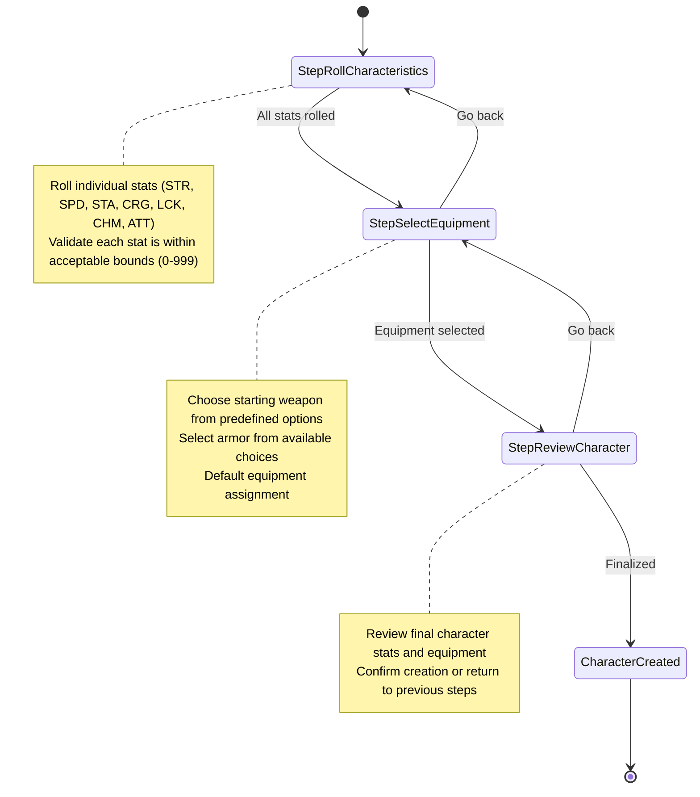
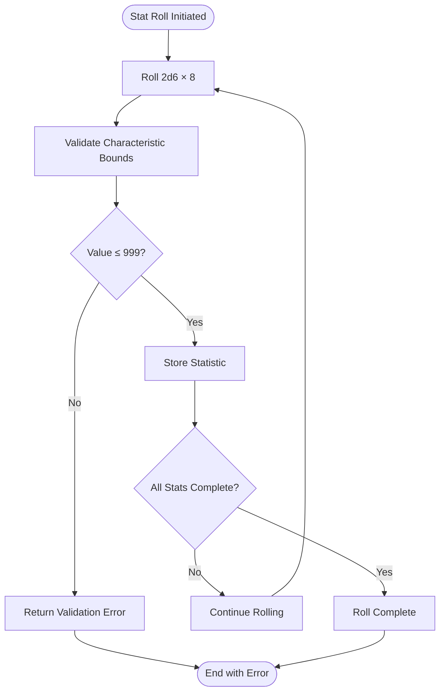
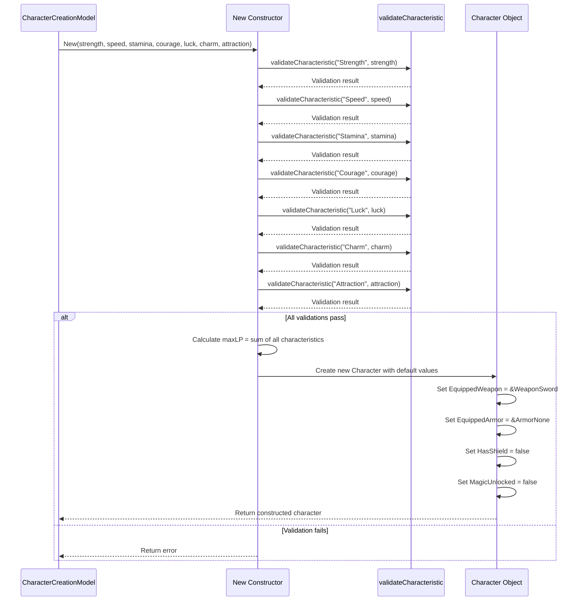
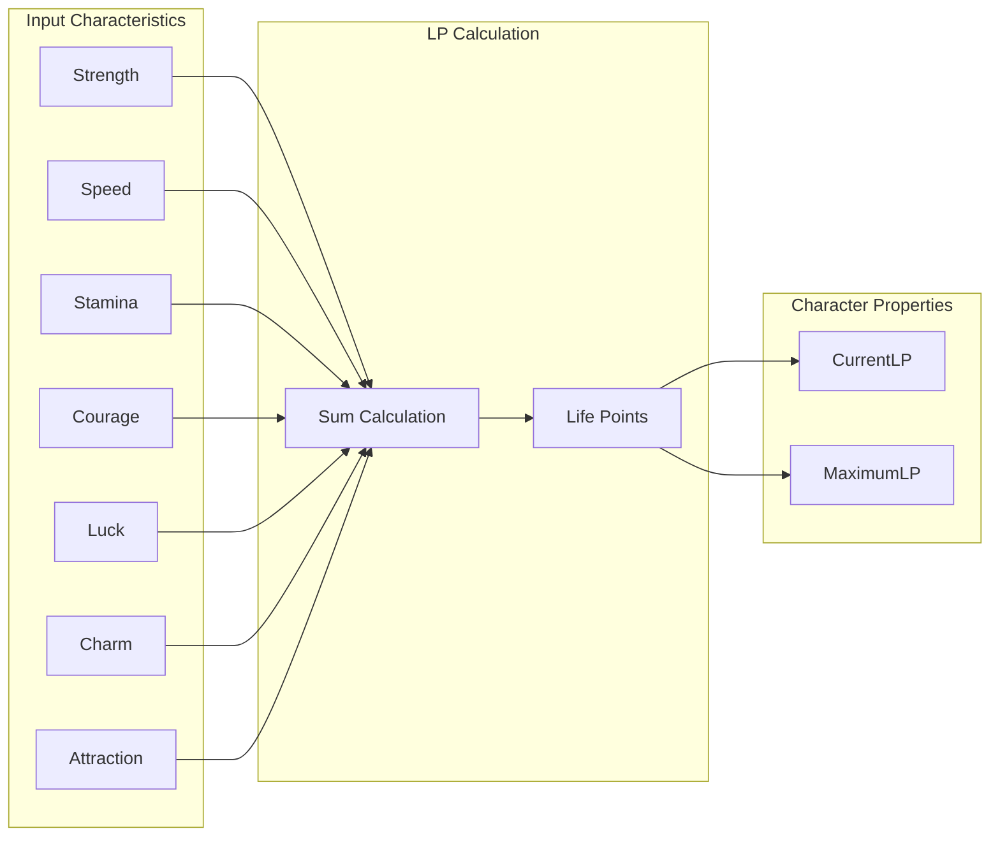
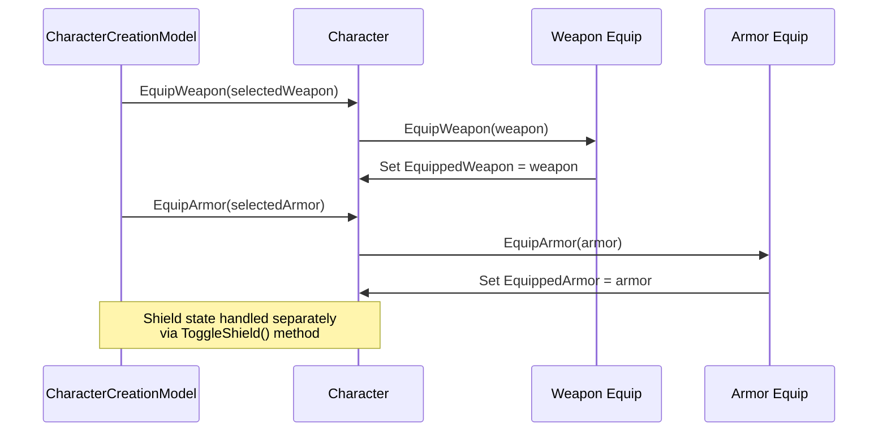
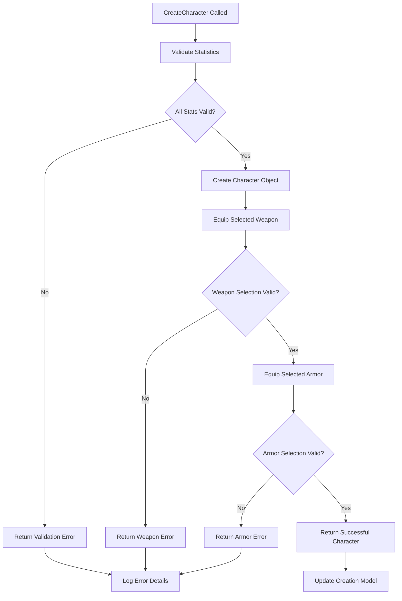
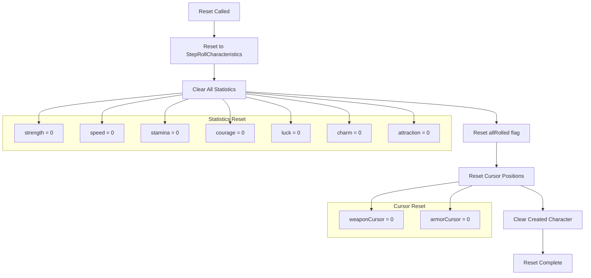
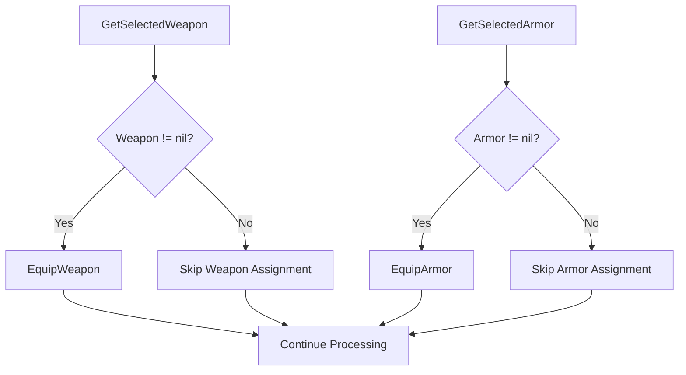
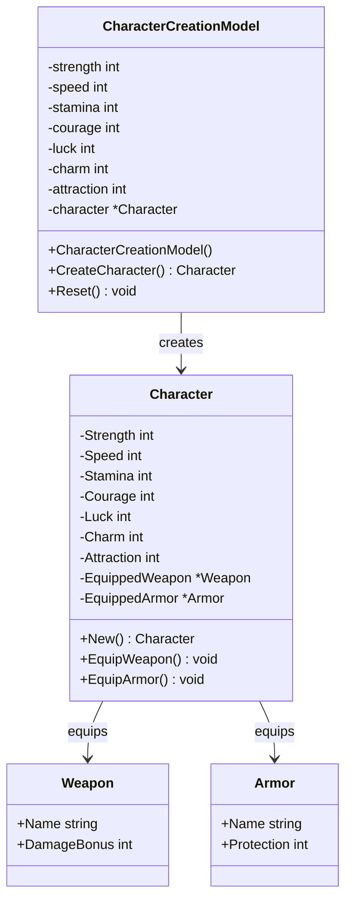

# Character Finalization

<cite>
**Referenced Files in This Document**
- [internal/character/character.go](file://internal/character/character.go)
- [pkg/ui/character_creation.go](file://pkg/ui/character_creation.go)
- [pkg/ui/model.go](file://pkg/ui/model.go)
- [pkg/ui/update.go](file://pkg/ui/update.go)
- [internal/items/items.go](file://internal/items/items.go)
- [internal/dice/dice.go](file://internal/dice/dice.go)
</cite>

## Table of Contents
1. [Introduction](#introduction)
2. [Character Creation Workflow](#character-creation-workflow)
3. [Stat Rolling and Validation](#stat-rolling-and-validation)
4. [Character Construction Process](#character-construction-process)
5. [Equipment Assignment](#equipment-assignment)
6. [Error Handling and Validation](#error-handling-and-validation)
7. [State Management](#state-management)
8. [Practical Examples](#practical-examples)
9. [Common Issues and Solutions](#common-issues-and-solutions)
10. [Advanced Implementation Details](#advanced-implementation-details)

## Introduction

Character finalization is the critical step in the Fire*Wolf character creation process where rolled statistics are transformed into a complete, playable character object. This process involves constructing a new `*character.Character` instance using validated statistics, applying selected equipment, and preparing the character for gameplay. The finalization step ensures data integrity through comprehensive validation and provides robust error handling for various failure scenarios.

The character finalization system operates through a multi-stage workflow that begins with statistical rolls, progresses through equipment selection, and culminates in the creation of a fully initialized character object ready for the game session.

## Character Creation Workflow

The character creation process follows a structured three-step workflow managed by the `CharacterCreationModel`:

**Diagram sources**
- [pkg/ui/character_creation.go](file://pkg/ui/character_creation.go#L12-L18)

**Section sources**
- [pkg/ui/character_creation.go](file://pkg/ui/character_creation.go#L12-L18)

## Stat Rolling and Validation

### Statistical Roll Mechanism

The character creation process begins with statistical rolls performed by the `dice.Roller` interface. Each characteristic is rolled using the `RollCharacteristic()` method, which generates values in the range 16-96 through a 2d6 roll multiplied by 8.

**Diagram sources**
- [internal/dice/dice.go](file://internal/dice/dice.go#L59-L63)
- [pkg/ui/character_creation.go](file://pkg/ui/character_creation.go#L72-L130)

### Validation Process

The `validateCharacteristic()` function performs comprehensive bounds checking on each rolled statistic:

| Characteristic | Minimum | Maximum | Purpose |
|----------------|---------|---------|---------|
| Strength | 0 | 999 | Physical power and melee capability |
| Speed | 0 | 999 | Agility, reaction time, and evasion |
| Stamina | 0 | 999 | Endurance and health regeneration |
| Courage | 0 | 999 | Bravery and resistance to fear effects |
| Luck | 0 | 999 | Fortune and probability manipulation |
| Charm | 0 | 999 | Social influence and persuasion |
| Attraction | 0 | 999 | Personal magnetism and charisma |

**Section sources**
- [internal/character/character.go](file://internal/character/character.go#L101-L111)

## Character Construction Process

### New() Constructor Implementation

The `character.New()` function serves as the primary constructor for creating new characters. This function performs several critical operations:

**Diagram sources**
- [internal/character/character.go](file://internal/character/character.go#L47-L98)

### Automatic LP Calculation

The constructor automatically calculates Life Points (LP) as the sum of all seven characteristics. This provides immediate derived values for character health and endurance:

**Diagram sources**
- [internal/character/character.go](file://internal/character/character.go#L73-L74)

**Section sources**
- [internal/character/character.go](file://internal/character/character.go#L47-L98)

## Equipment Assignment

### Weapon and Armor Transfer

After character construction, the `CreateCharacter()` method transfers selected equipment from the creation model to the final character object:

**Diagram sources**
- [pkg/ui/character_creation.go](file://pkg/ui/character_creation.go#L244-L256)
- [internal/character/character.go](file://internal/character/character.go#L258-L266)

### Default Equipment Assignment

The constructor automatically assigns default equipment to newly created characters:

| Item Type | Default Item | Purpose |
|-----------|--------------|---------|
| Weapon | Sword | Standard melee weapon with 10 damage bonus |
| Armor | None | No armor protection initially |
| Shield | Not equipped | Shield state set to false |

**Section sources**
- [internal/character/character.go](file://internal/character/character.go#L76-L91)

## Error Handling and Validation

### Comprehensive Error Propagation

The character finalization process implements robust error handling at multiple levels:

**Diagram sources**
- [pkg/ui/character_creation.go](file://pkg/ui/character_creation.go#L229-L256)

### Common Error Scenarios

| Error Type | Cause | Resolution |
|------------|-------|------------|
| Stat Validation | Value < 0 or > 999 | Re-roll affected statistic |
| Nil Weapon Pointer | Selected weapon unavailable | Select different weapon |
| Nil Armor Pointer | Selected armor unavailable | Select different armor |
| Character Creation Failure | Multiple validation errors | Fix all invalid stats |

**Section sources**
- [internal/character/character.go](file://internal/character/character.go#L101-L111)

## State Management

### Reset Method Implementation

The `Reset()` method provides comprehensive state cleanup for restarting character creation:

**Diagram sources**
- [pkg/ui/character_creation.go](file://pkg/ui/character_creation.go#L264-L278)

**Section sources**
- [pkg/ui/character_creation.go](file://pkg/ui/character_creation.go#L264-L278)

## Practical Examples

### Successful Character Creation

**Example Scenario**: A player rolls optimal statistics and selects appropriate equipment:

1. **Stat Rolls**: STR=96, SPD=88, STA=92, CRG=85, LCK=80, CHM=75, ATT=70
2. **LP Calculation**: 96+88+92+85+80+75+70 = 596
3. **Equipment Selection**: Sword (10 damage bonus), Leather Armor (5 protection)
4. **Final Character**: Character with 596 LP, equipped with Sword and Leather Armor

### Error Recovery Example

**Scenario**: Player attempts to finalize with invalid statistics:

1. **Invalid Stat**: STR=-5 (negative value)
2. **Validation Error**: "Strength cannot be negative: -5"
3. **Error Handling**: System prevents character creation and prompts for correction
4. **Resolution**: Player re-rolls the invalid statistic

**Section sources**
- [internal/character/character.go](file://internal/character/character.go#L47-L98)

## Common Issues and Solutions

### Nil Item Pointers

**Problem**: Attempting to equip nil weapons or armor causes runtime errors.

**Solution**: The `CreateCharacter()` method includes null checks before equipment assignment:

**Diagram sources**
- [pkg/ui/character_creation.go](file://pkg/ui/character_creation.go#L245-L253)

### Incomplete Stat Rolls

**Problem**: Attempting to finalize character before all statistics are rolled.

**Solution**: The `checkAllRolled()` method ensures completion before proceeding:

| Field | Purpose | Validation |
|-------|---------|------------|
| strength | Physical power | Must be > 0 |
| speed | Agility | Must be > 0 |
| stamina | Endurance | Must be > 0 |
| courage | Bravery | Must be > 0 |
| luck | Fortune | Must be > 0 |
| charm | Charisma | Must be > 0 |
| attraction | Magnetism | Must be > 0 |

**Section sources**
- [pkg/ui/character_creation.go](file://pkg/ui/character_creation.go#L132-L136)

## Advanced Implementation Details

### Memory Management

The character finalization process carefully manages memory allocation and pointer relationships:

**Diagram sources**
- [internal/character/character.go](file://internal/character/character.go#L14-L44)
- [pkg/ui/character_creation.go](file://pkg/ui/character_creation.go#L21-L44)

### Thread Safety Considerations

While the current implementation is single-threaded, the design accommodates potential future concurrency:

- **Immutable Construction**: Character objects are constructed once and remain immutable
- **Atomic Operations**: Equipment assignment occurs in single atomic operations
- **State Consistency**: Reset method ensures complete state restoration

**Section sources**
- [internal/character/character.go](file://internal/character/character.go#L258-L266)

### Extension Points

The character finalization system provides several extension points for future enhancements:

1. **Custom Equipment**: Additional weapon and armor types can be added to the selection pools
2. **Stat Modification**: New characteristic types can be integrated into the validation system
3. **Equipment Effects**: Special equipment abilities can be implemented through the item system
4. **Character Classes**: Different starting equipment configurations can be added

**Section sources**
- [internal/items/items.go](file://internal/items/items.go#L194-L236)