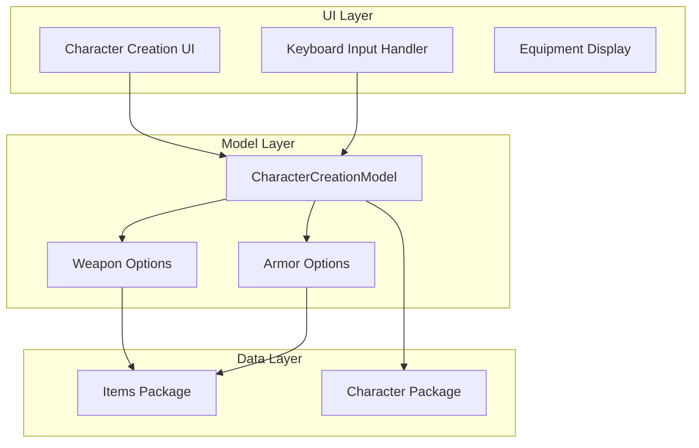
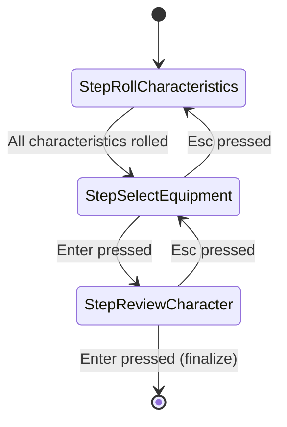
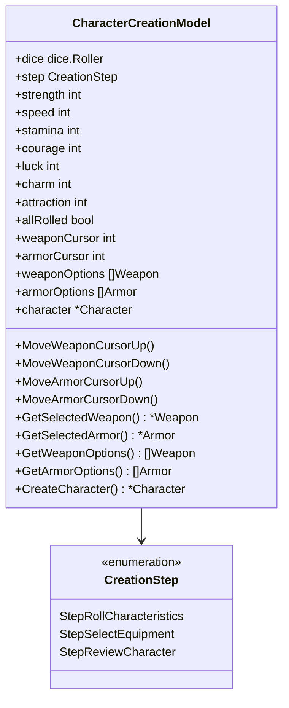
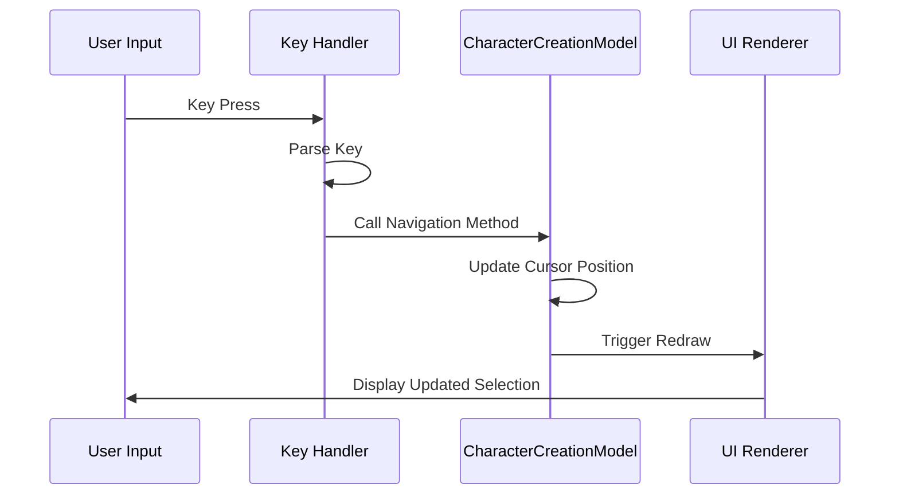
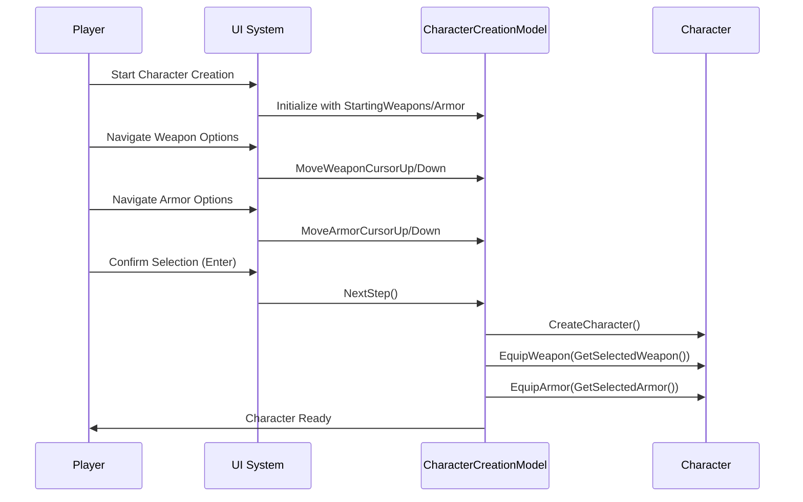

# Equipment Selection

<cite>
**Referenced Files in This Document**
- [internal/items/items.go](file://internal/items/items.go)
- [pkg/ui/character_creation.go](file://pkg/ui/character_creation.go)
- [pkg/ui/model.go](file://pkg/ui/model.go)
- [pkg/ui/update.go](file://pkg/ui/update.go)
- [pkg/ui/view.go](file://pkg/ui/view.go)
- [internal/character/character.go](file://internal/character/character.go)
</cite>

## Table of Contents
1. [Introduction](#introduction)
2. [System Architecture](#system-architecture)
3. [Equipment Selection Phase](#equipment-selection-phase)
4. [Character Creation Model](#character-creation-model)
5. [Weapon Selection System](#weapon-selection-system)
6. [Armor Selection System](#armor-selection-system)
7. [Navigation Controls](#navigation-controls)
8. [Bounds Checking and Safety](#bounds-checking-and-safety)
9. [UI Rendering Implementation](#ui-rendering-implementation)
10. [Character Creation Workflow](#character-creation-workflow)
11. [Common Issues and Solutions](#common-issues-and-solutions)
12. [Advanced Usage Patterns](#advanced-usage-patterns)
13. [Best Practices](#best-practices)

## Introduction

The equipment selection phase is a critical component of character creation in the Saga Demonspawn game, allowing players to choose their starting weapon and armor from predefined options. This system provides intuitive navigation controls and robust state management to ensure a smooth player experience during character development.

The equipment selection occurs during the second step of character creation, immediately following the characteristic rolling phase. Players can navigate through available weapons and armor using keyboard controls, with visual feedback indicating their current selections.

## System Architecture

The equipment selection system follows a layered architecture pattern with clear separation of concerns:



**Diagram sources**
- [pkg/ui/character_creation.go](file://pkg/ui/character_creation.go#L21-L44)
- [internal/items/items.go](file://internal/items/items.go#L1-L257)
- [internal/character/character.go](file://internal/character/character.go#L1-L355)

## Equipment Selection Phase

The equipment selection occurs during the `StepSelectEquipment` phase of character creation, representing the second step in the seven-step character creation process:



**Diagram sources**
- [pkg/ui/character_creation.go](file://pkg/ui/character_creation.go#L10-L19)

**Section sources**
- [pkg/ui/character_creation.go](file://pkg/ui/character_creation.go#L10-L19)

## Character Creation Model

The `CharacterCreationModel` serves as the central state manager for equipment selection, maintaining cursor positions and available options:



**Diagram sources**
- [pkg/ui/character_creation.go](file://pkg/ui/character_creation.go#L21-L44)

### Key Fields Explained

| Field | Type | Purpose |
|-------|------|---------|
| `weaponCursor` | `int` | Tracks current position in weapon selection list |
| `armorCursor` | `int` | Tracks current position in armor selection list |
| `weaponOptions` | `[]items.Weapon` | Available weapons for selection |
| `armorOptions` | `[]items.Armor` | Available armor for selection |

**Section sources**
- [pkg/ui/character_creation.go](file://pkg/ui/character_creation.go#L21-L44)

## Weapon Selection System

### Available Weapons

The system provides three starting weapons through the `StartingWeapons()` function:

| Weapon | Damage Bonus | Description |
|--------|-------------|-------------|
| Sword | 10 | Standard melee weapon |
| Dagger | 5 | Light, concealable |
| Club | 8 | Basic melee weapon |

### Weapon Cursor Management

The weapon selection system maintains cursor position and provides navigation methods:

```mermaid
flowchart TD
Start([Weapon Navigation]) --> CheckDirection{Direction?}
CheckDirection --> |Up| CheckWeaponUp{Cursor > 0?}
CheckDirection --> |Down| CheckWeaponDown{Cursor < len(weapons)-1?}
CheckWeaponUp --> |Yes| MoveUp[Increment Cursor]
CheckWeaponUp --> |No| Stay[Stay at Position]
CheckWeaponDown --> |Yes| MoveDown[Decrement Cursor]
CheckWeaponDown --> |No| Stay
MoveUp --> UpdateSelection[Update Selection]
MoveDown --> UpdateSelection
Stay --> UpdateSelection
UpdateSelection --> End([Navigation Complete])
```

**Diagram sources**
- [pkg/ui/character_creation.go](file://pkg/ui/character_creation.go#L165-L176)

**Section sources**
- [internal/items/items.go](file://internal/items/items.go#L211-L218)
- [pkg/ui/character_creation.go](file://pkg/ui/character_creation.go#L165-L176)

## Armor Selection System

### Available Armor

The system provides two starting armors through the `StartingArmor()` function:

| Armor | Protection | Description |
|-------|-----------|-------------|
| None | 0 | No armor equipped |
| Leather Armor | 5 | Light armor, no movement penalty |

### Armor Cursor Management

The armor selection follows the same navigation pattern as weapons:

```mermaid
flowchart TD
Start([Armor Navigation]) --> CheckDirection{Direction?}
CheckDirection --> |Up| CheckArmorUp{Cursor > 0?}
CheckDirection --> |Down| CheckArmorDown{Cursor < len(armor)-1?}
CheckArmorUp --> |Yes| MoveUp[Increment Cursor]
CheckArmorUp --> |No| Stay[Stay at Position]
CheckArmorDown --> |Yes| MoveDown[Decrement Cursor]
CheckArmorDown --> |No| Stay
MoveUp --> UpdateSelection[Update Selection]
MoveDown --> UpdateSelection
Stay --> UpdateSelection
UpdateSelection --> End([Navigation Complete])
```

**Diagram sources**
- [pkg/ui/character_creation.go](file://pkg/ui/character_creation.go#L178-L189)

**Section sources**
- [internal/items/items.go](file://internal/items/items.go#L230-L236)
- [pkg/ui/character_creation.go](file://pkg/ui/character_creation.go#L178-L189)

## Navigation Controls

### Keyboard Bindings

The equipment selection system responds to the following keyboard inputs:

| Key | Action | Weapon Control | Armor Control |
|-----|--------|---------------|---------------|
| `↑` / `k` | Move Up | Weapon cursor | Armor cursor |
| `↓` / `j` | Move Down | Weapon cursor | Armor cursor |
| `←` / `h` | Move Left | N/A | Armor cursor |
| `→` / `l` | Move Right | N/A | Armor cursor |
| `Enter` | Confirm Selection | Next Step | Next Step |
| `Esc` | Back/Cancel | Previous Step | Previous Step |

### Input Handling Implementation



**Diagram sources**
- [pkg/ui/update.go](file://pkg/ui/update.go#L139-L159)

**Section sources**
- [pkg/ui/update.go](file://pkg/ui/update.go#L139-L159)

## Bounds Checking and Safety

### Weapon Bounds Checking

The weapon navigation methods implement comprehensive bounds checking to prevent array index out of range errors:

```mermaid
flowchart TD
WeaponNav[Weapon Navigation] --> CheckUp{Move Up?}
CheckUp --> |Yes| CheckWeaponZero{Cursor == 0?}
CheckUp --> |No| CheckDown{Move Down?}
CheckWeaponZero --> |Yes| NoMovement[No Movement]
CheckWeaponZero --> |No| DecrementCursor[Cursor--]
CheckDown --> |Yes| CheckWeaponLimit{Cursor >= len(weapons)-1?}
CheckDown --> |No| NoMovement
CheckWeaponLimit --> |Yes| NoMovement
CheckWeaponLimit --> |No| IncrementCursor[Cursor++]
DecrementCursor --> SafeUpdate[Safe Update]
IncrementCursor --> SafeUpdate
NoMovement --> SafeUpdate
```

**Diagram sources**
- [pkg/ui/character_creation.go](file://pkg/ui/character_creation.go#L165-L176)

### Armor Bounds Checking

Similar safety mechanisms protect armor navigation:

```mermaid
flowchart TD
ArmorNav[Armor Navigation] --> CheckUp{Move Up?}
CheckUp --> |Yes| CheckArmorZero{Cursor == 0?}
CheckUp --> |No| CheckDown{Move Down?}
CheckArmorZero --> |Yes| NoMovement[No Movement]
CheckArmorZero --> |No| DecrementCursor[Cursor--]
CheckDown --> |Yes| CheckArmorLimit{Cursor >= len(armor)-1?}
CheckDown --> |No| NoMovement
CheckArmorLimit --> |Yes| NoMovement
CheckArmorLimit --> |No| IncrementCursor[Cursor++]
DecrementCursor --> SafeUpdate[Safe Update]
IncrementCursor --> SafeUpdate
NoMovement --> SafeUpdate
```

**Diagram sources**
- [pkg/ui/character_creation.go](file://pkg/ui/character_creation.go#L178-L189)

### Selection Retrieval Safety

The `GetSelectedWeapon()` and `GetSelectedArmor()` methods include bounds checking to prevent null pointer dereferences:

**Section sources**
- [pkg/ui/character_creation.go](file://pkg/ui/character_creation.go#L193-L206)

## UI Rendering Implementation

### Equipment Display Format

The equipment selection UI presents options in a clean, readable format:

```
  Equipment:
    Weapon: Sword (+10)
    Armor: Leather Armor (-5)
```

### Cursor Highlighting

While the current implementation doesn't visually highlight the selected item, the system maintains cursor position state for programmatic access.

### Dynamic Information Display

The UI dynamically updates to reflect:
- Selected weapon with damage bonus
- Selected armor with protection value
- Total calculated life points
- Navigation instructions

**Section sources**
- [pkg/ui/view.go](file://pkg/ui/view.go#L256-L269)

## Character Creation Workflow

### Complete Equipment Selection Process



**Diagram sources**
- [pkg/ui/character_creation.go](file://pkg/ui/character_creation.go#L229-L257)

### Equipment Application

During character creation, selected equipment is applied through the `CreateCharacter()` method:

**Section sources**
- [pkg/ui/character_creation.go](file://pkg/ui/character_creation.go#L229-L257)
- [internal/character/character.go](file://internal/character/character.go#L258-L266)

## Common Issues and Solutions

### Empty Option Lists

**Problem**: If weapon or armor options become empty, navigation becomes impossible.

**Solution**: The system prevents empty option lists by using predefined functions (`StartingWeapons()`, `StartingArmor()`) that always return valid slices.

### Invalid Cursor States

**Problem**: Cursor positions may become invalid if options change unexpectedly.

**Solution**: Bounds checking in navigation methods ensures cursor remains within valid range. The `GetSelectedWeapon()` and `GetSelectedArmor()` methods also validate cursor position before accessing options.

### Null Pointer Access

**Problem**: Attempting to access weapons or armor when none are selected.

**Solution**: All retrieval methods include null checks and return nil safely when appropriate.

### Keyboard Input Conflicts

**Problem**: Conflicting key bindings with other UI elements.

**Solution**: The equipment selection system operates independently during its step, avoiding conflicts with other screens.

## Advanced Usage Patterns

### Custom Equipment Options

Developers can extend the system by modifying the `StartingWeapons()` and `StartingArmor()` functions to include additional items:

```go
// Example extension pattern
func ExtendedStartingWeapons() []items.Weapon {
    base := StartingWeapons()
    // Add custom weapons
    return append(base, customWeapon)
}
```

### Programmatic Selection

The model exposes methods for programmatic equipment selection:

- `GetSelectedWeapon()` - Retrieve currently selected weapon
- `GetSelectedArmor()` - Retrieve currently selected armor  
- `GetWeaponOptions()` - Access all available weapons
- `GetArmorOptions()` - Access all available armor

### State Persistence

The cursor positions (`weaponCursor`, `armorCursor`) persist throughout the character creation process, allowing players to navigate back and forth between steps without losing their selections.

## Best Practices

### For Beginners

1. **Understand the Navigation**: Use arrow keys for vertical movement (weapons) and horizontal movement (armor)
2. **Confirm Selection**: Press Enter to advance to the review screen after making selections
3. **Go Back**: Press Esc to return to characteristic rolling if needed
4. **Visual Feedback**: The UI displays your current selections clearly

### For Advanced Users

1. **State Management**: Leverage cursor positions for programmatic control
2. **Extensibility**: Modify option functions to customize available equipment
3. **Error Handling**: Implement additional validation for custom equipment systems
4. **Performance**: Consider caching frequently accessed equipment data

### Technical Implementation Guidelines

1. **Bounds Checking**: Always validate cursor positions before accessing arrays
2. **Null Safety**: Handle nil returns from selection methods appropriately
3. **State Consistency**: Ensure cursor positions match available options
4. **User Experience**: Provide clear visual feedback for selections

The equipment selection system provides a robust foundation for character customization while maintaining simplicity for players and extensibility for developers. Its careful attention to bounds checking and state management ensures reliable operation across all scenarios.