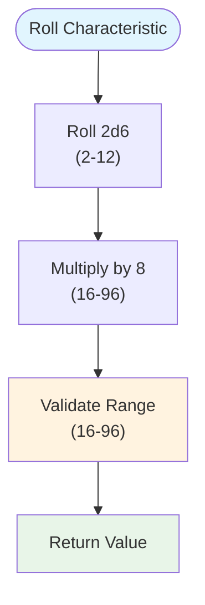
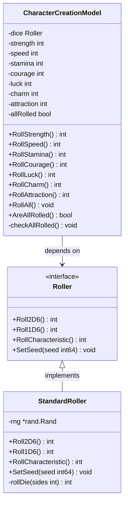
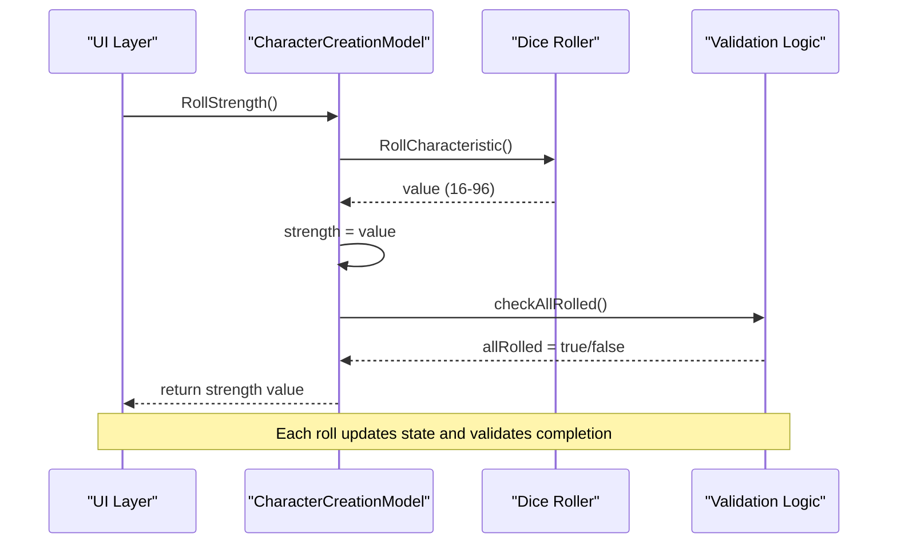
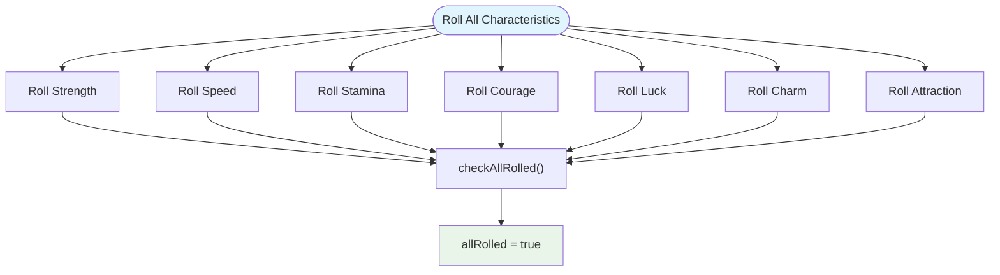
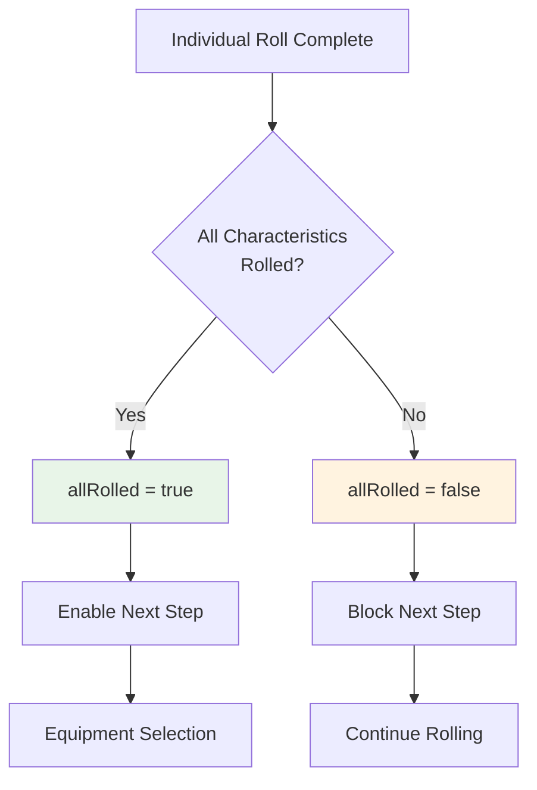
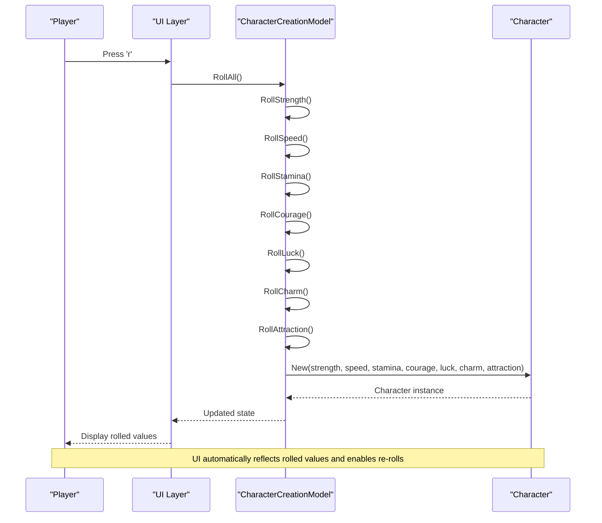
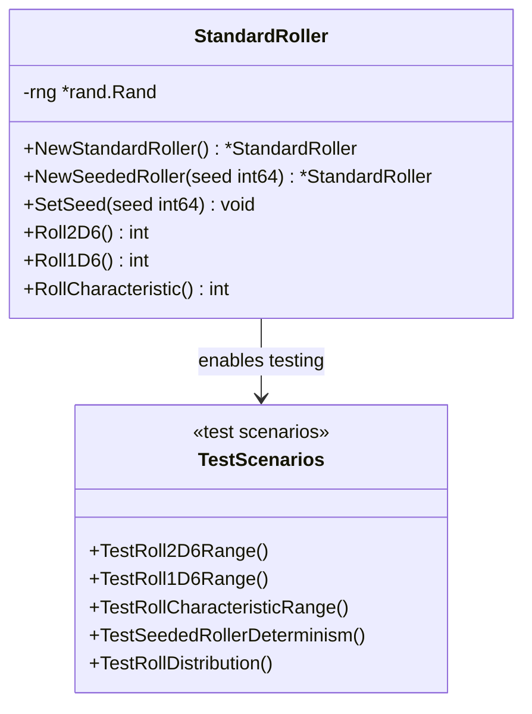

# Stat Rolling

<cite>
**Referenced Files in This Document**
- [internal/dice/dice.go](file://internal/dice/dice.go)
- [internal/dice/dice_test.go](file://internal/dice/dice_test.go)
- [internal/character/character.go](file://internal/character/character.go)
- [pkg/ui/character_creation.go](file://pkg/ui/character_creation.go)
- [pkg/ui/update.go](file://pkg/ui/update.go)
- [internal/items/items.go](file://internal/items/items.go)
</cite>

## Table of Contents
1. [Introduction](#introduction)
2. [Dice Rolling Mechanics](#dice-rolling-mechanics)
3. [Character Creation Model Architecture](#character-creation-model-architecture)
4. [Individual Stat Roll Methods](#individual-stat-roll-methods)
5. [Roll All Characteristics](#roll-all-characteristics)
6. [State Management and Validation](#state-management-and-validation)
7. [UI Integration and User Experience](#ui-integration-and-user-experience)
8. [Testing and Deterministic Behavior](#testing-and-deterministic-behavior)
9. [Common Issues and Solutions](#common-issues-and-solutions)
10. [Advanced Implementation Patterns](#advanced-implementation-patterns)

## Introduction

The stat rolling system in Fire*Wolf implements a classic tabletop RPG mechanic where players roll characteristics for their characters using 2D6 × 8 dice mechanics. This system generates seven core attributes that define a character's abilities and form the foundation for gameplay progression. The implementation follows clean architecture principles with dependency injection, testability, and clear separation of concerns.

The system rolls seven characteristics: Strength (STR), Speed (SPD), Stamina (STA), Courage (CRG), Luck (LCK), Charm (CHM), and Attraction (ATT). Each characteristic is generated by rolling two six-sided dice, adding the results, and multiplying by 8, producing values in the range 16-96 (representing percentage capabilities where 100% is unattainable).

## Dice Rolling Mechanics

### 2D6 × 8 Formula

The core rolling mechanism uses the formula **2d6 × 8**, which produces percentage values for character characteristics. This approach ensures that:

- **Minimum value**: 2 (from rolling two 1s) × 8 = 16
- **Maximum value**: 12 (from rolling two 6s) × 8 = 96
- **Average value**: 7 × 8 = 56
- **Distribution**: Values are multiples of 8, creating a structured progression



**Diagram sources**
- [internal/dice/dice.go](file://internal/dice/dice.go#L59-L63)

### Dice Roller Interface

The system uses a clean interface-based design that enables dependency injection and testability:



**Diagram sources**
- [internal/dice/dice.go](file://internal/dice/dice.go#L11-L27)
- [pkg/ui/character_creation.go](file://pkg/ui/character_creation.go#L22-L44)

**Section sources**
- [internal/dice/dice.go](file://internal/dice/dice.go#L11-L67)
- [CORRECTION.md](file://CORRECTION.md#L1-L35)

## Character Creation Model Architecture

### Dependency Injection Pattern

The CharacterCreationModel demonstrates excellent dependency injection by accepting a dice.Roller interface rather than a concrete implementation. This design enables:

- **Testability**: Mock rollers can be injected for unit testing
- **Flexibility**: Different roller implementations can be used
- **Separation of concerns**: UI logic is decoupled from random number generation

### State Structure

The model maintains separate state for each characteristic and overall completion status:

| Field | Type | Purpose | Initial Value |
|-------|------|---------|---------------|
| strength | int | Physical power characteristic | 0 |
| speed | int | Agility and reaction characteristic | 0 |
| stamina | int | Endurance characteristic | 0 |
| courage | int | Bravery characteristic | 0 |
| luck | int | Fortune characteristic | 0 |
| charm | int | Charisma characteristic | 0 |
| attraction | int | Personal magnetism characteristic | 0 |
| allRolled | bool | Completion flag for validation | false |

**Section sources**
- [pkg/ui/character_creation.go](file://pkg/ui/character_creation.go#L22-L44)

## Individual Stat Roll Methods

### Method Implementation Pattern

Each characteristic has a dedicated roll method following the same pattern:



**Diagram sources**
- [pkg/ui/character_creation.go](file://pkg/ui/character_creation.go#L72-L76)
- [pkg/ui/character_creation.go](file://pkg/ui/character_creation.go#L132-L136)

### Roll Method Functions

Each individual roll method follows this structure:

1. **Call dice interface**: `m.dice.RollCharacteristic()`
2. **Update model state**: `m.strength = rollValue`
3. **Validate completion**: `m.checkAllRolled()`
4. **Return value**: `return m.strength`

The methods are symmetric for all characteristics:
- **RollStrength()**: Updates strength characteristic
- **RollSpeed()**: Updates speed characteristic  
- **RollStamina()**: Updates stamina characteristic
- **RollCourage()**: Updates courage characteristic
- **RollLuck()**: Updates luck characteristic
- **RollCharm()**: Updates charm characteristic
- **RollAttraction()**: Updates attraction characteristic

**Section sources**
- [pkg/ui/character_creation.go](file://pkg/ui/character_creation.go#L72-L118)

## Roll All Characteristics

### Batch Operation

The `RollAll()` method provides a convenient way to roll all characteristics simultaneously:



**Diagram sources**
- [pkg/ui/character_creation.go](file://pkg/ui/character_creation.go#L121-L130)

### Implementation Details

The RollAll() method calls each individual roll method in sequence, ensuring that the completion validation occurs after all characteristics are rolled. This approach maintains the same validation logic as individual rolls while providing convenience for users.

**Section sources**
- [pkg/ui/character_creation.go](file://pkg/ui/character_creation.go#L121-L130)

## State Management and Validation

### Completion Tracking

The system uses a sophisticated completion tracking mechanism to prevent progression until all characteristics are rolled:



**Diagram sources**
- [pkg/ui/character_creation.go](file://pkg/ui/character_creation.go#L132-L136)

### Validation Logic

The `checkAllRolled()` method performs a logical AND operation across all characteristic fields:

```go
m.allRolled = m.strength > 0 && m.speed > 0 && m.stamina > 0 &&
    m.courage > 0 && m.luck > 0 && m.charm > 0 && m.attraction > 0
```

This ensures that progression to the next character creation step is blocked until all characteristics have valid values.

**Section sources**
- [pkg/ui/character_creation.go](file://pkg/ui/character_creation.go#L132-L136)

## UI Integration and User Experience

### Keyboard Controls

The character creation UI provides intuitive keyboard controls for stat rolling:

| Key | Action | Description |
|-----|--------|-------------|
| `r` | Roll All | Rolls all characteristics simultaneously |
| `enter` | Next Step | Proceeds to equipment selection (when all rolled) |
| `esc`/`q` | Cancel | Returns to main menu |

### State Reflection in UI

The UI continuously displays current characteristic values and completion status:



**Diagram sources**
- [pkg/ui/update.go](file://pkg/ui/update.go#L122-L132)
- [pkg/ui/character_creation.go](file://pkg/ui/character_creation.go#L230-L257)

### Equipment Selection Integration

After rolling characteristics, the system transitions to equipment selection where players choose starting weapons and armor:

- **Weapons**: Sword, Dagger, Club (basic starting options)
- **Armor**: None, Leather Armor (basic starting options)
- **Navigation**: Arrow keys for selection, Enter to confirm

**Section sources**
- [pkg/ui/update.go](file://pkg/ui/update.go#L122-L132)
- [internal/items/items.go](file://internal/items/items.go#L211-L236)

## Testing and Deterministic Behavior

### Seeded Rollers for Testing

The dice package provides deterministic behavior through seeded rollers, essential for reliable unit testing:



**Diagram sources**
- [internal/dice/dice.go](file://internal/dice/dice.go#L34-L47)
- [internal/dice/dice_test.go](file://internal/dice/dice_test.go#L1-L151)

### Test Coverage

The dice package includes comprehensive tests covering:

- **Range validation**: Ensures rolls fall within expected bounds
- **Determinism**: Verifies seeded rollers produce consistent results
- **Distribution**: Confirms reasonable statistical distribution
- **Interface compliance**: Validates all Roller interface methods

**Section sources**
- [internal/dice/dice_test.go](file://internal/dice/dice_test.go#L1-L151)
- [internal/dice/dice.go](file://internal/dice/dice.go#L34-L47)

## Common Issues and Solutions

### Incomplete Rolls Prevention

The most common issue occurs when players attempt to proceed without rolling all characteristics:

**Problem**: Players press "Enter" to advance before rolling all characteristics
**Solution**: The system blocks progression until `AreAllRolled()` returns true
**Implementation**: The UI checks `m.CharCreation.AreAllRolled()` before allowing step advancement

### State Synchronization Issues

**Problem**: UI displays stale values after re-rolls
**Solution**: Each roll method immediately updates model state and triggers validation
**Implementation**: Every roll method calls `checkAllRolled()` to maintain consistency

### Character Creation Reset

**Problem**: Accidental state corruption during character creation
**Solution**: The Reset() method clears all state and returns to initial conditions
**Implementation**: Resets all characteristic values, completion flags, and cursor positions

**Section sources**
- [pkg/ui/character_creation.go](file://pkg/ui/character_creation.go#L264-L278)
- [pkg/ui/update.go](file://pkg/ui/update.go#L128-L131)

## Advanced Implementation Patterns

### Interface-Based Design Benefits

The dice.Roller interface enables several advanced patterns:

1. **Mock Objects**: Test doubles can simulate specific roll outcomes
2. **Alternative Generators**: Cryptographically secure RNGs can be substituted
3. **Logging Roll Results**: Decorator pattern can wrap rollers for audit trails
4. **Replay Systems**: Seed-based rollers enable replay of specific game sessions

### State Mutation Patterns

The CharacterCreationModel demonstrates clean state mutation patterns:

- **Immutability**: Character instances are immutable after creation
- **Atomic Updates**: Each roll operation is atomic and self-contained
- **Validation**: State changes are validated immediately
- **Undo Capability**: Reset method provides clean rollback capability

### Error Handling Strategy

The system implements robust error handling:

- **Input Validation**: Characteristic values are validated against reasonable bounds
- **Graceful Degradation**: Invalid rolls don't crash the application
- **User Feedback**: Clear error messages guide users toward valid actions

**Section sources**
- [internal/character/character.go](file://internal/character/character.go#L101-L111)
- [internal/character/character.go](file://internal/character/character.go#L46-L98)

## Conclusion

The stat rolling system in Fire*Wolf exemplifies clean architecture principles with excellent separation of concerns, testability, and user experience. The 2D6 × 8 mechanics provide a balanced and familiar RPG experience while the interface-based design ensures maintainability and extensibility. The comprehensive validation and error handling create a robust system that gracefully handles user input while maintaining game balance and progression.

The integration with the equipment selection phase demonstrates how the rolling system serves as a foundation for subsequent gameplay mechanics, creating a cohesive character creation experience that prepares players for their adventures in the Fire*Wolf world.