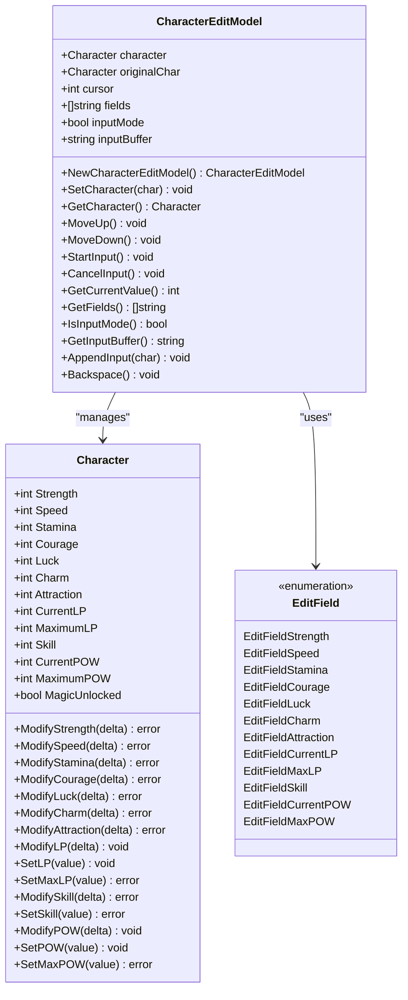
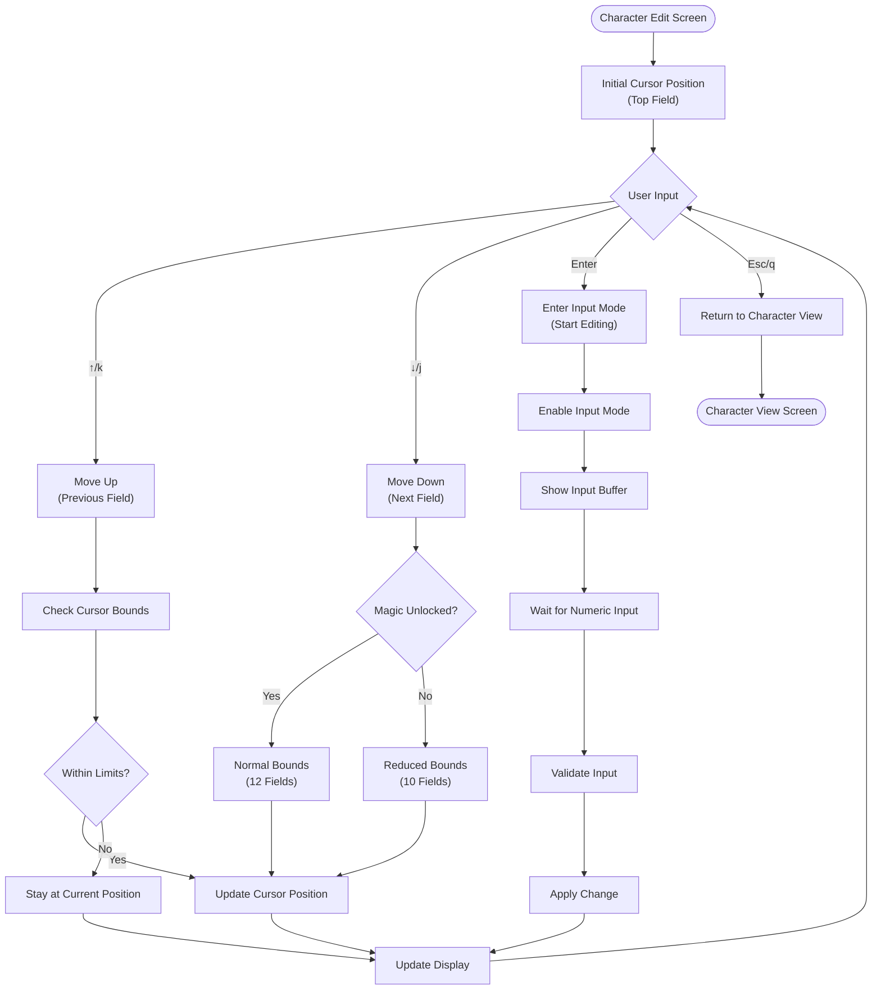
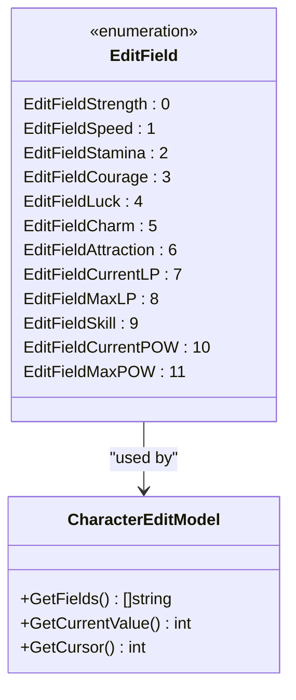
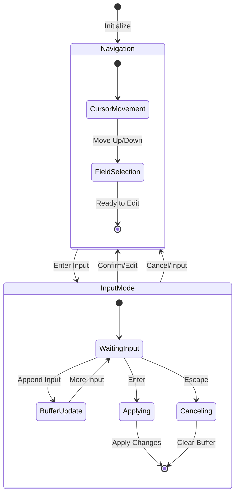
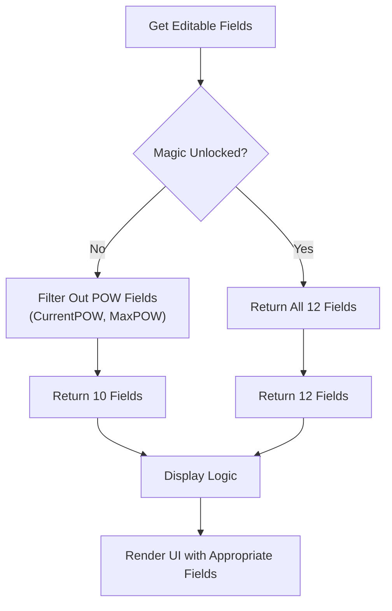
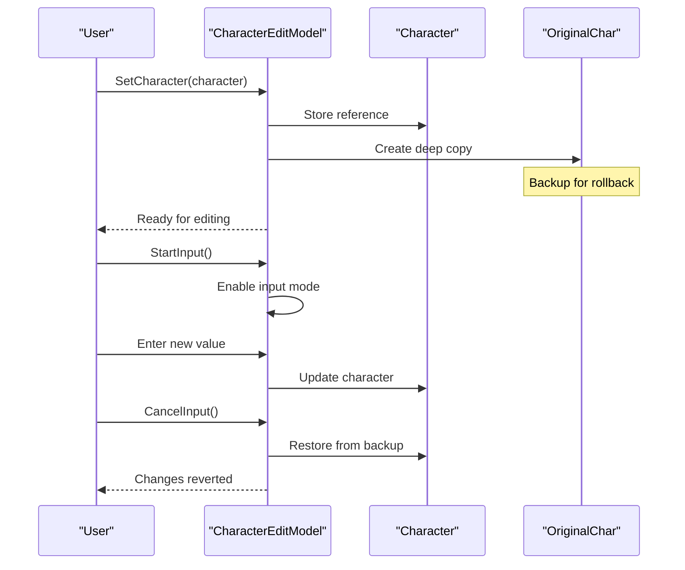
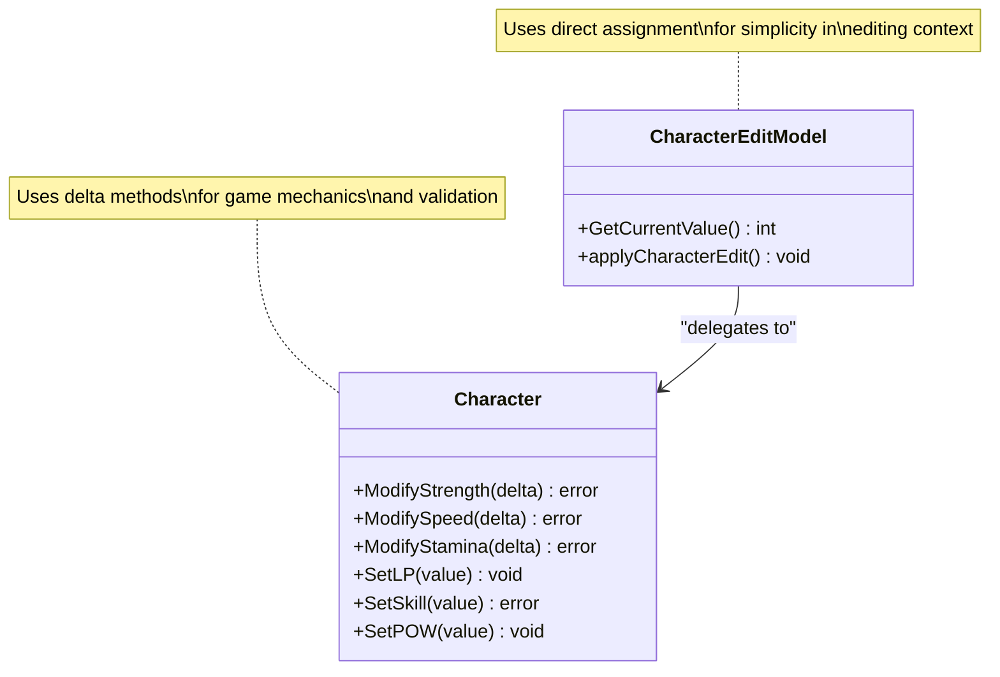

# Character Editing

<cite>
**Referenced Files in This Document**
- [character_edit.go](file://pkg/ui/character_edit.go)
- [character.go](file://internal/character/character.go)
- [model.go](file://pkg/ui/model.go)
- [update.go](file://pkg/ui/update.go)
- [view.go](file://pkg/ui/view.go)
- [BUGFIX_CHARACTER_EDIT.md](file://BUGFIX_CHARACTER_EDIT.md)
- [README.md](file://README.md)
</cite>

## Table of Contents
1. [Introduction](#introduction)
2. [CharacterEditModel Architecture](#charactereditmodel-architecture)
3. [Interactive Editing Process](#interactive-editing-process)
4. [Field Management System](#field-management-system)
5. [Input Handling and State Management](#input-handling-and-state-management)
6. [Conditional Display Logic](#conditional-display-logic)
7. [Practical Editing Workflows](#practical-editing-workflows)
8. [Error Handling and Validation](#error-handling-and-validation)
9. [Backup and Rollback Mechanism](#backup-and-rollback-mechanism)
10. [Integration with Core Character Model](#integration-with-core-character-model)
11. [Common Issues and Solutions](#common-issues-and-solutions)
12. [Best Practices](#best-practices)

## Introduction

The character editing functionality in the saga-demonspawn application provides an interactive terminal-based interface for modifying character statistics in the "Sagas of the Demonspawn" gamebook. Built using the Bubble Tea framework, this system enables players to navigate through character attributes, enter input mode for modifications, and apply changes with proper validation and rollback capabilities.

The editing system supports all core character statistics including physical attributes (Strength, Speed, Stamina), personality traits (Courage, Luck, Charm, Attraction), derived values (Current LP, Maximum LP, Skill), and magical abilities (Current POW, Maximum POW). The interface adapts dynamically based on the character's progression through the game, hiding unavailable fields when magic is not yet unlocked.

## CharacterEditModel Architecture

The `CharacterEditModel` struct serves as the central component managing the character editing state and interactions. It encapsulates all necessary data and provides methods for handling user input and state transitions.

**Diagram sources**
- [character_edit.go](file://pkg/ui/character_edit.go#L24-L31)
- [character.go](file://internal/character/character.go#L14-L43)

**Section sources**
- [character_edit.go](file://pkg/ui/character_edit.go#L24-L31)
- [character.go](file://internal/character/character.go#L14-L43)

## Interactive Editing Process

The character editing interface follows a structured workflow that guides users through navigation, modification, and confirmation steps. The process is designed to be intuitive for beginners while providing advanced control mechanisms for experienced users.

### Navigation Workflow

The cursor-based navigation system allows users to move through character fields using arrow keys or vim-style navigation:

**Diagram sources**
- [update.go](file://pkg/ui/update.go#L234-L252)
- [character_edit.go](file://pkg/ui/character_edit.go#L70-L88)

### Input Mode Activation

Entering input mode transforms the interface to accept numeric input for the selected field. The system provides immediate visual feedback showing the current input buffer and accepts various input methods:

- **Numeric Input**: Direct digit entry for positive values
- **Negative Values**: Support for negative numbers using the minus sign
- **Backspace**: Character deletion for correcting mistakes
- **Confirmation**: Enter key to apply changes
- **Cancellation**: Escape key to abort editing

**Section sources**
- [update.go](file://pkg/ui/update.go#L234-L277)
- [character_edit.go](file://pkg/ui/character_edit.go#L109-L136)

## Field Management System

The character editing system organizes fields into logical categories and provides dynamic visibility based on game progression. The field enumeration ensures consistent indexing and easy mapping between UI display and underlying character data.

### Field Categories

The editable fields are organized into distinct categories reflecting the game's mechanics:

| Category | Fields | Description |
|----------|--------|-------------|
| **Physical Attributes** | Strength, Speed, Stamina | Core physical characteristics affecting combat and movement |
| **Personality Traits** | Courage, Luck, Charm, Attraction | Personality-based modifiers influencing social interactions |
| **Derived Values** | Current LP, Maximum LP, Skill | Calculated values based on base attributes |
| **Magical Abilities** | Current POW, Maximum POW | Magic system attributes (hidden until unlocked) |

### Field Enumeration System

The `EditField` enumeration provides type-safe field identification and ensures proper synchronization between UI display and character model updates:

**Diagram sources**
- [character_edit.go](file://pkg/ui/character_edit.go#L5-L21)
- [character_edit.go](file://pkg/ui/character_edit.go#L39-L52)

**Section sources**
- [character_edit.go](file://pkg/ui/character_edit.go#L5-L21)
- [character_edit.go](file://pkg/ui/character_edit.go#L39-L52)

## Input Handling and State Management

The input handling system manages the transition between navigation and editing modes, maintaining state consistency and providing robust error handling for user input.

### State Transitions

The model maintains several key state variables that control the editing behavior:

**Diagram sources**
- [character_edit.go](file://pkg/ui/character_edit.go#L29-L30)
- [update.go](file://pkg/ui/update.go#L236-L277)

### Input Validation and Processing

The system implements comprehensive input validation to ensure data integrity:

- **Numeric Validation**: Only digits and optional minus sign allowed
- **Empty Input Handling**: Graceful handling of empty input buffers
- **Parsing Errors**: Proper error reporting for malformed input
- **Boundary Checking**: Validation against reasonable value ranges

**Section sources**
- [update.go](file://pkg/ui/update.go#L255-L277)
- [update.go](file://pkg/ui/update.go#L280-L328)

## Conditional Display Logic

The character editing interface implements sophisticated conditional display logic that adapts to the character's current state and game progression. This ensures that players only see relevant fields based on their current capabilities.

### Magic System Integration

The most prominent conditional display feature hides magical ability fields until the character unlocks the magic system:

**Diagram sources**
- [character_edit.go](file://pkg/ui/character_edit.go#L95-L102)
- [character_edit.go](file://pkg/ui/character_edit.go#L79-L88)

### Dynamic Boundary Calculation

The system calculates cursor boundaries dynamically based on field visibility:

- **Full Character**: 12 editable fields when magic is unlocked
- **Limited Character**: 10 editable fields when magic is locked
- **Boundary Enforcement**: Prevents cursor movement beyond available fields
- **Real-time Updates**: Immediate recalculation when magic status changes

**Section sources**
- [character_edit.go](file://pkg/ui/character_edit.go#L79-L88)
- [character_edit.go](file://pkg/ui/character_edit.go#L95-L102)

## Practical Editing Workflows

The character editing system supports various practical workflows that accommodate different player preferences and editing scenarios.

### Basic Stat Modification

The most common workflow involves selecting a field, entering a new value, and confirming the change:

1. **Navigation**: Use arrow keys to select the desired field
2. **Activation**: Press Enter to enter input mode
3. **Editing**: Type the new value using numeric keypad
4. **Confirmation**: Press Enter to apply changes or Escape to cancel
5. **Verification**: Review the updated character sheet

### Bulk Stat Adjustments

For players who prefer bulk modifications, the system supports sequential editing:

1. **Initial Setup**: Load character with baseline stats
2. **Sequential Editing**: Navigate through fields in order
3. **Batch Confirmation**: Apply changes immediately after each edit
4. **Final Review**: Verify all changes before exiting

### Emergency Stat Adjustments

The system provides quick access for emergency stat adjustments:

1. **Quick Access**: Navigate directly to critical fields (HP, POW)
2. **Immediate Application**: Apply changes without intermediate confirmation
3. **Safety Checks**: Automatic validation prevents invalid values

**Section sources**
- [update.go](file://pkg/ui/update.go#L234-L277)
- [view.go](file://pkg/ui/view.go#L337-L404)

## Error Handling and Validation

The character editing system implements comprehensive error handling to maintain data integrity and provide meaningful feedback to users.

### Input Validation Mechanisms

Multiple layers of validation ensure input correctness:

- **Format Validation**: Numeric parsing with error detection
- **Range Validation**: Bounds checking for reasonable values
- **Type Safety**: Strong typing for field identification
- **State Consistency**: Validation of cursor positions and modes

### Error Recovery Strategies

The system provides graceful error recovery for various failure scenarios:

- **Invalid Input**: Clear error message and return to previous state
- **Boundary Violations**: Automatic correction to valid range
- **System Errors**: Comprehensive error reporting with context
- **Data Corruption**: Fallback to backup state when possible

### User Feedback Systems

Clear visual and textual feedback helps users understand system state:

- **Visual Indicators**: Cursor highlighting and input mode markers
- **Status Messages**: Real-time feedback on actions and errors
- **Help Text**: Contextual assistance for navigation and editing
- **Confirmation Prompts**: Clear indication of pending actions

**Section sources**
- [update.go](file://pkg/ui/update.go#L280-L328)
- [BUGFIX_CHARACTER_EDIT.md](file://BUGFIX_CHARACTER_EDIT.md#L1-L122)

## Backup and Rollback Mechanism

The character editing system implements a robust backup mechanism that allows users to revert changes if modifications prove unsatisfactory.

### Original Character Backup

Upon initialization, the system creates a deep copy of the character state for rollback purposes:

**Diagram sources**
- [character_edit.go](file://pkg/ui/character_edit.go#L58-L62)
- [update.go](file://pkg/ui/update.go#L256-L264)

### Rollback Implementation

The rollback mechanism operates through the cancellation system:

- **Automatic Backup**: Created when character is loaded
- **State Preservation**: Complete character state maintained
- **Instant Reversion**: Immediate restoration upon cancellation
- **Memory Efficiency**: Minimal memory overhead for backup storage

**Section sources**
- [character_edit.go](file://pkg/ui/character_edit.go#L58-L62)
- [update.go](file://pkg/ui/update.go#L256-L264)

## Integration with Core Character Model

The character editing system seamlessly integrates with the core character model, ensuring data consistency and leveraging existing validation logic.

### Method Synchronization

The editing system coordinates with character methods to maintain consistency:

**Diagram sources**
- [character_edit.go](file://pkg/ui/character_edit.go#L138-L172)
- [character.go](file://internal/character/character.go#L113-L256)

### Data Flow Architecture

The system maintains clear separation of concerns while ensuring data integrity:

- **Input Layer**: User interaction and input validation
- **Processing Layer**: State management and business logic
- **Persistence Layer**: Character model operations and validation
- **Presentation Layer**: UI rendering and user feedback

**Section sources**
- [character_edit.go](file://pkg/ui/character_edit.go#L138-L172)
- [character.go](file://internal/character/character.go#L113-L256)
- [update.go](file://pkg/ui/update.go#L280-L328)

## Common Issues and Solutions

The character editing system has addressed several common issues through careful design and implementation.

### Display Bug Resolution

The most significant issue was a display bug where all fields showed the same value as the currently selected field. This was caused by incorrect value retrieval logic in the view function.

**Problem**: The buggy code retrieved the cursor value for all fields, causing identical display across all entries.

**Solution**: The fixed implementation retrieves the correct value for each field independently, ensuring accurate display of all character statistics.

**Section sources**
- [BUGFIX_CHARACTER_EDIT.md](file://BUGFIX_CHARACTER_EDIT.md#L1-L122)
- [view.go](file://pkg/ui/view.go#L337-L404)

### Input Mode Conflicts

The system handles conflicts between navigation and input modes through careful state management:

- **Mode Isolation**: Navigation and input modes operate independently
- **Event Routing**: Keyboard events routed appropriately based on mode
- **Visual Feedback**: Clear indication of current mode and cursor position
- **State Validation**: Ensures consistent state transitions

### Boundary Condition Handling

The system gracefully handles edge cases and boundary conditions:

- **Empty Input**: Graceful handling of empty input buffers
- **Invalid Characters**: Ignoring non-numeric input outside input mode
- **Overflow Prevention**: Bounds checking for reasonable value ranges
- **Underflow Protection**: Prevention of negative values where inappropriate

**Section sources**
- [update.go](file://pkg/ui/update.go#L255-L277)
- [character_edit.go](file://pkg/ui/character_edit.go#L127-L136)

## Best Practices

The character editing system demonstrates several best practices for building robust terminal applications with the Bubble Tea framework.

### State Management Patterns

The system employs clean state management patterns:

- **Immutable Updates**: State changes through explicit methods
- **Clear Separation**: Distinct responsibilities for different components
- **Consistent APIs**: Uniform method signatures across the system
- **Error Propagation**: Proper error handling and reporting

### User Experience Design

The interface prioritizes usability and accessibility:

- **Intuitive Navigation**: Familiar keyboard shortcuts and visual cues
- **Immediate Feedback**: Real-time updates and clear status indicators
- **Flexible Input**: Support for various input methods and corrections
- **Graceful Degradation**: Meaningful behavior even with invalid input

### Code Organization Principles

The system demonstrates good code organization:

- **Single Responsibility**: Each method has a clear, focused purpose
- **Type Safety**: Strong typing prevents common programming errors
- **Documentation**: Comprehensive comments and clear naming conventions
- **Testability**: Modular design facilitates testing and maintenance

### Performance Considerations

The system optimizes for responsive user interaction:

- **Efficient Rendering**: Minimal re-rendering when possible
- **Lazy Evaluation**: Computation deferred until needed
- **Memory Management**: Efficient use of resources for state storage
- **Input Processing**: Fast response to user keystrokes

**Section sources**
- [character_edit.go](file://pkg/ui/character_edit.go#L1-L173)
- [update.go](file://pkg/ui/update.go#L1-L329)
- [view.go](file://pkg/ui/view.go#L337-L404)