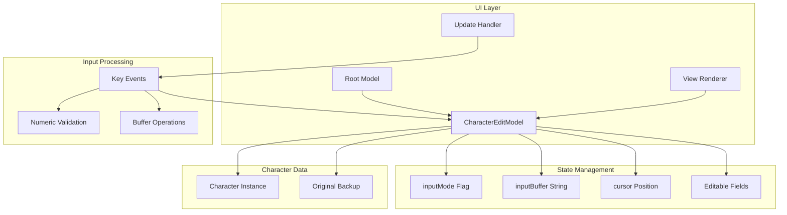
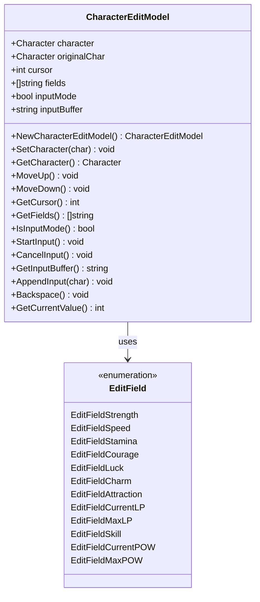
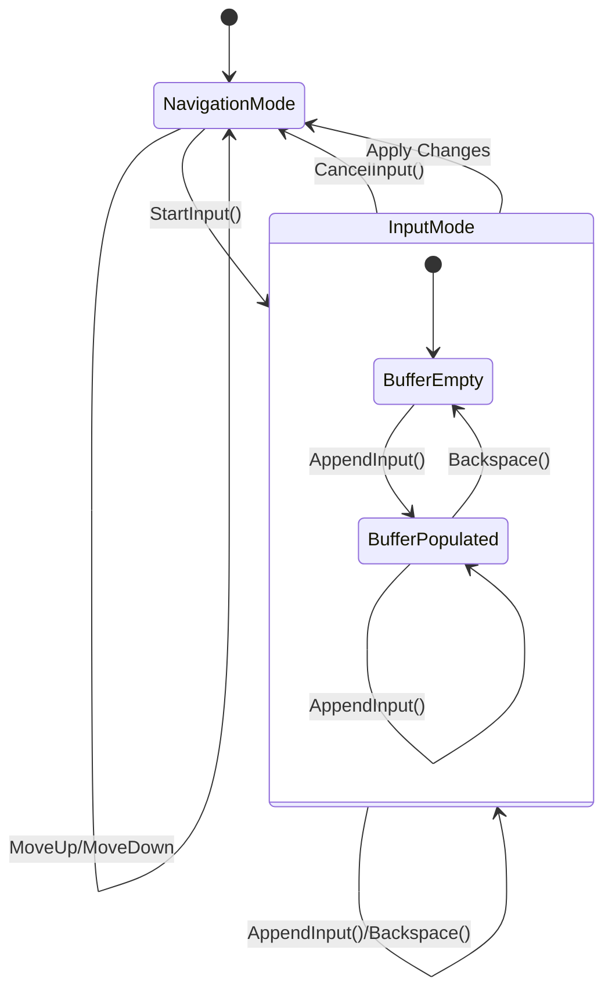
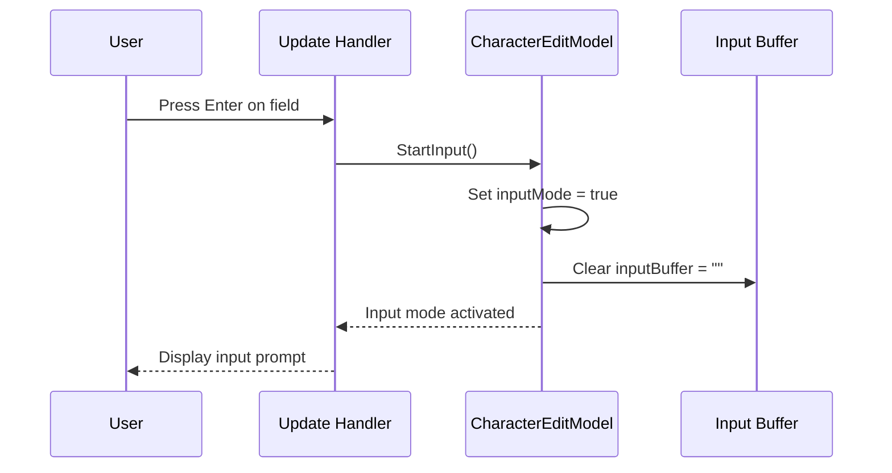
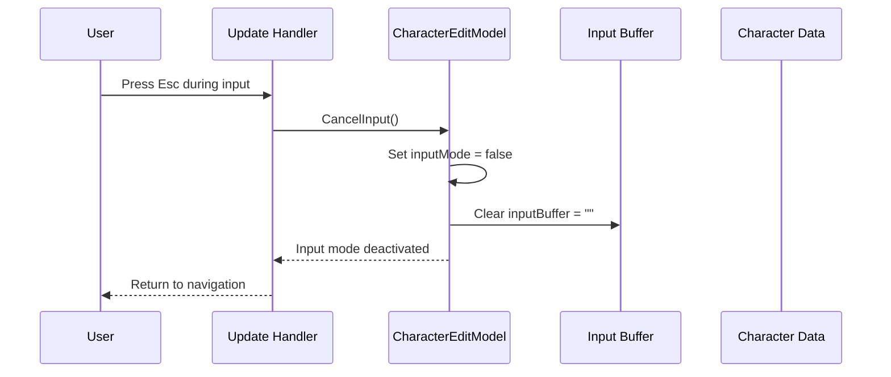
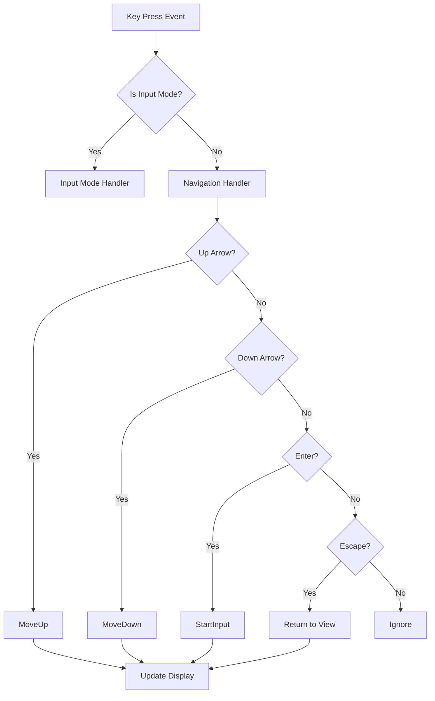
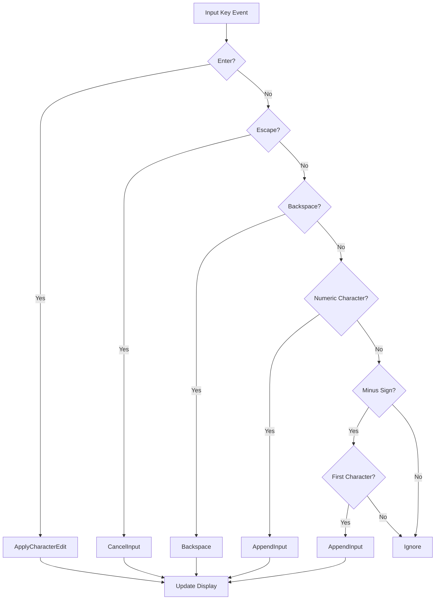
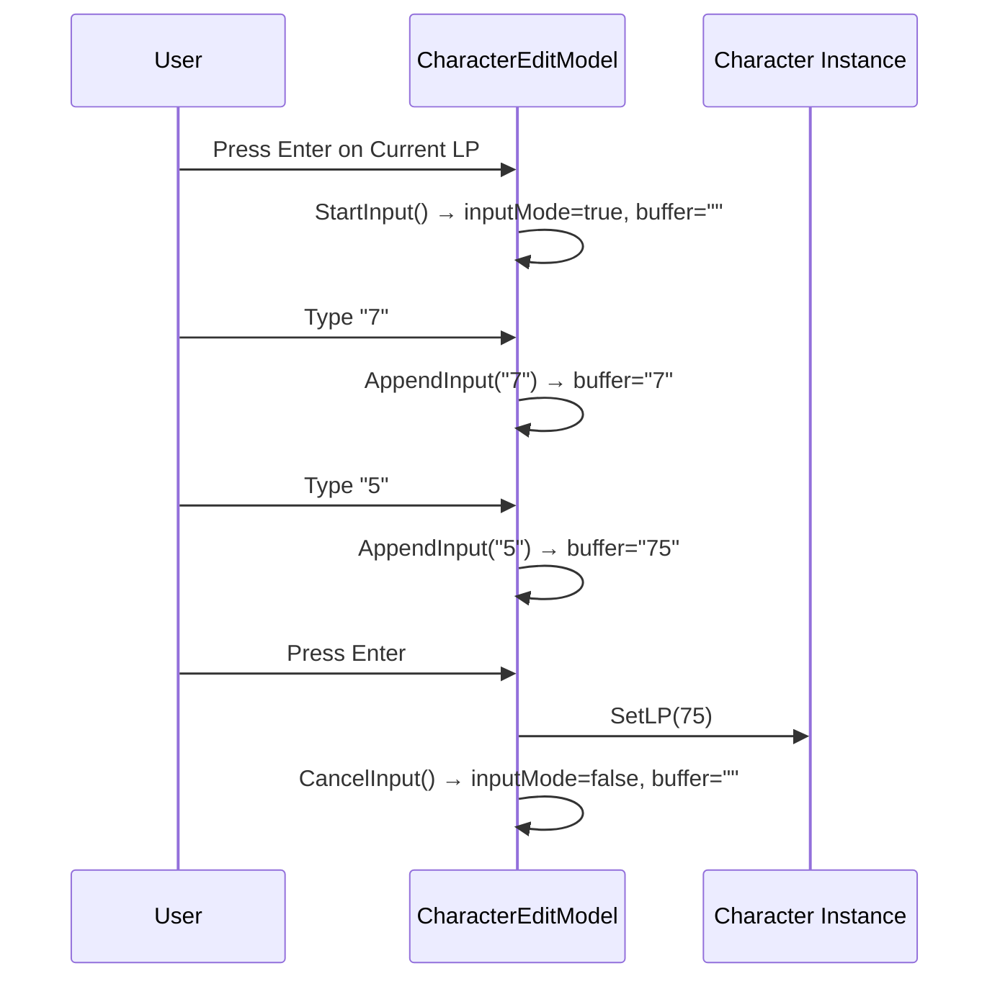
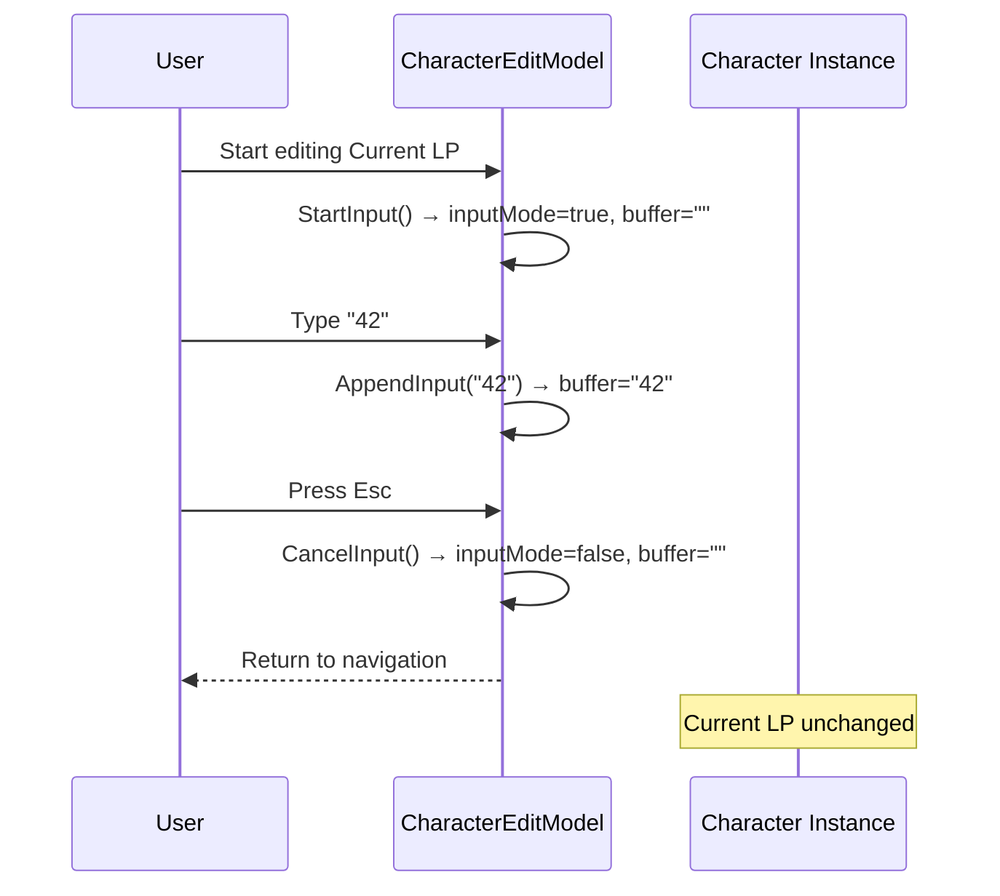

# Input Mode Management

<cite>
**Referenced Files in This Document**
- [character_edit.go](file://pkg/ui/character_edit.go)
- [model.go](file://pkg/ui/model.go)
- [update.go](file://pkg/ui/update.go)
- [view.go](file://pkg/ui/view.go)
- [BUGFIX_CHARACTER_EDIT.md](file://BUGFIX_CHARACTER_EDIT.md)
</cite>

## Table of Contents
1. [Introduction](#introduction)
2. [System Architecture](#system-architecture)
3. [Core Components](#core-components)
4. [Input Mode Lifecycle](#input-mode-lifecycle)
5. [State Management](#state-management)
6. [Key Input Handling](#key-input-handling)
7. [Practical Examples](#practical-examples)
8. [Common Issues and Solutions](#common-issues-and-solutions)
9. [Performance Considerations](#performance-considerations)
10. [Troubleshooting Guide](#troubleshooting-guide)

## Introduction

The input mode management system in the character editor provides a robust framework for handling numeric input during character stat editing. This system enables users to navigate between different character attributes, enter new values, and safely cancel edits while maintaining data integrity. The implementation follows the Bubble Tea architecture pattern, utilizing state machines and event-driven input handling to create an intuitive editing experience.

The system manages two primary states: navigation mode for browsing character attributes and input mode for typing new values. It maintains separate buffers for user input and provides mechanisms for undoing changes, validating input, and handling edge cases like empty buffers and invalid characters.

## System Architecture

The input mode management system is built around several interconnected components that work together to provide seamless character editing functionality.



**Diagram sources**
- [model.go](file://pkg/ui/model.go#L33-L95)
- [character_edit.go](file://pkg/ui/character_edit.go#L23-L31)
- [update.go](file://pkg/ui/update.go#L234-L289)

## Core Components

### CharacterEditModel Structure

The `CharacterEditModel` serves as the central hub for input mode management, encapsulating all state-related functionality within a cohesive structure.



**Diagram sources**
- [character_edit.go](file://pkg/ui/character_edit.go#L23-L31)
- [character_edit.go](file://pkg/ui/character_edit.go#L6-L22)

### State Variables

The system maintains four critical state variables that control input behavior:

| Variable | Type | Purpose | Initial Value |
|----------|------|---------|---------------|
| `inputMode` | `bool` | Tracks whether editing is active | `false` |
| `inputBuffer` | `string` | Stores user's current input | `""` |
| `cursor` | `int` | Current field selection position | `0` |
| `fields` | `[]string` | List of editable field names | Predefined constants |

**Section sources**
- [character_edit.go](file://pkg/ui/character_edit.go#L23-L31)

## Input Mode Lifecycle

The input mode lifecycle consists of distinct phases that manage the transition between navigation and editing states, ensuring data integrity and user experience consistency.



**Diagram sources**
- [character_edit.go](file://pkg/ui/character_edit.go#L108-L136)
- [update.go](file://pkg/ui/update.go#L234-L289)

### Transition Triggers

The system responds to various triggers to initiate state transitions:

1. **Navigation to Input Mode**: Activated by pressing `Enter` on a field
2. **Input to Navigation Mode**: Triggered by `Enter` (apply) or `Esc` (cancel)
3. **Buffer Modification**: Occurs through `AppendInput()` and `Backspace()` operations
4. **Cursor Movement**: Allows navigation without exiting input mode

**Section sources**
- [update.go](file://pkg/ui/update.go#L234-L289)

## State Management

### StartInput() Method

The `StartInput()` method initiates the editing process by activating input mode and clearing the input buffer.



**Diagram sources**
- [character_edit.go](file://pkg/ui/character_edit.go#L109-L113)
- [update.go](file://pkg/ui/update.go#L246)

### CancelInput() Method

The `CancelInput()` method safely exits input mode without applying changes, restoring the original state.



**Diagram sources**
- [character_edit.go](file://pkg/ui/character_edit.go#L115-L119)
- [update.go](file://pkg/ui/update.go#L260)

### InputBuffer Management

The input buffer provides temporary storage for user input with automatic boundary checking and validation capabilities.

**Section sources**
- [character_edit.go](file://pkg/ui/character_edit.go#L126-L136)

## Key Input Handling

### Navigation Mode Input Processing

During navigation mode, the system processes directional movement and activation commands.



**Diagram sources**
- [update.go](file://pkg/ui/update.go#L234-L248)

### Input Mode Input Processing

During input mode, the system handles numeric input, control characters, and validation logic.



**Diagram sources**
- [update.go](file://pkg/ui/update.go#L250-L289)

**Section sources**
- [update.go](file://pkg/ui/update.go#L250-L289)

## Practical Examples

### Example 1: Entering a New Value for Current LP

This example demonstrates the complete workflow for editing the Current LP field:

1. **Initial State**: Navigation mode with cursor on "Current LP" field
2. **Activation**: User presses `Enter`, triggering `StartInput()`
3. **Input Collection**: User types "75" using numeric keys
4. **Validation**: System accepts numeric input and stores in buffer
5. **Application**: User presses `Enter` to apply changes
6. **Result**: Character's Current LP becomes 75



**Diagram sources**
- [update.go](file://pkg/ui/update.go#L246)
- [update.go](file://pkg/ui/update.go#L286-L328)

### Example 2: Canceling an Edit Session

This example shows how to abort an editing session and restore the original value:

1. **Editing State**: User has started editing Current LP with buffer containing "42"
2. **Cancellation**: User presses `Esc` during input
3. **Restoration**: System clears buffer and returns to navigation mode
4. **Verification**: Original value remains unchanged



**Diagram sources**
- [update.go](file://pkg/ui/update.go#L260)

### Example 3: Handling Non-Numeric Input

The system gracefully handles invalid input attempts:

1. **Invalid Input**: User tries to enter "abc" during editing
2. **Filtering**: System ignores alphabetic characters
3. **Feedback**: Display continues to show current buffer state
4. **Correction**: User can backspace and re-enter valid digits

**Section sources**
- [update.go](file://pkg/ui/update.go#L265-L275)

## Common Issues and Solutions

### Issue 1: Empty Buffer Handling

**Problem**: Attempting to apply changes when the input buffer is empty.

**Solution**: The `applyCharacterEdit()` function includes explicit null-checking:

```go
buffer := m.CharEdit.GetInputBuffer()
if buffer == "" {
    return  // Skip empty input
}
```

**Section sources**
- [update.go](file://pkg/ui/update.go#L286-L289)

### Issue 2: Buffer Overflow Considerations

**Problem**: Potential for excessive input length causing display issues.

**Solution**: The current implementation uses Go's native string handling, which automatically manages memory allocation. However, practical limits are imposed by terminal width and user patience.

### Issue 3: Negative Number Support

**Problem**: Need to support negative values for certain attributes.

**Solution**: The system allows minus signs as the first character:

```go
if msg.String() == "-" && len(m.CharEdit.GetInputBuffer()) == 0 {
    m.CharEdit.AppendInput("-")
}
```

**Section sources**
- [update.go](file://pkg/ui/update.go#L270-L275)

### Issue 4: Field-Specific Validation

**Problem**: Different fields may require different validation rules.

**Solution**: The `applyCharacterEdit()` function uses field-specific setters:

| Field | Setter Method | Validation Notes |
|-------|---------------|------------------|
| Current LP | `SetLP(value)` | Range validation handled internally |
| Maximum LP | `SetMaxLP(value)` | Must be ≥ Current LP |
| Skill | `SetSkill(value)` | May have progression restrictions |
| POW | `SetPOW(value)` | Magic unlock dependent |

**Section sources**
- [update.go](file://pkg/ui/update.go#L300-L328)

## Performance Considerations

### Memory Management

The input mode system employs efficient memory management strategies:

- **String Concatenation**: Uses simple `+=` operator for small buffers
- **Buffer Clearing**: Immediate zeroing of input buffer on exit
- **State Preservation**: Minimal state copying during mode transitions

### Rendering Performance

The view system optimizes rendering through selective updates:

- **Conditional Rendering**: Only updates changed fields during input mode
- **Efficient String Building**: Uses `strings.Builder` for concatenation
- **Field Caching**: Retrieves field values directly from character instance

### Input Processing Efficiency

Key input handling is optimized for responsiveness:

- **Immediate Feedback**: Input appears instantly as typed
- **Minimal Validation**: Basic validation occurs during input collection
- **Batch Updates**: Multiple keystrokes processed in single update cycle

## Troubleshooting Guide

### Problem: Cannot Enter Input Mode

**Symptoms**: Pressing `Enter` on a field doesn't activate editing.

**Diagnosis Steps**:
1. Verify cursor is positioned on a valid field
2. Check if magic is unlocked (POW fields hidden otherwise)
3. Confirm character is loaded

**Resolution**: Ensure cursor is on an editable field and character data is available.

### Problem: Input Not Accepted

**Symptoms**: Typing doesn't appear in the input buffer.

**Diagnosis Steps**:
1. Confirm input mode is active (`IsInputMode() == true`)
2. Check key event routing in update handler
3. Verify numeric validation logic

**Resolution**: Debug key event flow and ensure proper validation filtering.

### Problem: Changes Not Applied

**Symptoms**: Editing completes but character values remain unchanged.

**Diagnosis Steps**:
1. Verify `applyCharacterEdit()` is called
2. Check buffer parsing logic
3. Confirm field-specific setter methods

**Resolution**: Review the `applyCharacterEdit()` implementation and field assignment logic.

### Problem: Display Shows Incorrect Values

**Symptoms**: All fields display the same value during editing.

**Resolution**: This was previously documented in the bug fix report. The issue occurred because the view function was incorrectly retrieving values for the cursor position only. The fix involved moving value retrieval to execute for every field in the loop.

**Section sources**
- [BUGFIX_CHARACTER_EDIT.md](file://BUGFIX_CHARACTER_EDIT.md#L32-L76)