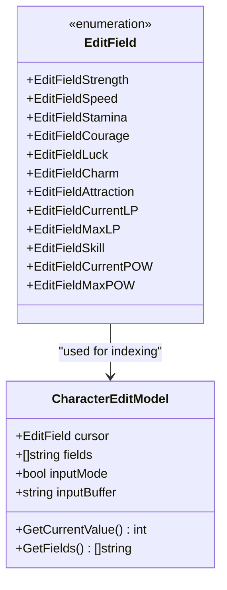
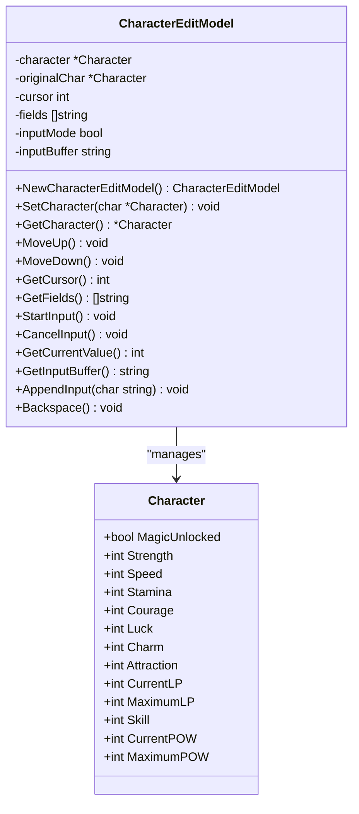
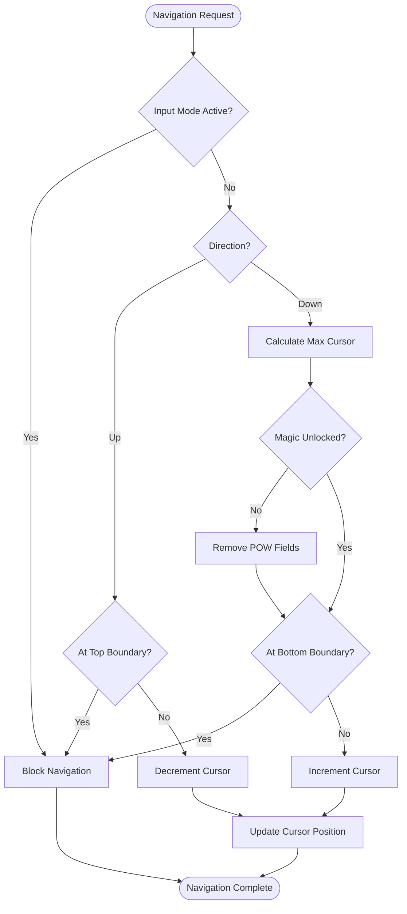
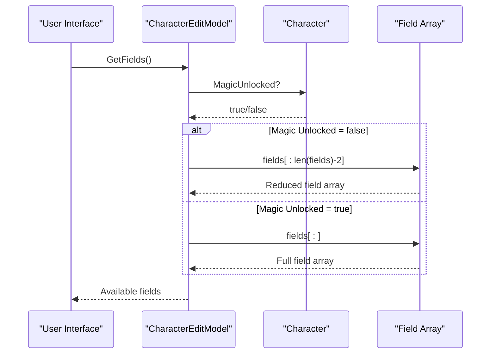
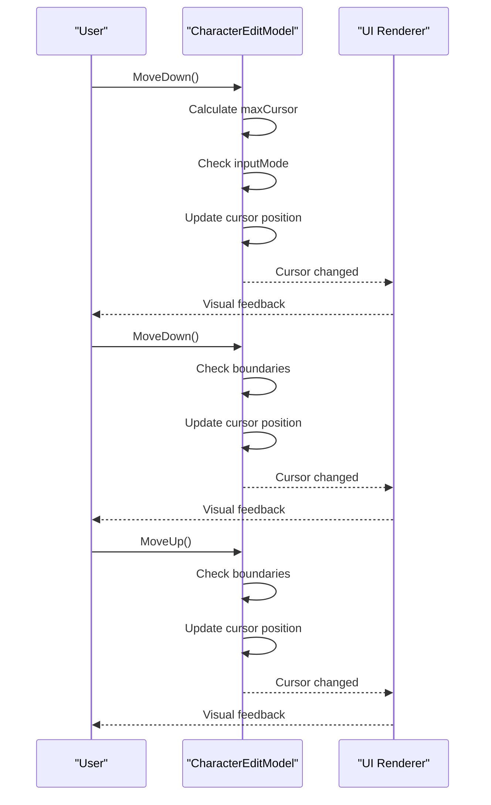
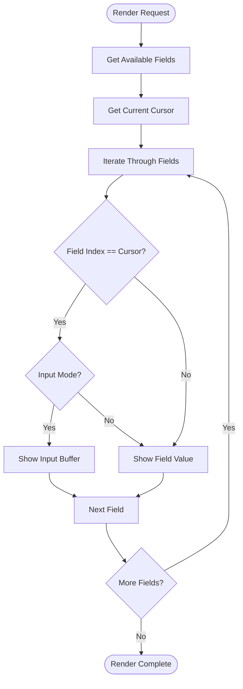

# Navigation and Field Selection

<cite>
**Referenced Files in This Document**
- [character_edit.go](file://pkg/ui/character_edit.go)
- [character.go](file://internal/character/character.go)
- [model.go](file://pkg/ui/model.go)
- [game_session.go](file://pkg/ui/game_session.go)
- [update.go](file://pkg/ui/update.go)
- [view.go](file://pkg/ui/view.go)
- [BUGFIX_CHARACTER_EDIT.md](file://BUGFIX_CHARACTER_EDIT.md)
</cite>

## Table of Contents
1. [Introduction](#introduction)
2. [EditField Enum System](#editfield-enum-system)
3. [CharacterEditModel Architecture](#charactereditmodel-architecture)
4. [Cursor Navigation Logic](#cursor-navigation-logic)
5. [Conditional Field Display](#conditional-field-display)
6. [Dynamic Field Management](#dynamic-field-management)
7. [Navigation Workflows](#navigation-workflows)
8. [Edge Cases and Error Handling](#edge-cases-and-error-handling)
9. [UI Rendering and Display](#ui-rendering-and-display)
10. [Common Issues and Solutions](#common-issues-and-solutions)
11. [Best Practices](#best-practices)

## Introduction

The character editing interface in the Saga Demonspawn application provides a comprehensive system for navigating and modifying character attributes through cursor-based navigation. The system is built around a sophisticated field selection mechanism that adapts dynamically based on character state, particularly the MagicUnlocked flag that conditionally hides magic-related fields.

The navigation system operates through a combination of keyboard controls (MoveUp, MoveDown), conditional field visibility, and dynamic field enumeration that ensures users can efficiently browse and modify character statistics while maintaining logical consistency with the game's progression system.

## EditField Enum System

The EditField enum serves as the foundation for field identification and selection within the character editing interface. This enumeration provides a type-safe mechanism for referencing specific character attributes across the entire editing system.

**Diagram sources**
- [character_edit.go](file://pkg/ui/character_edit.go#L5-L21)

The enum defines twelve distinct fields that correspond to the character's core attributes, derived values, and magic system components. Each field is assigned a sequential integer value starting from zero, enabling efficient array indexing and switch statement operations.

**Section sources**
- [character_edit.go](file://pkg/ui/character_edit.go#L5-L21)

## CharacterEditModel Architecture

The CharacterEditModel serves as the central state manager for the character editing interface, maintaining cursor position, field visibility, and input mode state. The model encapsulates all necessary data for managing the editing experience while providing clean interfaces for navigation and field manipulation.

**Diagram sources**
- [character_edit.go](file://pkg/ui/character_edit.go#L23-L31)
- [character.go](file://internal/character/character.go#L14-L33)

The model maintains several critical state variables:
- **cursor**: Tracks the currently selected field position
- **fields**: Array of field names displayed to the user
- **inputMode**: Boolean indicating whether editing is active
- **inputBuffer**: String buffer for numeric input during editing
- **character**: Reference to the character being edited
- **originalChar**: Backup copy for cancellation scenarios

**Section sources**
- [character_edit.go](file://pkg/ui/character_edit.go#L23-L31)

## Cursor Navigation Logic

The cursor navigation system implements bidirectional movement with intelligent boundary detection and input mode constraints. The navigation logic ensures smooth user interaction while preventing invalid state transitions.

**Diagram sources**
- [character_edit.go](file://pkg/ui/character_edit.go#L70-L87)

### MoveUp Implementation

The MoveUp method provides upward navigation with boundary checking and input mode validation. The method ensures the cursor cannot move past the first field when not in input mode.

### MoveDown Implementation

The MoveDown method implements sophisticated boundary calculation that accounts for the MagicUnlocked flag. When magic is not yet unlocked, the method automatically reduces the maximum cursor position by two to exclude POW-related fields from navigation.

**Section sources**
- [character_edit.go](file://pkg/ui/character_edit.go#L70-L87)

## Conditional Field Display

The conditional field display system dynamically adjusts the available fields based on the character's MagicUnlocked state. This functionality ensures that players cannot access magic-related fields until they've progressed far enough in the game.

**Diagram sources**
- [character_edit.go](file://pkg/ui/character_edit.go#L95-L102)

The GetFields method implements the core conditional logic, returning either the full field array or a reduced subset depending on the MagicUnlocked flag. This approach ensures that the navigation system remains consistent with the game's progression mechanics.

**Section sources**
- [character_edit.go](file://pkg/ui/character_edit.go#L95-L102)

## Dynamic Field Management

The dynamic field management system provides runtime adaptation of the field collection based on character state changes. This system ensures that field availability remains synchronized with the underlying character data.

### Field Array Structure

The character edit interface maintains a predefined array of field names that corresponds directly to the EditField enumeration. This structure enables efficient mapping between user-visible field names and internal field identifiers.

### Runtime Adaptation

The system supports runtime field adaptation through the GetFields method, which recalculates available fields based on the current character state. This capability is essential for handling mid-session state changes, such as magic unlocking.

**Section sources**
- [character_edit.go](file://pkg/ui/character_edit.go#L39-L52)
- [character_edit.go](file://pkg/ui/character_edit.go#L95-L102)

## Navigation Workflows

The navigation system supports several common workflows that demonstrate the flexibility and robustness of the field selection mechanism.

### Basic Navigation Workflow

**Diagram sources**
- [character_edit.go](file://pkg/ui/character_edit.go#L70-L87)
- [update.go](file://pkg/ui/update.go#L234-L252)

### Edge Case Navigation

The system handles several edge cases gracefully:

1. **Boundary Conditions**: Navigation stops at array boundaries regardless of MagicUnlocked state
2. **Input Mode Constraints**: Cursor movement is blocked when editing is active
3. **Mid-Session Changes**: Field availability updates immediately when MagicUnlocked changes

### Field Selection Workflow

The field selection workflow demonstrates how users interact with the navigation system to select and modify character attributes.

**Section sources**
- [update.go](file://pkg/ui/update.go#L234-L252)

## Edge Cases and Error Handling

The navigation system implements comprehensive error handling and edge case management to ensure robust operation under various conditions.

### Input Mode Validation

The system prevents cursor movement when input mode is active, ensuring that users cannot accidentally navigate away from a field they're currently editing. This constraint maintains data integrity during the editing process.

### Boundary Condition Handling

The MoveDown method implements sophisticated boundary detection that accounts for both array limits and MagicUnlocked constraints. This dual-layer validation prevents invalid state transitions.

### Null Reference Protection

All navigation methods include null reference checks for the character pointer, ensuring graceful handling of uninitialized character states.

**Section sources**
- [character_edit.go](file://pkg/ui/character_edit.go#L70-L87)

## UI Rendering and Display

The UI rendering system integrates seamlessly with the navigation logic to provide immediate visual feedback for cursor movements and field selections.

**Diagram sources**
- [view.go](file://pkg/ui/view.go#L354-L394)

The viewCharacterEdit function implements the rendering logic, iterating through available fields and applying appropriate formatting based on cursor position and input mode state. The rendering system ensures that only relevant fields are displayed based on the MagicUnlocked flag.

**Section sources**
- [view.go](file://pkg/ui/view.go#L337-L404)

## Common Issues and Solutions

The navigation system has encountered several common issues that have been systematically addressed through careful analysis and implementation.

### Previous Display Bug

A significant issue was identified where all fields displayed the same value as the currently selected field. This bug occurred because the GetCurrentValue method was being called for every field instead of retrieving the appropriate value for each field index.

**Root Cause Analysis**: The buggy code incorrectly initialized the value variable with GetCurrentValue(), which only returned the value for the current cursor position. The switch statement inside the conditional only updated the value for the selected field, causing all other fields to display the same incorrect value.

**Solution Implementation**: The fix moved the value retrieval logic to execute for every field in the loop, ensuring that each field displays its own correct value. This change involved restructuring the rendering logic to properly map field indices to their corresponding character attributes.

**Section sources**
- [BUGFIX_CHARACTER_EDIT.md](file://BUGFIX_CHARACTER_EDIT.md#L1-L76)

### Magic Unlocking Behavior

The system handles magic unlocking mid-session by dynamically updating field availability and cursor positions. When magic becomes unlocked, POW fields become available, and the cursor position may need adjustment to accommodate the expanded field set.

### Input Mode Synchronization

The system maintains synchronization between navigation state and input mode, ensuring that cursor movement is appropriately constrained during field editing operations.

**Section sources**
- [BUGFIX_CHARACTER_EDIT.md](file://BUGFIX_CHARACTER_EDIT.md#L1-L76)

## Best Practices

The navigation and field selection system demonstrates several best practices for UI state management and user interaction design.

### State Consistency

The system maintains strict consistency between navigation state and field availability, ensuring that users cannot navigate to unavailable fields or access restricted functionality.

### Defensive Programming

All navigation methods implement defensive programming practices, including null checks, boundary validation, and input mode constraints to prevent invalid state transitions.

### Separation of Concerns

The navigation logic is cleanly separated from rendering logic, allowing for independent testing and maintenance of each component while maintaining tight integration through well-defined interfaces.

### Progressive Enhancement

The system implements progressive enhancement by hiding magic-related fields until they become available, providing a natural learning curve for players as they progress through the game.

**Section sources**
- [character_edit.go](file://pkg/ui/character_edit.go#L70-L87)
- [character_edit.go](file://pkg/ui/character_edit.go#L95-L102)