# Value Modification and Synchronization

<cite>
**Referenced Files in This Document**
- [character_edit.go](file://pkg/ui/character_edit.go)
- [character.go](file://internal/character/character.go)
- [model.go](file://pkg/ui/model.go)
- [update.go](file://pkg/ui/update.go)
- [BUGFIX_CHARACTER_EDIT.md](file://BUGFIX_CHARACTER_EDIT.md)
</cite>

## Table of Contents
1. [Introduction](#introduction)
2. [System Architecture Overview](#system-architecture-overview)
3. [Edit Field Enumeration and Mapping](#edit-field-enumeration-and-mapping)
4. [UI Layer Implementation](#ui-layer-implementation)
5. [Domain Layer Operations](#domain-layer-operations)
6. [Value Synchronization Process](#value-synchronization-process)
7. [Type Conversion and Validation](#type-conversion-and-validation)
8. [Backup and Rollback Mechanism](#backup-and-rollback-mechanism)
9. [Common Issues and Solutions](#common-issues-and-solutions)
10. [Practical Examples](#practical-examples)
11. [Integration Patterns](#integration-patterns)
12. [Conclusion](#conclusion)

## Introduction

The value modification and synchronization system in the character editing workflow represents a sophisticated integration between UI input handling and domain logic operations. This system enables seamless editing of character attributes while maintaining data integrity through careful validation, type conversion, and rollback mechanisms.

The architecture follows a clear separation of concerns where the UI layer handles user input and presentation, while the domain layer manages business logic and data persistence. The system demonstrates robust error handling, type safety, and maintains synchronization between multiple related statistics like Maximum LP and derived attributes.

## System Architecture Overview

The character editing system operates through a multi-layered architecture that ensures clean separation between presentation, business logic, and data management concerns.

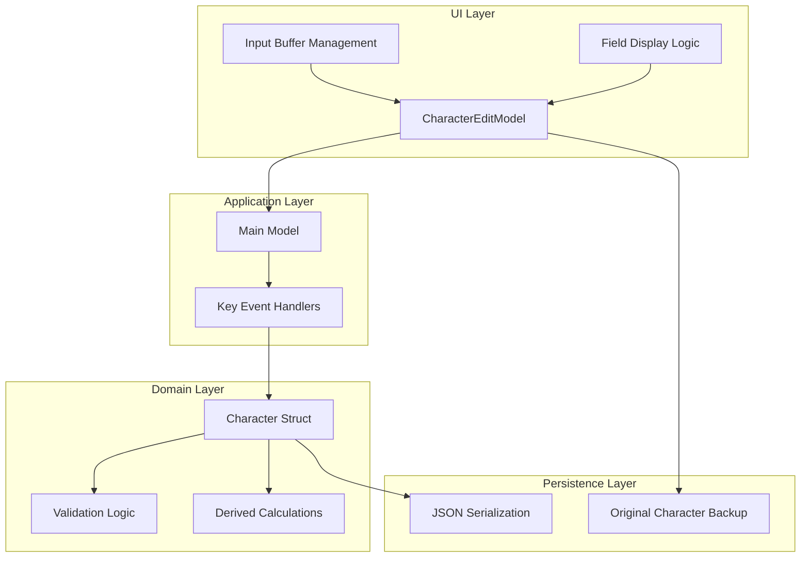

**Diagram sources**
- [character_edit.go](file://pkg/ui/character_edit.go#L23-L31)
- [model.go](file://pkg/ui/model.go#L33-L56)
- [character.go](file://internal/character/character.go#L14-L44)

The system architecture ensures that user input flows through multiple validation stages before reaching the core domain logic, maintaining data integrity throughout the editing process.

**Section sources**
- [character_edit.go](file://pkg/ui/character_edit.go#L23-L31)
- [model.go](file://pkg/ui/model.go#L33-L56)

## Edit Field Enumeration and Mapping

The system uses a carefully designed enumeration to map cursor positions to specific character attributes, enabling efficient value retrieval and modification operations.

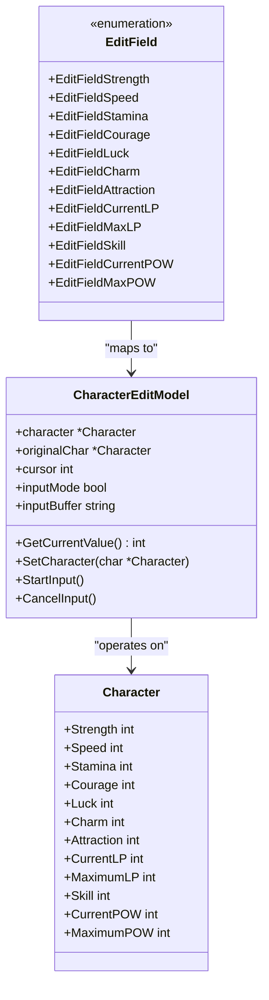

**Diagram sources**
- [character_edit.go](file://pkg/ui/character_edit.go#L5-L21)
- [character_edit.go](file://pkg/ui/character_edit.go#L23-L31)
- [character.go](file://internal/character/character.go#L14-L44)

The `EditField` enumeration provides a type-safe mechanism for mapping cursor positions to character attributes. Each constant corresponds to a specific field in the `Character` struct, ensuring compile-time verification of field access operations.

**Section sources**
- [character_edit.go](file://pkg/ui/character_edit.go#L5-L21)
- [character_edit.go](file://pkg/ui/character_edit.go#L138-L172)

## UI Layer Implementation

The UI layer manages user interaction through a character edit model that coordinates between cursor navigation, input handling, and field display logic.

### Cursor Position Management

The cursor system enables intuitive navigation through character attributes with dynamic field visibility based on character progression:

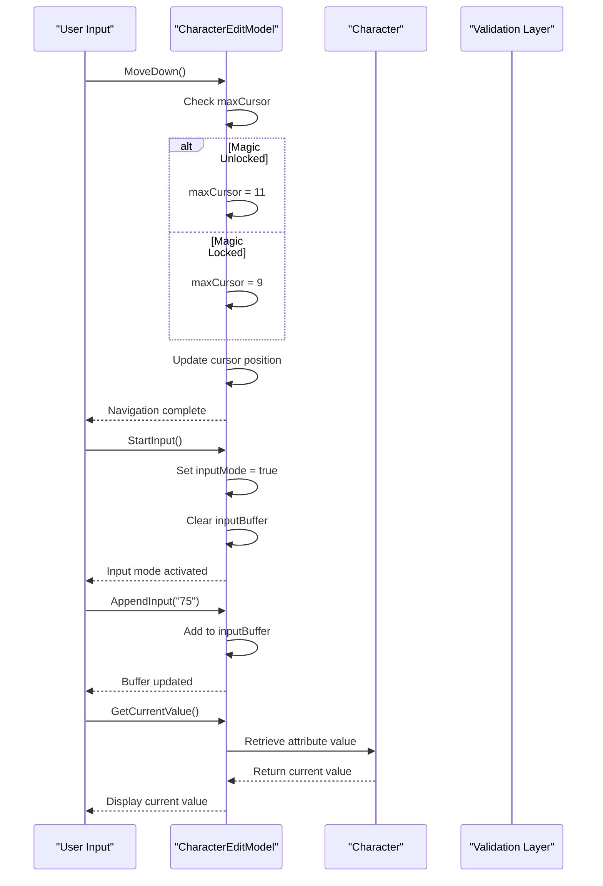

**Diagram sources**
- [character_edit.go](file://pkg/ui/character_edit.go#L70-L88)
- [character_edit.go](file://pkg/ui/character_edit.go#L109-L118)

### Input Buffer Management

The input buffer system provides real-time feedback during value entry while maintaining data integrity through validation:

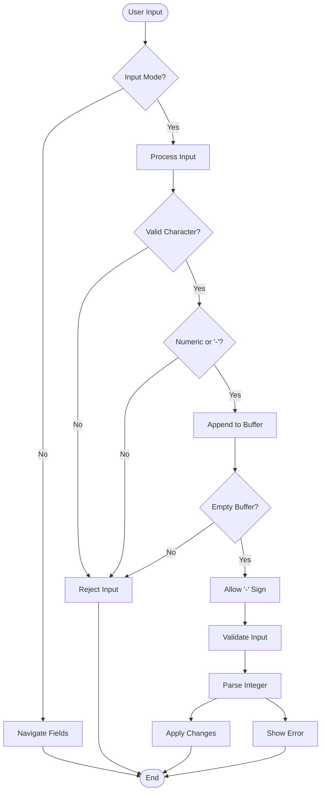

**Diagram sources**
- [update.go](file://pkg/ui/update.go#L255-L277)
- [update.go](file://pkg/ui/update.go#L280-L328)

**Section sources**
- [character_edit.go](file://pkg/ui/character_edit.go#L70-L136)
- [update.go](file://pkg/ui/update.go#L234-L277)

## Domain Layer Operations

The domain layer encapsulates business logic for character attribute modification, ensuring data consistency and applying appropriate validation rules.

### Character Attribute Modification Methods

The `Character` struct provides specialized methods for modifying individual attributes with built-in validation:

| Method | Purpose | Validation | Error Handling |
|--------|---------|------------|----------------|
| `ModifyStrength(delta int)` | Adjust strength by delta | Prevents negative values | Returns error on failure |
| `ModifySpeed(delta int)` | Adjust speed by delta | Prevents negative values | Returns error on failure |
| `ModifyStamina(delta int)` | Adjust stamina by delta | Prevents negative values | Returns error on failure |
| `ModifyCourage(delta int)` | Adjust courage by delta | Prevents negative values | Returns error on failure |
| `ModifyLuck(delta int)` | Adjust luck by delta | Prevents negative values | Returns error on failure |
| `ModifyCharm(delta int)` | Adjust charm by delta | Prevents negative values | Returns error on failure |
| `ModifyAttraction(delta int)` | Adjust attraction by delta | Prevents negative values | Returns error on failure |
| `SetLP(value int)` | Set current LP directly | Allows negative values | No validation |
| `SetMaxLP(value int)` | Set maximum LP | Prevents negative values | Returns error on failure |
| `SetSkill(value int)` | Set skill level | Prevents negative values | Returns error on failure |
| `SetPOW(value int)` | Set current POW | Clamps to zero | No validation |
| `SetMaxPOW(value int)` | Set maximum POW | Prevents negative values | Returns error on failure |

### Derived Stat Calculation

The system automatically calculates derived statistics based on core attributes:

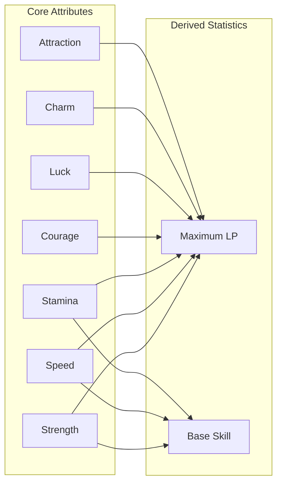

**Diagram sources**
- [character.go](file://internal/character/character.go#L47-L98)
- [character.go](file://internal/character/character.go#L73-L74)

**Section sources**
- [character.go](file://internal/character/character.go#L113-L355)

## Value Synchronization Process

The synchronization process ensures that modifications to character attributes maintain consistency across related statistics and derived values.

### Synchronization Workflow

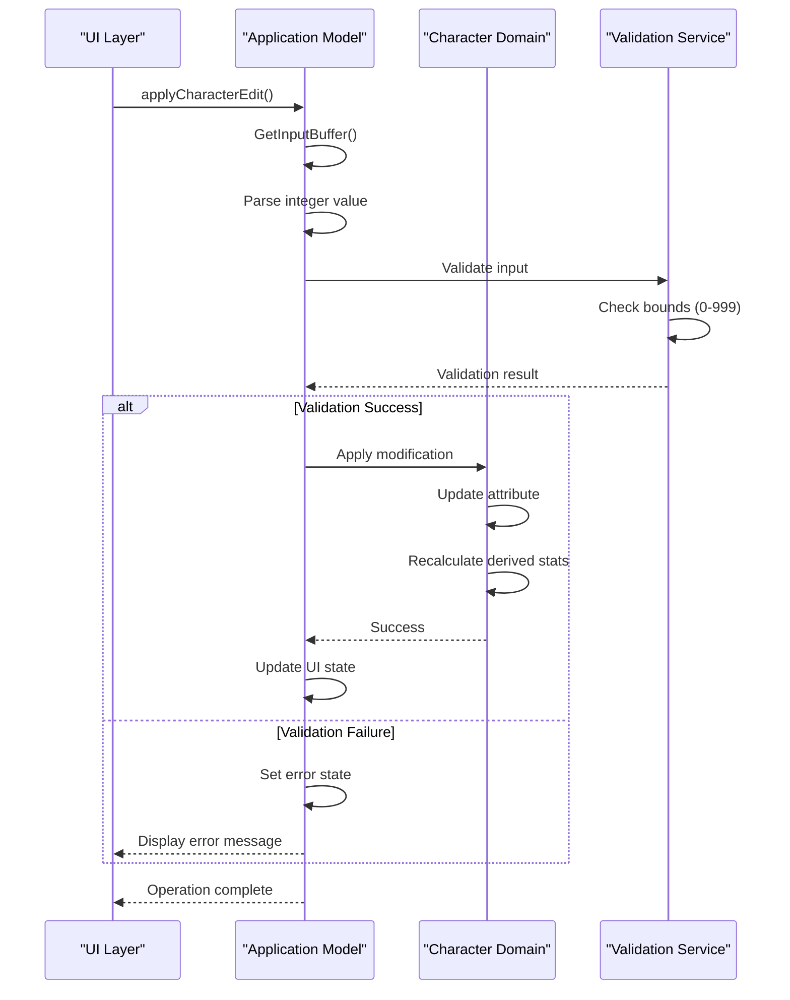

**Diagram sources**
- [update.go](file://pkg/ui/update.go#L280-L328)
- [character.go](file://internal/character/character.go#L101-L111)

### Field-Specific Modification Logic

Different character fields require specialized handling due to their unique business rules and relationships:

| Field Category | Modification Pattern | Special Rules | Synchronization Needs |
|---------------|---------------------|---------------|----------------------|
| Core Characteristics | Direct assignment | Range validation (0-999) | Updates derived stats |
| Life Points | Direct assignment | Negative allowed | Triggers death conditions |
| Skill Level | Direct assignment | Non-negative constraint | Affects combat mechanics |
| Power Resources | Direct assignment | Separate current/max | Independent tracking |
| Magic System | Conditional activation | Unlock prerequisite | Enables new abilities |

**Section sources**
- [update.go](file://pkg/ui/update.go#L280-L328)
- [character.go](file://internal/character/character.go#L194-L255)

## Type Conversion and Validation

The system implements robust type conversion and validation mechanisms to ensure data integrity during the editing process.

### Input Validation Pipeline

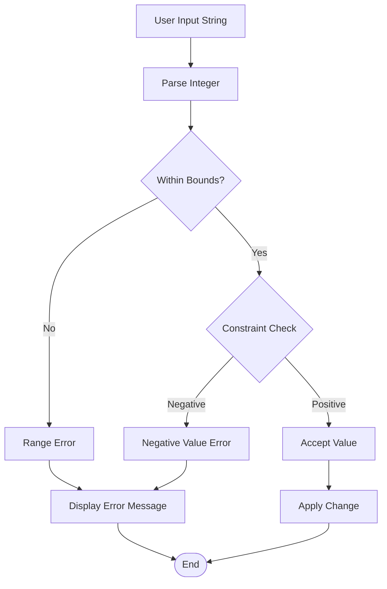

**Diagram sources**
- [update.go](file://pkg/ui/update.go#L291-L300)
- [character.go](file://internal/character/character.go#L101-L111)

### Validation Rules Implementation

The validation system enforces business rules consistently across all character modification operations:

| Validation Type | Implementation | Error Message Pattern | Recovery Options |
|----------------|----------------|----------------------|------------------|
| Range Validation | `0 ≤ value ≤ 999` | `{field} must be between 0 and 999` | Automatic clamping |
| Constraint Validation | Non-negative requirement | `{field} cannot be negative` | Revert to previous value |
| Type Validation | Integer parsing | `Invalid integer format` | Clear input buffer |
| Business Rule Validation | Field-specific rules | `{field} constraint violated` | Show constraint details |

**Section sources**
- [update.go](file://pkg/ui/update.go#L291-L300)
- [character.go](file://internal/character/character.go#L101-L111)

## Backup and Rollback Mechanism

The system maintains a complete backup of the original character state to enable safe rollback operations when users cancel edits or encounter validation errors.

### Backup Strategy

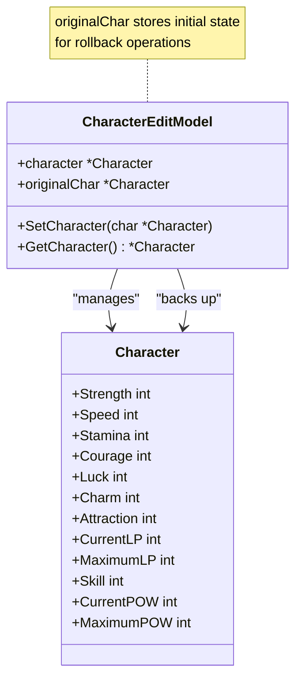

**Diagram sources**
- [character_edit.go](file://pkg/ui/character_edit.go#L58-L62)

### Rollback Implementation

The rollback mechanism operates through several key operations:

1. **Initialization**: When a character is loaded, a deep copy is created as the backup
2. **Modification Tracking**: All changes are applied to the working copy
3. **Cancellation**: When editing is canceled, the working copy is discarded
4. **Commit**: Successful modifications persist to the main character object

**Section sources**
- [character_edit.go](file://pkg/ui/character_edit.go#L58-L62)
- [model.go](file://pkg/ui/model.go#L78-L83)

## Common Issues and Solutions

The development process identified several critical issues that required systematic solutions to ensure reliable character editing functionality.

### Display Bug Resolution

The primary issue involved incorrect field value display where all fields showed the same value as the currently selected field:

**Problem Analysis**: The `viewCharacterEdit()` function incorrectly used `GetCurrentValue()` which only returned the value for the current cursor position. The switch statement inside the condition only updated values for the selected field, causing all other fields to display the same incorrect value.

**Solution Implementation**: The fix moved value retrieval to execute for every field in the loop, ensuring each field displays its own correct value regardless of cursor position.

### Synchronization Challenges

The system faced challenges in maintaining consistency between related statistics:

| Issue | Impact | Solution | Verification |
|-------|--------|----------|-------------|
| Out-of-bounds values | Data corruption | Range validation (0-999) | Unit testing |
| Negative inputs | Invalid state | Constraint enforcement | Input filtering |
| Derived stat inconsistency | Gameplay imbalance | Recalculation triggers | State validation |
| Type conversion errors | Runtime crashes | Robust parsing | Error handling |

**Section sources**
- [BUGFIX_CHARACTER_EDIT.md](file://BUGFIX_CHARACTER_EDIT.md#L1-L122)

## Practical Examples

### Example 1: Modifying Strength Attribute

When a user modifies the Strength attribute from 64 to 75:

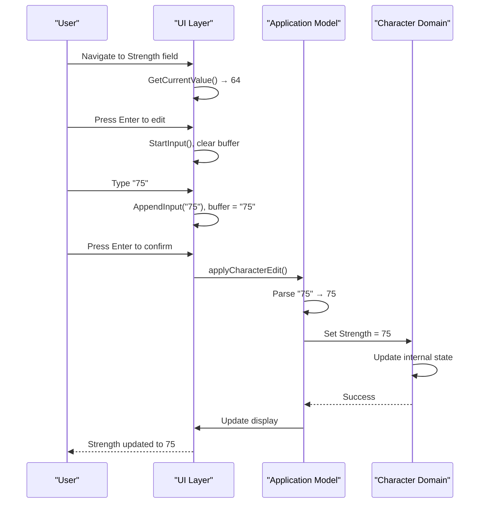

**Diagram sources**
- [update.go](file://pkg/ui/update.go#L280-L307)
- [character_edit.go](file://pkg/ui/character_edit.go#L138-L172)

### Example 2: Updating Maximum LP

Modifying Maximum LP from 240 to 260 involves additional validation:

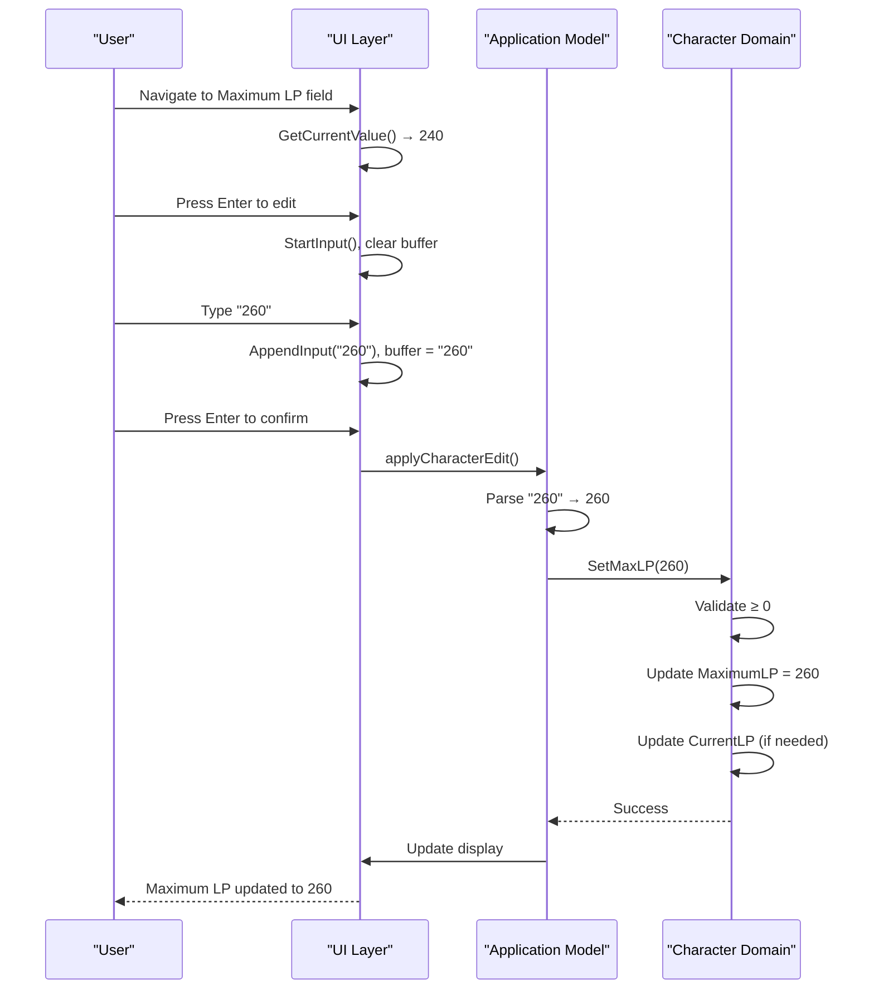

**Diagram sources**
- [update.go](file://pkg/ui/update.go#L318-L320)
- [character.go](file://internal/character/character.go#L194-L201)

**Section sources**
- [update.go](file://pkg/ui/update.go#L280-L328)
- [character.go](file://internal/character/character.go#L194-L201)

## Integration Patterns

The character editing system demonstrates several key integration patterns that ensure seamless operation across the application stack.

### MVC Pattern Implementation

The system follows a Model-View-Controller pattern where:

- **Model**: `Character` struct and `CharacterEditModel` manage data
- **View**: UI rendering and field display logic
- **Controller**: Key event handling and command processing

### Command Pattern Usage

The application uses command pattern for handling user actions:

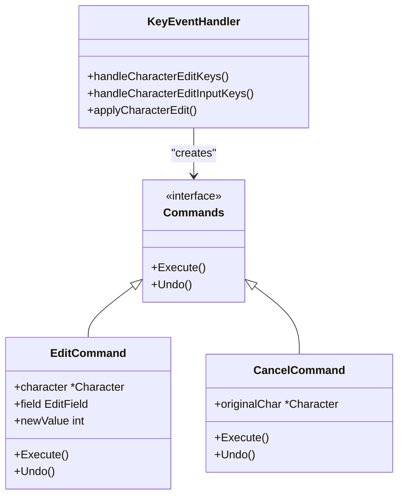

**Diagram sources**
- [update.go](file://pkg/ui/update.go#L234-L277)

### Observer Pattern for State Changes

The system implements observer pattern for notifying components of state changes:

| Notification Type | Trigger | Observers | Action |
|------------------|---------|-----------|--------|
| Field Selection | Cursor movement | UI display | Update highlight |
| Value Change | Attribute modification | Validation system | Run checks |
| Input Mode | Edit activation | Input handlers | Enable keyboard |
| Completion | Edit submission | Persistence layer | Save changes |

**Section sources**
- [update.go](file://pkg/ui/update.go#L234-L277)
- [character_edit.go](file://pkg/ui/character_edit.go#L23-L31)

## Conclusion

The value modification and synchronization system in the character editing workflow represents a sophisticated implementation of modern software engineering principles. Through careful separation of concerns, robust validation mechanisms, and comprehensive error handling, the system provides a reliable foundation for character attribute management.

The architecture successfully balances usability with data integrity, allowing users to make informed modifications while preventing invalid states that could compromise gameplay. The integration between UI input handling and domain logic operations demonstrates effective patterns for building maintainable and extensible applications.

Key strengths of the system include:

- **Type Safety**: Strong typing prevents common programming errors
- **Validation Coverage**: Comprehensive validation at multiple layers
- **Error Recovery**: Graceful handling of invalid inputs and edge cases
- **State Management**: Clear backup and rollback mechanisms
- **Extensibility**: Modular design supports future enhancements

The system serves as an excellent example of how to build robust user interfaces that maintain data integrity while providing intuitive user experiences. The lessons learned from bug fixes and validation improvements continue to inform best practices for similar systems.