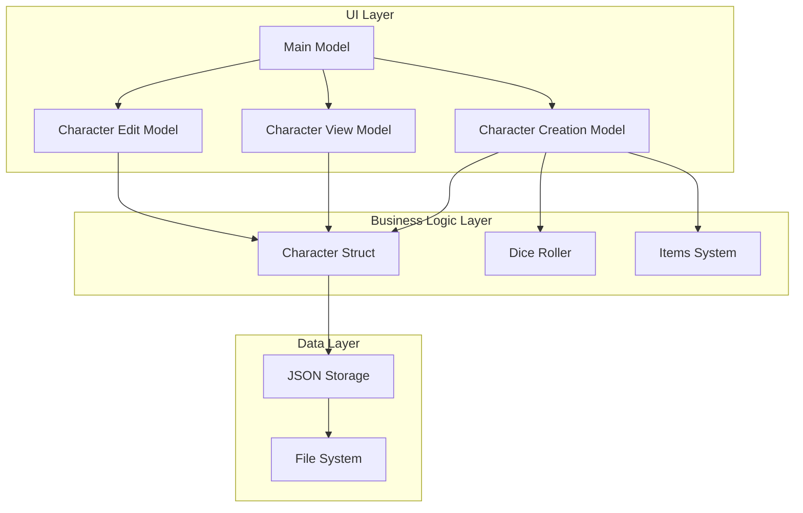
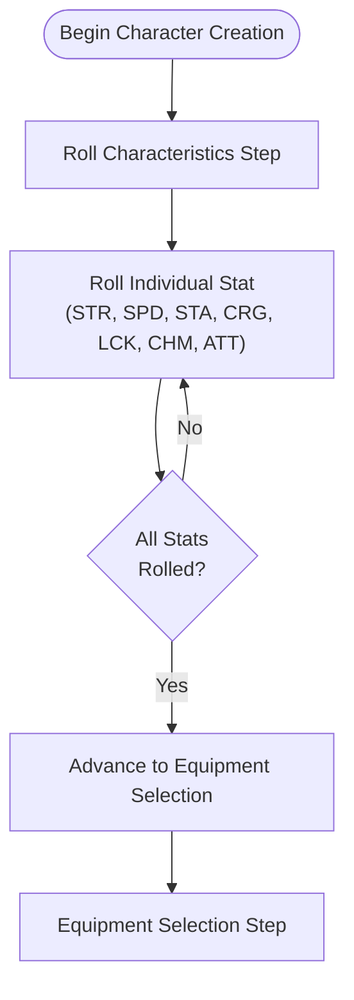
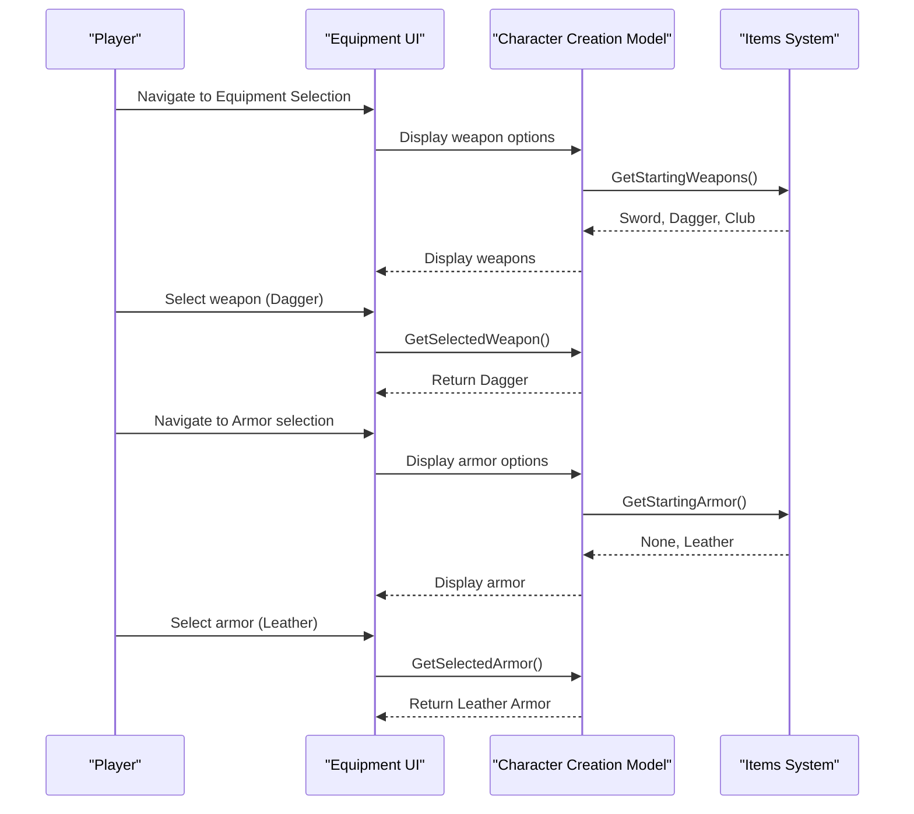
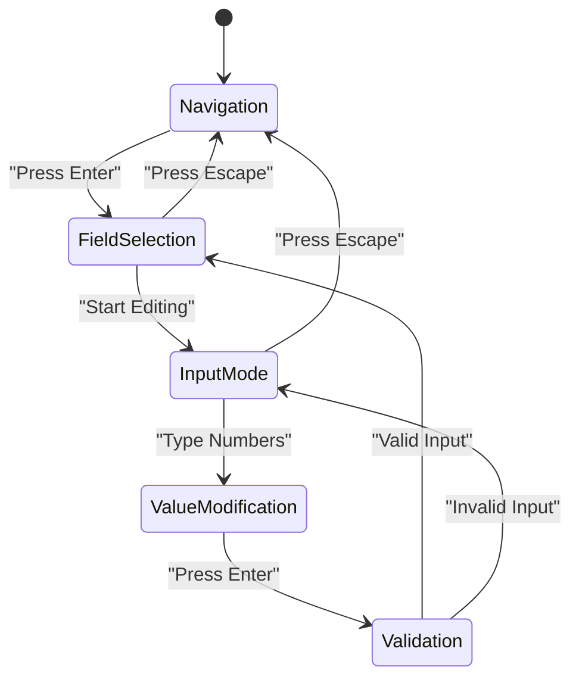
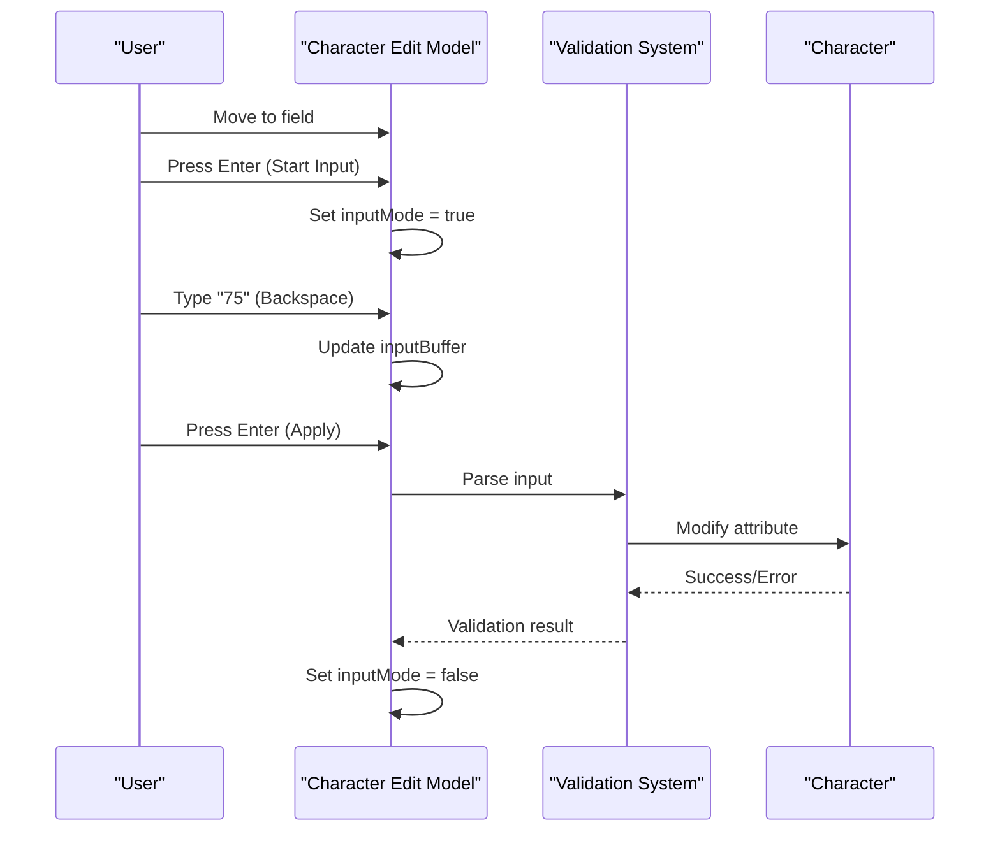
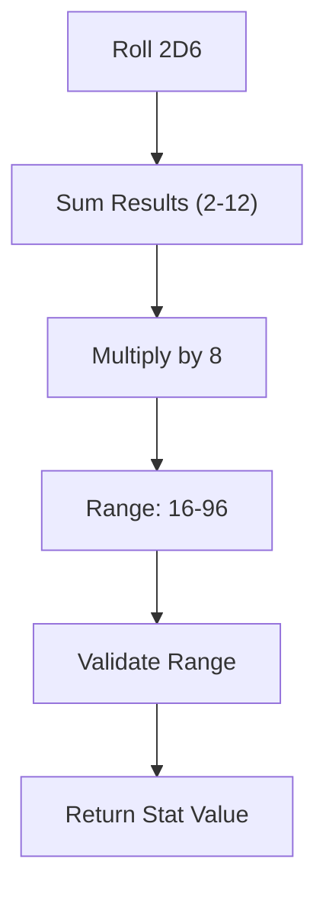
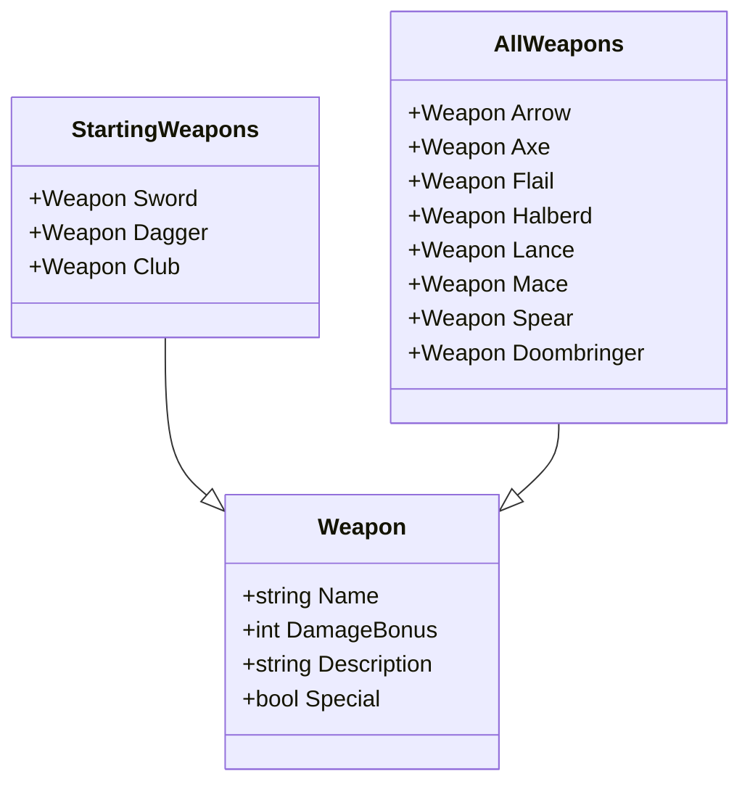
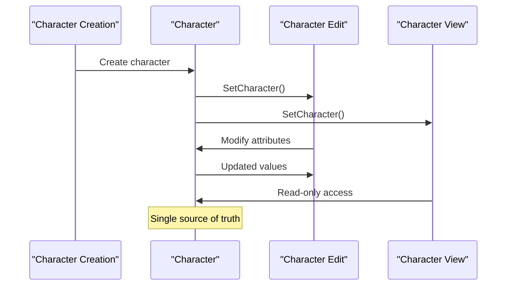

# Character Management

<cite>
**Referenced Files in This Document**
- [internal/character/character.go](file://internal/character/character.go)
- [pkg/ui/character_creation.go](file://pkg/ui/character_creation.go)
- [pkg/ui/character_view.go](file://pkg/ui/character_view.go)
- [pkg/ui/character_edit.go](file://pkg/ui/character_edit.go)
- [pkg/ui/model.go](file://pkg/ui/model.go)
- [pkg/ui/update.go](file://pkg/ui/update.go)
- [internal/dice/dice.go](file://internal/dice/dice.go)
- [internal/items/items.go](file://internal/items/items.go)
- [README.md](file://README.md)
- [BUGFIX_CHARACTER_EDIT.md](file://BUGFIX_CHARACTER_EDIT.md)
</cite>

## Table of Contents
1. [Introduction](#introduction)
2. [Character System Architecture](#character-system-architecture)
3. [Character Creation Process](#character-creation-process)
4. [Character View Interface](#character-view-interface)
5. [Character Editing Functionality](#character-editing-functionality)
6. [Dice Rolling Mechanics](#dice-rolling-mechanics)
7. [Equipment Selection](#equipment-selection)
8. [Character State Management](#character-state-management)
9. [Common Issues and Solutions](#common-issues-and-solutions)
10. [Best Practices](#best-practices)

## Introduction

The saga-demonspawn application implements a comprehensive character management system for the "Sagas of the Demonspawn" gamebook. This system handles the complete lifecycle of a character from creation through editing and viewing, providing both beginner-friendly interfaces and advanced functionality for experienced players.

The character management system consists of three primary components:
- **Character Creation**: Rolling characteristics using 2D6×8 mechanics and selecting starting equipment
- **Character Viewing**: Displaying the full character sheet with all attributes and equipment
- **Character Editing**: Modifying character attributes with validation and undo capabilities

## Character System Architecture

The character management system follows a layered architecture with clear separation of concerns:



**Diagram sources**
- [pkg/ui/model.go](file://pkg/ui/model.go#L33-L56)
- [internal/character/character.go](file://internal/character/character.go#L14-L44)
- [pkg/ui/character_creation.go](file://pkg/ui/character_creation.go#L21-L44)

**Section sources**
- [pkg/ui/model.go](file://pkg/ui/model.go#L33-L56)
- [internal/character/character.go](file://internal/character/character.go#L14-L44)

## Character Creation Process

The character creation process follows a structured three-step workflow that guides players through creating their adventurer:

### Step 1: Rolling Characteristics

The first step involves rolling seven core characteristics using the 2D6×8 mechanic:



**Diagram sources**
- [pkg/ui/character_creation.go](file://pkg/ui/character_creation.go#L121-L137)
- [internal/dice/dice.go](file://internal/dice/dice.go#L20-L22)

#### Stat Rolling Mechanics

Each characteristic is rolled using the formula: **2D6 × 8**, producing values in the range 16-96. This mechanic reflects the game's philosophy that "nobody is perfect," as 100% perfection is unattainable.

Key features of the rolling system:
- **Individual stat rolls**: Players can roll each characteristic separately
- **All-at-once option**: Press 'r' to roll all stats simultaneously
- **Validation**: Ensures all stats are rolled before proceeding
- **Visual feedback**: Clear indication of which stats have been rolled

### Step 2: Selecting Starting Equipment

After rolling characteristics, players select their starting equipment from predefined options:



**Diagram sources**
- [pkg/ui/character_creation.go](file://pkg/ui/character_creation.go#L165-L207)
- [internal/items/items.go](file://internal/items/items.go#L211-L236)

#### Available Equipment Options

The system provides carefully balanced starting equipment:

**Weapons:**
- **Sword**: Standard melee weapon (+10 damage bonus)
- **Dagger**: Light, concealable weapon (+5 damage bonus)
- **Club**: Basic melee weapon (+8 damage bonus)

**Armor:**
- **None**: No armor (default starting condition)
- **Leather Armor**: Light protection (+5 protection)

### Step 3: Review and Finalization

The final step allows players to review their character before committing to creation:


**Diagram sources**
- [pkg/ui/character_creation.go](file://pkg/ui/character_creation.go#L161-L179)
- [pkg/ui/update.go](file://pkg/ui/update.go#L161-L173)

**Section sources**
- [pkg/ui/character_creation.go](file://pkg/ui/character_creation.go#L121-L279)
- [internal/dice/dice.go](file://internal/dice/dice.go#L20-L22)
- [internal/items/items.go](file://internal/items/items.go#L211-L236)

## Character View Interface

The character view interface provides a comprehensive display of all character attributes and equipment:

### Character Sheet Layout

The view interface presents character information in a structured format:

| Category | Attributes | Description |
|----------|------------|-------------|
| **Core Characteristics** | STR, SPD, STA, CRG, LCK, CHM, ATT | Primary abilities rolled during creation |
| **Derived Values** | Current LP, Maximum LP, Skill | Calculated from base characteristics |
| **Magic System** | Current POW, Maximum POW, Magic Unlocked | Unlocked during adventure |
| **Equipment** | Equipped Weapon, Equipped Armor, Has Shield | Starting gear selection |

### Equipment Information Display

The interface clearly shows equipped items and their benefits:

- **Weapon Damage Bonus**: Shows the additional damage from the equipped weapon
- **Armor Protection**: Displays total damage reduction from armor and shield
- **Shield Status**: Indicates whether a shield is equipped

**Section sources**
- [pkg/ui/character_view.go](file://pkg/ui/character_view.go#L1-26)
- [internal/character/character.go](file://internal/character/character.go#L14-L44)

## Character Editing Functionality

The character editing system provides powerful tools for modifying character attributes with comprehensive validation:

### Field Selection and Navigation



**Diagram sources**
- [pkg/ui/character_edit.go](file://pkg/ui/character_edit.go#L70-L89)
- [pkg/ui/update.go](file://pkg/ui/update.go#L235-L252)

### Input Mode Activation

The editing system operates in two distinct modes:

1. **Navigation Mode**: Cursor moves through editable fields
2. **Input Mode**: Active editing with numeric input

#### Field Categories

The editor organizes fields into logical categories:

**Primary Characteristics**:
- Strength (STR): Physical power
- Speed (SPD): Agility and reaction
- Stamina (STA): Endurance
- Courage (CRG): Bravery
- Luck (LCK): Fortune
- Charm (CHM): Charisma
- Attraction (ATT): Personal magnetism

**Derived Statistics**:
- Current LP: Current life points
- Maximum LP: Maximum life points
- Skill: Combat proficiency

**Magic System** (unlocked during adventure):
- Current POW: Current power
- Maximum POW: Maximum power

### Value Modification Process



**Diagram sources**
- [pkg/ui/character_edit.go](file://pkg/ui/character_edit.go#L109-L136)
- [pkg/ui/update.go](file://pkg/ui/update.go#L255-L278)

### Validation and Error Handling

The editing system implements robust validation:

#### Input Validation Rules

| Field Type | Validation Rules | Error Messages |
|------------|------------------|----------------|
| **Characteristics** | 0-999 range | "cannot be negative", "exceeds maximum (999)" |
| **Life Points** | Can be negative (death) | No restrictions |
| **Skill** | Cannot be negative | "skill cannot be negative" |
| **Power** | Cannot be negative | "power cannot be negative" |
| **Magic Unlocked** | Boolean toggle | Automatic validation |

#### Error Recovery

The system provides graceful error handling:
- **Invalid input**: Input buffer cleared, original value preserved
- **Negative values**: Automatic clamping to minimum allowed
- **Out-of-range values**: Clear error messages with guidance

**Section sources**
- [pkg/ui/character_edit.go](file://pkg/ui/character_edit.go#L23-L173)
- [pkg/ui/update.go](file://pkg/ui/update.go#L235-L329)
- [BUGFIX_CHARACTER_EDIT.md](file://BUGFIX_CHARACTER_EDIT.md#L1-122)

## Dice Rolling Mechanics

The dice rolling system implements the core 2D6×8 mechanic used throughout the game:

### Rolling Algorithm



**Diagram sources**
- [internal/dice/dice.go](file://internal/dice/dice.go#L60-L64)

### Dice Roller Implementation

The system uses an interface-based design for flexibility:

#### Roller Interface

```go
type Roller interface {
    Roll2D6() int        // Simulates rolling two six-sided dice
    Roll1D6() int        // Simulates rolling one six-sided die
    RollCharacteristic() int // 2d6 × 8 for character stats
    SetSeed(seed int64)  // For deterministic testing
}
```

#### StandardRoller Features

- **Random Generation**: Uses Go's `math/rand` with time-based seeding
- **Deterministic Testing**: Seed setting capability for reproducible results
- **Multiple Dice Types**: Supports various dice mechanics
- **Roll Results**: Detailed roll outcomes with descriptions

### Probability Distribution

Understanding the statistical distribution helps players make informed decisions:

| Roll Result | Probability | Character Stat | Interpretation |
|-------------|-------------|----------------|----------------|
| 2 (Snake Eyes) | 2.78% | 16 | Extremely weak |
| 7 (Natural) | 13.89% | 56 | Average baseline |
| 12 (Boxcars) | 2.78% | 96 | Exceptionally strong |
| 10+ | 58.33% | 80-96 | Above average |
| 6- | 41.67% | 48-72 | Below average |

**Section sources**
- [internal/dice/dice.go](file://internal/dice/dice.go#L11-L97)

## Equipment Selection

The equipment system provides carefully balanced starting gear options:

### Weapon System



**Diagram sources**
- [internal/items/items.go](file://internal/items/items.go#L20-L30)
- [internal/items/items.go](file://internal/items/items.go#L194-L208)

### Armor System

The armor system provides protection with strategic trade-offs:

#### Armor Types and Benefits

| Armor | Protection | Description | Trade-offs |
|-------|------------|-------------|------------|
| **None** | 0 | Default starting condition | No protection |
| **Leather Armor** | 5 | Light protection | Good mobility |
| **Chain Mail** | 8 | Moderate protection | Balanced defense |
| **Plate Mail** | 12 | Heavy protection | Reduced mobility |

### Equipment Interaction

The system handles equipment combinations:

#### Shield Mechanics

- **Standard Shield**: +7 protection when alone
- **With Armor**: +5 protection (reduced effectiveness)
- **Toggle System**: Easy equip/unequip functionality

#### Damage Calculation

The final damage calculation considers:
- Base roll × 5
- Weapon damage bonus
- Character strength modifier
- Armor and shield protection

**Section sources**
- [internal/items/items.go](file://internal/items/items.go#L20-L257)

## Character State Management

The character management system maintains state across different screens and operations:

### State Preservation



**Diagram sources**
- [pkg/ui/model.go](file://pkg/ui/model.go#L78-L84)
- [internal/character/character.go](file://internal/character/character.go#L312-L355)

### Persistence Mechanism

The system implements automatic saving with timestamped filenames:

#### Save Process

1. **Timestamp Generation**: Current time with format "YYYYMMDD-HHMMSS"
2. **Filename Creation**: "character_YYYYMMDD-HHMMSS.json"
3. **Directory Structure**: Creates save directory if needed
4. **JSON Serialization**: Human-readable format with indentation
5. **Atomic Write**: Complete file written before replacing old version

#### Load Process

1. **File Discovery**: Scans save directory for JSON files
2. **Timestamp Parsing**: Extracts creation time from filename
3. **JSON Deserialization**: Validates and reconstructs character
4. **State Restoration**: Updates all UI models with loaded character

### Cross-Screen Synchronization

The system ensures consistency across all views:

- **Character View**: Read-only display of current state
- **Character Edit**: Full modification capabilities
- **Game Session**: Access to both view and edit modes

**Section sources**
- [internal/character/character.go](file://internal/character/character.go#L312-L355)
- [pkg/ui/model.go](file://pkg/ui/model.go#L78-L95)

## Common Issues and Solutions

### Character Edit Display Bug

**Problem**: All fields displayed the same value as the currently selected field.

**Root Cause**: Incorrect value retrieval in the view function - used cursor position value for all fields.

**Solution**: Moved value retrieval to execute for every field in the loop, ensuring each field displays its own value.

**Fix Impact**:
- **Before**: All fields showed cursor value
- **After**: Each field correctly displays its own value
- **Testing**: Verified with multiple field selections and editing scenarios

### Incomplete Stat Rolls

**Problem**: Players could advance without rolling all characteristics.

**Solution**: Added validation in the character creation model to track completion status.

**Implementation**:
- `checkAllRolled()` method tracks individual stat rolls
- `AreAllRolled()` returns completion status
- UI prevents advancement until all stats are rolled

### Equipment Selection Issues

**Problem**: Invalid equipment combinations causing crashes.

**Solution**: Implemented validation in the equipment selection process.

**Prevention Measures**:
- Null checks for equipment selection
- Default fallback to safe equipment
- Validation of equipment compatibility

**Section sources**
- [BUGFIX_CHARACTER_EDIT.md](file://BUGFIX_CHARACTER_EDIT.md#L1-122)
- [pkg/ui/character_creation.go](file://pkg/ui/character_creation.go#L132-L141)

## Best Practices

### For Beginners

1. **Understand the Mechanics**: Familiarize yourself with the 2D6×8 rolling system
2. **Plan Your Strategy**: Consider how different equipment combinations suit your playstyle
3. **Save Frequently**: Use the save functionality regularly to prevent data loss
4. **Experiment**: Try different stat combinations to find your preferred playstyle

### For Advanced Users

1. **Optimize Equipment**: Choose equipment that complements your stat distribution
2. **Track Progress**: Monitor skill progression and magic unlock conditions
3. **Backup Saves**: Maintain multiple save files for different character builds
4. **Customization**: Explore the underlying data structures for advanced modifications

### Development Guidelines

1. **Interface Design**: Use clear, consistent interfaces for all character operations
2. **Error Handling**: Implement comprehensive validation and graceful error recovery
3. **State Management**: Maintain single source of truth for character data
4. **Testing**: Utilize deterministic seeding for reliable testing of random systems

### Performance Considerations

1. **Memory Efficiency**: Character data structures are compact and efficient
2. **I/O Operations**: JSON serialization is optimized for human readability
3. **UI Responsiveness**: State changes are handled efficiently in the update cycle
4. **Scalability**: Architecture supports future expansion with minimal changes

The character management system demonstrates excellent software engineering practices while providing an intuitive and powerful tool for managing game characters. Its modular design, comprehensive validation, and user-friendly interface make it suitable for both casual players and advanced users seeking detailed character customization.