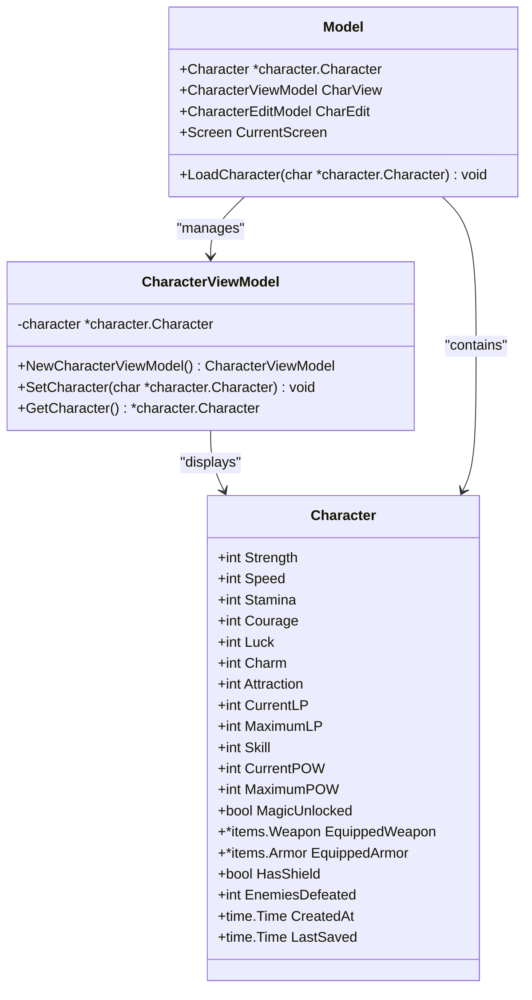
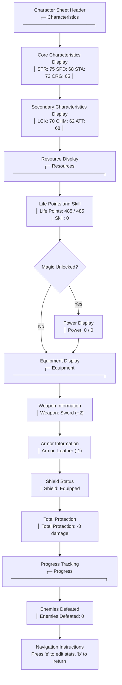
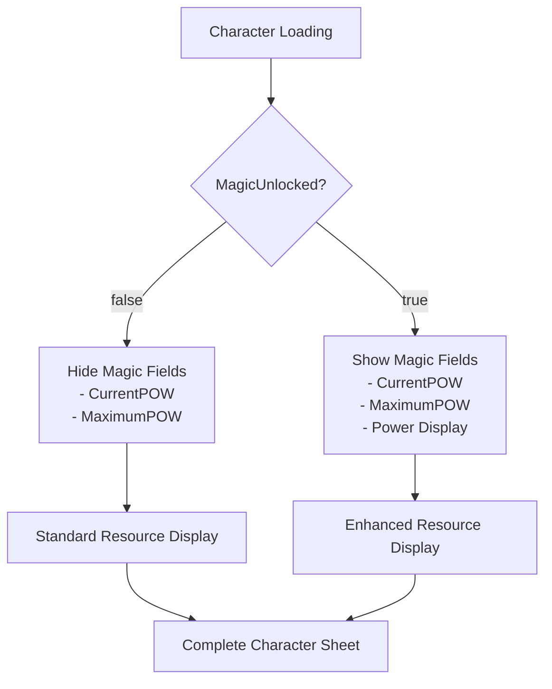
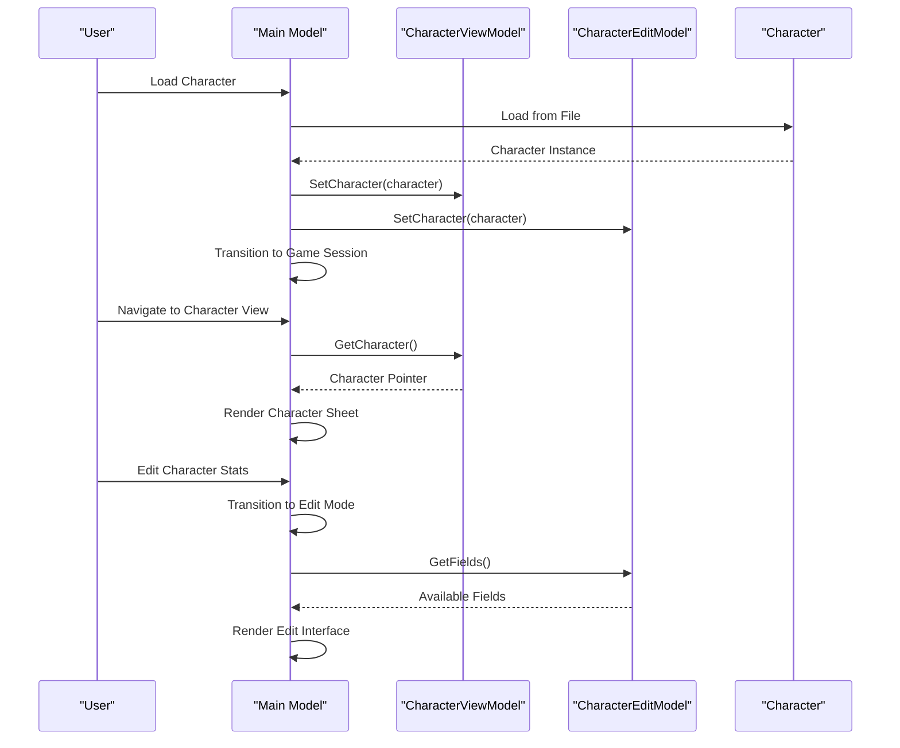
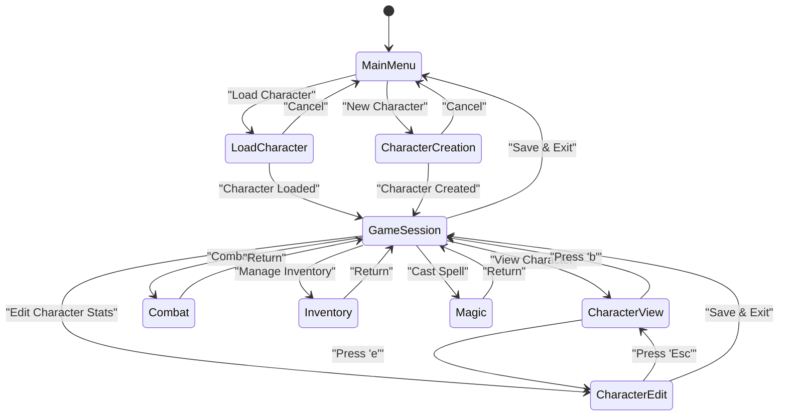

# Character Viewing

<cite>
**Referenced Files in This Document**
- [internal/character/character.go](file://internal/character/character.go)
- [pkg/ui/character_view.go](file://pkg/ui/character_view.go)
- [pkg/ui/model.go](file://pkg/ui/model.go)
- [pkg/ui/update.go](file://pkg/ui/update.go)
- [pkg/ui/view.go](file://pkg/ui/view.go)
- [pkg/ui/character_edit.go](file://pkg/ui/character_edit.go)
- [pkg/ui/game_session.go](file://pkg/ui/game_session.go)
- [pkg/ui/load_character.go](file://pkg/ui/load_character.go)
</cite>

## Table of Contents
1. [Introduction](#introduction)
2. [CharacterViewModel Architecture](#characterviewmodel-architecture)
3. [Character Data Structure](#character-data-structure)
4. [Data Binding Methods](#data-binding-methods)
5. [Terminal UI Rendering](#terminal-ui-rendering)
6. [Conditional Display Logic](#conditional-display-logic)
7. [Integration with Main Application](#integration-with-main-application)
8. [Common Issues and Solutions](#common-issues-and-solutions)
9. [Navigation Flow](#navigation-flow)
10. [Best Practices](#best-practices)

## Introduction

The character viewing functionality in the saga-demonspawn application provides a comprehensive display of character statistics, equipment, and progress tracking through a terminal-based user interface. The system consists of the `CharacterViewModel` struct that manages character data presentation, along with sophisticated rendering logic that adapts to character state changes such as magic system unlocking.

The character view serves as the primary interface for players to inspect their Fire*Wolf character's complete profile, including all seven core characteristics, derived values like Life Points and Skill, equipment status, and progress metrics. The system seamlessly integrates with the main application model to provide smooth navigation between character viewing, editing, and gameplay sessions.

## CharacterViewModel Architecture

The `CharacterViewModel` acts as a dedicated presenter for character display logic, maintaining a clean separation between business logic and presentation concerns.



**Diagram sources**
- [pkg/ui/character_view.go](file://pkg/ui/character_view.go#L5-L25)
- [internal/character/character.go](file://internal/character/character.go#L14-L44)
- [pkg/ui/model.go](file://pkg/ui/model.go#L33-L56)

**Section sources**
- [pkg/ui/character_view.go](file://pkg/ui/character_view.go#L1-L26)
- [internal/character/character.go](file://internal/character/character.go#L1-L355)

## Character Data Structure

The core character model encompasses seven fundamental characteristics, derived values, equipment status, and progress tracking metrics.

### Core Characteristics (Rolled at Creation)
| Field | Abbreviation | Description | Range |
|-------|-------------|-------------|-------|
| Strength | STR | Physical power and raw strength | 0-999 |
| Speed | SPD | Agility, reflexes, and dexterity | 0-999 |
| Stamina | STA | Endurance and vitality | 0-999 |
| Courage | CRG | Bravery, mental fortitude | 0-999 |
| Luck | LCK | Fortune, chance, and destiny | 0-999 |
| Charm | CHM | Charisma, social influence | 0-999 |
| Attraction | ATT | Personal magnetism, appeal | 0-999 |

### Derived Values
| Field | Description | Calculation Method |
|-------|-------------|-------------------|
| CurrentLP | Current life points | Dynamic, affected by damage/healing |
| MaximumLP | Maximum life points | Sum of all characteristics |
| Skill | Combat proficiency | Experience-based progression |

### Magic System (Unlocked During Adventure)
| Field | Description | Initial State |
|-------|-------------|---------------|
| CurrentPOW | Current magical power | 0 (unlocked) |
| MaximumPOW | Maximum magical power | 0 (unlocked) |
| MagicUnlocked | Whether magic is available | false (default) |

### Equipment Status
| Field | Type | Description |
|-------|------|-------------|
| EquippedWeapon | *items.Weapon | Currently wielded weapon |
| EquippedArmor | *items.Armor | Currently worn armor |
| HasShield | bool | Whether shield is equipped |

**Section sources**
- [internal/character/character.go](file://internal/character/character.go#L14-L44)

## Data Binding Methods

The `CharacterViewModel` provides essential methods for managing the relationship between the UI and business logic layers.

### SetCharacter() Method
The `SetCharacter()` method establishes the data binding between the view model and the underlying character data structure. This method accepts a pointer to a `character.Character` instance and stores it within the view model's private field.

**Key Features:**
- **Null Safety**: Handles nil character references gracefully
- **Reference Management**: Maintains pointer to original character data
- **Immediate Availability**: Makes character data immediately accessible to view functions

**Implementation Details:**
- Stores character reference as `m.character *character.Character`
- Enables real-time data synchronization between UI and business logic
- Supports dynamic character state changes without UI refresh

### GetCharacter() Method
The `GetCharacter()` method retrieves the currently bound character instance, providing controlled access to the underlying data structure.

**Key Features:**
- **Type Safety**: Returns `*character.Character` pointer for direct manipulation
- **Null Checking**: Returns nil when no character is loaded
- **Read-Only Access**: Prevents accidental modification through the getter interface

**Usage Patterns:**
- UI rendering functions call `GetCharacter()` to access display data
- Event handlers use the returned pointer for data mutations
- Validation logic ensures character existence before operations

**Section sources**
- [pkg/ui/character_view.go](file://pkg/ui/character_view.go#L17-L25)

## Terminal UI Rendering

The character view employs sophisticated terminal rendering logic that presents character data in an organized, hierarchical format optimized for readability and usability.

### Character Sheet Layout Structure



**Diagram sources**
- [pkg/ui/view.go](file://pkg/ui/view.go#L278-L334)

### Rendering Implementation Details

The `viewCharacterView()` function orchestrates the complete character sheet display through a structured approach:

**Header Section:**
- Decorative box borders with centered titles
- Character name and basic status indicators
- Visual hierarchy establishment through formatting

**Characteristic Blocks:**
- Two-line layout displaying six characteristics per line
- Right-aligned numerical values for easy comparison
- Consistent spacing and alignment for readability

**Resource Management:**
- Dynamic resource display based on character state
- Conditional magic power display when unlocked
- Clear separation between different resource categories

**Equipment Organization:**
- Hierarchical equipment display (weapons → armor → accessories)
- Damage reduction calculations and visual representation
- Status indicators for equipped items

**Progress Metrics:**
- Quantitative achievement tracking
- Timestamp information for save history
- Achievement milestones and completion status

**Section sources**
- [pkg/ui/view.go](file://pkg/ui/view.go#L278-L334)

## Conditional Display Logic

The character view implements sophisticated conditional rendering logic that adapts the display based on character state and game progression.

### Magic System Integration

The most prominent conditional display feature involves the magic system unlock mechanism:



**Diagram sources**
- [internal/character/character.go](file://internal/character/character.go#L31-L33)

### Implementation Details

**Magic Visibility Control:**
- The `MagicUnlocked` boolean field determines display eligibility
- Conditional rendering blocks prevent magic resources from appearing until unlocked
- Dynamic UI adaptation maintains consistent layout regardless of state

**Equipment Status Display:**
- Shield status only appears when `HasShield` is true
- Armor protection calculation excludes non-existent armor
- Weapon damage bonuses render conditionally based on equipped items

**Progress Tracking:**
- Enemies defeated count displays regardless of unlock status
- Save timestamps provide historical context
- Creation date offers character age information

**Section sources**
- [pkg/ui/view.go](file://pkg/ui/view.go#L304-L326)
- [internal/character/character.go](file://internal/character/character.go#L31-L33)

## Integration with Main Application

The character view seamlessly integrates with the main application model through a well-defined state management architecture that supports smooth navigation between different application screens.

### Model Architecture Integration



**Diagram sources**
- [pkg/ui/model.go](file://pkg/ui/model.go#L78-L84)
- [pkg/ui/update.go](file://pkg/ui/update.go#L221-L231)

### Navigation Management

The integration supports bidirectional navigation between character viewing and editing interfaces:

**From Game Session to Character View:**
1. User selects "View Character" from game session menu
2. Application transitions to `ScreenCharacterView`
3. Character data is automatically bound through the main model
4. Character sheet renders with current statistics

**From Character View to Editing:**
1. User presses 'e' key in character view
2. Application transitions to `ScreenCharacterEdit`
3. Edit model receives character data reference
4. Edit interface displays current values with input capabilities

**Back Navigation:**
- Both directions support escape key navigation
- Automatic state restoration maintains data consistency
- Seamless transitions preserve user context

**Section sources**
- [pkg/ui/model.go](file://pkg/ui/model.go#L78-L84)
- [pkg/ui/update.go](file://pkg/ui/update.go#L221-L231)

## Common Issues and Solutions

Understanding potential issues and their solutions helps maintain robust character viewing functionality and enhances user experience.

### Null Character References

**Problem:** Attempting to display character data when no character is loaded results in empty or broken displays.

**Root Cause:** The `CharacterViewModel` may contain nil character references when:
- Character loading fails
- Character deletion occurs
- Application state becomes inconsistent

**Solution Implementation:**
```go
// Safe rendering approach in view functions
if m.Character == nil {
    return "No character loaded"
}
```

**Prevention Strategies:**
- Always validate character existence before rendering
- Implement graceful degradation for missing data
- Provide clear error messaging for loading failures

### Stale Data Display

**Problem:** Character statistics appear outdated or incorrect after modifications.

**Root Cause:** Data binding inconsistencies between view models and business logic.

**Historical Issue:** Character edit screen displayed identical values for all fields due to improper value retrieval logic.

**Solution:** Fixed value retrieval mechanism ensures each field displays its own value rather than duplicating the cursor position value.

**Modern Prevention:**
- Proper value indexing in rendering loops
- Consistent data access patterns
- Regular state validation

### Magic System Display Issues

**Problem:** Magic-related fields appear/disappear inconsistently.

**Root Cause:** Race conditions between character loading and UI updates.

**Solution:** Synchronized magic visibility updates through the game session model:
```go
// Proper magic visibility management
m.GameSession.UpdateMagicVisibility(char.MagicUnlocked)
```

**Prevention:**
- Centralized state management
- Coordinated UI updates
- Consistent magic unlock triggers

### Memory Management Concerns

**Problem:** Character data duplication consuming excessive memory.

**Solution:** Single character instance shared across all view models:
- Character pointer stored in main model
- View models reference shared instance
- No unnecessary data copying

**Section sources**
- [pkg/ui/view.go](file://pkg/ui/view.go#L282-L284)
- [pkg/ui/update.go](file://pkg/ui/update.go#L98-L101)
- [BUGFIX_CHARACTER_EDIT.md](file://BUGFIX_CHARACTER_EDIT.md#L1-L30)

## Navigation Flow

The character viewing system participates in a comprehensive navigation architecture that supports seamless transitions between different application states.

### Screen Transition Matrix



**Diagram sources**
- [pkg/ui/model.go](file://pkg/ui/model.go#L12-L31)
- [pkg/ui/update.go](file://pkg/ui/update.go#L221-L231)

### Key Navigation Patterns

**Character Loading Flow:**
1. Load character from file system
2. Bind character to both view and edit models
3. Update magic visibility in game session
4. Transition to game session screen

**Character Viewing Flow:**
1. Access character data through view model
2. Render complete character sheet
3. Provide edit access via keyboard shortcut
4. Return to game session on exit

**Character Editing Flow:**
1. Enter edit mode from character view
2. Display editable fields with current values
3. Enable numeric input for modifications
4. Apply changes or cancel edits

**Section sources**
- [pkg/ui/update.go](file://pkg/ui/update.go#L221-L231)
- [pkg/ui/model.go](file://pkg/ui/model.go#L78-L84)

## Best Practices

Implementing character viewing functionality effectively requires adherence to established patterns and principles that ensure maintainability, reliability, and user satisfaction.

### Data Management Principles

**Single Source of Truth:**
- Maintain one authoritative character instance
- Share references across all view models
- Prevent data divergence through centralized management

**Immutable Rendering:**
- Treat character data as immutable during rendering
- Create temporary copies only when necessary
- Preserve original data integrity

**Graceful Degradation:**
- Handle missing or invalid character data gracefully
- Provide meaningful fallback displays
- Maintain application stability under error conditions

### UI Design Guidelines

**Consistent Layout:**
- Use standardized formatting for all character statistics
- Maintain consistent spacing and alignment
- Employ hierarchical organization for related data

**Responsive Design:**
- Adapt display to terminal window size
- Implement truncation for long field names
- Maintain readability across different resolutions

**Accessibility Considerations:**
- Clear visual hierarchy for important statistics
- Consistent keyboard navigation patterns
- Meaningful status indicators

### Error Handling Strategies

**Validation First:**
- Verify character existence before rendering
- Check magic unlock status before displaying magic fields
- Validate equipment status before showing equipment details

**User-Friendly Messaging:**
- Provide clear error descriptions for loading failures
- Offer guidance for resolving common issues
- Maintain positive user experience during errors

**Recovery Mechanisms:**
- Implement automatic retry for transient failures
- Provide fallback options for corrupted data
- Enable safe application continuation after errors

### Performance Optimization

**Efficient Rendering:**
- Minimize string concatenation in hot paths
- Cache formatted values when appropriate
- Optimize conditional rendering logic

**Memory Efficiency:**
- Share character instances across components
- Avoid unnecessary data copying
- Implement lazy loading for expensive operations

**State Management:**
- Maintain minimal state for view models
- Use efficient data structures for character storage
- Implement proper cleanup for unused references

**Section sources**
- [pkg/ui/character_view.go](file://pkg/ui/character_view.go#L1-L26)
- [pkg/ui/view.go](file://pkg/ui/view.go#L278-L334)
- [pkg/ui/model.go](file://pkg/ui/model.go#L78-L84)