# Combat System

<cite>
**Referenced Files in This Document**
- [internal/combat/combat.go](file://internal/combat/combat.go)
- [pkg/ui/combat_view.go](file://pkg/ui/combat_view.go)
- [internal/dice/dice.go](file://internal/dice/dice.go)
- [internal/magic/spells.go](file://internal/magic/spells.go)
- [internal/magic/effects.go](file://internal/magic/effects.go)
- [internal/character/character.go](file://internal/character/character.go)
- [internal/items/items.go](file://internal/items/items.go)
- [pkg/ui/combat_setup.go](file://pkg/ui/combat_setup.go)
- [pkg/ui/game_session.go](file://pkg/ui/game_session.go)
- [internal/help/content/combat.txt](file://internal/help/content/combat.txt)
- [internal/help/content/global.txt](file://internal/help/content/global.txt)
- [saga_demonspawn_ruleset.md](file://saga_demonspawn_ruleset.md)
</cite>

## Table of Contents
1. [Introduction](#introduction)
2. [System Architecture](#system-architecture)
3. [Core Components](#core-components)
4. [Combat Flow and Mechanics](#combat-flow-and-mechanics)
5. [Character Statistics and Derived Values](#character-statistics-and-derived-values)
6. [Damage Calculation System](#damage-calculation-system)
7. [Initiative and Turn Order](#initiative-and-turn-order)
8. [Special Items Integration](#special-items-integration)
9. [Magic System Integration](#magic-system-integration)
10. [UI Implementation](#ui-implementation)
11. [Endurance and Rest System](#endurance-and-rest-system)
12. [Death Saves and Victory Conditions](#death-saves-and-victory-conditions)
13. [Testing and Validation](#testing-and-validation)
14. [Performance Considerations](#performance-considerations)
15. [Troubleshooting Guide](#troubleshooting-guide)

## Introduction

The Combat System in "Sagas of the Demonspawn" is a comprehensive turn-based battle engine that faithfully implements the classic gamebook's combat mechanics. Built with Go and the Bubble Tea framework, it provides automated calculations, intuitive UI controls, and seamless integration with the game's magic and item systems.

The system handles all aspects of combat including initiative determination, attack resolution, damage calculation, endurance tracking, death saves, and special item interactions. It maintains strict adherence to the original rules while adding modern conveniences like automatic calculations and persistent combat logs.

## System Architecture

The combat system follows a modular architecture with clear separation of concerns:

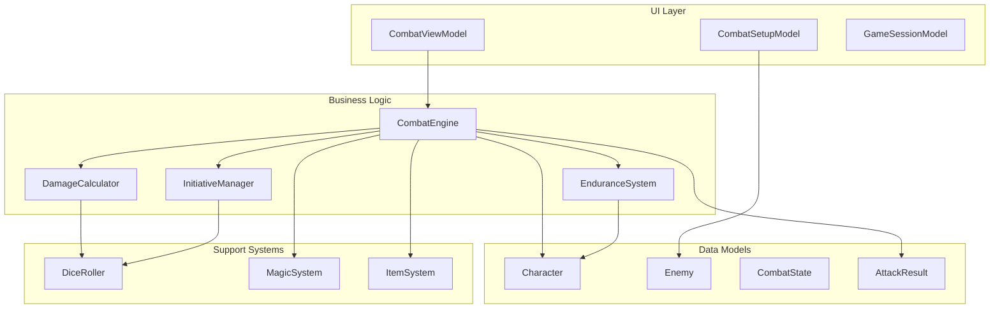

**Diagram sources**
- [internal/combat/combat.go](file://internal/combat/combat.go#L1-L50)
- [pkg/ui/combat_view.go](file://pkg/ui/combat_view.go#L1-L50)
- [internal/dice/dice.go](file://internal/dice/dice.go#L1-L30)

**Section sources**
- [internal/combat/combat.go](file://internal/combat/combat.go#L1-L100)
- [pkg/ui/combat_view.go](file://pkg/ui/combat_view.go#L1-L100)

## Core Components

### Combat State Management

The `CombatState` struct serves as the central hub for tracking combat progress:

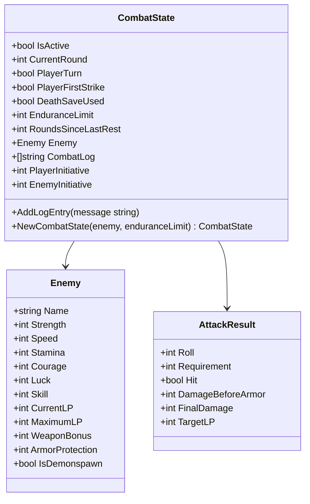

**Diagram sources**
- [internal/combat/combat.go](file://internal/combat/combat.go#L79-L116)
- [internal/combat/combat.go](file://internal/combat/combat.go#L11-L26)

### Dice Rolling System

The dice system provides deterministic randomness for testing while maintaining game unpredictability:

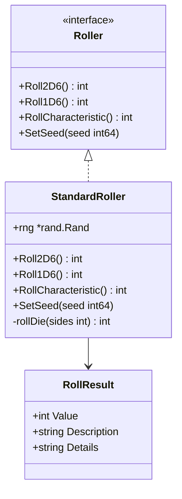

**Diagram sources**
- [internal/dice/dice.go](file://internal/dice/dice.go#L11-L27)

**Section sources**
- [internal/combat/combat.go](file://internal/combat/combat.go#L79-L116)
- [internal/dice/dice.go](file://internal/dice/dice.go#L11-L97)

## Combat Flow and Mechanics

### Turn-Based Resolution

The combat system operates on a strict turn-based model with clear phase transitions:

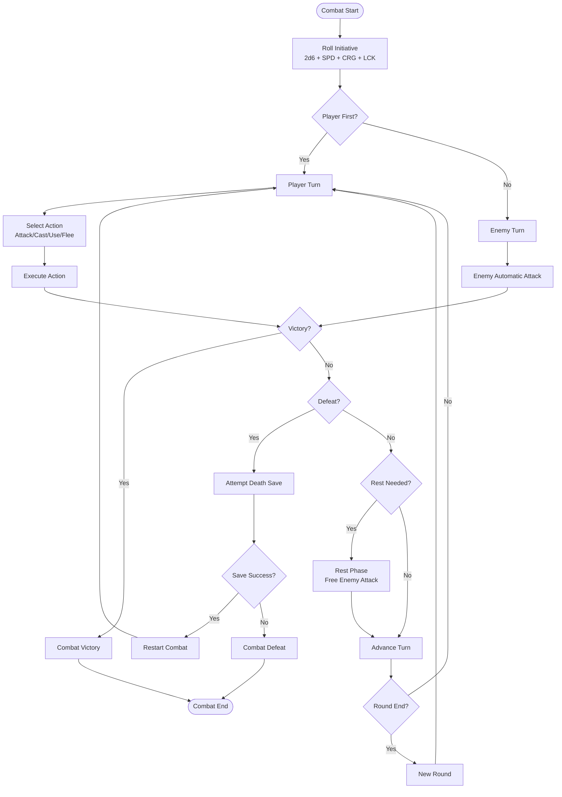

**Diagram sources**
- [internal/combat/combat.go](file://internal/combat/combat.go#L297-L383)
- [pkg/ui/combat_view.go](file://pkg/ui/combat_view.go#L78-L158)

### Action Types and Implementation

The combat system supports four primary actions with distinct mechanics:

| Action | Description | Combat Effects | Special Rules |
|--------|-------------|----------------|---------------|
| **Attack** | Standard melee attack | Damage calculation, potential blood price | Doombringer curse, The Orb doubling |
| **Cast Spell** | Magic spell casting | Spell effects, POW cost deduction | Natural inclination, FFR check |
| **Use Item** | Special item activation | Healing, equipment changes | Charge consumption |
| **Flee** | Combat escape attempt | Immediate exit | No victory condition |

**Section sources**
- [pkg/ui/combat_view.go](file://pkg/ui/combat_view.go#L161-L385)
- [internal/help/content/combat.txt](file://internal/help/content/combat.txt#L8-L25)

## Character Statistics and Derived Values

### Core Characteristics

The game defines seven core characteristics that form the foundation of combat abilities:

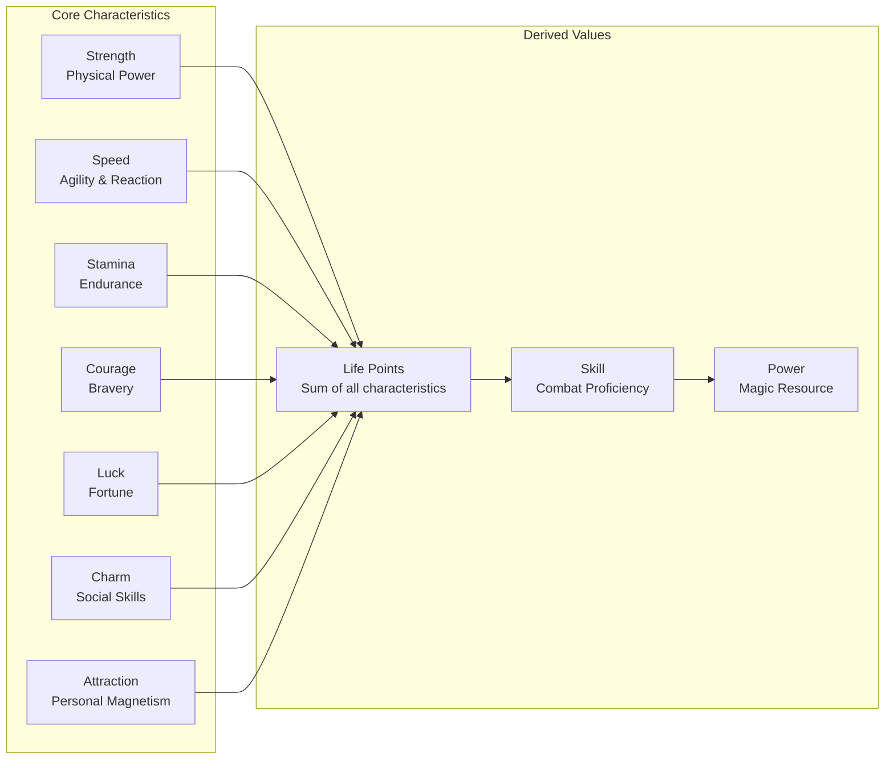

**Diagram sources**
- [internal/character/character.go](file://internal/character/character.go#L14-L35)
- [saga_demonspawn_ruleset.md](file://saga_demonspawn_ruleset.md#L5-L16)

### Stat Ranges and Impact

Each characteristic influences combat mechanics differently:

| Characteristic | Range | Combat Impact | Formula Application |
|----------------|-------|---------------|-------------------|
| **STR** | 16-96 | Damage bonus (STR ÷ 10 × 5) | Base damage calculation |
| **SPD** | 16-96 | Initiative modifier | +SPD to initiative rolls |
| **STA** | 16-96 | Endurance limit (STA ÷ 20) | Rest requirement calculation |
| **CRG** | 16-96 | Initiative modifier | +CRG to initiative rolls |
| **LCK** | 16-96 | To-hit modifier (-1 per 16 LCK) | Hit probability adjustment |
| **SKL** | 0-∞ | To-hit modifier (-1 per 10 SKL) | Experience-based hit improvement |

**Section sources**
- [internal/character/character.go](file://internal/character/character.go#L14-L35)
- [saga_demonspawn_ruleset.md](file://saga_demonspawn_ruleset.md#L158-L169)

## Damage Calculation System

### Player Damage Formula

The damage calculation follows the original gamebook mechanics with mathematical precision:

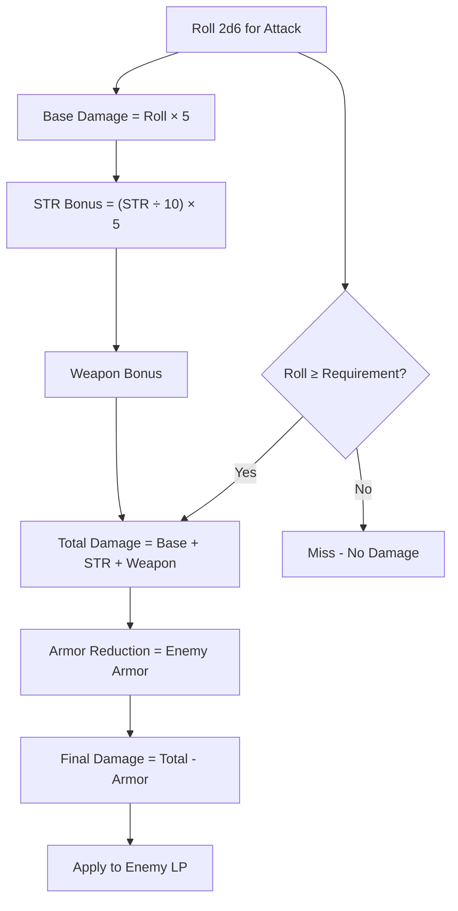

**Diagram sources**
- [internal/combat/combat.go](file://internal/combat/combat.go#L157-L174)

### Enemy Damage Calculation

Enemy attacks follow identical mechanics with character protection:

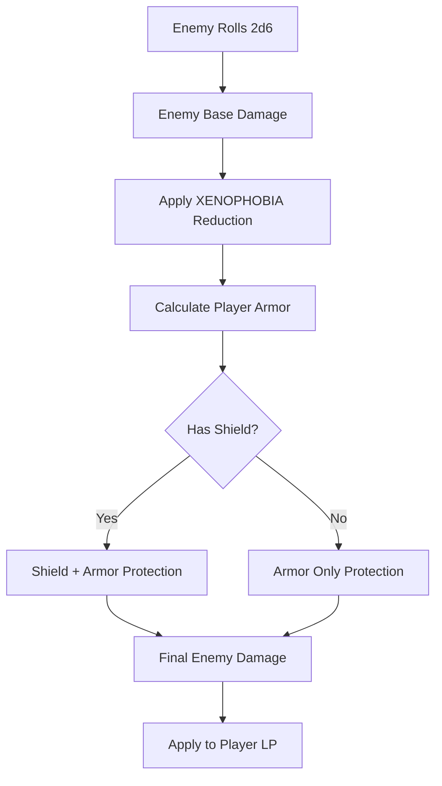

**Diagram sources**
- [internal/combat/combat.go](file://internal/combat/combat.go#L237-L295)

### Special Item Damage Modifications

Certain items modify damage calculations dynamically:

| Item | Effect | Calculation Impact |
|------|--------|-------------------|
| **Doombringer** | Blood price + soul thirst | -10 LP before attack, heal for damage dealt |
| **The Orb** | Double damage to Demonspawn | Damage × 2 when equipped and targeting Demonspawn |
| **ARMOUR Spell** | Damage reduction | +10 damage reduction to player |
| **XENOPHOBIA Spell** | Enemy damage reduction | -5 damage reduction from enemy |

**Section sources**
- [internal/combat/combat.go](file://internal/combat/combat.go#L157-L295)
- [internal/items/items.go](file://internal/items/items.go#L143-L149)

## Initiative and Turn Order

### Initiative Calculation

Initiative determines the first-strike advantage and turn order:

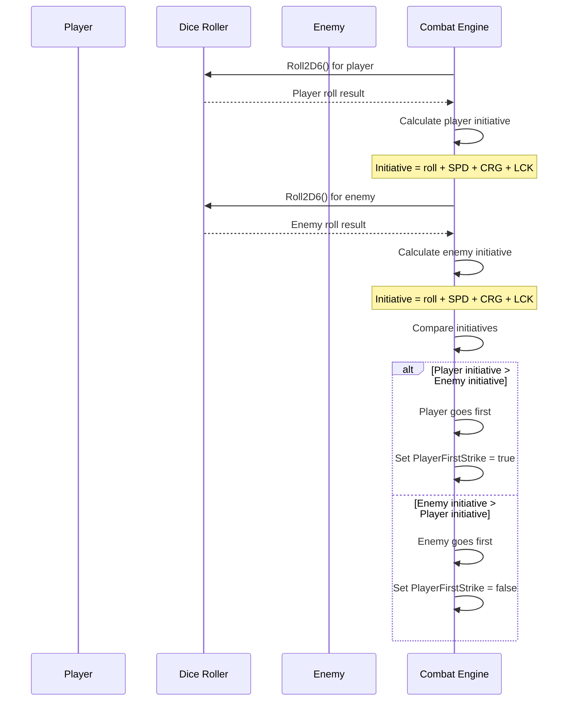

**Diagram sources**
- [internal/combat/combat.go](file://internal/combat/combat.go#L123-L133)

### Turn Alternation Logic

The system maintains strict turn alternation with round progression:

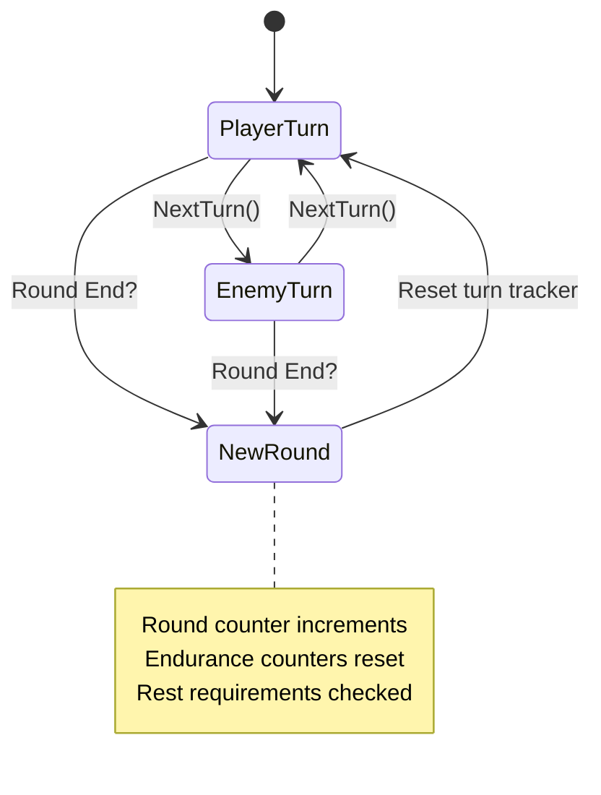

**Diagram sources**
- [internal/combat/combat.go](file://internal/combat/combat.go#L325-L336)

**Section sources**
- [internal/combat/combat.go](file://internal/combat/combat.go#L123-L133)
- [internal/combat/combat.go](file://internal/combat/combat.go#L325-L336)

## Special Items Integration

### Healing Stone System

The Healing Stone provides emergency healing with charge management:

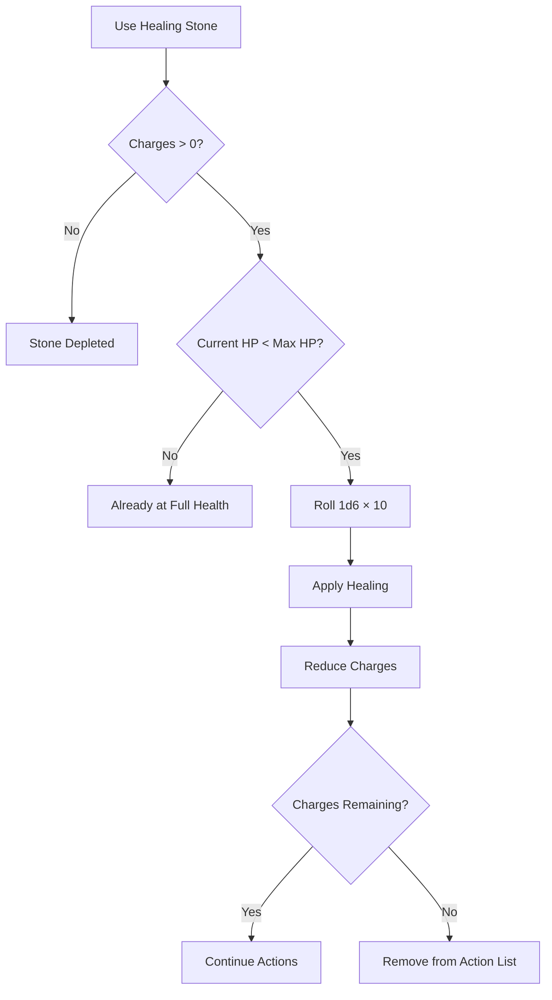

**Diagram sources**
- [pkg/ui/combat_view.go](file://pkg/ui/combat_view.go#L275-L322)

### Doombringer Weapon Mechanics

Doombringer introduces risk-reward dynamics with blood price and soul thirst:

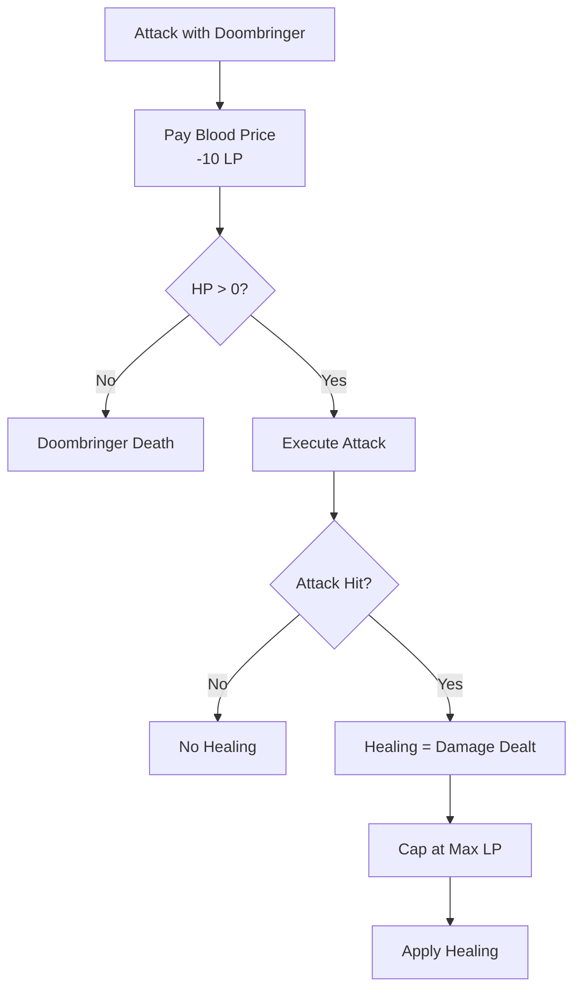

**Diagram sources**
- [pkg/ui/combat_view.go](file://pkg/ui/combat_view.go#L184-L261)

### The Orb Special Abilities

The Orb provides dual functionality with strategic depth:

| Ability | Condition | Effect | Outcome |
|---------|-----------|--------|---------|
| **Held** | Equipped in left hand | Double damage to Demonspawn | Damage × 2 after all reductions |
| **Thrown** | Combat situation | Demons: instant kill or 200 damage | Instant kill (4+ on 2d6) or 200 damage |
| **Thrown** | Non-Demonspawn | No effect | Orb destroyed, no damage |

**Section sources**
- [pkg/ui/combat_view.go](file://pkg/ui/combat_view.go#L275-L382)
- [pkg/ui/combat_view.go](file://pkg/ui/combat_view.go#L324-L378)
- [saga_demonspawn_ruleset.md](file://saga_demonspawn_ruleset.md#L77-L86)

## Magic System Integration

### Spell Effects in Combat

Magic spells integrate seamlessly with combat mechanics:

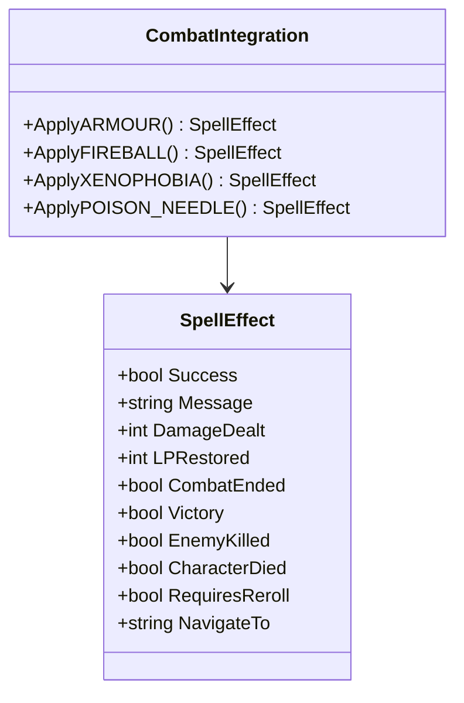

**Diagram sources**
- [internal/magic/effects.go](file://internal/magic/effects.go#L1-L47)

### Combat-Specific Spells

Several spells have specialized combat applications:

| Spell | Combat Effect | Integration Point | Duration |
|-------|---------------|-------------------|----------|
| **ARMOUR** | -10 incoming damage | Enemy attack calculation | Until section end |
| **FIREBALL** | 50 LP damage | Player attack resolution | Single use |
| **XENOPHOBIA** | -5 enemy damage | Enemy attack calculation | Until section end |
| **POISON NEEDLE** | 50% instant kill | Enemy attack resolution | Single use |
| **PARALYSIS** | Enemy immobilization | Enemy turn processing | Single use |

### Magic System Coordination

The magic system coordinates with combat through spell effect tracking:

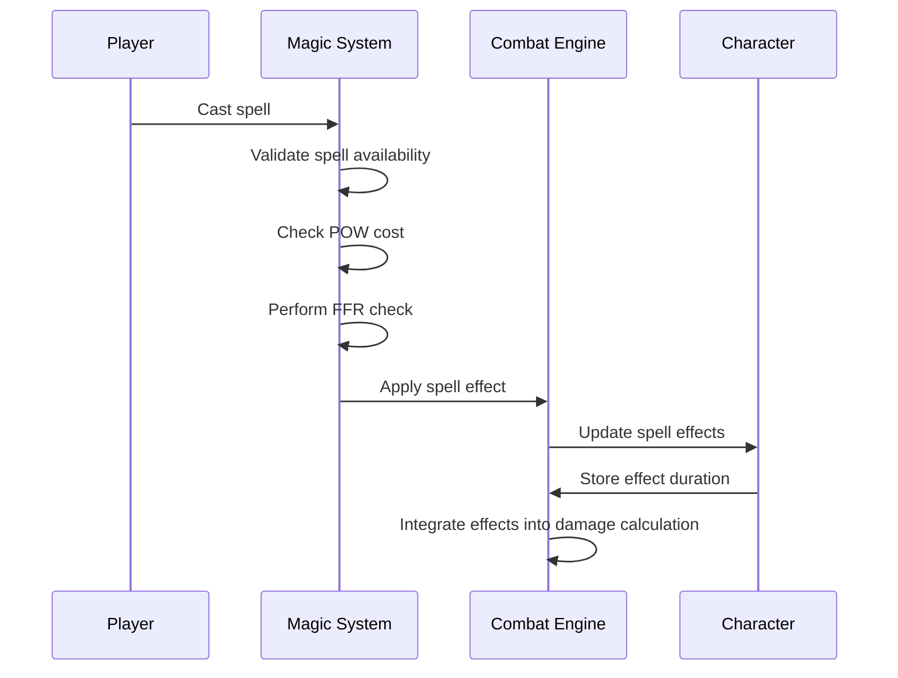

**Diagram sources**
- [internal/magic/effects.go](file://internal/magic/effects.go#L1-L47)
- [internal/combat/combat.go](file://internal/combat/combat.go#L256-L282)

**Section sources**
- [internal/magic/spells.go](file://internal/magic/spells.go#L1-L137)
- [internal/magic/effects.go](file://internal/magic/effects.go#L1-L47)
- [internal/combat/combat.go](file://internal/combat/combat.go#L256-L282)

## UI Implementation

### Combat View Model Architecture

The UI system uses Bubble Tea's MVU pattern for responsive combat interface:

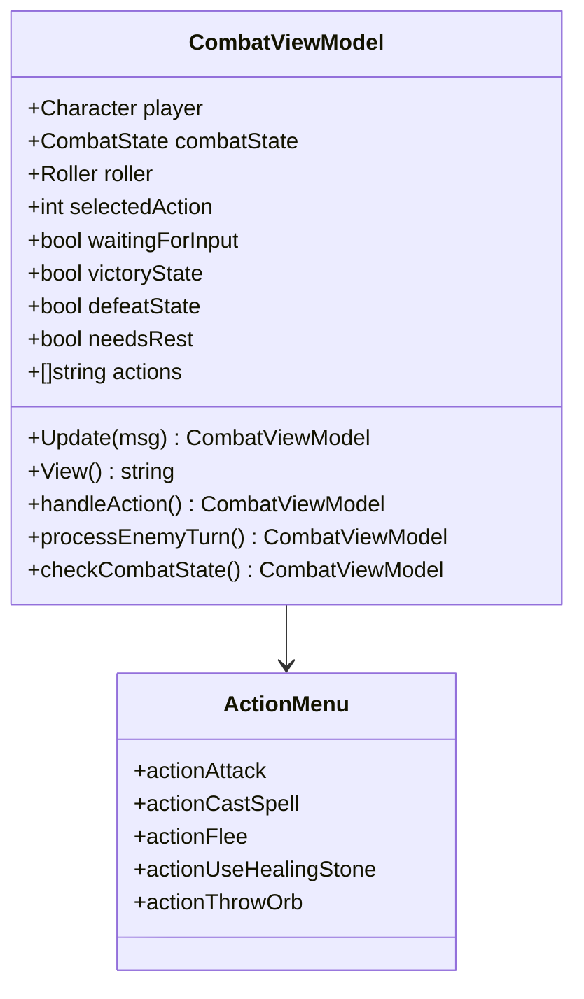

**Diagram sources**
- [pkg/ui/combat_view.go](file://pkg/ui/combat_view.go#L13-L75)

### Combat Interface Layout

The combat interface displays comprehensive information in organized sections:

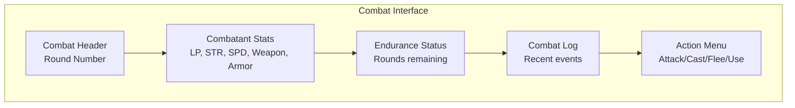

**Diagram sources**
- [pkg/ui/combat_view.go](file://pkg/ui/combat_view.go#L527-L627)

### Input Handling and Navigation

The UI supports keyboard navigation with clear visual feedback:

| Key | Action | Context | Effect |
|-----|--------|---------|--------|
| **↑/↓** | Navigate actions | During player turn | Change selected action |
| **Enter** | Confirm action | During player turn | Execute selected action |
| **Esc** | Back/Quit | Anytime | Return to previous screen |
| **?** | Help | Anytime | Show context-sensitive help |

**Section sources**
- [pkg/ui/combat_view.go](file://pkg/ui/combat_view.go#L78-L158)
- [pkg/ui/combat_view.go](file://pkg/ui/combat_view.go#L527-L627)

## Endurance and Rest System

### Stamina-Based Endurance

The endurance system tracks combat fatigue and rest requirements:

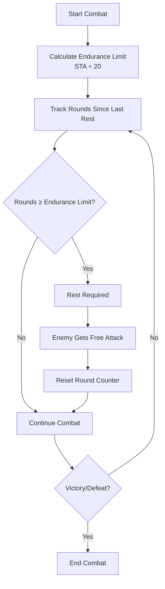

**Diagram sources**
- [internal/combat/combat.go](file://internal/combat/combat.go#L176-L186)

### Rest Mechanics

Rest provides temporary relief from combat fatigue:

| Scenario | Trigger | Effect | Duration |
|----------|---------|--------|----------|
| **Player Rest** | Stamina depletion | Free enemy attack | Single round |
| **Enemy Rest** | Enemy stamina depletion | Player free attack | Single round |
| **Combat End** | Victory/Defeat | Reset all counters | Permanent |

**Section sources**
- [internal/combat/combat.go](file://internal/combat/combat.go#L176-L186)
- [internal/combat/combat.go](file://internal/combat/combat.go#L338-L346)

## Death Saves and Victory Conditions

### Death Save Mechanics

The death save system provides a single chance at revival:

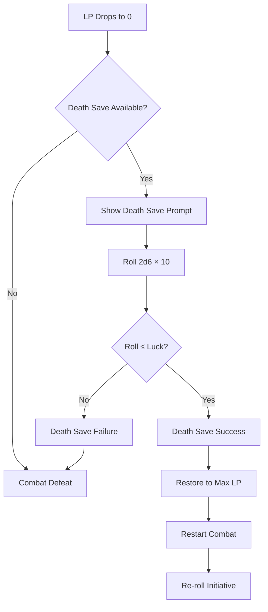

**Diagram sources**
- [internal/combat/combat.go](file://internal/combat/combat.go#L354-L382)

### Victory and Defeat Conditions

Combat termination occurs under specific conditions:

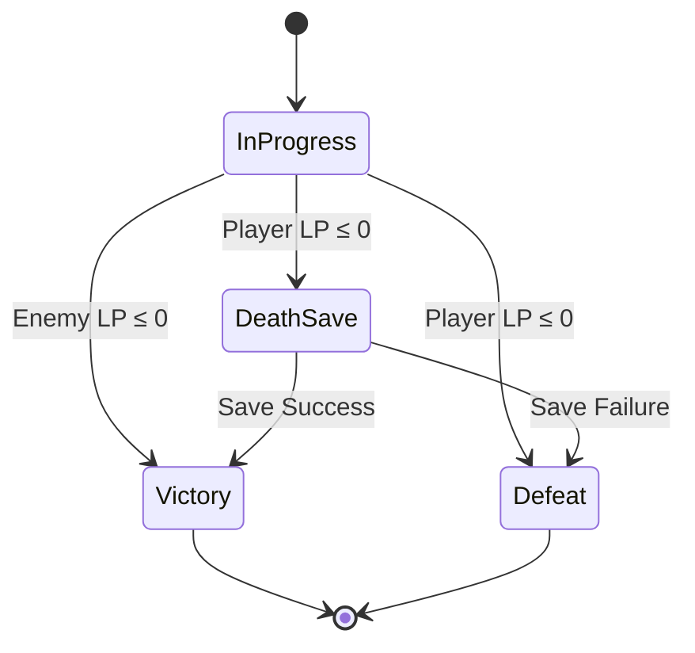

**Diagram sources**
- [internal/combat/combat.go](file://internal/combat/combat.go#L315-L323)

### Combat Resolution

Victory conditions trigger character progression:

| Condition | Outcome | Effects |
|-----------|---------|---------|
| **Enemy Defeated** | Victory achieved | Skill +1, Enemies defeated +1 |
| **Flee Combat** | Partial victory | No stat changes, immediate exit |
| **Death Save Success** | Resurrection | Full LP restored, combat restart |
| **Death Save Failure** | Defeat | Game over, character lost |

**Section sources**
- [internal/combat/combat.go](file://internal/combat/combat.go#L315-L382)
- [internal/combat/combat.go](file://internal/combat/combat.go#L348-L352)

## Testing and Validation

### Unit Testing Strategy

The combat system employs comprehensive testing across all components:

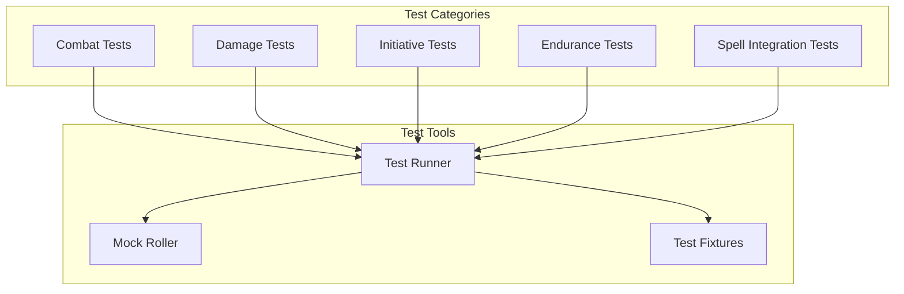

### Key Test Coverage Areas

| Component | Test Focus | Validation Criteria |
|-----------|------------|-------------------|
| **Damage Calculation** | Formula accuracy | Correct mathematical results |
| **Initiative Rolls** | Random distribution | Statistical fairness |
| **Endurance System** | Rest triggers | Proper timing and effects |
| **Death Saves** | Probability mechanics | Luck-based outcomes |
| **Spell Integration** | Effect application | Correct buff/debuff implementation |

**Section sources**
- [internal/combat/combat_test.go](file://internal/combat/combat_test.go)

## Performance Considerations

### Computational Efficiency

The combat system optimizes performance through several strategies:

- **Pre-calculated Constants**: Initiative and damage formulas are pre-computed where possible
- **Minimal Allocations**: String concatenation is minimized in hot paths
- **Efficient Data Structures**: Combat state uses compact, cache-friendly layouts
- **Lazy Evaluation**: Spell effects are only calculated when needed

### Memory Management

Memory usage is optimized through:
- **Object Pooling**: Reuse of frequently allocated objects
- **String Interning**: Shared string constants for UI text
- **Compact Serialization**: JSON serialization minimizes data size

### Scalability Factors

The system scales efficiently with:
- **Linear Complexity**: Most operations scale linearly with combat participants
- **Deterministic Execution**: Predictable performance across different scenarios
- **Modular Design**: Easy extension without performance degradation

## Troubleshooting Guide

### Common Combat Issues

| Problem | Symptoms | Cause | Solution |
|---------|----------|-------|----------|
| **Incorrect Damage** | Unexpected damage amounts | Math formula error | Verify damage calculation logic |
| **Initiative Problems** | Wrong turn order | Initiative calculation bug | Check SPD/CRG/LCK addition |
| **Death Save Failures** | Too many/little deaths | Luck comparison error | Validate 2d6×10 vs Luck logic |
| **Endurance Issues** | Rest not triggering | Counter logic error | Review round counting |
| **Spell Effects** | Spells not applying | Effect tracking bug | Check spell effect storage |

### Debugging Combat Scenarios

For combat debugging, examine these key areas:

1. **Combat State**: Verify all state fields contain expected values
2. **Roll Results**: Check dice roll outcomes match expectations
3. **Calculation Steps**: Trace damage and initiative calculations
4. **Effect Application**: Confirm spell effects are properly applied
5. **Turn Logic**: Validate turn alternation and round progression

### Performance Issues

Common performance bottlenecks and solutions:

- **Excessive Logging**: Reduce combat log verbosity in production
- **String Operations**: Minimize string concatenation in loops
- **Memory Allocation**: Use object pools for frequently allocated objects
- **Algorithm Complexity**: Review nested loops in combat calculations

**Section sources**
- [internal/combat/combat.go](file://internal/combat/combat.go#L1-L383)
- [pkg/ui/combat_view.go](file://pkg/ui/combat_view.go#L1-L653)