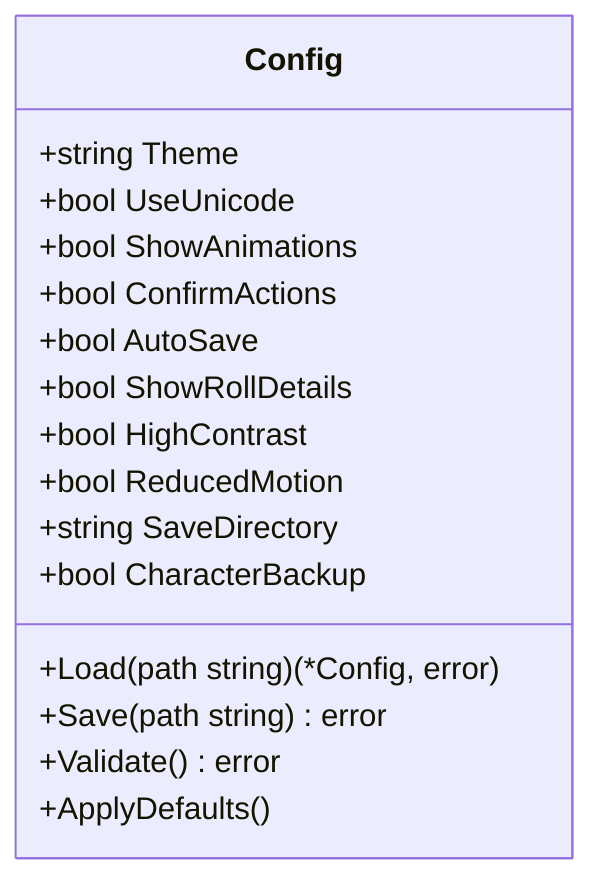
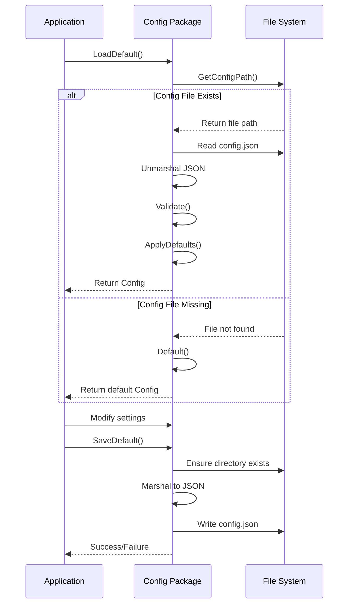
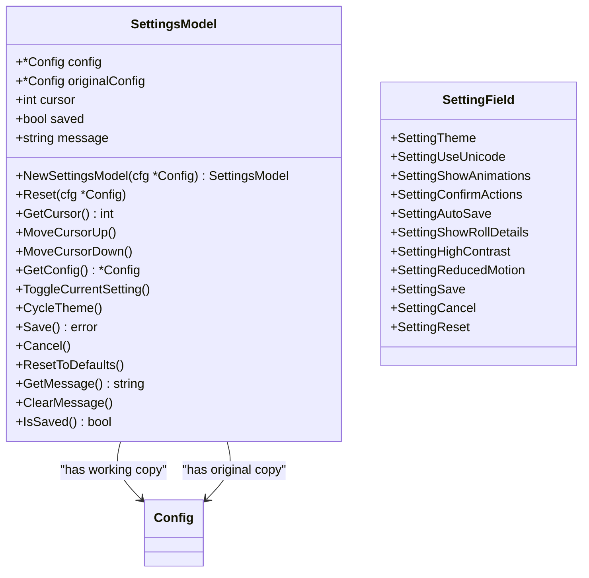
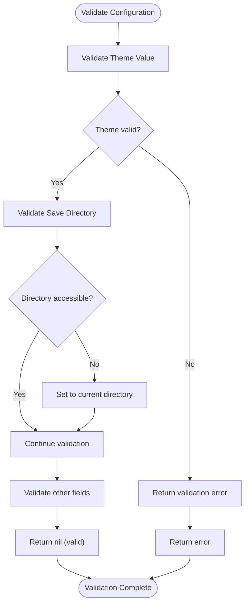
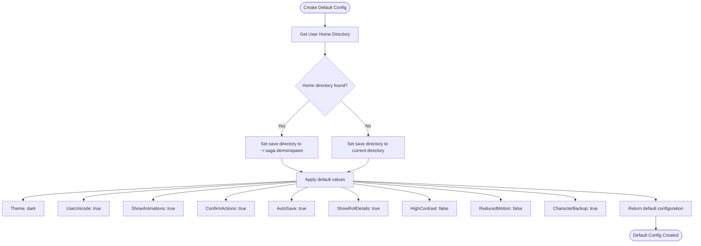
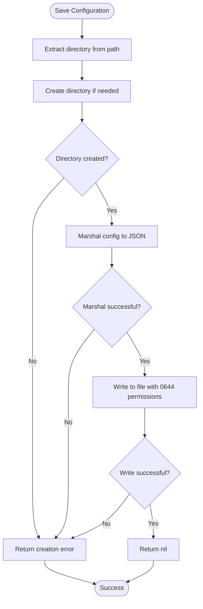
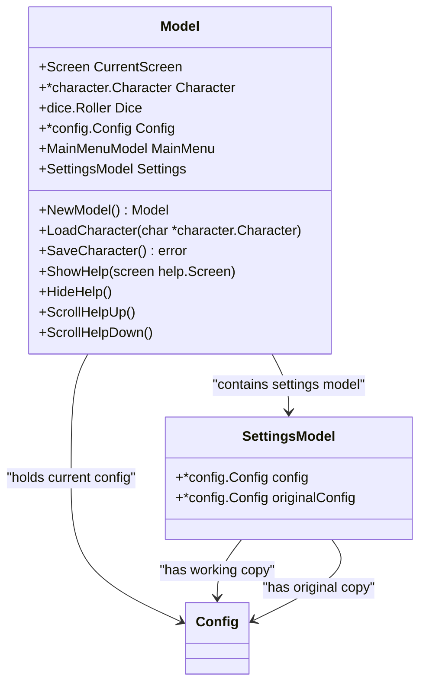
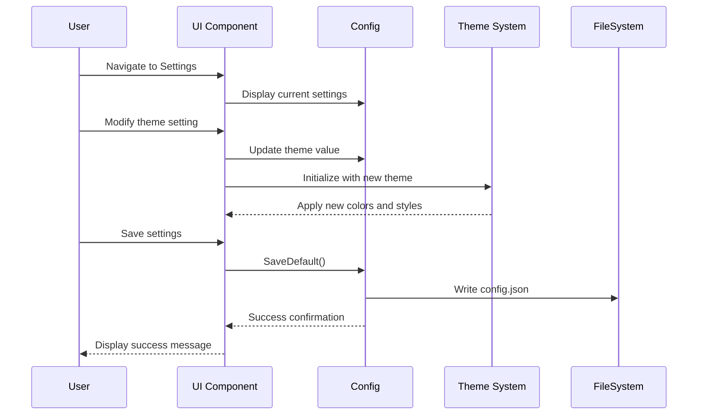
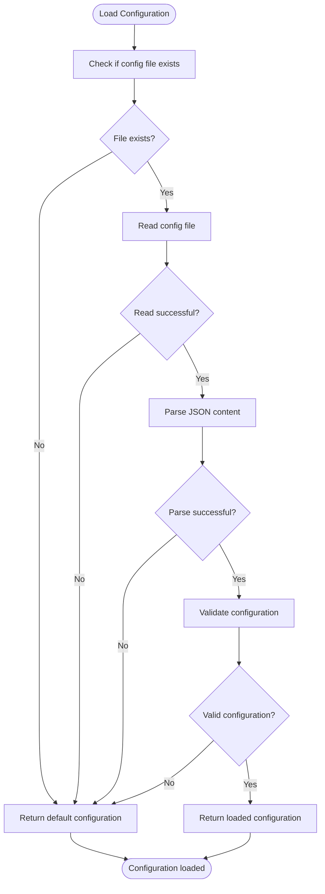

# Configuration System

<cite>
**Referenced Files in This Document**   
- [config.go](file://internal/config/config.go)
- [settings.go](file://pkg/ui/settings.go)
- [model.go](file://pkg/ui/model.go)
- [update.go](file://pkg/ui/update.go)
- [view.go](file://pkg/ui/view.go)
</cite>

## Table of Contents
1. [Introduction](#introduction)
2. [Configuration Structure](#configuration-structure)
3. [Configuration Lifecycle](#configuration-lifecycle)
4. [Settings Interface](#settings-interface)
5. [Configuration Validation](#configuration-validation)
6. [Default Configuration](#default-configuration)
7. [File System Integration](#file-system-integration)
8. [Runtime Configuration Management](#runtime-configuration-management)
9. [User Interface Integration](#user-interface-integration)
10. [Error Handling](#error-handling)

## Introduction
The configuration system in the Sagas of the Demonspawn application provides a comprehensive mechanism for managing user preferences and application settings. This system enables users to customize their experience through various appearance, gameplay, accessibility, and file management options. The configuration is persisted across sessions and integrated throughout the application's user interface and functionality.

**Section sources**
- [config.go](file://internal/config/config.go#L1-L156)
- [README.md](file://README.md#L93-L108)

## Configuration Structure
The configuration system is built around the Config struct which organizes settings into logical categories:

**Diagram sources**
- [config.go](file://internal/config/config.go#L11-L30)

The configuration includes settings across four main categories:

### Appearance Settings
- **Theme**: Color scheme selection ("dark", "light", or "custom")
- **UseUnicode**: Enables Unicode characters vs ASCII fallback
- **ShowAnimations**: Controls visual transitions and effects

### Gameplay Settings
- **ConfirmActions**: Requires confirmation for potentially risky actions
- **AutoSave**: Automatically saves character data on application exit
- **ShowRollDetails**: Displays detailed breakdowns of dice roll calculations

### Accessibility Settings
- **HighContrast**: Enhances visual contrast for better visibility
- **ReducedMotion**: Reduces or eliminates visual effects for motion sensitivity

### File Settings
- **SaveDirectory**: Specifies the location for character save files
- **CharacterBackup**: Creates timestamped backups of character files

**Section sources**
- [config.go](file://internal/config/config.go#L11-L30)

## Configuration Lifecycle
The configuration system follows a complete lifecycle from initialization to persistence, ensuring settings are properly managed throughout the application's execution.

**Diagram sources**
- [config.go](file://internal/config/config.go#L54-L101)
- [config.go](file://internal/config/config.go#L147-L155)

**Section sources**
- [config.go](file://internal/config/config.go#L54-L155)

## Settings Interface
The settings interface provides a user-friendly way to modify configuration options through the application's UI. The SettingsModel struct manages the state of the settings screen, maintaining both working and original configuration copies to support cancel operations.

**Diagram sources**
- [settings.go](file://pkg/ui/settings.go#L24-L31)
- [settings.go](file://pkg/ui/settings.go#L8-L22)

**Section sources**
- [settings.go](file://pkg/ui/settings.go#L1-L162)

## Configuration Validation
The configuration system includes robust validation to ensure settings integrity and prevent invalid states. The Validate method checks critical configuration values and attempts to recover from potential issues.

**Diagram sources**
- [config.go](file://internal/config/config.go#L103-L124)

**Section sources**
- [config.go](file://internal/config/config.go#L103-L124)

## Default Configuration
The system provides sensible default values for all configuration options, ensuring a functional experience even when no configuration file exists. The Default function creates a configuration with recommended settings based on typical user preferences.

**Diagram sources**
- [config.go](file://internal/config/config.go#L32-L52)

**Section sources**
- [config.go](file://internal/config/config.go#L32-L52)

## File System Integration
The configuration system integrates with the file system to persist settings between application sessions. Configuration files are stored in a user-specific directory with proper directory creation and file permissions.

**Diagram sources**
- [config.go](file://internal/config/config.go#L83-L101)

**Section sources**
- [config.go](file://internal/config/config.go#L83-L101)

## Runtime Configuration Management
The application manages configuration at runtime through the main Model struct, which holds a reference to the current configuration and integrates it with the application state. This allows for dynamic updates and theme changes during execution.

**Diagram sources**
- [model.go](file://pkg/ui/model.go#L40-L67)

**Section sources**
- [model.go](file://pkg/ui/model.go#L40-L174)

## User Interface Integration
The configuration system is tightly integrated with the user interface, allowing settings to be modified through the Settings screen and immediately reflected in the application's appearance and behavior. The UI components respond to configuration changes, particularly theme and Unicode settings.

**Diagram sources**
- [update.go](file://pkg/ui/update.go#L678-L724)
- [view.go](file://pkg/ui/view.go#L543-L634)

**Section sources**
- [update.go](file://pkg/ui/update.go#L678-L724)
- [view.go](file://pkg/ui/view.go#L543-L634)

## Error Handling
The configuration system implements comprehensive error handling to ensure application stability even when configuration operations fail. The system gracefully degrades to default settings when configuration files cannot be read or validated.

**Diagram sources**
- [config.go](file://internal/config/config.go#L54-L81)

**Section sources**
- [config.go](file://internal/config/config.go#L54-L81)