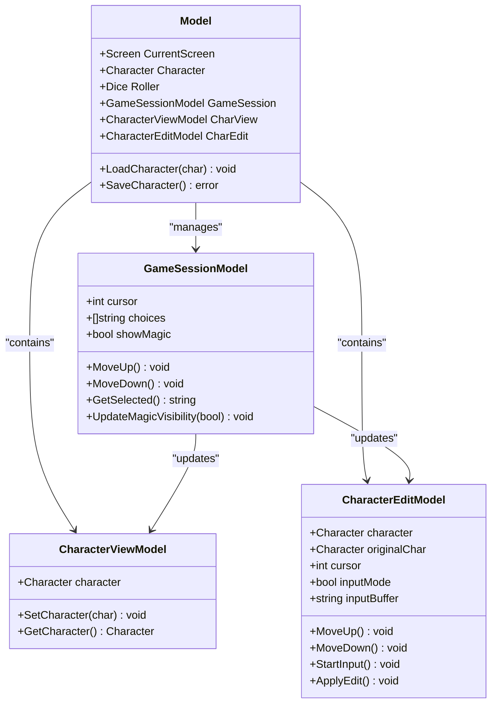
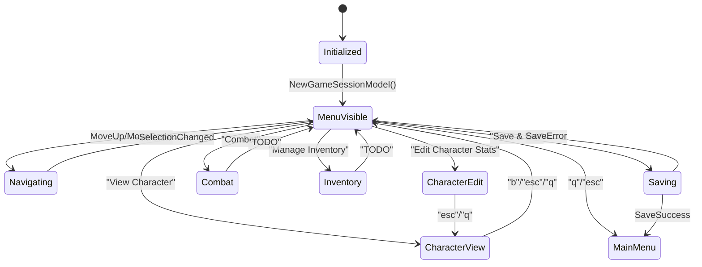
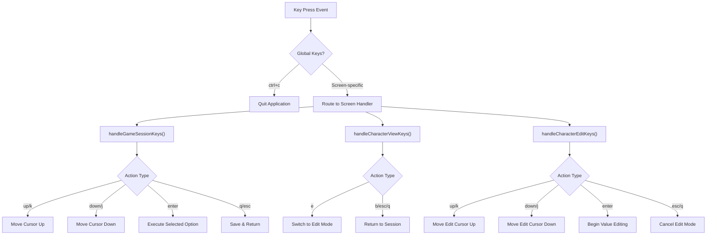
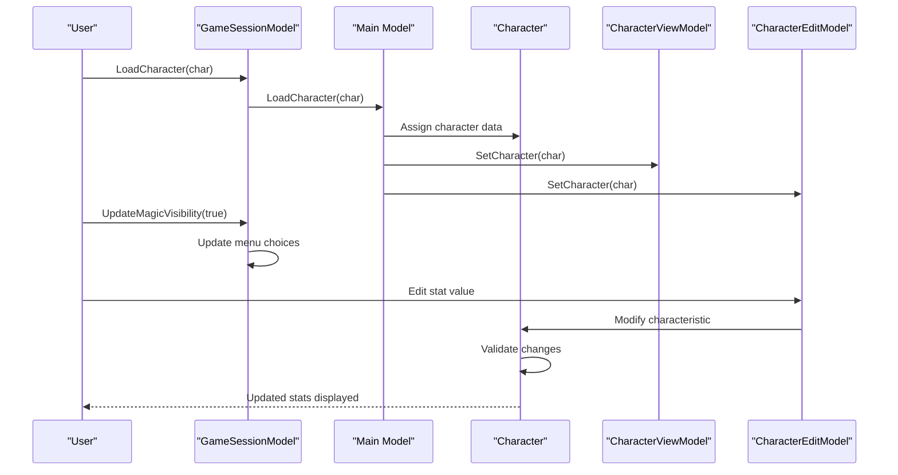
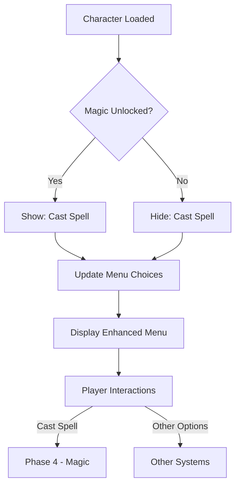

# Game Session Controls

<cite>
**Referenced Files in This Document**
- [game_session.go](file://pkg/ui/game_session.go)
- [model.go](file://pkg/ui/model.go)
- [update.go](file://pkg/ui/update.go)
- [character.go](file://internal/character/character.go)
- [character_view.go](file://pkg/ui/character_view.go)
- [character_edit.go](file://pkg/ui/character_edit.go)
- [README.md](file://README.md)
</cite>

## Table of Contents
1. [Introduction](#introduction)
2. [Game Session Architecture](#game-session-architecture)
3. [GameSessionModel Implementation](#gamesessionmodel-implementation)
4. [Keyboard Controls](#keyboard-controls)
5. [Screen Transitions](#screen-transitions)
6. [Character Data Management](#character-data-management)
7. [Magic System Integration](#magic-system-integration)
8. [Common Issues and Troubleshooting](#common-issues-and-troubleshooting)
9. [Best Practices](#best-practices)
10. [Conclusion](#conclusion)

## Introduction

The game session controls in the saga-demonspawn application provide the primary interface for managing and interacting with player characters after they've been loaded or created. Built using the Bubble Tea framework, this system implements a menu-driven interface that allows players to navigate between different game features including character management, combat preparation, inventory management, and saving progress.

The game session serves as the central hub of the application, offering five core functionalities: viewing character statistics, editing character stats, engaging in combat (Phase 2), managing inventory (Phase 3), and casting spells (Phase 4). The interface is designed to be intuitive and keyboard-driven, following the conventions established in the original gamebook series.

## Game Session Architecture

The game session system follows the Elm Architecture pattern through the Bubble Tea framework, maintaining immutable state through a centralized Model structure. The architecture consists of several interconnected components that work together to provide a seamless user experience.

**Diagram sources**
- [model.go](file://pkg/ui/model.go#L33-L75)
- [game_session.go](file://pkg/ui/game_session.go#L4-L77)
- [character_view.go](file://pkg/ui/character_view.go#L6-L26)
- [character_edit.go](file://pkg/ui/character_edit.go#L24-L173)

**Section sources**
- [model.go](file://pkg/ui/model.go#L33-L75)
- [game_session.go](file://pkg/ui/game_session.go#L4-L77)

## GameSessionModel Implementation

The GameSessionModel serves as the core controller for the game session menu, managing cursor navigation, menu choices, and dynamic content updates based on character progression.

### Core Structure and Initialization

The GameSessionModel maintains three primary state variables: cursor position for navigation, a slice of menu choices, and a boolean flag for magic system visibility. The model supports dynamic menu construction based on character capabilities.

**Diagram sources**
- [game_session.go](file://pkg/ui/game_session.go#L10-L23)
- [update.go](file://pkg/ui/update.go#L183-L218)

### Dynamic Menu Construction

The game session menu adapts dynamically based on character progression, particularly the unlocking of magic abilities. The `UpdateMagicVisibility` method rebuilds the menu choices array to include or exclude the "Cast Spell" option.

**Section sources**
- [game_session.go](file://pkg/ui/game_session.go#L25-L47)
- [update.go](file://pkg/ui/update.go#L99-L100)

### Navigation Methods

The model provides four essential navigation methods that enable smooth cursor movement through the menu options:

- **MoveUp()**: Decrements the cursor position when not at the top of the menu
- **MoveDown()**: Increments the cursor position when not at the bottom of the menu
- **GetSelected()**: Returns the currently highlighted menu option
- **GetCursor()**: Provides the current cursor position for external use

**Section sources**
- [game_session.go](file://pkg/ui/game_session.go#L49-L77)

## Keyboard Controls

The game session implements a comprehensive keyboard control system that follows established conventions for terminal applications while incorporating game-specific shortcuts.

### Standard Navigation Keys

| Key Combination | Action | Description |
|----------------|--------|-------------|
| `↑` / `k` | Move Up | Navigate cursor to previous menu item |
| `↓` / `j` | Move Down | Navigate cursor to next menu item |
| `Enter` | Select | Activate the currently selected menu option |
| `Esc` / `q` | Quit/Back | Return to previous screen or exit |

### Game-Specific Shortcuts

| Key | Action | Context | Description |
|-----|--------|---------|-------------|
| `v` | View Character | Character View Screen | Switch to character statistics view |
| `e` | Edit Stats | Character View Screen | Enter character editing mode |
| `b` | Back | Character View/Edit Screens | Return to game session menu |

### Control Flow Implementation

The keyboard control system operates through a centralized message routing mechanism that directs keypresses to the appropriate screen handler based on the current application state.

**Diagram sources**
- [update.go](file://pkg/ui/update.go#L32-L56)
- [update.go](file://pkg/ui/update.go#L183-L232)

**Section sources**
- [update.go](file://pkg/ui/update.go#L183-L232)

## Screen Transitions

The game session facilitates smooth transitions between different screens through a centralized state management system. Each transition involves updating the CurrentScreen field and potentially preparing associated models with relevant data.

### Transition Matrix

| From Screen | To Screen | Trigger | Action |
|-------------|-----------|---------|---------|
| Game Session | Character View | "View Character" | Set character data, switch screen |
| Game Session | Character Edit | "Edit Character Stats" | Set character data, enter input mode |
| Game Session | Combat | "Combat" | Placeholder (Phase 2) |
| Game Session | Inventory | "Manage Inventory" | Placeholder (Phase 3) |
| Game Session | Magic | "Cast Spell" | Placeholder (Phase 4) |
| Game Session | Main Menu | "Save & Exit" | Save character, return to main |
| Character View | Character Edit | "e" | Enter edit mode |
| Character View | Game Session | "b"/"esc"/"q" | Return to session |
| Character Edit | Character View | "esc"/"q" | Cancel edits, return to view |

### Character Loading and Preparation

When transitioning from character loading to the game session, the system performs several critical operations to prepare the character for gameplay:

1. **Character Assignment**: The loaded character is assigned to the Model.Character field
2. **Screen Transition**: CurrentScreen is set to ScreenGameSession
3. **Model Updates**: Both CharView and CharEdit models receive the character data
4. **Magic Visibility**: The game session updates its magic visibility based on character capabilities

**Section sources**
- [model.go](file://pkg/ui/model.go#L78-L84)
- [update.go](file://pkg/ui/update.go#L98-L100)

## Character Data Management

The game session maintains tight integration with character data through multiple specialized models that handle different aspects of character interaction and modification.

### Character State Persistence

Character data flows through several layers of abstraction, ensuring data integrity and providing appropriate access patterns for different use cases:

**Diagram sources**
- [model.go](file://pkg/ui/model.go#L78-L84)
- [character_edit.go](file://pkg/ui/character_edit.go#L58-L62)
- [game_session.go](file://pkg/ui/game_session.go#L26-L47)

### Data Access Patterns

The character data management system employs several access patterns to ensure efficient and safe data manipulation:

**Read-Only Access**: CharacterViewModel provides read-only access to character data for display purposes, preventing accidental modifications during view operations.

**Editable Access**: CharacterEditModel maintains a separate character reference with input buffering capabilities, allowing for temporary modifications that can be committed or canceled.

**Validation Layer**: All character modifications pass through validation functions that ensure data integrity and prevent invalid states.

**Section sources**
- [character_view.go](file://pkg/ui/character_view.go#L17-L26)
- [character_edit.go](file://pkg/ui/character_edit.go#L58-L62)
- [character.go](file://internal/character/character.go#L101-L111)

## Magic System Integration

The game session demonstrates sophisticated integration with the magic system, showcasing how game progression affects available functionality and user interface presentation.

### Dynamic Feature Availability

The magic system integration operates through a visibility flag that controls the inclusion of magic-related options in the game session menu. This approach ensures that players only see available features based on their character's current capabilities.

**Diagram sources**
- [game_session.go](file://pkg/ui/game_session.go#L26-L47)
- [update.go](file://pkg/ui/update.go#L99-L100)

### Magic Unlock Mechanism

The magic system becomes available through the character's progression in the game, triggering automatic updates to the game session interface. This integration demonstrates the reactive nature of the Bubble Tea architecture, where state changes automatically propagate to the user interface.

**Section sources**
- [game_session.go](file://pkg/ui/game_session.go#L26-L47)
- [update.go](file://pkg/ui/update.go#L99-L100)

## Common Issues and Troubleshooting

Understanding common issues and their solutions helps users navigate the game session controls effectively and resolve potential problems quickly.

### Unresponsive Controls

**Symptom**: Keyboard inputs don't register or produce expected results
**Causes**: 
- Incorrect screen context (trying to use character edit shortcuts in game session)
- Terminal input capture issues
- Application state corruption

**Solutions**:
- Verify current screen context using visual indicators
- Use `Esc` or `q` to return to main menu and restart
- Check terminal capabilities and input modes

### Unexpected Screen Transitions

**Symptom**: Application jumps to unexpected screens or gets stuck in loops
**Causes**:
- Character data corruption affecting state management
- Improper key combinations triggering unintended actions
- Screen transition logic errors

**Solutions**:
- Save character regularly to prevent data loss
- Use consistent key combinations for navigation
- Restart application if state becomes corrupted

### Character Data Issues

**Symptom**: Character stats appear incorrect or inconsistent
**Causes**:
- Input validation failures during character editing
- Concurrent modification of character data
- Serialization/deserialization errors

**Solutions**:
- Use the character view screen to verify current stats
- Perform character edits carefully with validation
- Regular character saves to prevent data loss

### Performance Considerations

**Memory Usage**: The game session maintains multiple character instances for different purposes, which can impact memory usage with frequent character switching.

**Rendering Performance**: Complex character data with many modifications may impact rendering performance, though this is generally minimal in practice.

**Section sources**
- [update.go](file://pkg/ui/update.go#L280-L328)

## Best Practices

Following established best practices ensures optimal user experience and prevents common pitfalls when using the game session controls.

### Effective Navigation

**Menu Navigation**: Use arrow keys (`↑`/`↓`) or vim-style navigation (`k`/`j`) for smooth menu browsing. The `Enter` key activates selected options, while `Esc` or `q` provides consistent back navigation.

**Character Management**: Utilize the `v` shortcut in character view mode to quickly access the character sheet, and `e` to enter editing mode for stat modifications.

**Progression Awareness**: Pay attention to menu changes that reflect character progression, such as the appearance of "Cast Spell" when magic becomes available.

### Data Management

**Regular Saves**: Use the "Save & Exit" option frequently to prevent data loss from unexpected terminations.

**Backup Strategies**: Consider manual backups of character files before major modifications.

**Validation Checks**: Verify character stats through the view screen before making significant changes.

### Error Prevention

**Input Validation**: Be mindful of character limits and valid ranges when editing stats.

**Consistent Navigation**: Use standardized key combinations to avoid accidentally triggering unwanted actions.

**State Monitoring**: Watch for visual indicators that confirm successful state transitions.

## Conclusion

The game session controls in saga-demonspawn provide a robust and intuitive interface for managing player characters within the gamebook framework. Through careful implementation of the Bubble Tea architecture, the system delivers responsive navigation, dynamic feature availability, and seamless integration with character progression systems.

The keyboard-driven design emphasizes accessibility and efficiency, allowing experienced players to navigate complex character management tasks with minimal cognitive overhead. The dynamic menu system ensures that players always see relevant options based on their character's current capabilities, creating a cohesive and immersive gaming experience.

As the application progresses through its planned phases, the game session foundation provides a solid base for integrating advanced features like combat, inventory management, and magic systems while maintaining the core usability principles that make the interface effective for both new and experienced users.

The modular architecture ensures that future enhancements can be integrated smoothly, preserving the existing user experience while expanding the game's capabilities. This design philosophy reflects the broader goals of the saga-demonspawn project as both a functional game companion and an educational demonstration of modern Go development practices.