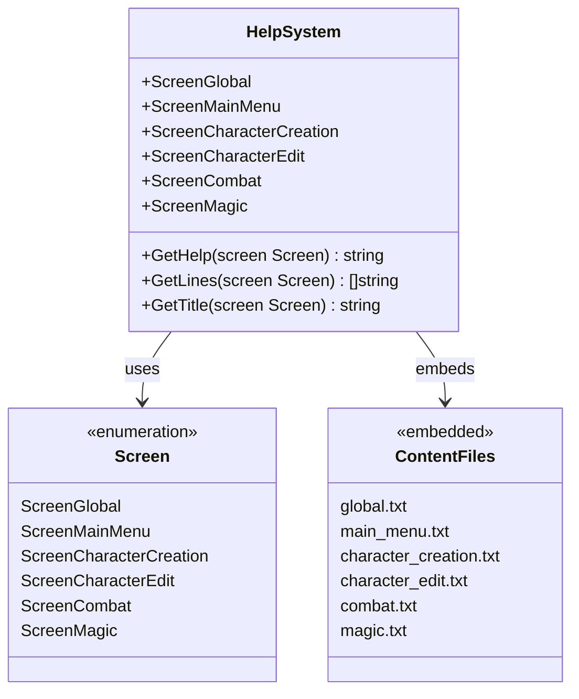
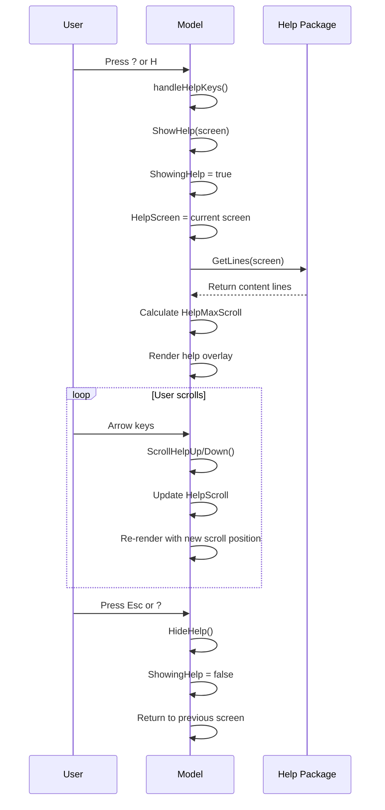

# Help System

<cite>
**Referenced Files in This Document**   
- [help.go](file://internal/help/help.go)
- [model.go](file://pkg/ui/model.go)
- [main_menu.txt](file://internal/help/content/main_menu.txt)
- [global.txt](file://internal/help/content/global.txt)
- [character_creation.txt](file://internal/help/content/character_creation.txt)
- [character_edit.txt](file://internal/help/content/character_edit.txt)
- [combat.txt](file://internal/help/content/combat.txt)
- [magic.txt](file://internal/help/content/magic.txt)
- [README.md](file://README.md)
</cite>

## Table of Contents
1. [Introduction](#introduction)
2. [Help System Architecture](#help-system-architecture)
3. [Context-Sensitive Help Screens](#context-sensitive-help-screens)
4. [Comprehensive Help Guide](#comprehensive-help-guide)
5. [UI Integration](#ui-integration)
6. [Content Management](#content-management)
7. [User Interaction](#user-interaction)
8. [Conclusion](#conclusion)

## Introduction

The Help System in the Sagas of the Demonspawn application provides comprehensive, context-sensitive assistance to players navigating the gamebook companion app. Designed as a critical user support feature, the system delivers targeted guidance for each application screen while also offering a complete reference guide covering all game mechanics. The system was implemented as part of Phase 5 (Polish) of the application development, completing the full feature set of this rules engine companion.

The help functionality serves multiple purposes: onboarding new users to the application's keyboard-driven interface, explaining complex game mechanics like combat calculations and spell casting, and providing quick reference for character management and inventory systems. With the gamebook's intricate ruleset, the help system acts as an essential companion, ensuring players can focus on their adventure rather than memorizing mechanics.

**Section sources**
- [README.md](file://README.md#L52-L58)
- [help.go](file://internal/help/help.go#L1-L5)

## Help System Architecture

The Help System follows a modular architecture with clear separation between content storage, retrieval logic, and UI presentation. The system is implemented across two primary packages: `internal/help` for content management and `pkg/ui` for user interface integration.

The core of the system resides in `internal/help/help.go`, which defines the `Screen` type as an enumeration of all application screens that require context-specific help. Each screen constant corresponds to a specific UI state, enabling precise content delivery based on the user's current location in the application. The help content itself is embedded directly into the binary using Go's `//go:embed` directive, which reads text files from the `internal/help/content/` directory at compile time. This approach eliminates runtime file I/O operations and ensures all help content is packaged with the application.

Content retrieval is handled by three primary functions: `GetHelp()`, `GetLines()`, and `GetTitle()`. The `GetHelp()` function uses a switch statement to return the appropriate embedded content based on the requested screen. The `GetLines()` function processes this content by splitting it into individual lines for scrolling functionality, while `GetTitle()` provides appropriate header text for the help modal. This architecture ensures efficient content delivery with minimal memory overhead.

```mermaid
graph TD
A[UI Component] --> B[ShowHelp(screen)]
B --> C{Model.ShowingHelp = true}
C --> D[Set HelpScreen = screen]
D --> E[Calculate HelpMaxScroll]
E --> F[Render Help Overlay]
F --> G[User Interacts with Help]
G --> H{Press Esc or ?}
H --> I[HideHelp()]
I --> J[Return to Previous Screen]
K[Embedded Content Files] --> L[help.go]
L --> M[GetHelp(Screen)]
M --> N[Return Content String]
N --> E
```

**Diagram sources**
- [help.go](file://internal/help/help.go#L1-L90)
- [model.go](file://pkg/ui/model.go#L69-L72)

**Section sources**
- [help.go](file://internal/help/help.go#L1-L90)
- [model.go](file://pkg/ui/model.go#L69-L72)

## Context-Sensitive Help Screens

The Help System implements context-sensitive assistance through seven dedicated help screens, each tailored to a specific application state. This targeted approach ensures users receive relevant information precisely when needed, rather than being overwhelmed with comprehensive documentation at inappropriate times.

The system defines the following screen-specific help content:
- **Main Menu Help**: Guides users through the initial navigation options (New Character, Load Character, Settings, Help, Exit) with keyboard shortcuts for each action
- **Character Creation Help**: Step-by-step instructions for rolling characteristics (2d6 × 8), selecting starting equipment, and understanding the color-coded stat evaluation system
- **Character Edit Help**: Detailed guidance on modifying character statistics, including field navigation, value ranges, and the magic system unlock procedure (press 'U')
- **Combat Help**: Comprehensive combat mechanics including initiative calculation, to-hit requirements, damage formulas, and death save rules
- **Magic System Help**: Spell casting process, POW management, natural inclination checks, fundamental failure rate, and spell restrictions
- **Global Help**: Comprehensive reference covering all game systems, rules, and formulas
- **Default Help**: Generic message for screens without specific help content

Each context-sensitive help screen is designed with consistent formatting, using section headers, bullet points, and clear explanations of both application navigation and underlying game mechanics. The content is optimized for quick scanning, allowing users to find specific information rapidly during gameplay.



**Diagram sources**
- [help.go](file://internal/help/help.go#L28-L44)
- [help.go](file://internal/help/help.go#L46-L90)

**Section sources**
- [help.go](file://internal/help/help.go#L28-L90)
- [main_menu.txt](file://internal/help/content/main_menu.txt#L1-L33)
- [character_creation.txt](file://internal/help/content/character_creation.txt#L1-L39)
- [character_edit.txt](file://internal/help/content/character_edit.txt#L1-L45)
- [combat.txt](file://internal/help/content/combat.txt#L1-L62)
- [magic.txt](file://internal/help/content/magic.txt#L1-L72)

## Comprehensive Help Guide

The Global Help system provides a complete reference guide accessible from the main menu, serving as the definitive documentation for all game mechanics and application functionality. This comprehensive resource consolidates information from all context-specific help screens while adding detailed explanations, formulas, and strategic advice that would be too extensive for screen-specific guides.

The global help content is structured into logical sections that mirror the game's systems:
- **Getting Started**: Application navigation, keyboard shortcuts, and main features overview
- **Character Management**: Detailed explanation of the seven characteristics (STR, SPD, STA, CRG, LCK, CHM, ATT), derived values (LP, SKL, POW), and stat editing procedures
- **Combat System**: Complete combat flow from initiation to resolution, including initiative calculation, to-hit mechanics, damage formulas, death saves, and special combat effects
- **Inventory Management**: Equipment types (weapons, armor, shields), special items (Healing Stone, Doombringer, The Orb), and inventory management rules
- **Magic System**: Spell unlocking procedure, POW management, casting process, fundamental failure rate, and complete spell catalog with costs and effects
- **Game Rules Reference**: Quick formulas for all calculations, skill progression rules, equipment bonuses, and special mechanics
- **Tips & Tricks**: Strategic advice for character creation, combat, resource management, and saving/loading

The guide is designed to be both comprehensive and accessible, using clear headings, bullet points, and formatted sections to facilitate quick information retrieval. It includes all mathematical formulas used in the game (e.g., Initiative: 2d6 + SPD + CRG + LCK, To-Hit: 2d6 + (LCK/16) + SKL ≥ 7) and explains how various game elements interact.

**Section sources**
- [global.txt](file://internal/help/content/global.txt#L1-L321)

## UI Integration

The Help System is seamlessly integrated into the application's Bubble Tea UI framework through the root Model structure in `pkg/ui/model.go`. The integration follows the Elm architecture pattern, maintaining state within the model and updating it through pure functions.

The Model struct contains four key fields for help functionality:
- `ShowingHelp bool`: A flag indicating whether the help modal is currently displayed
- `HelpScreen help.Screen`: The current help screen being displayed
- `HelpScroll int`: The current scroll position for long help content
- `HelpMaxScroll int`: The maximum scroll position based on content length and terminal height

Three primary methods handle the help system interaction:
- `ShowHelp(screen help.Screen)`: Activates the help modal, sets the appropriate content, and calculates scroll boundaries based on terminal dimensions
- `HideHelp()`: Deactivates the help modal and resets scroll position
- `ScrollHelpUp()` and `ScrollHelpDown()`: Adjust the scroll position within bounds

The `ShowHelp()` method includes intelligent scroll calculation, determining the maximum scroll position by comparing the number of content lines with the available terminal height (accounting for header and footer space). This ensures optimal display regardless of terminal size, with a minimum of 10 visible lines guaranteed.



**Diagram sources**
- [model.go](file://pkg/ui/model.go#L69-L72)
- [model.go](file://pkg/ui/model.go#L137-L173)

**Section sources**
- [model.go](file://pkg/ui/model.go#L69-L72)
- [model.go](file://pkg/ui/model.go#L137-L173)

## Content Management

The Help System employs a straightforward yet effective content management strategy using Go's embed package to include help text files directly in the compiled binary. This approach provides several advantages: content is guaranteed to be available, there are no runtime file I/O operations, and the application remains self-contained.

The content is organized in the `internal/help/content/` directory with separate text files for each help screen:
- `global.txt`: Comprehensive help guide (321 lines)
- `main_menu.txt`: Main menu navigation help (33 lines)
- `character_creation.txt`: Character creation guidance (39 lines)
- `character_edit.txt`: Character editing instructions (45 lines)
- `combat.txt`: Combat system reference (62 lines)
- `magic.txt`: Magic system details (72 lines)

Each file follows a consistent formatting convention using ASCII art-style headers (e.g., "═══════════════"), section dividers (e.g., "──────────"), and bullet points. This visual consistency helps users quickly identify sections and improves readability. The content includes both application-specific instructions (keyboard shortcuts, navigation) and game rule explanations, making it a complete reference.

The system uses Go's `//go:embed` directives to load these files at compile time into string variables, which are then accessed through the `GetHelp()` function. This compile-time embedding ensures that all help content is validated during the build process and eliminates potential runtime errors from missing files.

**Section sources**
- [help.go](file://internal/help/help.go#L10-L26)
- [internal/help/content/](file://internal/help/content/)

## User Interaction

The Help System provides intuitive user interaction through multiple access points and responsive controls. Users can access help through both dedicated menu options and universal keyboard shortcuts, ensuring assistance is always readily available.

Primary access methods include:
- **Context-Sensitive Help**: Pressing `?` on any screen displays help specific to that screen's functionality
- **Comprehensive Guide**: Pressing `H` from the main menu opens the complete help reference
- **Menu Navigation**: Selecting "Help" from the main menu provides access to the full guide

Once the help modal is displayed, users can interact with it using the following controls:
- **Arrow Keys (↑/↓)**: Scroll through content line by line
- **Esc or ?**: Close the help modal and return to the previous screen
- **Page Navigation**: The system automatically handles pagination based on terminal height, with scroll indicators when content exceeds the visible area

The help modal appears as an overlay on top of the current screen, preserving context while providing assistance. The overlay includes a title bar with the help topic, formatted content with section headers and bullet points, and navigation instructions at the bottom. For longer content, the system calculates optimal scroll boundaries based on terminal dimensions, ensuring a minimum of 10 visible lines regardless of window size.

This user-centered design ensures that help is accessible without disrupting gameplay flow, allowing players to quickly reference rules and return to their adventure with minimal interruption.

**Section sources**
- [README.md](file://README.md#L86-L92)
- [main_menu.txt](file://internal/help/content/main_menu.txt#L24-L30)
- [model.go](file://pkg/ui/model.go#L161-L173)

## Conclusion

The Help System in the Sagas of the Demonspawn application represents a comprehensive, well-integrated solution for user assistance in a complex gamebook companion app. By combining context-sensitive guidance with a complete reference manual, the system effectively supports players at all stages of their journey, from character creation to advanced combat and magic use.

The architecture demonstrates several best practices in software design: clear separation of concerns between content and presentation, efficient resource management through compile-time embedding, and seamless integration with the application's UI framework. The system's accessibility features, including multiple access methods and intuitive navigation, ensure that help is always available when needed.

As documented in the project's README, the help system was a key component of the "Polish" phase, completing the application's feature set and enhancing the overall user experience. Its implementation reflects the project's educational goals, showcasing effective use of Go's embed package, proper package organization, and thoughtful user interface design within the Bubble Tea framework.