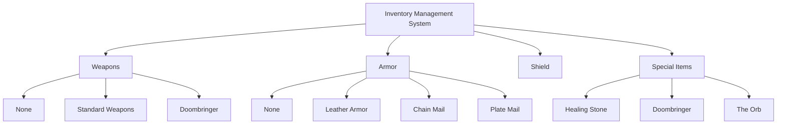
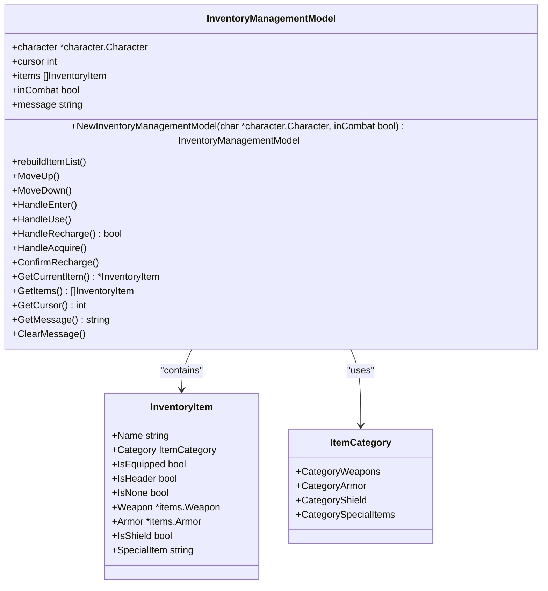
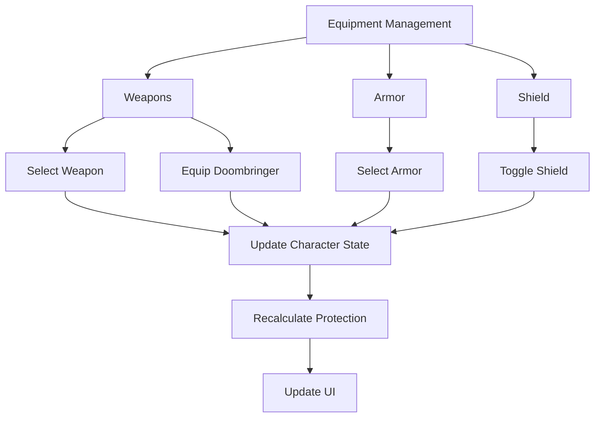
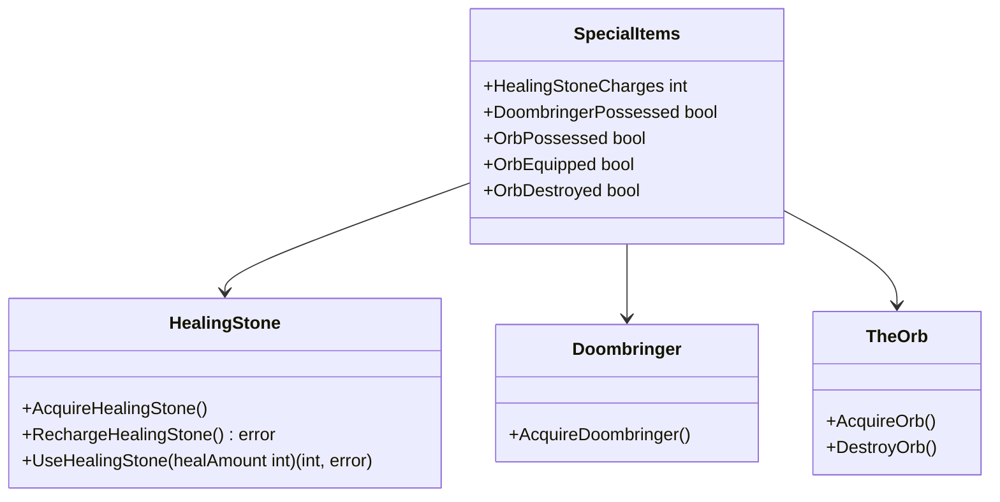
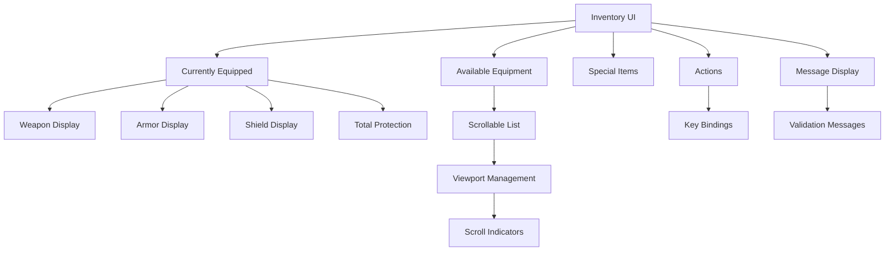
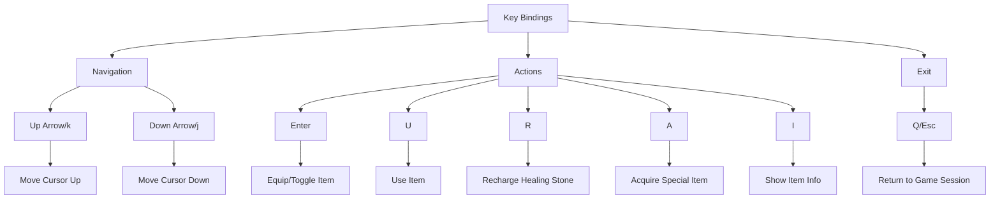
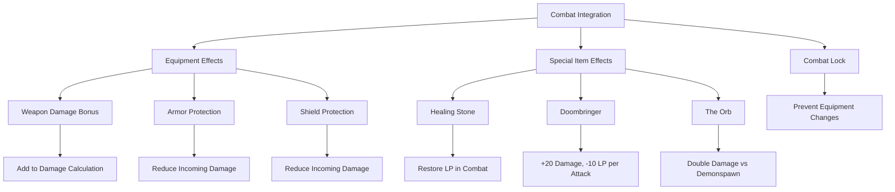
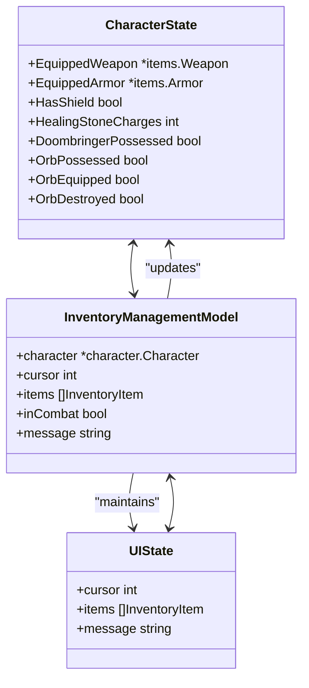
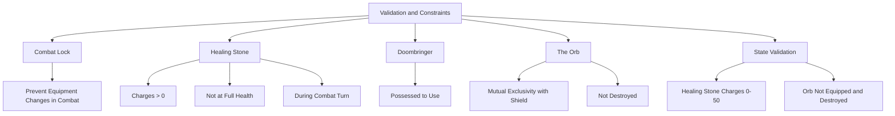

# Inventory Management

<cite>
**Referenced Files in This Document**   
- [inventory_management.go](file://pkg/ui/inventory_management.go)
- [inventory_view.go](file://pkg/ui/inventory_view.go)
- [items.go](file://internal/items/items.go)
- [character.go](file://internal/character/character.go)
- [update.go](file://pkg/ui/update.go)
</cite>

## Table of Contents
1. [Introduction](#introduction)
2. [Inventory System Overview](#inventory-system-overview)
3. [Core Components](#core-components)
4. [Equipment Management](#equipment-management)
5. [Special Items](#special-items)
6. [User Interface](#user-interface)
7. [Key Bindings](#key-bindings)
8. [Combat Integration](#combat-integration)
9. [State Management](#state-management)
10. [Validation and Constraints](#validation-and-constraints)

## Introduction
The Inventory Management system in the Sagas of the Demonspawn application provides a comprehensive interface for managing character equipment and special items. This system allows players to equip weapons, armor, and shields, as well as manage unique special items that play crucial roles in gameplay. The inventory system is designed to be intuitive and accessible, with clear visual feedback and robust state management.

The inventory system is fully integrated with the character's state, ensuring that equipment changes are immediately reflected in combat calculations and other game mechanics. Special items like the Healing Stone, Doombringer, and The Orb have unique behaviors and constraints that are enforced by the system to maintain game balance and integrity.

## Inventory System Overview
The inventory management system is a critical component of the Sagas of the Demonspawn game, providing players with the ability to manage their character's equipment and special items. The system is designed with a clear separation of concerns, with distinct components handling data management, user interface rendering, and user interaction.

The inventory system is organized into four main categories: Weapons, Armor, Shield, and Special Items. Each category contains relevant items that can be equipped or managed by the player. The system enforces various game rules and constraints, such as preventing equipment changes during combat and managing the mutual exclusivity between certain items.

**Diagram sources**
- [inventory_management.go](file://pkg/ui/inventory_management.go#L13-L18)
- [items.go](file://internal/items/items.go#L62-L208)

**Section sources**
- [inventory_management.go](file://pkg/ui/inventory_management.go#L1-L390)
- [inventory_view.go](file://pkg/ui/inventory_view.go#L1-L207)

## Core Components
The inventory management system consists of several core components that work together to provide a seamless user experience. These components include the InventoryManagementModel, which manages the state of the inventory screen, and various supporting types and functions that handle specific aspects of inventory management.

The InventoryManagementModel is the central component of the system, responsible for maintaining the current state of the inventory interface, including the selected item, available items, and any messages to display to the user. The model interacts with the character's state to reflect equipment changes and special item status.

**Diagram sources**
- [inventory_management.go](file://pkg/ui/inventory_management.go#L34-L390)
- [inventory_management.go](file://pkg/ui/inventory_management.go#L21-L31)

**Section sources**
- [inventory_management.go](file://pkg/ui/inventory_management.go#L1-L390)

## Equipment Management
The equipment management system allows players to equip and unequip weapons, armor, and shields. Each equipment type has specific rules and constraints that are enforced by the system to maintain game balance and integrity.

Weapons can be selected from a list of available options, with the Doombringer weapon only appearing if the character possesses it. Armor options include various levels of protection, from no armor to plate mail. The shield can be toggled on or off, but cannot be used simultaneously with The Orb.

When equipment is changed, the system immediately updates the character's state and recalculates relevant statistics such as total protection. The system also prevents equipment changes during combat to maintain game fairness.

**Diagram sources**
- [inventory_management.go](file://pkg/ui/inventory_management.go#L63-L146)
- [character.go](file://internal/character/character.go#L273-L286)

**Section sources**
- [inventory_management.go](file://pkg/ui/inventory_management.go#L63-L146)
- [character.go](file://internal/character/character.go#L273-L286)

## Special Items
Special items play a crucial role in the Sagas of the Demonspawn game, providing unique abilities and mechanics that can significantly impact gameplay. The inventory system manages three special items: the Healing Stone, Doombringer, and The Orb.

The Healing Stone allows players to restore life points during combat, with charges that can be recharged when permitted by the gamebook. The Doombringer is a powerful weapon with special rules, including a curse that reduces the character's life points with each attack. The Orb provides protection against Demonspawn enemies and can be thrown for an instant kill.

Special items have specific acquisition and usage rules that are enforced by the system. For example, the Healing Stone can only be used during combat turns, and The Orb cannot be used simultaneously with a shield.

**Diagram sources**
- [inventory_management.go](file://pkg/ui/inventory_management.go#L135-L166)
- [character.go](file://internal/character/character.go#L288-L347)

**Section sources**
- [inventory_management.go](file://pkg/ui/inventory_management.go#L135-L166)
- [character.go](file://internal/character/character.go#L288-L347)

## User Interface
The inventory management user interface is designed to be intuitive and accessible, with clear visual feedback and a consistent layout. The interface displays the currently equipped items at the top, followed by a scrollable list of available equipment and special items.

The UI uses a text-based interface with borders and formatting to create a clear visual hierarchy. Section headers are displayed in uppercase, and the currently selected item is indicated with a ">" prefix. Equipped items are marked with "[EQUIPPED]" to provide clear visual feedback.

For long lists of items, the interface implements a scrolling viewport that keeps the selected item in view while showing surrounding items. Scroll indicators are displayed when there are items above or below the visible area.

**Diagram sources**
- [inventory_view.go](file://pkg/ui/inventory_view.go#L1-L207)
- [inventory_management.go](file://pkg/ui/inventory_management.go#L63-L167)

**Section sources**
- [inventory_view.go](file://pkg/ui/inventory_view.go#L1-L207)

## Key Bindings
The inventory management system uses a set of keyboard shortcuts to allow players to navigate and interact with the interface. These key bindings are designed to be intuitive and consistent with other parts of the application.

Arrow keys or 'k'/'j' are used to navigate up and down the list of items. The Enter key is used to equip or toggle items. The 'u' key is used to use items, such as the Healing Stone. The 'r' key is used to recharge the Healing Stone. The 'a' key is used to acquire special items when finding them in the adventure. The 'i' key displays information about the selected item. The 'q' or 'esc' keys are used to exit the inventory screen and return to the game session.

**Diagram sources**
- [update.go](file://pkg/ui/update.go#L518-L563)
- [inventory_view.go](file://pkg/ui/inventory_view.go#L188-L190)

**Section sources**
- [update.go](file://pkg/ui/update.go#L518-L563)

## Combat Integration
The inventory management system is tightly integrated with the combat system, ensuring that equipment choices directly impact combat outcomes. Equipment changes are locked during combat to prevent unfair advantages, and special items have specific combat-related behaviors.

The Healing Stone can only be used during combat turns to restore life points, with the amount restored determined by a dice roll. The Doombringer weapon provides a significant damage bonus but has a curse that reduces the character's life points with each attack. The Orb provides protection against Demonspawn enemies and can be thrown for an instant kill.

Equipment choices directly affect combat calculations, with weapon damage bonuses added to attack damage and armor protection reducing incoming damage. The system ensures that these values are correctly calculated and applied during combat.

**Diagram sources**
- [inventory_management.go](file://pkg/ui/inventory_management.go#L217-L220)
- [combat.go](file://internal/combat/combat.go#L157-L173)
- [character.go](file://internal/character/character.go#L360-L377)

**Section sources**
- [inventory_management.go](file://pkg/ui/inventory_management.go#L217-L220)
- [combat.go](file://internal/combat/combat.go#L157-L173)

## State Management
The inventory management system uses a robust state management approach to ensure data consistency and integrity. The system maintains a clear separation between the UI state and the character's persistent state, with changes to equipment and special items immediately reflected in the character's state.

The InventoryManagementModel maintains its own state, including the cursor position, list of available items, and any messages to display. This state is rebuilt whenever the character's state changes, ensuring that the UI always reflects the current inventory status.

Special item state is managed through a series of boolean flags and counters that track possession, equipment status, and charges. These values are validated to ensure consistency, such as preventing The Orb from being both equipped and destroyed.

**Diagram sources**
- [inventory_management.go](file://pkg/ui/inventory_management.go#L34-L390)
- [character.go](file://internal/character/character.go#L37-L46)

**Section sources**
- [inventory_management.go](file://pkg/ui/inventory_management.go#L34-L390)
- [character.go](file://internal/character/character.go#L37-L46)

## Validation and Constraints
The inventory management system enforces a variety of validation rules and constraints to maintain game balance and integrity. These rules ensure that equipment changes are only allowed when appropriate and that special item usage follows the game's mechanics.

Equipment changes are prohibited during combat to prevent unfair advantages. The Healing Stone can only be used when the character has charges remaining and is not at full health. The Doombringer weapon is only available if the character possesses it. The Orb cannot be used simultaneously with a shield, and attempting to equip both will automatically unequip the shield.

Special item state is validated to ensure consistency, such as preventing The Orb from being both equipped and destroyed. The system also validates that the Healing Stone charges remain within the valid range of 0-50.

**Diagram sources**
- [inventory_management.go](file://pkg/ui/inventory_management.go#L217-L220)
- [inventory_management.go](file://pkg/ui/inventory_management.go#L271-L285)
- [character.go](file://internal/character/character.go#L417-L443)

**Section sources**
- [inventory_management.go](file://pkg/ui/inventory_management.go#L217-L220)
- [inventory_management.go](file://pkg/ui/inventory_management.go#L271-L285)
- [character.go](file://internal/character/character.go#L417-L443)