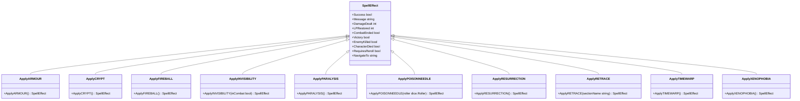

# Magic System

<cite>
**Referenced Files in This Document**   
- [casting.go](file://internal/magic/casting.go)
- [spells.go](file://internal/magic/spells.go)
- [effects.go](file://internal/magic/effects.go)
- [spell_casting.go](file://pkg/ui/spell_casting.go)
- [character.go](file://internal/character/character.go)
- [update.go](file://pkg/ui/update.go)
- [view.go](file://pkg/ui/view.go)
- [magic.txt](file://internal/help/content/magic.txt)
- [dice.go](file://internal/dice/dice.go)
</cite>

## Table of Contents
1. [Introduction](#introduction)
2. [Project Structure](#project-structure)
3. [Core Components](#core-components)
4. [Architecture Overview](#architecture-overview)
5. [Detailed Component Analysis](#detailed-component-analysis)
6. [Dependency Analysis](#dependency-analysis)
7. [Performance Considerations](#performance-considerations)
8. [Troubleshooting Guide](#troubleshooting-guide)
9. [Conclusion](#conclusion)

## Introduction
The Magic System in the Sagas of the Demonspawn application implements a comprehensive spell casting engine that adheres to the gamebook's rules. This system enables players to cast various spells with different effects, costs, and restrictions. The implementation includes spell validation, power management, effect application, and user interface components that work together to provide an immersive magical experience within the game.

The magic system was fully implemented in Phase 4 of the project, adding 10 distinct spells across five categories: Offensive, Defensive, Navigation, Tactical, and Recovery. The system incorporates game mechanics such as Fundamental Failure Rate (FFR) checks, optional Natural Inclination checks, and Life Point (LP) sacrifice for Power (POW) when insufficient resources are available.

## Project Structure
The magic system is organized within the internal/magic directory, with supporting components in the pkg/ui package for user interface functionality. The structure follows a clean separation of concerns, with distinct files handling different aspects of the magic system.

**Diagram sources**
- [spells.go](file://internal/magic/spells.go)
- [casting.go](file://internal/magic/casting.go)
- [effects.go](file://internal/magic/effects.go)
- [spell_casting.go](file://pkg/ui/spell_casting.go)
- [character.go](file://internal/character/character.go)
- [dice.go](file://internal/dice/dice.go)

**Section sources**
- [spells.go](file://internal/magic/spells.go)
- [casting.go](file://internal/magic/casting.go)
- [effects.go](file://internal/magic/effects.go)
- [spell_casting.go](file://pkg/ui/spell_casting.go)

## Core Components
The magic system consists of three core components: spell definitions, casting logic, and effect implementations. These components work together to provide a complete spell casting experience. The system validates spell casting attempts, performs necessary checks, applies effects, and updates character state accordingly.

The casting process involves multiple validation steps including checking POW availability, verifying combat/non-combat restrictions, and performing the Fundamental Failure Rate check. The system also supports LP sacrifice when insufficient POW is available, allowing players to trade health for magical power.

**Section sources**
- [casting.go](file://internal/magic/casting.go#L9-L117)
- [spells.go](file://internal/magic/spells.go#L14-L22)
- [effects.go](file://internal/magic/effects.go#L9-L21)

## Architecture Overview
The magic system follows a modular architecture with clear separation between data, logic, and presentation layers. The core magic logic resides in the internal/magic package, while the user interface components are implemented in the pkg/ui package. This separation allows for independent testing and modification of the underlying mechanics without affecting the user experience.

**Diagram sources**
- [spell_casting.go](file://pkg/ui/spell_casting.go)
- [casting.go](file://internal/magic/casting.go)
- [spells.go](file://internal/magic/spells.go)
- [effects.go](file://internal/magic/effects.go)
- [character.go](file://internal/character/character.go)
- [dice.go](file://internal/dice/dice.go)

## Detailed Component Analysis

### Spell Definitions
The spell definitions component contains all 10 spells from the gamebook, organized by category with their respective properties and constraints. Each spell has a name, power cost, description, category, and flags indicating whether it can only be cast during combat or when the character is dead.

**Diagram sources**
- [spells.go](file://internal/magic/spells.go#L3-L12)

**Section sources**
- [spells.go](file://internal/magic/spells.go#L1-L137)

### Casting Logic
The casting logic component handles the validation and execution of spell casting attempts. It includes functions for checking spell eligibility, calculating required sacrifices, and performing the Fundamental Failure Rate check that determines spell success.

**Diagram sources**
- [casting.go](file://internal/magic/casting.go#L20-L117)

**Section sources**
- [casting.go](file://internal/magic/casting.go#L1-L118)

### Effect Implementations
The effect implementations component contains the logic for applying each spell's specific effect to the game state. These functions return structured results that describe the outcome of the spell, including damage dealt, status changes, and navigation instructions.

**Diagram sources**
- [effects.go](file://internal/magic/effects.go#L9-L21)

**Section sources**
- [effects.go](file://internal/magic/effects.go#L1-L128)

### User Interface
The user interface component provides the spell casting screen where players can select and cast spells. It handles user input, displays available spells, shows POW status, and manages the casting workflow including sacrifice confirmation.

**Diagram sources**
- [spell_casting.go](file://pkg/ui/spell_casting.go#L13-L25)
- [casting.go](file://internal/magic/casting.go#L52-L95)
- [effects.go](file://internal/magic/effects.go#L23-L127)

**Section sources**
- [spell_casting.go](file://pkg/ui/spell_casting.go#L1-L344)

## Dependency Analysis
The magic system has well-defined dependencies that follow the dependency inversion principle. The core magic logic depends on abstractions rather than concrete implementations, making it easier to test and maintain.

**Diagram sources**
- [spell_casting.go](file://pkg/ui/spell_casting.go)
- [casting.go](file://internal/magic/casting.go)
- [effects.go](file://internal/magic/effects.go)
- [character.go](file://internal/character/character.go)
- [dice.go](file://internal/dice/dice.go)

**Section sources**
- [spell_casting.go](file://pkg/ui/spell_casting.go#L1-L344)
- [casting.go](file://internal/magic/casting.go#L1-L118)
- [effects.go](file://internal/magic/effects.go#L1-L128)

## Performance Considerations
The magic system is designed with performance in mind, using simple data structures and algorithms that execute efficiently. The spell validation and effect application processes are optimized to minimize computational overhead during gameplay.

The system uses a pre-defined list of spells that is loaded once at startup, avoiding repeated database queries or file reads. Spell lookups are performed using a linear search through the array, which is efficient given the small number of spells (10 total). The casting validation process includes early exit conditions to avoid unnecessary calculations when a spell cannot be cast.

All operations are performed in memory with O(1) or O(n) complexity where n is the number of spells, ensuring responsive user interaction even on low-end devices.

## Troubleshooting Guide
When encountering issues with the magic system, consider the following common problems and solutions:

1. **Spell not appearing in list**: Verify the character has unlocked magic by pressing 'U' in the character edit screen. Also check if the spell has context restrictions (combat-only or death-only) that prevent its availability.

2. **Insufficient POW error**: Ensure the character has sufficient POWER for the spell. If needed, sacrifice LP by confirming the sacrifice prompt, or restore POW by casting CRYPT or manually editing in character edit mode.

3. **Spell failing despite sufficient POW**: The Fundamental Failure Rate check may have failed. Spells require a 2d6 roll of 6 or higher to succeed. This is a core game mechanic and not an error.

4. **Effects not applying**: Verify the spell cast was successful (check the message displayed). Some spells like RESURRECTION have specific conditions (character must be dead) to function properly.

5. **UI navigation issues**: Use the arrow keys to navigate spell selection, Enter to cast, and Esc to cancel. Press ? for context-sensitive help on any screen.

**Section sources**
- [magic.txt](file://internal/help/content/magic.txt)
- [spell_casting.go](file://pkg/ui/spell_casting.go)
- [casting.go](file://internal/magic/casting.go)

## Conclusion
The Magic System in the Sagas of the Demonspawn application provides a robust and faithful implementation of the gamebook's magical mechanics. By separating concerns into distinct components for spell definitions, casting logic, effect implementations, and user interface, the system achieves both flexibility and maintainability.

The implementation successfully integrates with the character system, combat mechanics, and user interface to create a cohesive gameplay experience. The use of clear validation rules, intuitive user prompts, and immediate feedback ensures players can effectively utilize magic in their adventures.

Future enhancements could include visual effects, sound cues, or additional spell categories, but the current implementation provides a solid foundation that accurately reflects the gamebook's rules and enhances the player's experience.