# Navigation System

<cite>
**Referenced Files in This Document**
- [model.go](file://pkg/ui/model.go)
- [main_menu.go](file://pkg/ui/main_menu.go)
- [update.go](file://pkg/ui/update.go)
- [view.go](file://pkg/ui/view.go)
- [character_creation.go](file://pkg/ui/character_creation.go)
- [load_character.go](file://pkg/ui/load_character.go)
- [game_session.go](file://pkg/ui/game_session.go)
- [character_view.go](file://pkg/ui/character_view.go)
- [character_edit.go](file://pkg/ui/character_edit.go)
</cite>

## Table of Contents
1. [Introduction](#introduction)
2. [Architecture Overview](#architecture-overview)
3. [Core Navigation Components](#core-navigation-components)
4. [Screen Management System](#screen-management-system)
5. [Keyboard Navigation Patterns](#keyboard-navigation-patterns)
6. [State Transition Logic](#state-transition-logic)
7. [Bubble Tea Framework Integration](#bubble-tea-framework-integration)
8. [User Workflow Examples](#user-workflow-examples)
9. [Navigation Confusion Points](#navigation-confusion-points)
10. [Best Practices and Troubleshooting](#best-practices-and-troubleshooting)

## Introduction

The saga-demonspawn application implements a sophisticated navigation system built on the Bubble Tea framework, providing seamless transitions between different screens using keyboard inputs. The navigation system follows the Model-View-Update (MVU) architecture pattern, enabling users to move between the main menu, character creation, character loading, and various gameplay screens using intuitive arrow key navigation and action commands.

The navigation system is designed to be beginner-friendly while maintaining the depth and complexity required for a tabletop RPG experience. Users can easily navigate through menus, make selections, and transition between different application states using familiar keyboard shortcuts.

## Architecture Overview

The navigation system is structured around a central Model that orchestrates state management and screen transitions, with specialized models handling individual screen states. The architecture follows the Elm Architecture pattern, ensuring predictable state updates and clear separation of concerns.

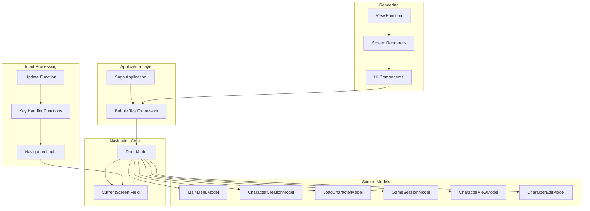

**Diagram sources**
- [model.go](file://pkg/ui/model.go#L33-L95)
- [update.go](file://pkg/ui/update.go#L16-L56)
- [view.go](file://pkg/ui/view.go#L8-L27)

**Section sources**
- [model.go](file://pkg/ui/model.go#L33-L95)
- [update.go](file://pkg/ui/update.go#L16-L56)

## Core Navigation Components

### Screen Enumeration

The application defines a comprehensive set of screens using an enumeration system that provides type safety and clear navigation boundaries:

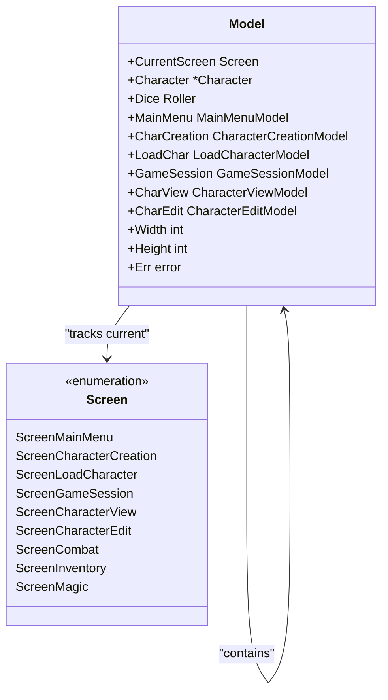

**Diagram sources**
- [model.go](file://pkg/ui/model.go#L9-L31)
- [model.go](file://pkg/ui/model.go#L33-L95)

### Main Menu Interface

The main menu serves as the primary navigation hub, offering three core options: New Character, Load Character, and Exit. The menu implementation provides smooth cursor navigation and selection handling.

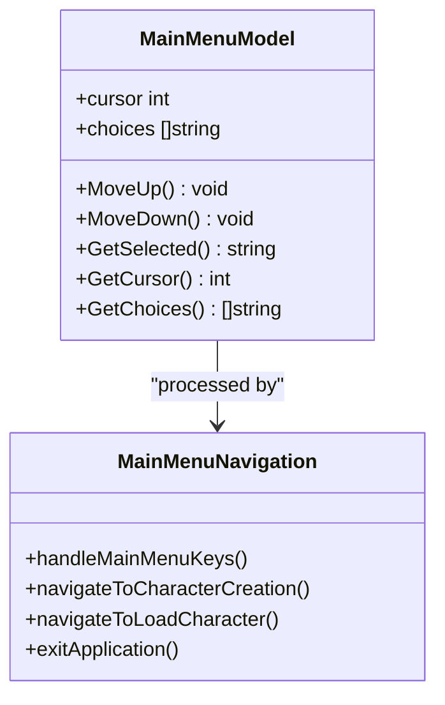

**Diagram sources**
- [main_menu.go](file://pkg/ui/main_menu.go#L4-L49)
- [update.go](file://pkg/ui/update.go#L58-L80)

**Section sources**
- [main_menu.go](file://pkg/ui/main_menu.go#L4-L49)
- [model.go](file://pkg/ui/model.go#L12-L31)

## Screen Management System

### CurrentScreen Field and State Changes

The `CurrentScreen` field in the Model struct serves as the central state manager for navigation. This integer-based enumeration enables efficient routing of user inputs and view rendering across different application screens.

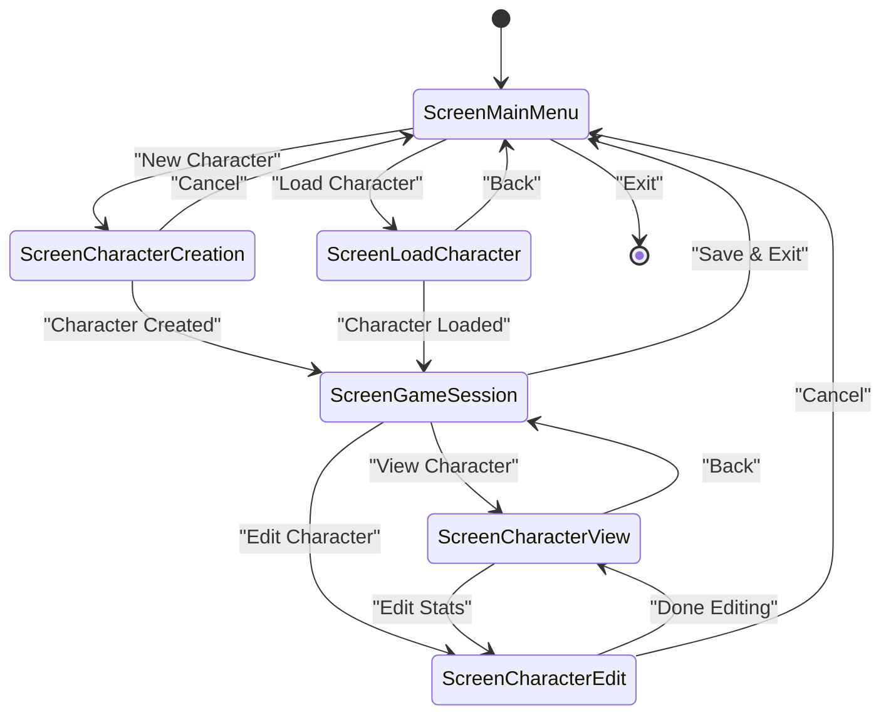

**Diagram sources**
- [model.go](file://pkg/ui/model.go#L36-L36)
- [update.go](file://pkg/ui/update.go#L39-L56)

### Screen-Specific Models

Each screen maintains its own state model, encapsulating navigation-specific data and behavior:

| Screen | Model | Purpose | Navigation Triggers |
|--------|-------|---------|-------------------|
| ScreenMainMenu | MainMenuModel | Main application hub | Selection → Character Creation/Loading |
| ScreenCharacterCreation | CharacterCreationModel | Character creation flow | Step progression → Game Session |
| ScreenLoadCharacter | LoadCharacterModel | Character file browsing | Selection → Game Session |
| ScreenGameSession | GameSessionModel | Gameplay menu | Selection → Various screens |
| ScreenCharacterView | CharacterViewModel | Full character display | Navigation → Edit/Menu |
| ScreenCharacterEdit | CharacterEditModel | Stat modification | Input → Character Update |

**Section sources**
- [model.go](file://pkg/ui/model.go#L44-L50)
- [character_creation.go](file://pkg/ui/character_creation.go#L21-L44)
- [load_character.go](file://pkg/ui/load_character.go#L10-L14)
- [game_session.go](file://pkg/ui/game_session.go#L4-L7)

## Keyboard Navigation Patterns

### Standard Navigation Keys

The application implements consistent keyboard navigation patterns across all screens, following Vim-style key bindings for familiarity and efficiency:

| Key Combination | Action | Context | Navigation Effect |
|----------------|--------|---------|------------------|
| `↑` / `k` | Move Up | All navigable menus | Cursor movement |
| `↓` / `j` | Move Down | All navigable menus | Cursor movement |
| `←` / `h` | Move Left | Equipment selection | Weapon cursor |
| `→` / `l` | Move Right | Equipment selection | Armor cursor |
| `Enter` | Select/Confirm | All screens | Action execution |
| `Esc` / `q` | Cancel/Back | All screens | Return to previous |

### Screen-Specific Navigation

Different screens implement specialized navigation patterns tailored to their content:

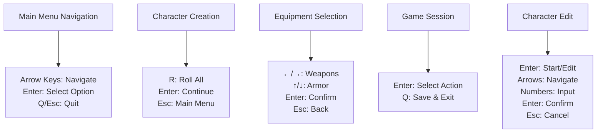

**Diagram sources**
- [update.go](file://pkg/ui/update.go#L58-L80)
- [update.go](file://pkg/ui/update.go#L110-L180)
- [update.go](file://pkg/ui/update.go#L183-L219)
- [update.go](file://pkg/ui/update.go#L234-L278)

**Section sources**
- [update.go](file://pkg/ui/update.go#L58-L80)
- [update.go](file://pkg/ui/update.go#L110-L180)
- [update.go](file://pkg/ui/update.go#L183-L219)
- [update.go](file://pkg/ui/update.go#L234-L278)

## State Transition Logic

### Update Function Processing

The Update function serves as the central command processor, routing user inputs to appropriate screen handlers based on the current screen state:

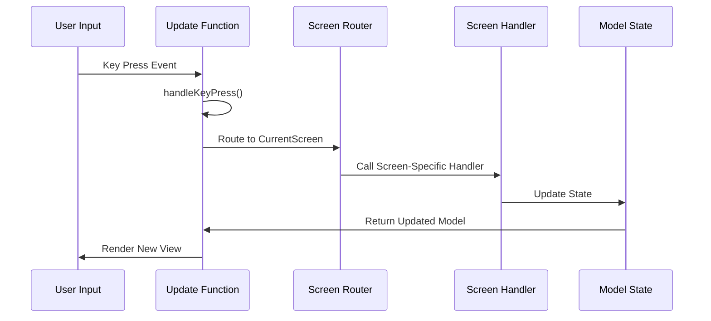

**Diagram sources**
- [update.go](file://pkg/ui/update.go#L32-L56)
- [update.go](file://pkg/ui/update.go#L16-L56)

### Navigation Command Processing

Each screen implements specialized key handling logic that processes navigation commands and triggers appropriate state changes:

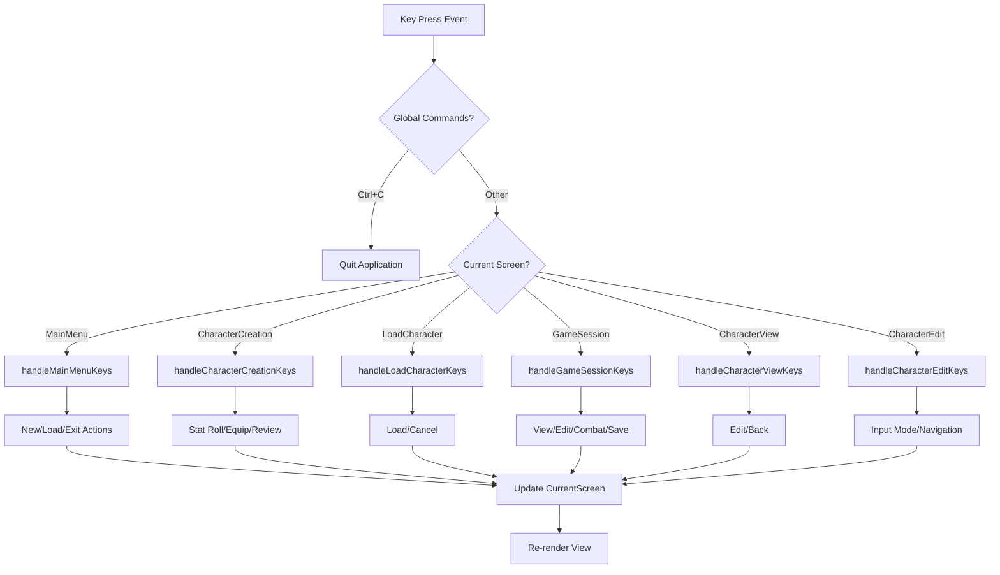

**Diagram sources**
- [update.go](file://pkg/ui/update.go#L32-L56)
- [update.go](file://pkg/ui/update.go#L58-L80)
- [update.go](file://pkg/ui/update.go#L110-L180)
- [update.go](file://pkg/ui/update.go#L183-L219)

**Section sources**
- [update.go](file://pkg/ui/update.go#L32-L56)
- [update.go](file://pkg/ui/update.go#L58-L80)
- [update.go](file://pkg/ui/update.go#L110-L180)
- [update.go](file://pkg/ui/update.go#L183-L219)

## Bubble Tea Framework Integration

### Model-View-Update Pattern Implementation

The navigation system seamlessly integrates with the Bubble Tea framework's MVU architecture, providing reactive state updates and efficient rendering:

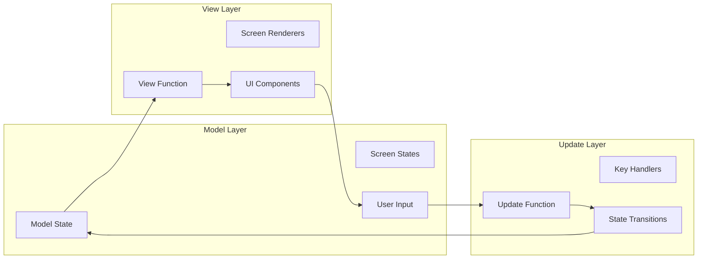

**Diagram sources**
- [update.go](file://pkg/ui/update.go#L16-L56)
- [view.go](file://pkg/ui/view.go#L8-L27)
- [model.go](file://pkg/ui/model.go#L33-L95)

### State Updates During Navigation

The framework handles state updates automatically through the Update function, which processes key events and returns the updated model for rendering:

| Update Phase | Responsibility | Example |
|-------------|----------------|---------|
| Message Reception | Capture key events | `tea.KeyMsg` processing |
| Screen Routing | Route to appropriate handler | `switch m.CurrentScreen` |
| State Modification | Update model state | `m.CurrentScreen = ScreenCharacterCreation` |
| Command Execution | Trigger side effects | `m.CharCreation.RollAll()` |
| Model Return | Provide updated state | `return m, nil` |

**Section sources**
- [update.go](file://pkg/ui/update.go#L16-L56)
- [view.go](file://pkg/ui/view.go#L8-L27)

## User Workflow Examples

### Starting a New Game

The new game workflow demonstrates the complete navigation flow from main menu to playable character:

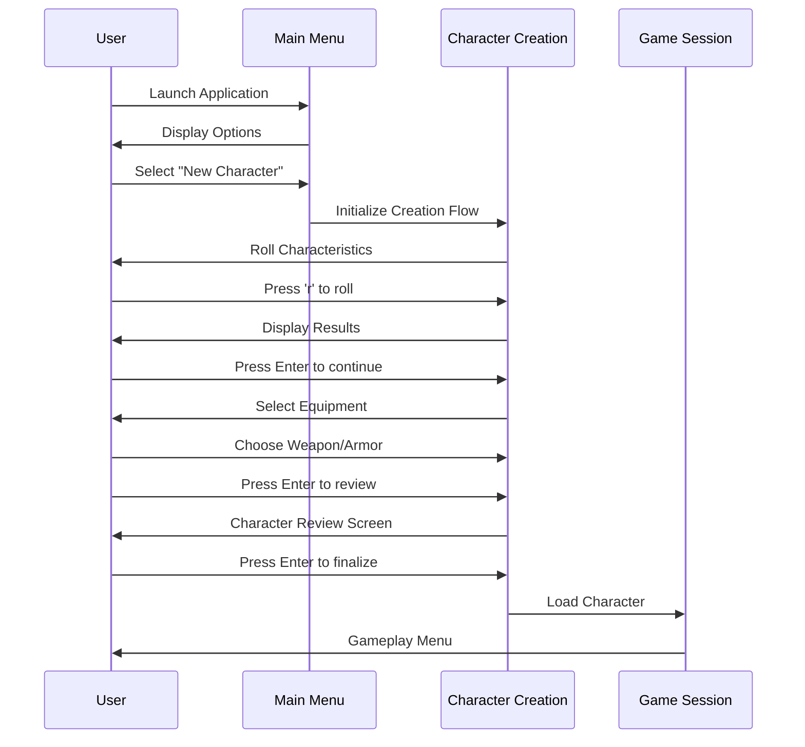

**Diagram sources**
- [update.go](file://pkg/ui/update.go#L68-L70)
- [update.go](file://pkg/ui/update.go#L110-L180)
- [model.go](file://pkg/ui/model.go#L78-L84)

### Loading an Existing Character

The character loading workflow showcases file system navigation and character restoration:

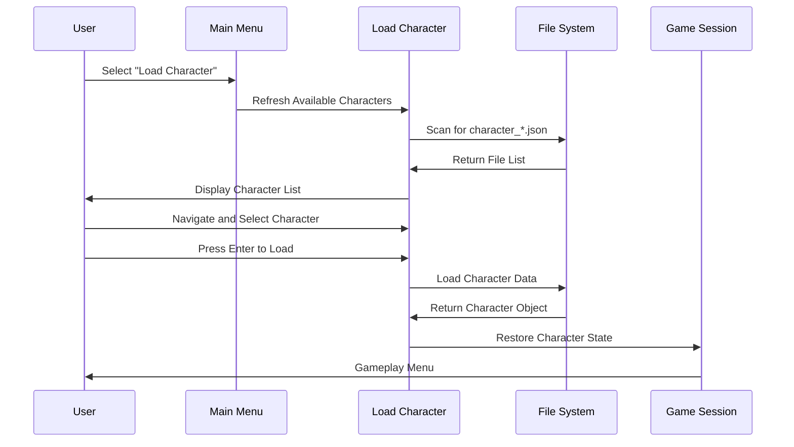

**Diagram sources**
- [update.go](file://pkg/ui/update.go#L71-L74)
- [load_character.go](file://pkg/ui/load_character.go#L25-L39)
- [model.go](file://pkg/ui/model.go#L78-L84)

**Section sources**
- [update.go](file://pkg/ui/update.go#L68-L70)
- [update.go](file://pkg/ui/update.go#L71-L74)
- [load_character.go](file://pkg/ui/load_character.go#L25-L39)
- [model.go](file://pkg/ui/model.go#L78-L84)

## Navigation Confusion Points

### Common Navigation Issues

Several navigation scenarios can cause user confusion if not properly addressed:

| Issue | Cause | Solution | Prevention |
|-------|-------|----------|-----------|
| **Back Navigation** | Multiple exit points | Consistent Esc key behavior | Clear "Back" indicators |
| **State Loss** | Accidental navigation | Confirmation prompts | Save state regularly |
| **Menu Depth** | Too many nested screens | Logical navigation hierarchy | Streamlined workflows |
| **Input Mode** | Editing vs. navigation | Clear visual feedback | Distinct input indicators |

### Cancel Operations and Return Paths

The navigation system provides multiple pathways for canceling operations and returning to previous states:

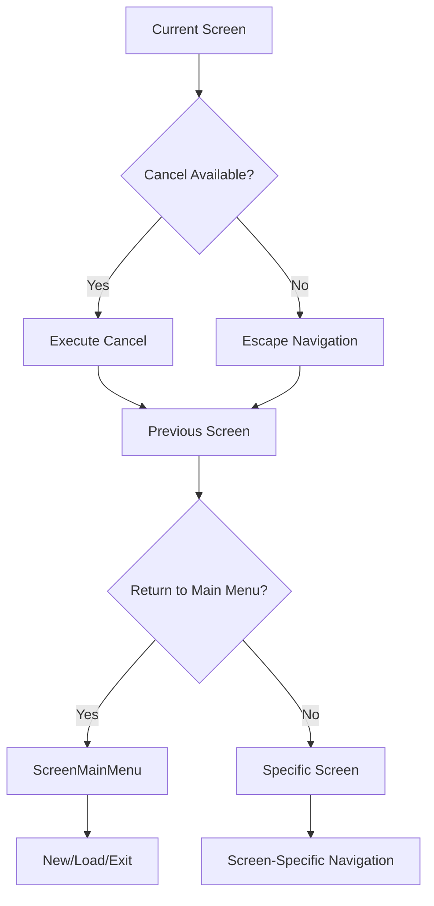

**Diagram sources**
- [update.go](file://pkg/ui/update.go#L133-L136)
- [update.go](file://pkg/ui/update.go#L154-L157)
- [update.go](file://pkg/ui/update.go#L177-L179)
- [update.go](file://pkg/ui/update.go#L208-L209)

**Section sources**
- [update.go](file://pkg/ui/update.go#L133-L136)
- [update.go](file://pkg/ui/update.go#L154-L157)
- [update.go](file://pkg/ui/update.go#L177-L179)
- [update.go](file://pkg/ui/update.go#L208-L209)

## Best Practices and Troubleshooting

### Navigation Design Principles

The navigation system follows several key design principles to ensure usability and maintainability:

1. **Consistency**: Uniform key bindings across all screens
2. **Predictability**: Clear visual feedback for cursor positions
3. **Accessibility**: Multiple escape/cancel paths
4. **Efficiency**: Minimal keystrokes for common actions
5. **Feedback**: Immediate visual response to user actions

### Troubleshooting Navigation Issues

Common navigation problems and their solutions:

| Problem | Symptoms | Diagnosis | Solution |
|---------|----------|-----------|----------|
| **Stuck Navigation** | Cannot move cursor | Screen handler not responding | Check key binding implementation |
| **Incorrect Transitions** | Wrong screen appears | State not updating properly | Verify CurrentScreen assignment |
| **Missing Options** | Expected menu items missing | Conditional logic error | Review screen-specific logic |
| **Input Conflicts** | Keys not working | Handler precedence issue | Check update function routing |

### Performance Considerations

The navigation system is optimized for responsive user interaction:

- **Minimal State Changes**: Only necessary state modifications occur during navigation
- **Efficient Rendering**: View functions return quickly with minimal computation
- **Memory Management**: Screen models are garbage collected when not in use
- **Event Handling**: Key press processing is lightweight and fast

**Section sources**
- [update.go](file://pkg/ui/update.go#L16-L56)
- [view.go](file://pkg/ui/view.go#L8-L27)
- [model.go](file://pkg/ui/model.go#L33-L95)