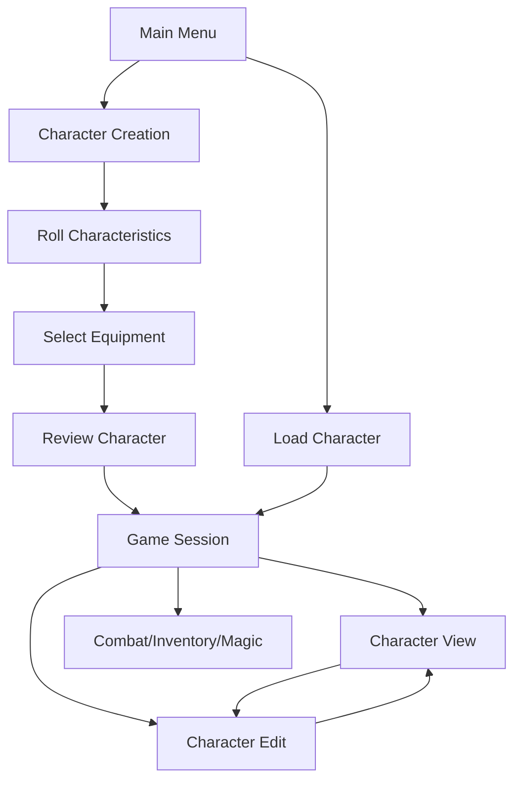

# User Guide

<cite>
**Referenced Files in This Document**
- [model.go](file://pkg/ui/model.go)
- [main_menu.go](file://pkg/ui/main_menu.go)
- [character_creation.go](file://pkg/ui/character_creation.go)
- [update.go](file://pkg/ui/update.go)
- [game_session.go](file://pkg/ui/game_session.go)
- [load_character.go](file://pkg/ui/load_character.go)
- [character_view.go](file://pkg/ui/character_view.go)
- [character_edit.go](file://pkg/ui/character_edit.go)
- [character.go](file://internal/character/character.go)
- [dice.go](file://internal/dice/dice.go)
- [items.go](file://internal/items/items.go)
- [README.md](file://README.md)
</cite>

## Table of Contents
1. [Introduction](#introduction)
2. [Getting Started](#getting-started)
3. [Terminal Interface Overview](#terminal-interface-overview)
4. [Main Menu Navigation](#main-menu-navigation)
5. [Character Creation Process](#character-creation-process)
6. [Character Management](#character-management)
7. [Game Session Interface](#game-session-interface)
8. [Keyboard Shortcuts Reference](#keyboard-shortcuts-reference)
9. [Common User Scenarios](#common-user-scenarios)
10. [Troubleshooting](#troubleshooting)

## Introduction

The Saga-Demonspawn application is a command-line companion for the "Sagas of the Demonspawn" gamebook, built with Go and the Bubble Tea framework. This terminal-based interface provides a complete character management system with intuitive navigation using arrow keys, Enter, and Escape keys.

The application follows the classic gamebook mechanics, featuring:
- Character creation with dice-rolled statistics
- Comprehensive character management and editing
- Save/load functionality for persistent characters
- Interactive menu systems with smooth transitions
- Keyboard-only navigation for seamless gameplay

## Getting Started

### Launching the Application

After building the application, launch it from your terminal:

```bash
./saga
```

The application starts in the main menu, ready for character creation or loading existing characters.

### Initial Interface

Upon launching, you'll see the main menu with three primary options:
- **New Character**: Begin creating a fresh character
- **Load Character**: Resume gameplay with existing characters
- **Exit**: Quit the application

## Terminal Interface Overview

The application uses a screen-based interface with clear visual feedback and responsive navigation. Each screen maintains its own state and keyboard shortcuts.

### Screen Navigation Pattern

The application follows a consistent navigation pattern across all screens:



**Diagram sources**
- [model.go](file://pkg/ui/model.go#L12-L30)
- [update.go](file://pkg/ui/update.go#L39-L55)

### Visual Design Principles

- **Consistent Layout**: Each screen maintains a clean, organized layout
- **Visual Feedback**: Cursor positions and selections are clearly highlighted
- **Progress Indicators**: Character creation steps show current progress
- **Error Handling**: Clear error messages appear when needed

## Main Menu Navigation

The main menu serves as the central hub for all application functions.

### Navigation Controls

| Key | Action | Description |
|-----|--------|-------------|
| **↑/k** | Move Up | Navigate to previous menu item |
| **↓/j** | Move Down | Navigate to next menu item |
| **Enter** | Select | Execute selected menu action |
| **Esc/q** | Exit | Quit the application |

### Menu Options

1. **New Character**
   - Initiates the character creation workflow
   - Resets any existing character data
   - Transitions to the first step of character creation

2. **Load Character**
   - Scans the current directory for saved character files
   - Displays available save files with timestamps
   - Loads selected character into the game session

3. **Exit**
   - Immediately terminates the application
   - No confirmation prompt required

**Section sources**
- [main_menu.go](file://pkg/ui/main_menu.go#L21-L48)
- [update.go](file://pkg/ui/update.go#L58-L80)

## Character Creation Process

Character creation is a multi-step process that generates a complete adventurer profile with dice-rolled statistics and equipment selection.

### Step 1: Rolling Characteristics

The first step involves rolling seven core characteristics using the game's standard mechanic: 2D6 × 8.

#### Rolling Mechanics

Each characteristic is rolled using the formula: **2d6 × 8**
- **Minimum Value**: 16 (rolling 2 on both dice)
- **Maximum Value**: 96 (rolling 12 on both dice)
- **Nobody is Perfect**: No characteristic can reach 100%

#### Rolling Controls

| Key | Action | Description |
|-----|--------|-------------|
| **r** | Roll All | Simultaneously roll all characteristics |
| **Enter** | Next Step | Proceed to equipment selection (only when all characteristics are rolled) |
| **Esc/q** | Cancel | Return to main menu |

#### Characteristic List

1. **Strength (STR)**: Physical power and carrying capacity
2. **Speed (SPD)**: Agility, reflexes, and movement speed
3. **Stamina (STA)**: Endurance and health regeneration
4. **Courage (CRG)**: Fear resistance and bravery
5. **Luck (LCK)**: Chance encounters and fortune
6. **Charm (CHM)**: Persuasion and social influence
7. **Attraction (ATT)**: Personal magnetism and charisma

### Step 2: Selecting Equipment

After rolling characteristics, you choose starting equipment from predefined options.

#### Equipment Selection Controls

| Key | Action | Description |
|-----|--------|-------------|
| **↑/k** | Weapon Up | Move weapon selection cursor up |
| **↓/j** | Weapon Down | Move weapon selection cursor down |
| **←/h** | Armor Up | Move armor selection cursor up |
| **→/l** | Armor Down | Move armor selection cursor down |
| **Enter** | Confirm | Proceed to character review |
| **Esc** | Back | Return to characteristic rolling |

#### Available Weapons

- **Sword**: Standard melee weapon (+10 damage)
- **Dagger**: Light, concealable weapon (+5 damage)
- **Club**: Basic melee weapon (+8 damage)
- **Doombringer**: Legendary cursed axe (special rules)

#### Available Armor

- **None**: No armor protection
- **Leather Armor**: Light protection (+5 damage reduction)

### Step 3: Review and Confirmation

The final step allows you to review your character before finalizing.

#### Review Controls

| Key | Action | Description |
|-----|--------|-------------|
| **Enter** | Create | Finalize character creation and load into game session |
| **Esc** | Back | Return to equipment selection |
| **q** | Cancel | Return to main menu without creating |

**Section sources**
- [character_creation.go](file://pkg/ui/character_creation.go#L1-L279)
- [update.go](file://pkg/ui/update.go#L110-L181)

## Character Management

Once a character is created or loaded, you can manage it through various screens and functions.

### Viewing Character Statistics

Access detailed character information through the character view screen.

#### Character View Controls

| Key | Action | Description |
|-----|--------|-------------|
| **e** | Edit Mode | Switch to character editing screen |
| **b/esc/q** | Back | Return to game session menu |

### Editing Character Stats

The character editing screen allows modification of all character attributes.

#### Navigation Controls

| Key | Action | Description |
|-----|--------|-------------|
| **↑/k** | Move Up | Navigate to previous stat field |
| **↓/j** | Move Down | Navigate to next stat field |
| **Enter** | Edit | Begin editing the selected field |
| **Esc/q** | Cancel | Return to character view |

#### Editable Fields

1. **Strength**: Physical power and carrying capacity
2. **Speed**: Agility, reflexes, and movement speed  
3. **Stamina**: Endurance and health regeneration
4. **Courage**: Fear resistance and bravery
5. **Luck**: Chance encounters and fortune
6. **Charm**: Persuasion and social influence
7. **Attraction**: Personal magnetism and charisma
8. **Current LP**: Current life points
9. **Maximum LP**: Maximum life points
10. **Skill**: Combat proficiency level
11. **Current POW**: Current power (if magic is unlocked)
12. **Maximum POW**: Maximum power (if magic is unlocked)

#### Input Mode Controls

When editing a field, use these controls for input:

| Key | Action | Description |
|-----|--------|-------------|
| **0-9** | Type Number | Enter numeric values |
| **-** | Negative Sign | Add negative sign for negative values |
| **Backspace** | Delete | Remove last digit |
| **Enter** | Apply | Save changes and return to navigation |
| **Esc** | Cancel | Discard changes and return to navigation |

**Section sources**
- [character_edit.go](file://pkg/ui/character_edit.go#L1-L173)
- [update.go](file://pkg/ui/update.go#L221-L278)

## Game Session Interface

The game session serves as the main operational hub after character creation or loading.

### Game Session Menu

The game session menu provides access to all major game functions:

#### Menu Options

1. **View Character**: Display full character sheet
2. **Edit Character Stats**: Modify character attributes
3. **Combat**: Engage in battle (Phase 2 - Planned)
4. **Cast Spell**: Magic system (Phase 4 - Planned)
5. **Manage Inventory**: Item management (Phase 3 - Planned)
6. **Save & Exit**: Save character and return to main menu

### Navigation Controls

| Key | Action | Description |
|-----|--------|-------------|
| **↑/k** | Move Up | Navigate to previous menu item |
| **↓/j** | Move Down | Navigate to next menu item |
| **Enter** | Select | Execute selected menu action |
| **Esc/q** | Save & Exit | Save character and return to main menu |

### Dynamic Menu Options

The game session menu adapts based on character progression:

- **Magic Unlocked**: When magic becomes available, "Cast Spell" appears
- **Magic Locked**: Without magic unlock, "Cast Spell" remains hidden

**Section sources**
- [game_session.go](file://pkg/ui/game_session.go#L1-L77)
- [update.go](file://pkg/ui/update.go#L183-L219)

## Keyboard Shortcuts Reference

### Global Shortcuts

| Key | Action | Scope |
|-----|--------|-------|
| **Ctrl+C** | Force Quit | All screens |
| **Esc** | Context-Specific | All screens |
| **q** | Context-Specific | All screens |

### Menu Navigation

| Key | Action | Screens |
|-----|--------|---------|
| **↑/k** | Move Up | Main Menu, Game Session, Load Character |
| **↓/j** | Move Down | Main Menu, Game Session, Load Character |
| **Enter** | Select/Confirm | All screens |

### Character Creation Specific

| Key | Action | Steps |
|-----|--------|-------|
| **r** | Roll All | Characteristic Rolling |
| **←/h** | Armor Up | Equipment Selection |
| **→/l** | Armor Down | Equipment Selection |
| **e** | Edit Mode | Character View |

### Character Editing Specific

| Key | Action | States |
|-----|--------|--------|
| **-** | Negative Sign | Input Mode |
| **Backspace** | Delete | Input Mode |

## Common User Scenarios

### Scenario 1: Creating Your First Character

1. **Launch Application**: Run `./saga` and press Enter on "New Character"
2. **Roll Characteristics**: Press 'r' to roll all stats or individual keys to roll specific stats
3. **Wait for Completion**: Continue rolling until all characteristics are generated
4. **Select Equipment**: Use arrow keys to choose preferred weapon and armor
5. **Review Character**: Press Enter to confirm character creation
6. **Begin Adventure**: Character loads into game session for immediate use

### Scenario 2: Loading and Managing Existing Characters

1. **Access Load Menu**: From main menu, select "Load Character"
2. **Browse Saves**: Use arrow keys to navigate available save files
3. **Select Character**: Press Enter to load the desired character
4. **View Statistics**: Access character view to see full stats
5. **Edit as Needed**: Use 'e' to enter edit mode and modify attributes
6. **Save Changes**: Return to game session and use "Save & Exit" to preserve modifications

### Scenario 3: Character Progression and Enhancement

1. **Start with Base Stats**: Create character with balanced statistics
2. **Engage in Gameplay**: Participate in adventures to earn experience
3. **Level Up**: Defeat enemies to increase Skill level
4. **Unlock Magic**: Progress through story to gain magical abilities
5. **Enhance Equipment**: Acquire better weapons and armor
6. **Optimize Stats**: Use edit mode to fine-tune character attributes

### Scenario 4: Troubleshooting Common Issues

#### Problem: Character Won't Load
**Solution**: 
- Verify save files exist in current directory
- Check file permissions
- Ensure JSON format is valid
- Use "New Character" as fallback

#### Problem: Rolling Not Working
**Solution**:
- Confirm all characteristics are rolled before proceeding
- Check for error messages in the interface
- Restart character creation if stuck

#### Problem: Editing Not Saving
**Solution**:
- Press Enter to apply changes
- Verify input is numeric
- Check for negative value restrictions

**Section sources**
- [update.go](file://pkg/ui/update.go#L82-L106)
- [character.go](file://internal/character/character.go#L312-L338)

## Troubleshooting

### Common Issues and Solutions

#### Character Creation Issues

**Issue**: Cannot proceed past characteristic rolling
**Cause**: Not all characteristics have been rolled
**Solution**: Use 'r' to roll all characteristics or individual keys for specific stats

**Issue**: Equipment selection unavailable
**Cause**: Must roll characteristics first
**Solution**: Complete characteristic rolling before selecting equipment

#### Loading Issues

**Issue**: No save files detected
**Cause**: No character files in current directory or incorrect naming
**Solution**: Ensure files are named "character_*.json" in the working directory

**Issue**: Character loading fails
**Cause**: Corrupted save file or invalid JSON format
**Solution**: Use "New Character" option or restore from backup

#### Navigation Issues

**Issue**: Keys not responding
**Cause**: Application may be in input mode or processing
**Solution**: Wait for operation completion or press Esc to exit input mode

**Issue**: Screen appears blank or corrupted
**Cause**: Terminal resizing or display issue
**Solution**: Resize terminal window or restart application

### Performance Considerations

- **Terminal Size**: Minimum 80x24 characters for optimal display
- **Save Frequency**: Regular "Save & Exit" to prevent data loss
- **Memory Usage**: Character data stored in memory during session
- **File Operations**: Save files written to current directory

### Error Messages

The application provides clear error messages for common issues:

- **"Character cannot be negative"**: Numeric input must be positive
- **"Failed to read save file"**: File not found or permission denied
- **"Failed to unmarshal character"**: Corrupted save file

**Section sources**
- [update.go](file://pkg/ui/update.go#L32-L35)
- [character.go](file://internal/character/character.go#L101-L111)